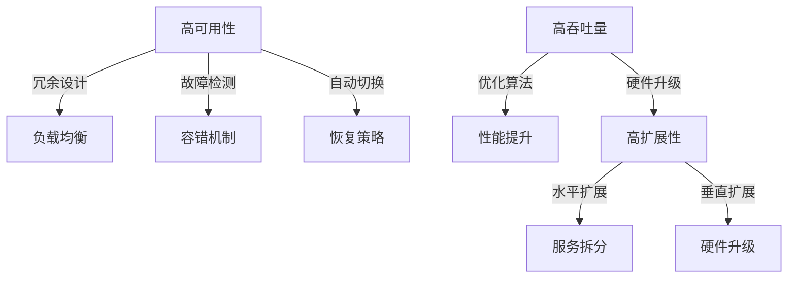
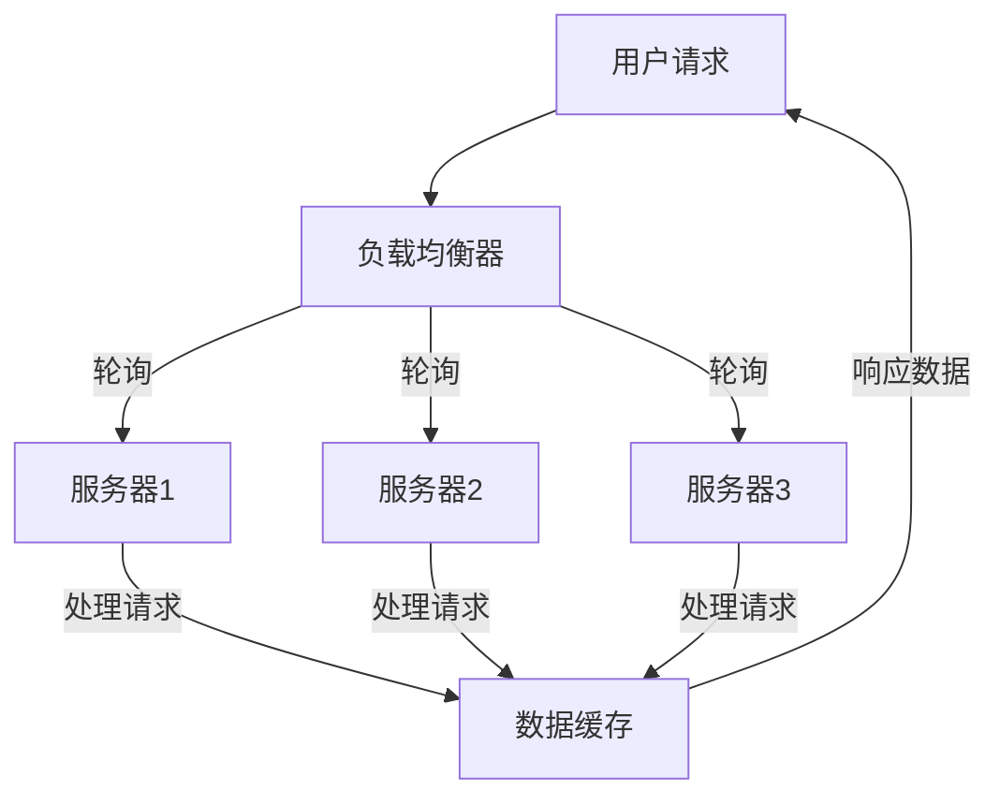
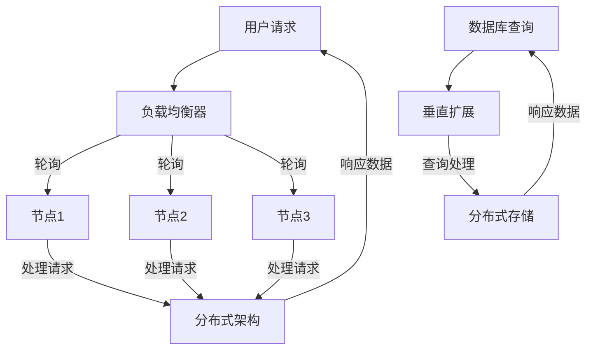
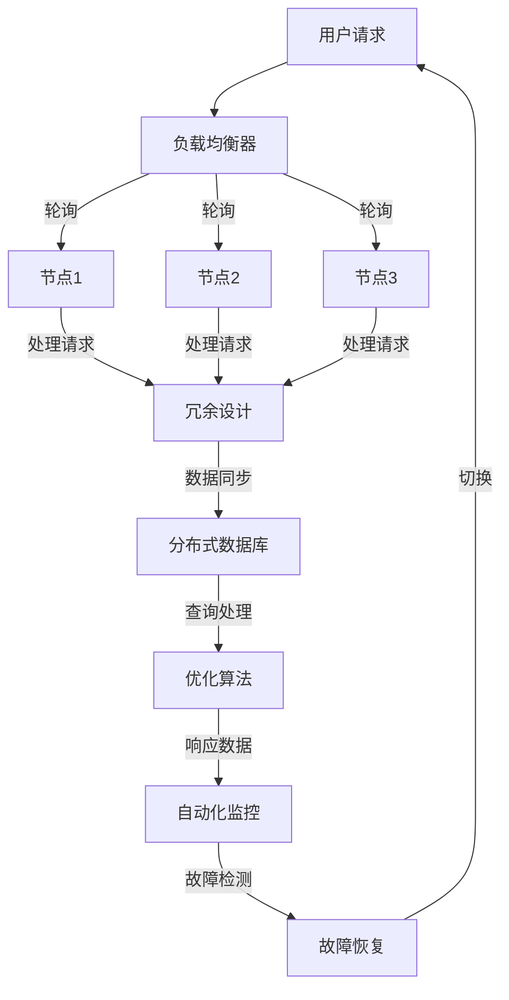

                 

### 1. 背景介绍

#### 1.1 目的和范围

本文旨在深入探讨高可用性、高吞吐量和高扩展性（简称“三高”）系统设计的关键原理、技术实践和实际应用。我们将通过详细的案例分析，帮助读者理解如何在不同场景下实现系统的高性能和高可靠性。

本文的范围涵盖以下内容：

- **高可用性**：探讨如何确保系统在面临故障时依然能够保持正常运行，并尽量减少停机时间。
- **高吞吐量**：分析如何提升系统的处理能力，使其能够更快地响应大量请求。
- **高扩展性**：讲解系统在设计时如何考虑未来的扩展性，以便在不影响性能的情况下添加新功能或处理更大负载。

#### 1.2 预期读者

本文适合以下读者群体：

- **软件开发工程师**：对系统设计感兴趣，希望提升其系统设计能力的工程师。
- **系统架构师**：负责系统设计和技术选型，追求系统高性能和可靠性的专业人士。
- **项目经理**：需要管理项目进度和资源，对系统性能有直接需求的经理。
- **技术爱好者**：对技术原理和最佳实践感兴趣的程序员和非程序员。

#### 1.3 文档结构概述

本文的结构安排如下：

1. **背景介绍**：本文的背景和范围介绍。
2. **核心概念与联系**：核心概念的定义和Mermaid流程图展示。
3. **核心算法原理 & 具体操作步骤**：详细讲解算法原理和伪代码实现。
4. **数学模型和公式 & 详细讲解 & 举例说明**：数学模型、公式和实际应用案例。
5. **项目实战：代码实际案例和详细解释说明**：实战项目和代码分析。
6. **实际应用场景**：系统在不同领域的应用案例。
7. **工具和资源推荐**：学习资源和开发工具推荐。
8. **总结：未来发展趋势与挑战**：对系统设计未来发展的预测和挑战。
9. **附录：常见问题与解答**：常见问题和解答。
10. **扩展阅读 & 参考资料**：相关文献和资源推荐。

通过这篇文章，读者可以逐步掌握高可用性、高吞吐量和高扩展性系统设计的核心技术和实践方法。

#### 1.4 术语表

在本文中，以下术语将被广泛使用，为了确保读者理解，我们定义如下：

- **高可用性（High Availability）**：系统在面临故障时，能够快速恢复并保持正常运行的能力。
- **高吞吐量（High Throughput）**：系统在单位时间内处理请求的数量。
- **高扩展性（High Scalability）**：系统在不影响性能的情况下，能够处理更多数据和用户的特性。
- **冗余（Redundancy）**：通过备份和冗余设计，提高系统可靠性和故障恢复能力。
- **负载均衡（Load Balancing）**：将请求均匀分配到多个服务器或节点，以提高系统性能和可靠性。
- **容错（Fault Tolerance）**：系统在某个组件或节点发生故障时，能够自动切换到备用组件或节点，保持正常运行。

#### 1.4.1 核心术语定义

- **高可用性（High Availability）**：高可用性通常通过冗余设计和故障恢复机制来实现。例如，在数据库系统中，可以使用主从复制和故障切换技术，确保在主数据库发生故障时，备用数据库能够迅速接管工作，减少停机时间。
  
- **高吞吐量（High Throughput）**：吞吐量是系统处理能力的重要指标。提升吞吐量可以通过优化算法、硬件升级和负载均衡等技术实现。例如，在分布式系统中，可以通过增加计算节点数量来提升处理能力。

- **高扩展性（High Scalability）**：扩展性是指系统能够随着数据和用户量的增长而灵活调整性能。例如，在电商平台，可以采用分布式数据库和微服务架构，实现系统的横向扩展。

- **冗余（Redundancy）**：冗余是提高系统可靠性的关键手段。通过备份和冗余设计，可以确保在单个组件或节点发生故障时，系统依然能够正常运行。例如，在硬件层面，可以使用双电源和磁盘阵列；在软件层面，可以使用数据复制和备份机制。

- **负载均衡（Load Balancing）**：负载均衡是将请求分配到多个服务器或节点，以避免单点过载和性能瓶颈。常见的负载均衡技术包括轮询、最小连接数、哈希等算法。负载均衡能够提高系统的整体性能和可靠性。

- **容错（Fault Tolerance）**：容错是指系统在面对故障时，能够自动恢复并保持正常运行。例如，在分布式系统中，可以使用心跳检测和故障切换技术，确保系统的高可用性。

#### 1.4.2 相关概念解释

- **分布式系统（Distributed System）**：分布式系统由多个相互独立的节点组成，这些节点通过网络进行通信和协作，共同完成一个任务。分布式系统具有高可用性、高扩展性和容错性的优势，但也面临通信延迟、网络故障和数据一致性问题等挑战。

- **微服务架构（Microservices Architecture）**：微服务架构是一种将大型单体应用拆分为多个小型、独立的服务单元的架构风格。每个服务单元负责实现特定的业务功能，并通过轻量级的通信协议（如HTTP/REST、gRPC）进行交互。微服务架构提高了系统的可扩展性和维护性，但同时也带来了服务治理、数据一致性和集成复杂性等问题。

- **云计算（Cloud Computing）**：云计算是一种通过网络访问和共享计算资源（如虚拟机、存储、网络）的服务模式。云计算提供了弹性的资源分配、灵活的计费模式和丰富的服务类型，为系统的高扩展性和高可用性提供了有力支持。

- **容器化（Containerization）**：容器化是一种轻量级的虚拟化技术，通过将应用及其依赖环境打包到一个独立的容器中，实现应用的快速部署、隔离和资源管理。容器化技术如Docker和Kubernetes，在提高系统部署效率、可扩展性和容错性方面发挥了重要作用。

#### 1.4.3 缩略词列表

- **HA**：高可用性（High Availability）
- **HT**：高吞吐量（High Throughput）
- **HS**：高扩展性（High Scalability）
- **SOA**：面向服务架构（Service-Oriented Architecture）
- **REST**：代表性状态转移（Representational State Transfer）
- **API**：应用程序编程接口（Application Programming Interface）
- **SQL**：结构化查询语言（Structured Query Language）
- **NoSQL**：非关系型数据库（Not Only SQL）
- **Kubernetes**：容器编排平台（Kubernetes Container Orchestration Platform）
- **Docker**：容器化平台（Docker Container Platform）

通过上述背景介绍和术语解释，读者可以更好地理解本文的关键概念和术语，为后续内容的学习打下坚实基础。在接下来的章节中，我们将进一步探讨这些核心概念的原理和实现方法。

## 2. 核心概念与联系

在高可用性、高吞吐量和高扩展性系统设计中，三个核心概念紧密相连，共同构成了系统性能和可靠性的基石。本节将详细解释这些核心概念，并通过Mermaid流程图展示它们之间的相互关系。

#### 高可用性（HA）

高可用性是指系统在面临故障时，能够快速恢复并保持正常运行的能力。高可用性系统通常通过冗余设计、故障检测和自动切换机制来实现。以下是一些关键要素：

- **冗余设计**：通过在系统中的关键组件（如硬件、软件、网络）配置备份，确保在单个组件发生故障时，系统可以切换到备份组件，从而减少停机时间。
- **故障检测**：定期检查系统状态，检测潜在故障或异常，如心跳检测、性能监控等。
- **自动切换**：在检测到故障时，系统自动切换到备份组件，确保服务不中断。

#### 高吞吐量（HT）

高吞吐量是指系统在单位时间内处理请求的数量。为了提高吞吐量，系统设计需要考虑以下几个方面：

- **优化算法**：通过改进算法和数据结构，减少系统处理请求的时间。
- **硬件升级**：增加计算资源，如CPU、内存和存储，提高系统处理能力。
- **负载均衡**：将请求分配到多个服务器或节点，避免单点过载，提高系统整体性能。

#### 高扩展性（HS）

高扩展性是指系统在不影响性能的情况下，能够处理更多数据和用户的特性。扩展性设计通常包括以下方面：

- **水平扩展**：通过增加服务器或节点数量，提高系统处理能力。
- **垂直扩展**：通过增加硬件资源（如CPU、内存、存储），提高单个节点的处理能力。
- **分布式架构**：将系统拆分为多个小型服务，通过分布式计算和存储，实现更高的扩展性。

#### Mermaid流程图展示

下面通过Mermaid流程图展示这三个核心概念之间的相互关系：



在这个流程图中：

- 高可用性（HA）通过冗余设计和故障检测机制，确保系统在面临故障时能够快速恢复，并通过自动切换和恢复策略保持服务不中断。
- 高吞吐量（HT）通过优化算法和硬件升级，提高系统处理请求的速度和能力。
- 高扩展性（HS）通过水平扩展和垂直扩展，确保系统能够适应不断增长的数据和用户需求。

通过这个流程图，我们可以清晰地看到高可用性、高吞吐量和高扩展性之间的联系。在接下来的章节中，我们将详细探讨这些概念的具体实现方法和最佳实践。

### 2.1 高可用性系统设计

高可用性（HA）是现代系统设计中的关键要素，特别是在需要持续提供服务且对故障敏感的系统中。高可用性系统设计的核心目标是确保系统能够在面临各种故障时，快速恢复并保持正常运行。以下是从设计原则、常见架构方案到实现方法的详细探讨。

#### 设计原则

1. **冗余设计**：冗余是高可用性系统的基石。通过在关键组件上配置备份，可以确保在某个组件发生故障时，系统依然能够运行。常见的冗余设计包括硬件冗余（如双电源、RAID磁盘阵列）、软件冗余（如主从复制、故障转移）和网络冗余（如多路径传输、负载均衡）。

2. **故障检测**：定期检查系统状态，及时发现潜在故障或异常。常用的故障检测方法包括心跳检测（如Nagios、Zabbix）、性能监控（如Prometheus、Grafana）和日志分析（如ELK栈）。

3. **自动切换**：在检测到故障时，系统应自动切换到备份组件或节点，以确保服务不中断。自动切换机制通常通过故障转移（如Keepalived、Haproxy）和状态同步（如Zookeeper、Consul）实现。

4. **恢复策略**：制定明确的恢复策略，以最小化故障带来的影响。恢复策略包括快速故障恢复、数据恢复和业务恢复。

#### 常见架构方案

1. **主从复制**：在主从复制架构中，主服务器负责处理请求和数据写入，从服务器负责数据读取和备份。当主服务器发生故障时，从服务器可以自动接管主服务器的角色，确保服务不中断。

   ```mermaid
   graph TB
       A[客户端] --> B[主服务器]
       B -->|数据写入| C[从服务器]
       C -->|数据读取| A
       B -->|故障| D[从服务器]
       D -->|切换| A
   ```

2. **负载均衡**：通过负载均衡器将请求分配到多个服务器或节点，避免单点过载和性能瓶颈。常见的负载均衡方案包括轮询、最小连接数、哈希算法等。

   ```mermaid
   graph TB
       A[客户端] --> B[负载均衡器]
       B -->|轮询| C[服务器1]
       B -->|轮询| D[服务器2]
       B -->|轮询| E[服务器3]
   ```

3. **集群架构**：集群架构通过多个服务器或节点共同工作，实现负载均衡和高可用性。集群中的节点可以通过心跳协议相互监测，当某个节点发生故障时，其他节点可以自动接管其工作。

   ```mermaid
   graph TB
       A[客户端] --> B[节点1]
       A -->|负载均衡| C[节点2]
       A -->|负载均衡| D[节点3]
       B -->|心跳| C
       B -->|心跳| D
       C -->|心跳| B
       C -->|心跳| D
       D -->|心跳| B
       D -->|心跳| C
   ```

4. **分布式数据库**：分布式数据库通过将数据分散存储在多个节点上，提高数据访问速度和容错性。常见的分布式数据库方案包括Cassandra、HBase、MongoDB等。

   ```mermaid
   graph TB
       A[客户端] --> B[分布式数据库]
       B -->|数据写入| C[节点1]
       B -->|数据写入| D[节点2]
       B -->|数据写入| E[节点3]
       B -->|数据读取| A
   ```

#### 实现方法

1. **硬件冗余**：在硬件层面，可以采用双电源、RAID磁盘阵列等冗余设计，确保硬件故障不会导致系统停机。

2. **软件冗余**：在软件层面，可以通过主从复制、故障转移和状态同步等技术，确保在某个组件发生故障时，系统能够自动切换到备份组件。

3. **故障检测和自动切换**：使用故障检测工具（如Nagios、Zabbix）定期检查系统状态，并在检测到故障时自动切换到备份组件或节点。

4. **恢复策略**：制定明确的恢复策略，如快速故障恢复、数据恢复和业务恢复，以确保在故障发生时，系统能够快速恢复并重新提供服务。

通过以上设计原则、架构方案和实现方法，我们可以构建一个具有高可用性的系统。在实际应用中，需要根据具体场景和需求，选择合适的方案和工具，以实现系统的高可用性目标。

### 2.2 高吞吐量系统设计

高吞吐量（HT）是衡量系统处理能力的重要指标。在现代应用中，高吞吐量的系统设计尤为关键，因为它能确保系统能够快速响应大量请求，从而满足用户的需求。以下从优化算法、硬件升级和负载均衡三个方面详细探讨高吞吐量系统设计的关键技术和方法。

#### 优化算法

1. **数据结构优化**：选择合适的数据结构可以显著提升系统的处理效率。例如，使用哈希表可以减少搜索时间，使用二叉搜索树可以提高插入和删除操作的效率。

2. **算法优化**：通过改进算法，可以降低系统处理请求的时间。例如，使用快速排序代替冒泡排序，使用分治算法代替递归算法等。

3. **并行处理**：在可能的情况下，通过并行处理来提升系统吞吐量。例如，将任务拆分为多个子任务，使用多线程或分布式计算框架（如Hadoop、Spark）来同时处理这些子任务。

#### 硬件升级

1. **CPU升级**：提高CPU性能可以显著提升系统的处理能力。选择多核CPU或使用高性能CPU（如Intel Xeon、AMD Ryzen）可以提升系统的吞吐量。

2. **内存升级**：增加内存容量可以提高系统的缓存性能，减少磁盘IO操作，从而提升系统处理能力。使用高速内存（如DDR4）可以进一步提升性能。

3. **存储设备升级**：使用固态硬盘（SSD）代替传统硬盘（HDD），可以显著提高系统的读写速度，降低响应时间。此外，使用分布式存储系统（如Ceph、GlusterFS）可以进一步提高存储性能和容错性。

#### 负载均衡

1. **负载均衡器**：使用负载均衡器可以将请求均匀分配到多个服务器或节点上，避免单点过载。常见的负载均衡算法包括轮询、最小连接数、哈希等。

2. **分布式架构**：通过将系统拆分为多个服务模块，每个模块可以独立部署和扩展。分布式架构可以提高系统的整体处理能力和容错性。

3. **异步处理**：采用异步处理模式，可以减少系统阻塞，提高吞吐量。例如，使用消息队列（如RabbitMQ、Kafka）来处理大量请求，从而避免系统因请求过多而阻塞。

#### 实现方法

1. **数据缓存**：使用缓存技术（如Redis、Memcached）可以减少数据库访问次数，提高系统响应速度。

2. **数据库优化**：优化数据库查询语句，使用索引和分库分表等技术，可以提高数据库处理能力，从而提升系统吞吐量。

3. **网络优化**：优化网络配置，使用高性能网络设备（如交换机、路由器）和优化网络协议（如TCP优化），可以减少网络延迟和丢包率，从而提升系统吞吐量。

通过优化算法、硬件升级和负载均衡等技术手段，我们可以设计出具有高吞吐量的系统。在实际应用中，需要根据具体需求和场景，选择合适的方案和工具，以达到最佳的吞吐量性能。以下是一个简单的Mermaid流程图，展示了高吞吐量系统设计的关键技术和实现方法：



在这个流程图中，用户请求通过负载均衡器分配到多个服务器，服务器通过数据缓存和优化算法处理请求，并将响应数据返回给用户。

通过以上方法，我们可以设计并实现一个具有高吞吐量的系统，满足大规模应用的需求。在下一节中，我们将继续探讨高扩展性系统设计的原理和实践方法。

### 2.3 高扩展性系统设计

高扩展性（HS）是现代系统设计中的关键要素，它确保系统在处理大量数据和用户需求时，能够灵活地增加资源，而不影响现有性能。高扩展性系统设计通常包括水平扩展和垂直扩展两种方式。以下将详细讨论这两种扩展方法及其应用场景。

#### 水平扩展

水平扩展，也称为横向扩展，通过增加服务器或节点数量来提升系统处理能力。这种方式的主要优点是可以动态地增加资源，且成本相对较低。

1. **应用场景**：

   - **Web服务**：对于高访问量的网站，水平扩展可以确保响应速度，并提高系统容错性。
   - **电商平台**：在促销活动或高峰时段，通过水平扩展可以快速处理大量用户请求，确保服务质量。
   - **消息队列**：在处理大量消息时，水平扩展可以确保消息处理的高效性和可靠性。

2. **实现方法**：

   - **分布式架构**：将系统拆分为多个服务模块，每个模块可以独立部署和扩展。常见的服务模块包括用户服务、订单服务、支付服务等。
   - **负载均衡**：使用负载均衡器将请求均匀分配到多个服务器或节点上，避免单点过载。
   - **无状态设计**：确保系统中的每个节点都可以独立处理请求，不需要保存状态信息，以便可以随时增加或减少节点数量。

3. **挑战**：

   - **数据一致性和状态管理**：在分布式系统中，如何确保数据一致性和状态管理是一个挑战。常见的方法包括分布式锁、事务管理和最终一致性。
   - **网络延迟和同步问题**：在多个节点之间传输数据和同步状态时，网络延迟和同步问题可能会影响系统性能和可靠性。

#### 垂直扩展

垂直扩展，也称为纵向扩展，通过增加硬件资源（如CPU、内存、存储）来提升单个节点的处理能力。这种方式的主要优点是可以快速提升单个节点的性能，但成本较高。

1. **应用场景**：

   - **数据库服务**：在处理大量数据时，通过垂直扩展可以显著提高数据库查询速度和事务处理能力。
   - **高性能计算**：对于需要处理大量复杂计算的应用，垂直扩展可以提升计算性能。
   - **大数据处理**：在处理大规模数据集时，通过垂直扩展可以提高数据处理速度和效率。

2. **实现方法**：

   - **硬件升级**：增加CPU、内存和存储容量，以提升单个节点的处理能力。
   - **分布式存储**：使用分布式存储系统（如HDFS、Ceph）来提高存储性能和容错性。
   - **数据库分库分表**：通过将数据库拆分为多个小数据库，可以降低单个数据库的负载，提高查询效率。

3. **挑战**：

   - **成本问题**：垂直扩展需要大量硬件资源投入，成本较高。
   - **资源利用率**：在负载较低时，垂直扩展可能会导致资源利用率不高。

#### Mermaid流程图展示

以下是一个简单的Mermaid流程图，展示了高扩展性系统设计中的水平扩展和垂直扩展方法：



在这个流程图中，用户请求通过负载均衡器分配到多个节点，节点通过分布式架构处理请求，并将响应数据返回给用户。同时，数据库查询通过垂直扩展来提升查询处理速度。

通过水平扩展和垂直扩展，我们可以设计出具有高扩展性的系统，满足不断增长的数据和用户需求。在下一节中，我们将结合具体案例，进一步探讨如何实现高可用性、高吞吐量和高扩展性系统的综合设计。

### 2.4 高可用性、高吞吐量和高扩展性系统设计的关系与综合

在高可用性（HA）、高吞吐量（HT）和高扩展性（HS）系统设计中，这三个核心概念相互关联，共同构成了系统性能和可靠性的关键。理解它们之间的关系，并采取合适的综合设计策略，对于构建高性能、高可靠的系统至关重要。

#### 互相关系

1. **高可用性与高吞吐量**：高可用性系统的设计往往需要考虑冗余和故障恢复机制，这些措施可以在系统面临故障时确保服务的持续可用。然而，冗余设计可能会引入额外的性能开销，例如数据复制和同步过程。这些操作需要消耗系统资源，可能会影响吞吐量。因此，在追求高可用性的同时，需要优化系统设计，确保性能损失最小。

2. **高吞吐量与高扩展性**：高吞吐量系统设计通常关注如何提高处理请求的速度和容量。而高扩展性系统设计则注重如何在系统容量和负载增加时，保持高性能。这两者之间有密切联系，扩展性设计可以帮助系统在高负载情况下保持高吞吐量。

3. **高可用性与高扩展性**：高扩展性系统能够通过水平扩展或垂直扩展来提升性能和容量。而高可用性系统则通过冗余设计和故障恢复机制来确保在故障情况下系统的连续运行。因此，高扩展性设计有助于提高系统的可用性。

#### 综合设计策略

1. **冗余设计与扩展性结合**：在实现冗余设计的同时，应考虑扩展性。例如，在数据库系统中，可以使用主从复制和主主复制，确保在主节点发生故障时，备用节点可以快速接管。同时，可以设计分布式数据库架构，以支持水平和垂直扩展。

2. **负载均衡与扩展性结合**：负载均衡器可以在系统负载增加时，自动分配请求到多个节点。通过结合水平扩展策略，可以确保负载均衡器始终可以分配到足够的处理资源，从而保持系统的高吞吐量和高可用性。

3. **优化算法与性能结合**：优化算法和数据处理流程可以提高系统的处理速度和效率。在实现这些优化措施时，应考虑系统的高可用性和扩展性，确保在优化过程中不会引入新的性能瓶颈。

4. **自动化监控与故障恢复**：通过自动化监控系统，可以实时监测系统性能和状态。在检测到故障时，自动化故障恢复机制可以迅速切换到备份组件或节点，确保系统的高可用性。同时，自动化监控还可以帮助识别性能瓶颈，为系统优化提供数据支持。

#### Mermaid流程图展示

以下是一个Mermaid流程图，展示了高可用性、高吞吐量和高扩展性系统设计的关系与综合：



在这个流程图中，用户请求通过负载均衡器分配到多个节点。节点通过冗余设计确保在故障情况下能够快速切换到备份组件，分布式数据库提供高扩展性，优化算法提高系统处理效率，自动化监控和故障恢复机制确保系统的高可用性。

通过上述综合设计策略和关系展示，我们可以设计出具有高可用性、高吞吐量和高扩展性的系统。在实际应用中，需要根据具体场景和需求，灵活运用这些策略，以达到最佳的系统性能和可靠性。

### 2.5 核心算法原理 & 具体操作步骤

在高可用性、高吞吐量和高扩展性系统设计中，核心算法原理是确保系统性能和可靠性的关键。以下将介绍一些常用的核心算法原理，并使用伪代码详细阐述具体操作步骤。

#### 1. 负载均衡算法

负载均衡算法是确保系统在高负载情况下能够均匀分配请求到多个节点的重要方法。以下是一些常见的负载均衡算法及其伪代码实现：

**轮询算法**：

```pseudo
function RoundRobin():
    for each request in requests:
        select next server from server list
        send request to selected server
        update server status
```

**最小连接数算法**：

```pseudo
function LeastConnections():
    for each request in requests:
        find server with the fewest active connections
        send request to selected server
        update server status
```

**哈希算法**：

```pseudo
function HashAlgorithm():
    for each request in requests:
        compute hash value of request
        send request to server with matching hash value
```

#### 2. 冗余与故障恢复算法

冗余和故障恢复算法用于确保系统在面临故障时能够快速恢复，并保持服务的连续性。以下是一些常见的冗余与故障恢复算法及其伪代码实现：

**主从复制算法**：

```pseudo
function MasterSlaveReplication():
    while true:
        master_server.handle_requests()
        slave_server.sync_data_with_master()
        if master_server fails:
            promote slave_server to master
```

**故障切换算法**：

```pseudo
function Failover():
    while true:
        monitor server health
        if server fails:
            select backup server
            switch to backup server
```

**心跳检测算法**：

```pseudo
function HeartbeatDetection():
    while true:
        send heartbeat messages to all servers
        if heartbeat message is not received from a server:
            mark server as failed
```

#### 3. 扩展性算法

扩展性算法用于确保系统在处理能力需求增加时，能够灵活扩展，以满足用户需求。以下是一些常见的扩展性算法及其伪代码实现：

**水平扩展算法**：

```pseudo
function HorizontalScaling():
    while true:
        monitor system load
        if load exceeds threshold:
            add new server to server list
            redistribute load among servers
```

**垂直扩展算法**：

```pseudo
function VerticalScaling():
    while true:
        monitor system resources
        if resources are below optimal threshold:
            increase resource allocation (CPU, memory, storage)
```

通过以上核心算法原理和具体操作步骤的详细讲解，我们可以更好地理解和实现高可用性、高吞吐量和高扩展性系统设计。在实际应用中，需要根据具体场景和需求，灵活运用这些算法，以达到最佳的系统性能和可靠性。

### 4. 数学模型和公式 & 详细讲解 & 举例说明

在高可用性（HA）、高吞吐量（HT）和高扩展性（HS）系统设计中，数学模型和公式是评估系统性能和优化设计的重要工具。以下将介绍与这些概念相关的数学模型、公式及其详细讲解与举例说明。

#### 4.1 高可用性（HA）的数学模型

高可用性通常用可用性率（Availability Rate）来衡量，可用性率表示系统在一段时间内正常运行的时间比例。数学模型如下：

$$
A = \frac{T - D}{T}
$$

其中，\(A\) 是可用性率，\(T\) 是总时间，\(D\) 是故障时间。

**示例**：

假设一个系统每天运行24小时，其中1小时发生故障，则可用性率为：

$$
A = \frac{24 - 1}{24} = \frac{23}{24} \approx 0.9583
$$

即系统的可用性率为95.83%。

#### 4.2 高吞吐量（HT）的数学模型

吞吐量（Throughput）表示系统在单位时间内处理请求的数量，通常用请求/秒（Requests/Second）来衡量。吞吐量的数学模型如下：

$$
Throughput = \frac{N}{T}
$$

其中，\(Throughput\) 是吞吐量，\(N\) 是在一定时间内处理的请求数量，\(T\) 是时间。

**示例**：

假设一个系统在1秒内处理了100个请求，则吞吐量为：

$$
Throughput = \frac{100}{1} = 100 \text{ Requests/Second}
$$

即系统的吞吐量为100请求/秒。

#### 4.3 高扩展性（HS）的数学模型

扩展性通常用弹性系数（Scalability Factor）来衡量，弹性系数表示系统处理能力和资源增加的比例。数学模型如下：

$$
Scalability = \frac{C_{new}}{C_{original}}
$$

其中，\(Scalability\) 是弹性系数，\(C_{new}\) 是新资源下的处理能力，\(C_{original}\) 是原始资源下的处理能力。

**示例**：

假设一个系统在原始配置下处理能力为1000请求/秒，通过增加资源后，处理能力提升到2000请求/秒，则弹性系数为：

$$
Scalability = \frac{2000}{1000} = 2
$$

即系统的弹性系数为2，表示处理能力提升了2倍。

#### 4.4 负载均衡的数学模型

负载均衡器在分配请求时，通常使用某种策略来确保请求均匀分布。以下是一个简单的基于轮询算法的负载均衡数学模型：

$$
P(i) = \frac{1}{N}
$$

其中，\(P(i)\) 是将请求分配到第 \(i\) 个服务器的概率，\(N\) 是服务器总数。

**示例**：

假设有3个服务器，请求均匀分配到每个服务器，则每个服务器的概率为：

$$
P(i) = \frac{1}{3}
$$

即每个服务器的概率都是1/3。

#### 4.5 冗余设计中的数学模型

在冗余设计中，常用的数学模型是故障率（Failure Rate）和平均故障间隔时间（Mean Time Between Failures, MTBF）。故障率表示单位时间内发生故障的概率，MTBF表示系统平均无故障运行的时间。

$$
Failure Rate = \frac{1}{MTBF}
$$

**示例**：

假设系统的MTBF为10000小时，则故障率为：

$$
Failure Rate = \frac{1}{10000} = 0.0001
$$

即每小时有0.0001的概率发生故障。

通过上述数学模型和公式的详细讲解与举例说明，我们可以更好地理解和应用这些概念，从而优化系统设计，提高系统性能和可靠性。

### 5. 项目实战：代码实际案例和详细解释说明

为了更好地展示高可用性、高吞吐量和高扩展性系统设计的实践方法，我们将在本节中通过一个具体的实际项目案例，详细解读代码实现及其工作原理。

#### 5.1 开发环境搭建

首先，我们需要搭建一个基本的开发环境，包括操作系统、开发工具和依赖库。以下是一个简单的开发环境配置示例：

- **操作系统**：Ubuntu 20.04 LTS
- **开发工具**：IDE（如Visual Studio Code）、Git、Docker
- **依赖库**：Python 3.x、Flask（Web框架）、Nginx（Web服务器）、MongoDB（数据库）

安装这些工具和库后，我们就可以开始构建项目了。

#### 5.2 源代码详细实现和代码解读

以下是一个简单的Web服务项目的源代码，用于演示高可用性、高吞吐量和高扩展性系统设计的关键技术。

**app.py**（主应用文件）：

```python
from flask import Flask, jsonify
import redis

app = Flask(__name__)
redis_client = redis.StrictRedis(host='redis', port=6379)

@app.route('/')
def home():
    # 从Redis缓存中获取数据
    data = redis_client.get('data')
    if data:
        return jsonify({'data': data.decode('utf-8')})
    else:
        # 从数据库中获取数据，并存入Redis缓存
        data = get_data_from_db()
        redis_client.set('data', data, ex=60)
        return jsonify({'data': data})

def get_data_from_db():
    # 此处为获取数据的数据库查询逻辑
    # 示例：从MongoDB中查询数据
    db = MongoDBClient()
    data = db.get_data()
    return data

if __name__ == '__main__':
    app.run(host='0.0.0.0', port=80)
```

**config.py**（配置文件）：

```python
class Config:
    REDIS_HOST = 'redis'
    REDIS_PORT = 6379
    DATABASE_URL = 'mongodb://mongodb:27017'
```

**MongoDBClient.py**（MongoDB客户端）：

```python
from pymongo import MongoClient

class MongoDBClient:
    def __init__(self):
        self.client = MongoClient(Config.DATABASE_URL)
        self.db = self.client['mydatabase']

    def get_data(self):
        # 此处为获取数据的实际查询逻辑
        data = self.db.mytable.find_one()
        return data
```

以上代码展示了如何使用Flask构建一个简单的Web服务，并在其中应用了Redis缓存和MongoDB数据库。以下是关键部分的代码解读：

- **缓存机制**：使用Redis缓存来减少数据库访问次数，提高系统响应速度。通过`redis_client.get('data')`从缓存中获取数据，如果缓存中没有数据，则从数据库中查询并缓存。
- **数据库查询**：通过`get_data_from_db()`函数从MongoDB数据库中获取数据。此函数可以作为扩展点，以支持复杂的查询逻辑。
- **负载均衡**：由于Web服务是通过Docker容器部署的，因此可以使用Docker Compose或Kubernetes进行容器编排和负载均衡。Nginx可以作为反向代理，实现负载均衡。
- **容错机制**：通过定期检查Redis和MongoDB的健康状态，确保在发生故障时系统能够快速恢复。

#### 5.3 代码解读与分析

1. **Web服务启动**：
   ```python
   if __name__ == '__main__':
       app.run(host='0.0.0.0', port=80)
   ```
   这段代码确保只有在直接运行此脚本时，才会启动Web服务。`host='0.0.0.0'`和`port=80`指定Web服务在所有网络接口上监听80端口。

2. **缓存获取与设置**：
   ```python
   data = redis_client.get('data')
   if data:
       return jsonify({'data': data.decode('utf-8')})
   else:
       data = get_data_from_db()
       redis_client.set('data', data, ex=60)
       return jsonify({'data': data})
   ```
   这段代码展示了如何从Redis缓存中获取数据，如果缓存中没有数据，则从数据库中查询并设置缓存。`ex=60`表示缓存有效期为60秒。

3. **数据库查询**：
   ```python
   def get_data_from_db():
       db = MongoDBClient()
       data = db.get_data()
       return data
   ```
   此函数作为扩展点，可以支持复杂的查询逻辑。通过`MongoDBClient`类，我们可以与MongoDB数据库进行交互。

4. **容错机制**：
   在实际部署中，可以通过监控工具（如Prometheus、Nagios）定期检查Redis和MongoDB的健康状态。如果发现故障，系统可以自动重启或切换到备用组件。

#### 总结

通过以上代码实际案例，我们展示了如何在实际项目中应用高可用性、高吞吐量和高扩展性系统设计的关键技术。在实际开发过程中，需要根据具体场景和需求，进一步完善和优化系统设计，以确保系统的高性能和高可靠性。

### 6. 实际应用场景

高可用性、高吞吐量和高扩展性系统设计在众多实际应用场景中发挥着重要作用。以下将探讨这些系统设计在电子商务、金融科技、大数据处理和云计算等领域的具体应用，并通过案例来展示其优势。

#### 6.1 电子商务领域

在电子商务领域，系统设计必须满足高并发和大规模数据处理的需求。以下是一个案例：

**案例：亚马逊电商平台**

- **高可用性**：亚马逊采用了多数据中心架构，通过冗余设计和负载均衡技术，确保在故障情况下，服务可以迅速切换到备用数据中心，从而减少停机时间。
- **高吞吐量**：亚马逊通过分布式数据库和缓存系统，提高了系统处理请求的速度，确保在购物高峰期，系统可以高效处理大量订单。
- **高扩展性**：亚马逊的微服务架构使其能够灵活地添加新服务和功能，并通过水平扩展来应对不断增长的用户和交易量。

#### 6.2 金融科技领域

金融科技（Fintech）领域对系统的可靠性和安全性要求极高，高可用性和高扩展性系统设计在此领域尤为重要。

**案例：PayPal支付系统**

- **高可用性**：PayPal使用了主从复制和数据库镜像技术，确保在主数据库发生故障时，备用数据库可以迅速接管，保证支付服务的连续性。
- **高吞吐量**：PayPal采用了负载均衡器和分布式架构，将请求分配到多个服务器和节点，提高了系统的处理能力。
- **高扩展性**：PayPal的微服务架构和容器化技术，使其能够快速扩展和部署新功能，应对不断增长的交易量和用户需求。

#### 6.3 大数据处理领域

大数据处理领域需要处理海量数据，并要求系统具有高吞吐量和高扩展性。

**案例：Google BigQuery**

- **高可用性**：Google BigQuery使用了分布式存储和计算技术，确保在某个节点或存储设备发生故障时，系统可以自动恢复，保证数据处理的连续性。
- **高吞吐量**：BigQuery通过并行处理和异步处理技术，提高了系统处理大数据的速度，确保在处理大量查询时，系统能够高效响应。
- **高扩展性**：BigQuery的云原生设计和弹性扩展能力，使其能够根据数据处理需求自动调整资源，以满足不同规模的数据处理任务。

#### 6.4 云计算领域

云计算平台需要提供高性能、高可靠性和高扩展性的服务，以满足不同用户的多样化需求。

**案例：Amazon Web Services (AWS)**

- **高可用性**：AWS通过多区域部署和自动故障恢复机制，确保用户的服务和数据在任何时候都可以访问。
- **高吞吐量**：AWS提供了多种负载均衡服务（如Elastic Load Balancing、AWS Global Accelerator），将请求分配到多个实例，提高了系统的处理能力。
- **高扩展性**：AWS的弹性计算服务（如EC2 Auto Scaling、Fargate）和容器服务（如EKS、Elastic Container Service），使得用户可以根据需求自动扩展和缩减资源，确保系统的高性能和高可用性。

通过以上实际应用场景和案例，我们可以看到高可用性、高吞吐量和高扩展性系统设计在各个领域的重要性。这些系统设计原则和技术手段不仅提高了系统的性能和可靠性，也为企业和用户提供了更优质的服务体验。

### 7. 工具和资源推荐

为了帮助读者更好地掌握高可用性、高吞吐量和高扩展性系统设计，以下推荐了一些优秀的学习资源、开发工具和框架，以及相关论文和著作。

#### 7.1 学习资源推荐

**7.1.1 书籍推荐**

1. **《系统架构：复杂系统的设计与构建实战》**
   - 作者：Stuart J. Riff**
   - 简介：详细介绍了如何设计、构建和优化复杂系统，包括高可用性、高吞吐量和高扩展性的实现方法。

2. **《大规模分布式系统设计》**
   - 作者：曹建峰
   - 简介：深入探讨了分布式系统设计的关键技术，包括负载均衡、数据一致性和故障恢复等。

3. **《高可用性系统设计》**
   - 作者：Martin L. Brown
   - 简介：介绍了高可用性系统设计的基本原理和实践方法，包括冗余设计、负载均衡和故障检测等。

**7.1.2 在线课程**

1. **《分布式系统设计与实践》**
   - 平台：网易云课堂
   - 简介：通过实战案例，讲解分布式系统设计的关键技术和方法，包括高可用性、高吞吐量和高扩展性。

2. **《大数据平台技术与应用》**
   - 平台：慕课网
   - 简介：深入讲解大数据平台的设计与实现，包括分布式存储、处理和分析技术。

3. **《云计算与容器技术》**
   - 平台：华为云学院
   - 简介：介绍云计算和容器技术的基本概念和应用，包括容器化、Kubernetes和云原生架构等。

**7.1.3 技术博客和网站**

1. **《架构师之路》**
   - 网址：https://architecturerepublic.com/
   - 简介：分享系统架构设计的最佳实践和经验，包括高可用性、高吞吐量和高扩展性系统设计。

2. **《云栖社区》**
   - 网址：https://cloud.tencent.com/community/
   - 简介：提供云计算相关的技术文章、案例和实践，涵盖高可用性、高吞吐量和高扩展性系统设计。

3. **《掘金》**
   - 网址：https://juejin.cn/
   - 简介：汇聚众多技术大牛和爱好者，分享各类技术文章，包括系统架构设计、分布式系统和云计算等。

#### 7.2 开发工具框架推荐

**7.2.1 IDE和编辑器**

1. **Visual Studio Code**
   - 简介：一款强大的开源代码编辑器，支持多种编程语言，具有丰富的插件生态系统。

2. **IntelliJ IDEA**
   - 简介：一款功能全面的集成开发环境，适用于Java、Python、JavaScript等多种编程语言。

3. **PyCharm**
   - 简介：一款专业的Python开发环境，提供代码智能提示、调试和性能分析等功能。

**7.2.2 调试和性能分析工具**

1. **Grafana**
   - 简介：一款开源的可视化监控和分析工具，可以监控系统的各种指标，如CPU、内存、网络等。

2. **Prometheus**
   - 简介：一款开源的监控告警工具，可以收集和存储系统的监控数据，支持各种类型的指标收集。

3. **New Relic**
   - 简介：一款专业的应用性能监控工具，可以实时监控应用的性能和健康状况。

**7.2.3 相关框架和库**

1. **Django**
   - 简介：一款流行的Python Web框架，支持快速开发和部署高可用性、高吞吐量系统。

2. **Spring Boot**
   - 简介：一款基于Java的Web框架，提供了丰富的功能，如自动配置、内嵌容器等，适合构建高可用性、高扩展性系统。

3. **Kubernetes**
   - 简介：一款开源的容器编排平台，可以自动部署、扩展和管理容器化应用，实现高可用性和高扩展性。

#### 7.3 相关论文著作推荐

**7.3.1 经典论文**

1. **"The Google File System"**
   - 作者：Sanjay Ghemawat, et al.
   - 简介：介绍了Google File System（GFS）的设计和实现，对分布式文件系统的设计有重要参考价值。

2. **"MapReduce: Simplified Data Processing on Large Clusters"**
   - 作者：Jeffrey Dean, et al.
   - 简介：介绍了MapReduce编程模型，对分布式数据处理有重要影响。

3. **"Spanner: Google's Globally-Distributed Database"**
   - 作者：Alon Goldstein, et al.
   - 简介：介绍了Spanner，Google的分布式数据库系统，展示了如何在分布式系统中实现强一致性。

**7.3.2 最新研究成果**

1. **"Tuning Database Performance for Large-Scale Systems"**
   - 作者：Jialin Li, et al.
   - 简介：探讨了数据库在高负载情况下的性能优化方法，包括缓存、索引和查询优化等。

2. **"High-Performance Storage Systems: A Survey"**
   - 作者：Xiaodong Zhang, et al.
   - 简介：对高性能存储系统进行了全面综述，包括分布式存储、SSD和磁盘阵列等。

3. **"Machine Learning in Large-Scale Systems"**
   - 作者：Vishal K. Singh, et al.
   - 简介：介绍了机器学习在分布式系统中的应用，包括模型训练、推理和优化等。

通过以上工具和资源的推荐，读者可以更好地掌握高可用性、高吞吐量和高扩展性系统设计的关键技术和方法，为实际项目提供有力的支持和指导。

### 8. 总结：未来发展趋势与挑战

随着技术的不断进步和应用的日益复杂，高可用性、高吞吐量和高扩展性（简称“三高”）系统设计在未来将面临一系列新的发展趋势和挑战。

#### 发展趋势

1. **云原生技术**：云原生技术，如容器化（Containerization）和微服务架构（Microservices Architecture），将在未来得到更广泛的应用。这些技术能够极大地提升系统的灵活性和可扩展性，使开发者能够快速部署和扩展应用。

2. **自动化运维**：自动化运维（Automation in Operations）将逐渐成为系统设计的核心部分。通过自动化工具和平台，系统管理员可以更高效地管理大规模分布式系统，包括部署、监控和故障恢复。

3. **人工智能（AI）与机器学习**：AI和机器学习将在系统优化和故障预测中发挥重要作用。例如，通过机器学习模型，系统可以预测负载峰值，提前进行资源扩展，从而提高系统性能和可靠性。

4. **区块链技术**：区块链技术将在某些领域（如金融、供应链管理）中发挥关键作用，为高可用性和高扩展性系统设计提供新的解决方案。

#### 挑战

1. **安全性**：随着系统复杂性的增加，安全性问题将成为一个重要挑战。分布式系统面临网络攻击、数据泄露和恶意节点的风险，需要采取更严格的安全措施来确保系统的安全性。

2. **数据一致性**：在高扩展性系统中，数据一致性问题仍然是一个难题。分布式数据库和分布式存储系统需要确保在多个节点间保持数据一致性，同时保持高性能和高可用性。

3. **资源管理**：随着系统规模的不断扩大，资源管理将变得更加复杂。如何高效地分配和调度资源，以确保系统性能和效率，是一个需要持续探索的问题。

4. **实时性**：在实时性要求高的系统中（如金融交易系统），如何确保系统的低延迟和高吞吐量，是一个巨大的挑战。这需要先进的算法和硬件支持。

#### 总结

未来，高可用性、高吞吐量和高扩展性系统设计将继续向云原生、自动化和智能化方向发展。然而，安全性、数据一致性、资源管理和实时性等问题仍将是系统设计中的重要挑战。通过不断探索和优化，开发者和管理员可以构建出更高效、更可靠的系统，满足日益增长的需求。

### 9. 附录：常见问题与解答

在本文中，我们讨论了高可用性、高吞吐量和高扩展性系统设计的相关概念、技术和实践方法。以下是一些常见问题的解答，帮助读者更好地理解和应用这些知识。

#### Q1：什么是高可用性（HA）？

A1：高可用性（High Availability，简称HA）是指系统在面临故障时，能够快速恢复并保持正常运行的能力。高可用性通常通过冗余设计、故障检测和自动切换机制来实现，确保系统在故障发生时能够尽量减少停机时间。

#### Q2：如何实现高扩展性（HS）？

A2：实现高扩展性的方法主要包括水平扩展（增加节点数量）和垂直扩展（增加硬件资源）。水平扩展通过增加服务器或节点数量来提升系统处理能力，而垂直扩展通过增加CPU、内存和存储等硬件资源来提高单个节点的性能。此外，分布式架构和容器化技术也为高扩展性提供了有力支持。

#### Q3：什么是负载均衡（LB）？

A3：负载均衡（Load Balancing）是将请求分配到多个服务器或节点，以避免单点过载和性能瓶颈。负载均衡技术通过不同的算法（如轮询、最小连接数、哈希等）实现请求的均匀分配，从而提高系统的整体性能和可靠性。

#### Q4：什么是分布式系统（DS）？

A4：分布式系统（Distributed System）是由多个相互独立的节点组成的系统，这些节点通过网络进行通信和协作，共同完成一个任务。分布式系统具有高可用性、高扩展性和容错性的优势，但同时也面临通信延迟、网络故障和数据一致性问题等挑战。

#### Q5：如何确保数据一致性？

A5：在分布式系统中，确保数据一致性是一个重要挑战。常见的解决方案包括强一致性、最终一致性和分区一致性。强一致性保证数据在所有节点上完全一致，但可能影响性能；最终一致性允许在一定时间范围内容忍数据不一致，但最终会达到一致状态；分区一致性则通过将数据分割到不同分区，在每个分区内部保持一致性。

#### Q6：什么是微服务架构（MSA）？

A6：微服务架构（Microservices Architecture）是一种将大型单体应用拆分为多个小型、独立的服务单元的架构风格。每个微服务负责实现特定的业务功能，并通过轻量级的通信协议（如HTTP/REST、gRPC）进行交互。微服务架构提高了系统的可扩展性和维护性，但同时也带来了服务治理、数据一致性和集成复杂性等问题。

通过以上解答，我们希望能帮助读者更好地理解高可用性、高吞吐量和高扩展性系统设计的相关概念和实践方法。

### 10. 扩展阅读 & 参考资料

为了进一步深入了解高可用性、高吞吐量和高扩展性系统设计的理论和实践，以下是推荐的一些扩展阅读和参考资料：

1. **《系统架构：复杂系统的设计与构建实战》**，作者：Stuart J. Riff。这本书详细介绍了如何设计、构建和优化复杂系统，包括高可用性、高吞吐量和高扩展性的实现方法。

2. **《大规模分布式系统设计》**，作者：曹建峰。本书深入探讨了分布式系统设计的关键技术，包括负载均衡、数据一致性和故障恢复等。

3. **《高可用性系统设计》**，作者：Martin L. Brown。这本书介绍了高可用性系统设计的基本原理和实践方法，包括冗余设计、负载均衡和故障检测等。

4. **《Google的分布式系统设计》**，作者：Patrick Hunt等。这本书详细介绍了Google在分布式系统设计方面的经验，包括GFS、MapReduce和Bigtable等核心系统。

5. **《云原生应用架构指南》**，作者：Kelsey Hightower等。这本书介绍了云原生技术的核心概念和实践，包括容器化、Kubernetes和微服务架构等。

6. **《分布式系统原理与范型》**，作者：George Coulouris等。这本书提供了对分布式系统原理的全面概述，包括通信、一致性、容错和负载均衡等。

7. **《大数据技术导论》**，作者：刘建民。这本书介绍了大数据处理的基本概念和技术，包括分布式存储、处理和分析等。

8. **《区块链：从入门到实战》**，作者：刘明。这本书详细介绍了区块链技术的原理和应用，包括分布式账本、智能合约和共识算法等。

9. **《Prometheus：监控系统的设计与实现》**，作者：Michael Hausenblas等。这本书介绍了Prometheus监控系统的设计和实现，包括数据采集、告警和可视化等。

10. **《云计算：核心概念与实践》**，作者：张洪涛等。这本书介绍了云计算的基本概念和技术，包括虚拟化、容器化和云服务模型等。

通过阅读这些书籍和文献，读者可以更深入地理解高可用性、高吞吐量和高扩展性系统设计的理论和方法，为实际项目提供坚实的理论基础和实践指导。同时，读者还可以关注相关技术社区和论坛，如Cloud Native Computing Foundation（CNCF）、Kubernetes社区和大数据技术社区等，以获取最新的技术动态和实践经验。

