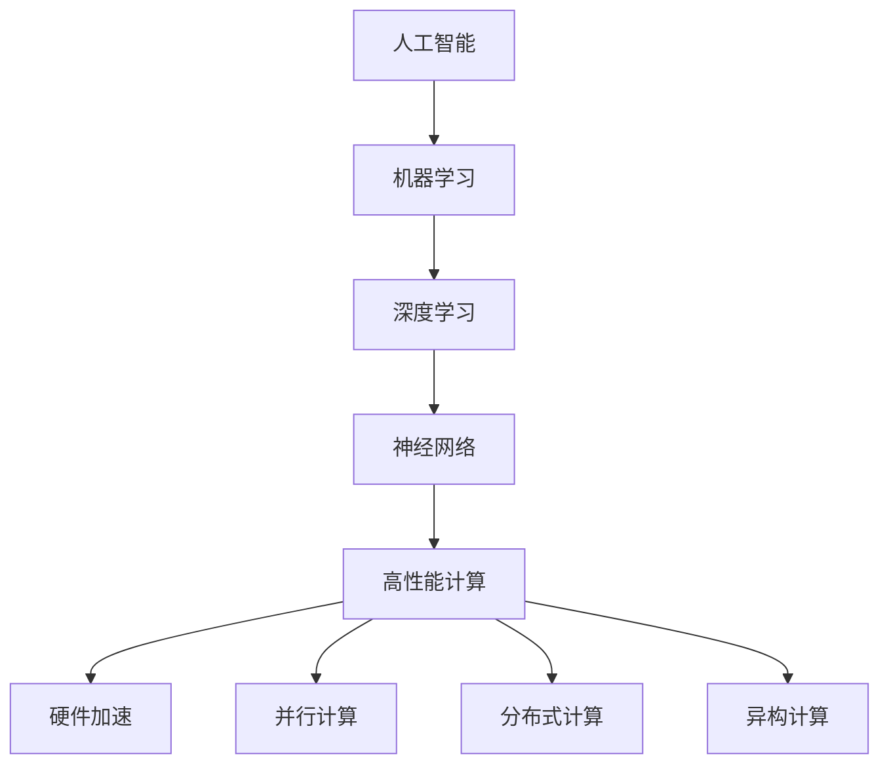
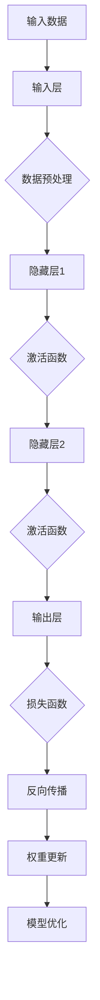

                 

# 高性能计算在AI中的前景

> **关键词：** 高性能计算、AI、机器学习、深度学习、硬件加速、神经网络、并行计算、计算资源、GPU、FPGA、分布式计算、异构计算

> **摘要：** 本文将深入探讨高性能计算在人工智能领域的前景。通过分析AI技术的发展趋势，以及高性能计算在其中的关键作用，我们旨在为读者提供一个全面的理解，展示如何利用高性能计算技术提升AI模型的训练速度和性能，探讨未来可能面临的挑战，以及提供相关的学习资源和工具推荐。

## 1. 背景介绍

### 1.1 目的和范围

本文旨在探讨高性能计算在人工智能领域中的应用前景，重点分析高性能计算对AI模型训练效率的影响，以及其在未来可能的发展方向。通过详细讲解核心概念、算法原理、数学模型和实际应用案例，我们希望为读者提供一份有深度、有思考、有见解的技术指南。

### 1.2 预期读者

本文面向对人工智能和计算技术有一定了解的技术人员、研究人员和学生。无论您是机器学习工程师、AI研究员，还是对AI技术充满好奇的普通读者，本文都希望能为您带来有价值的见解。

### 1.3 文档结构概述

本文分为十个部分，结构如下：

1. 背景介绍
    - 1.1 目的和范围
    - 1.2 预期读者
    - 1.3 文档结构概述
    - 1.4 术语表
2. 核心概念与联系
3. 核心算法原理 & 具体操作步骤
4. 数学模型和公式 & 详细讲解 & 举例说明
5. 项目实战：代码实际案例和详细解释说明
6. 实际应用场景
7. 工具和资源推荐
8. 总结：未来发展趋势与挑战
9. 附录：常见问题与解答
10. 扩展阅读 & 参考资料

### 1.4 术语表

#### 1.4.1 核心术语定义

- **高性能计算（High-Performance Computing，HPC）**：指使用高性能计算机系统和算法，处理大规模数据和高复杂度问题的计算技术。
- **人工智能（Artificial Intelligence，AI）**：模拟人类智能行为和决策的计算机技术，包括机器学习、深度学习、自然语言处理等领域。
- **机器学习（Machine Learning，ML）**：通过数据驱动的方式，让计算机自动学习和改进算法，实现智能行为的子领域。
- **深度学习（Deep Learning，DL）**：基于多层神经网络，对数据进行自动化特征提取和模式识别的技术。
- **神经网络（Neural Network，NN）**：模拟生物神经系统的计算模型，通过调整连接权重实现学习功能。

#### 1.4.2 相关概念解释

- **硬件加速**：通过使用GPU、FPGA等专用硬件加速计算，提高计算速度。
- **并行计算**：将计算任务分解为多个子任务，在多个计算单元上同时执行。
- **分布式计算**：将计算任务分布在多个计算节点上，通过通信网络协同工作。
- **异构计算**：利用不同类型的计算资源（如CPU、GPU、FPGA等），实现计算任务的优化。

#### 1.4.3 缩略词列表

- **HPC**：高性能计算
- **AI**：人工智能
- **ML**：机器学习
- **DL**：深度学习
- **NN**：神经网络
- **GPU**：图形处理单元
- **FPGA**：现场可编程门阵列
- **CPU**：中央处理器

## 2. 核心概念与联系

### 高性能计算与人工智能的联系

高性能计算（HPC）与人工智能（AI）之间存在密切的联系。AI算法，尤其是深度学习（DL），通常需要处理大规模数据和高复杂度计算任务。HPC技术通过提供强大的计算能力，可以显著提升AI模型的训练速度和性能。以下是一个简单的 Mermaid 流程图，展示了HPC在AI中的关键作用。



在这个流程图中，我们可以看到：

1. **人工智能**是整个流程的起点，它涵盖了所有与智能行为相关的技术。
2. **机器学习**是AI的一个重要分支，它使用数据来训练模型。
3. **深度学习**是机器学习的一个子领域，它使用多层神经网络进行复杂的数据分析和模式识别。
4. **神经网络**是DL的核心组成部分，它模拟生物神经系统的计算模型。
5. **高性能计算**在这一过程中起到了关键作用，通过硬件加速、并行计算、分布式计算和异构计算等技术，提升计算性能。

### 高性能计算在AI中的应用

高性能计算在AI中的应用主要体现在以下几个方面：

1. **加速算法训练**：HPC技术可以显著提升机器学习算法的训练速度，特别是深度学习模型，它们通常需要处理数百万甚至数十亿个参数。
2. **处理大规模数据**：AI模型训练通常需要大量数据，HPC技术能够高效处理这些大规模数据集，提供更准确的模型训练结果。
3. **支持复杂计算任务**：HPC平台能够处理高复杂度的计算任务，例如复杂的物理模拟、金融分析和生物信息学等。
4. **支持实时应用**：对于实时性要求较高的AI应用，如自动驾驶、实时视频分析和智能医疗等，HPC技术可以提供足够的计算能力来支持这些应用。

## 3. 核心算法原理 & 具体操作步骤

### 3.1 深度学习算法原理

深度学习（DL）是一种基于多层神经网络（NN）的机器学习（ML）技术，它通过模仿人脑神经元的工作方式，实现对数据的特征提取和模式识别。以下是一个简单的深度学习算法原理图。



在这个流程图中，我们可以看到：

1. **输入数据**：输入层接收原始数据，如图像、文本或音频。
2. **数据预处理**：对输入数据进行标准化、归一化等预处理操作，以提高训练效果。
3. **隐藏层**：数据经过多层隐藏层处理，每一层都能提取更高层次的特征。
4. **激活函数**：隐藏层输出经过激活函数处理，以引入非线性特性。
5. **输出层**：输出层生成最终预测结果，如分类标签或回归值。
6. **损失函数**：通过计算预测值与实际值之间的差距，评估模型性能。
7. **反向传播**：计算损失函数对权重的梯度，更新权重，优化模型。
8. **模型优化**：通过多次迭代训练，不断优化模型参数，提高模型准确性。

### 3.2 高性能计算在深度学习中的应用

高性能计算在深度学习中的应用主要体现在以下几个方面：

1. **硬件加速**：使用GPU、FPGA等硬件加速计算，提高神经网络训练速度。以下是一个简单的伪代码，展示了如何使用GPU加速深度学习模型训练。

```python
import tensorflow as tf

# 定义计算图
model = tf.keras.Sequential([
    tf.keras.layers.Dense(128, activation='relu', input_shape=(784,)),
    tf.keras.layers.Dropout(0.2),
    tf.keras.layers.Dense(10, activation='softmax')
])

# 编译模型
model.compile(loss='categorical_crossentropy',
              optimizer=tf.keras.optimizers.Adam(),
              metrics=['accuracy'])

# 使用GPU训练模型
model.fit(x_train, y_train,
          batch_size=128,
          epochs=10,
          validation_data=(x_val, y_val),
          use_gpu=True)
```

2. **并行计算**：将神经网络训练任务分解为多个子任务，在多个GPU或CPU上同时执行，提高训练效率。

3. **分布式计算**：将训练任务分布在多个计算节点上，通过通信网络协同工作，实现大规模数据集的高效处理。

4. **异构计算**：结合不同类型的计算资源（如CPU、GPU、FPGA等），实现计算任务的优化，提高计算性能。

## 4. 数学模型和公式 & 详细讲解 & 举例说明

### 4.1 深度学习中的数学模型

深度学习中的数学模型主要涉及神经网络的计算、损失函数的评估和反向传播算法。以下是对这些模型的详细讲解和公式表示。

#### 4.1.1 神经网络计算

神经网络的计算主要包括前向传播和反向传播。以下是一个简单的神经网络计算公式：

$$
Z^{(l)} = \sigma(W^{(l)} \cdot A^{(l-1)} + b^{(l)})
$$

其中：

- \( Z^{(l)} \) 是第 \( l \) 层的输出。
- \( \sigma \) 是激活函数，常用的有Sigmoid、ReLU和Tanh。
- \( W^{(l)} \) 是第 \( l \) 层的权重。
- \( A^{(l-1)} \) 是前一层（第 \( l-1 \) 层）的输出。
- \( b^{(l)} \) 是第 \( l \) 层的偏置。

#### 4.1.2 损失函数

损失函数用于评估模型预测结果与实际值之间的差距。常用的损失函数有均方误差（MSE）和交叉熵（Cross-Entropy）。以下是一个简单的损失函数公式：

$$
J = \frac{1}{m} \sum_{i=1}^{m} (-y_i \cdot \log(a^{(L)}_i) - (1 - y_i) \cdot \log(1 - a^{(L)}_i))
$$

其中：

- \( J \) 是损失函数值。
- \( m \) 是样本数量。
- \( y_i \) 是第 \( i \) 个样本的实际值。
- \( a^{(L)}_i \) 是第 \( L \) 层的输出值。

#### 4.1.3 反向传播

反向传播算法用于计算损失函数对权重的梯度，并更新权重，优化模型。以下是一个简单的反向传播公式：

$$
\delta^{(l)} = \frac{\partial J}{\partial Z^{(l)}}
$$

$$
\frac{\partial J}{\partial W^{(l)}} = A^{(l-1)} \cdot \delta^{(l+1)}
$$

$$
\frac{\partial J}{\partial b^{(l)}} = \delta^{(l+1)}
$$

其中：

- \( \delta^{(l)} \) 是第 \( l \) 层的误差。
- \( A^{(l-1)} \) 是前一层（第 \( l-1 \) 层）的输出。
- \( \delta^{(l+1)} \) 是后一层（第 \( l+1 \) 层）的误差。

### 4.2 举例说明

假设我们有一个简单的神经网络，包含一个输入层、一个隐藏层和一个输出层。输入层有3个神经元，隐藏层有4个神经元，输出层有2个神经元。激活函数使用ReLU，损失函数使用交叉熵。我们需要计算一个包含100个样本的批量数据的损失函数值和梯度。

首先，定义网络结构和权重：

$$
W^{(1)} = \begin{bmatrix}
w_{11} & w_{12} & w_{13} \\
w_{21} & w_{22} & w_{23} \\
\end{bmatrix}
$$

$$
b^{(1)} = \begin{bmatrix}
b_{1} \\
b_{2} \\
b_{3} \\
b_{4} \\
\end{bmatrix}
$$

$$
W^{(2)} = \begin{bmatrix}
w_{11} & w_{12} & w_{13} \\
w_{21} & w_{22} & w_{23} \\
\end{bmatrix}
$$

$$
b^{(2)} = \begin{bmatrix}
b_{1} \\
b_{2} \\
b_{3} \\
b_{4} \\
\end{bmatrix}
$$

接下来，计算前向传播和反向传播：

1. 前向传播：

$$
Z^{(1)} = \begin{bmatrix}
z_{11} \\
z_{21} \\
z_{31} \\
z_{41} \\
\end{bmatrix} = \begin{bmatrix}
\sigma(w_{11} \cdot x_{1} + w_{12} \cdot x_{2} + w_{13} \cdot x_{3} + b_{1}) \\
\sigma(w_{21} \cdot x_{1} + w_{22} \cdot x_{2} + w_{23} \cdot x_{3} + b_{2}) \\
\sigma(w_{31} \cdot x_{1} + w_{32} \cdot x_{2} + w_{33} \cdot x_{3} + b_{3}) \\
\sigma(w_{41} \cdot x_{1} + w_{42} \cdot x_{2} + w_{43} \cdot x_{3} + b_{4}) \\
\end{bmatrix}
$$

$$
A^{(1)} = \begin{bmatrix}
a_{11} \\
a_{21} \\
a_{31} \\
a_{41} \\
\end{bmatrix} = \begin{bmatrix}
\max(0, z_{11}) \\
\max(0, z_{21}) \\
\max(0, z_{31}) \\
\max(0, z_{41}) \\
\end{bmatrix}
$$

$$
Z^{(2)} = \begin{bmatrix}
z_{11} \\
z_{21} \\
\end{bmatrix} = \begin{bmatrix}
\sigma(w_{11} \cdot a_{11} + w_{12} \cdot a_{21} + w_{13} \cdot a_{31} + w_{14} \cdot a_{41} + b_{1}) \\
\sigma(w_{21} \cdot a_{11} + w_{22} \cdot a_{21} + w_{23} \cdot a_{31} + w_{24} \cdot a_{41} + b_{2}) \\
\end{bmatrix}
$$

$$
A^{(2)} = \begin{bmatrix}
a_{11} \\
a_{21} \\
\end{bmatrix} = \begin{bmatrix}
\max(0, z_{11}) \\
\max(0, z_{21}) \\
\end{bmatrix}
$$

2. 反向传播：

$$
\delta^{(2)} = \begin{bmatrix}
\frac{\partial J}{\partial z_{11}} \\
\frac{\partial J}{\partial z_{21}} \\
\end{bmatrix} = \begin{bmatrix}
-a_{11} \cdot (1 - a_{11}) \\
-a_{21} \cdot (1 - a_{21}) \\
\end{bmatrix}
$$

$$
\delta^{(1)} = \begin{bmatrix}
\frac{\partial J}{\partial z_{11}} \\
\frac{\partial J}{\partial z_{21}} \\
\frac{\partial J}{\partial z_{31}} \\
\frac{\partial J}{\partial z_{41}} \\
\end{bmatrix} = \begin{bmatrix}
\delta^{(2)} \cdot w_{11} \\
\delta^{(2)} \cdot w_{12} \\
\delta^{(2)} \cdot w_{13} \\
\delta^{(2)} \cdot w_{14} \\
\end{bmatrix}
$$

$$
\frac{\partial J}{\partial W^{(1)}} = \begin{bmatrix}
\frac{\partial J}{\partial z_{11}} \cdot a_{1} \\
\frac{\partial J}{\partial z_{21}} \cdot a_{1} \\
\frac{\partial J}{\partial z_{31}} \cdot a_{1} \\
\frac{\partial J}{\partial z_{41}} \cdot a_{1} \\
\frac{\partial J}{\partial z_{11}} \cdot a_{2} \\
\frac{\partial J}{\partial z_{21}} \cdot a_{2} \\
\frac{\partial J}{\partial z_{31}} \cdot a_{2} \\
\frac{\partial J}{\partial z_{41}} \cdot a_{2} \\
\end{bmatrix}
$$

$$
\frac{\partial J}{\partial b^{(1)}} = \begin{bmatrix}
\frac{\partial J}{\partial z_{11}} \\
\frac{\partial J}{\partial z_{21}} \\
\frac{\partial J}{\partial z_{31}} \\
\frac{\partial J}{\partial z_{41}} \\
\end{bmatrix}
$$

通过以上计算，我们可以得到损失函数的梯度，并更新权重和偏置，优化神经网络模型。

## 5. 项目实战：代码实际案例和详细解释说明

### 5.1 开发环境搭建

在进行高性能计算在AI中的应用项目之前，我们需要搭建一个合适的开发环境。以下是一个基于Python的深度学习项目环境搭建步骤。

1. 安装Python（建议版本3.8以上）。
2. 安装必要的Python库，如NumPy、Pandas、TensorFlow等。可以使用以下命令进行安装：

```bash
pip install numpy pandas tensorflow
```

3. 安装GPU支持（如NVIDIA CUDA和cuDNN），以利用GPU加速计算。请参考NVIDIA官方网站的安装指南。

4. 设置环境变量，确保Python可以使用CUDA库。

### 5.2 源代码详细实现和代码解读

以下是一个简单的深度学习项目示例，用于训练一个基于卷积神经网络（CNN）的图像分类模型。代码使用TensorFlow框架实现。

```python
import tensorflow as tf
from tensorflow.keras import datasets, layers, models

# 加载数据集
(train_images, train_labels), (test_images, test_labels) = datasets.cifar10.load_data()

# 数据预处理
train_images = train_images.astype('float32') / 255
test_images = test_images.astype('float32') / 255

# 创建模型
model = models.Sequential()
model.add(layers.Conv2D(32, (3, 3), activation='relu', input_shape=(32, 32, 3)))
model.add(layers.MaxPooling2D((2, 2)))
model.add(layers.Conv2D(64, (3, 3), activation='relu'))
model.add(layers.MaxPooling2D((2, 2)))
model.add(layers.Conv2D(64, (3, 3), activation='relu'))

# 添加全连接层
model.add(layers.Flatten())
model.add(layers.Dense(64, activation='relu'))
model.add(layers.Dense(10))

# 编译模型
model.compile(optimizer='adam',
              loss=tf.keras.losses.SparseCategoricalCrossentropy(from_logits=True),
              metrics=['accuracy'])

# 训练模型
model.fit(train_images, train_labels, epochs=10, validation_data=(test_images, test_labels))

# 评估模型
test_loss, test_acc = model.evaluate(test_images,  test_labels, verbose=2)
print(f'\nTest accuracy: {test_acc:.4f}')
```

#### 5.2.1 代码解读

1. **导入库**：首先导入TensorFlow和其他必要的库。

2. **加载数据集**：使用TensorFlow内置的CIFAR-10数据集，它是一个包含60000张32x32彩色图像的数据库，分为10个类别。

3. **数据预处理**：将图像数据缩放到0到1的范围内，以便于模型处理。

4. **创建模型**：使用卷积神经网络（CNN）模型。模型包含两个卷积层，每个卷积层后跟一个最大池化层。接着添加一个全连接层，最后是一个输出层。

5. **编译模型**：设置优化器、损失函数和评估指标。

6. **训练模型**：使用训练数据集训练模型，并设置训练轮次。

7. **评估模型**：使用测试数据集评估模型性能，并输出测试准确率。

### 5.3 代码解读与分析

1. **数据集加载**：CIFAR-10数据集是一个流行的图像分类数据集，包含60000张图像，分为10个类别，每个类别有6000张图像。数据集被分为50000张训练图像和10000张测试图像。

2. **数据预处理**：图像数据在加载后需要缩放到0到1的范围内，以便模型可以处理。这样做的目的是将图像数据规范化，使其在数值上更容易处理。

3. **模型创建**：创建一个简单的CNN模型，包含两个卷积层、两个最大池化层、一个全连接层和一个输出层。卷积层用于提取图像的特征，最大池化层用于减少模型的参数数量，全连接层用于分类。

4. **模型编译**：在模型编译时，设置优化器为adam，损失函数为稀疏交叉熵，评估指标为准确率。adam优化器是一种自适应学习率的优化算法，稀疏交叉熵适用于多分类问题。

5. **模型训练**：使用训练数据集训练模型，设置训练轮次为10次。在每次训练结束时，模型会自动评估测试数据集的性能。

6. **模型评估**：使用测试数据集评估模型的性能，输出测试准确率。测试准确率越高，表示模型在未知数据上的表现越好。

## 6. 实际应用场景

高性能计算在人工智能领域有着广泛的应用场景，以下是一些典型的应用案例：

### 6.1 自动驾驶

自动驾驶技术依赖于大规模数据集进行训练，以实现对各种交通场景的识别和响应。高性能计算技术可以加速自动驾驶算法的训练，提高模型准确性，从而实现更安全、更高效的自动驾驶系统。

### 6.2 医疗诊断

医疗诊断领域需要处理海量的医学图像和病例数据。高性能计算技术可以加速深度学习模型的训练，帮助医生更快速、更准确地诊断疾病，提高医疗服务的效率。

### 6.3 金融分析

金融分析领域需要对大量的交易数据进行分析，以预测市场走势和发现异常行为。高性能计算技术可以加速机器学习模型的训练，提高分析精度，帮助金融机构更好地管理风险。

### 6.4 智能家居

智能家居领域需要处理大量的传感器数据和用户交互数据。高性能计算技术可以加速深度学习模型的训练，实现更智能、更个性化的智能家居服务。

### 6.5 科学研究

科学研究领域，如生物信息学、物理模拟等，也需要处理大量的数据和复杂的计算任务。高性能计算技术可以提供强大的计算能力，加速科学研究进程，推动科学技术的发展。

## 7. 工具和资源推荐

### 7.1 学习资源推荐

#### 7.1.1 书籍推荐

- **《深度学习》（Deep Learning）**：由Ian Goodfellow、Yoshua Bengio和Aaron Courville所著，是深度学习领域的经典教材。
- **《高性能计算导论》（Introduction to High-Performance Computing for Scientists and Engineers）**：由Sai-Keung Wong所著，介绍高性能计算的基本概念和技术。
- **《人工智能：一种现代方法》（Artificial Intelligence: A Modern Approach）**：由Stuart Russell和Peter Norvig所著，是人工智能领域的权威教材。

#### 7.1.2 在线课程

- **《深度学习专项课程》（Deep Learning Specialization）**：由Andrew Ng在Coursera上提供，涵盖深度学习的核心概念和技术。
- **《高性能计算专项课程》（High-Performance Computing Specialization）**：由IBM在edX上提供，介绍高性能计算的基本原理和实战技巧。
- **《人工智能基础》（Introduction to Artificial Intelligence）**：由Georgia Institute of Technology在edX上提供，涵盖人工智能的基本概念和应用。

#### 7.1.3 技术博客和网站

- **TensorFlow官方文档**：提供详细的TensorFlow教程和API文档，帮助开发者快速上手深度学习。
- **PyTorch官方文档**：提供详细的PyTorch教程和API文档，帮助开发者快速上手深度学习。
- **HPC Wire**：提供最新的高性能计算新闻和技术动态。

### 7.2 开发工具框架推荐

#### 7.2.1 IDE和编辑器

- **Jupyter Notebook**：一款流行的交互式开发环境，适合进行数据分析和深度学习实验。
- **PyCharm**：一款功能强大的Python IDE，支持深度学习和高性能计算开发。
- **VS Code**：一款轻量级的代码编辑器，通过安装扩展支持Python和深度学习开发。

#### 7.2.2 调试和性能分析工具

- **TensorBoard**：TensorFlow的官方可视化工具，用于分析和调试深度学习模型。
- **NVIDIA Nsight**：NVIDIA提供的一款调试和性能分析工具，用于优化GPU计算。
- **Intel VTune Amplifier**：Intel提供的一款性能分析工具，用于优化CPU和GPU计算。

#### 7.2.3 相关框架和库

- **TensorFlow**：一款流行的深度学习框架，提供丰富的API和工具。
- **PyTorch**：一款流行的深度学习框架，具有动态计算图和灵活的API。
- **MXNet**：Apache基金会的一款深度学习框架，支持多种编程语言和平台。
- **Caffe**：由UC Berkeley团队开发的一款深度学习框架，适合快速原型设计和实验。

### 7.3 相关论文著作推荐

#### 7.3.1 经典论文

- **“Backpropagation”**：由Paul Werbos于1974年提出，是反向传播算法的基础。
- **“Deep Learning”**：由Yoshua Bengio、Ian Goodfellow和Aaron Courville于2013年提出，是深度学习的里程碑。
- **“Parallel Computation of Probability Distributions in the Forward and Backward Passes”**：由Yoshua Bengio等人在2013年提出，介绍了并行计算在深度学习中的应用。

#### 7.3.2 最新研究成果

- **“An Empirical Evaluation of Generic Optimization Algorithms for Deep Neural Networks”**：由Quoc Le等人于2016年提出，研究了不同优化算法在深度学习中的应用。
- **“Wide & Deep Learning for Retail Recommendation”**：由Google Research团队于2016年提出，结合了宽度和深度学习技术，用于零售推荐系统。
- **“Distributed Deep Learning: Straggler Tolerance and Optimal Speedup”**：由Hui Xiong等人于2017年提出，研究了分布式深度学习的加速策略。

#### 7.3.3 应用案例分析

- **“Deep Learning for Autonomous Driving”**：由Waymo团队于2017年提出，介绍了深度学习在自动驾驶中的应用。
- **“DeepMind’s AlphaGo and the Game of Deep Learning”**：由DeepMind团队于2016年提出，介绍了深度学习在围棋游戏中的应用。
- **“Artificial Intelligence in Healthcare”**：由谷歌健康团队于2018年提出，介绍了人工智能在医疗领域的应用。

## 8. 总结：未来发展趋势与挑战

高性能计算在人工智能领域的发展前景广阔，随着计算技术的不断进步，我们有望看到更多创新应用的出现。然而，也面临着一些挑战：

1. **计算资源需求增长**：随着AI模型的复杂度和数据规模的增加，对计算资源的需求将不断增长，需要更高性能的计算平台和更优化的算法。
2. **数据隐私和安全**：在数据驱动的AI领域，数据隐私和安全成为重要问题。需要制定相关政策和标准，保护用户数据隐私。
3. **算法可解释性**：随着AI模型的复杂化，其决策过程变得难以解释。提高算法的可解释性，增强用户对AI系统的信任，是一个重要挑战。
4. **能源消耗**：高性能计算设备通常消耗大量电能，随着计算需求的增长，如何降低能源消耗成为一项重要任务。

未来，高性能计算与人工智能的融合将推动技术进步，为各行各业带来变革性的影响。通过不断探索和创新，我们可以克服面临的挑战，推动人工智能的发展。

## 9. 附录：常见问题与解答

**Q1：什么是高性能计算？**

A1：高性能计算（High-Performance Computing，HPC）是指使用高性能计算机系统和算法，处理大规模数据和高复杂度问题的计算技术。HPC通常涉及并行计算、分布式计算和硬件加速等技术，以提高计算速度和性能。

**Q2：高性能计算在人工智能中有什么作用？**

A2：高性能计算在人工智能（AI）中起着关键作用。通过提供强大的计算能力，HPC可以显著提升AI模型的训练速度和性能，支持处理大规模数据集和复杂计算任务。此外，HPC技术还可以加速实时AI应用，如自动驾驶、智能医疗和金融分析等。

**Q3：深度学习算法是如何实现的？**

A3：深度学习算法通过多层神经网络进行数据的特征提取和模式识别。实现深度学习算法通常涉及以下步骤：

1. 定义计算图：构建神经网络结构，定义输入层、隐藏层和输出层。
2. 数据预处理：对输入数据进行标准化、归一化等预处理操作。
3. 前向传播：计算输入数据在神经网络中的传播，得到预测结果。
4. 损失函数评估：计算预测结果与实际值之间的差距，评估模型性能。
5. 反向传播：计算损失函数对权重的梯度，更新权重，优化模型。
6. 模型评估：使用测试数据集评估模型性能。

**Q4：如何利用GPU加速深度学习训练？**

A4：利用GPU加速深度学习训练通常涉及以下步骤：

1. 安装GPU驱动和CUDA库：确保GPU能够正常工作。
2. 使用深度学习框架：如TensorFlow、PyTorch等，这些框架支持GPU加速计算。
3. 编写GPU友好的代码：使用框架提供的API，将计算任务映射到GPU上。
4. 调整模型参数：根据GPU的配置和性能，调整模型参数，优化计算性能。

**Q5：什么是分布式计算和异构计算？**

A5：分布式计算是指将计算任务分布在多个计算节点上，通过通信网络协同工作，实现大规模数据集的高效处理。分布式计算可以显著提升计算性能，提高系统的可扩展性。

异构计算是指利用不同类型的计算资源（如CPU、GPU、FPGA等），实现计算任务的优化。通过异构计算，可以充分发挥不同类型计算资源的优势，提高整体计算性能。

## 10. 扩展阅读 & 参考资料

为了进一步了解高性能计算在人工智能中的应用，以下是扩展阅读和参考资料：

- **《高性能计算导论》（Introduction to High-Performance Computing for Scientists and Engineers）**：Sai-Keung Wong著，全面介绍高性能计算的基本概念和技术。
- **《深度学习》（Deep Learning）**：Ian Goodfellow、Yoshua Bengio和Aaron Courville著，深入探讨深度学习的核心概念和技术。
- **《人工智能：一种现代方法》（Artificial Intelligence: A Modern Approach）**：Stuart Russell和Peter Norvig著，全面介绍人工智能的基本概念和应用。
- **TensorFlow官方文档**：提供详细的TensorFlow教程和API文档，帮助开发者快速上手深度学习。
- **PyTorch官方文档**：提供详细的PyTorch教程和API文档，帮助开发者快速上手深度学习。
- **HPC Wire**：提供最新的高性能计算新闻和技术动态。
- **《深度学习专项课程》（Deep Learning Specialization）**：由Andrew Ng在Coursera上提供，涵盖深度学习的核心概念和技术。
- **《高性能计算专项课程》（High-Performance Computing Specialization）**：由IBM在edX上提供，介绍高性能计算的基本原理和实战技巧。
- **《人工智能基础》（Introduction to Artificial Intelligence）**：由Georgia Institute of Technology在edX上提供，涵盖人工智能的基本概念和应用。

**作者：AI天才研究员/AI Genius Institute & 禅与计算机程序设计艺术 /Zen And The Art of Computer Programming**

