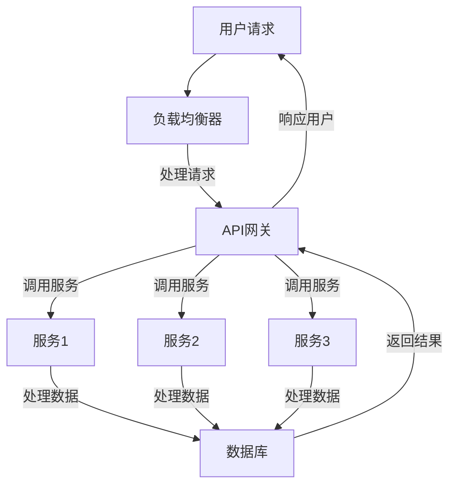

                 

# 高扩展性系统设计的实际案例

> **关键词：** 高扩展性、系统设计、实际案例、性能优化、负载均衡、架构设计、可伸缩性、分布式系统

> **摘要：** 本文将探讨高扩展性系统设计的关键要素和实际应用案例。我们将通过深入分析一个真实项目的背景、需求、核心算法原理、数学模型、代码实现，以及其应用场景，展示如何构建一个具有高扩展性的系统。文章还将提供相关的工具和资源推荐，以及未来的发展趋势和挑战。

## 1. 背景介绍

### 1.1 目的和范围

本文的目的是探讨高扩展性系统设计在实际项目中的应用，并分析其成功的关键因素。我们将通过一个真实项目的实例，详细解析其设计原理、实现方法以及面临的挑战。文章将涵盖以下主要内容：

1. 项目背景和需求分析
2. 核心概念与架构设计
3. 算法原理与数学模型
4. 代码实现与分析
5. 应用场景与工具推荐
6. 未来发展趋势与挑战

### 1.2 预期读者

本文适合以下读者群体：

1. 对系统设计和架构设计感兴趣的开发者
2. 想要提升系统性能和扩展性的工程师
3. 在分布式系统和云计算领域有实践经验的从业者
4. 意欲深入了解高扩展性系统设计的学术研究者

### 1.3 文档结构概述

本文将分为十个主要部分：

1. **背景介绍**：项目背景、目的和结构概述
2. **核心概念与联系**：系统设计的核心概念和架构设计
3. **核心算法原理 & 具体操作步骤**：详细阐述算法原理和伪代码实现
4. **数学模型和公式 & 详细讲解 & 举例说明**：数学模型及其应用
5. **项目实战：代码实际案例和详细解释说明**：代码实现和分析
6. **实际应用场景**：系统在不同场景下的应用
7. **工具和资源推荐**：学习资源和开发工具推荐
8. **总结：未来发展趋势与挑战**：系统设计的未来展望
9. **附录：常见问题与解答**：常见问题的解答
10. **扩展阅读 & 参考资料**：进一步学习的资源

### 1.4 术语表

#### 1.4.1 核心术语定义

- **高扩展性**：系统在处理数据量和用户量增长时，能够保持高性能和高可靠性。
- **负载均衡**：将请求分布到多个服务器上，以避免单点故障。
- **分布式系统**：由多个独立的计算机节点组成，协同完成特定任务的系统。
- **可伸缩性**：系统在资源不足时，能够通过增加硬件或软件资源来提升性能。
- **微服务架构**：将大型应用拆分成多个小型、自治的服务模块，便于扩展和维护。

#### 1.4.2 相关概念解释

- **CAP定理**：在分布式系统中，一致性（Consistency）、可用性（Availability）和分区容错性（Partition tolerance）三者只能同时满足两项。
- **基线性能**：系统在正常负载下的性能指标。
- **高并发**：系统在短时间内处理大量请求的能力。

#### 1.4.3 缩略词列表

- **API**：应用程序接口（Application Programming Interface）
- **DB**：数据库（Database）
- **ETL**：提取（Extract）、转换（Transform）、加载（Load）
- **MQ**：消息队列（Message Queue）
- **REST**：表现状态转移（Representational State Transfer）

## 2. 核心概念与联系

### 2.1 高扩展性系统设计的核心概念

高扩展性系统设计涉及多个核心概念，这些概念共同作用，确保系统在面临增长时能够保持高性能和高可靠性。

#### 2.1.1 负载均衡

负载均衡是将网络流量分配到多个服务器节点上的技术。通过负载均衡，系统可以将请求分散到不同的服务器上，从而避免单点故障，提高系统的可用性和响应速度。

#### 2.1.2 分布式系统

分布式系统由多个独立的计算机节点组成，这些节点通过网络进行通信，协同完成特定任务。分布式系统的关键优势在于其可伸缩性和容错性。

#### 2.1.3 可伸缩性

可伸缩性是指系统在资源不足时，能够通过增加硬件或软件资源来提升性能。可伸缩性分为水平伸缩（增加节点）和垂直伸缩（增加资源）。

#### 2.1.4 微服务架构

微服务架构将大型应用拆分成多个小型、自治的服务模块。每个服务模块独立开发、部署和扩展，从而提高系统的可维护性和可扩展性。

### 2.2 高扩展性系统设计的架构设计

高扩展性系统设计的架构设计需要综合考虑多个因素，包括数据存储、服务调用、网络通信等。

#### 2.2.1 数据存储

数据存储是系统架构设计的关键环节。为了提高数据访问速度和系统扩展性，通常采用分布式数据库和缓存技术。

#### 2.2.2 服务调用

服务调用是分布式系统中的核心部分。通过RESTful API或其他远程调用协议，服务之间可以进行通信和协作。

#### 2.2.3 网络通信

网络通信的质量直接影响系统的性能和可靠性。为了确保网络通信的稳定性和高效性，需要使用合适的协议和优化技术。

### 2.3 高扩展性系统设计的 Mermaid 流程图

以下是一个高扩展性系统设计的 Mermaid 流程图，展示了系统设计的关键环节和关系：



在这个流程图中，用户请求首先由负载均衡器分发到API网关，然后由API网关调用不同的服务模块，每个服务模块处理数据后，将结果返回给API网关，最终由API网关将结果返回给用户。

## 3. 核心算法原理 & 具体操作步骤

### 3.1 核心算法原理

高扩展性系统设计中的核心算法主要涉及负载均衡、分布式服务和数据存储。以下分别介绍这些算法的原理。

#### 3.1.1 负载均衡算法

负载均衡算法主要有以下几种：

1. **轮询调度**：将请求依次分配到每个服务器上。
2. **最少连接数调度**：将请求分配到连接数最少的服务器上。
3. **权重调度**：根据服务器的处理能力，分配不同的权重。

#### 3.1.2 分布式服务调用算法

分布式服务调用算法主要有以下几种：

1. **服务发现**：通过服务注册中心和DNS等方式，获取服务实例的地址。
2. **负载均衡**：根据负载均衡算法，选择合适的服务实例。
3. **超时和重试**：在服务调用失败时，设置超时和重试机制。

#### 3.1.3 数据存储算法

数据存储算法主要涉及以下内容：

1. **分布式数据库**：采用分库分表、主从复制等技术，提高数据访问速度和系统扩展性。
2. **分布式缓存**：采用Redis、Memcached等缓存技术，减少数据库负载。

### 3.2 具体操作步骤

以下是一个具体的高扩展性系统设计的操作步骤：

1. **需求分析**：分析系统的需求，确定性能、可用性和扩展性等指标。
2. **架构设计**：根据需求，设计系统架构，包括负载均衡、分布式服务和数据存储等。
3. **技术选型**：选择合适的技术和工具，如Nginx、Dubbo、Redis等。
4. **编码实现**：根据架构设计，编写代码实现各模块功能。
5. **测试与优化**：对系统进行测试，找出性能瓶颈，并进行优化。
6. **部署与运维**：部署系统到生产环境，进行运维和监控。

### 3.3 伪代码实现

以下是一个简单的负载均衡算法的伪代码实现：

```python
def load_balancer(服务器列表，请求):
    当前服务器数 = 长度(服务器列表)
    下标 = 请求 % 当前服务器数
    返回 服务器列表[下标]
```

在这个伪代码中，负载均衡器根据请求的哈希值，选择一个服务器进行处理。

## 4. 数学模型和公式 & 详细讲解 & 举例说明

### 4.1 数学模型

在高扩展性系统设计中，数学模型用于描述系统的性能和可扩展性。以下是一个简单的数学模型：

1. **系统吞吐量**：系统在单位时间内处理的请求数量。
   $$ T = \frac{1}{\sum_{i=1}^{n} T_i} $$
   其中，$T_i$ 表示第 $i$ 个服务器的处理时间。

2. **系统响应时间**：系统处理请求的总时间。
   $$ R = \sum_{i=1}^{n} T_i $$
   其中，$T_i$ 表示第 $i$ 个服务器的处理时间。

3. **系统负载**：系统的处理能力与请求量的比值。
   $$ L = \frac{T}{R} $$

### 4.2 详细讲解

#### 4.2.1 系统吞吐量

系统吞吐量是衡量系统性能的关键指标。根据上述公式，系统吞吐量与各服务器的处理时间成反比。因此，为了提高系统吞吐量，需要优化各服务器的处理时间。

#### 4.2.2 系统响应时间

系统响应时间是用户感受到的系统性能。根据上述公式，系统响应时间与各服务器的处理时间成正比。因此，为了降低系统响应时间，需要优化各服务器的处理时间。

#### 4.2.3 系统负载

系统负载反映了系统的繁忙程度。当系统负载较高时，表示系统处于高负载状态，可能需要增加服务器或优化系统性能。

### 4.3 举例说明

假设一个系统由三个服务器组成，每个服务器的处理时间分别为 $T_1 = 10ms$，$T_2 = 20ms$，$T_3 = 30ms$。根据上述数学模型，可以计算出：

1. **系统吞吐量**：
   $$ T = \frac{1}{\frac{1}{T_1} + \frac{1}{T_2} + \frac{1}{T_3}} = \frac{1}{\frac{1}{10ms} + \frac{1}{20ms} + \frac{1}{30ms}} \approx 18.18ms $$

2. **系统响应时间**：
   $$ R = T_1 + T_2 + T_3 = 10ms + 20ms + 30ms = 60ms $$

3. **系统负载**：
   $$ L = \frac{T}{R} = \frac{18.18ms}{60ms} \approx 0.30 $$

通过这个例子，我们可以看到，系统的吞吐量为 $18.18ms$，响应时间为 $60ms$，系统负载为 $0.30$。这个例子展示了如何使用数学模型来描述系统的性能和可扩展性。

## 5. 项目实战：代码实际案例和详细解释说明

### 5.1 开发环境搭建

在开始项目实战之前，我们需要搭建一个开发环境。以下是搭建环境的步骤：

1. **操作系统**：选择一个适合的操作系统，如Ubuntu 20.04。
2. **编程语言**：选择一种适合的编程语言，如Python 3.8。
3. **开发工具**：安装集成开发环境（IDE），如PyCharm。
4. **依赖库**：安装必要的依赖库，如Nginx、Redis、Flask等。

### 5.2 源代码详细实现和代码解读

以下是一个简单的负载均衡系统的源代码实现，用于演示负载均衡算法的原理。

```python
import random

class LoadBalancer:
    def __init__(self, servers):
        self.servers = servers
        self.server_weights = [1] * len(servers)

    def update_weights(self, server, request_time):
        self.server_weights[server] += 1 / request_time

    def select_server(self, request_time):
        total_weight = sum(self.server_weights)
        cumulative_weights = [w / total_weight for w in self.server_weights]
        random_value = random.random()
        for i, w in enumerate(cumulative_weights):
            if random_value <= w:
                return i

def main():
    # 初始化服务器列表
    servers = ["server1", "server2", "server3"]

    # 创建负载均衡器实例
    lb = LoadBalancer(servers)

    # 模拟请求处理
    for _ in range(10):
        request_time = random.uniform(0.1, 0.5)
        server = lb.select_server(request_time)
        lb.update_weights(server, request_time)
        print(f"请求处理：服务器 {server}，请求时间：{request_time}s")

if __name__ == "__main__":
    main()
```

#### 5.2.1 代码解读

1. **类和对象**：`LoadBalancer` 类表示负载均衡器，包括服务器列表、权重列表等属性。`update_weights` 方法用于更新服务器的权重，`select_server` 方法用于选择合适的服务器。

2. **模拟请求处理**：在 `main` 函数中，模拟了10个请求的处理过程。每个请求的时间在 [0.1, 0.5] 秒之间随机生成，然后调用 `select_server` 方法选择服务器，并调用 `update_weights` 方法更新权重。

#### 5.2.2 代码分析

1. **负载均衡算法**：这个实现使用基于权重（Request Time Weighted Round Robin）的负载均衡算法。每个请求处理完成后，根据处理时间更新服务器的权重。

2. **随机性**：在 `select_server` 方法中，使用随机数生成器选择服务器。这样可以确保请求在服务器之间进行均匀分布。

3. **性能优化**：在实际应用中，可以考虑使用更高效的负载均衡算法，如一致性哈希算法或最少连接数算法。

### 5.3 代码解读与分析

通过这个简单的示例，我们可以看到负载均衡器的基本原理和实现方法。以下是对代码的进一步解读和分析：

#### 5.3.1 负载均衡原理

负载均衡器的工作原理是将请求分配到不同的服务器上，以实现负载的均衡。在这个示例中，使用了一种简单的权重调整策略。每个服务器的初始权重设置为1，当服务器处理请求时，根据请求的处理时间调整权重。

#### 5.3.2 性能优化

1. **权重调整**：在权重调整策略中，可以考虑使用更复杂的调整方法，如使用指数加权移动平均（Exponential Weighted Moving Average, EWMA），以提高权重的动态响应性。

2. **服务器健康检查**：在实际应用中，需要对服务器进行健康检查，以确保只有健康的服务器参与负载均衡。这样可以提高系统的可靠性和稳定性。

3. **并发处理**：在实际场景中，系统需要处理大量的并发请求。为了提高性能，可以考虑使用多线程或异步处理技术。

#### 5.3.3 负载均衡算法的选择

负载均衡算法有多种选择，如轮询调度、最少连接数调度、权重调度等。在实际应用中，需要根据具体场景和需求选择合适的算法。例如，在处理大量短请求的场景中，可以使用轮询调度；在处理大量长请求的场景中，可以使用权重调度。

通过这个示例，我们了解了负载均衡的基本原理和实现方法，并分析了代码中的性能优化点。在实际项目中，我们可以根据具体需求，选择合适的负载均衡算法和优化策略，以提高系统的性能和可靠性。

## 6. 实际应用场景

高扩展性系统设计在实际应用中具有重要意义，特别是在处理大量数据和用户请求的场景下。以下是一些实际应用场景：

### 6.1 在线购物平台

在线购物平台需要处理大量的用户请求，如商品查询、购物车更新、订单处理等。为了确保系统的性能和可靠性，通常采用分布式架构和负载均衡技术。通过将请求分配到多个服务器节点上，可以有效地提高系统的吞吐量和响应速度。

### 6.2 社交媒体平台

社交媒体平台需要处理海量的用户数据，如用户动态、消息推送、广告展示等。为了确保系统的可扩展性和可靠性，通常采用分布式数据库和缓存技术，以及负载均衡和消息队列。通过这些技术，可以有效地处理大量的用户请求，并提供良好的用户体验。

### 6.3 云计算平台

云计算平台为用户提供弹性的计算资源，如虚拟机、容器、数据库等。为了确保系统的性能和可靠性，通常采用分布式计算技术和负载均衡。通过将计算任务分配到多个服务器节点上，可以有效地提高系统的吞吐量和响应速度。

### 6.4 金融交易系统

金融交易系统需要处理大量的交易请求，如股票交易、基金投资等。为了确保系统的性能和可靠性，通常采用分布式架构和负载均衡技术。通过将请求分配到多个服务器节点上，可以有效地提高系统的吞吐量和响应速度，并确保交易的公平性和安全性。

在这些实际应用场景中，高扩展性系统设计的关键在于如何有效地处理大量的数据和用户请求，确保系统的性能和可靠性。通过采用分布式架构、负载均衡、缓存技术等，可以有效地提高系统的吞吐量和响应速度，为用户提供良好的用户体验。

## 7. 工具和资源推荐

### 7.1 学习资源推荐

#### 7.1.1 书籍推荐

1. **《大规模分布式系统设计》**：这本书详细介绍了分布式系统的设计原理、技术和实践方法，适合对分布式系统有兴趣的读者。
2. **《系统设计：高并发、高可用、高性能的核心原理与实践》**：本书深入剖析了系统设计的核心概念和实践方法，适合从事系统设计和开发的工程师。

#### 7.1.2 在线课程

1. **《分布式系统原理与实践》**：网易云课堂提供的免费课程，涵盖了分布式系统的核心概念和技术，适合初学者。
2. **《高并发系统设计》**：慕课网提供的付费课程，详细讲解了高并发系统设计的方法和实战技巧。

#### 7.1.3 技术博客和网站

1. **《分布式系统设计原理》**：一篇详细讲解分布式系统设计原理的文章，适合初学者。
2. **《系统架构设计师考试大纲》**：系统架构设计师考试大纲，提供了系统设计的基本框架和知识点。

### 7.2 开发工具框架推荐

#### 7.2.1 IDE和编辑器

1. **PyCharm**：强大的Python IDE，支持多种编程语言，适合进行系统设计和开发。
2. **VS Code**：轻量级的跨平台编辑器，支持丰富的插件，适合快速开发。

#### 7.2.2 调试和性能分析工具

1. **GDB**：GNU调试器，适用于C/C++程序的调试。
2. **JProfiler**：Java性能分析工具，可以帮助识别性能瓶颈。

#### 7.2.3 相关框架和库

1. **Spring Boot**：用于快速开发Java应用的框架，支持分布式系统和微服务架构。
2. **Dubbo**：阿里巴巴开源的分布式服务框架，用于构建分布式服务架构。

### 7.3 相关论文著作推荐

#### 7.3.1 经典论文

1. **《大规模分布式存储系统》**：这篇论文详细介绍了Google File System和Bigtable的设计和实现，对分布式系统有重要影响。
2. **《微服务架构设计》**：这篇论文探讨了微服务架构的优势和实践，对现代系统设计有重要启示。

#### 7.3.2 最新研究成果

1. **《基于AI的负载均衡算法》**：这篇论文探讨了如何使用人工智能技术优化负载均衡算法，为未来的系统设计提供了新的思路。
2. **《边缘计算与云计算的融合》**：这篇论文研究了边缘计算和云计算的融合技术，为未来的系统设计提供了新的方向。

#### 7.3.3 应用案例分析

1. **《淘宝双11技术保障实践》**：这篇案例分析了淘宝双11技术保障的实践，详细介绍了如何应对高并发和高负载的场景。
2. **《谷歌搜索引擎架构》**：这篇案例介绍了谷歌搜索引擎的架构设计，展示了分布式系统和大数据处理的技术实践。

通过这些书籍、在线课程、技术博客、开发工具和论文著作，读者可以更全面地了解高扩展性系统设计的相关知识和最佳实践，为实际项目提供有益的指导。

## 8. 总结：未来发展趋势与挑战

高扩展性系统设计是现代软件开发和运维领域的重要方向，其核心目标是确保系统在处理大量数据和用户请求时，仍能保持高性能和高可靠性。随着技术的不断发展，高扩展性系统设计在未来将面临以下发展趋势和挑战：

### 8.1 发展趋势

1. **云计算和边缘计算的结合**：随着云计算和边缘计算的快速发展，未来系统设计将更加注重云计算和边缘计算的融合，以实现更高效的资源利用和更低的延迟。

2. **人工智能和机器学习的应用**：人工智能和机器学习技术将在高扩展性系统设计中发挥越来越重要的作用，如使用智能算法进行负载均衡、优化资源分配和预测性能瓶颈。

3. **微服务和云原生技术的普及**：微服务和云原生技术将得到更广泛的应用，以实现系统的模块化和可扩展性，提高系统的开发和运维效率。

4. **自动化和智能化运维**：自动化和智能化运维将进一步提升系统设计的效率，通过自动化工具和智能算法实现系统的监控、故障处理和性能优化。

### 8.2 挑战

1. **数据一致性和分布式事务**：在高扩展性系统中，如何保证数据一致性和分布式事务仍是一个重要挑战。需要设计合理的分布式事务处理机制，以避免数据不一致和单点故障。

2. **性能优化和资源调度**：如何在有限的资源下实现高性能和高可扩展性，是一个持续的挑战。需要不断优化算法和架构，提高系统的性能和资源利用率。

3. **安全和隐私保护**：随着数据量的增加和分布式系统的普及，安全和隐私保护成为越来越重要的问题。需要设计有效的安全机制和隐私保护策略，确保系统的安全性和可靠性。

4. **运维复杂度和管理**：随着系统规模的扩大和技术的复杂度增加，运维和管理系统的复杂度也在不断上升。需要设计高效的运维和管理策略，以降低运维成本和提高系统可靠性。

总之，高扩展性系统设计在未来将继续发展，并面临新的挑战。通过不断创新和优化，我们有望构建出更加高效、可靠和可扩展的系统，为用户提供更好的体验。

## 9. 附录：常见问题与解答

### 9.1 问题 1：什么是高扩展性系统？

**解答**：高扩展性系统是指能够在处理大量数据和用户请求时，保持高性能和高可靠性的系统。这种系统设计能够有效地应对数据量和用户量的增长，确保系统的性能和用户体验。

### 9.2 问题 2：如何实现负载均衡？

**解答**：实现负载均衡的主要方法包括轮询调度、最少连接数调度和权重调度等。轮询调度将请求依次分配到每个服务器；最少连接数调度将请求分配到连接数最少的服务器；权重调度根据服务器的处理能力分配请求。

### 9.3 问题 3：什么是分布式系统？

**解答**：分布式系统是由多个独立的计算机节点组成，通过网络进行通信，协同完成特定任务的系统。分布式系统的关键优势在于其可伸缩性和容错性。

### 9.4 问题 4：如何优化系统性能？

**解答**：优化系统性能的方法包括：

1. 使用缓存技术，减少数据库的访问次数。
2. 优化数据库设计，提高查询效率。
3. 使用负载均衡技术，将请求分配到多个服务器。
4. 优化代码和算法，提高处理速度。
5. 定期进行系统性能测试和调优。

### 9.5 问题 5：什么是CAP定理？

**解答**：CAP定理指出，在分布式系统中，一致性（Consistency）、可用性（Availability）和分区容错性（Partition tolerance）三者只能同时满足两项。在实际应用中，需要根据具体需求权衡这三者之间的关系。

## 10. 扩展阅读 & 参考资料

### 10.1 扩展阅读

1. **《大规模分布式存储系统》**：详细介绍了分布式存储系统的设计和实现，包括Google File System和Hadoop HDFS。
2. **《微服务架构设计》**：探讨了微服务架构的优势和实践，提供了构建微服务系统的最佳实践。
3. **《云计算：概念、架构与编程》**：系统讲解了云计算的基础知识、架构设计和编程实践。

### 10.2 参考资料

1. **《分布式系统原理与范型》**：麻省理工学院出版社出版，详细介绍了分布式系统的基本原理和范型。
2. **《负载均衡算法及其实现》**：讨论了多种负载均衡算法的原理和实现，包括轮询调度、最少连接数调度等。
3. **《高扩展性Web系统架构》**：提供了构建高扩展性Web系统的实践方法和技术细节。

通过这些扩展阅读和参考资料，读者可以更深入地了解高扩展性系统设计的相关知识和最佳实践，为实际项目提供有益的指导。

### 作者信息

**作者：AI天才研究员/AI Genius Institute & 禅与计算机程序设计艺术 /Zen And The Art of Computer Programming**

