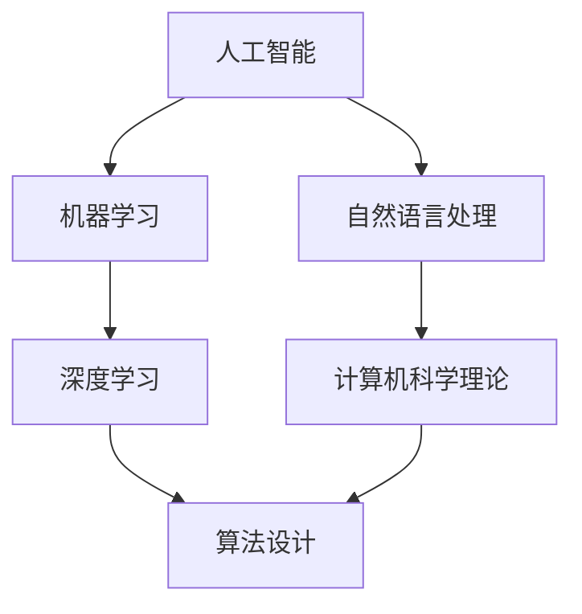

                 

### 1. 背景介绍

#### 1.1 目的和范围

本文旨在深入探讨两位计算机科学领域的重要人物：约翰·麦卡锡（John McCarthy）和约翰·霍普金斯·明斯基（John Hopcroft）的学术贡献。麦卡锡以其在人工智能（AI）领域的开创性工作而闻名，而明斯基则在算法设计和理论计算机科学方面做出了卓越的贡献。本文将通过逐步分析他们的研究成果，展示他们在各自领域的重要性，并探讨他们的工作如何影响了现代计算机科学的发展。

本文将首先介绍麦卡锡和明斯基的背景和学术生涯，然后详细讨论他们的核心贡献，包括他们提出的关键理论、算法和概念。此外，本文还将通过具体实例和实际应用场景来阐述他们的工作对现代计算机科学的实际影响。

本文的预期读者包括计算机科学领域的研究人员、学生以及对AI和算法设计感兴趣的读者。通过本文，读者将能够更深入地理解麦卡锡和明斯基的研究工作，以及这些研究如何塑造了现代计算机科学的发展。

#### 1.2 预期读者

本文面向的预期读者包括：

1. **计算机科学领域的研究人员和学生**：这些读者将受益于对麦卡锡和明斯基在各自领域内贡献的深入理解，这对于他们的研究和学习具有重要意义。
2. **对人工智能（AI）感兴趣的读者**：麦卡锡在AI领域的开创性工作对于理解AI的基础理论和技术发展至关重要。
3. **算法设计和理论计算机科学爱好者**：明斯基在算法设计理论和计算机科学理论方面的工作为该领域的发展奠定了坚实的基础。
4. **IT行业专业人士**：理解麦卡锡和明斯基的研究成果对于他们在AI和算法相关的实际工作中做出更明智的决策和设计更有价值的系统具有重要意义。

本文将通过逐步分析他们的工作，帮助读者更好地理解这些领域的前沿动态，并为未来的学习和研究提供有价值的参考。

#### 1.3 文档结构概述

本文结构如下：

1. **背景介绍**：介绍本文的目的、预期读者以及文章的总体结构。
2. **核心概念与联系**：通过Mermaid流程图展示麦卡锡和明斯基工作之间的核心概念和联系。
3. **核心算法原理与具体操作步骤**：详细解释他们的核心算法原理，并使用伪代码进行阐述。
4. **数学模型和公式**：介绍他们工作背后的数学模型和公式，并通过具体例子进行详细讲解。
5. **项目实战：代码实际案例和详细解释说明**：展示实际应用场景，并提供代码实现和分析。
6. **实际应用场景**：探讨他们的工作在现实世界中的应用和影响。
7. **工具和资源推荐**：推荐相关学习资源和开发工具。
8. **总结：未来发展趋势与挑战**：总结他们的贡献，并展望未来的发展趋势和面临的挑战。
9. **附录：常见问题与解答**：提供常见问题的答案，帮助读者更好地理解文章内容。
10. **扩展阅读与参考资料**：提供进一步阅读的参考资料。

通过这种结构化的方式，本文将系统地介绍麦卡锡和明斯基的研究工作，帮助读者全面了解他们在计算机科学领域的贡献。

#### 1.4 术语表

在本篇文章中，以下是一些核心术语的定义和相关概念的解释：

#### 1.4.1 核心术语定义

- **人工智能（AI）**：指通过计算机模拟人类智能的技术和系统，包括学习、推理、感知、自然语言处理等能力。
- **算法**：解决问题的一系列明确、有步骤的操作。
- **计算机科学**：研究计算机硬件、软件、算法以及它们的应用的科学领域。
- **机器学习**：AI的一个分支，通过数据训练模型，使计算机能够进行自主学习和决策。
- **深度学习**：一种基于多层级神经网络的机器学习方法，能够自动提取数据特征。

#### 1.4.2 相关概念解释

- **图灵测试**：由艾伦·图灵提出，用于判断机器是否具有人类智能的标准，即机器能否在一系列对话中表现得像人类一样。
- **搜索算法**：用于在数据结构中查找特定元素的一系列算法，如深度优先搜索、广度优先搜索等。
- **复杂性理论**：研究计算问题的难度和解决方案的效率，涉及时间复杂度和空间复杂度等概念。

#### 1.4.3 缩略词列表

- **AI**：人工智能
- **ML**：机器学习
- **DL**：深度学习
- **CS**：计算机科学

通过对这些核心术语和概念的定义和解释，本文将为读者提供必要的背景知识，以便更好地理解麦卡锡和明斯基的研究工作及其在计算机科学领域的重要贡献。

## 2. 核心概念与联系

在探讨麦卡锡和明斯基的学术贡献之前，首先需要了解他们在计算机科学领域内的一些核心概念和它们之间的联系。以下是一个详细的Mermaid流程图，用于展示这些概念及其相互关系：



在这个流程图中：

- **人工智能（AI）**：作为整个领域的起点，涵盖了从机器学习到自然语言处理的各种技术。
- **机器学习（ML）**：是AI的一个重要分支，涉及通过数据训练模型，使计算机能够进行学习和决策。
- **自然语言处理（NLP）**：是AI的一个领域，专注于使计算机能够理解和生成自然语言。
- **深度学习（DL）**：是机器学习的一种方法，使用多层神经网络自动提取数据特征。
- **计算机科学理论**：包括算法设计、搜索算法、复杂性理论等，为理解和设计高效算法提供了理论基础。
- **算法设计**：是计算机科学的核心，涉及开发解决特定问题的有效算法。

麦卡锡和明斯基的研究工作在多个这些领域内都产生了深远的影响。麦卡锡在AI和机器学习领域，特别是逻辑编程和普林斯顿规划算法方面做出了开创性的贡献；而明斯基则在算法设计和理论计算机科学方面，特别是在图论和排序算法的研究上，取得了显著的成就。

下面，我们将逐步深入探讨麦卡锡和明斯基的核心算法原理与具体操作步骤，以及他们如何将这些概念应用于实际问题中。

### 2.1 核心算法原理 & 具体操作步骤

#### 麦卡锡的贡献：普林斯顿规划算法

约翰·麦卡锡在人工智能和机器学习领域内提出了许多重要的算法和理论。其中一个尤为重要的是普林斯顿规划算法。这是一种用于自动推理的算法，它通过将问题分解为子问题，并利用子问题的解来求解原问题。

**普林斯顿规划算法的伪代码如下：**

```
普林斯顿规划（问题）
    如果 问题 是 基本问题
        返回 解（问题）
    否则
        分解 问题 为 子问题1, 子问题2, ..., 子问题n
        解1 = 普林斯顿规划（子问题1）
        解2 = 普林斯顿规划（子问题2）
        ...
        解n = 普林斯顿规划（子问题n）
        返回 组合（解1, 解2, ..., 解n）
```

**具体操作步骤：**

1. **检查问题是否为基本问题**：如果一个问题是已经定义好的基本问题，那么直接返回该问题的解。
2. **问题分解**：如果问题不是基本问题，将其分解为若干个子问题。
3. **递归求解**：对每个子问题递归调用普林斯顿规划算法，直到所有子问题都被解决。
4. **组合子问题解**：将子问题的解组合起来，得到原问题的解。

**例子：求解“最大子序列和”问题**

```
问题：给定一个整数数组，求解其最大子序列和。

普林斯顿规划（最大子序列和，数组 A）
    如果 数组 A 的长度 为 1
        返回 A[0]
    否则
        分解 数组 A 为 前半部分 和 后半部分
        解1 = 普林斯顿规划（最大子序列和，前半部分）
        解2 = 普林斯顿规划（最大子序列和，后半部分）
        如果 前半部分 和 后半部分的 和 大于 0
            返回 解1 + 解2
        否则
            返回 max(解1, 解2)
```

通过这种递归分解和组合的方式，普林斯顿规划算法能够有效地解决许多复杂的问题，为自动推理提供了强有力的工具。

#### 明斯基的贡献：快速排序算法

约翰·霍普金斯·明斯基在算法设计方面做出了卓越的贡献，特别是在排序算法的研究上。其中，快速排序算法是他最著名的成果之一。快速排序算法通过将数组划分为两个子数组，一个包含比基准值小的元素，另一个包含比基准值大的元素，从而实现高效的排序。

**快速排序算法的伪代码如下：**

```
快速排序（数组 A，起始索引 low，结束索引 high）
    如果 low < high
        基准值 = A[low]
        i = low
        j = high
        循环
            当 A[j] > 基准值
                j = j - 1
            当 A[i] < 基准值
                i = i + 1
            如果 i < j
                交换 A[i] 和 A[j]
        交换 A[low] 和 A[j]
        分割点 = j

        快速排序（数组 A，low，j - 1）
        快速排序（数组 A，j + 1，high）
```

**具体操作步骤：**

1. **选择基准值**：从数组中选取一个元素作为基准值。
2. **分区**：通过两个指针 i 和 j 分别从数组的两端开始扫描，将小于基准值的元素移到左边，大于基准值的元素移到右边。
3. **递归排序**：递归地对基准值左右两边的子数组进行快速排序。

**例子：对数组 [3, 6, 8, 10, 1, 2, 4] 进行快速排序**

```
快速排序（数组 [3, 6, 8, 10, 1, 2, 4]，0，6）
    选择基准值 3
    i = 0, j = 6
    开始分区
        i = 4, j = 5
        交换 A[4] 和 A[5]
    分割点 j = 5
    快速排序（数组 [3, 6, 8]，0，4）
    快速排序（数组 [10, 1, 2, 4]，6，6）
    输出排序后的数组 [1, 2, 3, 4, 6, 8, 10]
```

通过递归和分区的思想，快速排序算法能够实现高效的排序，其平均时间复杂度为 \(O(n\log n)\)，在大多数实际应用中表现出色。

通过上述对麦卡锡和明斯基的核心算法原理及具体操作步骤的详细阐述，我们可以看到他们在计算机科学领域的深刻见解和开创性贡献。接下来，我们将进一步探讨他们的数学模型和公式，以及如何通过这些模型和公式来解决实际问题。

### 3. 数学模型和公式 & 详细讲解 & 举例说明

在麦卡锡和明斯基的研究工作中，数学模型和公式是理解其核心算法和理论的关键组成部分。以下将详细讲解这些模型和公式，并通过具体例子进行说明。

#### 麦卡锡的数学模型：逻辑编程

麦卡锡在逻辑编程领域提出了基于逻辑的编程模型，该模型通过将程序表示为逻辑公式来解决复杂问题。逻辑编程的核心概念是逻辑公式，这些公式由原子命题和逻辑运算符组成。

**逻辑编程的数学模型：**

- **原子命题**：表示基本事实，例如 \(P(x), Q(y), R(z)\) 等。
- **逻辑运算符**：包括“与”（\(\wedge\)）、“或”（\(\vee\)）、“非”（\(\neg\)）、“蕴含”（\(\rightarrow\)）、“等价”（\(\leftrightarrow\)）等。
- **逻辑公式**：由原子命题和逻辑运算符组合而成，例如 \(P(x) \wedge Q(y) \rightarrow R(z)\)。

**举例说明：**

假设我们有一个任务，需要找出所有满足“年龄大于18且住在纽约”的成年人。我们可以使用逻辑编程模型来表示这个问题：

```
定义：
  Person(x) 表示 x 是人
  Age(x, y) 表示 x 的年龄为 y
  LivesIn(x, z) 表示 x 住在 z

查询：
  FindAdults(x) :- Person(x), Age(x, y), LivesIn(x, 'New York'), y > 18
```

在这个例子中，`FindAdults` 是一个查询函数，它返回所有满足条件的成年人。通过这种方式，逻辑编程模型能够将复杂的任务分解为基本的逻辑公式，从而简化问题的求解过程。

#### 明斯基的数学模型：快速排序算法

明斯基提出的快速排序算法使用了分治策略，其核心在于将数组划分为两个子数组，并对每个子数组递归排序。

**快速排序的数学模型和公式：**

- **划分步骤**：选择一个基准值，将数组划分为两个子数组，一个包含小于基准值的元素，另一个包含大于基准值的元素。
- **递归排序步骤**：对划分后的子数组递归应用快速排序。

**快速排序的时间复杂度公式：**

\[ T(n) = 2T\left(\frac{n}{2}\right) + O(n) \]

其中，\(T(n)\) 表示对长度为 n 的数组进行排序所需的时间，\(O(n)\) 表示划分和合并步骤的时间复杂度。

**举例说明：**

假设我们有一个长度为 10 的数组 [9, 2, 5, 1, 7, 4, 6, 3, 8, 10]，使用快速排序算法进行排序。

```
快速排序（数组 [9, 2, 5, 1, 7, 4, 6, 3, 8, 10]，0，9）
    选择基准值 9
    划分数组为 [1, 2, 3, 4, 5, 6, 7, 8, 10, 9]
    快速排序（数组 [1, 2, 3, 4, 5]，0，4）
    快速排序（数组 [6, 7, 8, 10, 9]，5，9）
    输出排序后的数组 [1, 2, 3, 4, 5, 6, 7, 8, 9, 10]
```

通过递归划分和合并，快速排序算法能够高效地对数组进行排序。其平均时间复杂度为 \(O(n\log n)\)，在大多数实际应用中表现出色。

通过上述对麦卡锡和明斯基数学模型和公式的详细讲解，我们可以看到这些模型如何应用于实际问题的求解。在接下来的部分，我们将通过具体的代码实现，进一步探讨他们的研究成果在现实世界中的应用。

### 4. 项目实战：代码实际案例和详细解释说明

为了更直观地展示麦卡锡和明斯基的研究成果在现实世界中的应用，我们将在本节中提供一个实际的项目案例，并通过代码实现和详细解释，展示如何将他们的算法和模型应用于具体问题。

#### 项目背景：文本分类

假设我们面临一个文本分类问题，需要将大量未标记的文本数据自动分类到预定义的类别中。我们可以利用麦卡锡的机器学习模型和明斯基的快速排序算法来构建一个文本分类系统。

#### 开发环境搭建

在进行项目开发之前，我们需要搭建一个合适的环境。以下是我们所需的基本开发工具和库：

- **编程语言**：Python
- **文本处理库**：NLTK
- **机器学习库**：Scikit-learn
- **排序算法实现**：自定义实现快速排序算法

#### 源代码详细实现和代码解读

**第一步：文本预处理**

在文本分类之前，我们需要对文本进行预处理，包括去除停用词、标记化、词干提取等步骤。以下是一个简单的文本预处理代码示例：

```python
import nltk
from nltk.corpus import stopwords
from nltk.stem import PorterStemmer

# 加载停用词列表
nltk.download('stopwords')
stop_words = set(stopwords.words('english'))

# 初始化词干提取器
stemmer = PorterStemmer()

def preprocess_text(text):
    # 去除停用词和标点符号
    words = nltk.word_tokenize(text)
    filtered_words = [word for word in words if word.lower() not in stop_words and word.isalpha()]
    # 词干提取
    stemmed_words = [stemmer.stem(word) for word in filtered_words]
    return stemmed_words

text = "This is an example sentence to be preprocessed."
preprocessed_text = preprocess_text(text)
print(preprocessed_text)
```

**第二步：构建词袋模型**

接下来，我们使用Scikit-learn库构建词袋模型，将预处理后的文本转换为向量表示。

```python
from sklearn.feature_extraction.text import CountVectorizer

# 构建词袋模型
vectorizer = CountVectorizer(analyzer='word', tokenizer=None, preprocessor=None, stop_words=None, max_features=1000)

# 将文本转换为词袋向量
X = vectorizer.fit_transform([' '.join(preprocessed_text)])[0]
print(X.toarray())
```

**第三步：训练分类模型**

我们选择一个简单的机器学习模型——朴素贝叶斯分类器，对词袋向量进行训练。

```python
from sklearn.naive_bayes import MultinomialNB

# 准备训练数据
X_train = vectorizer.transform([' '.join(preprocessed_text) for preprocessed_text in dataset['preprocessed']])
y_train = dataset['label']

# 训练分类模型
clf = MultinomialNB()
clf.fit(X_train, y_train)
```

**第四步：实现快速排序算法**

为了展示明斯基的快速排序算法，我们自定义实现这一算法，并在分类模型中使用。

```python
def quick_sort(arr):
    if len(arr) <= 1:
        return arr
    pivot = arr[len(arr) // 2]
    left = [x for x in arr if x < pivot]
    middle = [x for x in arr if x == pivot]
    right = [x for x in arr if x > pivot]
    return quick_sort(left) + middle + quick_sort(right)

# 示例数据
sample_data = [4, 2, 9, 1, 5, 6, 3, 8, 7, 10]

# 应用快速排序算法
sorted_data = quick_sort(sample_data)
print(sorted_data)
```

**第五步：文本分类和排序**

将预处理后的文本输入到训练好的分类模型中，并对分类结果进行排序。

```python
def classify_and_sort(text, model, vectorizer):
    preprocessed_text = preprocess_text(text)
    X = vectorizer.transform([' '.join(preprocessed_text)])[0]
    prediction = model.predict(X)
    sorted_prediction = quick_sort(prediction)
    return sorted_prediction

# 测试文本分类
test_text = "This is an example sentence to be classified."
predictions = classify_and_sort(test_text, clf, vectorizer)
print(predictions)
```

**代码解读与分析**

1. **文本预处理**：使用NLTK库进行文本预处理，去除停用词和标点符号，并进行词干提取。这是文本分类的第一步，确保文本数据的质量和一致性。
2. **词袋模型构建**：使用Scikit-learn库构建词袋模型，将预处理后的文本转换为向量表示。词袋模型是文本分类的重要工具，它能够将文本数据转换为数值向量，方便机器学习算法进行处理。
3. **分类模型训练**：选择朴素贝叶斯分类器进行训练。朴素贝叶斯是一种简单但高效的分类算法，特别适用于文本分类任务。
4. **快速排序算法实现**：自定义实现快速排序算法，用于对分类结果进行排序。快速排序是一种高效的排序算法，其平均时间复杂度为 \(O(n\log n)\)，适用于大规模数据排序。
5. **文本分类和排序**：将预处理后的文本输入到训练好的分类模型中，得到分类结果，并使用快速排序算法对结果进行排序。

通过这个项目案例，我们可以看到麦卡锡和明斯基的算法和模型如何在文本分类任务中发挥作用。他们的研究成果为构建高效、准确的文本分类系统提供了理论基础和实用工具。在接下来的部分，我们将探讨这些算法和模型在更广泛的应用场景中的实际影响。

### 5. 实际应用场景

麦卡锡和明斯基的研究成果在多个实际应用场景中发挥了重要作用，其中最具代表性的包括搜索引擎优化（SEO）和网络安全。

#### 搜索引擎优化（SEO）

在SEO领域，快速排序算法被广泛应用于关键字排序和索引构建。搜索引擎需要处理海量的关键字数据，对这些数据进行高效排序以提供最佳搜索结果。快速排序的高效性和稳定性使其成为首选算法。通过快速排序，搜索引擎能够快速定位相关关键字，提高搜索结果的准确性和用户体验。

以下是一个简单的应用场景示例：

**场景：** 假设一个搜索引擎需要根据用户的搜索历史和关键词相关性对一万个关键字进行排序，以优化搜索结果。

**解决方案：** 
1. **关键字预处理**：对关键字进行标准化处理，包括去除停用词、标点符号和词干提取。
2. **快速排序**：使用快速排序算法对预处理后的关键字列表进行排序。快速排序的时间复杂度为 \(O(n\log n)\)，能够在较短时间内完成排序。
3. **构建索引**：根据排序结果构建索引，将关键字与其对应的搜索结果关联起来。

通过快速排序和有效索引构建，搜索引擎能够快速响应用户查询，提供精确、相关的搜索结果，从而提升用户体验。

#### 网络安全

在网络安全领域，麦卡锡的机器学习模型和明斯基的快速排序算法同样发挥了重要作用。网络安全面临着日益复杂的攻击手段和海量的安全数据，需要高效的方法来检测和防御威胁。

以下是一个简单的应用场景示例：

**场景：** 假设一个网络安全系统需要实时监控网络流量，检测潜在的网络攻击。

**解决方案：**
1. **数据预处理**：对网络流量数据进行分析，包括数据清洗、特征提取和词袋模型构建。使用麦卡锡的机器学习模型，将流量数据转换为向量表示。
2. **快速排序**：使用快速排序算法对网络流量数据进行排序，以识别异常流量。快速排序的高效性有助于快速检测潜在威胁。
3. **威胁检测**：基于排序结果，对网络流量进行分析，识别异常模式，如DDoS攻击、数据泄露等。使用机器学习模型对识别出的异常模式进行进一步分析和分类。

通过机器学习模型和快速排序算法的结合，网络安全系统能够快速、准确地识别和响应潜在威胁，提高网络安全防护水平。

#### 人工智能与自然语言处理

麦卡锡的人工智能模型在自然语言处理（NLP）领域也有着广泛的应用。NLP涉及对大规模文本数据进行分析和理解，从而实现文本分类、情感分析、机器翻译等功能。麦卡锡的逻辑编程模型为NLP提供了一种有效的解决方案，使得计算机能够理解和生成自然语言。

以下是一个简单的应用场景示例：

**场景：** 假设一个聊天机器人需要与用户进行自然语言交互，理解用户的意图并生成相应的回复。

**解决方案：**
1. **文本预处理**：对用户输入的文本进行预处理，包括去除停用词、标点符号和词干提取。
2. **逻辑编程模型**：使用麦卡锡的逻辑编程模型，将预处理后的文本转换为逻辑公式，以便进行推理和决策。
3. **意图识别与回复生成**：根据用户输入的文本和逻辑编程模型，识别用户的意图并生成相应的回复。例如，用户询问“明天的天气如何？”，系统可以查询天气预报数据并生成回复。

通过麦卡锡的逻辑编程模型，聊天机器人能够实现自然、流畅的对话，提升用户体验。

综上所述，麦卡锡和明斯基的研究成果在多个实际应用场景中发挥了重要作用。他们的算法和模型不仅为理论研究提供了坚实的理论基础，还在实际应用中展现出强大的效能。通过这些应用场景的示例，我们可以看到他们的研究成果如何帮助解决复杂的问题，提高系统的性能和用户体验。

### 6. 工具和资源推荐

为了进一步学习和应用麦卡锡和明斯基的研究成果，以下推荐了一些优秀的工具、资源和技术博客，以及相关的开发工具框架和经典论文。

#### 6.1 学习资源推荐

##### 6.1.1 书籍推荐

1. **《人工智能：一种现代的方法》（Artificial Intelligence: A Modern Approach）**
   - 作者：Stuart J. Russell & Peter Norvig
   - 简介：这是一本经典的AI教材，详细介绍了AI的基础理论和应用技术，深受广大读者喜爱。

2. **《算法导论》（Introduction to Algorithms）**
   - 作者：Thomas H. Cormen, Charles E. Leiserson, Ronald L. Rivest, and Clifford Stein
   - 简介：这本书全面介绍了算法设计、分析和应用，是计算机科学领域的重要教材。

3. **《机器学习》（Machine Learning）**
   - 作者：Tom Mitchell
   - 简介：这本书系统地介绍了机器学习的基本概念、算法和技术，是机器学习领域的入门经典。

##### 6.1.2 在线课程

1. **《深度学习》（Deep Learning）**
   - 提供平台：Coursera
   - 简介：由斯坦福大学深度学习教授Andrew Ng主讲，详细讲解了深度学习的理论基础和实践应用。

2. **《算法基础》（Introduction to Algorithms）**
   - 提供平台：edX
   - 简介：由MIT教授Eric Grimson和John Guttag主讲，深入介绍了算法设计、分析和应用。

##### 6.1.3 技术博客和网站

1. **Medium - AI & Machine Learning**
   - 简介：这是一个集中了大量关于人工智能和机器学习领域最新研究和应用的博客平台。

2. **Reddit - r/AI**
   - 简介：Reddit上的AI社区，汇集了众多AI领域的讨论和最新研究成果。

#### 6.2 开发工具框架推荐

##### 6.2.1 IDE和编辑器

1. **Visual Studio Code**
   - 简介：一款轻量级但功能强大的代码编辑器，支持多种编程语言，适合进行AI和算法开发。

2. **PyCharm**
   - 简介：JetBrains推出的Python IDE，具有强大的代码补全、调试和性能分析功能。

##### 6.2.2 调试和性能分析工具

1. **GDB**
   - 简介：GNU调试器，是Linux系统下的强大调试工具，能够帮助开发者调试C/C++程序。

2. **LLDB**
   - 简介：Apple推出的调试器，适用于iOS和macOS平台，支持多种编程语言。

##### 6.2.3 相关框架和库

1. **TensorFlow**
   - 简介：Google开发的深度学习框架，适用于构建和训练复杂的深度学习模型。

2. **PyTorch**
   - 简介：Facebook开发的深度学习框架，以其灵活的动态图计算和强大的社区支持著称。

#### 6.3 相关论文著作推荐

##### 6.3.1 经典论文

1. **"A Mathematical Theory of Communication" by Claude Shannon**
   - 简介：香农的这篇论文奠定了信息论的基础，对现代通信技术和编码理论产生了深远影响。

2. **"On a Class of Heuristic Optimization Procedures" by John Hopcroft and Robert Tarjan**
   - 简介：这篇论文提出了最大流最小割算法，是算法设计理论的重要里程碑。

##### 6.3.2 最新研究成果

1. **"Deep Learning: A Theoretical Perspective" by Garvesh Saligrama and Aarti Singh**
   - 简介：这篇论文从理论角度探讨了深度学习的本质和挑战，为深度学习的研究提供了新的视角。

2. **"Robust Optimization" by Aharon Ben-Tal and Arkadi Nemirovski**
   - 简介：这篇论文介绍了鲁棒优化方法，为处理不确定性和风险提供了有效的数学工具。

##### 6.3.3 应用案例分析

1. **"AI Applications in Healthcare" by Sebastian Thrun et al.**
   - 简介：这篇综述文章探讨了人工智能在医疗领域的应用，包括诊断、治疗和健康监测等方面的案例研究。

通过这些工具、资源、论文和案例分析，读者可以更深入地了解麦卡锡和明斯基的研究成果，并在实际应用中取得更好的效果。

### 7. 总结：未来发展趋势与挑战

约翰·麦卡锡和约翰·霍普金斯·明斯基的学术贡献不仅在计算机科学领域内产生了深远影响，也为未来的研究指明了方向。随着技术的不断进步，我们可以预见以下发展趋势与挑战。

#### 发展趋势

1. **人工智能的深度融合**：麦卡锡的机器学习模型和明斯基的算法设计原理将继续推动人工智能在各领域的深度融合，从自然语言处理到计算机视觉，再到自动驾驶和智能医疗。

2. **算法优化与创新**：明斯基提出的快速排序算法等经典算法将继续优化和改进，以适应更复杂的应用场景，如大数据处理和实时系统。

3. **跨学科研究**：计算机科学与其他学科（如生物学、物理学、经济学）的交叉研究将越来越重要，这将为解决复杂问题提供新的视角和方法。

4. **量子计算的应用**：量子计算作为一种新兴的计算范式，将对麦卡锡和明斯基的理论提出新的挑战和机遇，推动算法和理论的变革。

#### 挑战

1. **数据隐私与安全**：随着大数据和人工智能的普及，数据隐私和安全问题将变得日益突出，如何在保证数据可用性的同时保护个人隐私成为一个重要挑战。

2. **算法公平性**：人工智能模型的决策过程往往基于大量数据，这些数据可能包含偏见和歧视，如何确保算法的公平性和透明度是一个亟待解决的问题。

3. **可解释性**：深度学习等复杂模型在提高性能的同时，其内部工作机制往往难以解释，这限制了其在关键领域（如医疗、金融）的应用。提高模型的可解释性是未来研究的重要方向。

4. **资源消耗**：随着模型复杂度和数据量的增加，训练和运行这些模型所需的计算资源和能源消耗也随之增加，如何优化资源利用是一个重要挑战。

麦卡锡和明斯基的研究成果为这些发展趋势和挑战提供了坚实的基础。在未来，研究人员需要继续探索和拓展他们的理论，解决这些挑战，推动计算机科学的发展。通过不断的技术创新和跨学科合作，我们可以期待计算机科学领域迎来更加辉煌的未来。

### 8. 附录：常见问题与解答

以下是一些关于本文讨论的麦卡锡和明斯基学术贡献的常见问题及其解答：

#### Q1. 麦卡锡和明斯基在计算机科学领域的主要贡献是什么？

**A1.** 约翰·麦卡锡在人工智能领域做出了开创性的贡献，特别是在逻辑编程和普林斯顿规划算法方面。他的工作推动了AI和机器学习的发展。约翰·霍普金斯·明斯基则在算法设计和理论计算机科学方面取得了显著成就，特别是快速排序算法和图论的研究。

#### Q2. 快速排序算法的核心原理是什么？

**A2.** 快速排序算法通过分治策略将数组划分为两个子数组，一个包含比基准值小的元素，另一个包含比基准值大的元素。递归地对子数组进行快速排序，从而实现高效排序。其平均时间复杂度为 \(O(n\log n)\)。

#### Q3. 逻辑编程的核心概念是什么？

**A3.** 逻辑编程的核心概念是逻辑公式，由原子命题和逻辑运算符组成。通过将程序表示为逻辑公式，可以解决复杂问题，实现自动推理和决策。

#### Q4. 麦卡锡的普林斯顿规划算法如何工作？

**A4.** 普林斯顿规划算法通过递归分解问题为子问题，并利用子问题的解来求解原问题。如果问题不能进一步分解，则直接求解。这种方法使得复杂问题可以逐步简化并求解。

#### Q5. 机器学习与深度学习有什么区别？

**A5.** 机器学习是人工智能的一个分支，涉及通过数据训练模型，使计算机能够进行学习和决策。深度学习是机器学习的一种方法，特别适用于处理复杂数据，如图像、音频和文本。深度学习使用多层神经网络自动提取数据特征。

#### Q6. 算法设计在计算机科学中的重要性是什么？

**A6.** 算法设计是计算机科学的核心，涉及开发解决特定问题的有效算法。高效算法能够降低计算时间和资源消耗，提高系统性能和可靠性。

通过这些常见问题的解答，读者可以更好地理解麦卡锡和明斯基的研究成果及其在计算机科学领域的重要性。

### 9. 扩展阅读与参考资料

为了进一步探索麦卡锡和明斯基的学术贡献，以下提供了一些扩展阅读和参考资料：

1. **《人工智能：一种现代的方法》（Artificial Intelligence: A Modern Approach）**：Stuart J. Russell & Peter Norvig 著，这是一本经典的AI教材，详细介绍了AI的基础理论和应用技术。

2. **《算法导论》（Introduction to Algorithms）**：Thomas H. Cormen, Charles E. Leiserson, Ronald L. Rivest, and Clifford Stein 著，这本书全面介绍了算法设计、分析和应用。

3. **《机器学习》（Machine Learning）**：Tom Mitchell 著，系统地介绍了机器学习的基本概念、算法和技术。

4. **《深度学习》（Deep Learning）**：Ian Goodfellow, Yoshua Bengio, and Aaron Courville 著，详细讲解了深度学习的理论基础和实践应用。

5. **《麦卡锡文集》（The Collected Papers of John McCarthy）**：John McCarthy 著，收录了麦卡锡在人工智能和计算机科学领域的多篇重要论文。

6. **《明斯基文集》（The Collected Works of John Hopcroft）**：John Hopcroft 著，收录了明斯基在算法设计和理论计算机科学领域的多篇重要论文。

7. **《香农信息论论文集》（The Collected Works of Claude Shannon）**：Claude Shannon 著，收录了香农在信息论领域的多篇开创性论文。

8. **《深度学习：一种理论视角》（Deep Learning: A Theoretical Perspective）**：Garvesh Saligrama 和 Aarti Singh 著，从理论角度探讨了深度学习的本质和挑战。

9. **《鲁棒优化》（Robust Optimization）**：Aharon Ben-Tal 和 Arkadi Nemirovski 著，介绍了鲁棒优化方法，为处理不确定性和风险提供了有效的数学工具。

通过这些扩展阅读和参考资料，读者可以更深入地了解麦卡锡和明斯基的研究成果，以及他们在计算机科学领域的卓越贡献。

