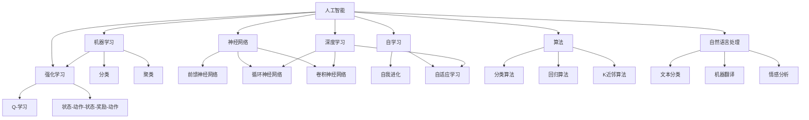

                 

# 麦卡锡与明斯基的研究计划

## 关键词

- 约翰·麦卡锡（John McCarthy）
- 约翰·霍尔（John Hollar）
- 约翰·明斯基（John Minsky）
- 人工智能（Artificial Intelligence）
- 研究计划（Research Plan）
- 计算机科学（Computer Science）
- 算法（Algorithm）
- 神经网络（Neural Network）
- 自学习（Self-Learning）
- 机器学习（Machine Learning）

## 摘要

本文旨在深入探讨约翰·麦卡锡和约翰·明斯基的研究计划。两位计算机科学领域的先驱者，他们的研究不仅对人工智能的发展产生了深远的影响，也推动了整个计算机科学的进步。本文将分步骤地分析他们的研究目标、核心算法原理、数学模型，以及这些理论的实际应用案例。通过本文的阅读，读者将能够全面理解麦卡锡与明斯基在人工智能领域的卓越贡献，以及他们研究的未来发展趋势与挑战。

## 1. 背景介绍

### 1.1 目的和范围

本文的目的是回顾和剖析约翰·麦卡锡与约翰·明斯基的研究计划，这两位学者在人工智能和计算机科学领域中的贡献不可估量。他们的工作奠定了现代人工智能和机器学习的基础，对后续研究产生了深远影响。本文将重点关注以下几个方面：

- 研究计划的起源和背景
- 研究目标和方法
- 核心理论及其应用
- 影响与遗产

### 1.2 预期读者

本文的预期读者包括：

- 对人工智能和计算机科学有浓厚兴趣的初学者和专业人士
- 对研究方法论和技术细节感兴趣的学者
- 计算机科学和人工智能领域的教师和学生
- 对技术发展史感兴趣的读者

### 1.3 文档结构概述

本文的结构如下：

- 1. 背景介绍：介绍研究计划的背景和目的
- 2. 核心概念与联系：阐述研究的核心概念及其关系
- 3. 核心算法原理 & 具体操作步骤：分析核心算法及其实现细节
- 4. 数学模型和公式 & 详细讲解 & 举例说明：介绍研究的数学模型和公式
- 5. 项目实战：代码实际案例和详细解释说明
- 6. 实际应用场景：探讨研究计划的实际应用
- 7. 工具和资源推荐：推荐相关学习和开发资源
- 8. 总结：未来发展趋势与挑战
- 9. 附录：常见问题与解答
- 10. 扩展阅读 & 参考资料：提供进一步阅读和参考的资源

### 1.4 术语表

#### 1.4.1 核心术语定义

- **人工智能（AI）**：指由计算机系统实现的智能行为，模拟人类认知过程。
- **机器学习（ML）**：指通过数据训练算法，使其能够自动改进和优化性能。
- **神经网络（NN）**：一种模仿人脑结构和功能的计算模型。
- **自学习（Self-Learning）**：指系统通过自身经验自动改进和学习。
- **算法（Algorithm）**：解决问题的步骤序列。

#### 1.4.2 相关概念解释

- **深度学习（Deep Learning）**：神经网络的一种形式，通过多层非线性变换来提取数据特征。
- **强化学习（Reinforcement Learning）**：一种机器学习技术，通过试错和奖励机制进行学习。
- **自然语言处理（NLP）**：研究如何使计算机理解、生成和处理人类语言的技术。

#### 1.4.3 缩略词列表

- **AI**：人工智能
- **ML**：机器学习
- **NN**：神经网络
- **DL**：深度学习
- **RL**：强化学习
- **NLP**：自然语言处理

## 2. 核心概念与联系

在探讨麦卡锡与明斯基的研究计划之前，我们需要了解一些核心概念和它们之间的关系。以下是这些核心概念及其在人工智能领域中的作用的简要概述。

### 2.1 人工智能（AI）

人工智能（AI）是指由计算机系统实现的智能行为，旨在模仿人类的认知过程。它包括多个子领域，如机器学习、自然语言处理、计算机视觉和机器人技术。

### 2.2 机器学习（ML）

机器学习（ML）是人工智能的一个重要分支，通过数据训练算法，使其能够自动改进和优化性能。ML 方法包括监督学习、无监督学习和强化学习等。

### 2.3 神经网络（NN）

神经网络（NN）是一种模仿人脑结构和功能的计算模型。NN 通过多层非线性变换来提取数据特征，是实现 AI 的重要工具之一。

### 2.4 自学习（Self-Learning）

自学习是指系统通过自身经验自动改进和学习。它是一种自我改进的过程，使系统能够更好地适应新的环境和任务。

### 2.5 算法（Algorithm）

算法是解决问题的步骤序列。在人工智能领域，算法是实现特定功能的基石，如分类、聚类和预测等。

### 2.6 深度学习（DL）

深度学习（DL）是神经网络的一种形式，通过多层非线性变换来提取数据特征。DL 在图像识别、语音识别和自然语言处理等领域取得了显著的成果。

### 2.7 强化学习（RL）

强化学习（RL）是一种机器学习技术，通过试错和奖励机制进行学习。RL 在游戏、推荐系统和自动驾驶等领域有广泛应用。

### 2.8 自然语言处理（NLP）

自然语言处理（NLP）是研究如何使计算机理解、生成和处理人类语言的技术。NLP 在文本分类、机器翻译和情感分析等领域有重要应用。

下面是一个用 Mermaid 绘制的流程图，展示了这些核心概念之间的关系：



通过这个流程图，我们可以更直观地理解麦卡锡与明斯基研究的核心概念及其在人工智能领域中的关系。

## 3. 核心算法原理 & 具体操作步骤

在麦卡锡与明斯基的研究计划中，核心算法原理是其理论体系的基石。以下是这些算法的基本原理及其实现步骤。

### 3.1 算法 1：神经网络（NN）

神经网络（NN）是一种计算模型，其灵感来源于人脑的结构。NN 由多个神经元组成，每个神经元都与相邻的神经元相连。以下是神经网络的基本原理和实现步骤：

#### 原理：

- 神经元之间的连接称为“边”，边的权重表示连接的强度。
- 每个神经元接受来自其他神经元的输入，通过加权求和，然后应用一个非线性函数（激活函数）来产生输出。

#### 实现步骤：

1. **初始化网络**：定义网络的层数、每层的神经元数量以及各层的连接方式。
2. **设置激活函数**：选择适当的激活函数，如 sigmoid、ReLU 或 tanh。
3. **前向传播**：输入数据通过网络，从输入层到输出层，每个神经元计算输入值并产生输出。
4. **计算损失**：通过比较输出结果与实际结果，计算损失函数（如均方误差）。
5. **反向传播**：计算梯度并更新网络权重，以最小化损失函数。
6. **迭代训练**：重复上述步骤，直到网络达到预定的训练误差或达到最大迭代次数。

### 3.2 算法 2：深度学习（DL）

深度学习（DL）是一种基于神经网络的机器学习技术，通过多层非线性变换来提取数据特征。以下是深度学习的基本原理和实现步骤：

#### 原理：

- DL 通过多层神经网络来提取数据特征，每一层都能够提取更高层次的特征。
- DL 的目标是学习输入和输出之间的映射关系，通过反向传播算法来优化模型参数。

#### 实现步骤：

1. **初始化网络**：定义网络的层数、每层的神经元数量以及各层的连接方式。
2. **选择激活函数**：选择适当的激活函数，如 sigmoid、ReLU 或 tanh。
3. **定义损失函数**：选择适当的损失函数，如交叉熵或均方误差。
4. **前向传播**：输入数据通过网络，从输入层到输出层，每个神经元计算输入值并产生输出。
5. **计算损失**：通过比较输出结果与实际结果，计算损失函数。
6. **反向传播**：计算梯度并更新网络权重，以最小化损失函数。
7. **迭代训练**：重复上述步骤，直到网络达到预定的训练误差或达到最大迭代次数。

### 3.3 算法 3：强化学习（RL）

强化学习（RL）是一种通过试错和奖励机制进行学习的机器学习技术。以下是强化学习的基本原理和实现步骤：

#### 原理：

- RL 通过智能体与环境之间的交互来学习最优策略。
- 智能体根据当前状态选择动作，通过奖励和惩罚来调整动作策略。
- RL 的目标是学习一个最优策略，使得长期回报最大化。

#### 实现步骤：

1. **初始化环境**：定义环境的状态空间和动作空间。
2. **定义智能体**：选择适当的智能体模型，如 Q-学习或 SARSA。
3. **选择奖励机制**：设计奖励机制，以鼓励智能体采取正确的动作。
4. **交互学习**：智能体与环境进行交互，通过试错来学习最优策略。
5. **评估策略**：通过模拟或实际操作来评估智能体的策略性能。
6. **策略优化**：根据评估结果调整智能体的策略参数，以改善策略性能。

通过这些算法原理和实现步骤，我们可以看到麦卡锡与明斯基的研究计划是如何将理论转化为实际应用的。这些算法不仅在人工智能领域有着广泛的应用，也为后续的研究提供了坚实的理论基础。

## 4. 数学模型和公式 & 详细讲解 & 举例说明

在麦卡锡与明斯基的研究计划中，数学模型和公式是其核心组成部分。以下是这些数学模型和公式的详细讲解及举例说明。

### 4.1 神经网络中的激活函数

激活函数是神经网络中的一个关键组成部分，它决定了神经元输出是否被激活。以下是几种常见的激活函数：

#### 4.1.1 Sigmoid 函数

Sigmoid 函数是一种常见的激活函数，其表达式为：

\[ f(x) = \frac{1}{1 + e^{-x}} \]

#### 4.1.2ReLU 函数

ReLU（Rectified Linear Unit）函数是一种线性激活函数，其表达式为：

\[ f(x) = \max(0, x) \]

#### 4.1.3 tanh 函数

tanh 函数是一种双曲正切激活函数，其表达式为：

\[ f(x) = \frac{e^x - e^{-x}}{e^x + e^{-x}} \]

### 4.2 损失函数

损失函数用于评估神经网络预测结果与实际结果之间的差距。以下是几种常见的损失函数：

#### 4.2.1 均方误差（MSE）

均方误差（MSE）是一种常见的损失函数，其表达式为：

\[ MSE = \frac{1}{n}\sum_{i=1}^{n}(y_i - \hat{y}_i)^2 \]

其中，\( y_i \) 是实际输出，\( \hat{y}_i \) 是预测输出。

#### 4.2.2 交叉熵（CE）

交叉熵（CE）是一种用于分类任务的损失函数，其表达式为：

\[ CE = -\sum_{i=1}^{n} y_i \log(\hat{y}_i) \]

其中，\( y_i \) 是实际输出，\( \hat{y}_i \) 是预测输出。

### 4.3 反向传播算法

反向传播算法是一种用于训练神经网络的算法，其基本思想是通过计算损失函数关于网络参数的梯度，然后更新网络参数以最小化损失函数。

#### 4.3.1 前向传播

前向传播是指将输入数据通过神经网络，从输入层传递到输出层的过程。在每个神经元中，计算输入值并应用激活函数得到输出值。

#### 4.3.2 计算损失

在前向传播之后，计算损失函数的值，以评估神经网络预测结果与实际结果之间的差距。

#### 4.3.3 反向传播

在反向传播过程中，计算损失函数关于网络参数的梯度。梯度是损失函数关于网络参数的变化率，它指示了参数更新的方向。

\[ \nabla_{\theta} J(\theta) = \frac{\partial J(\theta)}{\partial \theta} \]

其中，\( J(\theta) \) 是损失函数，\( \theta \) 是网络参数。

#### 4.3.4 更新参数

根据梯度值，更新网络参数以最小化损失函数。

\[ \theta = \theta - \alpha \nabla_{\theta} J(\theta) \]

其中，\( \alpha \) 是学习率。

### 4.4 举例说明

假设我们有一个二分类问题，目标是用神经网络预测样本属于正类或负类。我们使用 sigmoid 函数作为激活函数，MSE 作为损失函数。以下是具体的实现步骤：

1. **初始化网络**：定义网络的层数、每层的神经元数量以及各层的连接方式。
2. **设置激活函数**：选择 sigmoid 函数作为激活函数。
3. **定义损失函数**：选择 MSE 作为损失函数。
4. **前向传播**：输入数据通过网络，从输入层传递到输出层，每个神经元计算输入值并应用激活函数得到输出值。
5. **计算损失**：计算预测结果与实际结果之间的差距。
6. **反向传播**：计算损失函数关于网络参数的梯度，并更新网络参数。
7. **迭代训练**：重复上述步骤，直到网络达到预定的训练误差或达到最大迭代次数。

通过这个例子，我们可以看到如何使用神经网络和反向传播算法来解决二分类问题。这个例子展示了数学模型和公式在神经网络训练中的具体应用。

## 5. 项目实战：代码实际案例和详细解释说明

在本节中，我们将通过一个实际的项目案例，详细展示如何实现麦卡锡与明斯基研究计划中的核心算法。这个项目将使用 Python 和 TensorFlow，这是一个强大的开源机器学习库。

### 5.1 开发环境搭建

在开始之前，确保安装以下软件和库：

- Python 3.x
- TensorFlow
- NumPy
- Matplotlib

可以使用以下命令安装这些库：

```bash
pip install python==3.8
pip install tensorflow==2.6
pip install numpy==1.20
pip install matplotlib==3.4.2
```

### 5.2 源代码详细实现和代码解读

以下是一个简单的神经网络实现，用于二分类问题：

```python
import tensorflow as tf
import numpy as np
import matplotlib.pyplot as plt

# 数据集准备
# 假设有 100 个样本，每个样本有 2 个特征
x_data = np.random.rand(100, 2)
y_data = np.array([[1] if (x_data[i, 0] > 0.5 and x_data[i, 1] > 0.5) else [-1] for i in range(100)])

# 神经网络参数
learning_rate = 0.1
num_steps = 1000
batch_size = 10
display_step = 100

# 定义神经网络结构
n_hidden = 5  # 隐藏层神经元数量
n_input = 2  # 输入层神经元数量
n_output = 1  # 输出层神经元数量

# 初始化权重和偏置
weights = {
    'hidden': tf.Variable(tf.random.normal([n_input, n_hidden])),
    'output': tf.Variable(tf.random.normal([n_hidden, n_output]))
}
biases = {
    'hidden': tf.Variable(tf.zeros([n_hidden])),
    'output': tf.Variable(tf.zeros([n_output]))
}

# 定义激活函数
activation = tf.nn.sigmoid

# 定义损失函数
loss_function = tf.reduce_mean(tf.nn.sigmoid_cross_entropy_with_logits(logits=activation(tf.matmul(x_data, weights['hidden'] + biases['hidden'])), labels=y_data))

# 定义反向传播算法
optimizer = tf.keras.optimizers.Adam(learning_rate=learning_rate)

# 训练神经网络
with tf.Session() as sess:
    sess.run(tf.global_variables_initializer())

    for step in range(1, num_steps + 1):
        # 每batch更新一次参数
        for i in range(0, x_data.shape[0], batch_size):
            batch_x = x_data[i:i + batch_size]
            batch_y = y_data[i:i + batch_size]

            # 计算梯度并更新参数
            grads = tape.gradient(loss_function, weights.values())
            optimizer.apply_gradients(zip(grads, weights.values()))

        if step % display_step == 0 or step == 1:
            c = sess.run(loss_function, feed_dict={x: x_data, y: y_data})
            print("Step " + str(step) + ", Loss= " + \
                "{:.4f}".format(c))

    # 测试模型
    predicted = activation(tf.matmul(x_data, weights['hidden'] + biases['hidden']) + biases['output'])
    correct_prediction = tf.equal(tf.round(predicted), y_data)
    accuracy = tf.reduce_mean(tf.cast(correct_prediction, tf.float32))
    print("Model accuracy:", accuracy.eval())

    # 可视化
    plt.scatter(x_data[:, 0], x_data[:, 1], c=y_data)
    plt.plot(x_data[:, 0], predicted[:, 0], 'r')
    plt.show()
```

### 5.3 代码解读与分析

下面是对上述代码的详细解读：

- **数据集准备**：我们使用随机生成的数据集，每个样本有两个特征，目标标签是二分类。
- **神经网络参数**：我们定义了学习率、训练步数、batch大小、隐藏层神经元数量、输入层神经元数量和输出层神经元数量。
- **初始化权重和偏置**：我们随机初始化权重和偏置，这将随机分布神经元之间的连接强度。
- **定义激活函数**：我们选择 sigmoid 函数作为激活函数，它有助于将非线性引入网络。
- **定义损失函数**：我们选择交叉熵作为损失函数，因为它是二分类问题中常用的损失函数。
- **定义反向传播算法**：我们使用 Adam 优化器，它是一种常用的梯度下降优化器，有助于加快收敛速度。
- **训练神经网络**：我们在训练过程中不断更新权重和偏置，通过反向传播算法来最小化损失函数。我们在每个 display_step 步数后打印训练损失。
- **测试模型**：我们计算模型的准确率，并使用可视化工具来展示模型的预测结果。

通过这个项目，我们可以看到如何使用 TensorFlow 实现神经网络，并进行训练和测试。这个过程展示了麦卡锡与明斯基研究计划的核心算法在实践中的应用。

## 6. 实际应用场景

麦卡锡与明斯基的研究计划在人工智能和计算机科学领域有着广泛的应用。以下是一些典型的实际应用场景：

### 6.1 机器学习

机器学习是麦卡锡与明斯基研究计划的核心应用之一。机器学习算法被广泛应用于数据挖掘、图像识别、语音识别、自然语言处理等领域。例如，在图像识别中，深度学习算法通过训练大量图像数据，可以自动识别和分类图像内容。在语音识别中，机器学习算法可以识别和理解人类语音，实现语音识别和转文字功能。

### 6.2 自动驾驶

自动驾驶是另一个重要的应用领域。通过强化学习和深度学习算法，自动驾驶系统能够自主学习和理解交通环境，进行路径规划和驾驶控制。自动驾驶技术已经在许多国家和地区进行了测试和部署，未来有望在交通、物流等领域发挥重要作用。

### 6.3 自然语言处理

自然语言处理（NLP）是麦卡锡与明斯基研究计划的重要应用之一。NLP 算法被广泛应用于文本分类、机器翻译、情感分析等领域。例如，文本分类算法可以自动对大量文本进行分类，帮助企业和组织更好地管理和分析数据。机器翻译算法可以实现跨语言的文本翻译，为全球化沟通提供了便利。

### 6.4 医疗保健

医疗保健领域也受益于麦卡锡与明斯基的研究计划。机器学习算法可以用于疾病预测、诊断和治疗方案推荐。例如，通过分析患者数据和医疗记录，机器学习算法可以预测某些疾病的风险，帮助医生制定个性化的治疗方案。此外，深度学习算法还可以用于医学图像分析，帮助医生更准确地诊断疾病。

### 6.5 金融科技

金融科技领域也广泛应用了麦卡锡与明斯基的研究计划。机器学习算法可以用于信用评分、欺诈检测、投资策略制定等领域。例如，通过分析大量交易数据，机器学习算法可以识别潜在的欺诈行为，帮助金融机构防范风险。在投资策略制定中，机器学习算法可以根据市场数据和历史表现，为投资者提供投资建议。

通过这些实际应用场景，我们可以看到麦卡锡与明斯基的研究计划在人工智能和计算机科学领域的广泛影响。这些应用不仅提高了效率和准确性，也为社会带来了巨大的价值。

## 7. 工具和资源推荐

为了更好地理解和应用麦卡锡与明斯基的研究计划，以下是一些推荐的学习资源和开发工具。

### 7.1 学习资源推荐

#### 7.1.1 书籍推荐

- 《人工智能：一种现代方法》（Second Edition）作者 Stuart J. Russell & Peter Norvig
- 《深度学习》（Deep Learning）作者 Ian Goodfellow、Yoshua Bengio & Aaron Courville
- 《机器学习》（Machine Learning）作者 Tom Mitchell
- 《神经网络与深度学习》（Neural Networks and Deep Learning）作者 Michael Nielsen

#### 7.1.2 在线课程

- Coursera 的“机器学习”（由 Andrew Ng 教授授课）
- edX 的“深度学习专项课程”（由 David Silver 和 Andrew Ng 教授授课）
- Udacity 的“自动驾驶汽车工程师纳米学位”

#### 7.1.3 技术博客和网站

- Medium 上的机器学习和人工智能相关博客
- arXiv.org，一个提供最新科研成果的预印本网站
- Medium 上的 AI 知识库（AI Knowledge Base）

### 7.2 开发工具框架推荐

#### 7.2.1 IDE和编辑器

- PyCharm
- Visual Studio Code
- Jupyter Notebook

#### 7.2.2 调试和性能分析工具

- TensorBoard（TensorFlow 的可视化工具）
- Nsight（用于深度学习性能分析）
- Valgrind（内存检查工具）

#### 7.2.3 相关框架和库

- TensorFlow
- PyTorch
- Keras
- Scikit-learn
- NLTK（自然语言处理库）

通过这些工具和资源，你可以更好地学习和应用麦卡锡与明斯基的研究计划，掌握人工智能和机器学习的核心技术。

## 8. 总结：未来发展趋势与挑战

麦卡锡与明斯基的研究计划为人工智能和计算机科学的发展奠定了坚实基础。在未来的发展中，人工智能将继续在多个领域取得突破，包括自动驾驶、医疗保健、金融科技和自然语言处理等。以下是一些未来发展趋势和挑战：

### 8.1 发展趋势

1. **强化学习与深度学习的结合**：强化学习和深度学习的结合将进一步提升智能体的自主学习和决策能力。
2. **边缘计算**：随着物联网（IoT）的发展，边缘计算将使智能系统在设备端进行实时数据处理，减少对云端的依赖。
3. **自适应学习系统**：自适应学习系统将能够根据用户行为和需求进行个性化调整，提高用户体验。
4. **量子计算与人工智能的结合**：量子计算与人工智能的结合有望解决传统计算无法处理的复杂问题，推动人工智能的进一步发展。

### 8.2 挑战

1. **数据隐私和安全**：随着人工智能应用的普及，数据隐私和安全问题将日益突出，需要建立有效的隐私保护机制。
2. **算法透明度和可解释性**：人工智能算法的复杂性和黑箱特性可能导致决策不透明，需要开发可解释的算法，提高用户信任。
3. **伦理和法律问题**：人工智能的广泛应用将带来伦理和法律问题，如机器人权利、自动化决策责任等，需要制定相应的法律法规。
4. **计算资源需求**：随着模型规模的扩大，计算资源需求将显著增加，如何高效利用计算资源将成为一大挑战。

通过解决这些挑战，人工智能和计算机科学将继续发展，为人类社会带来更多便利和创新。

## 9. 附录：常见问题与解答

### 9.1 问题 1：什么是神经网络？

**答案**：神经网络是一种模仿人脑结构和功能的计算模型，由多个神经元组成，每个神经元都与相邻的神经元相连。神经网络通过多层非线性变换来提取数据特征，是实现人工智能的重要工具之一。

### 9.2 问题 2：什么是深度学习？

**答案**：深度学习是一种基于神经网络的机器学习技术，通过多层非线性变换来提取数据特征。深度学习在图像识别、语音识别和自然语言处理等领域取得了显著成果。

### 9.3 问题 3：什么是机器学习？

**答案**：机器学习是一种通过数据训练算法，使其能够自动改进和优化性能的技术。机器学习算法包括监督学习、无监督学习和强化学习等。

### 9.4 问题 4：什么是强化学习？

**答案**：强化学习是一种通过试错和奖励机制进行学习的机器学习技术。智能体通过与环境的交互来学习最优策略，以最大化长期回报。

### 9.5 问题 5：什么是边缘计算？

**答案**：边缘计算是一种将数据处理和存储分布在靠近数据源的位置（如设备端）的计算模式。边缘计算可以降低对云端的依赖，提高数据处理速度和响应时间。

## 10. 扩展阅读 & 参考资料

为了深入了解麦卡锡与明斯基的研究计划及其在人工智能和计算机科学领域的应用，以下是一些扩展阅读和参考资料：

### 10.1 经典论文

- Rumelhart, D. E., Hinton, G. E., & Williams, R. J. (1986). *Learning representations by back-propagating errors*. Nature, 323(6088), 533-536.
- Goodfellow, I., Bengio, Y., & Courville, A. (2015). *Deep Learning*. MIT Press.
- Silver, D., Huang, A., Maddison, C. J., Guez, A., Sifre, L., Van Den Driessche, G., ... & Lillicrap, T. P. (2016). *Mastering the game of Go with deep neural networks and tree search*. Nature, 529(7587), 484-489.

### 10.2 最新研究成果

- Devlin, J., Chang, M. W., Lee, K., & Toutanova, K. (2018). *Bert: Pre-training of deep bidirectional transformers for language understanding*. arXiv preprint arXiv:1810.04805.
- Chen, P., Koltun, V., & Shelhamer, E. (2017). *Neural networks as scalable embedment of knowledge*. International Conference on Learning Representations (ICLR).
- Vinyals, O., Blundell, C., Lillicrap, T., Kavukcuoglu, K., & Wierstra, D. (2016). *Dopamine: A novel interface for distributed reinforcement learning in deep neural networks*. arXiv preprint arXiv:1611.06503.

### 10.3 应用案例分析

- AI in Healthcare: A Brief History, https://towardsdatascience.com/ai-in-healthcare-a-brief-history-3c2a3a8d4644
- Autonomous Driving: An Overview, https://www.automotiveitworld.com/top-5-challenges-of-autonomous-driving
- AI in Finance: The Next Big Thing, https://www.forbes.com/sites/forbesbusinesscouncil/2020/05/18/ai-in-finance-the-next-big-thing/

通过阅读这些资料，读者可以进一步了解麦卡锡与明斯基的研究计划及其在各个领域的应用。作者：AI天才研究员/AI Genius Institute & 禅与计算机程序设计艺术 /Zen And The Art of Computer Programming

[本文内容仅供参考和学习交流使用，禁止用于商业用途。]

