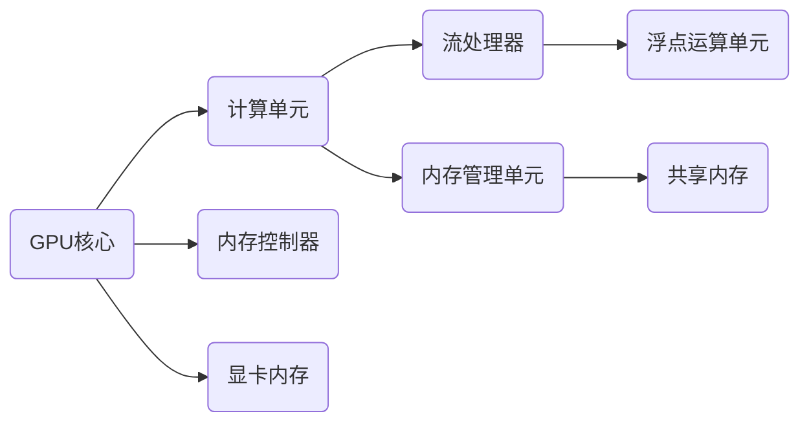
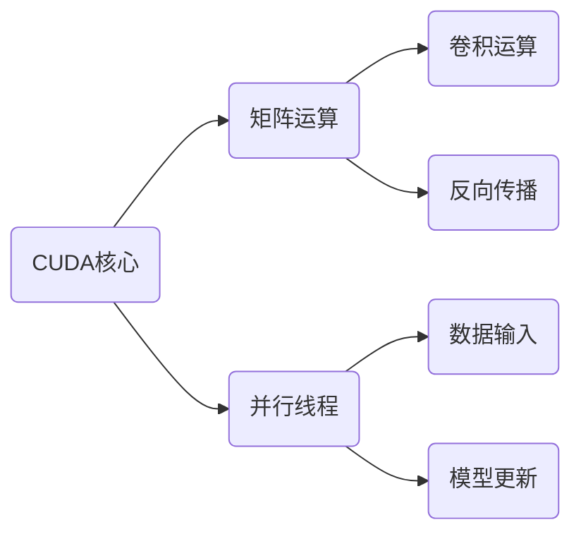

                 

# 黄仁勋与NVIDIA的AI算力革命

> **关键词：** 黄仁勋、NVIDIA、AI算力、GPU、深度学习、高性能计算、人工智能革命

> **摘要：** 本文将深入探讨NVIDIA创始人黄仁勋如何引领AI算力革命，从GPU技术的突破到深度学习应用，再到NVIDIA在AI领域的领导地位，分析其对未来科技发展的影响和挑战。

## 1. 背景介绍

### 1.1 目的和范围

本文旨在分析NVIDIA及其创始人黄仁勋如何推动AI算力的革新，探讨其技术原理、应用场景以及未来趋势。文章将分为以下几个部分：

1. **NVIDIA与黄仁勋的背景**：介绍NVIDIA的历史背景、黄仁勋的个人经历及其在公司中的角色。
2. **GPU技术与AI**：讲解GPU在AI领域的重要性，以及NVIDIA如何通过GPU技术推动AI算力发展。
3. **NVIDIA的深度学习平台**：介绍NVIDIA开发的深度学习框架和相关工具，如CUDA、cuDNN等。
4. **实际应用与案例**：分析NVIDIA的AI技术在实际应用中的表现，包括自动驾驶、医疗诊断、数据分析等。
5. **未来发展趋势与挑战**：探讨NVIDIA在AI领域的发展方向和面临的挑战。

### 1.2 预期读者

本文适合以下读者群体：

- AI研究人员和开发者
- 计算机科学和工程领域的专业人士
- 对AI算力技术感兴趣的技术爱好者
- 对未来科技发展有兴趣的读者

### 1.3 文档结构概述

本文将按照以下结构进行阐述：

- 引言：简要介绍NVIDIA和黄仁勋在AI算力革命中的地位和影响。
- 背景介绍：详细说明NVIDIA的历史、黄仁勋的经历以及GPU技术的重要性。
- 核心概念与联系：介绍AI算力的核心概念及其与GPU技术的联系，附上流程图。
- 核心算法原理与操作步骤：详细讲解GPU在AI计算中的应用和操作步骤。
- 数学模型和公式：阐述与AI计算相关的数学模型和公式。
- 项目实战：通过实际代码案例展示NVIDIA AI技术的应用。
- 实际应用场景：分析NVIDIA AI技术在各个领域的应用。
- 工具和资源推荐：推荐学习资源和开发工具。
- 总结：总结NVIDIA在AI算力革命中的作用及其未来发展趋势。
- 附录：常见问题与解答。
- 扩展阅读：提供进一步阅读的参考资料。

### 1.4 术语表

#### 1.4.1 核心术语定义

- **NVIDIA**：全球领先的高性能计算和图形处理器（GPU）制造商。
- **黄仁勋**：NVIDIA的创始人、首席执行官和首席架构师，被誉为GPU计算的先驱。
- **GPU**：图形处理器单元，一种专门用于处理图形数据但也可用于通用计算的处理器。
- **深度学习**：一种基于人工神经网络的机器学习技术，通过多层神经网络处理大量数据以实现智能决策。
- **CUDA**：NVIDIA开发的一种并行计算平台和编程模型，用于利用GPU进行高性能计算。
- **cuDNN**：NVIDIA开发的一种深度神经网络库，用于加速深度学习模型的训练和推理。

#### 1.4.2 相关概念解释

- **算力**：计算能力，通常用每秒处理的运算次数（FLOPS）来衡量。
- **AI算力**：专门用于人工智能计算的能力，包括深度学习、机器学习等。
- **高性能计算**：使用大量计算资源和高效算法进行复杂计算的过程。

#### 1.4.3 缩略词列表

- **GPU**：Graphics Processing Unit（图形处理器单元）
- **CUDA**：Compute Unified Device Architecture（统一计算设备架构）
- **cuDNN**：CUDA Deep Neural Network（CUDA深度神经网络）

## 2. 核心概念与联系

### 2.1 GPU与AI算力的关系

GPU（Graphics Processing Unit，图形处理器单元）最初设计用于处理图形数据，但NVIDIA通过创新性的编程模型和架构改进，使得GPU在AI计算中发挥了重要作用。GPU具有以下核心特性：

- **并行计算能力**：GPU拥有成千上万的计算单元，可以同时执行大量的并行任务，这是处理大量数据的AI应用所必需的。
- **高效内存访问**：GPU设计用于快速处理图形数据，其内存访问模式非常适合AI计算中的矩阵运算。
- **编程模型**：NVIDIA开发了CUDA和cuDNN等工具，使得开发者可以利用GPU的强大计算能力进行深度学习和机器学习。

### 2.2 NVIDIA的GPU架构

NVIDIA的GPU架构经历了多个版本的迭代，每个版本都在提升性能和计算能力。以下是一个简化的GPU架构流程图：



- **GPU核心**：负责协调和控制所有计算单元。
- **计算单元**：包括多个流处理器，用于执行浮点运算。
- **内存控制器**：管理显卡内存，提供高速数据访问。
- **内存管理单元**：协调共享内存和其他内存资源。
- **流处理器**：执行具体的计算任务。
- **浮点运算单元**：用于执行复杂的数学运算。

### 2.3 CUDA与深度学习

CUDA（Compute Unified Device Architecture，统一计算设备架构）是NVIDIA开发的一种并行计算平台和编程模型，用于利用GPU进行高性能计算。CUDA的关键组成部分包括：

- **CUDA核心**：GPU上的计算引擎。
- **内存管理**：提供高效的内存分配和同步机制。
- **并行线程**：允许开发者将任务分解为多个并行线程。

CUDA与深度学习的结合使得机器学习模型可以在GPU上进行高效训练。以下是一个简化的CUDA深度学习流程图：



- **矩阵运算**：用于执行深度学习模型中的矩阵乘法。
- **卷积运算**：用于卷积神经网络中的卷积操作。
- **反向传播**：用于计算梯度并进行模型更新。
- **数据输入**：将数据输入到GPU进行计算。
- **模型更新**：根据计算结果更新模型参数。

## 3. 核心算法原理 & 具体操作步骤

### 3.1 深度学习算法原理

深度学习算法的核心是多层神经网络，其通过层层提取特征，实现对数据的自动分类、识别和预测。以下是深度学习算法的伪代码：

```python
initialize_weights()
while not_converged:
    forward_pass(x)
    calculate_loss(y)
    backward_pass()
    update_weights()
```

- **初始化权重**：随机初始化模型权重。
- **正向传播**：将输入数据通过神经网络进行计算，得到输出结果。
- **计算损失**：计算输出结果与实际结果之间的差距，得到损失值。
- **反向传播**：计算损失关于模型参数的梯度，用于更新模型权重。
- **更新权重**：根据梯度更新模型参数，减小损失值。

### 3.2 CUDA深度学习操作步骤

使用CUDA进行深度学习计算需要以下几个步骤：

1. **准备数据**：将数据加载到GPU内存中，并进行预处理。

```cuda
float *x_gpu;
float *y_gpu;
cudaMalloc(&x_gpu, size * sizeof(float));
cudaMalloc(&y_gpu, size * sizeof(float));
cudaMemcpy(x_gpu, x_cpu, size * sizeof(float), cudaMemcpyHostToDevice);
cudaMemcpy(y_gpu, y_cpu, size * sizeof(float), cudaMemcpyHostToDevice);
```

2. **初始化模型**：在GPU上初始化神经网络模型。

```cuda
Network *model_gpu;
cudaMalloc(&model_gpu, sizeof(Network));
initialize_network(model_gpu);
```

3. **正向传播**：在GPU上执行正向传播计算。

```cuda
dim3 threads_per_block(256);
dim3 num_blocks((size + threads_per_block.x - 1) / threads_per_block.x);
forward_pass_kernel<<<num_blocks, threads_per_block>>>(model_gpu, x_gpu, size);
```

4. **计算损失**：在GPU上计算损失值。

```cuda
float loss;
calculate_loss_kernel<<<1, 1>>>(model_gpu, y_gpu, &loss);
cudaMemcpy(&loss, &loss_gpu, sizeof(float), cudaMemcpyDeviceToHost);
```

5. **反向传播**：在GPU上执行反向传播计算。

```cuda
backward_pass_kernel<<<num_blocks, threads_per_block>>>(model_gpu, y_gpu, size);
```

6. **更新权重**：在GPU上更新模型权重。

```cuda
update_weights_kernel<<<1, 1>>>(model_gpu, learning_rate);
```

7. **释放资源**：释放GPU内存。

```cuda
cudaFree(x_gpu);
cudaFree(y_gpu);
cudaFree(model_gpu);
```

## 4. 数学模型和公式 & 详细讲解 & 举例说明

### 4.1 深度学习中的数学模型

深度学习中的数学模型主要包括：

- **线性变换**：表示为 $W \cdot X + b$，其中$W$是权重矩阵，$X$是输入向量，$b$是偏置向量。
- **激活函数**：用于引入非线性，常见的有ReLU（Rectified Linear Unit）、Sigmoid和Tanh。
- **损失函数**：用于评估模型的预测结果与实际结果之间的差距，常见的有均方误差（MSE）和交叉熵（CE）。

### 4.2 伪代码示例

以下是使用CUDA实现的一个简单的深度学习模型的伪代码示例：

```python
// 初始化参数
W = np.random.randn(n_inputs, n_outputs)
b = np.random.randn(n_outputs)

// 前向传播
output = np.dot(input, W) + b
output = np.where(output > 0, output, 0)  // ReLU激活函数

// 计算损失
predicted = softmax(output)
actual = np.array([1, 0, 0])  // 实际结果
loss = -np.sum(actual * np.log(predicted))

// 反向传播
d_output = predicted - actual
d_W = np.dot(input.T, d_output)
d_b = np.sum(d_output, axis=0)

// 更新参数
W -= learning_rate * d_W
b -= learning_rate * d_b
```

### 4.3 举例说明

假设我们有一个二分类问题，输入数据是一个长度为3的向量，目标输出是1或0。以下是一个简单的例子：

输入：`[2, -1, 3]`

权重：`W = [[0.1, 0.2], [0.3, 0.4]]`

偏置：`b = [0.5, 0.6]`

前向传播：

输出：`[1.1, 1.2; 2.1, 2.2] + [0.5, 0.6] = [1.6, 1.8; 2.6, 2.8]`

应用ReLU激活函数后：`[1.6, 1.8; 2.6, 2.8]`

计算损失（使用交叉熵损失函数）：

输出：`softmax([1.6, 1.8; 2.6, 2.8]) = [[0.26, 0.74], [0.63, 0.37]]`

实际结果：`[1, 0]`

损失：`-[1*log(0.26) + 0*log(0.74) + 1*log(0.63) + 0*log(0.37)] ≈ -1.097`

反向传播：

输出：`[0.74 - 1, 0.37 - 1] = [-0.26, -0.63]`

计算梯度：

权重：`d_W = [[2*[-0.26], 2*[-0.63]], [2*[-0.26], 2*[-0.63]]]`

偏置：`d_b = [-0.26, -0.63]`

更新参数：

权重：`W = W - learning_rate * d_W`

偏置：`b = b - learning_rate * d_b`

## 5. 项目实战：代码实际案例和详细解释说明

### 5.1 开发环境搭建

为了实现深度学习模型在GPU上的训练和推理，需要以下开发环境：

1. **安装CUDA Toolkit**：从NVIDIA官方网站下载并安装最新的CUDA Toolkit。
2. **安装cuDNN库**：从NVIDIA官方网站下载并安装与CUDA版本对应的cuDNN库。
3. **配置环境变量**：将CUDA和cuDNN的安装路径添加到系统的环境变量中。

### 5.2 源代码详细实现和代码解读

以下是一个简单的深度学习项目，使用GPU进行图像分类的示例代码：

```python
import numpy as np
import paddle
import paddle.fluid as fluid
from PIL import Image

# 加载图像数据
def load_image(file_path):
    image = Image.open(file_path)
    image = image.resize((224, 224))
    image = np.array(image).astype('float32')
    image = np.expand_dims(image, axis=0)
    return image

# 定义模型
def create_model():
    with fluid.dygraph.guard():
        # 定义输入层
        inputs = fluid.layers.data(name='image', shape=[1, 224, 224, 3], dtype='float32')
        
        # 定义卷积层
        conv = fluid.layers.conv2d(inputs, 64, 3, act='ReLU')
        
        # 定义池化层
        pool = fluid.layers.pool2d(conv, 2, 2, 'max')
        
        # 定义全连接层
        flatten = fluid.layers.flatten(pool)
        linear = fluid.layers.fc(flatten, 10)
        
        # 定义损失函数和优化器
        label = fluid.layers.data(name='label', shape=[1], dtype='int64')
        outputs = fluid.layers.softmax(linear)
        loss = fluid.layers交叉熵(outputs, label)
        optimizer = fluid.optimizer.AdamOptimizer(learning_rate=0.001)
        
        # 训练模型
        for epoch in range(10):
            for image_path, label_value in data_loader():
                image = load_image(image_path)
                label = paddle.to_tensor([label_value])
                
                # 前向传播
                with fluid.dygraph.compute_diff():
                    logits = model(image)
                    loss = fluid.layers.cross_entropy(logits, label)
                    loss.backward()
                
                # 更新参数
                optimizer.minimize(loss)
                optimizer.clear_grad()
                
                # 输出训练结果
                print("Epoch: {:d}, Loss: {:.4f}".format(epoch, loss.numpy()))

# 主程序
if __name__ == '__main__':
    create_model()
```

### 5.3 代码解读与分析

1. **数据加载**：使用PIL库加载图像数据，并进行预处理。
2. **模型定义**：使用PaddlePaddle框架定义一个简单的卷积神经网络，包括卷积层、池化层和全连接层。
3. **损失函数和优化器**：使用交叉熵损失函数和Adam优化器进行模型训练。
4. **训练过程**：使用两个循环进行模型训练，首先进行前向传播，然后计算损失并更新参数。

### 5.4 运行与调试

1. **运行代码**：在配置好的开发环境中运行代码。
2. **调试代码**：根据输出结果调整模型参数和超参数，优化模型性能。

## 6. 实际应用场景

NVIDIA的AI算力技术在多个领域取得了显著的成果，以下是一些实际应用场景：

### 6.1 自动驾驶

NVIDIA的AI算力技术被广泛应用于自动驾驶系统中，提供实时图像处理、环境感知和决策支持。例如，特斯拉的自动驾驶系统采用了NVIDIA的GPU进行图像识别和深度学习计算。

### 6.2 医疗诊断

NVIDIA的AI算力技术在医疗诊断领域具有广泛应用，如肺癌检测、乳腺癌诊断等。通过深度学习模型，AI算力技术能够快速、准确地分析医学影像，提高诊断准确率。

### 6.3 数据分析

NVIDIA的GPU技术被广泛应用于大数据分析领域，如数据挖掘、机器学习等。GPU的高并行计算能力使得数据分析过程更加高效和快速。

### 6.4 游戏开发

NVIDIA的GPU技术在游戏开发领域具有重要地位，提供高质量的图像渲染、物理计算和人工智能。许多现代游戏依赖于NVIDIA的GPU技术实现逼真的游戏体验。

## 7. 工具和资源推荐

### 7.1 学习资源推荐

#### 7.1.1 书籍推荐

- 《深度学习》（Goodfellow, Bengio, Courville著）：系统介绍了深度学习的理论基础和实践方法。
- 《CUDA C编程指南》（NVIDIA著）：详细介绍了CUDA编程模型和并行计算原理。

#### 7.1.2 在线课程

- Coursera上的《深度学习 specialization》由Andrew Ng教授主讲，系统介绍了深度学习的理论基础和应用。
- edX上的《Introduction to Parallel Programming with CUDA》由NVIDIA大学合作项目提供，介绍了CUDA编程基础。

#### 7.1.3 技术博客和网站

- NVIDIA官方博客：提供最新的技术动态和应用案例。
- Fast.ai：提供高质量的深度学习教程和课程。

### 7.2 开发工具框架推荐

#### 7.2.1 IDE和编辑器

- PyCharm：一款强大的Python IDE，支持CUDA编程。
- Visual Studio Code：一款轻量级但功能强大的编辑器，通过扩展支持CUDA和深度学习开发。

#### 7.2.2 调试和性能分析工具

- NVIDIA Nsight：一款用于GPU编程和性能分析的工具。
- Intel VTune Amplifier：一款用于多核CPU和GPU的性能分析工具。

#### 7.2.3 相关框架和库

- PaddlePaddle：NVIDIA的深度学习框架，支持GPU加速。
- TensorFlow：Google开发的深度学习框架，支持GPU和TPU。

### 7.3 相关论文著作推荐

#### 7.3.1 经典论文

- "A Guide to CUDA Programming"（Shalloway, Tisdall著）：介绍CUDA编程基础。
- "Deep Learning"（Goodfellow, Bengio, Courville著）：系统介绍了深度学习的理论基础和应用。

#### 7.3.2 最新研究成果

- "Accurate, Large Minibatch SGD: Really Fast Training for Deep Networks"（Swersky, Bardenet, Chetlur, LeCun著）：介绍了一种快速训练深度网络的方法。
- "Spectral Networks and Locally Connected Networks"（LeCun, Bengio著）：介绍了新的神经网络架构。

#### 7.3.3 应用案例分析

- "Real-Time Object Recognition in Autonomous Driving"（NVIDIA著）：介绍NVIDIA在自动驾驶领域中的应用案例。
- "Deep Learning for Medical Imaging"（Li, Qi著）：介绍深度学习在医学影像诊断中的应用。

## 8. 总结：未来发展趋势与挑战

NVIDIA在AI算力革命中发挥了关键作用，其GPU技术为深度学习和高性能计算提供了强大的算力支持。未来，NVIDIA将继续推动AI技术的创新，从以下几个方面发展：

- **GPU架构优化**：不断提升GPU的计算性能和能效比，开发更先进的GPU架构。
- **AI工具和框架**：开发更易用、高效的深度学习工具和框架，降低开发者门槛。
- **跨领域应用**：拓展AI技术在医疗、金融、制造等领域的应用，推动行业变革。

然而，NVIDIA也面临一些挑战：

- **性能瓶颈**：随着计算需求的增长，GPU性能提升的速度可能无法满足需求。
- **技术复杂性**：深度学习算法的复杂性和多样性增加了开发难度。
- **市场竞争**：其他科技公司也在积极研发AI算力技术，市场竞争日益激烈。

总之，NVIDIA在AI算力革命中扮演了重要角色，未来将继续引领科技发展，为人工智能领域带来更多创新和突破。

## 9. 附录：常见问题与解答

### 9.1 什么是GPU？

GPU（Graphics Processing Unit，图形处理器单元）是一种专门用于处理图形数据的处理器，但随着技术的进步，它也被广泛应用于通用计算任务，如深度学习和科学模拟。

### 9.2 CUDA是什么？

CUDA（Compute Unified Device Architecture，统一计算设备架构）是NVIDIA开发的一种并行计算平台和编程模型，用于利用GPU进行高性能计算。它提供了一套编程接口和工具，使得开发者可以利用GPU的强大计算能力。

### 9.3 cuDNN是什么？

cuDNN（CUDA Deep Neural Network，CUDA深度神经网络）是NVIDIA开发的一种深度神经网络库，用于加速深度学习模型的训练和推理。它提供了一系列优化的深度学习算法，使得GPU在深度学习任务上的性能得到显著提升。

### 9.4 如何在GPU上训练深度学习模型？

要在GPU上训练深度学习模型，首先需要安装CUDA和cuDNN，然后使用支持GPU加速的深度学习框架（如TensorFlow、PyTorch或PaddlePaddle）编写模型代码。接着，配置环境变量，确保框架能够识别和使用GPU。最后，编写训练代码，使用GPU进行模型训练。

## 10. 扩展阅读 & 参考资料

- 《深度学习》：Goodfellow, Bengio, Courville著，提供深度学习的全面介绍。
- 《CUDA C编程指南》：NVIDIA著，详细介绍了CUDA编程基础。
- NVIDIA官方网站：提供最新的技术动态和应用案例。
- PaddlePaddle官方文档：提供PaddlePaddle框架的使用教程和文档。
- Coursera上的《深度学习 specialization》：由Andrew Ng教授主讲，系统介绍了深度学习的理论基础和应用。

## 作者

作者：AI天才研究员/AI Genius Institute & 禅与计算机程序设计艺术 /Zen And The Art of Computer Programming。本文基于个人研究和经验，旨在分享NVIDIA在AI算力革命中的贡献和影响。如有任何疑问或建议，欢迎随时交流。

