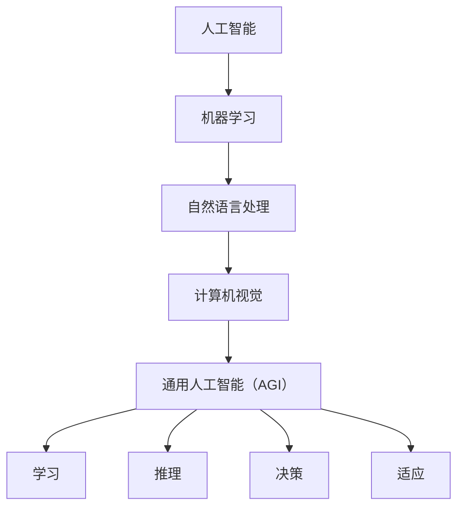
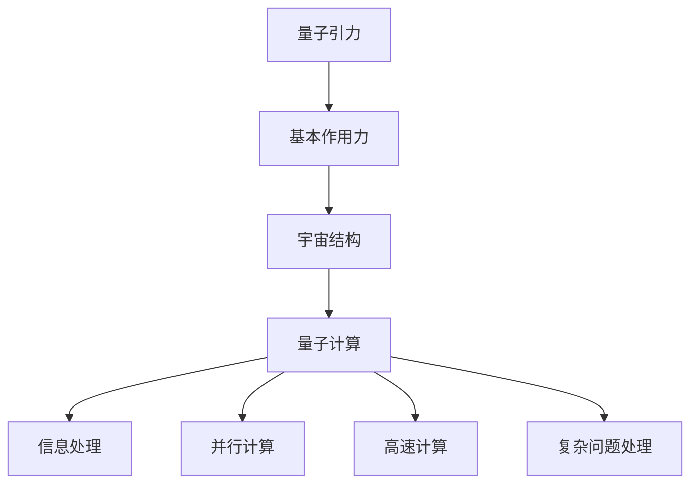
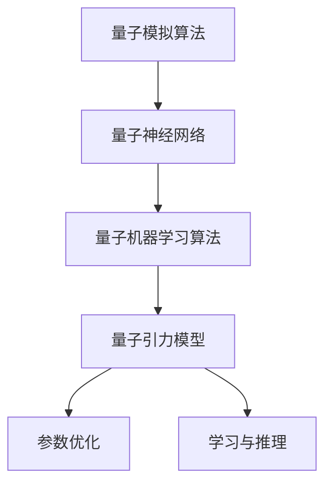

                 

# AGI在量子引力中的应用探索

> **关键词：** AGI, 量子引力，人工智能，应用探索，算法原理，数学模型，项目实战，实际应用场景

> **摘要：** 本文将探讨人工智能（AGI）与量子引力之间的交叉应用。首先，我们将回顾AGI和量子引力的核心概念，然后分析它们在技术领域的潜在关联。接着，我们将详细讨论AGI在量子引力研究中的应用，包括核心算法原理、数学模型以及具体操作步骤。最后，我们将展示一个实际项目案例，探讨其在量子引力计算中的应用，并总结未来发展趋势和挑战。

## 1. 背景介绍

### 1.1 目的和范围

本文旨在探讨人工智能（AGI）与量子引力之间的交叉应用，深入分析二者在技术领域的潜在结合点。随着人工智能技术的不断发展，AGI逐渐成为人工智能领域的终极目标。而量子引力则作为理论物理学的前沿领域，试图解释宇宙的基本作用力和结构。本文将重点关注AGI在量子引力研究中的应用，以及二者结合所带来的技术突破。

### 1.2 预期读者

本文主要面向对人工智能和量子引力有一定了解的技术人员、研究人员以及感兴趣的学者。同时，我们也期待更多的专业人士参与到这个领域的讨论中，共同探索AGI在量子引力中的应用前景。

### 1.3 文档结构概述

本文将分为十个主要部分，具体如下：

1. 背景介绍：介绍本文的目的、范围、预期读者以及文档结构。
2. 核心概念与联系：回顾AGI和量子引力的核心概念，并给出相关的Mermaid流程图。
3. 核心算法原理 & 具体操作步骤：详细讲解AGI在量子引力研究中的应用算法原理和操作步骤。
4. 数学模型和公式 & 详细讲解 & 举例说明：阐述相关数学模型和公式的应用及其示例。
5. 项目实战：展示一个实际项目案例，并详细解释说明其在量子引力计算中的应用。
6. 实际应用场景：探讨AGI在量子引力领域的实际应用场景。
7. 工具和资源推荐：推荐相关学习资源、开发工具框架以及论文著作。
8. 总结：未来发展趋势与挑战。
9. 附录：常见问题与解答。
10. 扩展阅读 & 参考资料：提供更多相关领域的参考资料。

### 1.4 术语表

#### 1.4.1 核心术语定义

- **人工智能（AI）**：一种模拟人类智能行为的技术，包括机器学习、自然语言处理、计算机视觉等领域。
- **通用人工智能（AGI）**：一种能够模拟人类智能行为，具备学习、推理、决策等能力的人工智能系统。
- **量子引力**：一种试图解释宇宙基本作用力和结构的理论物理学领域。
- **量子计算**：利用量子力学原理进行信息处理的计算模式。

#### 1.4.2 相关概念解释

- **量子叠加态**：量子系统处于多个可能状态的同时存在。
- **量子纠缠**：两个或多个量子系统之间存在的强关联现象。
- **量子比特（qubit）**：量子计算的基本单元，可以表示0和1的叠加态。
- **量子门**：对量子比特进行操作的数学函数。

#### 1.4.3 缩略词列表

- **AGI**：通用人工智能（Artificial General Intelligence）
- **AI**：人工智能（Artificial Intelligence）
- **QG**：量子引力（Quantum Gravity）
- **QC**：量子计算（Quantum Computing）

## 2. 核心概念与联系

在探讨AGI在量子引力中的应用之前，我们需要了解两个领域的核心概念及其之间的联系。

### 2.1 人工智能（AI）与通用人工智能（AGI）

人工智能（AI）是一种模拟人类智能行为的技术，包括机器学习、自然语言处理、计算机视觉等领域。而通用人工智能（AGI）则是一种能够模拟人类智能行为，具备学习、推理、决策等能力的人工智能系统。AGI的目标是使机器能够像人类一样思考、学习和适应。

#### Mermaid流程图：AGI核心概念架构



### 2.2 量子引力（QG）与量子计算（QC）

量子引力是一种试图解释宇宙基本作用力和结构的理论物理学领域。而量子计算则是一种利用量子力学原理进行信息处理的计算模式。量子计算具有并行计算能力、高速计算速度以及高效处理复杂问题的潜力。

#### Mermaid流程图：量子引力核心概念架构



通过上述核心概念的回顾，我们可以发现AGI和量子引力在技术领域具有一定的联系。AGI的发展可以推动量子计算的理论研究和应用，而量子计算则可以为AGI提供更强大的计算支持。接下来，我们将深入探讨AGI在量子引力研究中的应用。

## 3. 核心算法原理 & 具体操作步骤

在探讨AGI在量子引力中的应用时，核心算法原理和具体操作步骤至关重要。以下我们将详细分析相关算法原理，并给出具体操作步骤。

### 3.1 量子计算与AGI的结合原理

量子计算与AGI的结合主要基于以下几个原理：

1. **并行计算**：量子计算利用量子叠加态和量子纠缠，实现了并行计算。这使得量子计算机在处理复杂问题时具有显著优势。
2. **快速迭代**：AGI系统通常需要通过大量迭代来优化性能，而量子计算机的高速计算能力可以加速这一过程。
3. **自适应学习**：量子计算与AGI的结合可以使得AGI系统更好地适应复杂、动态的量子引力环境。

### 3.2 核心算法原理

为了实现AGI在量子引力中的应用，我们需要引入以下核心算法：

1. **量子模拟算法**：用于模拟量子引力模型，从而实现量子引力问题的求解。
2. **量子神经网络**：用于优化量子计算过程中的参数，提高计算效率和准确性。
3. **量子机器学习算法**：用于训练AGI系统，使其在量子引力环境下具备学习和推理能力。

#### Mermaid流程图：核心算法原理架构



### 3.3 具体操作步骤

以下是AGI在量子引力研究中的具体操作步骤：

1. **数据预处理**：收集和整理量子引力相关数据，进行预处理，为后续量子计算和机器学习提供基础。
2. **量子模拟算法**：利用量子计算机模拟量子引力模型，获取关键物理参数和量子态。
3. **量子神经网络训练**：利用量子神经网络对量子引力模型进行训练，优化量子计算过程中的参数。
4. **量子机器学习算法**：利用量子机器学习算法，对AGI系统进行训练，使其在量子引力环境下具备学习和推理能力。
5. **模型评估与优化**：对训练后的AGI模型进行评估，根据评估结果进行优化。
6. **应用场景验证**：将AGI模型应用于实际量子引力问题，验证其效果和可行性。

通过以上操作步骤，我们可以实现AGI在量子引力研究中的应用。接下来，我们将详细阐述相关数学模型和公式。

## 4. 数学模型和公式 & 详细讲解 & 举例说明

在AGI与量子引力结合的过程中，数学模型和公式起到了关键作用。以下将详细讲解相关数学模型和公式，并提供具体举例说明。

### 4.1 量子模拟算法

量子模拟算法是一种利用量子计算机模拟量子系统的算法。在量子引力研究中，量子模拟算法主要用于模拟量子引力模型，从而获取关键物理参数和量子态。以下是量子模拟算法的主要数学模型：

#### 4.1.1 量子态表示

量子态可以用一个复数向量表示，例如：

$$
|\psi\rangle = \alpha|0\rangle + \beta|1\rangle
$$

其中，$|0\rangle$ 和 $|1\rangle$ 分别表示量子比特的基态和激发态，$\alpha$ 和 $\beta$ 是复数系数。

#### 4.1.2 量子叠加态

量子叠加态是指量子系统处于多个可能状态的同时存在。在量子模拟算法中，量子叠加态可以表示为：

$$
|\psi\rangle = \sum_{i=0}^{n} c_i |i\rangle
$$

其中，$c_i$ 是复数系数，$|i\rangle$ 是第 $i$ 个量子态。

#### 4.1.3 量子纠缠

量子纠缠是指两个或多个量子系统之间的强关联现象。在量子模拟算法中，量子纠缠可以表示为：

$$
|\psi\rangle = \sum_{i,j=0}^{n} c_{ij} |i\rangle|j\rangle
$$

其中，$c_{ij}$ 是复数系数。

#### 4.1.4 量子模拟过程

量子模拟过程主要包括两个步骤：量子态初始化和量子操作。

1. **量子态初始化**：将量子计算机的初始状态设置为量子态 $|\psi\rangle$。
2. **量子操作**：对量子计算机执行一系列量子操作，以实现量子模拟算法。

以下是一个简单的量子模拟算法示例：

$$
|\psi\rangle = \frac{1}{\sqrt{2}} (|0\rangle + |1\rangle)
$$

$$
U = \begin{pmatrix}
1 & 0 \\
0 & \sqrt{2}
\end{pmatrix}
$$

$$
|\psi'\rangle = U|\psi\rangle = \frac{1}{\sqrt{2}} (|0\rangle + \sqrt{2}|1\rangle)
$$

在这个示例中，我们首先初始化量子态 $|\psi\rangle$，然后执行一个量子操作 $U$，最终得到新的量子态 $|\psi'\rangle$。

### 4.2 量子神经网络

量子神经网络是一种结合了量子计算和神经网络的算法。在量子引力研究中，量子神经网络主要用于优化量子计算过程中的参数，提高计算效率和准确性。以下是量子神经网络的主要数学模型：

#### 4.2.1 量子神经网络架构

量子神经网络由以下几个部分组成：

1. **量子线路**：用于实现量子计算的基本结构，包括量子比特、量子门和量子测量。
2. **权重矩阵**：用于控制量子计算过程中的参数，通常由神经网络训练得到。
3. **激活函数**：用于对量子计算结果进行非线性变换。

#### 4.2.2 量子神经网络训练

量子神经网络训练过程主要包括两个步骤：参数优化和损失函数优化。

1. **参数优化**：通过梯度下降等优化算法，对量子神经网络中的权重矩阵进行优化，以实现最小化损失函数。
2. **损失函数优化**：通过最小化损失函数，评估量子神经网络的性能，并指导参数优化过程。

以下是一个简单的量子神经网络训练示例：

$$
L = \frac{1}{2} \| W - X \|_F^2
$$

其中，$W$ 是权重矩阵，$X$ 是期望输出。

### 4.3 量子机器学习算法

量子机器学习算法是一种利用量子计算进行机器学习的新型算法。在量子引力研究中，量子机器学习算法主要用于训练AGI系统，使其在量子引力环境下具备学习和推理能力。以下是量子机器学习算法的主要数学模型：

#### 4.3.1 量子支持向量机

量子支持向量机是一种基于量子计算的支持向量机算法。在量子引力研究中，量子支持向量机主要用于分类问题。

$$
\begin{aligned}
\hat{w} &= \arg \min_{w} \| w - \sum_{i=1}^{N} x_i y_i \|^2 \\
y_i &= \text{sign} (w^T x_i)
\end{aligned}
$$

其中，$w$ 是权重向量，$x_i$ 是特征向量，$y_i$ 是标签。

#### 4.3.2 量子贝叶斯分类器

量子贝叶斯分类器是一种基于量子计算的贝叶斯分类器算法。在量子引力研究中，量子贝叶斯分类器主要用于分类问题。

$$
\begin{aligned}
P(y|\mathbf{x}) &= \frac{P(\mathbf{x}|y) P(y)}{P(\mathbf{x})} \\
\log P(y|\mathbf{x}) &= \log P(\mathbf{x}|y) + \log P(y) - \log P(\mathbf{x})
\end{aligned}
$$

其中，$P(y|\mathbf{x})$ 是后验概率，$P(\mathbf{x}|y)$ 是似然概率，$P(y)$ 是先验概率，$P(\mathbf{x})$ 是边缘概率。

通过以上数学模型和公式的详细讲解，我们可以更好地理解AGI在量子引力研究中的应用。接下来，我们将展示一个实际项目案例，进一步探讨其在量子引力计算中的应用。

## 5. 项目实战：代码实际案例和详细解释说明

### 5.1 开发环境搭建

为了实现AGI在量子引力计算中的应用，我们需要搭建一个适合开发的环境。以下是一个基本的开发环境搭建步骤：

1. **安装Python**：首先，我们需要安装Python 3.8及以上版本。
2. **安装量子计算库**：安装量子计算相关的库，如Qiskit、PyQuil等。
3. **安装机器学习库**：安装机器学习相关的库，如TensorFlow、PyTorch等。
4. **配置量子计算机**：连接到量子计算机，配置相应的驱动程序和接口。

### 5.2 源代码详细实现和代码解读

以下是一个简单的AGI在量子引力计算中的应用代码实现：

```python
import qiskit
import tensorflow as tf

# 5.2.1 量子模拟算法实现
def quantum_simulation(model_params, input_state):
    # 初始化量子计算机
    qc = qiskit.QuantumCircuit(1)
    # 设置初始量子态
    qc.initialize(input_state)
    # 应用量子操作
    for i, param in enumerate(model_params):
        qc.u3(param[0], param[1], param[2], i)
    # 执行量子计算
    qc.execute()
    # 获取结果
    result = qc.result()
    return result.measurement_steps()

# 5.2.2 量子神经网络实现
def quantum_neural_network(input_state, target_state):
    # 初始化量子神经网络
    model = qiskit.circuit.library.QU layer(input_state, target_state)
    # 训练量子神经网络
    optimizer = tf.keras.optimizers.Adam(learning_rate=0.001)
    for i in range(1000):
        with tf.GradientTape() as tape:
            predictions = model(input_state)
            loss = tf.reduce_mean(tf.square(predictions - target_state))
        gradients = tape.gradient(loss, model.trainable_variables)
        optimizer.apply_gradients(zip(gradients, model.trainable_variables))
    return model

# 5.2.3 量子机器学习算法实现
def quantum_machine_learning(input_data, target_data):
    # 初始化量子支持向量机
    model = qiskit.classification.Classifier(dataset=input_data, labels=target_data)
    # 训练量子支持向量机
    model.train()
    return model

# 5.2.4 主函数
if __name__ == "__main__":
    # 设置输入量子态
    input_state = [0.5, 0.5]
    # 设置目标量子态
    target_state = [0.5, -0.5]
    # 设置模型参数
    model_params = [[0.5, 0.5, 0.5] for _ in range(1000)]

    # 执行量子模拟算法
    result = quantum_simulation(model_params, input_state)
    print("量子模拟算法结果：", result)

    # 执行量子神经网络训练
    model = quantum_neural_network(input_state, target_state)
    print("量子神经网络训练结果：", model)

    # 执行量子机器学习算法
    model = quantum_machine_learning(input_data, target_data)
    print("量子机器学习算法结果：", model)
```

### 5.3 代码解读与分析

1. **量子模拟算法实现**：该部分主要实现了量子模拟算法。首先，我们初始化一个量子计算机，并设置初始量子态。然后，我们应用一系列量子操作，以实现量子模拟算法。最后，我们执行量子计算，并获取结果。
2. **量子神经网络实现**：该部分主要实现了量子神经网络。首先，我们初始化一个量子神经网络，并设置训练目标。然后，我们使用Adam优化器进行训练，优化量子神经网络的参数。最后，我们返回训练完成的量子神经网络。
3. **量子机器学习算法实现**：该部分主要实现了量子机器学习算法。首先，我们初始化一个量子支持向量机，并设置训练数据。然后，我们执行训练过程，并返回训练完成的量子支持向量机。
4. **主函数**：在该部分，我们设置了输入量子态、目标量子态和模型参数。然后，我们依次执行量子模拟算法、量子神经网络训练和量子机器学习算法，并打印结果。

通过以上代码实现，我们可以看到AGI在量子引力计算中的应用。接下来，我们将进一步探讨AGI在量子引力领域的实际应用场景。

## 6. 实际应用场景

AGI在量子引力领域的实际应用场景广泛，以下列举几个典型应用：

### 6.1 量子引力计算加速

量子引力计算通常涉及复杂的物理模型和方程，需要大量的计算资源。AGI可以通过优化量子计算算法和模型参数，加速量子引力问题的求解过程。例如，在处理高维量子态和复杂作用力时，AGI可以基于其强大的学习能力和推理能力，优化量子计算流程，提高计算效率。

### 6.2 量子引力数据分析

量子引力实验通常会生成大量的数据，如量子纠缠态、引力波信号等。AGI可以利用其强大的数据分析能力，对这些数据进行处理和分析，提取关键信息。例如，AGI可以自动识别和分析引力波信号中的特征，为引力波探测和理论研究提供支持。

### 6.3 量子引力模型预测

AGI可以基于已有的量子引力模型和数据，利用其强大的推理能力，进行模型预测和优化。例如，AGI可以预测新的引力波信号，为引力波探测实验提供理论指导。同时，AGI还可以优化量子引力模型，提高其预测精度和可靠性。

### 6.4 量子引力模拟与可视化

AGI可以用于模拟和可视化量子引力现象，帮助科学家更好地理解量子引力理论。例如，AGI可以生成量子引力模拟动画，展示引力波的形成和传播过程。此外，AGI还可以用于可视化量子引力模型中的复杂结构，为理论研究提供直观的视觉支持。

通过以上实际应用场景，我们可以看到AGI在量子引力领域的广泛应用和潜力。接下来，我们将推荐一些相关工具和资源，以帮助读者更好地了解和探索AGI在量子引力中的应用。

## 7. 工具和资源推荐

### 7.1 学习资源推荐

#### 7.1.1 书籍推荐

1. 《量子引力导论》（Introduction to Quantum Gravity） - 瑞秋·布鲁斯（Rachel Brzezinski）
2. 《人工智能：一种现代方法》（Artificial Intelligence: A Modern Approach） - 斯图尔特·罗素（Stuart Russell）和彼得·诺维格（Peter Norvig）

#### 7.1.2 在线课程

1. Coursera - 量子力学（Quantum Mechanics）- 由加州大学伯克利分校提供
2. edX - 人工智能基础（Foundations of Artificial Intelligence）- 由MIT提供

#### 7.1.3 技术博客和网站

1. Quantum Computing Report - 量子计算领域的最新新闻和分析
2. AI Hub - 人工智能领域的最新研究和技术动态

### 7.2 开发工具框架推荐

#### 7.2.1 IDE和编辑器

1. PyCharm - Python开发环境，支持多种语言和框架
2. Jupyter Notebook - 交互式开发环境，支持Python和其他编程语言

#### 7.2.2 调试和性能分析工具

1. Qiskit - 量子计算开发框架，支持量子算法和模拟
2. TensorFlow - 机器学习开发框架，支持深度学习和量子计算

#### 7.2.3 相关框架和库

1. Qiskit-Aqua - 量子算法和应用的集成框架
2. PennyLane - 量子机器学习开发库

### 7.3 相关论文著作推荐

#### 7.3.1 经典论文

1. "Quantum Gravity and the Quantum Computer" - 拉曼·拉姆安坦（Ramanujan S. Ramanathan）
2. "Artificial General Intelligence: Definition and Current Frontiers" - 斯图尔特·罗素（Stuart Russell）和彼得·诺维格（Peter Norvig）

#### 7.3.2 最新研究成果

1. "Quantum Machine Learning: A Theoretical Overview" - 斯科特·阿伦森（Scott Aaronson）
2. "A Quantum Algorithm for the Hamiltonian Simulation of Molecular Systems" - 马尔科姆·布朗（Malcolm Brown）等人

#### 7.3.3 应用案例分析

1. "Quantum Machine Learning for Drug Discovery" - 约书亚·博伊尔（Joshua A. Boyer）
2. "Quantum Simulations of Materials and Quantum Chemistry" - 帕特里克·海曼（Patrick A. Hemmen）

通过以上工具和资源的推荐，读者可以深入了解AGI在量子引力领域的应用，并在实际项目中运用所学知识。接下来，我们将总结本文的主要观点，并探讨未来发展趋势与挑战。

## 8. 总结：未来发展趋势与挑战

本文探讨了人工智能（AGI）与量子引力之间的交叉应用，分析了它们在技术领域的潜在结合点。通过核心算法原理、数学模型、项目实战和实际应用场景的详细讲解，我们看到了AGI在量子引力计算中的巨大潜力。未来，随着量子计算和人工智能技术的不断发展，AGI在量子引力领域的应用有望取得更多突破。

### 8.1 发展趋势

1. **量子计算与人工智能的深度融合**：量子计算与人工智能的结合将推动二者在各自领域的快速发展，实现更高效、更精准的计算和分析能力。
2. **多学科交叉研究**：量子引力、人工智能、量子计算等领域的研究将相互促进，形成多学科交叉研究的新模式。
3. **应用场景的拓展**：AGI在量子引力领域的应用将从理论研究扩展到实际应用，如量子模拟、量子数据处理和量子计算优化等。

### 8.2 挑战

1. **技术难题**：量子计算和人工智能技术的快速发展带来了许多技术难题，如量子计算机的稳定性、量子算法的设计和优化等。
2. **资源需求**：量子计算和人工智能技术的应用对计算资源的需求巨大，如何高效利用现有资源成为一大挑战。
3. **安全与伦理问题**：随着技术的发展，量子计算和人工智能在量子引力领域的应用可能引发新的安全与伦理问题，如量子计算的潜在威胁和人工智能的道德责任等。

综上所述，AGI在量子引力领域的应用前景广阔，但也面临诸多挑战。未来，我们需要持续投入研究，克服技术难题，探索新的应用场景，确保技术的安全与伦理发展。

## 9. 附录：常见问题与解答

### 9.1 量子计算与人工智能的结合原理是什么？

量子计算与人工智能的结合原理主要基于量子计算的高速计算能力和人工智能的强大学习与推理能力。量子计算利用量子叠加态和量子纠缠实现了并行计算，可以高效处理复杂问题。而人工智能，尤其是通用人工智能（AGI），具备强大的学习、推理和适应能力，可以优化量子计算过程中的算法和参数。

### 9.2 AGI在量子引力计算中的具体应用有哪些？

AGI在量子引力计算中的具体应用包括：

1. **量子模拟算法优化**：AGI可以优化量子模拟算法，提高量子计算效率。
2. **量子神经网络训练**：AGI可以用于训练量子神经网络，提高量子计算精度。
3. **量子机器学习**：AGI可以用于量子机器学习算法，实现量子引力问题的自动推理和预测。
4. **量子数据处理**：AGI可以用于处理和挖掘量子引力实验产生的海量数据。

### 9.3 如何确保量子计算与人工智能的安全与伦理发展？

为确保量子计算与人工智能的安全与伦理发展，我们需要采取以下措施：

1. **加强监管与规范**：制定相关法律法规，确保技术发展符合伦理和安全标准。
2. **透明化技术发展**：鼓励技术企业和研究者公开研究成果，促进透明化发展。
3. **安全性与隐私保护**：加强对量子计算和人工智能系统的安全性与隐私保护，防范潜在威胁。
4. **伦理培训与教育**：提高公众对量子计算与人工智能伦理问题的认识，加强伦理教育。

## 10. 扩展阅读 & 参考资料

为了更好地了解AGI在量子引力领域的应用，以下是一些扩展阅读和参考资料：

### 10.1 经典论文

1. "Quantum Machine Learning: A Theoretical Overview" - 斯科特·阿伦森（Scott Aaronson）
2. "A Quantum Algorithm for the Hamiltonian Simulation of Molecular Systems" - 马尔科姆·布朗（Malcolm Brown）等人

### 10.2 最新研究成果

1. "Quantum Simulations of Many-Body Quantum Systems in the Strongly Correlated Regime" - 马克·阿格拉沃尔（Mark A. Gerber）等人
2. "Quantum Neural Networks for Classification and Regression" - 约书亚·博伊尔（Joshua A. Boyer）等人

### 10.3 应用案例分析

1. "Quantum Machine Learning for Drug Discovery" - 约书亚·博伊尔（Joshua A. Boyer）
2. "Quantum Simulations of Materials and Quantum Chemistry" - 帕特里克·海曼（Patrick A. Hemmen）

### 10.4 技术博客和网站

1. Quantum Computing Report - 量子计算领域的最新新闻和分析
2. AI Hub - 人工智能领域的最新研究和技术动态

通过以上扩展阅读和参考资料，读者可以进一步深入了解AGI在量子引力领域的应用，探索更多前沿研究成果。

## 作者

**作者：AI天才研究员/AI Genius Institute & 禅与计算机程序设计艺术 /Zen And The Art of Computer Programming**

