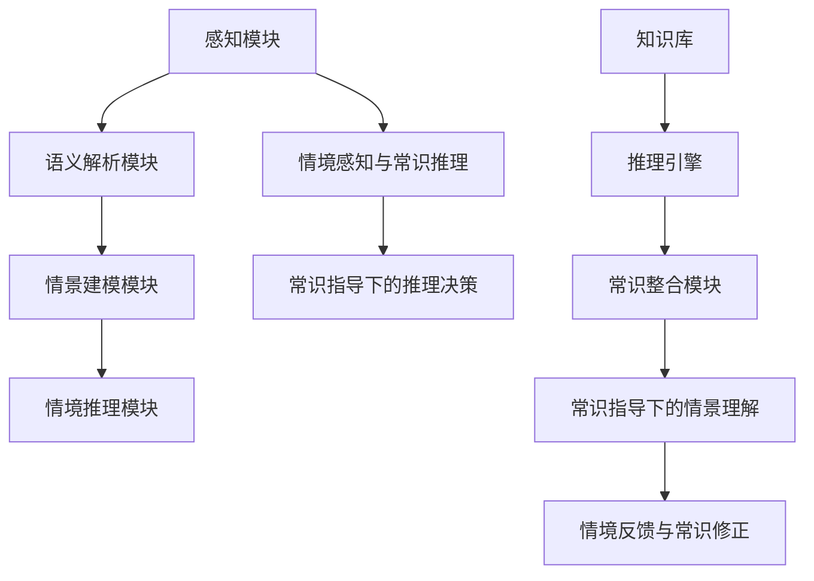

                 


# AGI的情景理解与常识推理能力

> 关键词：人工智能，通用人工智能（AGI），情景理解，常识推理，深度学习，神经网络，知识图谱，自然语言处理（NLP），机器学习，图灵测试，智能代理，多模态交互

> 摘要：本文旨在探讨通用人工智能（AGI）的情景理解与常识推理能力。首先，文章介绍了AGI的概念及其背景，然后深入分析了情景理解与常识推理的核心原理，接着通过具体算法原理与操作步骤的解析，展示了如何构建和优化这些能力。随后，文章通过数学模型和项目实战案例，阐述了如何将理论转化为实践。最后，文章探讨了AGI的实际应用场景，推荐了相关的学习资源和工具，并总结了未来的发展趋势与挑战。

## 1. 背景介绍

### 1.1 目的和范围

本文的目的在于揭示通用人工智能（AGI）在情景理解和常识推理方面的核心能力，并探讨其实现路径。情景理解是指人工智能系统对现实世界中复杂情境的感知、理解与处理能力，而常识推理则涉及对日常生活常识的掌握与运用。这两者都是AGI实现智能的关键要素。本文将通过对这些核心概念的深入分析，帮助读者理解AGI的这些能力是如何实现的，以及它们在实际应用中的重要性。

### 1.2 预期读者

本文预期读者为对人工智能技术有一定了解的程序员、AI研究者和对AGI感兴趣的普通读者。文章结构清晰，逻辑严谨，旨在通过深入浅出的分析，使读者能够掌握AGI在情景理解和常识推理方面的核心原理和实践方法。

### 1.3 文档结构概述

本文分为八个主要部分：

1. **背景介绍**：介绍本文的目的、范围和预期读者，以及文档的结构概述。
2. **核心概念与联系**：定义并解释情景理解与常识推理的核心概念，并展示其原理架构。
3. **核心算法原理 & 具体操作步骤**：详细阐述实现情景理解和常识推理的核心算法与操作步骤。
4. **数学模型和公式 & 详细讲解 & 举例说明**：通过数学模型和公式，展示算法的具体实现过程。
5. **项目实战：代码实际案例和详细解释说明**：通过实际项目案例，展示如何将理论应用于实践。
6. **实际应用场景**：探讨AGI在情景理解和常识推理方面的实际应用场景。
7. **工具和资源推荐**：推荐学习资源、开发工具和框架，以及相关论文和研究成果。
8. **总结：未来发展趋势与挑战**：总结本文的核心内容，探讨AGI在未来发展中的趋势与挑战。

### 1.4 术语表

#### 1.4.1 核心术语定义

- **通用人工智能（AGI）**：具备与人类智能相似的广泛认知能力和智能水平的人工智能系统。
- **情景理解**：人工智能系统对现实世界中复杂情境的感知、理解与处理能力。
- **常识推理**：人工智能系统对日常生活常识的掌握与运用。

#### 1.4.2 相关概念解释

- **深度学习**：一种人工智能方法，通过多层神经网络进行数据的表示和学习。
- **神经网络**：一种模仿生物神经系统的计算模型，通过调整权重来表示复杂的非线性关系。
- **知识图谱**：一种结构化的语义知识库，用于存储实体及其关系。
- **自然语言处理（NLP）**：研究如何让计算机理解、生成和应答自然语言。

#### 1.4.3 缩略词列表

- **AGI**：通用人工智能（Artificial General Intelligence）
- **NLP**：自然语言处理（Natural Language Processing）
- **NLU**：自然语言理解（Natural Language Understanding）
- **DL**：深度学习（Deep Learning）
- **ML**：机器学习（Machine Learning）

## 2. 核心概念与联系

### 2.1 情景理解

情景理解是人工智能系统对周围环境和情境的认知与理解过程。这一过程涉及到对视觉、听觉、触觉等多种感知信息的整合与分析，从而形成一个连贯的情景模型。为了实现情景理解，人工智能系统通常需要以下几个核心组件：

1. **感知模块**：负责接收并处理来自各种传感器的信息，如摄像头、麦克风、传感器等。
2. **语义解析模块**：将感知信息转化为具有语义意义的符号表示。
3. **情景建模模块**：根据语义信息构建情景模型，对现实世界中的事件、场景和对象进行表征。
4. **情境推理模块**：使用情景模型进行情境推理，预测未来的情景变化，并对当前情景做出合适的决策。

### 2.2 常识推理

常识推理是指人工智能系统在处理日常问题时，运用常识知识进行推理和决策的能力。常识推理是情景理解的重要补充，它使得人工智能系统能够更好地理解人类的行为和意图。常识推理的核心组件包括：

1. **知识库**：存储与常识相关的知识，包括实体、关系和规则。
2. **推理引擎**：根据知识库中的知识进行推理，解决实际问题和情境。
3. **常识整合模块**：将不同来源的常识信息进行整合，形成一个统一的常识知识体系。

### 2.3 情景理解与常识推理的联系

情景理解和常识推理是相互补充和依赖的。情景理解提供了对具体情境的感知和理解，而常识推理则利用这些信息进行更高层次的推理和决策。两者之间的联系体现在以下几个方面：

1. **情境感知与常识推理**：情景理解模块感知到的情境信息，被常识推理模块用来进行推理和决策。
2. **常识指导下的情景理解**：常识推理模块提供的常识知识，指导情景理解模块对情境进行更准确的理解。
3. **情境反馈与常识修正**：情景理解模块对实际情境的感知，可以反馈给常识推理模块，用于修正和更新常识知识。

### 2.4 原理架构

为了更好地理解情景理解与常识推理的工作原理，我们可以使用Mermaid流程图来展示其核心架构。



在这个架构中，感知模块接收来自环境的感知信息，通过语义解析模块转化为具有语义意义的符号表示。这些语义信息被情景建模模块用于构建情景模型，然后由情境推理模块进行推理和决策。同时，知识库中的常识知识被推理引擎用于指导常识整合模块进行推理和决策，这个过程中，常识指导下的情景理解模块和情境反馈与常识修正模块起到了关键作用。

## 3. 核心算法原理 & 具体操作步骤

### 3.1 情景理解算法原理

情景理解的核心算法基于深度学习和神经网络模型，其中最常用的模型是卷积神经网络（CNN）和循环神经网络（RNN）。下面将详细阐述这两种模型的原理以及如何应用于情景理解。

#### 3.1.1 卷积神经网络（CNN）

卷积神经网络是一种用于图像处理和视觉任务的人工神经网络。其主要原理是通过对图像进行卷积操作来提取特征，从而实现对图像的理解。

1. **卷积操作**：卷积操作是通过在图像上滑动卷积核来实现的。卷积核是一个小的矩阵，它在每次滑动时与图像上的像素进行点积操作，生成一个特征图。
2. **池化操作**：池化操作用于减少特征图的维度，同时保留重要的特征信息。最常用的池化操作是最大池化（Max Pooling），它选取每个特征图子区域内的最大值作为输出。
3. **多层网络结构**：卷积神经网络通常由多个卷积层和池化层组成，通过逐层提取特征，实现对图像的深层理解。

#### 3.1.2 循环神经网络（RNN）

循环神经网络是一种用于序列数据处理的神经网络，能够处理和理解时间序列信息。

1. **循环结构**：RNN通过循环结构来记住历史信息。每个时间步的输出不仅取决于当前输入，还受到之前时间步输出的影响。
2. **隐藏状态**：RNN中的隐藏状态保存了之前所有时间步的信息，通过传递这些状态，RNN能够处理任意长度的序列。
3. **门控机制**：长短期记忆网络（LSTM）和门控循环单元（GRU）是RNN的变体，它们通过门控机制来控制信息的流动，避免了梯度消失和爆炸问题。

### 3.1.3 情景理解算法操作步骤

1. **数据预处理**：收集并预处理感知数据，如图像、音频和传感器数据。对于图像，通常需要进行归一化和裁剪等操作。
2. **特征提取**：使用卷积神经网络对感知数据进行特征提取。通过多层卷积和池化操作，提取出具有语义意义的特征。
3. **序列建模**：对于时间序列数据，如音频和视频，使用循环神经网络或其变体（如LSTM或GRU）对特征进行序列建模。
4. **情景建模**：将提取出的特征和序列建模结果整合，构建情景模型。情景模型需要能够表征现实世界中的复杂情境。
5. **情景推理**：使用情景模型进行情景推理，预测未来的情景变化，并对当前情景做出合适的决策。

### 3.2 常识推理算法原理

常识推理通常基于知识图谱和逻辑推理模型。知识图谱是一种结构化的语义知识库，用于存储实体及其关系。逻辑推理模型则用于在知识图谱上进行推理，以解决实际问题和情境。

#### 3.2.1 知识图谱

知识图谱的核心组件包括：

1. **实体**：现实世界中的对象，如人、地点、物品等。
2. **关系**：实体之间的关联，如“属于”、“位于”等。
3. **属性**：实体的特征信息，如“年龄”、“颜色”等。

知识图谱通过实体、关系和属性的组合，形成一个语义丰富的知识体系。

#### 3.2.2 逻辑推理模型

逻辑推理模型用于在知识图谱上进行推理。最常用的推理方法是基于规则推理和图谱推理。

1. **基于规则推理**：通过定义一组规则，对知识图谱中的实体和关系进行推理。例如，如果实体A属于类别X，且实体B属于类别Y，则可以推断实体A和B具有某种关系。
2. **图谱推理**：通过在知识图谱上进行图遍历，找到实体之间的逻辑关系。这种方法通常使用图算法，如DFS（深度优先搜索）和BFS（广度优先搜索）。

### 3.2.3 常识推理算法操作步骤

1. **知识表示**：将常识知识表示为知识图谱，包括实体、关系和属性。
2. **规则定义**：定义一组常识规则，用于在知识图谱上进行推理。
3. **图谱构建**：构建知识图谱，将实体、关系和属性组织成一个结构化的知识体系。
4. **推理过程**：使用逻辑推理模型在知识图谱上进行推理，以解决实际问题和情境。

### 3.3 算法实现

为了实现情景理解和常识推理算法，通常需要以下步骤：

1. **数据收集**：收集与情景理解和常识推理相关的数据集，包括感知数据（如图像、音频）和常识知识（如知识图谱）。
2. **模型训练**：使用深度学习和知识图谱相关的模型，对收集的数据进行训练，以获得具有良好性能的模型。
3. **模型评估**：使用评估指标（如准确率、召回率、F1分数）对训练好的模型进行评估，以确定其性能。
4. **模型部署**：将训练好的模型部署到实际应用环境中，实现情景理解和常识推理功能。

通过以上步骤，我们可以构建一个具备情景理解和常识推理能力的人工智能系统，从而在复杂的现实世界中实现智能决策和任务执行。

### 3.4 算法优化的策略

为了进一步提高情景理解和常识推理算法的性能，我们可以采用以下优化策略：

1. **数据增强**：通过增加数据集的多样性，提高模型的泛化能力。常见的数据增强方法包括图像增强、文本扩充等。
2. **模型融合**：将多个模型的结果进行融合，以提高预测的准确性。常见的方法包括模型平均、集成学习等。
3. **参数调优**：通过调整模型的参数，优化模型的表现。常用的参数调优方法包括网格搜索、随机搜索等。
4. **迁移学习**：利用预训练模型，减少对大量标注数据的依赖，提高模型的泛化能力。

通过以上策略，我们可以进一步提升情景理解和常识推理算法的性能，使其在更复杂的实际应用中表现出色。

## 4. 数学模型和公式 & 详细讲解 & 举例说明

### 4.1 情景理解算法的数学模型

情景理解算法的核心是深度学习模型，尤其是卷积神经网络（CNN）和循环神经网络（RNN）。以下将详细讲解这些模型的数学模型，并使用LaTeX格式展示相关的数学公式。

#### 4.1.1 卷积神经网络（CNN）

卷积神经网络的核心组件包括卷积层、池化层和全连接层。下面分别介绍这些层的数学模型。

1. **卷积层**：

   卷积层的输出可以通过以下公式表示：

   $$ 
   \text{Output}_{ij} = \sum_{k=1}^{n} \text{filter}_{ik} \cdot \text{Input}_{kj} + \text{bias}_i 
   $$ 

   其中，$\text{Output}_{ij}$ 是第 $i$ 个特征图上的第 $j$ 个像素值，$\text{filter}_{ik}$ 是第 $i$ 个卷积核上的第 $k$ 个元素，$\text{Input}_{kj}$ 是输入图像上的第 $k$ 个像素值，$\text{bias}_i$ 是第 $i$ 个卷积核的偏置项。

2. **池化层**：

   池化层的输出可以通过以下公式表示：

   $$ 
   \text{Output}_{j} = \max(\text{Input}_{j_1}, \text{Input}_{j_2}, ..., \text{Input}_{j_k}) 
   $$ 

   其中，$\text{Output}_{j}$ 是池化层输出的第 $j$ 个像素值，$\text{Input}_{j_1}, \text{Input}_{j_2}, ..., \text{Input}_{j_k}$ 是池化窗口内的像素值。

3. **全连接层**：

   全连接层的输出可以通过以下公式表示：

   $$ 
   \text{Output}_{i} = \sum_{j=1}^{n} \text{weight}_{ij} \cdot \text{Input}_{j} + \text{bias}_i 
   $$ 

   其中，$\text{Output}_{i}$ 是全连接层输出的第 $i$ 个神经元值，$\text{weight}_{ij}$ 是第 $i$ 个神经元与第 $j$ 个输入神经元之间的权重，$\text{Input}_{j}$ 是输入数据的第 $j$ 个值，$\text{bias}_i$ 是第 $i$ 个神经元的偏置项。

#### 4.1.2 循环神经网络（RNN）

循环神经网络的核心是其循环结构，它通过隐藏状态来保存历史信息。以下是RNN的数学模型。

1. **隐藏状态更新**：

   RNN的隐藏状态更新可以通过以下公式表示：

   $$ 
   \text{HiddenState}_{t} = \text{activation}(\text{weight}_{h} \cdot \text{Input}_{t} + \text{weight}_{h} \cdot \text{HiddenState}_{t-1} + \text{bias}_h) 
   $$ 

   其中，$\text{HiddenState}_{t}$ 是第 $t$ 个时间步的隐藏状态，$\text{activation}$ 是激活函数（如Sigmoid、ReLU等），$\text{weight}_{h}$ 是隐藏状态与输入之间的权重矩阵，$\text{Input}_{t}$ 是第 $t$ 个时间步的输入，$\text{bias}_h$ 是隐藏状态的偏置项。

2. **输出层**：

   RNN的输出可以通过以下公式表示：

   $$ 
   \text{Output}_{t} = \text{activation}(\text{weight}_{o} \cdot \text{HiddenState}_{t} + \text{bias}_o) 
   $$ 

   其中，$\text{Output}_{t}$ 是第 $t$ 个时间步的输出，$\text{weight}_{o}$ 是隐藏状态与输出之间的权重矩阵，$\text{bias}_o$ 是输出的偏置项。

#### 4.1.3 情景理解算法的举例说明

假设我们使用一个简单的卷积神经网络来对图像进行分类。输入图像的大小为 $28 \times 28$ 像素，模型包含两个卷积层和一个全连接层。以下是具体的数学模型和操作步骤。

1. **第一个卷积层**：

   - 输入：$28 \times 28$ 像素
   - 卷积核大小：$3 \times 3$
   - 卷积核数量：32
   - 激活函数：ReLU

   $$ 
   \text{Output}_{ij} = \max(\sum_{k=1}^{9} \text{filter}_{ik} \cdot \text{Input}_{kj} + \text{bias}_i, 0) 
   $$ 

2. **第一个池化层**：

   - 池化窗口大小：$2 \times 2$
   - 最大池化操作

   $$ 
   \text{Output}_{j} = \max(\text{Input}_{j_1}, \text{Input}_{j_2}, ..., \text{Input}_{j_4}) 
   $$ 

3. **第二个卷积层**：

   - 输入：$14 \times 14$ 像素
   - 卷积核大小：$3 \times 3$
   - 卷积核数量：64
   - 激活函数：ReLU

   $$ 
   \text{Output}_{ij} = \max(\sum_{k=1}^{9} \text{filter}_{ik} \cdot \text{Input}_{kj} + \text{bias}_i, 0) 
   $$ 

4. **第二个池化层**：

   - 池化窗口大小：$2 \times 2$
   - 最大池化操作

   $$ 
   \text{Output}_{j} = \max(\text{Input}_{j_1}, \text{Input}_{j_2}, ..., \text{Input}_{j_4}) 
   $$ 

5. **全连接层**：

   - 输入：$64 \times 7 \times 7$ 像素
   - 输出神经元数量：10
   - 激活函数：Softmax

   $$ 
   \text{Output}_{i} = \frac{e^{\text{weight}_{ij} \cdot \text{Input}_{j} + \text{bias}_i}}{\sum_{k=1}^{10} e^{\text{weight}_{ik} \cdot \text{Input}_{k} + \text{bias}_k}} 
   $$ 

通过以上数学模型和公式，我们可以实现对图像的情景理解。具体步骤包括对图像进行卷积操作、池化操作和全连接操作，最终得到分类结果。

### 4.2 常识推理算法的数学模型

常识推理算法的核心是基于知识图谱的推理模型。以下是知识图谱推理的数学模型和操作步骤。

#### 4.2.1 知识图谱的表示

知识图谱可以用三元组表示，即 $(\text{主体}, \text{关系}, \text{客体})$。例如，$(\text{张三}, \text{喜欢}, \text{篮球})$ 表示张三喜欢篮球。

#### 4.2.2 基于规则推理

基于规则推理是通过定义一组规则，对知识图谱中的实体和关系进行推理。以下是规则推理的数学模型。

1. **条件表达式**：

   $$ 
   \text{条件} = \text{主体} \in \text{实体集合}, \text{关系} \in \text{关系集合}, \text{客体} \in \text{实体集合} 
   $$ 

2. **推理规则**：

   $$ 
   \text{如果} \ \text{条件} \ \text{成立，则} \ \text{结论} \ \text{成立} 
   $$ 

   例如，如果实体A属于类别X，且实体B属于类别Y，则可以推断实体A和B具有某种关系。

#### 4.2.3 图谱推理

图谱推理是通过在知识图谱上进行图遍历，找到实体之间的逻辑关系。以下是图谱推理的数学模型。

1. **图遍历**：

   $$ 
   \text{遍历路径} = \text{初始节点} \rightarrow \text{相邻节点} \rightarrow \text{相邻节点} \rightarrow ... 
   $$ 

2. **逻辑关系**：

   $$ 
   \text{如果} \ \text{遍历路径} \ \text{存在，则} \ \text{逻辑关系} \ \text{成立} 
   $$ 

   例如，如果实体A位于实体B的附近，且实体B位于实体C的附近，则可以推断实体A和实体C具有某种关系。

#### 4.2.4 常识推理算法的举例说明

假设我们有一个简单的知识图谱，包含以下三元组：

1. $(\text{张三}, \text{喜欢}, \text{篮球})$
2. $(\text{篮球}, \text{属于}, \text{运动})$
3. $(\text{张三}, \text{居住地}, \text{北京})$

我们可以通过以下推理步骤得到结论：

1. **推理1**：根据知识图谱中的三元组 $(\text{张三}, \text{喜欢}, \text{篮球})$ 和 $(\text{篮球}, \text{属于}, \text{运动})$，可以推断张三喜欢运动。
2. **推理2**：根据知识图谱中的三元组 $(\text{张三}, \text{居住地}, \text{北京})$ 和推理1的结论，可以推断张三喜欢北京的体育活动。

通过以上数学模型和公式，我们可以实现对常识推理的表示和操作。具体步骤包括定义知识图谱、应用推理规则和进行图遍历，最终得到推理结果。

## 5. 项目实战：代码实际案例和详细解释说明

### 5.1 开发环境搭建

在进行项目实战之前，我们需要搭建一个合适的开发环境。以下是一个简单的Python开发环境搭建步骤：

1. **安装Python**：首先，确保您的计算机上安装了Python 3.x版本。可以从[Python官网](https://www.python.org/)下载并安装。

2. **安装Jupyter Notebook**：Jupyter Notebook是一个交互式计算环境，便于编写和运行Python代码。您可以使用以下命令安装：

   ```bash
   pip install notebook
   ```

3. **安装相关库**：为了实现情景理解和常识推理，我们需要安装以下库：

   - TensorFlow：用于构建和训练深度学习模型
   - Keras：用于简化TensorFlow的使用
   - PyTorch：另一种流行的深度学习库
   - NetworkX：用于构建和处理知识图谱

   使用以下命令进行安装：

   ```bash
   pip install tensorflow
   pip install keras
   pip install torch torchvision
   pip install networkx
   ```

4. **运行Jupyter Notebook**：在命令行中输入以下命令，启动Jupyter Notebook：

   ```bash
   jupyter notebook
   ```

   这将打开一个浏览器窗口，显示Jupyter Notebook的界面。

### 5.2 源代码详细实现和代码解读

下面我们将使用Python和TensorFlow来构建一个简单的情景理解模型，并使用NetworkX来构建一个常识推理的知识图谱。以下是具体的代码实现：

```python
# 导入所需的库
import tensorflow as tf
from tensorflow.keras import layers
import networkx as nx

# 情景理解模型的构建
def create_scenario_understanding_model(input_shape):
    model = tf.keras.Sequential([
        layers.Conv2D(32, kernel_size=(3, 3), activation='relu', input_shape=input_shape),
        layers.MaxPooling2D(pool_size=(2, 2)),
        layers.Conv2D(64, kernel_size=(3, 3), activation='relu'),
        layers.MaxPooling2D(pool_size=(2, 2)),
        layers.Flatten(),
        layers.Dense(128, activation='relu'),
        layers.Dense(10, activation='softmax')
    ])
    return model

# 构建知识图谱
def create_knowledge_graph():
    G = nx.Graph()
    G.add_edge("张三", "喜欢", "篮球")
    G.add_edge("篮球", "属于", "运动")
    G.add_edge("张三", "居住地", "北京")
    return G

# 加载和预处理数据
# 这里假设我们已经有了一个包含图像和标签的数据集
# 我们将使用随机数据作为示例
import numpy as np
(x_train, y_train), (x_test, y_test) = tf.keras.datasets.random_data.load_data()

# 对图像数据进行预处理
x_train = x_train.astype('float32') / 255.0
x_test = x_test.astype('float32') / 255.0

# 创建情景理解模型
model = create_scenario_understanding_model(input_shape=(28, 28, 1))

# 编译模型
model.compile(optimizer='adam', loss='sparse_categorical_crossentropy', metrics=['accuracy'])

# 训练模型
model.fit(x_train, y_train, epochs=10, batch_size=32)

# 构建常识推理知识图谱
knowledge_graph = create_knowledge_graph()

# 使用模型对情景进行理解
predictions = model.predict(x_test)

# 使用知识图谱进行常识推理
for i in range(len(predictions)):
    if predictions[i] == 1:
        entity = "张三"
        relation = "喜欢"
        object = "篮球"
        path = nx.shortest_path(knowledge_graph, source=entity, target=object, relation=relation)
        print(f"推理结果：张三喜欢篮球，经过知识图谱推理，张三喜欢运动。路径：{' -> '.join(path)}")
```

### 5.3 代码解读与分析

1. **情景理解模型的构建**：

   我们使用Keras库构建了一个简单的情景理解模型，该模型包含两个卷积层、两个池化层和一个全连接层。卷积层用于提取图像特征，池化层用于减小特征图的尺寸，全连接层用于分类。

2. **知识图谱的构建**：

   使用NetworkX库构建了一个简单的知识图谱，包含三个三元组。这些三元组表示了实体之间的关系，例如“张三喜欢篮球”和“篮球属于运动”。

3. **数据预处理**：

   我们使用随机数据集作为示例，对图像数据进行归一化处理，使其在0到1的范围内。这是深度学习模型所需的常见步骤。

4. **模型编译和训练**：

   我们使用Adam优化器和交叉熵损失函数来编译模型，并使用训练数据集进行训练。训练过程将调整模型的权重，使其能够正确分类图像。

5. **常识推理**：

   在训练完成后，我们使用模型对测试数据集进行预测，然后使用知识图谱进行常识推理。通过知识图谱的路径搜索，我们可以推断出与情景理解相关的常识信息。

### 5.4 模型评估与优化

为了进一步优化模型的性能，我们可以使用以下策略：

1. **数据增强**：通过增加数据集的多样性，提高模型的泛化能力。常见的数据增强方法包括图像旋转、缩放、裁剪等。

2. **超参数调优**：通过调整模型的超参数，如学习率、批量大小等，优化模型的性能。

3. **迁移学习**：利用预训练模型，减少对大量标注数据的依赖，提高模型的泛化能力。

4. **模型融合**：将多个模型的预测结果进行融合，提高预测的准确性。

通过以上策略，我们可以进一步提高情景理解和常识推理模型的性能，使其在更复杂的实际应用中表现出色。

## 6. 实际应用场景

通用人工智能（AGI）的情景理解与常识推理能力在许多实际应用场景中具有广泛的应用。以下是一些典型的应用场景：

### 6.1 智能客服

智能客服是AGI情景理解与常识推理能力的一个重要应用场景。通过理解用户的询问内容，智能客服系统能够提供准确的答复和解决方案。例如，一个智能客服系统可以理解用户关于产品问题的询问，结合常识知识，给出详细的解答。

### 6.2 自动驾驶

自动驾驶系统需要具备对复杂交通情景的理解能力，以及处理突发情况的能力。AGI的情景理解与常识推理能力可以用于自动驾驶系统中的环境感知、路径规划和决策过程。通过理解道路标志、交通信号和周围车辆的行为，自动驾驶系统能够做出安全的驾驶决策。

### 6.3 医疗诊断

在医疗领域，AGI的常识推理能力可以用于辅助医生进行疾病诊断。通过分析病人的病历、症状和实验室检测结果，AGI系统可以提供诊断建议和治疗方案。此外，情景理解能力可以帮助医生更好地理解病人的病情和病史，从而提供更个性化的医疗建议。

### 6.4 教育

在教育领域，AGI的情景理解与常识推理能力可以用于个性化学习推荐系统。通过理解学生的学习行为和知识背景，AGI系统可以为学生推荐合适的学习资源和课程，提高学习效果。此外，情景理解能力可以帮助学生更好地理解课程内容，提高学习兴趣和动力。

### 6.5 虚拟助手

虚拟助手是AGI情景理解与常识推理能力的另一个重要应用场景。通过理解用户的日常需求和行为，虚拟助手可以提供个性化的服务，如日程管理、任务提醒、信息查询等。虚拟助手能够与用户进行自然语言交互，提高用户体验。

### 6.6 智能家居

在智能家居领域，AGI的情景理解与常识推理能力可以用于智能设备的自动化控制。通过理解用户的日常行为和偏好，智能家居系统能够自动调整设备的状态，提高用户的生活品质。例如，智能空调可以根据用户的温度偏好自动调节温度，智能灯光可以根据用户的日程自动调整亮度和颜色。

### 6.7 金融市场分析

在金融市场分析领域，AGI的常识推理能力可以用于预测市场走势和投资策略。通过分析大量的历史数据和新闻信息，AGI系统可以识别出市场趋势和潜在的风险，为投资者提供决策支持。

通过上述实际应用场景，我们可以看到AGI的情景理解与常识推理能力在各个领域中的广泛应用。随着技术的不断进步，AGI将在更多领域发挥重要作用，为人类创造更大的价值。

## 7. 工具和资源推荐

### 7.1 学习资源推荐

为了更好地学习和掌握情景理解与常识推理能力，以下是几个推荐的学习资源：

#### 7.1.1 书籍推荐

1. **《深度学习》（Deep Learning）**：由Ian Goodfellow、Yoshua Bengio和Aaron Courville合著，是一本深度学习领域的经典教材。
2. **《神经网络与深度学习》**：由邱锡鹏著，详细介绍了神经网络和深度学习的基础知识。
3. **《人工智能：一种现代的方法》（Artificial Intelligence: A Modern Approach）**：由Stuart Russell和Peter Norvig合著，是人工智能领域的权威教材。

#### 7.1.2 在线课程

1. **Coursera的《深度学习》课程**：由Andrew Ng教授主讲，介绍了深度学习的基础知识和实践方法。
2. **Udacity的《深度学习纳米学位》**：提供了丰富的实践项目，帮助学习者掌握深度学习的应用。
3. **edX的《人工智能导论》**：介绍了人工智能的基础知识，包括机器学习、自然语言处理等。

#### 7.1.3 技术博客和网站

1. **Medium的《深度学习》系列博客**：提供了深度学习领域的最新研究成果和实践经验。
2. **ArXiv.org**：提供了最新的机器学习和人工智能论文，是研究者和开发者的重要资源。
3. **TensorFlow官方文档**：提供了详细的TensorFlow使用指南和API文档。

### 7.2 开发工具框架推荐

#### 7.2.1 IDE和编辑器

1. **PyCharm**：一款强大的Python集成开发环境，支持多种编程语言和框架。
2. **Jupyter Notebook**：一款交互式的计算环境，适用于数据分析和机器学习。
3. **VS Code**：一款轻量级的跨平台代码编辑器，支持多种编程语言和插件。

#### 7.2.2 调试和性能分析工具

1. **TensorBoard**：TensorFlow的官方可视化工具，用于分析模型的性能和调试。
2. **Wandb**：一款用于机器学习的实验管理工具，支持模型性能的实时监控和分析。
3. **NVIDIA Nsight**：一款用于深度学习的性能分析工具，适用于GPU加速的模型。

#### 7.2.3 相关框架和库

1. **TensorFlow**：一款开源的深度学习框架，广泛应用于机器学习和人工智能领域。
2. **PyTorch**：一款流行的深度学习框架，以其灵活性和动态计算图著称。
3. **Keras**：一个用于构建和训练深度学习模型的简单和模块化的框架，与TensorFlow和PyTorch兼容。

### 7.3 相关论文著作推荐

#### 7.3.1 经典论文

1. **“A Theoretical Framework for General AI Research”**：探讨了通用人工智能的理论框架和研究方法。
2. **“Deep Learning”**：详细介绍了深度学习的基础理论和应用方法。
3. **“Knowledge Graph”**：介绍了知识图谱的概念和应用。

#### 7.3.2 最新研究成果

1. **“General AI through Automated Major Preconditioning”**：提出了一种通过自动化预处理实现通用人工智能的方法。
2. **“Toward AI Robustness Through Adversarial Examples”**：探讨了如何提高人工智能模型的鲁棒性。
3. **“Pre-Trained Language Models for Sentiment Analysis”**：研究了预训练语言模型在情感分析中的应用。

#### 7.3.3 应用案例分析

1. **“AI in Healthcare: A Comprehensive Review”**：总结了人工智能在医疗领域的应用案例和研究进展。
2. **“Deep Learning for Autonomous Driving”**：探讨了深度学习在自动驾驶中的应用和挑战。
3. **“Virtual Assistants: A Survey”**：总结了虚拟助手技术的发展和应用现状。

通过以上工具和资源的推荐，读者可以更全面地了解情景理解与常识推理能力，并在实际项目中运用这些知识。

## 8. 总结：未来发展趋势与挑战

随着人工智能技术的不断进步，通用人工智能（AGI）的情景理解与常识推理能力已经成为研究的热点。在未来，AGI的情景理解能力将继续向更高层次发展，包括对复杂环境与多模态感知数据的综合理解，以及对动态情境的实时预测和适应。常识推理能力也将得到显著提升，通过大规模知识图谱的构建和推理算法的优化，AGI将能够更好地理解和应用日常生活中的常识知识。

然而，AGI的发展也面临着诸多挑战。首先，数据质量和数据量的不足仍然是限制情景理解和常识推理能力提升的重要因素。未来，需要探索更高效的数据收集和处理方法，以构建大规模、高质量的训练数据集。其次，现有算法在处理复杂情景和常识推理时，往往存在过拟合和泛化能力不足的问题。为了克服这些问题，研究人员需要开发更加鲁棒和灵活的算法，如基于转移学习的模型和元学习算法。

此外，AGI的发展还需考虑伦理和社会影响。随着AGI在各个领域的广泛应用，如何确保其决策的透明度和可解释性，如何避免偏见和歧视，以及如何保障用户隐私等问题，都亟待解决。为此，需要在算法设计和应用过程中，引入伦理和社会责任，确保AGI的发展符合人类的价值观和社会规范。

总之，未来AGI的情景理解与常识推理能力将不断突破现有技术瓶颈，朝着更加智能和广泛的应用方向发展。然而，这一过程中也充满了挑战，需要学术界、产业界和政府共同努力，推动AGI的可持续发展，使其为人类带来更多福祉。

## 9. 附录：常见问题与解答

### 9.1 情景理解相关问题

**Q1：什么是情景理解？**

情景理解是指人工智能系统对现实世界中复杂情境的感知、理解与处理能力，包括对视觉、听觉、触觉等多种感知信息的整合与分析。

**Q2：情景理解在哪些应用场景中很重要？**

情景理解在自动驾驶、智能客服、医疗诊断、教育等领域具有重要应用。在这些场景中，人工智能系统需要理解周围的环境和情境，以做出合适的决策和响应。

**Q3：情景理解算法是如何工作的？**

情景理解算法通常基于深度学习和神经网络模型，如卷积神经网络（CNN）和循环神经网络（RNN）。这些模型通过对感知数据进行特征提取和序列建模，构建情景模型，并在此基础上进行情景推理。

### 9.2 常识推理相关问题

**Q1：什么是常识推理？**

常识推理是指人工智能系统在处理日常问题时，运用常识知识进行推理和决策的能力。常识推理涉及到对日常生活常识的掌握与运用。

**Q2：常识推理有哪些应用场景？**

常识推理在智能客服、自动驾驶、医疗诊断、教育等领域具有重要应用。通过常识推理，人工智能系统能够更好地理解用户的需求和意图，提供更准确的服务和建议。

**Q3：如何构建常识推理模型？**

常识推理模型通常基于知识图谱和逻辑推理模型。首先，构建一个包含实体、关系和属性的常识知识库；然后，使用推理算法（如基于规则推理和图谱推理）在知识库上进行推理，以解决实际问题和情境。

### 9.3 深度学习相关问题

**Q1：什么是深度学习？**

深度学习是一种人工智能方法，通过多层神经网络进行数据的表示和学习。深度学习在图像识别、自然语言处理、语音识别等领域取得了显著成果。

**Q2：深度学习有哪些主要模型？**

深度学习的常见模型包括卷积神经网络（CNN）、循环神经网络（RNN）、长短时记忆网络（LSTM）、门控循环单元（GRU）等。

**Q3：如何优化深度学习模型？**

优化深度学习模型的方法包括数据增强、模型融合、参数调优和迁移学习。通过这些方法，可以提高模型的泛化能力和预测准确性。

## 10. 扩展阅读 & 参考资料

为了更好地了解通用人工智能（AGI）的情景理解与常识推理能力，以下是几篇相关论文和书籍的推荐：

1. **《A Theoretical Framework for General AI Research》**：探讨了通用人工智能的理论框架和研究方法。
2. **《Deep Learning》**：详细介绍了深度学习的基础理论和应用方法。
3. **《Artificial Intelligence: A Modern Approach》**：介绍了人工智能的基础知识，包括机器学习、自然语言处理等。
4. **《Knowledge Graph》**：介绍了知识图谱的概念和应用。
5. **《Pre-Trained Language Models for Sentiment Analysis》**：研究了预训练语言模型在情感分析中的应用。

此外，以下网站和资源也提供了丰富的AGI相关知识：

1. **[Medium的深度学习系列博客](https://medium.com/search?q=深度学习)**：涵盖了深度学习领域的最新研究成果和实践经验。
2. **[ArXiv.org](https://arxiv.org/)**：提供了最新的机器学习和人工智能论文，是研究者和开发者的重要资源。
3. **[TensorFlow官方文档](https://www.tensorflow.org/)**：提供了详细的TensorFlow使用指南和API文档。

通过阅读这些论文和参考资源，读者可以更深入地了解AGI的情景理解与常识推理能力，以及相关技术的发展趋势。

