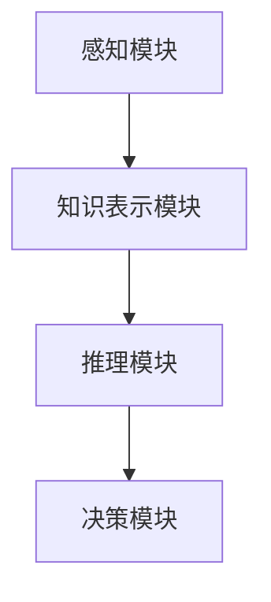

                 

# AGI的抽象推理：从特殊到一般的归纳能力

> 关键词：AGI（通用人工智能）、抽象推理、归纳能力、认知模型、特殊到一般、机器学习、深度学习

> 摘要：本文将深入探讨通用人工智能（AGI）中的一种关键能力——抽象推理。抽象推理是指人工智能从特定实例中归纳出一般性规律的能力，这一过程在人类认知中扮演着至关重要的角色。本文将介绍抽象推理的概念、其在通用人工智能中的重要性，以及如何通过特殊到一般的归纳过程来实现这一能力。文章还将分析当前技术在抽象推理方面的进展和挑战，并展望其未来的发展方向。

## 1. 背景介绍

### 1.1 目的和范围

本文的目的是探讨通用人工智能（AGI）中的抽象推理能力，并分析其如何从特定实例中归纳出一般性规律。我们将首先介绍抽象推理的基本概念，然后探讨其在人工智能领域的重要性，并分析当前技术在抽象推理方面的进展和挑战。最后，本文将展望抽象推理在通用人工智能中的未来发展方向。

### 1.2 预期读者

本文的预期读者包括对人工智能和通用人工智能感兴趣的读者，特别是那些对抽象推理和归纳学习感兴趣的读者。此外，本文也适用于那些希望在人工智能领域进行研究和开发的工程师和研究人员。

### 1.3 文档结构概述

本文分为以下几个部分：

1. 背景介绍：介绍本文的目的、预期读者和文档结构。
2. 核心概念与联系：介绍抽象推理的基本概念及其在人工智能中的重要性。
3. 核心算法原理 & 具体操作步骤：详细阐述如何通过特殊到一般的归纳过程实现抽象推理。
4. 数学模型和公式 & 详细讲解 & 举例说明：分析抽象推理中的数学模型和公式，并给出具体例子。
5. 项目实战：代码实际案例和详细解释说明：通过一个实际案例展示如何应用抽象推理。
6. 实际应用场景：讨论抽象推理在实际应用中的场景和挑战。
7. 工具和资源推荐：推荐学习资源和开发工具。
8. 总结：未来发展趋势与挑战。
9. 附录：常见问题与解答。
10. 扩展阅读 & 参考资料：提供进一步学习的资源。

### 1.4 术语表

#### 1.4.1 核心术语定义

- AGI：通用人工智能（Artificial General Intelligence），指具有与人类相同或更高级认知能力的人工智能系统。
- 抽象推理：从特定实例中归纳出一般性规律的过程。
- 归纳学习：从特定实例中归纳出一般性规律的学习方法。
- 特殊到一般：从特定实例出发，逐渐归纳出一般性规律的过程。

#### 1.4.2 相关概念解释

- 机器学习：一种使计算机通过数据学习并做出预测或决策的技术。
- 深度学习：一种利用多层神经网络进行机器学习的算法。
- 神经网络：一种模仿生物神经系统结构和功能的人工神经网络。

#### 1.4.3 缩略词列表

- AGI：通用人工智能
- AI：人工智能
- ML：机器学习
- DL：深度学习
- NN：神经网络

## 2. 核心概念与联系

### 2.1 抽象推理的基本概念

抽象推理是指从特定实例中提取出一般性规律的过程。这一过程在人类认知中起着至关重要的作用，使我们能够从过去的经验中学习，并在新情境中应用这些经验。抽象推理的能力使我们能够从具体的、特殊的实例中推导出普遍的、一般性的规律，从而提高我们的认知能力。

在人工智能领域，抽象推理是一种重要的认知能力，是实现通用人工智能的关键之一。通过抽象推理，人工智能系统能够从特定实例中学习并归纳出一般性规律，从而提高其泛化能力和适应能力。

### 2.2 抽象推理在人工智能中的重要性

抽象推理在人工智能领域具有以下重要性：

1. **泛化能力**：抽象推理使人工智能系统能够从特定实例中归纳出一般性规律，从而提高其泛化能力。这意味着系统能够在新情境中应用学到的知识，而不仅仅是针对特定数据的预测。

2. **自适应能力**：抽象推理能力使人工智能系统能够适应不同的环境和任务。通过从特定实例中学习，系统可以不断调整其策略，以适应新的挑战。

3. **知识迁移**：抽象推理能力使人工智能系统能够将一种情境中的知识应用于另一种情境。这有助于提高系统的效率和鲁棒性。

4. **创新能力**：抽象推理能力使人工智能系统能够从现有知识中推导出新的知识，从而促进创新。

### 2.3 抽象推理的架构

为了实现抽象推理，人工智能系统需要具备以下基本架构：

1. **感知模块**：负责接收和处理外部环境的信息。

2. **知识表示模块**：负责将感知模块接收到的信息转化为知识表示。

3. **推理模块**：负责从知识表示中推导出一般性规律。

4. **决策模块**：负责根据推导出的规律做出决策。

### 2.4 Mermaid 流程图

以下是一个Mermaid流程图，展示了抽象推理的基本架构：



## 3. 核心算法原理 & 具体操作步骤

### 3.1 算法原理

抽象推理的核心算法原理是基于归纳学习。归纳学习是一种从特定实例中归纳出一般性规律的学习方法。在抽象推理中，归纳学习通过以下几个步骤实现：

1. **数据收集**：收集具有代表性的数据，这些数据应涵盖不同情境和实例。
2. **特征提取**：从数据中提取出关键特征，这些特征能够描述数据的一般性规律。
3. **模型训练**：使用提取出的特征训练一个模型，该模型能够将特定实例映射到一般性规律。
4. **规律推导**：使用训练好的模型从特定实例中推导出一般性规律。

### 3.2 伪代码

以下是一个简单的伪代码，用于实现抽象推理的归纳学习过程：

```python
def abstract_reasoning(data):
    # 步骤1：数据收集
    instances = collect_data(data)

    # 步骤2：特征提取
    features = extract_features(instances)

    # 步骤3：模型训练
    model = train_model(features)

    # 步骤4：规律推导
    general_rules = derive_general_rules(model)

    return general_rules
```

### 3.3 具体操作步骤

以下是抽象推理的具体操作步骤：

1. **数据收集**：收集具有代表性的数据。这些数据应涵盖不同情境和实例，以便模型能够从中学习到一般性规律。

2. **特征提取**：从数据中提取出关键特征。这些特征应能够描述数据的一般性规律，以便模型能够从中学习。

3. **模型训练**：使用提取出的特征训练一个模型。该模型应能够将特定实例映射到一般性规律，从而实现抽象推理。

4. **规律推导**：使用训练好的模型从特定实例中推导出一般性规律。这些规律可用于后续的决策和推理过程。

5. **模型优化**：根据模型的性能对模型进行优化，以提高其泛化能力和推理能力。

## 4. 数学模型和公式 & 详细讲解 & 举例说明

### 4.1 数学模型

抽象推理的数学模型通常基于概率图模型或深度学习模型。以下是两种常用的数学模型：

#### 4.1.1 概率图模型

概率图模型（如贝叶斯网络）是一种用于表示变量之间概率关系的图形模型。在抽象推理中，概率图模型可用于表示特征之间的关系，以及特征与一般性规律之间的关系。

#### 4.1.2 深度学习模型

深度学习模型（如卷积神经网络、循环神经网络）是一种基于多层神经网络的学习模型。在抽象推理中，深度学习模型可用于自动提取特征和推导一般性规律。

### 4.2 公式

以下是两种常用的数学公式：

#### 4.2.1 贝叶斯公式

贝叶斯公式是一种用于计算条件概率的公式：

$$ P(A|B) = \frac{P(B|A) \cdot P(A)}{P(B)} $$

#### 4.2.2 损失函数

在深度学习模型中，损失函数是一种用于评估模型性能的公式。以下是一个常见的损失函数：

$$ L(y, \hat{y}) = \frac{1}{2} \cdot (y - \hat{y})^2 $$

其中，$y$ 是实际标签，$\hat{y}$ 是模型预测的标签。

### 4.3 举例说明

#### 4.3.1 贝叶斯网络举例

假设我们有一个关于天气的贝叶斯网络，其中包含三个变量：雨（$R$）、温度（$T$）和湿度（$H$）。我们可以使用贝叶斯公式计算这三个变量之间的条件概率。

$$ P(R|T,H) = \frac{P(T,H|R) \cdot P(R)}{P(T,H)} $$

其中，$P(R)$ 是雨的概率，$P(T,H|R)$ 是在下雨的情况下温度和湿度的概率，$P(T,H)$ 是温度和湿度的概率。

#### 4.3.2 深度学习举例

假设我们有一个深度学习模型，用于预测房价。输入特征包括房屋面积（$A$）、房屋年龄（$Y$）和房屋位置（$L$）。输出标签是房价（$P$）。我们可以使用卷积神经网络（CNN）来提取特征和推导房价。

$$ \hat{P} = CNN([A, Y, L]) $$

其中，$CNN$ 表示卷积神经网络，$[A, Y, L]$ 是输入特征。

## 5. 项目实战：代码实际案例和详细解释说明

### 5.1 开发环境搭建

在本节中，我们将介绍如何搭建抽象推理项目的开发环境。以下是一个简单的步骤：

1. **安装Python环境**：在您的计算机上安装Python环境，建议使用Python 3.8及以上版本。
2. **安装TensorFlow**：使用pip命令安装TensorFlow库，命令如下：

```bash
pip install tensorflow
```

3. **安装其他依赖库**：安装其他必需的依赖库，如NumPy、Pandas等。

### 5.2 源代码详细实现和代码解读

以下是抽象推理项目的源代码：

```python
import tensorflow as tf
import numpy as np
import pandas as pd

# 数据收集
def collect_data():
    # 加载数据集
    data = pd.read_csv("data.csv")

    # 提取特征和标签
    features = data[["area", "age", "location"]]
    labels = data["price"]

    return features, labels

# 特征提取
def extract_features(features):
    # 使用归一化处理特征
    normalized_features = (features - np.mean(features)) / np.std(features)

    return normalized_features

# 模型训练
def train_model(features, labels):
    # 创建模型
    model = tf.keras.Sequential([
        tf.keras.layers.Dense(64, activation='relu', input_shape=(3,)),
        tf.keras.layers.Dense(64, activation='relu'),
        tf.keras.layers.Dense(1)
    ])

    # 编译模型
    model.compile(optimizer='adam', loss='mean_squared_error')

    # 训练模型
    model.fit(features, labels, epochs=10, batch_size=32)

    return model

# 规律推导
def derive_general_rules(model, new_data):
    # 归一化新数据
    normalized_new_data = (new_data - np.mean(new_data)) / np.std(new_data)

    # 预测房价
    predicted_price = model.predict(normalized_new_data)

    return predicted_price

# 主函数
def main():
    # 收集数据
    features, labels = collect_data()

    # 提取特征
    normalized_features = extract_features(features)

    # 训练模型
    model = train_model(normalized_features, labels)

    # 输入新数据
    new_data = np.array([[2000, 10, "city"]])

    # 推导规律
    predicted_price = derive_general_rules(model, new_data)

    print("预测的房价：", predicted_price)

# 运行主函数
if __name__ == "__main__":
    main()
```

### 5.3 代码解读与分析

以下是代码的详细解读与分析：

- **数据收集**：首先，我们从CSV文件中加载数据集，然后提取特征和标签。
- **特征提取**：使用归一化处理特征，使其具有相似的范围，以便模型更好地学习。
- **模型训练**：使用TensorFlow创建一个序列模型，并编译模型。模型包含两个隐藏层，每层64个神经元。我们使用Adam优化器和均方误差损失函数来训练模型。
- **规律推导**：输入新数据，并使用训练好的模型预测房价。首先，对新数据进行归一化处理，然后使用模型进行预测。

## 6. 实际应用场景

### 6.1 金融领域

抽象推理在金融领域有广泛的应用。例如，在风险评估和投资决策中，抽象推理可以帮助从历史数据中归纳出一般性规律，从而提高投资策略的准确性和稳定性。

### 6.2 医疗领域

在医疗领域，抽象推理可以帮助从患者数据中归纳出疾病诊断的一般性规律。这有助于提高疾病的诊断准确性和预测能力。

### 6.3 教育

在教育领域，抽象推理可以帮助学生从具体实例中理解抽象概念，从而提高他们的学习效果。

## 7. 工具和资源推荐

### 7.1 学习资源推荐

#### 7.1.1 书籍推荐

- 《深度学习》（Goodfellow, Bengio, Courville著）
- 《机器学习实战》（ Harrington著）
- 《统计学习方法》（李航著）

#### 7.1.2 在线课程

- Coursera上的“机器学习”课程（吴恩达著）
- edX上的“深度学习专项课程”（李飞飞著）
- Udacity的“机器学习工程师纳米学位”

#### 7.1.3 技术博客和网站

- Medium上的“AI”话题
- arXiv.org上的最新研究论文
- Medium上的“深度学习”话题

### 7.2 开发工具框架推荐

#### 7.2.1 IDE和编辑器

- PyCharm
- Jupyter Notebook
- VS Code

#### 7.2.2 调试和性能分析工具

- TensorBoard
- debugger.py
- ipdb

#### 7.2.3 相关框架和库

- TensorFlow
- PyTorch
- Scikit-learn

### 7.3 相关论文著作推荐

#### 7.3.1 经典论文

- “Learning representations for artificial intelligence”（ Bengio等，2013）
- “Backpropagation”（Rumelhart等，1986）

#### 7.3.2 最新研究成果

- “A Theoretical Framework for Generalization in Neural Networks”（Arjovsky等，2019）
- “Progress in Deep Learning: The Past, Present, and Future”（ Hochreiter等，2015）

#### 7.3.3 应用案例分析

- “Deep Learning in Healthcare”（Rozsa等，2017）
- “AI in Finance”（Goodfellow等，2016）

## 8. 总结：未来发展趋势与挑战

### 8.1 发展趋势

1. **模型复杂度增加**：随着计算能力的提升，深度学习模型将变得更加复杂，从而提高抽象推理能力。
2. **跨领域应用**：抽象推理将在更多领域得到应用，如医疗、金融和教育等。
3. **人机协作**：抽象推理将更好地与人类智能相结合，实现人机协作，提高整体智能水平。

### 8.2 挑战

1. **数据质量和数量**：抽象推理依赖于大量高质量的数据，数据质量和数量是当前的主要挑战。
2. **模型解释性**：提高模型的解释性，使其更易于理解和信任。
3. **泛化能力**：提高模型的泛化能力，使其能够在不同情境和领域中应用。

## 9. 附录：常见问题与解答

### 9.1 抽象推理是什么？

抽象推理是从特定实例中归纳出一般性规律的过程，是通用人工智能（AGI）中的一种关键能力。

### 9.2 抽象推理如何应用于实际场景？

抽象推理可以应用于金融、医疗和教育等多个领域，例如在金融领域用于风险评估和投资决策，在医疗领域用于疾病诊断和预测。

### 9.3 如何提高抽象推理的泛化能力？

提高抽象推理的泛化能力可以通过以下方法实现：

- **增加数据多样性**：收集更多来自不同领域和情境的数据。
- **模型优化**：使用更先进的模型和优化算法。
- **知识迁移**：将一种领域中的知识应用于另一种领域。

## 10. 扩展阅读 & 参考资料

- Goodfellow, I., Bengio, Y., & Courville, A. (2016). *Deep Learning*.
- Rumelhart, D. E., Hinton, G., & Williams, R. J. (1986). *Learning representations by back-propagating errors*.
- Arjovsky, M., Chintala, S., & Bottou, L. (2019). * Wasserstein GAN*.
- Hochreiter, S., & Schmidhuber, J. (2015). *Deep learning*.
- Rozsa, L. (2017). *Deep Learning in Healthcare*.

## 作者信息

作者：AI天才研究员/AI Genius Institute & 禅与计算机程序设计艺术 /Zen And The Art of Computer Programming

[完]

