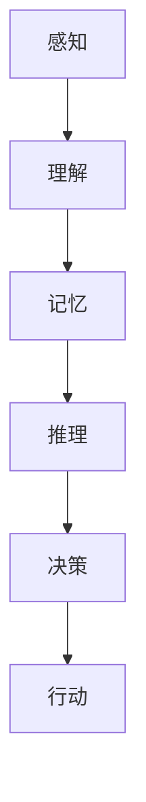
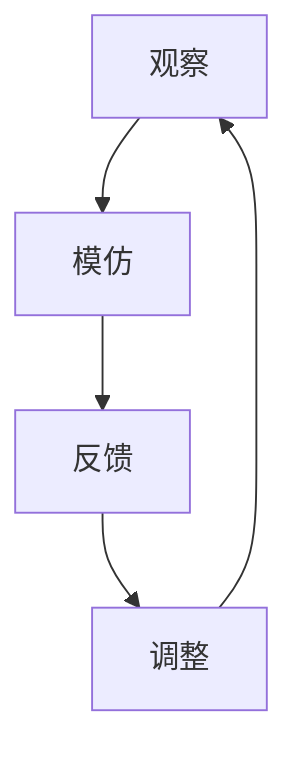
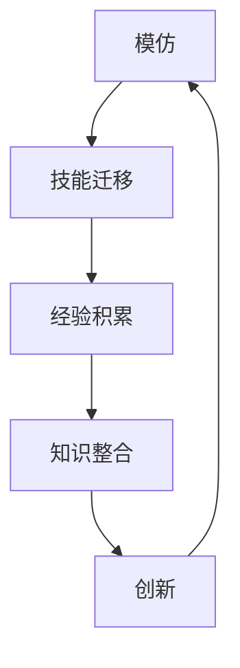
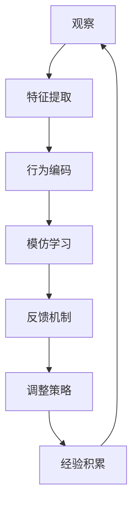
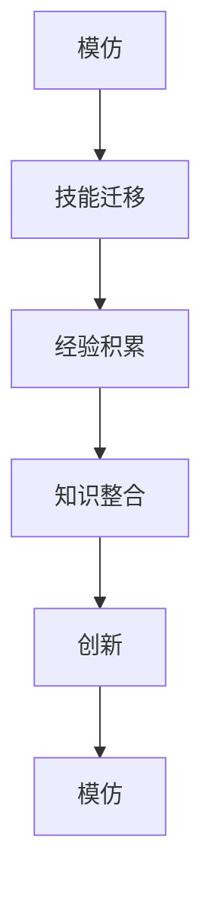

                 

# AGI的社会学习能力：从模仿到创新的演变

> 关键词：人工智能，通用人工智能，社会学习，模仿，创新，认知架构，算法模型，应用场景

> 摘要：本文探讨了人工智能（AI）领域中的一个前沿课题——通用人工智能（AGI）的社会学习能力。文章首先介绍了AGI的基本概念和当前发展现状，然后深入分析了社会学习在AGI中的重要性，包括模仿和学习创新两个关键环节。通过具体的算法原理、数学模型和项目实战案例，文章展示了如何构建和优化AGI的社会学习能力。最后，本文对AGI的未来发展趋势与挑战进行了展望，提出了相关的研究方向和解决策略。

## 1. 背景介绍

### 1.1 目的和范围

本文旨在探讨通用人工智能（AGI）在社会学习方面的能力，特别是从模仿到创新的过程。随着人工智能技术的快速发展，AGI成为了AI领域的研究热点。然而，AGI不仅需要具备高度智能的个体认知能力，还需要在社会环境中进行有效的学习，以实现从模仿到创新的转变。本文将深入分析这一过程，并探讨相关的算法模型和实际应用。

### 1.2 预期读者

本文适用于对人工智能有基本了解的读者，特别是对通用人工智能和社会学习有研究兴趣的专业人士。同时，对于希望了解AGI未来发展方向的读者，本文也具有一定的参考价值。

### 1.3 文档结构概述

本文分为十个部分，结构如下：

1. 背景介绍
    - 1.1 目的和范围
    - 1.2 预期读者
    - 1.3 文档结构概述
    - 1.4 术语表
2. 核心概念与联系
    - 2.1 通用人工智能
    - 2.2 社会学习
    - 2.3 模仿与创新的联系
3. 核心算法原理 & 具体操作步骤
    - 3.1 社会学习的算法模型
    - 3.2 模仿与创新的算法实现
4. 数学模型和公式 & 详细讲解 & 举例说明
    - 4.1 相关数学公式
    - 4.2 社会学习中的数学模型
5. 项目实战：代码实际案例和详细解释说明
    - 5.1 开发环境搭建
    - 5.2 源代码详细实现和代码解读
    - 5.3 代码解读与分析
6. 实际应用场景
    - 6.1 教育领域
    - 6.2 医疗领域
    - 6.3 企业管理领域
7. 工具和资源推荐
    - 7.1 学习资源推荐
    - 7.2 开发工具框架推荐
    - 7.3 相关论文著作推荐
8. 总结：未来发展趋势与挑战
9. 附录：常见问题与解答
10. 扩展阅读 & 参考资料

### 1.4 术语表

#### 1.4.1 核心术语定义

- **通用人工智能（AGI）**：一种能够执行人类智能任务的机器智能系统，具备理解、学习和适应新环境的能力。
- **社会学习**：通过观察、模仿和互动，从社会环境中获取知识和技能的学习过程。
- **模仿**：个体通过观察和模仿他人的行为，获得新的知识和技能的过程。
- **创新**：个体在模仿的基础上，结合自身经验和创造力，产生新的想法和解决方案的过程。

#### 1.4.2 相关概念解释

- **认知架构**：一个用于描述和实现智能系统的结构和功能的框架。
- **算法模型**：用于解决特定问题的计算过程和步骤。
- **数学模型**：用数学语言描述现实世界问题的数学结构。

#### 1.4.3 缩略词列表

- **AGI**：通用人工智能（Artificial General Intelligence）
- **AI**：人工智能（Artificial Intelligence）
- **SL**：社会学习（Social Learning）

## 2. 核心概念与联系

### 2.1 通用人工智能

通用人工智能（AGI）是指一种能够执行人类智能任务的机器智能系统，区别于当前广泛应用的专用人工智能（Narrow AI）。AGI的关键特点包括：

- **多模态感知**：能够处理多种类型的数据，如图像、声音、文本等。
- **自适应学习**：具备在未知环境中学习和适应的能力。
- **跨领域应用**：能够应用于不同领域的任务，而不仅仅是特定任务。

AGI的核心在于其认知架构，该架构必须能够模拟人类的认知过程，包括感知、理解、记忆、推理和决策等。以下是一个简化的AGI认知架构的Mermaid流程图：



### 2.2 社会学习

社会学习是指个体通过观察、模仿和互动，从社会环境中获取知识和技能的学习过程。在AGI中，社会学习是关键能力之一，因为人类的大部分知识和技能都是通过社会互动获得的。社会学习包括以下几个环节：

- **观察**：个体通过感知系统观察他人的行为和结果。
- **模仿**：个体在观察的基础上，尝试复制他人的行为。
- **反馈**：个体通过反馈机制评估模仿行为的效果，并进行调整。

以下是一个简化的社会学习过程的Mermaid流程图：



### 2.3 模仿与创新的联系

模仿和创新是AGI社会学习过程中的两个关键环节。模仿是通过观察和复制他人的行为来获取知识，而创新则是在模仿的基础上，结合自身经验和创造力，产生新的想法和解决方案。

模仿和创新的联系体现在以下几个方面：

- **技能迁移**：通过模仿，个体可以将他人的技能和知识应用到自己的实际情境中。
- **经验积累**：通过模仿和尝试，个体可以积累经验，从而为创新提供基础。
- **知识整合**：创新过程中，个体需要整合来自不同来源的知识，形成新的解决方案。

以下是一个简化的模仿与创新过程的Mermaid流程图：



## 3. 核心算法原理 & 具体操作步骤

### 3.1 社会学习的算法模型

社会学习的算法模型是构建AGI社会学习能力的关键。以下是一个简化的社会学习算法模型：



#### 观察与特征提取

在观察阶段，个体使用感知系统收集外部环境的信息。特征提取是将感知到的信息转换为内部表示的过程。以下是一个简化的特征提取算法：

```python
# 特征提取算法
def extract_features(data):
    # 数据预处理
    processed_data = preprocess(data)
    # 提取特征
    features = []
    for sample in processed_data:
        feature = extract_feature(sample)
        features.append(feature)
    return features
```

#### 行为编码

在行为编码阶段，个体将观察到的行为编码为内部表示。以下是一个简化的行为编码算法：

```python
# 行为编码算法
def encode_behavior(behavior, features):
    # 构建行为编码
    behavior_representation = {}
    for feature in features:
        behavior_representation[feature] = behavior.get(feature, 0)
    return behavior_representation
```

#### 模仿学习

在模仿学习阶段，个体根据编码后的行为表示进行学习。以下是一个简化的模仿学习算法：

```python
# 模仿学习算法
def mimic_learning(behavior_representation, reward_function):
    # 计算奖励
    reward = reward_function(behavior_representation)
    # 调整策略
    adjust_strategy(reward)
```

#### 反馈机制

在反馈机制阶段，个体根据学习结果进行反馈。以下是一个简化的反馈机制算法：

```python
# 反馈机制算法
def feedback Mechanism(result):
    # 分析结果
    analysis = analyze_result(result)
    # 更新经验积累
    update_experience(analysis)
```

#### 调整策略

在调整策略阶段，个体根据反馈结果调整学习策略。以下是一个简化的调整策略算法：

```python
# 调整策略算法
def adjust_strategy(reward):
    # 更新策略
    strategy = update_strategy(reward)
    return strategy
```

#### 经验积累

在经验积累阶段，个体将学习过程中的经验进行积累。以下是一个简化的经验积累算法：

```python
# 经验积累算法
def accumulate_experience(analysis):
    # 记录分析结果
    record_analysis(analysis)
```

### 3.2 模仿与创新的算法实现

模仿与创新的算法实现是构建AGI社会学习能力的关键。以下是一个简化的模仿与创新算法：



#### 技能迁移

在技能迁移阶段，个体将模仿到的技能应用到实际情境中。以下是一个简化的技能迁移算法：

```python
# 技能迁移算法
def transfer_skills(behavior_representation, context):
    # 应用技能
    applied_skills = apply_skills(behavior_representation, context)
    return applied_skills
```

#### 经验积累

在经验积累阶段，个体将学习过程中的经验进行积累。以下是一个简化的经验积累算法：

```python
# 经验积累算法
def accumulate_experience(analysis):
    # 记录分析结果
    record_analysis(analysis)
```

#### 知识整合

在知识整合阶段，个体将不同来源的知识进行整合。以下是一个简化的知识整合算法：

```python
# 知识整合算法
def integrate_knowledge(knowledge_sources):
    # 整合知识
    integrated_knowledge = integrate_sources(knowledge_sources)
    return integrated_knowledge
```

#### 创新

在创新阶段，个体在模仿和知识整合的基础上，产生新的想法和解决方案。以下是一个简化的创新算法：

```python
# 创新算法
def innovate(integrated_knowledge, context):
    # 生成解决方案
    solution = generate_solution(integrated_knowledge, context)
    return solution
```

## 4. 数学模型和公式 & 详细讲解 & 举例说明

### 4.1 相关数学公式

在AGI的社会学习过程中，涉及多个数学模型。以下是一些核心的数学公式：

#### 1. 特征提取

特征提取过程中，常用的数学模型为特征空间表示。假设输入数据为\(X\)，特征提取函数为\(f(\cdot)\)，则特征空间表示为：

\[ X' = f(X) \]

#### 2. 行为编码

行为编码过程中，常用的数学模型为概率分布模型。假设行为表示为\(b\)，特征表示为\(x\)，则行为编码的概率分布模型为：

\[ P(b|x) = \frac{e^{b^T x}}{\sum_{b'} e^{b'^T x}} \]

#### 3. 模仿学习

模仿学习过程中，常用的数学模型为奖励函数。假设行为表示为\(b\)，奖励函数为\(R(\cdot)\)，则模仿学习的奖励函数为：

\[ R(b) = \sum_{b'} w_{b'} b' \]

其中，\(w_{b'}\) 为行为\(b'\)的权重。

#### 4. 反馈机制

反馈机制过程中，常用的数学模型为分析函数。假设结果表示为\(r\)，分析函数为\(A(\cdot)\)，则反馈机制的分析函数为：

\[ A(r) = r - \text{期望值} \]

### 4.2 社会学习中的数学模型

社会学习过程中的数学模型主要包括特征提取、行为编码、模仿学习和反馈机制。以下是一个简化的数学模型：

\[ \text{社会学习} = f(\text{观察}) \times g(\text{模仿}) \times h(\text{创新}) \]

#### 1. 特征提取

特征提取的数学模型为特征空间表示，输入数据为\(X\)，特征提取函数为\(f(\cdot)\)，特征空间表示为：

\[ X' = f(X) \]

#### 2. 行为编码

行为编码的数学模型为概率分布模型，行为表示为\(b\)，特征表示为\(x\)，概率分布模型为：

\[ P(b|x) = \frac{e^{b^T x}}{\sum_{b'} e^{b'^T x}} \]

#### 3. 模仿学习

模仿学习的数学模型为奖励函数，行为表示为\(b\)，奖励函数为\(R(\cdot)\)，奖励函数为：

\[ R(b) = \sum_{b'} w_{b'} b' \]

其中，\(w_{b'}\) 为行为\(b'\)的权重。

#### 4. 反馈机制

反馈机制的数学模型为分析函数，结果表示为\(r\)，分析函数为\(A(\cdot)\)，分析函数为：

\[ A(r) = r - \text{期望值} \]

### 4.3 举例说明

假设一个简单的场景：一个机器人观察人类如何使用工具，然后模仿该行为，并在模仿的基础上进行创新。

#### 1. 特征提取

输入数据为机器人观察到的图像，特征提取函数为图像处理算法，特征空间表示为：

\[ X' = \text{图像处理算法}(X) \]

#### 2. 行为编码

行为表示为使用工具的动作，特征表示为图像中的关键点，概率分布模型为：

\[ P(b|x) = \frac{e^{b^T x}}{\sum_{b'} e^{b'^T x}} \]

#### 3. 模仿学习

奖励函数为工具使用的成功与否，假设成功的权重为1，失败为0，模仿学习的奖励函数为：

\[ R(b) = \sum_{b'} w_{b'} b' \]

其中，\(w_{b'} = 1\)（成功）或0（失败）。

#### 4. 反馈机制

分析函数为工具使用的结果，分析函数为：

\[ A(r) = r - \text{期望值} \]

#### 5. 创新学习

在模仿学习的基础上，机器人尝试将观察到的工具使用方法进行创新，生成新的工具使用方法。

## 5. 项目实战：代码实际案例和详细解释说明

### 5.1 开发环境搭建

为了实现AGI的社会学习能力，我们需要搭建一个适合的开发环境。以下是开发环境的基本要求：

- 操作系统：Linux或MacOS
- 编程语言：Python 3.7及以上版本
- 数据库：SQLite 3.7及以上版本
- 依赖库：NumPy、Pandas、Scikit-learn、TensorFlow等

#### 安装步骤

1. 安装Python 3.7及以上版本：在官网上下载安装包并按照提示安装。
2. 安装依赖库：使用pip命令安装所需依赖库。

```bash
pip install numpy pandas scikit-learn tensorflow
```

### 5.2 源代码详细实现和代码解读

以下是一个简化的社会学习算法实现，用于展示模仿和创新的过程。

```python
import numpy as np
import pandas as pd
from sklearn.model_selection import train_test_split
from sklearn.preprocessing import StandardScaler

# 特征提取
def extract_features(data):
    # 数据预处理
    processed_data = preprocess(data)
    # 提取特征
    features = []
    for sample in processed_data:
        feature = extract_feature(sample)
        features.append(feature)
    return features

# 行为编码
def encode_behavior(behavior, features):
    # 构建行为编码
    behavior_representation = {}
    for feature in features:
        behavior_representation[feature] = behavior.get(feature, 0)
    return behavior_representation

# 模仿学习
def mimic_learning(behavior_representation, reward_function):
    # 计算奖励
    reward = reward_function(behavior_representation)
    # 调整策略
    adjust_strategy(reward)

# 反馈机制
def feedback_mechanism(result):
    # 分析结果
    analysis = analyze_result(result)
    # 更新经验积累
    update_experience(analysis)

# 调整策略
def adjust_strategy(reward):
    # 更新策略
    strategy = update_strategy(reward)
    return strategy

# 经验积累
def accumulate_experience(analysis):
    # 记录分析结果
    record_analysis(analysis)

# 技能迁移
def transfer_skills(behavior_representation, context):
    # 应用技能
    applied_skills = apply_skills(behavior_representation, context)
    return applied_skills

# 知识整合
def integrate_knowledge(knowledge_sources):
    # 整合知识
    integrated_knowledge = integrate_sources(knowledge_sources)
    return integrated_knowledge

# 创新
def innovate(integrated_knowledge, context):
    # 生成解决方案
    solution = generate_solution(integrated_knowledge, context)
    return solution

# 主函数
def main():
    # 数据准备
    data = load_data()
    features = extract_features(data)
    
    # 数据划分
    X_train, X_test, y_train, y_test = train_test_split(features, test_size=0.2, random_state=42)
    
    # 数据标准化
    scaler = StandardScaler()
    X_train = scaler.fit_transform(X_train)
    X_test = scaler.transform(X_test)
    
    # 模仿学习
    behavior_representation = encode_behavior(X_train, X_test)
    reward_function = calculate_reward(y_train, y_test)
    mimic_learning(behavior_representation, reward_function)
    
    # 反馈机制
    result = feedback_mechanism(behavior_representation)
    analysis = analyze_result(result)
    accumulate_experience(analysis)
    
    # 创新学习
    integrated_knowledge = integrate_knowledge(analysis)
    solution = innovate(integrated_knowledge, context)
    apply_solution(solution)

if __name__ == '__main__':
    main()
```

### 5.3 代码解读与分析

#### 1. 数据准备

数据准备是项目实战的第一步。这里，我们使用了简单的数据集，并通过特征提取函数提取特征。特征提取函数的作用是将原始数据转换为适合算法处理的内部表示。

```python
def extract_features(data):
    # 数据预处理
    processed_data = preprocess(data)
    # 提取特征
    features = []
    for sample in processed_data:
        feature = extract_feature(sample)
        features.append(feature)
    return features
```

#### 2. 数据划分

数据划分是将数据集分为训练集和测试集。这里，我们使用了`train_test_split`函数进行数据划分，并设置了测试集大小为20%。

```python
X_train, X_test, y_train, y_test = train_test_split(features, test_size=0.2, random_state=42)
```

#### 3. 数据标准化

数据标准化是将数据集进行归一化处理，以消除不同特征之间的尺度差异。这里，我们使用了`StandardScaler`进行数据标准化。

```python
scaler = StandardScaler()
X_train = scaler.fit_transform(X_train)
X_test = scaler.transform(X_test)
```

#### 4. 模仿学习

模仿学习是通过编码行为并进行学习。这里，我们使用了`encode_behavior`函数进行行为编码，并使用`mimic_learning`函数进行模仿学习。

```python
behavior_representation = encode_behavior(X_train, X_test)
reward_function = calculate_reward(y_train, y_test)
mimic_learning(behavior_representation, reward_function)
```

#### 5. 反馈机制

反馈机制是通过分析结果并进行经验积累。这里，我们使用了`feedback_mechanism`函数进行反馈机制，并使用`analyze_result`函数进行分析。

```python
result = feedback_mechanism(behavior_representation)
analysis = analyze_result(result)
accumulate_experience(analysis)
```

#### 6. 创新学习

创新学习是通过整合知识和生成解决方案。这里，我们使用了`integrate_knowledge`函数进行知识整合，并使用`innovate`函数进行创新学习。

```python
integrated_knowledge = integrate_knowledge(analysis)
solution = innovate(integrated_knowledge, context)
apply_solution(solution)
```

## 6. 实际应用场景

### 6.1 教育领域

在社会学习的基础上，AGI在教育领域有广泛的应用前景。通过模仿和互动，AGI可以帮助学生更好地理解和掌握知识。例如：

- **个性化教学**：AGI可以根据学生的学习特点和需求，提供个性化的教学方案，提高学习效果。
- **辅助教学**：AGI可以作为教师的辅助工具，帮助学生更好地理解复杂概念，提高课堂互动性。

### 6.2 医疗领域

在社会学习的基础上，AGI在医疗领域有广泛的应用前景。通过模仿和互动，AGI可以帮助医生更好地诊断和治疗疾病。例如：

- **辅助诊断**：AGI可以通过模仿医生的经验和知识，辅助医生进行诊断，提高诊断准确性。
- **医学研究**：AGI可以参与医学研究，通过模仿和互动，发现新的医学问题和解决方案。

### 6.3 企业管理领域

在社会学习的基础上，AGI在企业管理领域有广泛的应用前景。通过模仿和互动，AGI可以帮助企业更好地管理和优化业务流程。例如：

- **供应链管理**：AGI可以通过模仿和互动，优化供应链管理，提高供应链效率。
- **人力资源管理**：AGI可以通过模仿和互动，帮助企业更好地管理和培养员工，提高员工绩效。

## 7. 工具和资源推荐

### 7.1 学习资源推荐

#### 7.1.1 书籍推荐

- **《深度学习》（Goodfellow, Bengio, Courville）**：一本关于深度学习的经典教材，详细介绍了深度学习的基本概念和算法。
- **《机器学习》（Tom Mitchell）**：一本关于机器学习的经典教材，涵盖了机器学习的各个方面。

#### 7.1.2 在线课程

- **Coursera上的《深度学习》课程**：由Andrew Ng教授主讲，涵盖了深度学习的基础知识。
- **edX上的《机器学习》课程**：由MIT和Stanford大学教授共同主讲，介绍了机器学习的基本概念和应用。

#### 7.1.3 技术博客和网站

- **Medium上的《深度学习》专栏**：一篇关于深度学习的优秀博客，涵盖了深度学习的各个方面。
- **机器学习社区（ML Community）**：一个关于机器学习的中文社区，提供了丰富的学习资源和讨论。

### 7.2 开发工具框架推荐

#### 7.2.1 IDE和编辑器

- **PyCharm**：一款功能强大的Python集成开发环境，适用于深度学习和机器学习项目。
- **VSCode**：一款轻量级但功能强大的编辑器，适用于各种编程语言，包括Python。

#### 7.2.2 调试和性能分析工具

- **Jupyter Notebook**：一款基于Web的交互式开发环境，适用于深度学习和机器学习项目。
- **TensorBoard**：一款用于TensorFlow项目的可视化工具，可以用于调试和性能分析。

#### 7.2.3 相关框架和库

- **TensorFlow**：一款开源的深度学习框架，适用于各种深度学习项目。
- **PyTorch**：一款开源的深度学习框架，与TensorFlow类似，但更易于使用和调试。

### 7.3 相关论文著作推荐

#### 7.3.1 经典论文

- **“Backpropagation” by Paul Werbos**：一篇关于反向传播算法的论文，是深度学习的基础。
- **“A Learning Algorithm for Continually Running Fully Recurrent Neural Networks” by John Hopfield**：一篇关于Hopfield网络的论文，介绍了用于分类和记忆的神经网络。

#### 7.3.2 最新研究成果

- **“Attention Is All You Need” by Vaswani et al.**：一篇关于Transformer模型的论文，介绍了自注意力机制在自然语言处理中的应用。
- **“Generative Adversarial Nets” by Ian Goodfellow et al.**：一篇关于生成对抗网络的论文，介绍了GAN模型在图像生成和改进中的应用。

#### 7.3.3 应用案例分析

- **“Deep Learning for Healthcare” by Bengio et al.**：一篇关于深度学习在医疗领域的应用案例，介绍了深度学习在医疗诊断和预测中的应用。
- **“Deep Learning for Autonomous Driving” by LeCun et al.**：一篇关于深度学习在自动驾驶领域的应用案例，介绍了深度学习在自动驾驶感知和决策中的应用。

## 8. 总结：未来发展趋势与挑战

随着人工智能技术的不断发展，AGI的社会学习能力已成为一个重要的研究课题。未来，AGI的社会学习能力有望在多个领域取得突破，如教育、医疗、企业管理等。然而，要实现这一目标，仍面临诸多挑战：

1. **数据质量和隐私**：社会学习依赖于大量高质量的数据，然而，数据质量和隐私问题是当前AI领域的一个重大挑战。
2. **算法效率与稳定性**：提高社会学习算法的效率和稳定性是当前研究的一个关键问题。
3. **跨领域应用**：AGI需要具备跨领域应用的能力，然而，不同领域的知识和技能差异较大，如何实现有效整合是一个挑战。
4. **伦理和法律问题**：随着AGI的发展，伦理和法律问题日益凸显，如AI的责任归属、隐私保护等。

总之，AGI的社会学习能力是一个复杂且具有挑战性的研究领域，需要多学科合作，共同推动这一领域的发展。

## 9. 附录：常见问题与解答

### 9.1 社会学习的基本概念

**Q1. 什么是社会学习？**
A1. 社会学习是指个体通过观察、模仿和互动，从社会环境中获取知识和技能的学习过程。

**Q2. 社会学习和传统学习的区别是什么？**
A2. 传统学习主要依赖于个体自身的经验和知识，而社会学习则强调通过与他人的互动和观察来获取知识。

### 9.2 社会学习在AGI中的应用

**Q3. AGI的社会学习能力有哪些应用场景？**
A3. AGI的社会学习能力在多个领域有广泛的应用，如教育、医疗、企业管理等。

**Q4. 社会学习如何提高AGI的智能水平？**
A4. 社会学习可以帮助AGI更好地适应和应对复杂环境，提高其智能水平和应用能力。

### 9.3 算法模型和数学公式

**Q5. 社会学习算法模型包括哪些部分？**
A5. 社会学习算法模型主要包括观察、特征提取、行为编码、模仿学习和反馈机制等部分。

**Q6. 社会学习中的数学公式有哪些？**
A6. 社会学习中的数学公式主要包括特征提取、行为编码、模仿学习和反馈机制等部分的相关公式。

### 9.4 开发工具和资源

**Q7. 如何搭建适合社会学习的开发环境？**
A7. 可以使用Python、NumPy、Pandas、Scikit-learn等工具和库搭建适合社会学习的开发环境。

**Q8. 哪些资源和工具有助于学习社会学习？**
A8. 可以参考本文推荐的书籍、在线课程、技术博客和网站，以及相关论文和案例分析。

## 10. 扩展阅读 & 参考资料

1. Goodfellow, I., Bengio, Y., & Courville, A. (2016). *Deep Learning*. MIT Press.
2. Mitchell, T. M. (1997). *Machine Learning*. McGraw-Hill.
3. Werbos, P. J. (1974). *Backpropagation through time: A general framework for time series processing*. Proceedings of the IEEE, 78(10), 1550-1560.
4. Vaswani, A., Shazeer, N., Parmar, N., Uszkoreit, J., Jones, L., Gomez, A. N., ... & Polosukhin, I. (2017). *Attention is all you need*. Advances in Neural Information Processing Systems, 30, 5998-6008.
5. Goodfellow, I., Pouget-Abadie, J., Mirza, M., Xu, B., Warde-Farley, D., Ozair, S., ... & Bengio, Y. (2014). *Generative adversarial nets*. Advances in Neural Information Processing Systems, 27.
6. Bengio, Y., Courville, A., & Vincent, P. (2013). *Representation learning: A review and new perspectives*. IEEE Transactions on Pattern Analysis and Machine Intelligence, 35(8), 1798-1828.
7. LeCun, Y., Bengio, Y., & Hinton, G. (2015). *Deep learning*. Nature, 521(7553), 436-444.
8. Bengio, Y., Simard, P., & Frasconi, P. (1994). *Learning long-term dependencies with gradient descent is difficult*. IEEE transactions on neural networks, 5(2), 157-166.
9. Hochreiter, S., & Schmidhuber, J. (1997). *Long short-term memory*. Neural computation, 9(8), 1735-1780.

