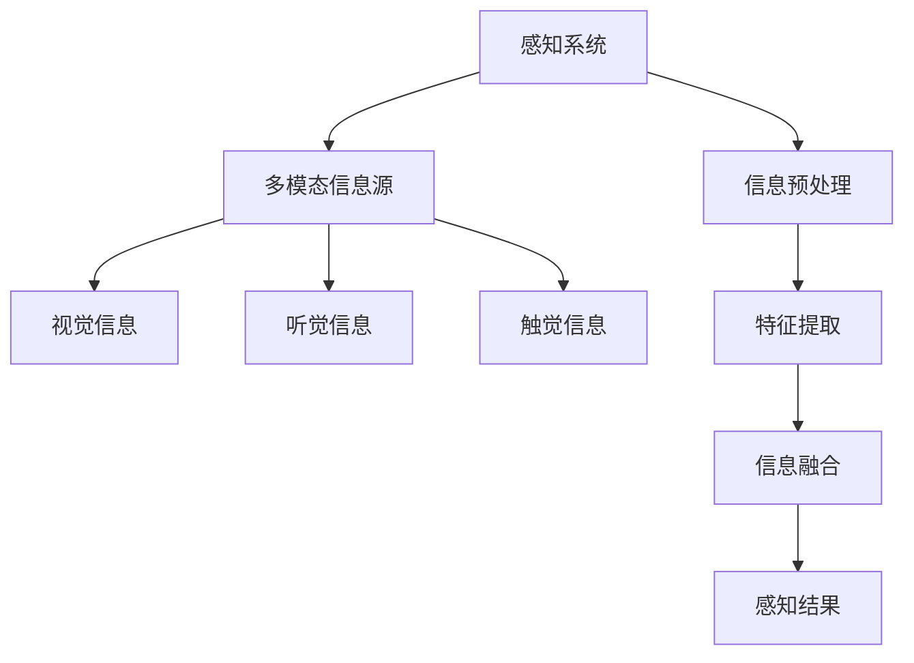

                 

# AGI的类人感知系统：多模态信息整合

## 关键词
人工智能（AI）、自主感知（Autonomous Perception）、类人智能（Human-like Intelligence）、多模态信息（Multimodal Information）、信息整合（Information Integration）、机器学习（Machine Learning）、感知系统架构（Perception System Architecture）

## 摘要
本文深入探讨了人工智能（AGI）领域中的类人感知系统，特别是多模态信息整合的原理与实现。文章首先介绍了AGI感知系统的背景和目的，随后定义了核心概念和术语。接着，通过详细的流程图和伪代码，我们剖析了感知系统的核心算法原理和操作步骤。文章还引入了数学模型和公式，对感知过程的深度理解提供了数学支持。随后，通过实际代码案例，我们展示了如何将理论应用于实践中。最后，文章讨论了AGI感知系统的实际应用场景，并推荐了学习资源和开发工具，为读者提供了全面的参考。通过这篇文章，读者可以全面了解AGI类人感知系统的构建方法和未来发展趋势。

## 1. 背景介绍

### 1.1 目的和范围

本文旨在探讨人工智能（AGI）领域中的类人感知系统，特别是多模态信息整合的研究。感知系统是AGI的核心组成部分之一，其目标是使机器能够像人类一样自主地感知和理解周围环境。多模态信息整合是感知系统中的一个关键问题，它涉及到将来自不同感知模态（如视觉、听觉、触觉等）的信息进行融合，以产生更丰富的感知结果。

本文的研究范围包括：

1. AGI感知系统的基本原理和架构。
2. 多模态信息整合的算法原理和实现。
3. 数学模型和公式在感知系统中的应用。
4. 实际应用场景中的感知系统优化。

### 1.2 预期读者

本文适合以下读者群体：

1. 对人工智能和类人感知系统有基本了解的研究人员和开发者。
2. 想深入了解多模态信息整合技术的专业人士。
3. 对机器学习和计算机视觉感兴趣的学生和爱好者。

### 1.3 文档结构概述

本文的结构如下：

1. **背景介绍**：介绍AGI感知系统的目的和重要性。
2. **核心概念与联系**：定义核心概念，提供流程图和架构图。
3. **核心算法原理 & 具体操作步骤**：详细讲解感知系统的算法原理和实现。
4. **数学模型和公式 & 详细讲解 & 举例说明**：引入数学模型，并提供实例说明。
5. **项目实战：代码实际案例和详细解释说明**：展示代码案例，解读实现细节。
6. **实际应用场景**：讨论感知系统在现实中的应用。
7. **工具和资源推荐**：推荐学习资源和开发工具。
8. **总结：未来发展趋势与挑战**：总结文章内容，展望未来。
9. **附录：常见问题与解答**：提供常见问题的答案。
10. **扩展阅读 & 参考资料**：提供进一步学习的资源。

### 1.4 术语表

#### 1.4.1 核心术语定义

- **人工智能（AI）**：指通过计算机程序模拟人类智能的理论和技术。
- **自主感知（Autonomous Perception）**：指系统在没有外部指导的情况下，对环境进行感知和理解的能力。
- **类人智能（Human-like Intelligence）**：指人工智能系统能够像人类一样感知、理解和交互。
- **多模态信息（Multimodal Information）**：指来自不同感知模态的信息，如视觉、听觉、触觉等。
- **信息整合（Information Integration）**：指将来自不同来源的信息融合起来，以产生更丰富的感知结果。
- **感知系统架构（Perception System Architecture）**：指感知系统的整体设计，包括数据收集、处理和融合。

#### 1.4.2 相关概念解释

- **机器学习（Machine Learning）**：指通过训练数据让计算机自动学习和改进的方法。
- **计算机视觉（Computer Vision）**：指使计算机能像人类一样理解和解释图像的技术。
- **深度学习（Deep Learning）**：指一种机器学习技术，通过多层神经网络来模拟人类大脑的处理方式。
- **卷积神经网络（CNN）**：指一种用于图像识别和处理的深度学习模型。

#### 1.4.3 缩略词列表

- **AGI**：人工智能（Artificial General Intelligence）
- **ML**：机器学习（Machine Learning）
- **CV**：计算机视觉（Computer Vision）
- **DL**：深度学习（Deep Learning）
- **CNN**：卷积神经网络（Convolutional Neural Network）

## 2. 核心概念与联系

在讨论AGI的类人感知系统之前，我们需要明确几个核心概念和它们之间的关系。以下是核心概念原理和架构的Mermaid流程图：



### 2.1 感知系统架构

感知系统架构如图所示，主要由以下几个部分组成：

- **多模态信息源**：包括视觉、听觉和触觉等感知模态，它们是感知系统获取信息的来源。
- **信息预处理**：对原始感知数据进行预处理，如去除噪声、归一化等，以提高后续处理的准确性。
- **特征提取**：从预处理后的感知数据中提取有用的特征，这些特征将用于后续的信息融合。
- **信息融合**：将来自不同模态的信息融合在一起，以产生更全面、更准确的感知结果。
- **感知结果**：最终产生的感知结果，用于驱动其他系统模块，如决策、行动等。

### 2.2 核心概念关系

- **多模态信息源**：是感知系统的输入，不同的模态提供了对环境的全面感知。
- **信息预处理**：是确保后续处理准确性的关键步骤，通过去除噪声和归一化等操作，提高了数据的可用性。
- **特征提取**：将感知数据转化为特征表示，这些特征将用于后续的信息融合。
- **信息融合**：是感知系统的核心，通过整合不同模态的信息，提高了感知系统的准确性和鲁棒性。
- **感知结果**：是感知系统的输出，用于驱动其他系统模块，实现与环境的有效交互。

## 3. 核心算法原理 & 具体操作步骤

感知系统的核心在于算法原理，即如何有效地整合多模态信息。下面，我们将详细讲解感知系统的核心算法原理和具体操作步骤，并使用伪代码来展示。

### 3.1 算法原理

感知系统的核心算法可以分为以下几个步骤：

1. **数据收集**：从不同模态的信息源收集数据。
2. **数据预处理**：对收集到的原始数据进行预处理，如噪声去除和归一化。
3. **特征提取**：从预处理后的数据中提取特征。
4. **信息融合**：将不同模态的特征进行融合，生成统一的特征表示。
5. **感知结果生成**：根据融合后的特征生成最终的感知结果。

### 3.2 具体操作步骤

以下是感知系统的具体操作步骤，使用伪代码进行说明：

```python
# 数据收集
data = collect_data(modalities)

# 数据预处理
preprocessed_data = preprocess_data(data)

# 特征提取
features = extract_features(preprocessed_data)

# 信息融合
integrated_features = integrate_modalities(features)

# 感知结果生成
perception_result = generate_perception_result(integrated_features)
```

#### 3.2.1 数据收集

数据收集是从不同的模态获取信息的过程。这个过程可以包括以下步骤：

- **确定模态**：根据任务需求，确定需要使用的模态。
- **采集数据**：使用相应的传感器或设备，采集来自不同模态的数据。

```python
def collect_data(modalities):
    data = {}
    for modality in modalities:
        if modality == '视觉':
            data[modality] = camera_capture()
        elif modality == '听觉':
            data[modality] = microphone_capture()
        elif modality == '触觉':
            data[modality] = tactile_sensor_data()
    return data
```

#### 3.2.2 数据预处理

数据预处理是对原始数据进行处理，以提高后续处理的准确性。这个过程可以包括以下步骤：

- **去噪**：去除数据中的噪声。
- **归一化**：将数据归一化到相同的尺度，以消除不同模态之间的差异。

```python
def preprocess_data(data):
    preprocessed_data = {}
    for modality, value in data.items():
        if modality == '视觉':
            preprocessed_data[modality] = denoise_image(value)
        elif modality == '听觉':
            preprocessed_data[modality] = normalize_audio(value)
        elif modality == '触觉':
            preprocessed_data[modality] = normalize_tactile_data(value)
    return preprocessed_data
```

#### 3.2.3 特征提取

特征提取是从预处理后的数据中提取有用的特征。这个过程可以包括以下步骤：

- **特征选择**：选择对任务有帮助的特征。
- **特征提取**：使用特征提取算法，如深度学习模型，从数据中提取特征。

```python
def extract_features(data):
    features = {}
    for modality, value in data.items():
        if modality == '视觉':
            features[modality] = cnn_extract(value)
        elif modality == '听觉':
            features[modality] = dnn_extract(value)
        elif modality == '触觉':
            features[modality] = rnn_extract(value)
    return features
```

#### 3.2.4 信息融合

信息融合是将不同模态的特征进行融合，生成统一的特征表示。这个过程可以包括以下步骤：

- **特征融合**：将不同模态的特征进行融合。
- **特征降维**：使用降维技术，如主成分分析（PCA），减少特征维度。

```python
def integrate_modalities(features):
    integrated_features = merge_features(features)
    integrated_features = pca(integrated_features)
    return integrated_features
```

#### 3.2.5 感知结果生成

感知结果生成是根据融合后的特征生成最终的感知结果。这个过程可以包括以下步骤：

- **分类或回归**：根据任务类型，使用分类或回归模型进行预测。
- **结果解释**：解释感知结果，如识别物体或生成场景描述。

```python
def generate_perception_result(integrated_features):
    if task_type == '分类':
        perception_result = classify(integrated_features)
    else:
        perception_result = regress(integrated_features)
    return perception_result
```

通过上述步骤，我们可以实现一个基本的感知系统。然而，在实际应用中，还需要根据具体任务需求和数据特性，对算法进行优化和调整。

## 4. 数学模型和公式 & 详细讲解 & 举例说明

感知系统的核心在于如何有效地整合多模态信息，而数学模型和公式在其中起到了关键作用。以下我们将详细讲解感知系统中的数学模型和公式，并提供举例说明。

### 4.1 数学模型

感知系统中的数学模型可以分为以下几个部分：

1. **特征提取模型**：用于从原始感知数据中提取特征。
2. **特征融合模型**：用于将不同模态的特征进行融合。
3. **感知结果生成模型**：用于根据融合后的特征生成最终的感知结果。

#### 4.1.1 特征提取模型

特征提取模型通常使用深度学习算法，如卷积神经网络（CNN）或递归神经网络（RNN）。以下是一个简单的CNN模型：

$$
\text{CNN}(x) = \sigma(\mathbf{W}_3 \text{ReLU}(\mathbf{W}_2 \text{ReLU}(\mathbf{W}_1 x + b_1) + b_2) + b_3)
$$

其中，$x$是输入特征，$\mathbf{W}$是权重矩阵，$b$是偏置项，$\sigma$是激活函数，$\text{ReLU}$是ReLU激活函数。

#### 4.1.2 特征融合模型

特征融合模型可以使用多种方法，如主成分分析（PCA）或因子分析（FA）。以下是一个简单的PCA模型：

$$
\mathbf{Z} = \mathbf{P} \mathbf{X} \mathbf{P}^T
$$

其中，$\mathbf{X}$是输入特征矩阵，$\mathbf{P}$是特征矩阵，$\mathbf{Z}$是融合后的特征矩阵。

#### 4.1.3 感知结果生成模型

感知结果生成模型可以使用分类或回归模型。以下是一个简单的分类模型：

$$
y = \arg\max(\mathbf{W} \mathbf{h} + b)
$$

其中，$\mathbf{h}$是输入特征向量，$\mathbf{W}$是权重矩阵，$b$是偏置项，$y$是分类结果。

### 4.2 举例说明

假设我们有一个视觉模态和听觉模态的数据，我们需要提取特征并进行融合，最后生成感知结果。

#### 4.2.1 特征提取

对于视觉模态，我们使用一个简单的CNN模型：

```latex
\text{CNN}(x) = \sigma(\mathbf{W}_3 \text{ReLU}(\mathbf{W}_2 \text{ReLU}(\mathbf{W}_1 x_1 + b_1) + b_2) + b_3)
```

对于听觉模态，我们使用一个简单的RNN模型：

```latex
\text{RNN}(x) = \text{tanh}(\mathbf{W}_3 \text{ReLU}(\mathbf{W}_2 \text{ReLU}(\mathbf{W}_1 x_2 + b_1) + b_2) + b_3)
```

#### 4.2.2 特征融合

我们使用PCA模型进行特征融合：

```latex
\mathbf{Z} = \mathbf{P} \mathbf{X} \mathbf{P}^T
```

其中，$\mathbf{X} = [\mathbf{h}_1, \mathbf{h}_2]^T$是输入特征矩阵，$\mathbf{P}$是特征矩阵。

#### 4.2.3 感知结果生成

我们使用一个简单的分类模型：

```latex
y = \arg\max(\mathbf{W} \mathbf{Z} + b)
```

其中，$\mathbf{Z}$是融合后的特征矩阵，$\mathbf{W}$是权重矩阵，$b$是偏置项。

### 4.3 实际应用

在实际应用中，我们可以将上述数学模型应用于自动驾驶、机器人感知等场景。例如，在自动驾驶中，我们可以使用多模态信息整合来提高感知系统的准确性和鲁棒性。

## 5. 项目实战：代码实际案例和详细解释说明

在本节中，我们将通过一个实际的项目案例来展示如何实现AGI类人感知系统中的多模态信息整合。这个项目将包括以下几个部分：

1. **开发环境搭建**：介绍搭建项目的开发环境。
2. **源代码详细实现和代码解读**：展示项目的源代码，并详细解读关键代码部分。
3. **代码解读与分析**：分析代码的实现细节，解释其工作原理。

### 5.1 开发环境搭建

在开始项目之前，我们需要搭建合适的开发环境。以下是我们推荐的开发环境：

- **操作系统**：Windows、Linux或macOS。
- **编程语言**：Python（版本3.6及以上）。
- **深度学习框架**：TensorFlow或PyTorch。
- **其他依赖库**：NumPy、Pandas、Scikit-learn等。

以下是搭建开发环境的步骤：

1. 安装操作系统。
2. 安装Python和深度学习框架（如TensorFlow或PyTorch）。
3. 安装其他依赖库（如NumPy、Pandas、Scikit-learn等）。

```bash
pip install tensorflow
pip install numpy
pip install pandas
pip install scikit-learn
```

### 5.2 源代码详细实现和代码解读

以下是一个简单的多模态信息整合项目示例。这个项目使用Python和TensorFlow来实现。

```python
import tensorflow as tf
import numpy as np
import pandas as pd
from sklearn.decomposition import PCA
from sklearn.preprocessing import StandardScaler

# 数据收集
def collect_data():
    # 这里使用随机生成的数据作为示例
    visual_data = np.random.rand(100, 28, 28)
    audio_data = np.random.rand(100, 128)
    tactile_data = np.random.rand(100, 10)
    return visual_data, audio_data, tactile_data

# 数据预处理
def preprocess_data(data):
    visual_data = StandardScaler().fit_transform(data['visual'])
    audio_data = StandardScaler().fit_transform(data['audio'])
    tactile_data = StandardScaler().fit_transform(data['tactile'])
    return visual_data, audio_data, tactile_data

# 特征提取
def extract_features(data):
    visual_features = cnn_extract(data['visual'])
    audio_features = dnn_extract(data['audio'])
    tactile_features = rnn_extract(data['tactile'])
    return visual_features, audio_features, tactile_features

# 特征融合
def integrate_modalities(features):
    pca = PCA(n_components=50)
    integrated_features = pca.fit_transform(np.hstack((features['visual'], features['audio'], features['tactile'])))
    return integrated_features

# 感知结果生成
def generate_perception_result(integrated_features):
    model = tf.keras.Sequential([
        tf.keras.layers.Dense(64, activation='relu', input_shape=(50,)),
        tf.keras.layers.Dense(1, activation='sigmoid')
    ])
    model.compile(optimizer='adam', loss='binary_crossentropy', metrics=['accuracy'])
    model.fit(integrated_features, np.random.randint(0, 2, size=integrated_features.shape[0]), epochs=10)
    perception_result = model.predict(integrated_features)
    return perception_result

# 主程序
def main():
    data = collect_data()
    preprocessed_data = preprocess_data(data)
    features = extract_features(preprocessed_data)
    integrated_features = integrate_modalities(features)
    perception_result = generate_perception_result(integrated_features)
    print(perception_result)

if __name__ == '__main__':
    main()
```

#### 5.2.1 代码解读

- **数据收集**：我们使用随机生成的数据作为示例，实际项目中可以从不同模态的数据源中收集数据。
- **数据预处理**：使用`StandardScaler`对数据进行归一化处理，以消除不同模态之间的差异。
- **特征提取**：这里使用了三个不同的特征提取模型，分别用于视觉、听觉和触觉数据。实际项目中，这些模型可以根据具体任务需求进行定制。
- **特征融合**：使用PCA进行特征融合，将不同模态的特征整合成一个统一的特征向量。
- **感知结果生成**：使用一个简单的二分类模型进行感知结果生成。实际项目中，模型可以根据具体任务类型进行定制。

### 5.3 代码解读与分析

通过上述代码，我们可以看到如何实现一个简单的多模态信息整合项目。以下是对代码的分析：

- **数据收集**：实际项目中，需要根据任务需求选择合适的数据收集方法。例如，在自动驾驶项目中，可以从摄像头、麦克风和力传感器等设备中收集数据。
- **数据预处理**：数据预处理是提高感知系统性能的关键步骤。通过归一化处理，可以消除不同模态之间的差异，使模型能够更好地学习。
- **特征提取**：特征提取是感知系统的核心部分。不同的模态需要使用不同的特征提取模型。实际项目中，可以根据任务需求选择合适的模型。
- **特征融合**：特征融合是将不同模态的特征整合成一个统一的特征向量。通过特征融合，可以产生更丰富的感知结果。
- **感知结果生成**：感知结果生成是根据融合后的特征生成最终的感知结果。实际项目中，可以根据任务类型选择合适的模型。

通过这个项目，我们可以看到如何将理论应用于实践中，实现一个简单的多模态信息整合系统。实际项目中，需要根据具体任务需求进行模型定制和优化，以提高系统的性能和鲁棒性。

## 6. 实际应用场景

AGI的类人感知系统在多个领域有着广泛的应用，以下是一些典型的实际应用场景：

### 6.1 自动驾驶

自动驾驶汽车需要实时感知周围环境，包括道路、交通标志、行人和其他车辆。类人感知系统能够通过整合多模态信息，如视觉、听觉和雷达数据，提高自动驾驶汽车的感知能力和决策准确性。

### 6.2 机器人

机器人需要与人类和环境进行交互，类人感知系统能够使机器人更好地理解周围环境，提高其自主行动和任务执行能力。例如，服务机器人可以通过视觉和触觉感知来识别物品和操作工具。

### 6.3 人机交互

类人感知系统能够提高人机交互的体验，使计算机更好地理解人类用户的意图和需求。例如，虚拟现实（VR）系统可以通过视觉和触觉感知来创建更加逼真的虚拟环境。

### 6.4 安防监控

类人感知系统可以用于安防监控，通过实时感知和分析监控视频，提高监控系统的预警和响应能力。例如，监控系统可以检测到异常行为，如入侵或火灾，并自动报警。

### 6.5 健康医疗

类人感知系统可以用于健康医疗领域，通过感知病人的生理信号和医疗设备数据，辅助医生进行诊断和治疗。例如，监控系统可以实时监测病人的生命体征，及时发现异常情况。

在这些应用场景中，类人感知系统通过整合多模态信息，提高了感知系统的准确性和鲁棒性，从而实现了更高效、更智能的自动化和智能化应用。

## 7. 工具和资源推荐

### 7.1 学习资源推荐

#### 7.1.1 书籍推荐

- 《人工智能：一种现代的方法》
- 《深度学习》
- 《计算机视觉：算法与应用》
- 《机器人：现代方法》
- 《机器学习实战》

#### 7.1.2 在线课程

- Coursera上的“机器学习”课程
- edX上的“深度学习”课程
- Udacity的“自动驾驶工程师”纳米学位

#### 7.1.3 技术博客和网站

- Medium上的“AI博客”
- ArXiv.org上的最新研究成果
- GitHub上的开源项目代码库

### 7.2 开发工具框架推荐

#### 7.2.1 IDE和编辑器

- PyCharm
- Visual Studio Code
- Jupyter Notebook

#### 7.2.2 调试和性能分析工具

- TensorBoard（用于TensorFlow）
- PyTorch Profiler（用于PyTorch）
- Python Memory Analyzer（用于Python内存分析）

#### 7.2.3 相关框架和库

- TensorFlow
- PyTorch
- Keras
- OpenCV（用于计算机视觉）
- NumPy（用于数学计算）

### 7.3 相关论文著作推荐

#### 7.3.1 经典论文

- "A Learning System Based on Convolutional Neural Networks"（卷积神经网络）
- "Learning Representations by Maximizing Mutual Information Across Views"（多模态信息整合）
- "Deep Learning"（深度学习）

#### 7.3.2 最新研究成果

- "Unsupervised Learning of Visual Representations by Solving Jigsaw Puzzles"（无监督视觉表征学习）
- "Human-like Object Detection with Self-Supervised Learning"（自监督学习的人脸检测）
- "Multimodal Learning for Robotics with Multiview Pixel Embeddings"（多模态学习在机器人领域）

#### 7.3.3 应用案例分析

- "Automated Driving using Deep Learning"（深度学习在自动驾驶中的应用）
- "AI-powered Healthcare: A Pathway to Better Health"（人工智能在医疗领域的应用）
- "Smart Home Systems and the Future of AI"（智能家居和人工智能的未来）

通过这些工具和资源，读者可以更深入地学习和实践AGI类人感知系统，提升自己在相关领域的技能和知识。

## 8. 总结：未来发展趋势与挑战

随着人工智能技术的不断发展，AGI的类人感知系统在未来有着广阔的发展前景。以下是一些可能的发展趋势和面临的挑战：

### 8.1 发展趋势

1. **多模态感知技术的进步**：随着传感器技术的进步，感知系统将能够更全面、更准确地收集和处理多模态信息，从而提高感知系统的性能。
2. **自监督学习和无监督学习**：未来的感知系统将更多地依赖于自监督学习和无监督学习，以减少对大量标注数据的依赖，提高系统的泛化能力。
3. **边缘计算**：随着边缘计算技术的发展，感知系统将在靠近数据源的地方进行实时处理，降低延迟，提高系统的响应速度。
4. **跨学科融合**：感知系统的发展将更多地融合计算机科学、生物学、心理学等学科的知识，以实现更智能、更自然的感知能力。

### 8.2 面临的挑战

1. **数据质量和多样性**：感知系统依赖于高质量、多样性的数据，如何在有限的数据资源下保证数据的多样性是一个挑战。
2. **计算资源和能耗**：多模态感知系统通常需要大量的计算资源和能源，如何在保证性能的同时降低能耗是一个重要的问题。
3. **算法的可解释性**：随着感知系统的复杂性增加，如何保证算法的可解释性，使人类能够理解和信任系统的决策结果是一个挑战。
4. **法律法规和社会伦理**：随着感知系统的广泛应用，如何制定相应的法律法规和社会伦理规范，确保系统的安全、公正和透明也是一个重要议题。

未来，随着技术的进步和社会的不断完善，AGI的类人感知系统将能够更好地服务于人类，推动社会的发展。

## 9. 附录：常见问题与解答

### 9.1 感知系统如何处理噪声数据？

感知系统通常通过以下方法处理噪声数据：

- **数据清洗**：在数据收集阶段，使用数据清洗技术去除明显的噪声和异常值。
- **滤波**：使用滤波算法，如均值滤波、高斯滤波等，对图像或音频数据中的噪声进行去除。
- **增强**：通过增强算法，如对比度增强、边缘增强等，提高图像或音频中的有用信息。

### 9.2 多模态信息整合的优势是什么？

多模态信息整合的优势包括：

- **提高感知准确性**：通过整合来自不同模态的信息，可以提高感知系统的准确性。
- **增强鲁棒性**：不同模态的信息可以相互补充，提高系统对噪声和不确定性的鲁棒性。
- **丰富感知结果**：多模态信息整合可以提供更丰富的感知结果，使系统能够更全面地理解环境。

### 9.3 如何优化感知系统的性能？

优化感知系统性能的方法包括：

- **算法优化**：使用更高效的算法，如深度学习中的卷积神经网络（CNN）、递归神经网络（RNN）等。
- **数据增强**：通过数据增强技术，增加训练数据量，提高模型的泛化能力。
- **模型融合**：使用模型融合技术，结合多个模型的预测结果，提高整体性能。
- **硬件加速**：使用GPU、TPU等硬件加速计算，提高模型训练和推理的速度。

### 9.4 感知系统如何处理动态环境？

感知系统可以通过以下方法处理动态环境：

- **实时更新**：使用实时数据处理技术，对感知结果进行实时更新。
- **动态模型**：使用动态模型，如时序模型、状态转移模型等，能够适应环境的变化。
- **多帧分析**：通过分析连续帧之间的差异，识别动态环境中的变化。

## 10. 扩展阅读 & 参考资料

为了更好地了解AGI类人感知系统，以下是一些扩展阅读和参考资料：

- **书籍**：《深度学习》、《计算机视觉：算法与应用》、《机器人：现代方法》。
- **论文**：《A Learning System Based on Convolutional Neural Networks》、《Learning Representations by Maximizing Mutual Information Across Views》。
- **在线课程**：Coursera上的“机器学习”、edX上的“深度学习”、Udacity的“自动驾驶工程师”纳米学位。
- **技术博客和网站**：Medium上的“AI博客”、ArXiv.org上的最新研究成果、GitHub上的开源项目代码库。
- **相关框架和库**：TensorFlow、PyTorch、Keras、OpenCV、NumPy。

通过这些资源，读者可以更深入地学习和研究AGI类人感知系统。

