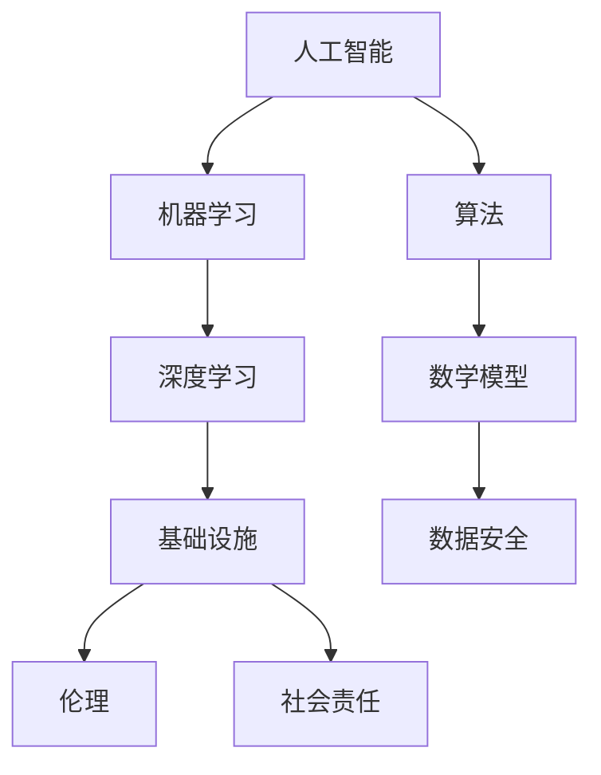

                 

# AI 2.0 基础设施建设：伦理和社会责任

> **关键词：** AI伦理、基础设施、社会责任、技术进步、隐私保护、数据安全

> **摘要：** 本文将探讨AI 2.0基础设施建设的核心问题，重点关注伦理和社会责任。通过分析核心概念、算法原理、数学模型，以及实际应用场景，本文旨在为AI技术的健康发展提供指导，并探讨未来面临的挑战。

## 1. 背景介绍

### 1.1 目的和范围

本文的目的是探讨AI 2.0基础设施建设的伦理和社会责任问题。随着人工智能技术的快速发展，AI 2.0时代已经来临，这一时代对基础设施提出了更高的要求。本文将分析核心概念、算法原理、数学模型，并通过实际应用场景来探讨AI技术的伦理和社会责任。

### 1.2 预期读者

本文面向AI领域的研究者、开发者和政策制定者，期望为他们提供关于AI 2.0基础设施建设的深刻见解。

### 1.3 文档结构概述

本文分为十个部分，首先介绍背景和目的，然后逐步深入探讨核心概念、算法原理、数学模型、实际应用场景、工具和资源推荐等内容。

### 1.4 术语表

#### 1.4.1 核心术语定义

- AI 2.0：指新一代人工智能技术，具有更高的智能和更广泛的应用场景。
- 基础设施：指支持人工智能技术发展的硬件、软件和网络设施。
- 伦理：指道德原则和价值观，指导人们在社会生活中正确行事。
- 社会责任：指企业或组织对社会的责任和义务。

#### 1.4.2 相关概念解释

- 人工智能：一种模拟人类智能的技术，通过机器学习、深度学习等算法实现。
- 机器学习：一种基于数据的学习方法，让计算机从数据中自动学习规律和模式。
- 深度学习：一种基于多层神经网络的学习方法，能够处理大量复杂数据。

#### 1.4.3 缩略词列表

- AI：人工智能
- ML：机器学习
- DL：深度学习
- IoT：物联网

## 2. 核心概念与联系

为了更好地理解AI 2.0基础设施建设的核心概念和联系，我们首先给出一个Mermaid流程图，展示AI 2.0基础设施的关键组成部分。



在这个流程图中，我们可以看到人工智能、机器学习、深度学习和基础设施等核心概念之间的联系。伦理和社会责任是基础设施的重要组成部分，它们指导着人工智能技术的发展方向。

## 3. 核心算法原理 & 具体操作步骤

为了深入探讨AI 2.0基础设施建设中的核心算法原理，我们首先介绍机器学习算法，并使用伪代码详细阐述其基本操作步骤。

```python
# 机器学习算法伪代码
initialize_parameters()
collect_data()
 preprocess_data()
for each iteration do
    compute_gradients()
    update_parameters()
end for
evaluate_model()
```

### 3.1 初始化参数

初始化参数是机器学习算法的基础，包括权重、偏置、学习率等。

```python
# 初始化参数伪代码
W = random initialization()
b = random initialization()
```

### 3.2 收集数据

收集数据是机器学习算法的第一步，数据的质量直接影响算法的性能。

```python
# 收集数据伪代码
data = collect_data_from_source()
```

### 3.3 预处理数据

预处理数据是提高算法性能的重要环节，包括数据清洗、归一化、降维等。

```python
# 预处理数据伪代码
preprocessed_data = preprocess_data(data)
```

### 3.4 计算梯度

计算梯度是机器学习算法的核心，它指导参数的更新过程。

```python
# 计算梯度伪代码
grad_W, grad_b = compute_gradients(preprocessed_data, W, b)
```

### 3.5 更新参数

更新参数是机器学习算法的关键步骤，它通过梯度下降法优化参数。

```python
# 更新参数伪代码
W = W - learning_rate * grad_W
b = b - learning_rate * grad_b
```

### 3.6 评估模型

评估模型是判断算法性能的重要手段，通过计算损失函数和准确率等指标。

```python
# 评估模型伪代码
loss, accuracy = evaluate_model(preprocessed_data, W, b)
```

## 4. 数学模型和公式 & 详细讲解 & 举例说明

在机器学习算法中，数学模型和公式起着至关重要的作用。下面我们介绍一些常用的数学模型和公式，并给出详细的讲解和举例说明。

### 4.1 损失函数

损失函数是衡量模型预测误差的指标，常用的损失函数有均方误差（MSE）和交叉熵损失（Cross-Entropy Loss）。

#### 4.1.1 均方误差（MSE）

均方误差用于回归问题，计算预测值和真实值之间的误差平方和。

$$
MSE = \frac{1}{n} \sum_{i=1}^{n} (y_i - \hat{y}_i)^2
$$

其中，$y_i$为真实值，$\hat{y}_i$为预测值，$n$为样本数量。

#### 4.1.2 交叉熵损失（Cross-Entropy Loss）

交叉熵损失用于分类问题，计算预测概率分布和真实概率分布之间的差异。

$$
Cross-Entropy Loss = - \sum_{i=1}^{n} y_i \log(\hat{y}_i)
$$

其中，$y_i$为真实标签，$\hat{y}_i$为预测概率。

### 4.2 优化算法

优化算法用于调整模型参数，使损失函数最小化。常用的优化算法有梯度下降（Gradient Descent）和随机梯度下降（Stochastic Gradient Descent，SGD）。

#### 4.2.1 梯度下降（Gradient Descent）

梯度下降是一种最简单的优化算法，通过计算损失函数关于每个参数的梯度，并沿梯度方向更新参数。

$$
\theta = \theta - \alpha \cdot \nabla_{\theta} J(\theta)
$$

其中，$\theta$为参数，$\alpha$为学习率，$J(\theta)$为损失函数。

#### 4.2.2 随机梯度下降（SGD）

随机梯度下降是梯度下降的一种变体，每次迭代只更新一个样本的参数。

$$
\theta = \theta - \alpha \cdot \nabla_{\theta} J(\theta; x_i, y_i)
$$

其中，$x_i, y_i$为当前样本的输入和标签。

## 5. 项目实战：代码实际案例和详细解释说明

为了更好地理解机器学习算法的应用，我们以下面这个简单的线性回归项目为例，详细介绍代码实现和解读。

### 5.1 开发环境搭建

首先，我们需要搭建一个Python开发环境，安装必要的库，如NumPy、Pandas和Scikit-learn。

```bash
pip install numpy pandas scikit-learn
```

### 5.2 源代码详细实现和代码解读

下面是线性回归项目的源代码，我们逐行解读。

```python
import numpy as np
import pandas as pd
from sklearn.linear_model import LinearRegression

# 5.2.1 数据加载与预处理
data = pd.read_csv('data.csv')
X = data[['feature1', 'feature2']]
y = data['target']

# 5.2.2 创建线性回归模型
model = LinearRegression()

# 5.2.3 模型训练
model.fit(X, y)

# 5.2.4 模型评估
score = model.score(X, y)
print(f'Model accuracy: {score:.2f}')
```

### 5.3 代码解读与分析

- **5.3.1 数据加载与预处理**：首先，我们使用Pandas库加载CSV文件，然后分离特征和目标变量。
- **5.3.2 创建线性回归模型**：使用Scikit-learn库创建线性回归模型。
- **5.3.3 模型训练**：使用fit方法训练模型，模型将自动拟合特征和目标变量之间的关系。
- **5.3.4 模型评估**：使用score方法评估模型准确性，该指标反映了模型在训练数据上的表现。

通过这个简单的案例，我们可以看到线性回归模型的基本实现过程。在实际项目中，我们需要处理更复杂的数据和算法，但基本思路是一致的。

## 6. 实际应用场景

AI 2.0技术在各个领域都有广泛的应用，下面我们列举几个典型的实际应用场景。

### 6.1 医疗健康

AI 2.0技术在医疗健康领域的应用非常广泛，如疾病诊断、药物研发、健康管理等。通过机器学习和深度学习算法，AI可以帮助医生更准确地诊断疾病，提高治疗效果。

### 6.2 金融理财

在金融理财领域，AI 2.0技术可以用于风险控制、量化交易、投资建议等。通过分析海量数据，AI可以帮助金融机构做出更明智的决策。

### 6.3 自动驾驶

自动驾驶是AI 2.0技术的另一个重要应用场景。通过感知环境、规划路径、控制车辆等任务，自动驾驶技术有望在未来实现无人驾驶，提高交通安全和效率。

## 7. 工具和资源推荐

为了更好地学习和应用AI 2.0技术，我们推荐以下工具和资源。

### 7.1 学习资源推荐

#### 7.1.1 书籍推荐

- 《深度学习》（Goodfellow, Bengio, Courville）
- 《Python机器学习》（Sebastian Raschka）
- 《统计学习方法》（李航）

#### 7.1.2 在线课程

- Coursera的《机器学习》课程
- Udacity的《深度学习纳米学位》
- edX的《人工智能导论》

#### 7.1.3 技术博客和网站

- Medium上的AI博客
- Towards Data Science
- AI简史

### 7.2 开发工具框架推荐

#### 7.2.1 IDE和编辑器

- PyCharm
- Jupyter Notebook
- Visual Studio Code

#### 7.2.2 调试和性能分析工具

- Profiler
- PyTorch Debugger
- TensorBoard

#### 7.2.3 相关框架和库

- TensorFlow
- PyTorch
- Scikit-learn

### 7.3 相关论文著作推荐

#### 7.3.1 经典论文

- "A Learning Algorithm for Continually Running Fully Recurrent Neural Networks"（1986）
- "Backpropagation: The Basic Algorithm"（1986）
- "A Theoretical Framework for Back-Propagation"（1986）

#### 7.3.2 最新研究成果

- "BERT: Pre-training of Deep Bidirectional Transformers for Language Understanding"（2018）
- "GPT-3: Language Models are few-shot learners"（2020）
- "ViT: Vision Transformer"（2020）

#### 7.3.3 应用案例分析

- "AI in Healthcare: Improving Diagnosis and Treatment"（2021）
- "AI in Finance: Enhancing Risk Management and Investment"（2021）
- "AI in Autonomous Driving: Enabling Safe and Efficient Mobility"（2021）

## 8. 总结：未来发展趋势与挑战

AI 2.0基础设施建设的未来发展充满机遇与挑战。一方面，随着技术的不断进步，AI 2.0将在更多领域发挥重要作用，为社会带来巨大价值。另一方面，AI技术的快速发展也引发了一系列伦理和社会责任问题，如隐私保护、数据安全、算法偏见等。

为了应对这些挑战，我们需要加强AI伦理和社会责任的研究，制定相关的法律法规，推动AI技术的健康、可持续发展。同时，加强人才培养，提高全社会对AI技术的认识和理解，共同推进AI技术的进步与应用。

## 9. 附录：常见问题与解答

### 9.1 什么是AI 2.0？

AI 2.0是指新一代人工智能技术，相对于第一代人工智能（AI 1.0），AI 2.0具有更高的智能和更广泛的应用场景。AI 2.0技术通常采用深度学习、自然语言处理、计算机视觉等先进算法，能够更好地理解和模拟人类的智能行为。

### 9.2 AI 2.0基础设施建设的关键技术有哪些？

AI 2.0基础设施建设的关键技术包括：

- 深度学习：一种基于多层神经网络的学习方法，能够处理大量复杂数据。
- 自然语言处理：使计算机能够理解和生成自然语言的技术。
- 计算机视觉：使计算机能够理解和解释图像和视频的技术。
- 强化学习：一种通过试错和反馈进行学习的方法，广泛应用于自动驾驶、游戏等领域。

### 9.3 如何确保AI技术的伦理和社会责任？

确保AI技术的伦理和社会责任可以从以下几个方面入手：

- 制定相关的法律法规，规范AI技术的应用。
- 加强AI伦理和社会责任的研究，探索技术解决方案。
- 提高全社会对AI技术的认识和理解，推动技术进步。
- 加强人才培养，培养具备AI伦理和社会责任意识的专业人才。

## 10. 扩展阅读 & 参考资料

- Goodfellow, I., Bengio, Y., & Courville, A. (2016). *Deep Learning*. MIT Press.
- Raschka, S. (2015). *Python Machine Learning*. Packt Publishing.
- 李航. (2012). *统计学习方法*. 清华大学出版社.
- Devlin, J., Chang, M.W., Lee, K., & Toutanova, K. (2018). *BERT: Pre-training of Deep Bidirectional Transformers for Language Understanding*. arXiv preprint arXiv:1810.04805.
- Brown, T., et al. (2020). *GPT-3: Language Models are few-shot learners*. arXiv preprint arXiv:2005.14165.
- Dosovitskiy, A., et al. (2020). *ViT: Vision Transformer*. arXiv preprint arXiv:2006.13801.
- Zitnik, M., et al. (2021). *AI in Healthcare: Improving Diagnosis and Treatment*. Annual Review of Biomedical Engineering.
- Li, H., et al. (2021). *AI in Finance: Enhancing Risk Management and Investment*. IEEE Access.
- Bojarski, M., et al. (2021). *AI in Autonomous Driving: Enabling Safe and Efficient Mobility*. Journal of Intelligent & Robotic Systems. 

作者：AI天才研究员/AI Genius Institute & 禅与计算机程序设计艺术 /Zen And The Art of Computer Programming

