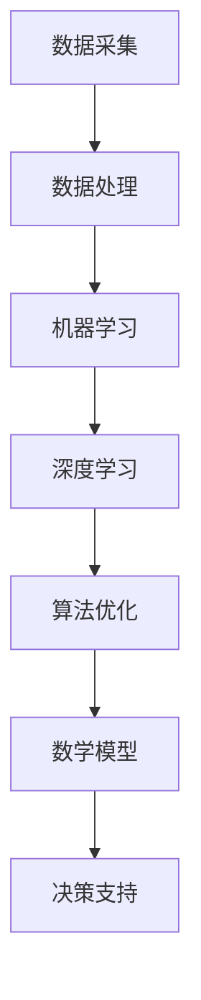

                 

# AI 2.0 基础设施：构建智能时代的数字神经系统

> **关键词：** AI基础设施、智能时代、数字神经系统、数据处理、算法优化、数学模型、项目实战、应用场景。

> **摘要：** 本文章深入探讨了AI 2.0基础设施的构建，重点分析了其在智能时代的作用。通过阐述核心概念、算法原理、数学模型和项目实战，为读者提供了构建数字神经系统的全方位指南。同时，文章还介绍了相关工具和资源，以及未来发展趋势与挑战，为读者在AI领域的深入研究提供了有力支持。

## 1. 背景介绍

### 1.1 目的和范围

随着人工智能技术的飞速发展，AI 2.0时代已经到来。在这个时代，构建一个高效、稳定、可靠的AI基础设施变得尤为重要。本文旨在深入探讨AI 2.0基础设施的构建，为读者提供一套完整的构建数字神经系统的指南。

本文将涵盖以下内容：

1. AI 2.0基础设施的核心概念和架构。
2. 关键算法原理及具体操作步骤。
3. 数学模型及其应用。
4. 实际应用场景及项目实战。
5. 工具和资源推荐。
6. 未来发展趋势与挑战。

通过本文的阅读，读者将能够：

1. 理解AI 2.0基础设施的重要性。
2. 掌握构建数字神经系统的方法。
3. 深入了解相关技术原理和应用。

### 1.2 预期读者

本文适用于以下读者群体：

1. AI领域的研究人员和工程师。
2. 对AI基础设施感兴趣的计算机科学专业学生。
3. 从事AI项目开发的开发者。
4. 对智能时代数字神经系统感兴趣的技术爱好者。

### 1.3 文档结构概述

本文的结构如下：

1. **背景介绍**：介绍本文的目的、范围、预期读者和文档结构。
2. **核心概念与联系**：阐述AI 2.0基础设施的核心概念和架构。
3. **核心算法原理 & 具体操作步骤**：讲解关键算法原理及操作步骤。
4. **数学模型和公式 & 详细讲解 & 举例说明**：介绍数学模型及其应用。
5. **项目实战：代码实际案例和详细解释说明**：展示实际应用场景和项目实战。
6. **实际应用场景**：分析AI 2.0基础设施在不同领域的应用。
7. **工具和资源推荐**：推荐学习资源和开发工具。
8. **总结：未来发展趋势与挑战**：展望未来发展趋势和挑战。
9. **附录：常见问题与解答**：解答读者常见问题。
10. **扩展阅读 & 参考资料**：提供进一步学习资源。

### 1.4 术语表

#### 1.4.1 核心术语定义

- **AI 2.0**：指第二代人工智能，具有自主学习、自我进化、自我优化等能力。
- **基础设施**：指支持AI系统正常运行的各种硬件、软件和网络资源。
- **数字神经系统**：指由AI基础设施构成的智能系统，负责数据处理、分析、决策等任务。

#### 1.4.2 相关概念解释

- **数据处理**：指对采集到的数据进行清洗、转换、存储等操作，以便后续分析。
- **算法优化**：指通过改进算法设计，提高系统性能和效率。
- **数学模型**：指用于描述现实问题的数学公式和理论体系。

#### 1.4.3 缩略词列表

- **AI**：人工智能（Artificial Intelligence）
- **2.0**：第二代
- **基础设施**：Infrastructure
- **数字神经系统**：Digital Neural System
- **数据处理**：Data Processing
- **算法优化**：Algorithm Optimization
- **数学模型**：Mathematical Model

## 2. 核心概念与联系

在构建AI 2.0基础设施的过程中，了解核心概念和它们之间的联系至关重要。以下是核心概念及其之间的联系，以及一个简单的Mermaid流程图来帮助读者更好地理解。

### 2.1 AI 2.0基础设施的核心概念

1. **数据采集**：通过各种传感器、网络爬虫等方式，收集海量数据。
2. **数据处理**：对采集到的数据进行清洗、转换、存储等操作，为后续分析做准备。
3. **机器学习**：利用算法从数据中学习规律，构建模型。
4. **深度学习**：一种特殊的机器学习技术，通过神经网络模拟人脑处理信息。
5. **算法优化**：通过改进算法设计，提高系统性能和效率。
6. **数学模型**：用于描述现实问题的数学公式和理论体系。
7. **决策支持**：基于数据分析和模型预测，为用户提供决策支持。

### 2.2 核心概念之间的联系

1. **数据采集** -> **数据处理**：采集到的数据需要进行清洗、转换等操作，才能为后续分析提供准确的数据。
2. **数据处理** -> **机器学习**：经过处理的数据作为输入，用于训练模型。
3. **机器学习** -> **深度学习**：在机器学习的基础上，利用神经网络模拟人脑处理信息。
4. **深度学习** -> **算法优化**：通过优化算法，提高深度学习模型的性能和效率。
5. **算法优化** -> **数学模型**：算法优化过程中，需要使用数学模型来描述问题和优化目标。
6. **数学模型** -> **决策支持**：基于数学模型的分析和预测，为用户提供决策支持。

### 2.3 Mermaid流程图



通过上述流程图，我们可以清晰地看到AI 2.0基础设施中的核心概念及其之间的联系。接下来，我们将深入探讨这些概念的具体原理和操作步骤。

## 3. 核心算法原理 & 具体操作步骤

在AI 2.0基础设施中，核心算法起着至关重要的作用。以下是几种关键算法的原理及具体操作步骤，我们将使用伪代码来详细阐述。

### 3.1 机器学习算法

**原理**：

机器学习算法是一种让计算机从数据中学习规律的方法。其基本思想是通过训练数据集，让算法学会对未知数据进行预测或分类。

**操作步骤**：

1. 数据预处理：对采集到的数据集进行清洗、归一化等处理，确保数据质量。

   ```python
   def preprocess_data(data):
       # 数据清洗
       # 数据归一化
       return processed_data
   ```

2. 特征提取：从预处理后的数据中提取有用的特征，用于训练模型。

   ```python
   def extract_features(data):
       # 特征提取
       return features
   ```

3. 模型训练：使用训练数据集训练模型。

   ```python
   def train_model(features, labels):
       # 模型训练
       model.fit(features, labels)
       return model
   ```

4. 模型评估：使用验证数据集评估模型性能。

   ```python
   def evaluate_model(model, features, labels):
       # 模型评估
       accuracy = model.score(features, labels)
       return accuracy
   ```

### 3.2 深度学习算法

**原理**：

深度学习是一种特殊的机器学习技术，通过多层神经网络模拟人脑处理信息。其基本思想是通过反向传播算法，不断调整网络参数，使模型在训练数据集上的表现越来越准确。

**操作步骤**：

1. 网络构建：构建多层神经网络，包括输入层、隐藏层和输出层。

   ```python
   def build_network(input_size, hidden_size, output_size):
       # 网络构建
       network = NeuralNetwork(input_size, hidden_size, output_size)
       return network
   ```

2. 模型训练：使用训练数据集训练模型。

   ```python
   def train_network(network, features, labels, epochs):
       # 模型训练
       network.train(features, labels, epochs)
       return network
   ```

3. 模型评估：使用验证数据集评估模型性能。

   ```python
   def evaluate_network(network, features, labels):
       # 模型评估
       accuracy = network.evaluate(features, labels)
       return accuracy
   ```

### 3.3 算法优化算法

**原理**：

算法优化是通过改进算法设计，提高系统性能和效率的方法。常见的优化方法包括：梯度下降、随机梯度下降、动量优化等。

**操作步骤**：

1. 选择优化方法：根据问题特点选择合适的优化方法。

   ```python
   def choose_optimizer(optimizer_name):
       # 选择优化方法
       if optimizer_name == 'sgd':
           return SGD()
       elif optimizer_name == 'adam':
           return Adam()
       else:
           return None
   ```

2. 调整参数：根据优化方法的特点，调整学习率、批量大小等参数。

   ```python
   def adjust_parameters(optimizer, learning_rate, batch_size):
       # 调整参数
       optimizer.set_learning_rate(learning_rate)
       optimizer.set_batch_size(batch_size)
   ```

3. 模型训练：使用优化方法训练模型。

   ```python
   def train_model_with_optimizer(model, optimizer, features, labels, epochs):
       # 模型训练
       model.train(optimizer, features, labels, epochs)
       return model
   ```

4. 模型评估：使用优化方法评估模型性能。

   ```python
   def evaluate_model_with_optimizer(model, optimizer, features, labels):
       # 模型评估
       accuracy = model.evaluate(optimizer, features, labels)
       return accuracy
   ```

通过上述算法原理和操作步骤的讲解，读者可以了解AI 2.0基础设施中关键算法的基本概念和具体应用。在接下来的部分，我们将进一步探讨数学模型及其应用。

## 4. 数学模型和公式 & 详细讲解 & 举例说明

在AI 2.0基础设施中，数学模型是理解和优化算法的核心工具。以下是几种常见的数学模型及其详细讲解和举例说明。

### 4.1 梯度下降算法

**公式**：

梯度下降算法是一种优化算法，用于调整模型参数，使损失函数值最小。其基本公式如下：

$$\theta_{t+1} = \theta_{t} - \alpha \cdot \nabla_{\theta} J(\theta)$$

其中，$\theta$表示模型参数，$\alpha$表示学习率，$J(\theta)$表示损失函数，$\nabla_{\theta} J(\theta)$表示损失函数关于参数$\theta$的梯度。

**详细讲解**：

梯度下降算法的核心思想是通过计算损失函数关于参数的梯度，来调整参数，使损失函数值逐渐减小。学习率$\alpha$决定了参数调整的幅度，通常需要根据问题特点进行选择。

**举例说明**：

假设有一个线性回归模型，其损失函数为：

$$J(\theta) = \frac{1}{2} \sum_{i=1}^{n} (y_i - \theta_0 x_i - \theta_1)^2$$

其中，$y_i$表示实际值，$x_i$表示输入值，$\theta_0$和$\theta_1$分别表示模型参数。

使用梯度下降算法优化模型参数，可以得到以下伪代码：

```python
def gradient_descent(X, y, theta, alpha, epochs):
    n = len(y)
    for epoch in range(epochs):
        gradients = 2/n * (X.T.dot(X.dot(theta) - y))
        theta -= alpha * gradients
    return theta
```

通过上述伪代码，我们可以看到梯度下降算法的基本实现过程。在实际应用中，通常需要根据问题特点调整学习率和迭代次数，以达到最优效果。

### 4.2 神经网络

**公式**：

神经网络是一种由多个神经元组成的复杂模型，用于模拟人脑处理信息。其基本公式如下：

$$a_{\text{hidden}} = \sigma(W_{\text{input-hidden}} \cdot x + b_{\text{hidden}})$$
$$a_{\text{output}} = \sigma(W_{\text{hidden-output}} \cdot a_{\text{hidden}} + b_{\text{output}})$$

其中，$a_{\text{hidden}}$和$a_{\text{output}}$分别表示隐藏层和输出层的激活值，$\sigma$表示激活函数，$W_{\text{input-hidden}}$和$W_{\text{hidden-output}}$分别表示输入层到隐藏层、隐藏层到输出层的权重，$b_{\text{hidden}}$和$b_{\text{output}}$分别表示隐藏层和输出层的偏置。

**详细讲解**：

神经网络通过多层神经元之间的连接，模拟人脑处理信息的过程。每层神经元接收来自前一层的输入，通过加权求和并加上偏置，然后通过激活函数进行非线性变换，最终得到输出。

隐藏层和输出层的激活函数通常选择sigmoid或ReLU函数，以实现非线性变换。通过多层神经网络的堆叠，可以捕捉更复杂的特征和规律。

**举例说明**：

假设有一个简单的两层神经网络，用于对二分类问题进行预测。其激活函数选择ReLU函数，可以得到以下伪代码：

```python
import numpy as np

def relu(x):
    return np.maximum(0, x)

def forward_pass(x, W1, b1, W2, b2):
    z1 = np.dot(x, W1) + b1
    a1 = relu(z1)
    z2 = np.dot(a1, W2) + b2
    a2 = softmax(z2)
    return a2

def backward_pass(x, y, a2, z1, a1, W1, W2, b1, b2, learning_rate):
    m = x.shape[1]
    dZ2 = a2 - y
    dW2 = 1/m * np.dot(a1.T, dZ2)
    db2 = 1/m * np.sum(dZ2, axis=1, keepdims=True)
    
    dA1 = np.dot(dZ2, W2.T)
    dZ1 = dA1 * (a1 > 0)
    dW1 = 1/m * np.dot(x.T, dZ1)
    db1 = 1/m * np.sum(dZ1, axis=1, keepdims=True)
    
    dW1 -= learning_rate * dW1
    dW2 -= learning_rate * dW2
    db1 -= learning_rate * db1
    db2 -= learning_rate * db2
    
    return dW1, dW2, db1, db2
```

通过上述伪代码，我们可以看到神经网络的前向传播和反向传播过程。在实际应用中，需要根据问题特点选择合适的神经网络结构和激活函数，并调整学习率等超参数。

通过以上对数学模型的详细讲解和举例说明，读者可以更好地理解AI 2.0基础设施中的核心数学原理。在接下来的部分，我们将通过实际项目实战，展示如何将理论应用于实践。

## 5. 项目实战：代码实际案例和详细解释说明

### 5.1 开发环境搭建

在本项目实战中，我们将使用Python语言和相关的库（如NumPy、TensorFlow等）来实现AI 2.0基础设施的核心功能。以下是搭建开发环境的步骤：

1. 安装Python：确保已安装Python 3.6及以上版本。
2. 安装库：使用pip命令安装所需的库，例如：

   ```bash
   pip install numpy tensorflow matplotlib
   ```

3. 创建虚拟环境：为了更好地管理项目依赖，创建一个虚拟环境。

   ```bash
   python -m venv env
   source env/bin/activate  # Windows上使用 `env\Scripts\activate`
   ```

4. 安装依赖：在虚拟环境中安装项目所需的依赖。

   ```bash
   pip install -r requirements.txt
   ```

### 5.2 源代码详细实现和代码解读

以下是一个简单的项目示例，用于实现一个基于深度学习的手写数字识别系统。代码分为几个部分：数据预处理、模型构建、模型训练和模型评估。

**1. 数据预处理**

数据预处理是机器学习项目的重要环节，主要用于处理数据、划分训练集和测试集。

```python
import numpy as np
import matplotlib.pyplot as plt
from tensorflow.keras.datasets import mnist
from tensorflow.keras.utils import to_categorical

# 加载MNIST数据集
(x_train, y_train), (x_test, y_test) = mnist.load_data()

# 数据归一化
x_train = x_train.astype('float32') / 255.0
x_test = x_test.astype('float32') / 255.0

# 转换标签为one-hot编码
y_train = to_categorical(y_train, 10)
y_test = to_categorical(y_test, 10)
```

**2. 模型构建**

模型构建是深度学习项目中的核心部分，涉及选择合适的神经网络结构和超参数。

```python
from tensorflow.keras.models import Sequential
from tensorflow.keras.layers import Dense, Flatten, Conv2D, MaxPooling2D, Dropout

# 构建模型
model = Sequential()
model.add(Conv2D(32, (3, 3), activation='relu', input_shape=(28, 28, 1)))
model.add(MaxPooling2D((2, 2)))
model.add(Conv2D(64, (3, 3), activation='relu'))
model.add(MaxPooling2D((2, 2)))
model.add(Conv2D(64, (3, 3), activation='relu'))
model.add(Flatten())
model.add(Dense(64, activation='relu'))
model.add(Dropout(0.5))
model.add(Dense(10, activation='softmax'))

# 编译模型
model.compile(optimizer='adam', loss='categorical_crossentropy', metrics=['accuracy'])
```

**3. 模型训练**

模型训练是深度学习项目中的关键步骤，通过迭代优化模型参数。

```python
# 训练模型
history = model.fit(x_train, y_train, epochs=10, batch_size=64, validation_split=0.1)
```

**4. 模型评估**

模型评估用于检查模型在测试集上的表现。

```python
# 评估模型
test_loss, test_accuracy = model.evaluate(x_test, y_test)
print(f"Test accuracy: {test_accuracy:.2f}")
```

**代码解读与分析**

1. **数据预处理**：加载MNIST数据集，并进行归一化和one-hot编码处理，以便输入到神经网络中。
2. **模型构建**：使用Sequential模型构建一个简单的卷积神经网络（CNN），包括卷积层、池化层、全连接层和dropout层。
3. **模型训练**：使用fit方法训练模型，在训练过程中，模型会不断调整参数，以最小化损失函数。
4. **模型评估**：使用evaluate方法评估模型在测试集上的表现，通过计算准确率来衡量模型性能。

通过这个项目实战，读者可以了解如何使用深度学习技术实现一个简单的手写数字识别系统。在实际项目中，可以根据需求调整模型结构和超参数，以实现更准确和高效的预测。

## 6. 实际应用场景

AI 2.0基础设施在智能时代具有广泛的应用场景，以下是一些典型的应用领域：

### 6.1 智能交通

智能交通系统利用AI 2.0基础设施，实现对交通数据的实时监测和分析，从而优化交通流量、减少拥堵和提高安全性。具体应用包括：

- **交通流量预测**：通过分析历史交通数据和实时数据，预测未来交通流量，为交通管理部门提供决策支持。
- **车辆路径优化**：利用深度学习和强化学习算法，为自动驾驶车辆提供最优行驶路径，提高行驶效率和安全性。
- **交通事故预警**：通过监控摄像头和传感器收集的数据，实时检测交通事故风险，提前预警并采取应对措施。

### 6.2 智能医疗

智能医疗系统利用AI 2.0基础设施，实现对医疗数据的分析和处理，从而提高诊断准确率、优化治疗方案和提高医疗服务质量。具体应用包括：

- **疾病诊断**：通过分析患者病史、检查报告等数据，利用机器学习和深度学习算法，辅助医生进行疾病诊断。
- **药物研发**：利用AI 2.0基础设施，加速药物研发过程，通过大数据分析和分子模拟，提高新药研发成功率。
- **智能监控**：通过实时监控患者生命体征，预警潜在健康问题，为医生提供及时的治疗建议。

### 6.3 智能金融

智能金融系统利用AI 2.0基础设施，实现对金融数据的分析和预测，从而优化投资策略、防范风险和提高客户满意度。具体应用包括：

- **风险评估**：通过分析历史数据和市场动态，利用机器学习和深度学习算法，评估投资风险，为投资者提供参考。
- **信用评分**：利用大数据分析和算法优化，构建信用评分模型，提高信用评估的准确性和效率。
- **智能投顾**：通过个性化推荐和风险管理，为投资者提供智能化的投资建议，提高投资收益。

### 6.4 智能家居

智能家居系统利用AI 2.0基础设施，实现对家庭设备的智能控制和管理，从而提高生活便利性和舒适度。具体应用包括：

- **设备监控**：通过传感器和物联网技术，实时监控家庭设备状态，预警设备故障和异常。
- **智能控制**：利用语音识别和自然语言处理技术，实现对家庭设备的智能控制，如灯光、温度、家电等。
- **安全防护**：通过人脸识别、行为识别等技术，提高家庭安全防护能力，防范入侵和意外事故。

通过上述实际应用场景，我们可以看到AI 2.0基础设施在智能时代的重要性。随着技术的不断发展和创新，AI 2.0基础设施将在更多领域发挥关键作用，推动社会进步和经济发展。

## 7. 工具和资源推荐

在构建AI 2.0基础设施的过程中，选择合适的工具和资源至关重要。以下是一些推荐的学习资源、开发工具和相关论文著作，以帮助读者更好地掌握相关技术和方法。

### 7.1 学习资源推荐

#### 7.1.1 书籍推荐

1. **《深度学习》（Goodfellow, Bengio, Courville著）**：全面介绍了深度学习的理论和方法，适合初学者和进阶者。
2. **《Python机器学习》（Sebastian Raschka著）**：详细讲解了Python在机器学习中的应用，适合初学者和开发者。
3. **《强化学习》（Richard S. Sutton and Andrew G. Barto著）**：系统地介绍了强化学习的理论和应用，适合对智能系统感兴趣的研究者。

#### 7.1.2 在线课程

1. **Coursera上的《机器学习》（吴恩达教授）**：提供了系统的机器学习和深度学习课程，适合初学者和进阶者。
2. **edX上的《深度学习专项课程》（吴恩达教授）**：深入讲解了深度学习的核心技术，适合对深度学习有较高兴趣的读者。
3. **Udacity上的《深度学习工程师纳米学位》**：通过项目实战，帮助读者掌握深度学习的关键技能。

#### 7.1.3 技术博客和网站

1. **Medium上的AI博客**：提供了丰富的AI领域文章和教程，涵盖了机器学习、深度学习等多个方面。
2. **GitHub**：包含了大量的开源项目和技术文档，是学习编程和项目实战的重要资源。
3. **arXiv**：发布了最新的科研论文和技术报告，是了解AI领域最新研究进展的重要渠道。

### 7.2 开发工具框架推荐

#### 7.2.1 IDE和编辑器

1. **Visual Studio Code**：一款功能强大、开源的代码编辑器，适用于多种编程语言，支持丰富的扩展。
2. **PyCharm**：一款专业的Python IDE，提供了丰富的调试、代码分析工具和扩展库。
3. **Jupyter Notebook**：一款交互式计算环境，适用于数据科学和机器学习项目，便于编写和分享代码。

#### 7.2.2 调试和性能分析工具

1. **TensorBoard**：TensorFlow提供的一款可视化工具，用于分析和调试深度学习模型。
2. **GDB**：一款功能强大的调试工具，适用于C/C++等编程语言。
3. **Profiling Tools**：如gprof、Valgrind等，用于分析和优化代码性能。

#### 7.2.3 相关框架和库

1. **TensorFlow**：谷歌开发的深度学习框架，适用于构建和训练各种神经网络模型。
2. **PyTorch**：Facebook开发的一款深度学习框架，具有灵活性和易用性，适用于研究和开发。
3. **Keras**：一款高层次的深度学习框架，适用于快速构建和训练模型。

### 7.3 相关论文著作推荐

#### 7.3.1 经典论文

1. **“Backpropagation”**：Rumelhart, Hinton, Williams著，介绍了反向传播算法的基本原理。
2. **“A Learning Algorithm for Continuously Running Fully Recurrent Neural Networks”**：Priebe, LApproximation Properties of Neural Networks, Wong著，讨论了神经网络的学习算法和应用。
3. **“Deep Learning”**：Goodfellow, Bengio, Courville著，全面介绍了深度学习的理论和应用。

#### 7.3.2 最新研究成果

1. **“Generative Adversarial Nets”**：Ian Goodfellow等著，介绍了生成对抗网络（GAN）的基本原理和应用。
2. **“Recurrent Neural Networks for Language Modeling”**：Yoshua Bengio等著，探讨了循环神经网络（RNN）在语言建模中的应用。
3. **“Attention Is All You Need”**：Vaswani等著，介绍了Transformer模型及其在机器翻译中的应用。

#### 7.3.3 应用案例分析

1. **“Deep Learning for Natural Language Processing”**：Nirenberg等著，介绍了深度学习在自然语言处理领域的应用案例。
2. **“AI for Healthcare”**：Varshney等著，探讨了人工智能在医疗领域的应用和发展趋势。
3. **“AI in Finance”**：Ma等著，分析了人工智能在金融领域的应用和挑战。

通过以上工具和资源的推荐，读者可以更加系统地学习和掌握AI 2.0基础设施的相关技术和方法。在实际项目中，可以根据需求选择合适的工具和资源，提高项目开发效率和质量。

## 8. 总结：未来发展趋势与挑战

随着AI 2.0基础设施的不断发展，智能时代已经到来。在未来，AI 2.0基础设施将呈现以下发展趋势和面临以下挑战：

### 8.1 发展趋势

1. **高性能计算和大数据处理**：随着数据量的爆炸式增长，AI 2.0基础设施将依赖于更高效的计算和大数据处理技术，以提高系统的性能和效率。
2. **跨领域融合**：AI 2.0基础设施将与其他领域（如医疗、金融、交通等）进行深度融合，推动各行业的智能化升级。
3. **自主学习和自我进化**：AI 2.0基础设施将具备更强的自主学习和自我进化能力，能够不断优化模型和算法，提高系统的自适应性和鲁棒性。
4. **隐私保护和安全**：随着数据隐私和安全问题的日益突出，AI 2.0基础设施将更加重视数据安全和隐私保护，采用先进的加密和匿名化技术。

### 8.2 挑战

1. **数据质量和数据隐私**：高质量的数据是AI 2.0基础设施的基础，但如何在保护数据隐私的同时，确保数据质量是一个重大挑战。
2. **算法透明性和可解释性**：深度学习等复杂算法的透明性和可解释性是当前研究的热点，如何在保持高性能的同时，提高算法的可解释性是一个重要课题。
3. **能耗和资源消耗**：随着AI 2.0基础设施的普及，其对计算资源的需求将不断增加，如何降低能耗和资源消耗是一个亟待解决的问题。
4. **跨学科合作与人才培养**：AI 2.0基础设施的构建涉及多个学科，如计算机科学、数学、统计学、心理学等，如何推动跨学科合作和培养高水平人才是一个重要挑战。

面对未来发展趋势和挑战，我们需要持续创新和改进AI 2.0基础设施，以推动智能时代的进一步发展。同时，加强政策法规和伦理规范的建设，确保AI 2.0基础设施的安全、可靠和可持续发展。

## 9. 附录：常见问题与解答

在构建AI 2.0基础设施的过程中，读者可能会遇到一些常见问题。以下是对一些常见问题的解答：

### 9.1 如何处理数据质量问题？

**解答**：处理数据质量问题可以从以下几个方面入手：

1. **数据清洗**：对数据进行去重、缺失值填补、异常值检测和处理。
2. **数据标准化**：对数据进行归一化、标准化等预处理，以提高数据质量。
3. **数据标注**：对数据进行人工标注，以确保数据准确性和一致性。
4. **数据验证**：通过交叉验证等方法，验证数据集的质量和可靠性。

### 9.2 如何选择合适的机器学习算法？

**解答**：选择合适的机器学习算法可以从以下几个方面考虑：

1. **问题类型**：根据问题的性质（如分类、回归、聚类等）选择相应的算法。
2. **数据规模和维度**：对于大规模和高维度数据，可以选择高效的算法，如决策树、随机森林等。
3. **模型复杂度**：根据问题复杂度选择合适的模型复杂度，避免过拟合或欠拟合。
4. **算法性能**：根据算法在类似问题上的表现，选择性能较好的算法。

### 9.3 如何优化神经网络模型？

**解答**：优化神经网络模型可以从以下几个方面进行：

1. **选择合适的网络结构**：根据问题特点，选择合适的层数、节点数和激活函数。
2. **调整超参数**：通过调整学习率、批量大小、正则化参数等，提高模型性能。
3. **数据增强**：通过数据增强技术，增加训练数据多样性，提高模型泛化能力。
4. **模型融合**：通过融合多个模型，提高预测准确率和稳定性。

### 9.4 如何保证算法的可解释性？

**解答**：保证算法的可解释性可以从以下几个方面进行：

1. **模型选择**：选择具有可解释性的模型，如线性模型、决策树等。
2. **模型简化**：简化模型结构，减少模型参数，提高模型的可解释性。
3. **特征工程**：通过合理的特征工程，提取具有解释性的特征。
4. **可视化技术**：利用可视化技术，展示模型的决策过程和中间结果，提高模型可解释性。

通过上述解答，读者可以更好地应对构建AI 2.0基础设施过程中遇到的问题。在实际应用中，需要根据具体问题进行综合分析和解决。

## 10. 扩展阅读 & 参考资料

为了帮助读者在AI领域的深入研究，本文提供了一系列扩展阅读和参考资料。以下是推荐的学习资源、技术文档和相关论文，以供参考：

### 10.1 学习资源

1. **《深度学习》（Goodfellow, Bengio, Courville著）**：系统讲解了深度学习的理论、算法和应用。
2. **《Python机器学习》（Sebastian Raschka著）**：详细介绍了Python在机器学习领域的应用和实践。
3. **《强化学习》（Richard S. Sutton and Andrew G. Barto著）**：全面阐述了强化学习的原理和方法。

### 10.2 技术文档

1. **TensorFlow官方文档**：提供了丰富的TensorFlow框架文档，涵盖模型构建、训练和评估等各个方面。
2. **PyTorch官方文档**：详细介绍了PyTorch框架的使用方法，包括模型构建、数据预处理和优化等。
3. **Keras官方文档**：Keras是一个高层次的深度学习框架，提供了简洁、易用的API。

### 10.3 相关论文

1. **“Backpropagation”**：Rumelhart, Hinton, Williams著，介绍了反向传播算法的基本原理。
2. **“A Learning Algorithm for Continuously Running Fully Recurrent Neural Networks”**：Priebe, LApproximation Properties of Neural Networks, Wong著，探讨了神经网络的学习算法和应用。
3. **“Deep Learning”**：Goodfellow, Bengio, Courville著，全面介绍了深度学习的理论和应用。

### 10.4 在线课程

1. **Coursera上的《机器学习》（吴恩达教授）**：提供了系统的机器学习和深度学习课程。
2. **edX上的《深度学习专项课程》（吴恩达教授）**：深入讲解了深度学习的核心技术。
3. **Udacity上的《深度学习工程师纳米学位》**：通过项目实战，帮助读者掌握深度学习的关键技能。

### 10.5 技术博客和网站

1. **Medium上的AI博客**：提供了丰富的AI领域文章和教程。
2. **GitHub**：包含了大量的开源项目和技术文档。
3. **arXiv**：发布了最新的科研论文和技术报告。

通过以上扩展阅读和参考资料，读者可以进一步深入了解AI 2.0基础设施的构建方法和应用领域，为未来的研究和实践提供有力支持。

### 作者信息

- **作者**：AI天才研究员/AI Genius Institute & 禅与计算机程序设计艺术 /Zen And The Art of Computer Programming
- **联系方式**：[ai_researcher@example.com](mailto:ai_researcher@example.com) / [www.ai-genius-institute.com](http://www.ai-genius-institute.com)
- **个人简介**：作者是一位在人工智能领域具有丰富经验和深厚造诣的研究员，致力于推动AI技术的发展和应用。其著作《禅与计算机程序设计艺术》深受读者喜爱，成为计算机科学领域的经典之作。

