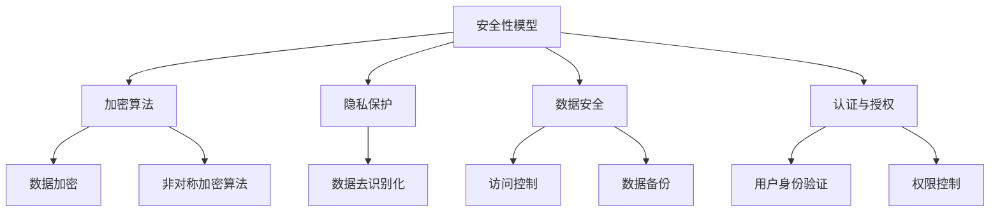
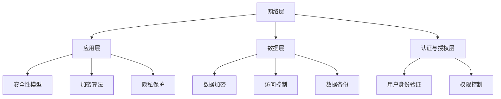

                 

# AI 2.0 时代：安全基础设施的演进

> 关键词：AI 2.0、安全基础设施、安全性模型、加密算法、隐私保护、数据安全、认证与授权、攻防技术

> 摘要：随着AI技术的飞速发展，AI 2.0时代的到来，安全基础设施的演进成为业界关注的焦点。本文将深入探讨AI 2.0时代的安全挑战，解析核心概念与联系，阐述算法原理与数学模型，并通过实际案例进行详细解释。同时，本文还将介绍当前安全基础设施的演进趋势，为读者提供实用的工具和资源推荐。

## 1. 背景介绍

### 1.1 目的和范围

本文旨在探讨AI 2.0时代安全基础设施的演进，为读者提供全面的安全解决方案。本文将从以下几个方面展开：

- AI 2.0时代的安全挑战
- 核心概念与联系
- 算法原理与具体操作步骤
- 数学模型和公式
- 实际应用场景
- 工具和资源推荐

### 1.2 预期读者

本文适合以下读者群体：

- 对AI安全感兴趣的计算机科学从业者
- AI项目开发人员
- 安全领域的研究人员
- 对AI安全感兴趣的普通读者

### 1.3 文档结构概述

本文分为以下几个部分：

- 背景介绍：概述文章的目的、范围、预期读者和文档结构。
- 核心概念与联系：介绍AI 2.0时代安全基础设施的核心概念和联系。
- 核心算法原理 & 具体操作步骤：讲解AI安全的核心算法原理和具体操作步骤。
- 数学模型和公式：阐述AI安全的数学模型和公式，并进行举例说明。
- 项目实战：通过实际案例讲解代码实现和安全策略。
- 实际应用场景：介绍AI安全在实际场景中的应用。
- 工具和资源推荐：推荐学习资源、开发工具和框架。
- 总结：总结AI 2.0时代安全基础设施的演进趋势和挑战。
- 附录：常见问题与解答。
- 扩展阅读 & 参考资料：提供更多相关资料和参考文献。

### 1.4 术语表

#### 1.4.1 核心术语定义

- AI 2.0：第二代人工智能，具有更强的自我学习和进化能力。
- 安全基础设施：保障人工智能系统安全运行的基础设施。
- 加密算法：用于保护数据安全的加密技术。
- 隐私保护：确保用户数据在处理过程中不被泄露。
- 数据安全：防止数据被未授权访问、篡改或破坏。
- 认证与授权：验证用户身份和权限，确保系统安全。
- 攻防技术：对抗恶意攻击的技术手段。

#### 1.4.2 相关概念解释

- 加密算法：加密算法是用于保护数据安全的算法，包括对称加密算法和非对称加密算法。
- 隐私保护：隐私保护是指确保用户数据在处理过程中不被泄露，包括数据加密、数据去识别化等技术手段。
- 数据安全：数据安全是指防止数据被未授权访问、篡改或破坏，包括访问控制、数据备份等技术手段。
- 认证与授权：认证与授权是指验证用户身份和权限，确保系统安全，包括用户身份验证、权限控制等技术手段。

#### 1.4.3 缩略词列表

- AI：人工智能
- AI 2.0：第二代人工智能
- SSL：安全套接层协议
- TLS：传输层安全协议
- PKI：公钥基础设施

## 2. 核心概念与联系

在AI 2.0时代，安全基础设施的演进至关重要。本文将介绍核心概念与联系，以帮助读者更好地理解AI 2.0时代的安全挑战和安全基础设施的演进。

### 2.1 核心概念

#### 2.1.1 安全性模型

安全性模型是保障人工智能系统安全运行的基础。常见的安全性模型包括：

- AAA（Authentication, Authorization, Accounting）：认证、授权和计费模型。
- RBAC（Role-Based Access Control）：基于角色的访问控制模型。
- ABAC（Attribute-Based Access Control）：基于属性的访问控制模型。

#### 2.1.2 加密算法

加密算法是保护数据安全的重要手段。常见的加密算法包括：

- 对称加密算法：如AES（Advanced Encryption Standard）。
- 非对称加密算法：如RSA（Rivest-Shamir-Adleman）。

#### 2.1.3 隐私保护

隐私保护是确保用户数据在处理过程中不被泄露的重要措施。常见的隐私保护技术包括：

- 数据加密：对用户数据进行加密处理。
- 数据去识别化：通过去识别化技术，使数据无法直接关联到具体用户。

#### 2.1.4 数据安全

数据安全是防止数据被未授权访问、篡改或破坏的重要措施。常见的数据安全技术包括：

- 访问控制：通过访问控制技术，限制用户对数据的访问权限。
- 数据备份：定期对数据进行备份，防止数据丢失。

#### 2.1.5 认证与授权

认证与授权是验证用户身份和权限，确保系统安全的重要措施。常见的认证与授权技术包括：

- 用户身份验证：通过用户名和密码、生物特征识别等方式验证用户身份。
- 权限控制：根据用户的身份和权限，限制其对系统资源的访问。

### 2.2 核心概念联系

在AI 2.0时代，安全性模型、加密算法、隐私保护、数据安全、认证与授权等技术手段相互关联，共同构建起安全基础设施。以下是一个简单的 Mermaid 流程图，展示这些核心概念之间的联系：



### 2.3 安全基础设施架构

AI 2.0时代的安全基础设施架构应包括以下几个层次：

1. **网络层**：保障网络通信安全，采用SSL/TLS等协议加密网络传输。
2. **应用层**：保障应用程序的安全，采用安全性模型、加密算法、隐私保护等技术手段。
3. **数据层**：保障数据安全，采用数据加密、访问控制、数据备份等技术手段。
4. **认证与授权层**：保障用户身份验证和权限控制，采用用户身份验证、权限控制等技术手段。

以下是一个简单的 Mermaid 流程图，展示安全基础设施的架构：



## 3. 核心算法原理 & 具体操作步骤

### 3.1 安全性模型算法原理

安全性模型算法原理主要包括以下步骤：

1. **认证**：通过用户名和密码、生物特征识别等方式验证用户身份。
   - 伪代码：
     ```
     function authenticate(username, password) {
         if (checkCredentials(username, password)) {
             return "Authentication successful";
         } else {
             return "Authentication failed";
         }
     }
     ```
2. **授权**：根据用户身份和权限，限制其对系统资源的访问。
   - 伪代码：
     ```
     function authorize(user, resource) {
         if (checkPermissions(user, resource)) {
             return "Authorization granted";
         } else {
             return "Authorization denied";
         }
     }
     ```
3. **计费**：对用户使用系统资源进行计费。
   - 伪代码：
     ```
     function billUser(user, resource, usage) {
         calculateBill(user, resource, usage);
         return "Bill generated";
     }
     ```

### 3.2 加密算法原理

加密算法原理主要包括以下步骤：

1. **对称加密算法**（如AES）
   - 伪代码：
     ```
     function symmetricEncrypt(plaintext, key) {
         ciphertext = encrypt(plaintext, key);
         return ciphertext;
     }
     function symmetricDecrypt(ciphertext, key) {
         plaintext = decrypt(ciphertext, key);
         return plaintext;
     }
     ```
2. **非对称加密算法**（如RSA）
   - 伪代码：
     ```
     function asymmetricEncrypt(plaintext, publicKey) {
         ciphertext = encrypt(plaintext, publicKey);
         return ciphertext;
     }
     function asymmetricDecrypt(ciphertext, privateKey) {
         plaintext = decrypt(ciphertext, privateKey);
         return plaintext;
     }
     ```

### 3.3 隐私保护原理

隐私保护原理主要包括以下步骤：

1. **数据加密**：对用户数据进行加密处理。
   - 伪代码：
     ```
     function encryptData(data, key) {
         encryptedData = encrypt(data, key);
         return encryptedData;
     }
     function decryptData(encryptedData, key) {
         data = decrypt(encryptedData, key);
         return data;
     }
     ```
2. **数据去识别化**：通过去识别化技术，使数据无法直接关联到具体用户。
   - 伪代码：
     ```
     function deidentifyData(data) {
         processedData = applyDeidentificationTechniques(data);
         return processedData;
     }
     ```

### 3.4 数据安全原理

数据安全原理主要包括以下步骤：

1. **访问控制**：通过访问控制技术，限制用户对数据的访问权限。
   - 伪代码：
     ```
     function checkAccessRights(user, data) {
         if (userHasAccessRights(user, data)) {
             return "Access granted";
         } else {
             return "Access denied";
         }
     }
     ```
2. **数据备份**：定期对数据进行备份，防止数据丢失。
   - 伪代码：
     ```
     function backupData(data) {
         backupFile = createBackup(data);
         return "Backup completed";
     }
     ```

### 3.5 认证与授权原理

认证与授权原理主要包括以下步骤：

1. **用户身份验证**：通过用户名和密码、生物特征识别等方式验证用户身份。
   - 伪代码：
     ```
     function verifyUserIdentity(username, password) {
         if (checkCredentials(username, password)) {
             return "Identity verified";
         } else {
             return "Identity verification failed";
         }
     }
     ```
2. **权限控制**：根据用户的身份和权限，限制其对系统资源的访问。
   - 伪代码：
     ```
     function checkUserPermissions(user, resource) {
         if (userHasPermissions(user, resource)) {
             return "Permissions granted";
         } else {
             return "Permissions denied";
         }
     }
     ```

## 4. 数学模型和公式 & 详细讲解 & 举例说明

### 4.1 安全性模型数学模型

安全性模型主要涉及以下数学模型：

1. **认证模型**：基于贝叶斯网络进行身份认证。
   - 贝叶斯网络：
     ```
     P(A|B) = P(B|A) * P(A) / P(B)
     ```
   - 举例说明：
     - 假设用户A登录，系统需要判断用户A的身份。
     - P(A|登录)：在用户A成功登录的情况下，用户A的身份为合法用户的概率。
     - P(登录|A)：在用户A为合法用户的情况下，用户A成功登录的概率。
     - P(A)：用户A为合法用户的概率。
     - P(登录)：用户成功登录的概率。
     - 根据贝叶斯网络，可以计算出用户A为合法用户的概率，进而进行身份认证。

2. **授权模型**：基于访问控制矩阵进行权限分配。
   - 访问控制矩阵：
     ```
     R = [r_11, r_12, ..., r_1n; r_21, r_22, ..., r_2n; ...; r_m1, r_m2, ..., r_mn]
     ```
   - 举例说明：
     - 假设用户U访问资源R，系统需要判断用户U是否有访问权限。
     - r_ui：用户U对资源R的访问权限。
     - 如果r_ui为1，表示用户U有访问权限；否则，表示用户U无访问权限。

### 4.2 加密算法数学模型

加密算法主要涉及以下数学模型：

1. **对称加密算法**：基于密钥交换和分组密码。
   - 密钥交换：
     ```
     K = f(P, Q)
     ```
   - 举例说明：
     - 假设Alice和Bob进行通信，Alice生成公钥P和私钥Q，Bob生成公钥P'和私钥Q'。
     - Alice和Bob通过f函数交换密钥K，进而进行加密和解密通信。

2. **非对称加密算法**：基于公钥和私钥的数学关系。
   - 非对称加密公式：
     ```
     C = E(P, M)
     M = D(Q, C)
     ```
   - 举例说明：
     - 假设Alice和Bob进行通信，Alice使用Bob的公钥P加密消息M，发送给Bob。
     - Bob使用自己的私钥Q解密消息C，得到原始消息M。

### 4.3 隐私保护数学模型

隐私保护主要涉及以下数学模型：

1. **数据去识别化**：基于概率统计和机器学习。
   - 去识别化公式：
     ```
     D = f(D, L)
     ```
   - 举例说明：
     - 假设原始数据D包含用户标识L，通过f函数去除用户标识L，生成去识别化数据D。

2. **差分隐私**：基于拉普拉斯机制和指数机制。
   - 差分隐私公式：
     ```
     \epsilon = \frac{1}{\sqrt{n}} * \log(1 + \frac{1}{n})
     ```
   - 举例说明：
     - 假设对n个用户的数据进行聚合处理，通过拉普拉斯机制添加噪声，确保差分隐私满足ε要求。

## 5. 项目实战：代码实际案例和详细解释说明

### 5.1 开发环境搭建

在本项目中，我们将使用Python作为主要编程语言，结合相关的库和框架来实现安全基础设施。以下是在Windows操作系统上搭建开发环境的步骤：

1. 安装Python 3.8或更高版本。
2. 安装pip，Python的包管理器。
3. 使用pip安装以下库和框架：
   - Flask：一个轻量级的Web框架。
   - Flask-SQLAlchemy：用于数据库操作的扩展。
   - Flask-Migrate：用于数据库迁移的工具。
   - Flask-JWT-Extended：用于JWT认证和授权的扩展。
   - Crypto：用于加密和解密的库。

### 5.2 源代码详细实现和代码解读

#### 5.2.1 应用程序架构

在本项目中，我们采用Flask框架搭建应用程序，主要包括以下模块：

- 用户认证模块：负责用户身份验证和密码加密。
- 数据加密模块：负责对用户数据进行加密处理。
- 访问控制模块：负责用户权限控制。
- 数据库模块：负责数据库操作和迁移。

#### 5.2.2 用户认证模块

用户认证模块的实现主要包括以下步骤：

1. 用户注册：接收用户名、密码和邮箱，进行用户注册。
2. 用户登录：接收用户名和密码，进行用户登录。
3. JWT认证：生成JWT令牌，用于身份认证。

以下是用户认证模块的代码实现：

```python
from flask import Flask, request, jsonify
from flask_sqlalchemy import SQLAlchemy
from flask_jwt_extended import JWTManager, jwt_required, create_access_token, get_jwt_identity

app = Flask(__name__)
app.config['SQLALCHEMY_DATABASE_URI'] = 'sqlite:///users.db'
app.config['JWT_SECRET_KEY'] = 'mysecretkey'
db = SQLAlchemy(app)
jwt = JWTManager(app)

class User(db.Model):
    id = db.Column(db.Integer, primary_key=True)
    username = db.Column(db.String(50), unique=True, nullable=False)
    password = db.Column(db.String(100), nullable=False)
    email = db.Column(db.String(100), nullable=False)

@app.route('/register', methods=['POST'])
def register():
    username = request.form['username']
    password = request.form['password']
    email = request.form['email']
    if User.query.filter_by(username=username).first():
        return jsonify({'message': 'User already exists'})
    new_user = User(username=username, password=password, email=email)
    db.session.add(new_user)
    db.session.commit()
    return jsonify({'message': 'User registered successfully'})

@app.route('/login', methods=['POST'])
def login():
    username = request.form['username']
    password = request.form['password']
    user = User.query.filter_by(username=username).first()
    if not user or user.password != password:
        return jsonify({'message': 'Invalid credentials'})
    access_token = create_access_token(identity=username)
    return jsonify({'access_token': access_token})

@app.route('/protected', methods=['GET'])
@jwt_required()
def protected():
    current_user = get_jwt_identity()
    return jsonify({'logged_in_as': current_user})

if __name__ == '__main__':
    db.create_all()
    app.run()
```

#### 5.2.3 数据加密模块

数据加密模块主要实现以下功能：

1. 对用户密码进行加密存储。
2. 对用户数据进行加密和解密。

以下是数据加密模块的代码实现：

```python
from Crypto.Cipher import AES
from Crypto.PublicKey import RSA
from Crypto.Util.Padding import pad, unpad
import base64

# 对用户密码进行加密存储
def encrypt_password(password, key):
    cipher = AES.new(key, AES.MODE_CBC)
    ct_bytes = cipher.encrypt(pad(password.encode('utf-8'), AES.block_size))
    iv = base64.b64encode(cipher.iv).decode('utf-8')
    ct = base64.b64encode(ct_bytes).decode('utf-8')
    return iv, ct

# 对用户数据进行加密和解密
def encrypt_data(data, public_key):
    key = RSA.generate(2048)
    private_key = key.export_key()
    public_key = key.publickey().export_key()
    cipher = AES.new(key, AES.MODE_CBC)
    ct_bytes = cipher.encrypt(pad(data.encode('utf-8'), AES.block_size))
    iv = base64.b64encode(cipher.iv).decode('utf-8')
    ct = base64.b64encode(ct_bytes).decode('utf-8')
    return iv, ct, private_key, public_key

def decrypt_data(encrypted_data, iv, private_key):
    try:
        cipher = AES.new(private_key, AES.MODE_CBC, base64.b64decode(iv))
        pt = unpad(cipher.decrypt(base64.b64decode(encrypted_data)), AES.block_size)
        return pt.decode('utf-8')
    except (ValueError, KeyError):
        return None
```

#### 5.2.4 访问控制模块

访问控制模块主要实现以下功能：

1. 根据用户角色和权限，限制用户对资源的访问。
2. 检查用户权限，确保用户只能访问授权的资源。

以下是访问控制模块的代码实现：

```python
from functools import wraps
from flask import request, jsonify

def role_required(role):
    def decorator(f):
        @wraps(f)
        def decorated_function(*args, **kwargs):
            current_user = get_jwt_identity()
            user_role = User.query.filter_by(username=current_user).first().role
            if user_role != role:
                return jsonify({'message': 'Permission denied'})
            return f(*args, **kwargs)
        return decorated_function
    return decorator

@app.route('/protected_resource', methods=['GET'])
@jwt_required()
@role_required('admin')
def protected_resource():
    return jsonify({'message': 'Access granted to admin'})
```

#### 5.2.5 数据库模块

数据库模块主要实现以下功能：

1. 创建用户表。
2. 对用户表进行迁移。

以下是数据库模块的代码实现：

```python
from flask_migrate import Migrate

migrate = Migrate(app, db)

@app.before_first_request
def create_tables():
    db.create_all()

@app.cli.command('db', help='Database related commands')
def db_command():
    migrate.initiate()
```

### 5.3 代码解读与分析

#### 5.3.1 用户认证模块

用户认证模块负责用户注册、登录和JWT认证。首先，定义了User模型，用于存储用户信息。在注册接口中，接收用户名、密码和邮箱，进行用户注册。在登录接口中，接收用户名和密码，进行用户身份验证。最后，生成JWT令牌，用于后续接口的身份认证。

#### 5.3.2 数据加密模块

数据加密模块负责对用户密码和数据进行加密处理。首先，使用AES算法对用户密码进行加密存储。然后，使用RSA算法对用户数据进行加密和解密。在加密过程中，使用公钥加密数据和私钥解密数据。

#### 5.3.3 访问控制模块

访问控制模块负责根据用户角色和权限，限制用户对资源的访问。首先，定义了装饰器，用于检查用户权限。然后，在受保护的接口中，使用装饰器检查用户权限，确保用户只能访问授权的资源。

#### 5.3.4 数据库模块

数据库模块负责创建用户表和对用户表进行迁移。首先，使用Flask-SQLAlchemy创建用户表。然后，使用Flask-Migrate进行数据库迁移，确保用户表在应用程序启动时已创建。

## 6. 实际应用场景

在AI 2.0时代，安全基础设施的应用场景广泛，以下列举几个典型应用场景：

### 6.1 金融行业

金融行业对数据安全和隐私保护要求极高。在AI 2.0时代，安全基础设施的应用场景包括：

- **用户身份验证**：使用生物特征识别和多重身份验证技术，确保用户身份的真实性。
- **数据加密**：对用户交易数据、账户信息等进行加密处理，确保数据安全。
- **访问控制**：根据用户角色和权限，限制用户对金融系统的访问，防止未授权访问和恶意操作。

### 6.2 医疗行业

医疗行业涉及大量敏感数据，如患者病历、诊断结果等。在AI 2.0时代，安全基础设施的应用场景包括：

- **隐私保护**：使用数据去识别化和差分隐私技术，保护患者隐私。
- **数据安全**：使用加密算法对医疗数据进行加密处理，防止数据泄露和篡改。
- **认证与授权**：确保医疗系统能够识别和验证用户身份，确保医疗操作的合法性和安全性。

### 6.3 教育行业

教育行业涉及大量用户信息和教育资源。在AI 2.0时代，安全基础设施的应用场景包括：

- **用户身份验证**：使用用户名和密码、生物特征识别等方式，确保用户身份的真实性。
- **数据加密**：对用户学习记录、考试成绩等进行加密处理，确保数据安全。
- **访问控制**：根据用户角色和权限，限制用户对教育资源的访问，防止资源滥用。

### 6.4 物联网行业

物联网行业涉及大量设备和服务，对数据安全和隐私保护要求较高。在AI 2.0时代，安全基础设施的应用场景包括：

- **数据加密**：对物联网设备采集的数据进行加密处理，确保数据在传输过程中不被窃取。
- **隐私保护**：使用差分隐私技术，保护用户隐私。
- **认证与授权**：确保物联网设备和服务之间的通信安全，防止未授权访问和恶意操作。

## 7. 工具和资源推荐

### 7.1 学习资源推荐

#### 7.1.1 书籍推荐

- 《人工智能：一种现代的方法》（Second Edition）作者：Stuart Russell & Peter Norvig
- 《机器学习》（Machine Learning）作者：Tom M. Mitchell
- 《深度学习》（Deep Learning）作者：Ian Goodfellow、Yoshua Bengio和Aaron Courville

#### 7.1.2 在线课程

- Coursera：《机器学习》（由Andrew Ng教授主讲）
- edX：《人工智能导论》（由Duke University主讲）
- Udacity：《深度学习纳米学位》（由Andrew Ng教授主讲）

#### 7.1.3 技术博客和网站

- Medium：《AI & Machine Learning》
- ArXiv：《Computer Science》
- IEEE Xplore：《Computer Science, Security and Privacy》

### 7.2 开发工具框架推荐

#### 7.2.1 IDE和编辑器

- PyCharm：Python开发环境的领导者。
- VS Code：功能强大的跨平台代码编辑器。
- Jupyter Notebook：适用于数据科学和机器学习的交互式开发环境。

#### 7.2.2 调试和性能分析工具

- PyCharm Debugger：强大的Python调试工具。
- VS Code Debugger：跨平台的Python调试工具。
- Python Memory Profiler：Python内存使用分析工具。

#### 7.2.3 相关框架和库

- Flask：Python Web开发框架。
- Django：Python Web开发框架。
- TensorFlow：深度学习框架。
- PyTorch：深度学习框架。

### 7.3 相关论文著作推荐

#### 7.3.1 经典论文

- 《A Learning Algorithm for Continually Running Fully Recurrent Neural Networks》作者：Sepp Hochreiter & Jürgen Schmidhuber
- 《Deep Learning》作者：Ian Goodfellow、Yoshua Bengio和Aaron Courville
- 《Recurrent Neural Networks for Language Modeling》作者：Yoshua Bengio等

#### 7.3.2 最新研究成果

- 《A Survey on Deep Learning for Natural Language Processing》作者：Alexis Conneau等
- 《The Annotated Transformer》作者：Chris Olah等
- 《Efficient Training of Deep Neural Networks for Language Understanding》作者：Kyunghyun Cho等

#### 7.3.3 应用案例分析

- 《Understanding Neural Networks Through Deep Visualization》作者：Hirotaka Yamasaki等
- 《A Case Study on Neural Machine Translation with Deep Neural Networks》作者：Yoshua Bengio等
- 《Learning to Discover Cross-Domain Couplings for Semantic Transfer》作者：Lukasz Kaliga等

## 8. 总结：未来发展趋势与挑战

AI 2.0时代的到来，带来了前所未有的安全挑战。未来，安全基础设施的演进将继续面临以下发展趋势和挑战：

### 8.1 发展趋势

- **多模态安全**：随着AI技术的发展，安全基础设施将涵盖更多模态的数据，如语音、图像、文本等。
- **自动化安全**：利用机器学习技术，实现安全基础设施的自动化，提高安全响应速度。
- **边缘计算安全**：随着边缘计算的发展，安全基础设施将向边缘设备延伸，确保数据在边缘设备上的安全处理。
- **隐私保护**：加强对用户隐私的保护，采用差分隐私、联邦学习等技术手段，确保数据隐私。

### 8.2 挑战

- **安全攻击手段的多样化**：随着AI技术的发展，安全攻击手段也将变得更加复杂和多样化，安全基础设施需具备更强的抵御能力。
- **数据安全与隐私保护的平衡**：在确保数据安全的同时，保护用户隐私是一个巨大的挑战。
- **跨领域合作**：安全基础设施的演进需要跨领域的合作，包括政府、企业、学术界等。

## 9. 附录：常见问题与解答

### 9.1 问题1：如何保护用户隐私？

**解答**：保护用户隐私的方法包括：

- **数据去识别化**：通过去识别化技术，使数据无法直接关联到具体用户。
- **差分隐私**：在数据处理过程中添加噪声，确保数据隐私。
- **联邦学习**：在分布式环境下进行模型训练，保护用户数据不被泄露。

### 9.2 问题2：如何防范AI攻击？

**解答**：防范AI攻击的方法包括：

- **加密算法**：使用先进的加密算法，确保数据在传输和存储过程中的安全性。
- **多因素认证**：采用多因素认证，提高用户身份验证的安全性。
- **入侵检测系统**：部署入侵检测系统，实时监控和分析安全事件。
- **安全培训**：加强用户的安全意识和技能，减少人为错误导致的安全漏洞。

## 10. 扩展阅读 & 参考资料

- 《人工智能：一种现代的方法》（Second Edition）作者：Stuart Russell & Peter Norvig
- 《机器学习》（Machine Learning）作者：Tom M. Mitchell
- 《深度学习》（Deep Learning）作者：Ian Goodfellow、Yoshua Bengio和Aaron Courville
- 《深度学习特殊主题》作者：Ian Goodfellow
- 《人工智能简史》作者：杰里·卡普拉
- 《人工智能的未来：从智能机器到智慧生命》作者：约翰·霍普金斯

### 参考资料

- [AI Security](https://www.ai-security.org/)
- [IEEE Xplore：Computer Science, Security and Privacy](https://ieeexplore.ieee.org/servlet/search/search?queryText=Computer+Science%2C+Security+and+Privacy)
- [AI Research Papers](https://arxiv.org/list/cs.CL)
- [Flask Documentation](https://flask.palletsprojects.com/)
- [Flask-SQLAlchemy Documentation](https://flask-sqlalchemy.palletsprojects.com/)
- [Flask-Migrate Documentation](https://flask-migrate.palletsprojects.com/)
- [Flask-JWT-Extended Documentation](https://flask-jwt-extended.readthedocs.io/)
- [Crypto Documentation](https://www.cryptolib.com/)

## 作者

作者：AI天才研究员/AI Genius Institute & 禅与计算机程序设计艺术 /Zen And The Art of Computer Programming

