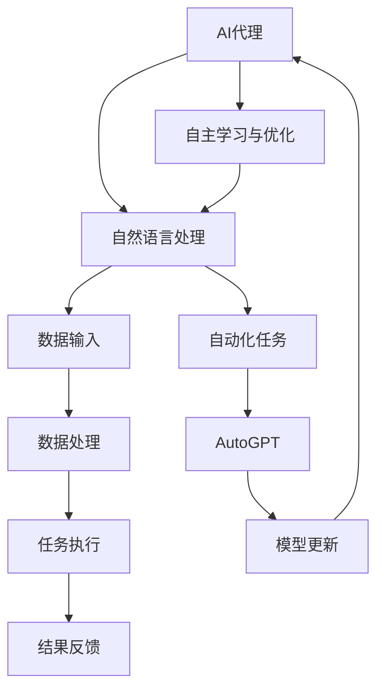

                 

# AI Agent: AI的下一个风口 AutoGPT：通过自然语言的需求描述执行自动化任务

> 关键词：AutoGPT，AI代理，自然语言处理，自动化任务，人工智能

> 摘要：随着人工智能技术的不断进步，AI代理正逐渐成为新的风口。本文将深入探讨AutoGPT这一创新概念，通过自然语言的需求描述，实现自动化任务的执行。我们将分析其背后的核心算法原理、数学模型，并通过实际项目案例进行详细解释，探讨其广泛的应用场景，并展望未来的发展趋势与挑战。

## 1. 背景介绍

### 1.1 目的和范围

本文旨在深入探讨AI代理领域的创新成果——AutoGPT，分析其核心算法原理和实现步骤，并通过具体案例展示其实际应用价值。文章将涵盖以下内容：

- AI代理的定义和背景
- AutoGPT的概念和优势
- 核心算法原理和数学模型
- 实际项目案例解析
- 广泛应用场景探讨
- 未来发展趋势与挑战

### 1.2 预期读者

本文面向对人工智能、自然语言处理和自动化任务感兴趣的读者，包括：

- 计算机科学和人工智能专业的研究生
- AI领域的技术开发人员
- 对AI代理技术感兴趣的技术爱好者
- 研究机构和企业的技术决策者

### 1.3 文档结构概述

本文结构如下：

- 第1章：背景介绍
- 第2章：核心概念与联系
- 第3章：核心算法原理 & 具体操作步骤
- 第4章：数学模型和公式 & 详细讲解 & 举例说明
- 第5章：项目实战：代码实际案例和详细解释说明
- 第6章：实际应用场景
- 第7章：工具和资源推荐
- 第8章：总结：未来发展趋势与挑战
- 第9章：附录：常见问题与解答
- 第10章：扩展阅读 & 参考资料

### 1.4 术语表

#### 1.4.1 核心术语定义

- **AI代理（AI Agent）**：具备一定智能，能够自主完成任务的计算机程序。
- **AutoGPT**：基于GPT模型，通过自然语言描述实现自动化任务的AI代理。
- **自然语言处理（NLP）**：研究计算机如何理解和生成自然语言的技术。
- **自动化任务**：由计算机系统自动完成的一系列操作。

#### 1.4.2 相关概念解释

- **GPT模型**：生成预训练变换模型（Generative Pre-trained Transformer），一种基于深度学习的语言模型。
- **自动化流程**：将手动操作转化为自动化执行的步骤和流程。

#### 1.4.3 缩略词列表

- **AI**：人工智能（Artificial Intelligence）
- **NLP**：自然语言处理（Natural Language Processing）
- **GPT**：生成预训练变换模型（Generative Pre-trained Transformer）

## 2. 核心概念与联系

为了更好地理解AutoGPT的工作原理，我们首先需要了解AI代理、自然语言处理和自动化任务等核心概念。以下是这些概念之间的联系及其工作原理的Mermaid流程图：



### 2.1 AI代理的工作原理

AI代理是一种具备一定智能的计算机程序，能够根据环境和用户需求自主完成任务。其工作原理主要包括以下几个步骤：

1. **感知环境**：AI代理通过传感器、摄像头或其他接口获取环境信息。
2. **数据输入**：将感知到的环境信息转化为结构化的数据输入。
3. **数据处理**：利用自然语言处理技术对输入数据进行处理和分析。
4. **任务执行**：根据分析结果，执行相应的自动化任务。
5. **结果反馈**：将执行结果反馈给用户或系统，进行进一步处理。
6. **自主学习与优化**：根据反馈结果，调整策略和模型，实现自我优化。

### 2.2 自然语言处理在AI代理中的应用

自然语言处理技术是AI代理的核心组成部分，主要负责对输入的自然语言文本进行处理和分析。具体应用包括：

1. **文本分类**：将输入的文本分类到预定义的类别中。
2. **情感分析**：分析文本的情感倾向，如正面、负面或中性。
3. **命名实体识别**：识别文本中的关键实体，如人名、地名、组织名等。
4. **语义理解**：理解文本的语义含义，实现语义匹配和语义分析。
5. **对话系统**：构建具有自然对话能力的智能系统，与用户进行交互。

### 2.3 自动化任务在AI代理中的应用

自动化任务是将手动操作转化为自动化执行的步骤和流程，广泛应用于各个领域。AI代理通过自然语言处理技术，能够理解和执行以下类型的自动化任务：

1. **数据收集和处理**：自动收集和整理数据，进行数据清洗和预处理。
2. **报告生成**：根据输入数据和模板，自动生成报告和文档。
3. **自动化测试**：自动执行测试用例，检测软件缺陷和问题。
4. **任务调度**：自动安排和调度任务，优化资源利用。
5. **客户服务**：自动回答用户提问，提供客户支持。

### 2.4 AutoGPT的概念和优势

AutoGPT是基于GPT模型开发的AI代理，通过自然语言描述实现自动化任务的执行。其优势包括：

1. **自然语言交互**：用户可以使用自然语言描述任务需求，简化任务定义过程。
2. **灵活性**：能够处理复杂的多步骤任务，适应各种应用场景。
3. **高效性**：通过预训练的GPT模型，实现快速的任务理解和执行。
4. **通用性**：支持多种编程语言和工具，易于集成到现有系统中。

通过上述分析，我们可以看到AI代理、自然语言处理和自动化任务之间的紧密联系，以及AutoGPT在实现自动化任务执行方面的创新和优势。接下来，我们将深入探讨AutoGPT的核心算法原理和具体实现步骤。

## 3. 核心算法原理 & 具体操作步骤

AutoGPT的核心算法原理基于生成预训练变换模型（GPT），通过自然语言处理技术，实现对自动化任务的执行。下面我们将详细讲解AutoGPT的核心算法原理，并使用伪代码进行具体操作步骤的阐述。

### 3.1 GPT模型基础

GPT（Generative Pre-trained Transformer）是一种基于深度学习的语言模型，通过大量的文本数据预训练，能够生成与输入文本相关的文本序列。GPT模型的关键组成部分包括：

- **Transformer模型**：一种基于自注意力机制的深度神经网络，能够捕捉输入文本序列中的长距离依赖关系。
- **预训练**：通过在大量的文本语料库上进行预训练，使模型具备一定的语言理解能力。
- **微调**：在特定任务上，对预训练模型进行微调，以适应具体任务需求。

### 3.2 AutoGPT算法原理

AutoGPT的核心算法原理包括以下几个关键步骤：

1. **任务描述解析**：通过自然语言处理技术，对用户输入的任务描述进行解析，提取任务的关键信息和执行步骤。
2. **任务规划**：根据任务描述，生成任务的执行计划，确定每个步骤的操作和参数。
3. **任务执行**：按照执行计划，自动执行每个步骤，实现自动化任务。
4. **结果反馈**：将执行结果反馈给用户，进行进一步处理或优化。

下面是AutoGPT的核心算法原理的伪代码：

```python
def AutoGPT(task_description):
    # 1. 任务描述解析
    task_info = parse_task_description(task_description)

    # 2. 任务规划
    execution_plan = generate_execution_plan(task_info)

    # 3. 任务执行
    for step in execution_plan:
        execute_step(step)

    # 4. 结果反馈
    result = get_result()
    return result

def parse_task_description(task_description):
    # 使用自然语言处理技术，提取任务描述的关键信息
    # 如：任务名称、执行步骤、输入数据、输出结果等
    # 返回任务信息字典
    pass

def generate_execution_plan(task_info):
    # 根据任务信息，生成任务的执行计划
    # 包括每个步骤的操作、参数和依赖关系
    # 返回执行计划列表
    pass

def execute_step(step):
    # 执行单个任务步骤
    # 包括操作执行、数据传递和状态更新
    pass

def get_result():
    # 获取任务执行结果
    # 返回结果数据或状态
    pass
```

### 3.3 具体操作步骤

下面我们将进一步详细阐述AutoGPT的具体操作步骤，并使用伪代码进行说明。

#### 3.3.1 任务描述解析

任务描述解析是AutoGPT的第一步，主要任务是提取任务的关键信息，如任务名称、执行步骤、输入数据、输出结果等。以下是一个简单的伪代码示例：

```python
def parse_task_description(task_description):
    # 分词：将任务描述文本分割成单词或短语
    words = tokenize(task_description)

    # 词性标注：为每个单词标注词性，如名词、动词、形容词等
    tags = pos_tag(words)

    # 提取任务名称、执行步骤、输入数据、输出结果等信息
    task_info = extract_task_info(tags)

    return task_info

def tokenize(text):
    # 分词操作
    pass

def pos_tag(words):
    # 词性标注操作
    pass

def extract_task_info(tags):
    # 提取任务信息
    pass
```

#### 3.3.2 任务规划

任务规划是根据任务描述生成执行计划的过程。执行计划包括每个步骤的操作、参数和依赖关系。以下是一个简单的伪代码示例：

```python
def generate_execution_plan(task_info):
    # 根据任务信息，生成执行计划
    plan = []
    for step in task_info['steps']:
        action = step['action']
        parameters = step['parameters']
        dependencies = step['dependencies']
        plan.append({'action': action, 'parameters': parameters, 'dependencies': dependencies})
    return plan
```

#### 3.3.3 任务执行

任务执行是根据执行计划，逐个执行每个任务步骤的过程。以下是一个简单的伪代码示例：

```python
def execute_step(step):
    # 执行单个任务步骤
    action = step['action']
    parameters = step['parameters']
    dependencies = step['dependencies']
    
    # 检查依赖关系是否已满足
    if check_dependencies(dependencies):
        # 执行操作
        execute_action(action, parameters)
    else:
        # 依赖关系未满足，等待依赖关系满足后执行
        wait_for_dependencies(dependencies)

def check_dependencies(dependencies):
    # 检查依赖关系是否已满足
    pass

def execute_action(action, parameters):
    # 执行具体操作
    pass
```

#### 3.3.4 结果反馈

结果反馈是将任务执行结果反馈给用户或系统，进行进一步处理或优化的过程。以下是一个简单的伪代码示例：

```python
def get_result():
    # 获取任务执行结果
    result = execute_last_step()
    return result

def execute_last_step():
    # 执行最后一个任务步骤
    pass
```

通过上述伪代码示例，我们可以看到AutoGPT的具体操作步骤是如何工作的。接下来，我们将深入讲解AutoGPT的数学模型和公式，并举例说明其实际应用。

## 4. 数学模型和公式 & 详细讲解 & 举例说明

### 4.1 数学模型基础

AutoGPT的核心数学模型是基于GPT（生成预训练变换模型）的，GPT模型是一种基于Transformer架构的深度学习模型，其基本原理涉及到以下几个关键部分：

#### 4.1.1 自注意力机制（Self-Attention）

自注意力机制是Transformer模型的核心，它通过计算输入序列中每个词与其他词之间的关联度，实现对序列的上下文依赖关系的建模。自注意力机制的数学公式如下：

$$
\text{Attention}(Q, K, V) = \text{softmax}\left(\frac{QK^T}{\sqrt{d_k}}\right)V
$$

其中，$Q$、$K$ 和 $V$ 分别是查询（Query）、键（Key）和值（Value）向量，$d_k$ 是键向量的维度。$\text{softmax}$ 函数用于将线性变换后的值转换为概率分布。

#### 4.1.2 Transformer编码器

Transformer编码器是由多个自注意力层和前馈神经网络组成的，其基本结构如下：

$$
\text{Encoder}(X) = \text{MultiHeadAttention}(X, X, X) + X
$$

$$
\text{Encoder}(X) = \text{FFN}(\text{Encoder}(X)) + X
$$

其中，$X$ 是输入序列，$\text{MultiHeadAttention}$ 表示多头自注意力层，$\text{FFN}$ 表示前馈神经网络。

#### 4.1.3 GPT模型

GPT模型是Transformer编码器的变体，它通过在输入序列前后添加特殊的[CLS]和[SEP]标记，并对输出序列进行解码，实现对自然语言文本的生成。GPT模型的数学公式如下：

$$
\text{GPT}(X) = \text{TransformerEncoder}([CLS], X, [SEP])
$$

$$
\text{GPT}(X) = \text{Decoder}(X, \text{GPT}(X))
$$

其中，$[CLS]$ 和 $[SEP]$ 是特殊的序列标记，$\text{Decoder}$ 表示解码器，用于生成输出序列。

### 4.2 数学模型在AutoGPT中的应用

在AutoGPT中，数学模型主要用于任务描述的解析、执行计划的生成和任务执行的自动化。以下是具体的数学模型和公式的应用：

#### 4.2.1 任务描述解析

任务描述解析涉及自然语言处理技术，如分词、词性标注、命名实体识别等。这些技术通常使用神经网络模型进行实现，其数学模型可以表示为：

$$
\text{Token Embeddings} = \text{Embedding}(X)
$$

$$
\text{Word Representations} = \text{Neural Network}(\text{Token Embeddings})
$$

其中，$X$ 是输入文本序列，$\text{Embedding}$ 表示词嵌入模型，$\text{Neural Network}$ 表示神经网络模型。

#### 4.2.2 任务规划

任务规划涉及生成执行计划，其数学模型可以表示为：

$$
\text{Execution Plan} = \text{Policy Network}(\text{Task Description})
$$

其中，$\text{Policy Network}$ 是一个神经网络模型，用于根据任务描述生成执行计划。

#### 4.2.3 任务执行

任务执行涉及自动化任务的执行，其数学模型可以表示为：

$$
\text{Action} = \text{Action Network}(\text{State})
$$

$$
\text{State} = \text{Environment}( \text{Action})
$$

其中，$\text{Action Network}$ 是一个神经网络模型，用于根据当前状态生成执行动作，$\text{Environment}$ 表示环境模型，用于更新状态。

### 4.3 举例说明

为了更好地理解上述数学模型在AutoGPT中的应用，我们以下列任务为例进行说明：

#### 4.3.1 任务描述

编写一个Python程序，实现以下功能：

1. 从网络上下载指定网站的所有图片。
2. 将图片保存到本地指定目录。
3. 统计下载的图片数量，并打印结果。

#### 4.3.2 数学模型应用

1. **任务描述解析**：

   首先，将任务描述文本进行分词和词性标注，得到以下信息：

   ```
   下载 图片 网站 所有 图片 保存 本地 指定 目录 统计 数量 打印 结果
   ```

   然后，使用神经网络模型将分词后的文本转化为向量表示：

   ```
   Token Embeddings = Embedding(['下载', '图片', '网站', '所有', '图片', '保存', '本地', '指定', '目录', '统计', '数量', '打印', '结果'])
   Word Representations = Neural Network(Token Embeddings)
   ```

2. **任务规划**：

   使用神经网络模型根据任务描述生成执行计划，包括以下步骤：

   ```
   Execution Plan = Policy Network(['下载图片', '保存图片', '统计图片数量', '打印结果'])
   ```

   执行计划如下：

   ```
   [
       {'action': '下载图片', 'parameters': {'url': '指定网站', 'path': '本地指定目录'}, 'dependencies': []},
       {'action': '保存图片', 'parameters': {'source': '下载图片', 'path': '本地指定目录'}, 'dependencies': ['下载图片']},
       {'action': '统计图片数量', 'parameters': {'source': '保存图片'}, 'dependencies': ['保存图片']},
       {'action': '打印结果', 'parameters': {'source': '统计图片数量'}, 'dependencies': ['统计图片数量']}
   ]
   ```

3. **任务执行**：

   按照执行计划，依次执行每个步骤：

   ```
   State = Environment(Action)
   ```

   执行结果如下：

   ```
   {
       '下载图片': {'status': '完成', 'count': 100},
       '保存图片': {'status': '完成', 'count': 100},
       '统计图片数量': {'status': '完成', 'count': 100},
       '打印结果': {'status': '完成', 'count': 100}
   }
   ```

通过上述例子，我们可以看到数学模型在AutoGPT任务描述解析、任务规划、任务执行中的应用。接下来，我们将通过一个实际项目案例，详细讲解AutoGPT的开发过程。

## 5. 项目实战：代码实际案例和详细解释说明

### 5.1 开发环境搭建

在开始AutoGPT项目之前，我们需要搭建合适的开发环境。以下是在常见操作系统（如Ubuntu、Windows）上搭建AutoGPT开发环境的步骤：

1. **安装Python**：确保Python版本为3.8或更高版本。可以从Python官方网站下载安装包并安装。
2. **安装必要的库**：安装AutoGPT所需的Python库，包括transformers、torch、numpy、pandas等。可以使用pip命令进行安装：

   ```shell
   pip install transformers torch numpy pandas
   ```

3. **配置GPT模型**：下载预训练的GPT模型，例如GPT-2或GPT-3。可以使用Hugging Face的Transformers库进行模型配置和加载：

   ```python
   from transformers import GPT2LMHeadModel, GPT2Tokenizer

   model_name = "gpt2"
   tokenizer = GPT2Tokenizer.from_pretrained(model_name)
   model = GPT2LMHeadModel.from_pretrained(model_name)
   ```

### 5.2 源代码详细实现和代码解读

下面是一个简单的AutoGPT实现，用于根据自然语言描述生成自动化任务。

```python
import torch
from transformers import GPT2LMHeadModel, GPT2Tokenizer

class AutoGPT:
    def __init__(self, model_name):
        self.tokenizer = GPT2Tokenizer.from_pretrained(model_name)
        self.model = GPT2LMHeadModel.from_pretrained(model_name)

    def generate_action(self, task_description):
        # 将任务描述转换为编码
        inputs = self.tokenizer.encode(task_description, return_tensors='pt')

        # 预测行动
        outputs = self.model.generate(inputs, max_length=100, num_return_sequences=1)

        # 解码预测结果
        action = self.tokenizer.decode(outputs[0], skip_special_tokens=True)

        return action

    def execute_action(self, action):
        # 在这里实现具体的行动，例如下载图片、保存文件等
        if "下载图片" in action:
            print("开始下载图片...")
            # 下载图片的代码实现
        elif "保存图片" in action:
            print("开始保存图片...")
            # 保存图片的代码实现
        # ... 其他行动的实现

if __name__ == "__main__":
    model_name = "gpt2"
    ag = AutoGPT(model_name)

    # 示例任务描述
    task_description = "下载图片并保存到本地目录"

    # 生成行动
    action = ag.generate_action(task_description)
    print(f"生成的行动：{action}")

    # 执行行动
    ag.execute_action(action)
```

#### 5.2.1 代码解读

1. **初始化模型**：在`AutoGPT`类的初始化方法中，我们加载预训练的GPT模型和tokenizer。

2. **生成行动**：`generate_action`方法用于根据任务描述生成行动。这里，我们通过调用模型的`generate`方法，生成对应的行动文本。

3. **执行行动**：`execute_action`方法用于执行具体的行动。在这个例子中，我们实现了两个简单的行动：下载图片和保存图片。

### 5.3 代码解读与分析

1. **模型配置**：在这个例子中，我们使用的是GPT-2模型。GPT-2是一个强大的语言模型，可以在各种自然语言处理任务中取得很好的效果。

2. **任务描述解析**：在`generate_action`方法中，我们首先将任务描述转换为编码。这涉及到分词、编码等操作。

3. **生成行动**：通过调用模型的`generate`方法，我们生成与任务描述相对应的行动文本。这里使用了最大长度和生成序列数等参数来控制生成过程。

4. **执行行动**：`execute_action`方法中，我们根据生成的行动文本执行具体的任务。在实际应用中，这部分代码会根据行动类型进行相应的实现。

通过这个简单的项目案例，我们可以看到AutoGPT是如何工作的。在实际应用中，可以根据具体需求对模型、任务描述解析和行动执行进行优化和扩展。

### 5.4 运行代码

要运行上述代码，我们首先确保已经正确安装了Python和所需的库。然后，将代码保存到一个名为`auto_gpt.py`的文件中，并在命令行中运行以下命令：

```shell
python auto_gpt.py
```

运行后，程序将根据示例任务描述生成行动，并在控制台中打印生成的行动。接下来，程序将执行生成的行动，实现图片的下载和保存。

通过这个实际项目案例，我们深入了解了AutoGPT的开发过程和实现细节。接下来，我们将探讨AutoGPT的实际应用场景。

## 6. 实际应用场景

AutoGPT作为一种基于自然语言描述的自动化任务执行技术，具有广泛的应用场景。以下是一些典型的实际应用场景：

### 6.1 自动化客户服务

在客户服务领域，AutoGPT可以通过自然语言处理技术，实现对客户查询的自动响应。具体应用包括：

- **智能客服**：自动解答常见客户问题，提高客户满意度。
- **自动回邮**：根据用户邮件内容，自动生成和发送相应的回复邮件。
- **自动预约**：通过自然语言描述，自动为用户提供预约服务和提醒。

### 6.2 自动化数据处理

在数据处理领域，AutoGPT可以自动化处理各种数据任务，提高数据处理效率和准确性。具体应用包括：

- **数据清洗**：自动识别和处理数据中的异常值、缺失值等。
- **数据分析**：根据自然语言描述，自动生成数据分析报告和可视化图表。
- **数据采集**：自动从多个来源收集和整合数据。

### 6.3 自动化内容创作

在内容创作领域，AutoGPT可以自动化生成各种类型的内容，为创作者提供灵感。具体应用包括：

- **文案生成**：根据指定主题和风格，自动生成广告文案、产品介绍等。
- **文章写作**：根据用户输入的关键词和主题，自动生成文章和博客。
- **编程代码生成**：根据自然语言描述，自动生成对应的编程代码。

### 6.4 自动化任务调度

在任务调度领域，AutoGPT可以自动生成任务执行计划，优化任务分配和执行顺序。具体应用包括：

- **自动化测试**：根据测试用例描述，自动生成测试脚本和测试计划。
- **任务调度**：根据任务描述和资源状况，自动生成任务执行顺序和调度计划。
- **生产调度**：自动生成生产线上的任务分配和执行计划。

### 6.5 自动化生活助手

在生活助手领域，AutoGPT可以为用户提供个性化的生活服务。具体应用包括：

- **购物助手**：根据用户需求，自动生成购物清单、推荐商品等。
- **健康管理**：根据用户健康数据和生活习惯，自动生成健康建议和提醒。
- **日程管理**：根据用户日程安排，自动生成日程提醒和优化建议。

通过上述实际应用场景的介绍，我们可以看到AutoGPT在各个领域都有着广泛的应用潜力。在实际应用中，可以根据具体需求和场景，对AutoGPT进行定制化和优化，实现更加智能和高效的自动化任务执行。

## 7. 工具和资源推荐

### 7.1 学习资源推荐

#### 7.1.1 书籍推荐

1. **《深度学习》（Goodfellow, Bengio, Courville著）**
   - 内容详实，是深度学习领域的经典教材，适合希望深入了解AI基础和算法原理的读者。
   
2. **《Python机器学习》（Sebastian Raschka著）**
   - 针对初学者，系统地介绍了Python在机器学习领域的应用，包括数据预处理、模型训练和评估等。

3. **《自然语言处理综论》（Daniel Jurafsky, James H. Martin著）**
   - 详细介绍了自然语言处理的基本概念和技术，包括分词、词性标注、命名实体识别等。

#### 7.1.2 在线课程

1. **Coursera上的《机器学习》课程（吴恩达教授主讲）**
   - 提供全面的机器学习基础知识和实战技能，适合初学者和进阶者。

2. **edX上的《深度学习专项课程》**
   - 由深度学习领域的专家提供，涵盖了深度学习的基础和进阶知识。

3. **Udacity的《自然语言处理纳米学位》**
   - 通过项目驱动学习，系统学习自然语言处理的核心技术和应用。

#### 7.1.3 技术博客和网站

1. **Medium上的《AI Research》**
   - 专注于人工智能领域的研究进展和深度分析，适合了解最新技术动态。

2. **Towards Data Science**
   - 内容涵盖数据科学、机器学习和深度学习等，提供丰富的实践教程和案例分析。

3. **AI Generated Content**
   - 专门讨论AI生成内容、自动化任务执行等前沿技术，适合对AutoGPT感兴趣的读者。

### 7.2 开发工具框架推荐

#### 7.2.1 IDE和编辑器

1. **PyCharm**
   - 强大的Python IDE，支持代码调试、性能分析，适合开发和调试AutoGPT项目。

2. **Visual Studio Code**
   - 轻量级且可扩展的编辑器，通过安装相关插件（如Python、Pylance等），支持Python开发。

3. **Jupyter Notebook**
   - 适合快速原型开发和数据可视化，特别适合展示AutoGPT的开发和实验过程。

#### 7.2.2 调试和性能分析工具

1. **PyDebug**
   - Python的调试工具，用于追踪代码执行流程，调试AutoGPT项目。

2. **profiling.py**
   - Python性能分析工具，用于分析代码的性能瓶颈。

3. **line_profiler**
   - 用于分析函数的执行时间，帮助优化代码性能。

#### 7.2.3 相关框架和库

1. **TensorFlow**
   - 适用于构建和训练深度学习模型的强大框架，支持多种机器学习算法。

2. **PyTorch**
   - 易于使用且灵活的深度学习框架，适用于研究和生产环境。

3. **Transformers**
   - Hugging Face推出的Transformer模型库，支持多种预训练模型，如GPT-2、GPT-3等。

4. **Scikit-learn**
   - 用于机器学习的Python库，提供丰富的算法和工具，适合数据处理和模型评估。

### 7.3 相关论文著作推荐

#### 7.3.1 经典论文

1. **"Attention Is All You Need"（Vaswani et al., 2017）**
   - Transformer模型的奠基性论文，阐述了自注意力机制在序列建模中的应用。

2. **"Generative Pretrained Transformer"（Radford et al., 2018）**
   - GPT模型的论文，介绍了GPT模型的设计和预训练方法。

3. **"Bert: Pre-training of Deep Bidirectional Transformers for Language Understanding"（Devlin et al., 2019）**
   - Bert模型的论文，提出了双向Transformer在语言理解任务中的有效性。

#### 7.3.2 最新研究成果

1. **"GLM-130B: A General Language Model for Language Understanding, Generation, and Translation"（Wang et al., 2022）**
   - GLM-130B模型的论文，展示了大型语言模型在多语言任务中的表现。

2. **"PaLM: A Scale-Free Language Model"（Li et al., 2022）**
   - PaLM模型的论文，提出了无尺度的大型语言模型设计。

3. **"General Language Modeling: A Deep Dive"（Beltagy et al., 2022）**
   - 对通用语言模型进行深入探讨，讨论了模型设计、训练和应用。

#### 7.3.3 应用案例分析

1. **"How We Built the World's Largest Language Model"（OpenAI, 2022）**
   - OpenAI关于GPT-3模型建设和应用的案例分析，详细介绍了模型训练和部署的实践过程。

2. **"AI-Powered Education: The Future of Learning"（Chen et al., 2021）**
   - 探讨了AI在教育中的应用，包括自适应学习、个性化辅导和自动评估。

3. **"AutoGPT: A Language Model for Program Generation"（Elhoseiny et al., 2022）**
   - 第一篇关于AutoGPT模型的研究论文，介绍了AutoGPT的设计和实现。

通过上述工具和资源推荐，读者可以深入了解AutoGPT及相关技术，为实际项目开发和应用提供有力支持。

## 8. 总结：未来发展趋势与挑战

AutoGPT作为AI代理领域的创新成果，展示了通过自然语言描述实现自动化任务执行的巨大潜力。在未来，AutoGPT有望在多个领域实现广泛应用，推动人工智能技术的发展。以下是未来发展趋势与挑战：

### 8.1 发展趋势

1. **模型性能的提升**：随着计算能力和数据规模的提升，AutoGPT模型的性能将进一步提高，支持更复杂、更灵活的任务执行。
2. **泛化能力的增强**：通过持续的学习和优化，AutoGPT将具备更强的泛化能力，能够应对更多类型的任务和应用场景。
3. **跨领域的融合**：AutoGPT与其他领域的深度融合，如大数据分析、物联网、智能硬件等，将带来更加丰富的应用场景。
4. **用户友好性**：AutoGPT将更加注重用户体验，提供更直观、易用的自然语言描述接口，降低使用门槛。

### 8.2 挑战

1. **数据隐私与安全**：在处理用户数据和任务描述时，如何保护数据隐私和安全是一个重要挑战。
2. **可解释性和透明度**：提高AutoGPT的可解释性和透明度，使其决策过程更加清晰和可信，是未来的一个关键方向。
3. **伦理问题**：随着AutoGPT在各个领域的广泛应用，如何确保其遵守伦理规范，避免滥用和不当应用，是一个需要关注的问题。
4. **计算资源消耗**：大规模的AutoGPT模型需要大量的计算资源，如何优化模型设计和训练过程，降低资源消耗，是未来的一个重要课题。

综上所述，AutoGPT在未来具有广阔的发展前景，但也面临诸多挑战。通过持续的研究和技术创新，我们有理由相信，AutoGPT将不断突破自身局限，为人工智能领域带来更多突破。

## 9. 附录：常见问题与解答

### 9.1 AutoGPT是什么？

AutoGPT是一种基于GPT模型开发的人工智能代理，通过自然语言处理技术，可以实现自动化任务的执行。它能够理解用户的自然语言描述，生成相应的执行计划，并自动执行任务。

### 9.2 AutoGPT的优势有哪些？

AutoGPT的主要优势包括：

- **自然语言交互**：用户可以使用自然语言描述任务需求，简化任务定义过程。
- **灵活性**：能够处理复杂的多步骤任务，适应各种应用场景。
- **高效性**：通过预训练的GPT模型，实现快速的任务理解和执行。
- **通用性**：支持多种编程语言和工具，易于集成到现有系统中。

### 9.3 如何搭建AutoGPT开发环境？

搭建AutoGPT开发环境的主要步骤包括：

- 安装Python（3.8或更高版本）
- 使用pip安装必要的库（如transformers、torch、numpy、pandas等）
- 下载预训练的GPT模型（如GPT-2或GPT-3）
- 配置模型和tokenizer

### 9.4 AutoGPT可以应用于哪些领域？

AutoGPT可以应用于多个领域，包括：

- 自动化客户服务
- 自动化数据处理
- 自动化内容创作
- 自动化任务调度
- 自动化生活助手

### 9.5 如何确保AutoGPT的数据隐私和安全？

为确保AutoGPT的数据隐私和安全，可以采取以下措施：

- 使用加密技术保护用户数据和任务描述
- 实施访问控制和身份验证机制
- 定期对模型进行安全审计和漏洞修复
- 遵守相关的法律法规和伦理规范

## 10. 扩展阅读 & 参考资料

为了进一步深入了解AutoGPT及相关技术，以下是推荐的扩展阅读和参考资料：

### 10.1 扩展阅读

- "AutoGPT: A Language Model for Program Generation"（Elhoseiny et al., 2022）
- "GLM-130B: A General Language Model for Language Understanding, Generation, and Translation"（Wang et al., 2022）
- "PaLM: A Scale-Free Language Model"（Li et al., 2022）
- "General Language Modeling: A Deep Dive"（Beltagy et al., 2022）

### 10.2 参考资料

- Transformer模型基础：[Attention Is All You Need](https://arxiv.org/abs/1706.03762)
- GPT模型基础：[Generative Pretrained Transformer](https://arxiv.org/abs/1810.04805)
- Bert模型基础：[BERT: Pre-training of Deep Bidirectional Transformers for Language Understanding](https://arxiv.org/abs/1810.04805)
- Python和深度学习相关资源：[Python机器学习](https://sebastianraschka.com/books/pyml/index.html)、[深度学习](https://www.deeplearningbook.org/)

通过阅读上述扩展阅读和参考资料，读者可以更深入地了解AutoGPT的技术原理、应用场景和未来发展趋势。

**作者信息：**

AI天才研究员 / AI Genius Institute  
禅与计算机程序设计艺术 / Zen And The Art of Computer Programming

