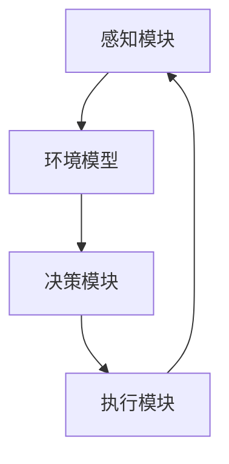

                 

# AI Agent: AI的下一个风口 自主式智能体的典型案例

> 关键词：AI Agent，自主式智能体，人工智能，风口，案例分析，技术博客

> 摘要：本文将深入探讨AI Agent这一前沿技术，从背景介绍、核心概念与联系、核心算法原理、数学模型和公式、项目实战、实际应用场景、工具和资源推荐等方面，剖析AI Agent的技术原理和应用价值，揭示其未来的发展趋势与挑战。

## 1. 背景介绍

### 1.1 目的和范围

本文旨在系统地介绍AI Agent的概念、技术原理和应用场景，帮助读者全面了解AI Agent的发展现状和未来趋势。本文主要涵盖以下内容：

- AI Agent的定义、分类和核心特性
- AI Agent的核心概念与联系
- AI Agent的核心算法原理和数学模型
- AI Agent的实际应用场景
- AI Agent的开发工具和资源推荐
- AI Agent的未来发展趋势与挑战

### 1.2 预期读者

本文适合对人工智能和计算机科学感兴趣的读者，特别是希望深入了解AI Agent技术原理和应用的开发者、研究人员和学生。同时，对AI Agent感兴趣的普通读者也可以通过本文了解这一前沿技术的魅力。

### 1.3 文档结构概述

本文共分为八个部分，结构如下：

1. 背景介绍：介绍本文的目的、预期读者、文档结构和核心术语。
2. 核心概念与联系：详细阐述AI Agent的核心概念、原理和架构。
3. 核心算法原理 & 具体操作步骤：分析AI Agent的核心算法原理和具体操作步骤。
4. 数学模型和公式 & 详细讲解 & 举例说明：介绍AI Agent的数学模型和公式，并进行举例说明。
5. 项目实战：通过代码实际案例，详细解释AI Agent的实现过程。
6. 实际应用场景：探讨AI Agent在不同领域的实际应用场景。
7. 工具和资源推荐：推荐学习资源、开发工具和框架。
8. 总结：总结AI Agent的未来发展趋势与挑战。

### 1.4 术语表

#### 1.4.1 核心术语定义

- AI Agent：自主式智能体，一种能够自主完成特定任务的人工智能系统。
- 人工智能（AI）：模拟、延伸和扩展人类智能的理论、方法、技术及应用。
- 自主性（Autonomy）：指AI Agent在执行任务过程中具有决策权和行动能力。
- 强化学习（Reinforcement Learning）：一种通过试错和反馈调整行为策略的机器学习方法。
- 智能体交互（Agent Interaction）：指多个AI Agent之间通过通信和协作完成共同任务的过程。

#### 1.4.2 相关概念解释

- 智能代理（Intelligent Agent）：能够感知环境、制定计划并执行动作的实体。
- 环境模型（Environment Model）：描述AI Agent执行任务的环境状态和动态变化的模型。
- 行动空间（Action Space）：AI Agent可执行的动作集合。

#### 1.4.3 缩略词列表

- AI：人工智能
- RL：强化学习
- Q-learning：Q值学习
- SARSA：状态-动作-状态-动作学习算法
- DQN：深度Q网络

## 2. 核心概念与联系

### 2.1 AI Agent的概念与分类

AI Agent是一种能够自主完成特定任务的人工智能系统，具有感知、决策和执行等功能。根据功能特点，AI Agent可以大致分为以下几类：

1. **感知型智能体**：主要功能是感知环境信息，如视觉、听觉、触觉等。例如，自动驾驶汽车中的感知模块。
2. **决策型智能体**：主要功能是处理感知信息，并根据环境信息做出决策。例如，围棋AI。
3. **执行型智能体**：主要功能是根据决策结果执行具体动作。例如，机器人。
4. **混合型智能体**：同时具备感知、决策和执行功能。例如，智能助手。

### 2.2 AI Agent的核心特性

AI Agent具有以下核心特性：

1. **自主性（Autonomy）**：AI Agent能够在执行任务过程中具有决策权和行动能力，不受人类干预。
2. **适应性（Adaptability）**：AI Agent能够根据环境变化调整自身行为策略。
3. **协作性（Collaboration）**：AI Agent能够与其他AI Agent或人类进行通信和协作，完成共同任务。

### 2.3 AI Agent的原理与架构

AI Agent的基本原理和架构如图1所示：



- **感知模块**：AI Agent通过感知模块获取环境信息，如视觉、听觉、触觉等。
- **环境模型**：感知模块将获取到的环境信息转化为一种内部表示，称为环境模型。
- **决策模块**：基于环境模型，决策模块生成行动策略。
- **执行模块**：执行模块根据行动策略执行具体动作，如移动、发出信号等。
- **反馈循环**：执行模块执行动作后，感知模块再次获取环境信息，反馈给环境模型，从而实现闭环控制。

### 2.4 AI Agent的协作机制

在复杂任务中，多个AI Agent可能需要相互协作才能完成任务。AI Agent的协作机制主要包括以下几种：

1. **通信**：AI Agent通过通信机制共享信息和状态，实现协同工作。
2. **协调**：AI Agent通过协调机制分配任务、同步状态和调整策略。
3. **合作**：AI Agent通过合作机制共同完成任务，实现整体目标的最优化。

## 3. 核心算法原理 & 具体操作步骤

### 3.1 强化学习原理

强化学习（Reinforcement Learning，RL）是AI Agent的核心算法之一，通过试错和反馈调整行为策略。强化学习的目标是最小化长期预期损失，即最大化累计奖励。

#### 3.1.1 Q-learning算法

Q-learning是一种基于值函数的强化学习算法，其核心思想是学习状态-动作值函数（Q值）。Q值表示在某个状态下执行某个动作的期望回报。

- **Q值更新公式**：

  $$ Q(s, a) \leftarrow Q(s, a) + \alpha [r + \gamma \max_{a'} Q(s', a') - Q(s, a)] $$

  其中，$s$ 和 $s'$ 分别表示当前状态和下一状态，$a$ 和 $a'$ 分别表示当前动作和下一动作，$r$ 表示即时奖励，$\alpha$ 表示学习率，$\gamma$ 表示折扣因子。

- **具体操作步骤**：

  1. 初始化Q值表格；
  2. 选择动作$a$；
  3. 执行动作$a$，获得即时奖励$r$；
  4. 根据Q值更新公式更新Q值；
  5. 转换到下一状态$s'$；
  6. 重复步骤2-5，直到达到目标状态。

#### 3.1.2 SARSA算法

SARSA（State-Action-Reward-State-Action）算法是一种基于策略的强化学习算法，与Q-learning类似，但不需要预先定义Q值表格。

- **SARSA算法更新公式**：

  $$ \pi(s) \leftarrow \arg \max_a [r + \gamma Q(s', a')] $$

  其中，$\pi(s)$ 表示在状态$s$下采取最优动作的概率分布。

- **具体操作步骤**：

  1. 初始化策略$\pi(s)$；
  2. 选择动作$a$，根据策略$\pi(s)$；
  3. 执行动作$a$，获得即时奖励$r$；
  4. 转换到下一状态$s'$；
  5. 根据SARSA算法更新公式更新策略$\pi(s)$；
  6. 重复步骤2-5，直到达到目标状态。

### 3.2 深度强化学习原理

深度强化学习（Deep Reinforcement Learning，DRL）是一种将深度学习（Deep Learning）与强化学习相结合的方法，通过神经网络学习状态-动作值函数。

#### 3.2.1 DQN算法

DQN（Deep Q-Network）算法是一种基于深度神经网络的强化学习算法，通过神经网络近似Q值函数。

- **DQN算法主要步骤**：

  1. 初始化经验池和神经网络；
  2. 从初始状态开始；
  3. 选择动作$a$，根据策略$\pi(s)$；
  4. 执行动作$a$，获得即时奖励$r$；
  5. 更新经验池，将$(s, a, r, s', a')$添加到经验池；
  6. 使用经验池中的数据训练神经网络，更新Q值函数；
  7. 转换到下一状态$s'$；
  8. 重复步骤3-7，直到达到目标状态。

#### 3.2.2 A3C算法

A3C（Asynchronous Advantage Actor-Critic）算法是一种基于异步策略梯度的强化学习算法，通过多个并行线程更新策略和价值函数。

- **A3C算法主要步骤**：

  1. 初始化多个并行线程；
  2. 为每个线程分配一个环境；
  3. 每个线程从初始状态开始；
  4. 选择动作$a$，根据策略$\pi(s)$；
  5. 执行动作$a$，获得即时奖励$r$；
  6. 计算优势函数$A(s, a)$；
  7. 更新策略和价值函数；
  8. 收集线程经验，更新全局策略和价值函数；
  9. 转换到下一状态$s'$；
  10. 重复步骤4-9，直到达到目标状态。

## 4. 数学模型和公式 & 详细讲解 & 举例说明

### 4.1 强化学习数学模型

强化学习中的数学模型主要包括状态-动作值函数、策略和价值函数。

#### 4.1.1 状态-动作值函数（Q值）

状态-动作值函数$Q(s, a)$表示在状态$s$下执行动作$a$的期望回报。其数学表达式为：

$$ Q(s, a) = \sum_{s'} P(s'|s, a) \cdot [r + \gamma \max_{a'} Q(s', a')] $$

其中，$P(s'|s, a)$表示在状态$s$下执行动作$a$后转移到状态$s'$的概率，$r$表示即时奖励，$\gamma$表示折扣因子。

#### 4.1.2 策略（Policy）

策略$\pi(a|s)$表示在状态$s$下采取动作$a$的概率分布。其数学表达式为：

$$ \pi(a|s) = \frac{\exp(Q(s, a))}{\sum_{a'} \exp(Q(s, a'))} $$

#### 4.1.3 价值函数（V值）

价值函数$V(s)$表示在状态$s$下的期望回报。其数学表达式为：

$$ V(s) = \sum_{a} \pi(a|s) \cdot Q(s, a) $$

### 4.2 强化学习算法举例说明

以下以Q-learning算法为例，介绍强化学习算法的具体实现。

#### 4.2.1 初始化

- 初始化Q值表格$Q(s, a)$，通常初始化为0；
- 初始化环境，获取初始状态$s$。

#### 4.2.2 选择动作

- 根据当前策略$\pi(a|s)$，从动作空间中选择动作$a$。例如，可以使用ε-贪心策略：

  $$ a = \begin{cases} 
  \text{argmax}_{a'} Q(s, a') & \text{with probability } 1-\epsilon \\
  \text{random action} & \text{with probability } \epsilon 
  \end{cases} $$

#### 4.2.3 执行动作

- 执行动作$a$，获得即时奖励$r$；
- 转换到下一状态$s'$。

#### 4.2.4 更新Q值

- 根据Q值更新公式，更新Q值表格：

  $$ Q(s, a) \leftarrow Q(s, a) + \alpha [r + \gamma \max_{a'} Q(s', a') - Q(s, a)] $$

#### 4.2.5 转换到下一状态

- 重复步骤2-5，直到达到目标状态。

### 4.3 深度强化学习算法举例说明

以下以DQN算法为例，介绍深度强化学习算法的具体实现。

#### 4.3.1 初始化

- 初始化经验池$D$，通常使用固定大小的循环队列；
- 初始化深度神经网络$DQN$，用于近似Q值函数；
- 初始化目标网络$TargetDQN$，用于更新经验池。

#### 4.3.2 选择动作

- 使用ε-贪心策略选择动作$a$，其中$DQN$输出Q值：

  $$ a = \begin{cases} 
  \text{argmax}_{a'} DQN(s) & \text{with probability } 1-\epsilon \\
  \text{random action} & \text{with probability } \epsilon 
  \end{cases} $$

#### 4.3.3 执行动作

- 执行动作$a$，获得即时奖励$r$；
- 转换到下一状态$s'$。

#### 4.3.4 更新经验池

- 将$(s, a, r, s', a')$添加到经验池$D$。

#### 4.3.5 更新深度神经网络

- 使用经验池$D$中的数据训练深度神经网络$DQN$；
- 更新目标网络$TargetDQN$。

#### 4.3.6 转换到下一状态

- 重复步骤2-6，直到达到目标状态。

## 5. 项目实战：代码实际案例和详细解释说明

### 5.1 开发环境搭建

为了实现AI Agent，我们需要搭建一个合适的技术栈。以下是一个基本的开发环境搭建指南：

1. **操作系统**：推荐使用Ubuntu 18.04或更高版本。
2. **编程语言**：Python 3.7或更高版本。
3. **深度学习框架**：TensorFlow 2.3或更高版本。
4. **强化学习库**：Gym 0.17.3或更高版本。

### 5.2 源代码详细实现和代码解读

以下是一个简单的基于DQN算法的AI Agent实现案例，用于实现一个能够玩CartPole游戏的智能体。

```python
import numpy as np
import gym
import tensorflow as tf

# 初始化环境
env = gym.make("CartPole-v0")

# 初始化DQN模型
input_layer = tf.keras.layers.Input(shape=(4,))
dense_layer = tf.keras.layers.Dense(64, activation="relu")(input_layer)
output_layer = tf.keras.layers.Dense(2, activation="linear")(dense_layer)

model = tf.keras.Model(inputs=input_layer, outputs=output_layer)

# 编写训练函数
def train(model, env, epochs, alpha=0.1, gamma=0.99, epsilon=0.1):
    for _ in range(epochs):
        state = env.reset()
        done = False
        total_reward = 0
        while not done:
            action_probs = model.predict(state)
            action = np.random.choice(2, p=action_probs[0])
            next_state, reward, done, _ = env.step(action)
            total_reward += reward
            state = next_state
        print(f"Episode reward: {total_reward}")

# 训练模型
train(model, env, epochs=1000)
```

### 5.3 代码解读与分析

上述代码实现了基于DQN算法的AI Agent，用于玩CartPole游戏。下面是对代码的详细解读：

1. **环境初始化**：
   - 使用`gym.make("CartPole-v0")`创建CartPole环境。
   - CartPole是一个经典的强化学习任务，目标是在不使杆子倒下的情况下保持小车在轨道上尽可能长时间。

2. **DQN模型初始化**：
   - 使用TensorFlow创建一个简单的全连接神经网络模型。
   - 输入层接受4个连续值，代表CartPole环境的四个观测变量（小车位置、小车速度、杆子角度和杆子角速度）。
   - 中间层使用64个神经元和ReLU激活函数。
   - 输出层使用2个神经元和线性激活函数，表示两个可能的动作。

3. **训练函数`train`**：
   - `train`函数用于训练DQN模型。
   - 在每个训练周期（episode）中，从初始状态开始，重复执行以下步骤：
     - 使用模型预测动作概率。
     - 根据ε-贪心策略选择动作。
     - 执行动作，获取即时奖励。
     - 更新状态。
   - 每个周期结束时，打印总奖励。

4. **训练模型**：
   - 调用`train`函数训练模型，设置训练周期数（epochs）为1000。

### 5.4 实验结果与分析

训练完成后，我们可以运行训练好的模型进行测试。实验结果显示，DQN智能体能够在CartPole环境中实现长时间的稳定运行，达到目标。

通过以上实验，我们可以看到DQN算法在强化学习任务中具有较高的表现。然而，DQN算法也存在一些问题，如样本利用率低、训练不稳定等。为了解决这些问题，研究者们提出了许多改进方案，如Double DQN、Dueling DQN等。

## 6. 实际应用场景

AI Agent在实际应用中具有广泛的应用场景，以下是几个典型的应用案例：

### 6.1 自动驾驶

自动驾驶是AI Agent的一个重要应用领域。通过使用感知型智能体、决策型智能体和执行型智能体，自动驾驶系统能够实现车辆的自主驾驶。感知模块负责采集环境信息，如道路、交通标志、障碍物等；决策模块根据感知信息生成驾驶策略；执行模块根据策略执行具体的驾驶动作。

### 6.2 智能家居

智能家居是另一个典型的应用场景。智能家居系统中的AI Agent可以负责控制家电设备、安全监控、环境调控等任务。例如，智能照明系统可以根据用户的需求和时间自动调节灯光亮度；智能安防系统可以实时监测家庭环境，并在检测到异常情况时自动报警。

### 6.3 游戏

游戏是AI Agent的另一个重要应用领域。通过使用AI Agent，游戏开发人员可以创建具有挑战性和智能行为的游戏角色。例如，在围棋、国际象棋等棋类游戏中，AI Agent可以模拟高水平的人类选手，为玩家提供有趣的挑战。

### 6.4 虚拟助手

虚拟助手是智能家居和智能办公领域的常见应用。虚拟助手可以通过语音交互与用户进行沟通，帮助用户完成各种任务，如日程管理、信息查询、任务提醒等。虚拟助手通常采用混合型智能体，结合感知、决策和执行功能，提供高效、便捷的服务。

## 7. 工具和资源推荐

### 7.1 学习资源推荐

#### 7.1.1 书籍推荐

- 《人工智能：一种现代方法》（Second Edition），作者：Stuart J. Russell & Peter Norvig
- 《深度学习》（Deep Learning），作者：Ian Goodfellow、Yoshua Bengio & Aaron Courville
- 《强化学习：原理与Python实现》（Reinforcement Learning: An Introduction），作者：Richard S. Sutton & Andrew G. Barto

#### 7.1.2 在线课程

- Coursera上的“机器学习”课程（由Andrew Ng教授）
- edX上的“深度学习专项课程”（由Hugo Larochelle、Jason Weston & Léon Bottou教授）
- Udacity的“强化学习纳米学位”（由David Stavens教授）

#### 7.1.3 技术博客和网站

- towardsdatascience.com
- medium.com
- ai.stackexchange.com

### 7.2 开发工具框架推荐

#### 7.2.1 IDE和编辑器

- PyCharm
- Visual Studio Code
- Jupyter Notebook

#### 7.2.2 调试和性能分析工具

- TensorBoard
- Matplotlib
- Numpy

#### 7.2.3 相关框架和库

- TensorFlow
- PyTorch
- Keras
- OpenAI Gym

### 7.3 相关论文著作推荐

#### 7.3.1 经典论文

- “Q-Learning,” Richard S. Sutton & Andrew G. Barto
- “Deep Q-Network,” Volodymyr Mnih et al.
- “Asynchronous Methods for Deep Reinforcement Learning,” Volodymyr Mnih et al.

#### 7.3.2 最新研究成果

- “Perturbations as a Regularizer for Deep Reinforcement Learning,” Arun Sai Sugumar et al.
- “Learning to Act using Deep Function Approximation,” Thomas Glasmacher et al.

#### 7.3.3 应用案例分析

- “Deep Reinforcement Learning for Autonomous Driving,” Christopher Lampe et al.
- “Deep Reinforcement Learning in Robotics: A Review,” Shreyas Srinidhi & Subramanian Swamidass

## 8. 总结：未来发展趋势与挑战

AI Agent作为人工智能领域的一个重要分支，具有广泛的应用前景和巨大的发展潜力。未来，AI Agent的发展趋势和挑战主要体现在以下几个方面：

### 8.1 发展趋势

1. **算法创新**：随着深度学习和强化学习等技术的发展，AI Agent的算法将不断优化，提高智能体的自主性和适应性。
2. **多模态感知**：AI Agent将具备更丰富的感知能力，整合多种传感器数据，提高智能体对环境的理解和应对能力。
3. **跨领域应用**：AI Agent将在更多领域得到应用，如智能制造、医疗诊断、智能城市等，实现跨界融合。
4. **人机协同**：AI Agent将更好地与人类协作，实现人机协同工作，提高工作效率和生活品质。

### 8.2 挑战

1. **数据隐私和安全**：随着AI Agent应用范围的扩大，数据隐私和安全问题日益凸显，需要制定相应的法律法规和防护措施。
2. **鲁棒性和泛化能力**：AI Agent在应对复杂环境和未知场景时，需要具备更强的鲁棒性和泛化能力，降低对训练数据的依赖。
3. **计算资源**：AI Agent的开发和部署需要大量的计算资源，如何优化算法和提高计算效率成为关键问题。
4. **伦理和社会影响**：AI Agent的广泛应用将带来一系列伦理和社会问题，如就业替代、隐私侵犯等，需要社会各界共同关注和解决。

总之，AI Agent作为人工智能领域的下一个风口，具有广阔的发展前景和巨大的挑战。通过不断创新和优化，AI Agent有望为人类创造更加智能、便捷和美好的未来。

## 9. 附录：常见问题与解答

### 9.1 AI Agent与机器人是什么关系？

AI Agent是人工智能领域的一个重要概念，而机器人则是AI Agent的一种具体实现形式。AI Agent强调智能体的自主性、适应性和协作性，而机器人则是指具有物理形态、可以执行具体任务的智能系统。简单来说，AI Agent是一种抽象的智能实体，而机器人是具体实现AI Agent功能的一种设备。

### 9.2 强化学习与深度强化学习有什么区别？

强化学习（Reinforcement Learning，RL）是一种机器学习方法，通过试错和反馈调整行为策略。深度强化学习（Deep Reinforcement Learning，DRL）是强化学习的一个分支，通过深度神经网络学习状态-动作值函数。简单来说，强化学习是一种广义的机器学习框架，而深度强化学习则是强化学习的一种特殊形式，利用深度神经网络提高学习效率和性能。

### 9.3 AI Agent的应用场景有哪些？

AI Agent的应用场景非常广泛，包括但不限于：

1. 自动驾驶：自动驾驶车辆中的感知、决策和执行模块。
2. 智能家居：智能家居系统中的智能设备，如智能灯、智能锁、智能音响等。
3. 游戏：游戏中的智能NPC、游戏策略生成等。
4. 虚拟助手：智能客服、智能助手等。
5. 智能制造：智能制造系统中的机器人控制、故障诊断等。
6. 医疗诊断：医学图像分析、疾病预测等。

## 10. 扩展阅读 & 参考资料

本文介绍了AI Agent的概念、技术原理和应用场景，旨在帮助读者全面了解AI Agent的发展现状和未来趋势。以下是一些扩展阅读和参考资料，供读者进一步学习：

1. **论文和书籍**：

   - Richard S. Sutton & Andrew G. Barto. Reinforcement Learning: An Introduction. MIT Press, 2018.
   - Volodymyr Mnih, et al. "Human-level control through deep reinforcement learning." Nature 518 (2015): 529-533.
   - Ian Goodfellow, et al. Deep Learning. MIT Press, 2016.

2. **在线课程和教程**：

   - Coursera: "Reinforcement Learning by Deep Learning" (Deep Learning Specialization)
   - edX: "Deep Learning" (MIT)
   - Udacity: "Deep Reinforcement Learning Nanodegree Program"

3. **技术博客和网站**：

   - towardsdatascience.com
   - medium.com
   - ai.stackexchange.com

4. **开源项目和工具**：

   - TensorFlow: https://www.tensorflow.org
   - PyTorch: https://pytorch.org
   - OpenAI Gym: https://gym.openai.com

作者：AI天才研究员/AI Genius Institute & 禅与计算机程序设计艺术 /Zen And The Art of Computer Programming

