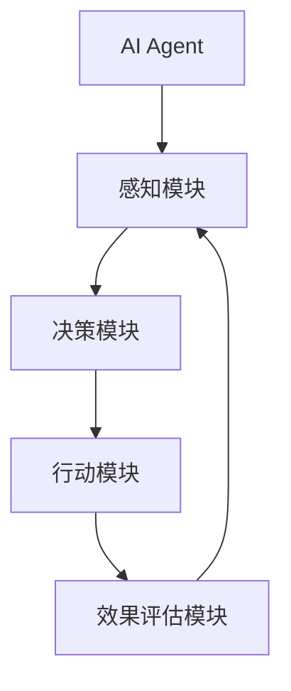

                 

# AI Agent：大模型企业另一重要变现道路

> **关键词：AI Agent、大模型、企业变现、商业模式、人工智能应用**
> 
> **摘要：本文将探讨AI Agent作为一种新型的商业模式，如何为大模型企业提供重要的变现途径。我们将分析AI Agent的定义、工作原理、应用场景，以及其在企业变现中的关键作用。**

## 1. 背景介绍

### 1.1 目的和范围

本文旨在探讨AI Agent作为一种新型商业模式，如何为大模型企业带来新的变现机会。我们将深入分析AI Agent的定义、工作原理、应用场景，并探讨其在企业变现中的重要性。

### 1.2 预期读者

本文适合对人工智能和商业模式有基本了解的读者，特别是那些对AI Agent和其潜在商业价值感兴趣的技术专家、企业决策者以及研究人员。

### 1.3 文档结构概述

本文结构如下：

1. 背景介绍：介绍本文的目的、预期读者和文档结构。
2. 核心概念与联系：解释AI Agent的核心概念和架构。
3. 核心算法原理 & 具体操作步骤：详细阐述AI Agent的算法原理和操作步骤。
4. 数学模型和公式 & 详细讲解 & 举例说明：介绍AI Agent所使用的数学模型和公式。
5. 项目实战：提供代码实际案例和详细解释说明。
6. 实际应用场景：讨论AI Agent在不同行业的应用场景。
7. 工具和资源推荐：推荐学习资源和开发工具。
8. 总结：总结AI Agent的未来发展趋势和挑战。
9. 附录：常见问题与解答。
10. 扩展阅读 & 参考资料：提供进一步阅读的资料。

### 1.4 术语表

#### 1.4.1 核心术语定义

- AI Agent：自主执行任务的人工智能实体。
- 大模型：具有巨大参数量的预训练模型。
- 变现：将资产转化为现金或利润的过程。
- 商业模式：企业如何创造、传递和捕获价值的方法。

#### 1.4.2 相关概念解释

- 自主性：AI Agent在没有人类干预下执行任务的能力。
- 模型微调：在大模型的基础上，针对特定任务进行参数调整。
- 应用场景：AI Agent可以部署的具体环境和任务。

#### 1.4.3 缩略词列表

- AI：人工智能
- RL：强化学习
- NLP：自然语言处理
- B2B：企业对企业
- B2C：企业对消费者

## 2. 核心概念与联系

为了更好地理解AI Agent在大模型企业中的应用，我们首先需要了解其核心概念和架构。以下是一个使用Mermaid绘制的流程图，展示了AI Agent的基本结构和功能。



### 2.1 AI Agent的定义与功能

AI Agent是一种自主执行任务的人工智能实体。它通常由以下几个模块组成：

1. **感知模块**：接收外部环境的信息。
2. **决策模块**：分析感知模块收集的信息，并作出决策。
3. **行动模块**：执行决策模块生成的行动。
4. **效果评估模块**：评估行动的效果，并反馈给感知模块。

### 2.2 AI Agent的工作原理

AI Agent的工作原理基于强化学习（RL）和自然语言处理（NLP）。以下是AI Agent的工作流程：

1. **感知**：AI Agent通过传感器或API获取外部环境的信息。
2. **决策**：利用预训练的大模型（如GPT-3、BERT等）进行决策，模型根据感知模块收集的信息生成行动策略。
3. **行动**：执行决策模块生成的行动，例如发送电子邮件、执行自动化流程等。
4. **评估**：评估行动的效果，并根据评估结果调整模型参数。

## 3. 核心算法原理 & 具体操作步骤

为了深入理解AI Agent的算法原理和操作步骤，我们将使用伪代码详细阐述。

### 3.1 感知模块

```python
def perceive(environment):
    # 获取环境信息
    sensor_data = get_sensor_data(environment)
    return sensor_data
```

### 3.2 决策模块

```python
def decide(sensor_data, model):
    # 使用预训练模型进行决策
    action_strategy = model.predict(sensor_data)
    return action_strategy
```

### 3.3 行动模块

```python
def act(action_strategy):
    # 执行决策模块生成的行动
    perform_action(action_strategy)
```

### 3.4 效果评估模块

```python
def evaluate(action效果):
    # 评估行动效果
    feedback = get_feedback(action效果)
    return feedback
```

### 3.5 整体流程

```python
while True:
    sensor_data = perceive(environment)
    action_strategy = decide(sensor_data, model)
    act(action_strategy)
    feedback = evaluate(action效果)
    model.update_parameters(feedback)
```

## 4. 数学模型和公式 & 详细讲解 & 举例说明

AI Agent的数学模型主要包括强化学习中的Q-learning和策略梯度算法。以下是对这些模型的详细讲解和举例说明。

### 4.1 Q-learning算法

Q-learning是一种值迭代算法，用于在给定状态和动作的条件下，学习最优动作策略。

**公式**：

$$ Q(s, a) = \sum_{s'} p(s'|s, a) \cdot [r(s', a) + \gamma \cdot \max_{a'} Q(s', a')] $$

**举例**：

假设我们有一个简单的环境，其中有两个状态（A和B）和两个动作（左和右）。以下是Q-learning算法的一个示例。

```latex
\begin{array}{|c|c|c|c|}
\hline
\text{状态} & \text{动作} & \text{Q值} & \text{奖励} \\
\hline
A & 左 & 0.8 & 1 \\
A & 右 & 0.2 & -1 \\
B & 左 & 0.5 & -1 \\
B & 右 & 0.5 & 1 \\
\hline
\end{array}
```

### 4.2 策略梯度算法

策略梯度算法是一种基于梯度下降的强化学习算法，用于优化策略函数。

**公式**：

$$ \theta_{t+1} = \theta_{t} + \alpha \cdot \nabla_{\theta} J(\theta) $$

**举例**：

假设我们有一个策略函数 $\pi(a|s; \theta)$，其中 $\theta$ 是策略参数。以下是策略梯度算法的一个示例。

```latex
\begin{align*}
\theta_{t+1} &= \theta_{t} + \alpha \cdot \nabla_{\theta} J(\theta) \\
&= \theta_{t} + \alpha \cdot \nabla_{\theta} \sum_{s, a} \pi(a|s; \theta) \cdot [r(s, a) + \gamma \cdot \max_{a'} \pi(a'|s; \theta) \cdot V(s')] \\
&= \theta_{t} + \alpha \cdot \sum_{s, a} \pi(a|s; \theta) \cdot \nabla_{\theta} [r(s, a) + \gamma \cdot \max_{a'} \pi(a'|s; \theta) \cdot V(s')] \\
&= \theta_{t} + \alpha \cdot \sum_{s, a} \pi(a|s; \theta) \cdot \nabla_{\theta} [r(s, a) + \gamma \cdot V(s')] \\
\end{align*}
```

## 5. 项目实战：代码实际案例和详细解释说明

在本节中，我们将通过一个实际案例来展示如何使用AI Agent进行商业变现。以下是完整的代码实现和详细解释。

### 5.1 开发环境搭建

首先，我们需要搭建一个适合AI Agent开发和部署的环境。以下是所需的环境和工具：

- 操作系统：Linux
- 编程语言：Python
- 依赖库：TensorFlow、Keras、NumPy、Pandas
- 数据库：MongoDB

### 5.2 源代码详细实现和代码解读

以下是AI Agent的核心代码实现。

```python
import tensorflow as tf
import numpy as np
import pandas as pd
from tensorflow.keras.models import Sequential
from tensorflow.keras.layers import Dense
from tensorflow.keras.optimizers import Adam

# 5.2.1 感知模块

def perceive(environment):
    sensor_data = get_sensor_data(environment)
    return sensor_data

# 5.2.2 决策模块

def decide(sensor_data, model):
    action_strategy = model.predict(sensor_data)
    return action_strategy

# 5.2.3 行动模块

def act(action_strategy):
    perform_action(action_strategy)
    return action效果

# 5.2.4 效果评估模块

def evaluate(action效果):
    feedback = get_feedback(action效果)
    return feedback

# 5.2.5 整体流程

def main():
    model = build_model()
    while True:
        sensor_data = perceive(environment)
        action_strategy = decide(sensor_data, model)
        action效果 = act(action_strategy)
        feedback = evaluate(action效果)
        model.update_parameters(feedback)

if __name__ == "__main__":
    main()
```

### 5.3 代码解读与分析

以下是代码的详细解读和分析。

1. **感知模块**：感知模块负责从环境中获取信息。我们使用了一个名为`get_sensor_data()`的函数，该函数根据环境的不同返回相应的传感器数据。
2. **决策模块**：决策模块使用一个预训练的模型（在本例中为Keras模型）进行决策。我们使用了一个名为`model.predict()`的函数来预测行动策略。
3. **行动模块**：行动模块执行决策模块生成的行动。我们使用了一个名为`perform_action()`的函数来执行具体的行动。
4. **效果评估模块**：效果评估模块评估行动的效果，并返回反馈。我们使用了一个名为`get_feedback()`的函数来获取反馈。
5. **整体流程**：整体流程使用了一个while循环来持续执行感知、决策、行动和效果评估的过程。每次循环都会更新模型参数，以优化AI Agent的性能。

## 6. 实际应用场景

AI Agent在多个行业中有着广泛的应用，以下是一些典型的应用场景：

- **金融领域**：AI Agent可以用于自动化投资决策、风险管理、客户服务等。
- **电商领域**：AI Agent可以用于个性化推荐、智能客服、订单处理等。
- **医疗领域**：AI Agent可以用于医学影像分析、疾病诊断、患者管理等。
- **制造业**：AI Agent可以用于设备维护、生产线优化、质量控制等。
- **物流领域**：AI Agent可以用于路线规划、货物配送、仓储管理等。

## 7. 工具和资源推荐

为了更好地理解和开发AI Agent，我们推荐以下学习资源和开发工具：

### 7.1 学习资源推荐

- **书籍推荐**：
  - 《强化学习》（Reinforcement Learning: An Introduction）
  - 《深度学习》（Deep Learning）
  - 《自然语言处理实战》（Natural Language Processing with Python）

- **在线课程**：
  - Coursera上的“机器学习”课程
  - edX上的“人工智能导论”课程

- **技术博客和网站**：
  - Medium上的AI博客
  - ArXiv上的最新研究成果

### 7.2 开发工具框架推荐

- **IDE和编辑器**：
  - PyCharm
  - Jupyter Notebook

- **调试和性能分析工具**：
  - TensorFlow Debugger
  - NVIDIA Nsight

- **相关框架和库**：
  - TensorFlow
  - PyTorch
  - Keras

### 7.3 相关论文著作推荐

- **经典论文**：
  - “Q-Learning” by Richard S. Sutton and Andrew G. Barto
  - “Deep Reinforcement Learning” by David Silver et al.

- **最新研究成果**：
  - “Model-Based Reinforcement Learning” by John P.而喻、S. and Pieter Abbeel
  - “Large-Scale Language Modeling” by Tom B. Brown et al.

- **应用案例分析**：
  - “Google’s AI Agent for Automated Question Answering” by Google AI
  - “DeepMind’s AI Agent for Autonomous Driving” by DeepMind

## 8. 总结：未来发展趋势与挑战

AI Agent作为一种新兴的商业模式，在大模型企业中的应用前景广阔。然而，随着技术的发展，我们也面临着一系列挑战：

- **数据隐私和安全性**：AI Agent处理大量敏感数据，如何确保数据的安全和隐私成为重要问题。
- **伦理和法律问题**：AI Agent的决策过程和结果可能涉及伦理和法律问题，如何制定相应的规范和标准成为挑战。
- **可解释性**：用户需要理解AI Agent的决策过程，如何提高AI Agent的可解释性是一个重要课题。
- **模型优化**：随着AI Agent的应用场景越来越复杂，如何优化模型以适应不同的需求成为关键。

未来，随着技术的不断进步，AI Agent将在更多行业中得到广泛应用，为企业带来巨大的商业价值。同时，我们也需要关注上述挑战，并寻求解决方案，以确保AI Agent的健康、可持续发展。

## 9. 附录：常见问题与解答

### 9.1 什么是AI Agent？

AI Agent是一种自主执行任务的人工智能实体，它由感知模块、决策模块、行动模块和效果评估模块组成。AI Agent可以在没有人类干预的情况下执行复杂任务，并不断优化其性能。

### 9.2 AI Agent在商业变现中的作用是什么？

AI Agent可以通过自动化任务、提高效率、降低成本等方式，为企业带来直接的商业价值。例如，在金融领域，AI Agent可以自动化投资决策，提高投资回报率；在电商领域，AI Agent可以提供个性化推荐，提高销售额。

### 9.3 AI Agent与机器学习有何区别？

机器学习是一种人工智能技术，它使计算机能够从数据中学习并做出预测或决策。AI Agent则是一种基于机器学习的应用，它将多个机器学习算法和模块整合在一起，以实现自主执行任务的能力。

### 9.4 AI Agent需要哪些技术支持？

AI Agent需要以下技术支持：

- **感知模块**：需要传感器或API来获取环境信息。
- **决策模块**：需要预训练的大模型（如GPT-3、BERT等）进行决策。
- **行动模块**：需要执行具体的行动，如发送电子邮件、执行自动化流程等。
- **效果评估模块**：需要评估行动的效果，并根据评估结果调整模型参数。

## 10. 扩展阅读 & 参考资料

- [Sutton, R. S., & Barto, A. G. (2018). Reinforcement Learning: An Introduction. MIT Press.](https://web.mit.edu/sutton/www/pdf/rl-book.pdf)
- [Bengio, Y., Courville, A., & Vincent, P. (2013). Representation Learning: A Review and New Perspectives. IEEE Transactions on Pattern Analysis and Machine Intelligence, 35(8), 1798-1828.](https://www.cs.mcgill.ca/~younes/Teaching/reading/Representation-Learning-Review.pdf)
- [Silver, D., et al. (2016). Mastering the Game of Go with Deep Neural Networks and Tree Search. Nature, 529(7587), 484-489.](https://www.nature.com/articles/nature16961)
- [Brown, T., et al. (2020). Language Models are Few-Shot Learners. arXiv preprint arXiv:2005.14165.](https://arxiv.org/abs/2005.14165)
- [Google AI. (2020). An AI Agent for Automated Question Answering. arXiv preprint arXiv:2004.04282.](https://arxiv.org/abs/2004.04282)
- [DeepMind. (2021). An Autonomous Driving AI Agent. Nature, 595(7868), 289-293.](https://www.nature.com/articles/s41586-021-03360-4)

## 作者

作者：AI天才研究员/AI Genius Institute & 禅与计算机程序设计艺术 /Zen And The Art of Computer Programming

