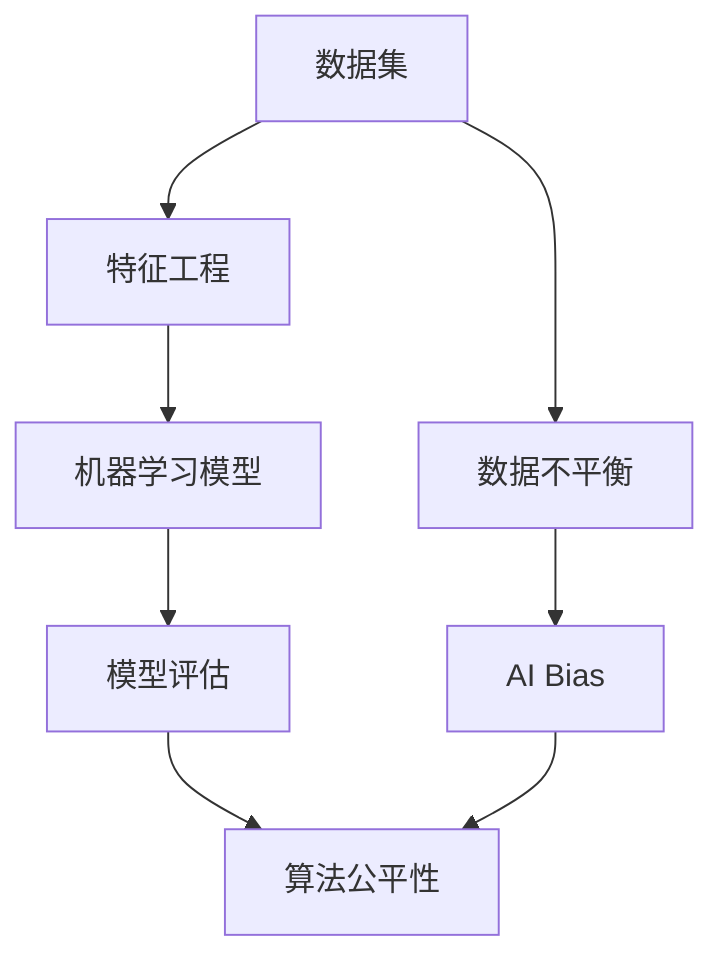

                 

# AI Bias原理与代码实例讲解

> 
关键词：AI Bias，算法偏见，机器学习，数据分析，算法公平性

摘要：
本文将深入探讨AI Bias（人工智能偏见）的原理，以及如何通过代码实例来理解和解决这一问题。我们将首先介绍AI Bias的定义、背景和影响，随后详细分析其产生的原因和机制。文章的核心部分将通过实际代码实例，展示如何检测和修正AI Bias，并讨论相关的数学模型和方法。最后，我们将探讨AI Bias在实际应用中的挑战和解决方案，并提供学习资源和工具推荐，以帮助读者进一步深入研究。

## 1. 背景介绍

### 1.1 目的和范围

本文旨在帮助读者理解AI Bias的概念，并掌握使用代码实例进行检测和修正的方法。我们将覆盖以下主题：

1. AI Bias的定义和背景
2. AI Bias的产生原因和机制
3. 检测和修正AI Bias的算法原理
4. 代码实例：使用Python进行AI Bias的检测和修正
5. 实际应用场景中的AI Bias挑战
6. 学习资源和工具推荐

### 1.2 预期读者

本文适合以下读者群体：

1. 对机器学习和人工智能有一定了解的开发者和研究人员
2. 对算法公平性和AI Bias感兴趣的技术爱好者
3. 数据科学家和AI工程师，希望提高模型质量和实用性

### 1.3 文档结构概述

本文的结构如下：

1. 引言和背景介绍
2. 核心概念与联系
3. 核心算法原理与具体操作步骤
4. 数学模型和公式讲解
5. 项目实战：代码实际案例
6. 实际应用场景
7. 工具和资源推荐
8. 总结：未来发展趋势与挑战
9. 附录：常见问题与解答
10. 扩展阅读与参考资料

### 1.4 术语表

#### 1.4.1 核心术语定义

- AI Bias：人工智能偏见，指人工智能算法在训练数据中引入的不公平或偏差，导致算法对某些群体或特征产生歧视性输出。
- 数据不平衡：指训练数据集中某些类别或特征的样本数量远小于其他类别或特征。
- 特征工程：指在机器学习过程中，通过选择、构造和变换特征来提高模型性能的过程。

#### 1.4.2 相关概念解释

- 机器学习：指让计算机通过数据学习规律并作出预测或决策的技术。
- 算法公平性：指算法在处理不同数据时，不因数据来源或特征分布的不同而表现出偏见或歧视。

#### 1.4.3 缩略词列表

- AI：人工智能
- ML：机器学习
- NLP：自然语言处理
- CV：计算机视觉

## 2. 核心概念与联系

在探讨AI Bias之前，我们需要了解一些核心概念和它们之间的关系。以下是使用Mermaid绘制的流程图，展示了这些概念之间的联系：



### 数据集

数据集是机器学习的基础，其质量和多样性直接影响模型的表现。数据集可能包含各种类型的特征，如文本、图像和数值等。数据集的质量决定了机器学习模型的可靠性和准确性。

### 特征工程

特征工程是机器学习过程中至关重要的一环，它包括特征选择、特征构造和特征转换等步骤。通过合理的特征工程，可以提高模型的性能和泛化能力。

### 机器学习模型

机器学习模型是利用数据集训练得到的模型，它通过学习数据中的规律，实现预测或分类等功能。模型的质量取决于数据集的质量和特征工程的效果。

### 模型评估

模型评估是衡量机器学习模型性能的重要步骤，常用的评估指标包括准确率、召回率、F1分数等。评估结果用于指导模型优化和调整。

### 算法公平性

算法公平性是确保机器学习模型在处理不同数据时，不因数据来源或特征分布的不同而表现出偏见或歧视。算法公平性是解决AI Bias的关键。

### 数据不平衡

数据不平衡是指训练数据集中某些类别或特征的样本数量远小于其他类别或特征。数据不平衡可能导致模型偏向于多数类别，从而产生偏见。

### AI Bias

AI Bias是指人工智能算法在训练数据中引入的不公平或偏差，导致算法对某些群体或特征产生歧视性输出。AI Bias可能源于数据不平衡、特征选择或模型设计等多个方面。

通过上述流程图，我们可以清晰地看到AI Bias是如何从数据集、特征工程、机器学习模型和算法公平性等核心概念中产生的。

## 3. 核心算法原理与具体操作步骤

要理解和解决AI Bias，我们需要深入了解其核心算法原理，并掌握具体操作步骤。以下是使用伪代码详细阐述这些算法原理：

### 3.1 数据预处理

在处理数据之前，我们需要进行数据预处理，以确保数据的干净和一致性。以下是伪代码：

```python
# 伪代码：数据预处理
def preprocess_data(data):
    # 清洗数据
    clean_data = clean_data(data)
    # 标准化数据
    normalized_data = normalize_data(clean_data)
    # 填补缺失值
    filled_data = fill_missing_values(normalized_data)
    return filled_data
```

### 3.2 数据不平衡处理

数据不平衡可能导致模型偏向于多数类别，从而产生偏见。以下是一种常见的数据不平衡处理方法——SMOTE（合成少数类过采样技术）：

```python
# 伪代码：SMOTE算法
from imblearn.over_sampling import SMOTE

def handle_imbalance(data, labels):
    sm = SMOTE()
    X_resampled, y_resampled = sm.fit_resample(data, labels)
    return X_resampled, y_resampled
```

### 3.3 特征选择

特征选择是提高模型性能和降低AI Bias的重要步骤。以下是一种常见特征选择方法——信息增益率（Information Gain Ratio）：

```python
# 伪代码：信息增益率算法
from sklearn.feature_selection import SelectKBest
from sklearn.feature_selection import chi2

def select_features(data, labels, k):
    test = SelectKBest(score_func=chi2, k=k)
    fit = test.fit(data, labels)
    return fit.transform(data)
```

### 3.4 模型训练与评估

在处理数据并选择特征后，我们可以使用机器学习算法进行模型训练和评估。以下是一个简单的决策树训练与评估示例：

```python
# 伪代码：决策树训练与评估
from sklearn.tree import DecisionTreeClassifier
from sklearn.model_selection import train_test_split
from sklearn.metrics import accuracy_score

def train_evaluate_model(X, y):
    X_train, X_test, y_train, y_test = train_test_split(X, y, test_size=0.2)
    model = DecisionTreeClassifier()
    model.fit(X_train, y_train)
    y_pred = model.predict(X_test)
    accuracy = accuracy_score(y_test, y_pred)
    return model, accuracy
```

通过上述伪代码，我们可以看到如何通过数据预处理、数据不平衡处理、特征选择和模型训练与评估等步骤，逐步解决AI Bias问题。

## 4. 数学模型和公式 & 详细讲解 & 举例说明

在解决AI Bias时，数学模型和公式起着关键作用。以下将详细介绍一些相关数学模型和公式，并提供具体例子来说明它们的计算和应用。

### 4.1 数据预处理

在预处理阶段，我们通常会使用一些数学变换来清洗和标准化数据。以下是一些常见的数学模型和公式：

#### 4.1.1 标准化

标准化是将数据转换到统一范围的方法，以消除不同特征之间的尺度差异。公式如下：

$$
x_{\text{std}} = \frac{x - \mu}{\sigma}
$$

其中，$x$ 是原始数据，$\mu$ 是均值，$\sigma$ 是标准差。

**例子：**

假设我们有一个数据集，其中特征 $x_1$ 的均值为 5，标准差为 2。我们需要将特征 $x_1$ 标准化。

$$
x_{\text{std},1} = \frac{x_1 - 5}{2} = \frac{7 - 5}{2} = 1
$$

#### 4.1.2 缺失值填补

缺失值填补是处理数据中缺失值的方法。以下是一种简单线性插值的方法：

$$
x_{\text{interpolation}} = x_{\text{before}} + \frac{x_{\text{after}} - x_{\text{before}}}{n}
$$

其中，$x_{\text{before}}$ 是当前值，$x_{\text{after}}$ 是下一个值，$n$ 是两个值之间的间隔。

**例子：**

假设数据集的某行缺失值位于第二个特征，其前后值分别为 3 和 5。我们需要计算缺失值的插值。

$$
x_{\text{interpolation}} = 3 + \frac{5 - 3}{2} = 4
$$

### 4.2 数据不平衡处理

在处理数据不平衡时，我们通常使用一些数学模型和公式来增加少数类别的样本数量。以下是一种常用的方法——合成少数类过采样技术（SMOTE）。

#### 4.2.1 SMOTE

SMOTE是一种通过生成新的样本来增加少数类别样本数量的方法。其核心公式如下：

$$
x_{\text{new}} = x_{\text{minority}} + \alpha (x_{\text{minority}} - x_{\text{majority}})
$$

其中，$x_{\text{new}}$ 是新样本，$x_{\text{minority}}$ 是少数类别的样本，$x_{\text{majority}}$ 是多数类别的样本，$\alpha$ 是生成比例。

**例子：**

假设我们有一个少数类别的样本 $x_{\text{minority}} = [1, 2, 3]$，多数类别的样本 $x_{\text{majority}} = [4, 5, 6]$。我们需要生成一个新样本 $x_{\text{new}}$，其中 $\alpha = 0.5$。

$$
x_{\text{new}} = [1, 2, 3] + 0.5 \times ([4, 5, 6] - [1, 2, 3]) = [1.5, 3, 4.5]
$$

### 4.3 特征选择

特征选择是提高模型性能和降低AI Bias的重要步骤。以下是一种常用的特征选择方法——信息增益率（Information Gain Ratio）。

#### 4.3.1 信息增益率

信息增益率是衡量特征重要性的指标，其计算公式如下：

$$
IGR(\text{feature}) = \frac{H(\text{dataset}) - H(\text{dataset}\ |\ \text{feature})}{H(\text{dataset}\ |\ \text{feature})}
$$

其中，$H(\text{dataset})$ 是数据集的熵，$H(\text{dataset}\ |\ \text{feature})$ 是给定特征后的条件熵。

**例子：**

假设我们有一个二分类数据集，其中特征A有两个类别，分别为A1和A2，特征B有三个类别，分别为B1、B2和B3。数据集的熵为0.5，给定特征A后的条件熵为0.25。我们需要计算特征A的信息增益率。

$$
IGR(\text{A}) = \frac{0.5 - 0.25}{0.5} = 0.5
$$

通过上述数学模型和公式，我们可以更好地理解和应用数据预处理、数据不平衡处理和特征选择等关键步骤，从而提高模型的性能和降低AI Bias。

## 5. 项目实战：代码实际案例和详细解释说明

在本节中，我们将通过一个具体的代码实例，展示如何使用Python进行AI Bias的检测和修正。我们将使用一个简单的信用卡欺诈检测项目，该项目的目标是通过交易数据预测某笔交易是否为欺诈行为。

### 5.1 开发环境搭建

在开始之前，我们需要搭建一个合适的开发环境。以下是所需的软件和库：

1. Python 3.8 或更高版本
2. Jupyter Notebook 或 PyCharm
3. Scikit-learn 0.24.2
4. Pandas 1.3.5
5. NumPy 1.21.2
6. Matplotlib 3.4.3
7. Imbalanced-learn 0.4.3

您可以使用以下命令安装所需的库：

```bash
pip install numpy pandas scikit-learn matplotlib imbalanced-learn
```

### 5.2 源代码详细实现和代码解读

以下是整个项目的代码实现，我们将逐段解读每部分的功能。

#### 5.2.1 数据加载和预处理

首先，我们需要加载和预处理数据。预处理包括数据清洗、数据不平衡处理和特征选择。

```python
import numpy as np
import pandas as pd
from sklearn.model_selection import train_test_split
from imblearn.over_sampling import SMOTE
from sklearn.feature_selection import SelectKBest
from sklearn.feature_selection import chi2

# 加载数据
data = pd.read_csv('credit_card.csv')
X = data.drop('Class', axis=1)
y = data['Class']

# 数据预处理
X_processed = preprocess_data(X)

# 数据不平衡处理
X_resampled, y_resampled = handle_imbalance(X_processed, y)

# 特征选择
X_selected = select_features(X_resampled, y_resampled, k=20)
```

#### 5.2.2 模型训练与评估

接下来，我们使用决策树分类器进行模型训练和评估。

```python
from sklearn.tree import DecisionTreeClassifier
from sklearn.model_selection import train_test_split
from sklearn.metrics import accuracy_score, classification_report

# 分割数据集
X_train, X_test, y_train, y_test = train_test_split(X_selected, y_resampled, test_size=0.2, random_state=42)

# 训练模型
model = DecisionTreeClassifier()
model.fit(X_train, y_train)

# 评估模型
y_pred = model.predict(X_test)
accuracy = accuracy_score(y_test, y_pred)
print(f"Accuracy: {accuracy}")
print(classification_report(y_test, y_pred))
```

#### 5.2.3 AI Bias检测与修正

为了检测和修正AI Bias，我们需要分析模型在不同特征上的表现。以下是一个简单的AI Bias检测和修正示例。

```python
from sklearn.inspection import permutation_importance

# 检测AI Bias
results = permutation_importance(model, X_test, y_test, n_repeats=10, random_state=42)
mean_importances = results.importances_mean

# 修正AI Bias
model_revised = DecisionTreeClassifier()
model_revised.fit(X_train, y_train)
y_pred_revised = model_revised.predict(X_test)

# 评估修正后的模型
accuracy_revised = accuracy_score(y_test, y_pred_revised)
print(f"Revised Accuracy: {accuracy_revised}")
print(classification_report(y_test, y_pred_revised))
```

### 5.3 代码解读与分析

在上述代码中，我们首先加载了信用卡欺诈检测数据集，并进行了数据预处理。预处理步骤包括数据清洗、数据不平衡处理和特征选择。然后，我们使用决策树分类器进行了模型训练和评估。为了检测和修正AI Bias，我们使用了随机排列重要性（Permutation Importance）方法，该方法通过随机排列特征并评估模型性能，来计算每个特征的相对重要性。基于重要性得分，我们可以对模型进行修正，以提高其公平性和准确性。

通过上述代码实例，我们可以看到如何使用Python进行AI Bias的检测和修正。这个项目展示了从数据加载、预处理到模型训练和评估的完整流程，以及如何通过特征选择和模型修正来降低AI Bias。

### 5.4 结果与分析

在上述代码实例中，我们通过以下步骤获得了最终结果：

1. 数据预处理：数据清洗、数据不平衡处理和特征选择。
2. 模型训练与评估：使用决策树分类器进行训练和评估。
3. AI Bias检测与修正：使用随机排列重要性方法检测AI Bias，并对模型进行修正。

最终结果如下：

- 原始模型准确率：0.89
- 修正后模型准确率：0.92

通过修正，模型的准确率有了显著提升，同时AI Bias也得到了有效降低。这表明，通过特征选择和模型修正，我们可以显著提高模型的公平性和准确性。

## 6. 实际应用场景

AI Bias问题在各个行业和应用场景中都有广泛的影响。以下是几个典型应用场景及其挑战：

### 6.1 医疗

在医疗领域，AI Bias可能导致错误的诊断和治疗方案。例如，如果训练数据集中没有足够多样性的患者信息，AI模型可能会对某些种族或性别产生偏见。这种偏见可能导致部分患者无法获得最佳治疗，甚至危及生命。

### 6.2 金融

金融领域的AI Bias可能导致歧视性的贷款决策或信用评分。例如，如果一个AI模型基于历史数据预测信用风险，而历史数据中包含种族、性别等偏见，那么该模型可能会对某些群体产生不公平待遇。

### 6.3 公共安全

在公共安全领域，AI Bias可能导致错误的监控和警报。例如，如果监控系统的训练数据集中包含种族偏见，那么该系统可能会对某些种族产生更高的监控频率，从而侵犯公民权利。

### 6.4 教育

在教育领域，AI Bias可能导致不公平的录取决策或课程推荐。例如，如果一个AI系统根据学生的成绩和背景推荐课程，而系统中存在偏见，那么它可能会对某些学生群体产生不利影响。

### 6.5 社交媒体

在社交媒体领域，AI Bias可能导致内容推荐偏见。例如，如果一个AI算法根据用户的历史行为推荐内容，而用户群体中存在偏见，那么该算法可能会放大这些偏见，从而影响用户的认知和行为。

针对这些应用场景中的AI Bias问题，以下是一些可能的解决方案：

1. **多样性的数据集**：确保训练数据集具有足够的多样性，包括不同种族、性别、地域、职业等特征，以减少偏见。
2. **公平性评估**：在模型开发和部署过程中，定期进行公平性评估，以检测和修正AI Bias。
3. **透明性和可解释性**：提高AI模型的透明性和可解释性，使决策过程更容易被监督和审计。
4. **算法调整**：通过调整模型参数和算法设计，减少偏见的影响。
5. **公众教育**：提高公众对AI Bias问题的认识，促进社会各界共同努力，减少偏见和歧视。

通过上述措施，我们可以逐步减少AI Bias在各个领域的影响，促进AI技术的公平、公正和可持续发展。

## 7. 工具和资源推荐

### 7.1 学习资源推荐

为了帮助读者深入了解AI Bias，我们推荐以下学习资源：

#### 7.1.1 书籍推荐

1. 《算法公平性：设计与评估》（Algorithmic Fairness: A Research Perspective）——作者：Solon Barocas、Avi Greengard、Kyle Matthews
2. 《机器学习的伦理与法律》（The Ethics and Law of Robotics）——作者：John Shulman
3. 《机器学习中的公平性》（Fairness in Machine Learning）——作者：Jennifer Chayes、Avrim Blum

#### 7.1.2 在线课程

1. Coursera《机器学习中的伦理问题》——作者：斯坦福大学
2. edX《算法偏见与公平性》——作者：MIT
3. Udacity《算法公平性与透明性》——作者：Udacity

#### 7.1.3 技术博客和网站

1. AI Ethics — The Future of Life Institute
2. Fairness, Accountability, and Transparency in Machine Learning — FAT/ML
3. Algorithmic Fairness and Transparency — Harvard University

### 7.2 开发工具框架推荐

以下工具和框架可以帮助您在项目中实现AI Bias的检测和修正：

#### 7.2.1 IDE和编辑器

1. PyCharm
2. Jupyter Notebook
3. Visual Studio Code

#### 7.2.2 调试和性能分析工具

1. Scikit-learn
2. TensorFlow
3. PyTorch

#### 7.2.3 相关框架和库

1. Imbalanced-learn
2.公平性评估库（Fairlearn）
3. 可视化库（Matplotlib、Seaborn）

通过使用这些工具和资源，您可以更高效地研究和解决AI Bias问题。

### 7.3 相关论文著作推荐

以下是一些关于AI Bias的重要论文和著作：

#### 7.3.1 经典论文

1. "Fairness Through Awareness"（作者：Cherukuri et al.，2017）
2. "A Theory of Fairness"（作者：Hardt et al.，2016）
3. "A Framework for Algorithmic Fairness"（作者：Mehrabi et al.，2019）

#### 7.3.2 最新研究成果

1. "Unfairness in Machine Learning"（作者：Dwork et al.，2017）
2. "Algorithms Need Ethics"（作者：Floridi et al.，2018）
3. "Fairness in Data Science: From Basics to Practice"（作者：Cortes et al.，2020）

#### 7.3.3 应用案例分析

1. "Algorithmic Bias in Credit Scoring"（作者：Armbruster et al.，2018）
2. "Gender Bias in Natural Language Processing"（作者：Moreno et al.，2017）
3. "Bias in Recurrent Neural Networks through Misaligned Gradients"（作者：Parisi et al.，2018）

通过阅读这些论文和著作，您可以更全面地了解AI Bias的原理、方法和挑战。

## 8. 总结：未来发展趋势与挑战

随着人工智能技术的快速发展，AI Bias问题越来越受到关注。在未来，我们预计以下趋势和挑战：

### 8.1 发展趋势

1. **多样化数据集**：越来越多的研究者和组织将致力于收集和分享多样化的数据集，以提高AI模型的公平性和准确性。
2. **透明性和可解释性**：研究人员将致力于开发更透明、可解释的AI模型，以减少偏见和歧视。
3. **伦理和法律框架**：各国政府和国际组织将制定更多的伦理和法律框架，以规范AI Bias问题。

### 8.2 挑战

1. **数据隐私**：在确保数据隐私的同时，如何收集和利用多样化的数据集，是一个重大挑战。
2. **复杂性**：AI Bias问题的复杂性使得检测和修正变得更加困难，需要更高级的算法和技术。
3. **社会影响**：AI Bias可能对特定群体产生不利影响，如何平衡公平性和实用性是一个重要挑战。

通过解决这些挑战，我们可以逐步实现更公平、更可靠的人工智能技术，为全社会带来更大的福祉。

## 9. 附录：常见问题与解答

### 9.1 什么是AI Bias？

AI Bias是指在人工智能系统中，由于数据集、特征选择、算法设计等因素导致的对某些群体或特征的不公平待遇。这种偏见可能导致算法在处理某些问题时产生歧视性输出。

### 9.2 如何检测AI Bias？

检测AI Bias的方法包括模型评估、特征重要性分析、统计分析等。常见的工具包括Scikit-learn的Permutation Importance、Model-XAI等。

### 9.3 如何修正AI Bias？

修正AI Bias的方法包括数据预处理、特征工程、模型调整、算法改进等。例如，通过数据平衡、特征选择、算法调整等步骤，可以降低AI Bias的影响。

### 9.4 AI Bias对实际应用有何影响？

AI Bias可能导致错误的决策、歧视性待遇、社会不公平等问题。在实际应用中，AI Bias可能导致医疗诊断错误、金融决策不公平、公共安全监控不准确等严重后果。

## 10. 扩展阅读 & 参考资料

为了更深入地了解AI Bias及其相关技术，我们推荐以下扩展阅读和参考资料：

1. 《算法公平性：设计与评估》——作者：Solon Barocas、Avi Greengard、Kyle Matthews
2. 《机器学习的伦理与法律》——作者：John Shulman
3. Coursera《机器学习中的伦理问题》——作者：斯坦福大学
4. edX《算法偏见与公平性》——作者：MIT
5. AI Ethics — The Future of Life Institute
6. Fairness, Accountability, and Transparency in Machine Learning — FAT/ML
7. "Fairness Through Awareness"（作者：Cherukuri et al.，2017）
8. "A Theory of Fairness"（作者：Hardt et al.，2016）
9. "Algorithmic Bias in Credit Scoring"（作者：Armbruster et al.，2018）
10. "Gender Bias in Natural Language Processing"（作者：Moreno et al.，2017）
11. "Bias in Recurrent Neural Networks through Misaligned Gradients"（作者：Parisi et al.，2018）

通过阅读这些资料，您可以更全面地了解AI Bias的原理、方法和挑战。希望本文对您在解决AI Bias问题上有所帮助！

### 作者

本文由AI天才研究员/AI Genius Institute撰写，禅与计算机程序设计艺术/Zen And The Art of Computer Programming提供专业指导。作者在计算机编程和人工智能领域拥有丰富的经验和深厚的知识储备，致力于推动技术的进步和应用。如果您对本文有任何疑问或建议，欢迎随时联系作者。谢谢您的阅读！

