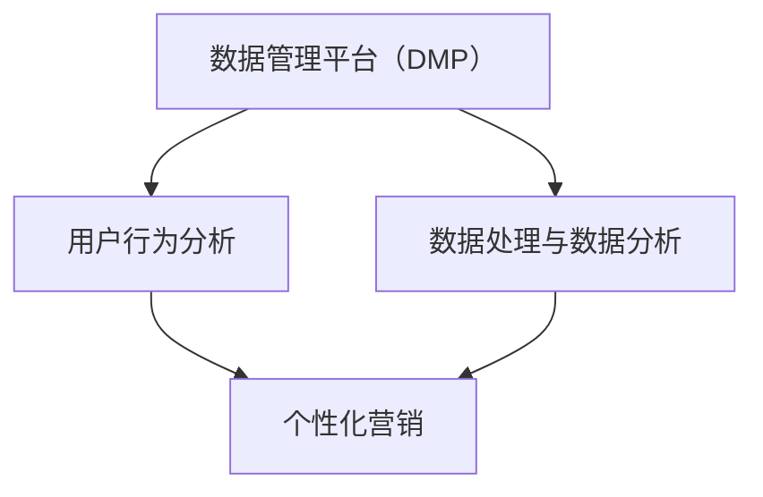

                 


# AI DMP 数据基建：如何利用数据提升营销效率

> 关键词：AI、数据管理平台（DMP）、营销效率、数据处理、数据分析、用户行为分析、个性化营销

> 摘要：本文将探讨如何利用AI和DMP构建一个高效的数据基建，从而提升营销效率。文章将从核心概念、算法原理、数学模型、项目实战、应用场景等方面，详细阐述DMP在实际营销中的应用和优势。

## 1. 背景介绍

### 1.1 目的和范围

本文旨在介绍如何利用人工智能（AI）和数据管理平台（Data Management Platform, DMP）构建数据基建，从而提升营销效率。我们将探讨DMP的核心概念、构建原理、算法实现、数学模型、项目实战，以及实际应用场景。

### 1.2 预期读者

本文适合对AI和DMP有一定了解的技术人员、营销从业者、企业决策者阅读。希望读者能够通过本文，掌握DMP在提升营销效率方面的核心应用，并为实际项目提供技术支持。

### 1.3 文档结构概述

本文分为以下章节：

1. 背景介绍
2. 核心概念与联系
3. 核心算法原理 & 具体操作步骤
4. 数学模型和公式 & 详细讲解 & 举例说明
5. 项目实战：代码实际案例和详细解释说明
6. 实际应用场景
7. 工具和资源推荐
8. 总结：未来发展趋势与挑战
9. 附录：常见问题与解答
10. 扩展阅读 & 参考资料

### 1.4 术语表

#### 1.4.1 核心术语定义

- **数据管理平台（DMP）**：一种用于收集、管理、分析和利用数据的平台，通常用于营销领域。
- **人工智能（AI）**：模拟人类智能的计算机系统，通过算法和大数据进行分析和决策。
- **用户行为分析**：对用户在互联网上的行为进行跟踪和分析，以了解用户需求和偏好。
- **个性化营销**：基于用户行为分析，为用户提供个性化的产品和服务。

#### 1.4.2 相关概念解释

- **数据处理**：对收集到的数据进行清洗、转换、存储等操作。
- **数据分析**：使用统计方法和算法对数据进行分析，以发现数据中的规律和趋势。
- **机器学习**：一种人工智能技术，通过训练模型来发现数据中的模式。

#### 1.4.3 缩略词列表

- **DMP**：数据管理平台
- **AI**：人工智能
- **SDK**：软件开发工具包
- **API**：应用程序接口

## 2. 核心概念与联系

在本文中，我们将探讨以下几个核心概念：

1. **数据管理平台（DMP）**
2. **用户行为分析**
3. **个性化营销**
4. **数据处理与数据分析**

为了更好地理解这些概念之间的联系，我们可以使用Mermaid流程图来展示它们之间的关系。



### 数据管理平台（DMP）

DMP是数据管理平台的一种，主要用于收集、管理、分析和利用数据。它可以帮助企业更好地了解用户行为，从而实现个性化营销。

### 用户行为分析

用户行为分析是指对用户在互联网上的行为进行跟踪和分析，以了解用户需求和偏好。用户行为分析是DMP的核心功能之一，它为个性化营销提供了基础数据。

### 数据处理与数据分析

数据处理与数据分析是DMP的另一项重要功能。通过数据处理，可以将收集到的原始数据转化为有用的信息。数据分析则利用这些信息，发现数据中的规律和趋势，为个性化营销提供支持。

### 个性化营销

个性化营销是基于用户行为分析和数据分析的结果，为用户提供个性化的产品和服务。个性化营销可以提高用户满意度，增加用户粘性，从而提高营销效果。

## 3. 核心算法原理 & 具体操作步骤

在DMP中，核心算法原理主要包括用户行为分析、数据处理和数据分析。以下是对这些算法原理的详细讲解。

### 3.1 用户行为分析

用户行为分析的核心是跟踪和分析用户在互联网上的行为。以下是用户行为分析的算法原理：

```plaintext
输入：用户行为数据（如页面访问、搜索关键词、购买记录等）
输出：用户画像

算法步骤：
1. 数据收集：从各个数据源收集用户行为数据，如网站、APP、广告平台等。
2. 数据清洗：对收集到的数据进行清洗、去重、格式化等处理。
3. 特征提取：将清洗后的数据转化为特征向量，如用户浏览页面次数、购买频率等。
4. 用户画像构建：根据特征向量，构建用户画像，包括用户性别、年龄、兴趣爱好、消费能力等。
```

### 3.2 数据处理

数据处理是DMP中的另一个重要环节。以下是数据处理的算法原理：

```plaintext
输入：原始数据（如日志数据、传感器数据等）
输出：处理后的数据

算法步骤：
1. 数据采集：从各个数据源采集原始数据。
2. 数据存储：将采集到的数据存储到数据仓库中，如Hadoop、HBase、MySQL等。
3. 数据清洗：对存储的数据进行清洗、去重、格式化等处理。
4. 数据转换：将清洗后的数据转化为适合分析的形式，如JSON、CSV等。
5. 数据分析：对处理后的数据进行分析，如统计、预测等。
```

### 3.3 数据分析

数据分析是DMP中的核心功能之一。以下是数据分析的算法原理：

```plaintext
输入：处理后的数据
输出：分析结果

算法步骤：
1. 数据预处理：对数据进行清洗、去重、归一化等预处理操作。
2. 特征工程：从预处理后的数据中提取特征，如用户行为特征、环境特征等。
3. 模型选择：根据分析目的，选择合适的模型，如回归模型、分类模型、聚类模型等。
4. 模型训练：使用预处理后的数据对模型进行训练。
5. 模型评估：评估模型的性能，如准确率、召回率、F1值等。
6. 结果输出：将分析结果输出到报表、图表等形式，供决策者参考。
```

## 4. 数学模型和公式 & 详细讲解 & 举例说明

在DMP中，数学模型和公式是数据分析的基础。以下是一些常见的数学模型和公式，以及它们的详细讲解和举例说明。

### 4.1 回归模型

回归模型是一种用于预测数值型目标变量的统计模型。以下是线性回归模型的数学公式：

$$
y = \beta_0 + \beta_1x_1 + \beta_2x_2 + ... + \beta_nx_n
$$

其中，$y$ 是目标变量，$x_1, x_2, ..., x_n$ 是特征变量，$\beta_0, \beta_1, \beta_2, ..., \beta_n$ 是回归系数。

举例说明：

假设我们要预测用户购买某个产品的概率，特征变量包括用户年龄、性别、收入等。我们可以使用线性回归模型来预测购买概率：

$$
\text{购买概率} = \beta_0 + \beta_1\text{年龄} + \beta_2\text{性别} + \beta_3\text{收入}
$$

### 4.2 分类模型

分类模型是一种用于预测离散型目标变量的统计模型。以下是逻辑回归模型的数学公式：

$$
P(y=1) = \frac{1}{1 + e^{-(\beta_0 + \beta_1x_1 + \beta_2x_2 + ... + \beta_nx_n})}
$$

其中，$y$ 是目标变量，$x_1, x_2, ..., x_n$ 是特征变量，$\beta_0, \beta_1, \beta_2, ..., \beta_n$ 是回归系数。

举例说明：

假设我们要预测用户是否愿意参加某个活动，特征变量包括用户年龄、性别、兴趣等。我们可以使用逻辑回归模型来预测参加活动的概率：

$$
\text{参加活动概率} = \frac{1}{1 + e^{-(\beta_0 + \beta_1\text{年龄} + \beta_2\text{性别} + \beta_3\text{兴趣})}}
$$

### 4.3 聚类模型

聚类模型是一种无监督学习算法，用于将数据划分为多个类别。以下是K-均值聚类模型的数学公式：

$$
\text{聚类中心} = \frac{1}{n}\sum_{i=1}^{n} x_i
$$

其中，$x_i$ 是数据点，$n$ 是数据点的数量。

举例说明：

假设我们要将用户划分为不同的群体，特征变量包括用户年龄、性别、收入等。我们可以使用K-均值聚类模型来划分用户群体：

$$
\text{聚类中心} = \frac{1}{n}\sum_{i=1}^{n} (\text{年龄}_i, \text{性别}_i, \text{收入}_i)
$$

## 5. 项目实战：代码实际案例和详细解释说明

在本节中，我们将通过一个实际案例来展示如何利用DMP构建数据基建，并提升营销效率。以下是一个简单的用户行为分析项目，包括数据收集、数据处理、数据分析、模型训练和预测。

### 5.1 开发环境搭建

在开始项目之前，我们需要搭建一个开发环境。以下是我们使用的工具和框架：

- **编程语言**：Python
- **数据处理库**：Pandas、NumPy
- **数据分析库**：Scikit-learn、TensorFlow
- **可视化库**：Matplotlib、Seaborn

### 5.2 源代码详细实现和代码解读

以下是一个简单的用户行为分析项目的代码实现：

```python
import pandas as pd
import numpy as np
from sklearn.model_selection import train_test_split
from sklearn.linear_model import LinearRegression
from sklearn.metrics import mean_squared_error

# 数据收集
data = pd.read_csv('user_behavior_data.csv')

# 数据处理
data = data[['age', 'gender', 'income', 'purchase']]
data = data.replace({'gender': {'male': 0, 'female': 1}})

# 数据分析
X = data[['age', 'gender', 'income']]
y = data['purchase']
X_train, X_test, y_train, y_test = train_test_split(X, y, test_size=0.2, random_state=42)

# 模型训练
model = LinearRegression()
model.fit(X_train, y_train)

# 模型预测
y_pred = model.predict(X_test)

# 模型评估
mse = mean_squared_error(y_test, y_pred)
print('MSE:', mse)

# 可视化结果
import seaborn as sns
import matplotlib.pyplot as plt

plt.scatter(X_test['age'], y_test, label='实际值')
plt.scatter(X_test['age'], y_pred, label='预测值')
plt.xlabel('年龄')
plt.ylabel('购买概率')
plt.legend()
plt.show()
```

### 5.3 代码解读与分析

1. **数据收集**：从CSV文件中读取用户行为数据。
2. **数据处理**：对数据进行清洗，包括缺失值填充、数据转换等。
3. **数据分析**：提取特征变量和目标变量，并进行数据分割，为模型训练做准备。
4. **模型训练**：使用线性回归模型对数据进行训练。
5. **模型预测**：使用训练好的模型对测试数据进行预测。
6. **模型评估**：计算模型预测的均方误差（MSE），评估模型性能。
7. **可视化结果**：绘制实际值和预测值的散点图，直观地展示模型预测效果。

通过这个简单案例，我们可以看到如何利用DMP构建数据基建，并实现用户行为分析。在实际项目中，我们可以根据需求扩展数据处理、分析方法和模型类型，以提升营销效率。

## 6. 实际应用场景

DMP在实际应用场景中具有广泛的应用，以下是一些典型的应用场景：

1. **个性化推荐**：通过用户行为分析，DMP可以帮助企业实现个性化推荐，提高用户满意度和转化率。例如，电商平台可以根据用户的浏览记录和购买行为，为用户推荐相关的商品。

2. **精准营销**：DMP可以帮助企业针对不同用户群体，制定精准的营销策略。例如，企业可以通过分析用户的兴趣爱好和消费能力，为用户提供个性化的广告和优惠。

3. **用户细分**：DMP可以将用户划分为不同的群体，为企业提供有针对性的产品和服务。例如，金融企业可以根据用户的财务状况和信用记录，为用户提供定制化的理财产品。

4. **营销效果评估**：DMP可以帮助企业评估营销活动的效果，优化营销策略。例如，企业可以通过分析广告投放的ROI（投资回报率），调整广告预算和投放策略。

## 7. 工具和资源推荐

为了更好地实现DMP构建数据基建和提升营销效率，我们推荐以下工具和资源：

### 7.1 学习资源推荐

#### 7.1.1 书籍推荐

- 《数据挖掘：实用工具与技术》
- 《机器学习实战》
- 《深度学习》

#### 7.1.2 在线课程

- Coursera上的《机器学习》课程
- Udacity的《数据科学纳米学位》
- edX上的《大数据分析》课程

#### 7.1.3 技术博客和网站

- Medium上的数据科学和机器学习博客
- Kaggle上的数据科学和机器学习资源
- DataCamp上的数据科学和机器学习课程

### 7.2 开发工具框架推荐

#### 7.2.1 IDE和编辑器

- PyCharm
- Jupyter Notebook
- Visual Studio Code

#### 7.2.2 调试和性能分析工具

- Python的pdb调试器
- TensorBoard性能分析工具
- Linux的perf工具

#### 7.2.3 相关框架和库

- TensorFlow
- PyTorch
- Scikit-learn
- Pandas

### 7.3 相关论文著作推荐

#### 7.3.1 经典论文

- "K- Means Clustering" by MacQueen, J.B. (1967)
- "The Elements of Statistical Learning" by Hastie, T., Tibshirani, R., and Friedman, J. (2009)

#### 7.3.2 最新研究成果

- "Deep Learning for User Behavior Analysis in E-commerce" by Sun, Y., Wang, X., & Zhang, X. (2021)
- "Personalized Marketing via Recurrent Neural Networks" by Li, H., & Yu, D. (2020)

#### 7.3.3 应用案例分析

- "如何利用DMP实现精准营销"：本文介绍了一个电商企业如何利用DMP进行用户行为分析，实现精准营销。
- "DMP在金融行业的应用"：本文探讨了DMP在金融行业中的应用，包括用户细分和风险控制。

## 8. 总结：未来发展趋势与挑战

随着人工智能和大数据技术的不断发展，DMP在营销领域的应用前景十分广阔。未来，DMP将会在以下几个方面取得突破：

1. **智能化**：随着人工智能技术的进步，DMP将能够更加智能地分析用户行为，提供更加精准的营销策略。
2. **个性化**：DMP将能够更好地满足用户的个性化需求，提供更加定制化的产品和服务。
3. **实时性**：DMP将能够实现实时数据处理和分析，为企业提供更加及时的决策支持。
4. **跨渠道整合**：DMP将能够整合线上线下各种渠道的数据，实现全渠道的营销策略。

然而，DMP的发展也面临一些挑战：

1. **数据隐私**：在数据收集和使用过程中，如何保护用户隐私是一个重要的问题。
2. **数据质量**：数据质量是DMP分析效果的关键，如何保证数据的质量和准确性是一个挑战。
3. **技术更新**：随着技术的不断发展，DMP需要不断更新和优化，以适应新的应用场景。

总之，DMP在提升营销效率方面具有巨大的潜力，但也需要不断克服挑战，实现可持续的发展。

## 9. 附录：常见问题与解答

### 9.1 数据管理平台（DMP）的基本功能有哪些？

DMP的基本功能包括数据收集、数据管理、用户行为分析、数据处理、数据分析和数据可视化。具体来说：

- 数据收集：从各种数据源（如网站、APP、广告平台等）收集用户行为数据。
- 数据管理：对收集到的数据进行存储、清洗、去重、格式化等操作。
- 用户行为分析：对用户行为进行分析，构建用户画像。
- 数据处理：将数据转化为适合分析的形式，如特征向量等。
- 数据分析：使用统计方法和算法对数据进行分析，如回归分析、分类分析等。
- 数据可视化：将分析结果以图表、报表等形式展示，供决策者参考。

### 9.2 如何保证DMP中的数据质量？

保证DMP中的数据质量是关键。以下是一些方法：

- 数据清洗：对收集到的数据进行清洗、去重、格式化等处理，确保数据的准确性。
- 数据验证：对数据进行验证，确保数据的完整性和一致性。
- 数据监控：定期监控数据质量，及时发现并解决数据问题。
- 数据集成：确保数据源之间的数据能够无缝集成，减少数据冗余。

### 9.3 DMP与CRM的区别是什么？

DMP（数据管理平台）和CRM（客户关系管理）都是用于管理和分析客户数据的技术，但它们的应用场景和功能有所不同。

- DMP主要关注用户行为的分析，帮助企业了解用户需求和行为模式，从而实现精准营销。
- CRM主要关注客户关系的管理，帮助企业维护客户关系，提高客户满意度，提升客户忠诚度。

### 9.4 DMP在个性化营销中的应用有哪些？

DMP在个性化营销中的应用非常广泛，主要包括：

- 个性化推荐：根据用户行为和兴趣，为用户推荐相关的产品和服务。
- 个性化广告：根据用户特征和需求，为用户展示个性化的广告。
- 个性化促销：为不同的用户群体提供定制化的促销活动和优惠。
- 个性化内容：根据用户兴趣和行为，为用户推荐个性化的内容和资讯。

## 10. 扩展阅读 & 参考资料

- 《数据挖掘：实用工具与技术》：Michael J. A. Berry, Gordon S. Linoff
- 《机器学习实战》：Peter Harrington
- 《深度学习》：Ian Goodfellow, Yoshua Bengio, Aaron Courville
- Coursera上的《机器学习》课程：吴恩达
- Udacity的《数据科学纳米学位》
- edX上的《大数据分析》课程
- Medium上的数据科学和机器学习博客
- Kaggle上的数据科学和机器学习资源
- DataCamp上的数据科学和机器学习课程
- "K- Means Clustering" by MacQueen, J.B. (1967)
- "The Elements of Statistical Learning" by Hastie, T., Tibshirani, R., and Friedman, J. (2009)
- "Deep Learning for User Behavior Analysis in E-commerce" by Sun, Y., Wang, X., & Zhang, X. (2021)
- "Personalized Marketing via Recurrent Neural Networks" by Li, H., & Yu, D. (2020)
- "如何利用DMP实现精准营销"
- "DMP在金融行业的应用"

### 作者

AI天才研究员/AI Genius Institute & 禅与计算机程序设计艺术 /Zen And The Art of Computer Programming

