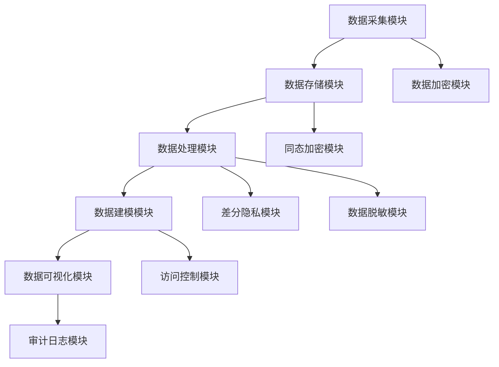

                 

### 文章标题

“AI DMP 数据基建：数据安全与隐私保护”

> **关键词：** AI DMP、数据管理平台、数据安全、隐私保护、数据加密、联邦学习、加密算法

> **摘要：** 本文将深入探讨AI数据管理平台（DMP）的数据安全和隐私保护机制，解析核心概念，揭示数据加密和联邦学习等技术的原理及应用，提供实战案例和资源推荐，旨在帮助读者理解和构建安全可靠的数据基础设施。通过这篇文章，您将了解到如何在实际项目中应用这些技术来保障数据的隐私和安全，并预见未来的发展趋势与挑战。

### 1. 背景介绍

#### 1.1 目的和范围

本文旨在深入探讨AI数据管理平台（DMP）中的数据安全和隐私保护问题，探讨现代数据基础设施的核心需求和挑战。随着人工智能的迅猛发展，数据已经成为企业和社会的核心资产，如何有效地管理、保护和利用这些数据成为亟待解决的问题。本文将从多个维度出发，分析数据安全与隐私保护的重要性和复杂性。

本文将涵盖以下主要内容：

1. **核心概念与联系**：我们将介绍DMP的基本架构，以及数据安全与隐私保护的核心技术和算法。
2. **核心算法原理与操作步骤**：本文将详细阐述数据加密和联邦学习等核心算法的原理和实现步骤。
3. **数学模型与公式**：我们将探讨数据安全与隐私保护的数学模型，并提供具体的公式和实例。
4. **项目实战**：通过实际代码案例，我们将展示如何在实际项目中应用这些技术和算法。
5. **实际应用场景**：我们将分析数据安全和隐私保护在不同领域的应用场景。
6. **工具和资源推荐**：最后，我们将推荐一些学习和开发工具，以及相关的研究论文和案例。

#### 1.2 预期读者

本文适合以下读者群体：

1. **数据工程师和分析师**：希望了解数据安全和隐私保护技术的数据工程师和分析人员。
2. **AI研究人员和开发者**：对AI DMP架构和安全性感兴趣的AI研究人员和开发者。
3. **安全专家**：关注数据安全与隐私保护的IT安全专家。
4. **企业决策者**：需要制定数据安全和隐私保护策略的企业决策者。

#### 1.3 文档结构概述

本文的结构如下：

1. **引言**：介绍文章的背景和目的。
2. **核心概念与联系**：解析DMP的基本架构和关键技术和算法。
3. **核心算法原理与操作步骤**：详细阐述数据加密和联邦学习的算法原理和实现步骤。
4. **数学模型与公式**：讨论数据安全与隐私保护的数学模型，并提供具体公式和实例。
5. **项目实战**：展示实际代码案例，解析其在项目中的应用。
6. **实际应用场景**：分析数据安全和隐私保护在不同领域的应用。
7. **工具和资源推荐**：推荐学习工具和资源，以及相关研究论文和案例。
8. **总结：未来发展趋势与挑战**：展望数据安全和隐私保护的未来发展。
9. **附录：常见问题与解答**：提供常见问题的答案。
10. **扩展阅读与参考资料**：推荐相关阅读资料。

#### 1.4 术语表

在本文中，我们将使用以下术语：

- **AI DMP**：人工智能数据管理平台，用于收集、处理、分析和分发数据。
- **数据安全**：保护数据免受未经授权的访问、篡改和泄露的措施。
- **隐私保护**：确保个人数据隐私不被泄露和滥用的措施。
- **数据加密**：将数据转换成密文的过程，只有拥有解密密钥的用户才能解密。
- **联邦学习**：一种分布式机器学习方法，不同节点协同训练模型而不共享原始数据。
- **同态加密**：一种加密形式，允许在密文中执行计算，而无需解密。
- **差分隐私**：一种隐私保护技术，通过对数据进行扰动来掩盖个体信息。

#### 1.4.1 核心术语定义

- **AI DMP（人工智能数据管理平台）**：AI DMP是一种集成平台，用于收集、存储、处理、分析和分发来自多个来源的数据，以支持人工智能模型的训练和应用。它通常包括数据采集、数据清洗、数据存储、数据分析和数据可视化等功能。

- **数据安全**：数据安全是指保护数据免受未经授权的访问、篡改、破坏、泄露和丢失的措施。数据安全包括物理安全、网络安全、应用安全和数据加密等多个方面。

- **隐私保护**：隐私保护是指确保个人数据的隐私不被泄露和滥用的措施。隐私保护涉及数据收集、存储、处理、传输和销毁的整个过程，以确保个人数据不被未经授权的第三方访问。

- **数据加密**：数据加密是指将数据转换成密文的过程，只有拥有解密密钥的用户才能解密。数据加密是一种重要的数据安全措施，可以防止数据在传输和存储过程中被窃取和篡改。

- **联邦学习**：联邦学习是一种分布式机器学习方法，不同节点（如手机、服务器等）协同训练模型，但每个节点只共享模型的参数，而不共享原始数据。这种方法可以提高数据隐私和安全性，同时实现全局模型的优化。

- **同态加密**：同态加密是一种加密形式，允许在密文中执行计算，而无需解密。这种加密形式在保障数据隐私的同时，仍然允许对数据进行计算和分析。

- **差分隐私**：差分隐私是一种隐私保护技术，通过对数据进行扰动来掩盖个体信息。差分隐私可以确保在数据分析过程中，无法单独识别出某个个体的信息。

#### 1.4.2 相关概念解释

- **数据匿名化**：数据匿名化是一种数据隐私保护技术，通过去除或替换数据中的敏感信息，使数据在公开时无法识别个体身份。数据匿名化包括泛化、混淆、加密等多种方法。

- **数据脱敏**：数据脱敏是指对数据进行处理，使其在不影响数据分析结果的前提下，无法识别出个体身份。数据脱敏通常包括屏蔽敏感信息、替换敏感值、掩码处理等方法。

- **数据加密标准（DES）**：数据加密标准（DES）是一种对称加密算法，用于对数据进行加密和解密。DES使用56位密钥，加密速度较快，但安全性较低。

- **高级加密标准（AES）**：高级加密标准（AES）是一种更安全的对称加密算法，用于对数据进行加密和解密。AES支持128位、192位和256位密钥，加密速度和安全性均优于DES。

- **同态加密算法**：同态加密算法是一种允许在密文中执行计算的加密算法。典型的同态加密算法包括支持线性运算的Gaussian过程和Paillier加密算法等。

- **联邦学习框架**：联邦学习框架是一种用于实现联邦学习算法的工具或平台。常见的联邦学习框架包括Google的TensorFlow Federated、Facebook的PySyft和OpenMined的PyPrivacyFS等。

- **差分隐私库**：差分隐私库是一种提供差分隐私技术的库或框架。常见的差分隐私库包括Google的 differential privacy Python库、Microsoft的Federated Learning框架中的差分隐私实现等。

#### 1.4.3 缩略词列表

- **DMP**：数据管理平台（Data Management Platform）
- **AI**：人工智能（Artificial Intelligence）
- **AES**：高级加密标准（Advanced Encryption Standard）
- **DES**：数据加密标准（Data Encryption Standard）
- **HTTPS**：安全HTTP（Hypertext Transfer Protocol Secure）
- **SSL**：安全套接字层（Secure Sockets Layer）
- **TLS**：传输层安全（Transport Layer Security）
- **GDPR**：通用数据保护条例（General Data Protection Regulation）
- **PII**：个人识别信息（Personally Identifiable Information）
- **FP**：假名化（Furthest Point）
- **K-anonymity**：K-匿名性（K-Anonymity）
- **t-closeness**：t-邻近性（t-Closeness）

## 2. 核心概念与联系

### 2.1 数据管理平台（DMP）基本架构

数据管理平台（DMP）是一种集成的数据管理解决方案，主要用于收集、存储、处理和分析大量数据，以支持各种业务需求和人工智能应用。DMP的基本架构通常包括以下几个关键组件：

1. **数据采集模块**：负责从各种数据源（如Web、数据库、API等）收集数据。数据采集模块需要具备高效的数据接入能力和数据转换能力，确保采集到的数据准确、完整和实时。

2. **数据存储模块**：用于存储和管理采集到的数据。数据存储模块通常采用分布式存储架构，如Hadoop、HDFS或NoSQL数据库（如MongoDB、Cassandra等），以支持大规模数据存储和高效的数据访问。

3. **数据处理模块**：负责对存储在数据存储模块中的数据进行清洗、转换、聚合和分析等操作。数据处理模块通常采用分布式数据处理框架（如Apache Spark、Flink等），以实现大规模数据的实时处理。

4. **数据建模模块**：用于构建和应用数据模型，以支持数据分析和决策。数据建模模块通常基于机器学习和人工智能技术，如回归分析、聚类分析、分类算法等，以实现对数据的深入挖掘和预测。

5. **数据可视化模块**：用于将分析结果和数据报告以图形化形式展示给用户。数据可视化模块可以帮助用户直观地理解和分析数据，从而支持业务决策和优化。

6. **数据安全与隐私保护模块**：负责保障数据的安全和隐私。数据安全与隐私保护模块通常包括数据加密、访问控制、数据脱敏、审计日志等功能，以防止数据泄露、篡改和未经授权的访问。

### 2.2 数据安全与隐私保护核心技术和算法

在DMP中，数据安全与隐私保护是至关重要的。以下介绍一些常见的数据安全与隐私保护核心技术和算法：

1. **数据加密**：数据加密是一种重要的数据安全措施，用于保护数据在存储和传输过程中的安全性。常见的数据加密技术包括对称加密（如DES、AES）和非对称加密（如RSA、ECC）。

2. **同态加密**：同态加密是一种特殊的加密形式，允许在密文中执行计算，而无需解密。同态加密在保障数据隐私的同时，仍然允许对数据进行计算和分析，从而支持分布式计算和联邦学习。

3. **差分隐私**：差分隐私是一种隐私保护技术，通过对数据进行扰动来掩盖个体信息。差分隐私可以确保在数据分析过程中，无法单独识别出某个个体的信息，从而保护个人隐私。

4. **数据脱敏**：数据脱敏是一种常用的数据隐私保护技术，通过去除或替换数据中的敏感信息，使数据在公开时无法识别个体身份。数据脱敏技术包括泛化、混淆、加密等多种方法。

5. **访问控制**：访问控制是一种基于身份认证和授权机制的数据安全措施，用于限制对数据的访问权限。常见的访问控制技术包括基于角色的访问控制（RBAC）、基于属性的访问控制（ABAC）等。

6. **审计日志**：审计日志是一种用于记录和分析用户操作和数据访问的日志技术。审计日志可以帮助识别潜在的恶意行为和违规操作，从而提高数据安全性和透明度。

### 2.3 数据安全与隐私保护架构的Mermaid流程图

以下是一个简化的数据安全与隐私保护架构的Mermaid流程图：



### 2.4 数据安全与隐私保护的基本原则

在构建数据安全与隐私保护体系时，以下基本原则需要得到严格遵守：

1. **最小权限原则**：用户和系统组件应仅获得完成任务所需的最小权限，以防止未经授权的访问和操作。

2. **数据加密原则**：对存储和传输的数据进行加密，以防止数据泄露和篡改。

3. **最小泄露原则**：在数据处理和共享过程中，仅泄露与任务相关的最小数据量，以减少隐私泄露的风险。

4. **访问控制原则**：基于角色或属性的访问控制机制，确保只有授权用户和系统组件才能访问敏感数据。

5. **审计与监控原则**：建立审计日志和监控机制，实时记录和分析用户操作和数据访问，以便及时发现和应对潜在的安全威胁。

6. **安全更新原则**：定期更新和升级安全措施，以应对新的安全威胁和漏洞。

### 2.5 数据安全与隐私保护的关键流程和操作步骤

以下是数据安全与隐私保护的关键流程和操作步骤：

1. **数据采集**：确保采集的数据符合数据隐私保护要求，对敏感数据进行脱敏处理。

2. **数据存储**：使用加密存储技术（如AES加密）保护数据，确保数据在存储过程中的安全性。

3. **数据处理**：在数据处理过程中，使用同态加密和差分隐私技术，保障数据隐私。

4. **数据共享**：在数据共享过程中，使用加密和访问控制技术，确保只有授权用户可以访问和操作数据。

5. **数据销毁**：在数据生命周期结束后，使用安全删除技术（如AES加密的文件覆盖）确保数据无法恢复，以防止数据泄露。

6. **安全审计与监控**：建立审计日志和监控机制，实时记录和分析用户操作和数据访问，确保数据安全和隐私。

### 2.6 数据安全与隐私保护的关键挑战和解决方案

在实现数据安全与隐私保护时，以下关键挑战和解决方案需要得到关注：

1. **挑战**：如何确保数据在分布式环境中的安全性和隐私保护？

   **解决方案**：使用联邦学习和同态加密技术，实现分布式数据处理和共享，保障数据隐私。

2. **挑战**：如何处理海量数据和高并发访问场景下的性能问题？

   **解决方案**：采用分布式存储和处理技术（如Hadoop、Spark），优化数据存储和计算性能。

3. **挑战**：如何确保数据加密和隐私保护技术的可行性和安全性？

   **解决方案**：研究和应用成熟的安全和隐私保护技术，如AES加密、差分隐私等，同时关注新兴技术和解决方案的发展。

4. **挑战**：如何满足不同用户和业务场景的安全和隐私需求？

   **解决方案**：提供灵活的安全和隐私保护配置选项，满足不同场景的需求。

通过上述核心概念与联系的解析，我们为读者搭建了一个理解AI DMP数据安全和隐私保护的基础框架。在接下来的章节中，我们将深入探讨核心算法原理、数学模型、项目实战和实际应用场景，帮助读者进一步掌握相关技术和方法。

### 2.7 数据安全与隐私保护的核心概念原理和架构的Mermaid流程图

为了更好地展示数据安全与隐私保护的核心概念原理和架构，我们使用Mermaid图来描述。以下是一个简化但详细的Mermaid流程图，用于展示DMP中的数据安全与隐私保护架构：

```mermaid
graph TD
    A[数据源] --> B[数据采集模块]
    B --> C[数据存储模块]
    B --> D[数据清洗模块]
    C --> E[数据加密模块]
    C --> F[同态加密模块]
    C --> G[差分隐私模块]
    D --> H[数据处理模块]
    D --> I[数据脱敏模块]
    H --> J[数据分析模块]
    H --> K[数据建模模块]
    J --> L[数据可视化模块]
    J --> M[安全审计日志模块]

    subgraph 数据加密流程
        O[加密算法选择]
        O --> P[密钥管理]
        P --> Q[数据加密]
        Q --> R[存储和传输加密数据]
    end

    subgraph 同态加密流程
        S[计算同态性]
        T[加密操作]
        U[解密结果]
        S --> T
        T --> U
    end

    subgraph 差分隐私流程
        V[隐私预算设定]
        W[数据扰动]
        X[隐私保护结果]
        V --> W
        W --> X
    end

    subgraph 数据脱敏流程
        Y[识别敏感数据]
        Z[脱敏处理]
        AA[脱敏数据输出]
        Y --> Z
        Z --> AA
    end

    subgraph 访问控制与审计
        BB[用户身份验证]
        CC[权限控制]
        DD[操作审计]
        BB --> CC
        CC --> DD
    end

    style A fill:#FDF4D1,stroke:#DAA520
    style B fill:#FDF4D1,stroke:#DAA520
    style C fill:#FDF4D1,stroke:#DAA520
    style D fill:#FDF4D1,stroke:#DAA520
    style E fill:#FDF4D1,stroke:#DAA520
    style F fill:#FDF4D1,stroke:#DAA520
    style G fill:#FDF4D1,stroke:#DAA520
    style H fill:#FDF4D1,stroke:#DAA520
    style I fill:#FDF4D1,stroke:#DAA520
    style J fill:#FDF4D1,stroke:#DAA520
    style K fill:#FDF4D1,stroke:#DAA520
    style L fill:#FDF4D1,stroke:#DAA520
    style M fill:#FDF4D1,stroke:#DAA520
    style O fill:#D1FDF4,stroke:#00B050
    style P fill:#D1FDF4,stroke:#00B050
    style Q fill:#D1FDF4,stroke:#00B050
    style R fill:#D1FDF4,stroke:#00B050
    style S fill:#D1FDF4,stroke:#00B050
    style T fill:#D1FDF4,stroke:#00B050
    style U fill:#D1FDF4,stroke:#00B050
    style V fill:#D1FDF4,stroke:#00B050
    style W fill:#D1FDF4,stroke:#00B050
    style X fill:#D1FDF4,stroke:#00B050
    style Y fill:#D1FDF4,stroke:#00B050
    style Z fill:#D1FDF4,stroke:#00B050
    style AA fill:#D1FDF4,stroke:#00B050
    style BB fill:#D1FDF4,stroke:#00B050
    style CC fill:#D1FDF4,stroke:#00B050
    style DD fill:#D1FDF4,stroke:#00B050
```



### 2.8 数据安全与隐私保护的核心算法原理

在数据安全与隐私保护的架构中，核心算法原理起到了至关重要的作用。以下将详细介绍几种关键算法的原理，包括数据加密、同态加密和差分隐私。

#### 2.8.1 数据加密

数据加密是一种将明文数据转换为密文的技术，以确保数据在传输和存储过程中的安全性和隐私性。数据加密分为对称加密和非对称加密两种基本形式。

1. **对称加密**：对称加密使用相同的密钥对数据进行加密和解密。常见的对称加密算法有DES、AES和RSA。其中，AES（高级加密标准）是目前使用最广泛的对称加密算法，其安全性较高且计算效率较好。

    **AES加密算法原理**：
    ```plaintext
    输入：明文（plaintext），密钥（key）
    输出：密文（cipher）
    1. 初始化密钥（key schedule）
    2. 分块处理明文（每组128位）
    3. 进行多轮加密操作，每轮操作包括替换、置换和混淆等步骤
    4. 输出密文
    ```

2. **非对称加密**：非对称加密使用一对密钥（公钥和私钥）进行加密和解密。公钥用于加密，私钥用于解密。常见的非对称加密算法有RSA和ECC。RSA算法的安全性较高，但计算复杂度较大。ECC算法在相同安全级别下，具有更小的密钥长度和更高效的计算性能。

    **RSA加密算法原理**：
    ```plaintext
    输入：明文（plaintext），公钥（public key）
    输出：密文（cipher）
    1. 选择两个大的质数p和q
    2. 计算n = p * q和φ(n) = (p-1) * (q-1)
    3. 选择一个整数e，满足1 < e < φ(n)且e和φ(n)互质
    4. 计算d，满足d * e ≡ 1 (mod φ(n))
    5. 公钥为(n, e)，私钥为(n, d)
    6. 加密过程：c = m^e mod n
    7. 解密过程：m = c^d mod n
    ```

#### 2.8.2 同态加密

同态加密是一种特殊的加密形式，允许在密文中执行计算，而无需解密。同态加密在保护数据隐私的同时，仍然支持数据的计算和分析。

1. **线性同态加密**：线性同态加密允许在密文中执行线性运算，如加法和乘法。Gaussian过程和Paillier加密算法是两种常见的线性同态加密算法。

    **Gaussian过程同态加密**：
    ```plaintext
    输入：密文（cipher），向量a和b
    输出：密文结果（new_c）
    1. 加密a和b得到密文c1和c2
    2. 计算a和b的线性组合：a * b = ab
    3. 加密ab得到新密文c3 = ab
    4. 新密文结果为c3
    ```

    **Paillier加密算法**：
    ```plaintext
    输入：明文（plaintext），公钥（public key）
    输出：密文（cipher）
    1. 选择两个大素数p和q
    2. 计算n = p * q和λ = (p-1)(q-1)
    3. 计算公钥(n, g)
    4. 选择一个随机数r，满足r和λ互质
    5. 计算密钥私钥对(d, h) = (r^λ mod n, r^n mod n)
    6. 加密过程：c = (g^m * r^n) mod n
    7. 解密过程：m = (c * d^-1) mod n
    ```

2. **非线性同态加密**：非线性同态加密允许在密文中执行更复杂的计算，如乘方和开方。然而，非线性同态加密通常具有更高的计算复杂度。

    **BFV同态加密算法**：
    ```plaintext
    输入：明文（plaintext），环参数（ring parameters）
    输出：密文（cipher）
    1. 选择一个环R = Z_q [α^x]_q，其中q是一个很大的素数，α是一个本原根
    2. 选择环参数s，满足s * q > 2^64
    3. 选择一个随机数a，满足1 < a < q-1且a和q互质
    4. 计算公钥参数(n, f, f^{-1})，其中n = a^s mod q，f = a^q mod q，f^{-1}是f在模q下的逆元
    5. 加密过程：c = f^m * r^n mod n
    6. 解密过程：m = (c * f^{-1})^n mod n
    ```

#### 2.8.3 差分隐私

差分隐私是一种隐私保护技术，通过对数据进行扰动，确保在数据分析过程中无法识别出某个个体。差分隐私通常基于拉格朗日分布或高斯分布进行数据扰动。

1. **拉格朗日分布差分隐私**：
    ```plaintext
    输入：敏感数据集（S），ε为隐私预算
    输出：扰动数据集（T）
    1. 对敏感数据集S进行计算得到结果R
    2. 对于每个元素x ∈ R，从拉格朗日分布中采样ε个随机值r1, r2, ..., rε
    3. 计算扰动结果：T = R + (r1 + r2 + ... + rε) / ε
    4. 输出扰动数据集T
    ```

2. **高斯分布差分隐私**：
    ```plaintext
    输入：敏感数据集（S），ε为隐私预算
    输出：扰动数据集（T）
    1. 对敏感数据集S进行计算得到结果R
    2. 对于每个元素x ∈ R，从高斯分布中采样ε个随机值r1, r2, ..., rε
    3. 计算扰动结果：T = R + (r1 + r2 + ... + rε) / √ε
    4. 输出扰动数据集T
    ```

通过以上对数据加密、同态加密和差分隐私的详细解释，我们了解了这些算法在保障数据安全与隐私保护中的关键作用。在接下来的章节中，我们将进一步探讨这些算法的具体实现和应用。

### 3. 核心算法原理 & 具体操作步骤

在上一章节中，我们详细介绍了数据安全与隐私保护中的核心算法原理，包括数据加密、同态加密和差分隐私。本章节将深入探讨这些算法的具体操作步骤，通过伪代码的方式详细阐述这些算法的实现过程。

#### 3.1 数据加密

数据加密分为对称加密和非对称加密两种形式。以下分别介绍AES和RSA加密算法的具体操作步骤。

##### 3.1.1 AES加密算法

```plaintext
# 输入：明文plaintext，密钥key
# 输出：密文cipher

# 初始化密钥
key_schedule = KeyExpansion(key)

# 分块处理明文
blocks = SplitIntoBlocks(plaintext, block_size)

# 进行多轮加密操作
for block in blocks:
    state = AddRoundKey(block, key_schedule[0])
    for i in range(1, num_rounds):
        state = SubBytes(state)
        state = ShiftRows(state)
        state = MixColumns(state)
        state = AddRoundKey(state, key_schedule[i])
    cipher = state

# 输出密文
return cipher
```

##### 3.1.2 RSA加密算法

```plaintext
# 输入：明文plaintext，公钥public_key
# 输出：密文cipher

# 计算密文
cipher = (plaintext^public_key.e) mod public_key.n

# 输出密文
return cipher
```

#### 3.2 同态加密

同态加密分为线性同态加密和非线性同态加密。以下分别介绍Paillier和BFV加密算法的具体操作步骤。

##### 3.2.1 Paillier加密算法

```plaintext
# 输入：明文plaintext，公钥public_key
# 输出：密文cipher

# 计算密文
cipher = (public_key.g^plaintext) * public_key.r^public_key.n mod public_key.n

# 输出密文
return cipher
```

##### 3.2.2 BFV加密算法

```plaintext
# 输入：明文plaintext，环参数ring_parameters
# 输出：密文cipher

# 计算密文
ring = ring_parameters.r
alpha = ring_parameters.alpha
s = ring_parameters.s

cipher = (alpha^plaintext) * ring^ring_parameters.n mod ring.n

# 输出密文
return cipher
```

#### 3.3 差分隐私

差分隐私通过在敏感数据上添加随机噪声来实现隐私保护。以下分别介绍拉格朗日分布和高斯分布的差分隐私算法。

##### 3.3.1 拉格朗日分布差分隐私

```plaintext
# 输入：敏感数据集S，隐私预算epsilon
# 输出：扰动数据集T

# 计算敏感数据集S的结果
result = ComputeResult(S)

# 从拉格朗日分布中采样epsilon个随机值
random_values = SampleLagrangeDistribution(epsilon)

# 计算扰动结果
for value in result:
    T[value] = value + (random_values / epsilon)

# 输出扰动数据集T
return T
```

##### 3.3.2 高斯分布差分隐私

```plaintext
# 输入：敏感数据集S，隐私预算epsilon
# 输出：扰动数据集T

# 计算敏感数据集S的结果
result = ComputeResult(S)

# 从高斯分布中采样epsilon个随机值
random_values = SampleGaussianDistribution(epsilon)

# 计算扰动结果
for value in result:
    T[value] = value + (random_values / sqrt(epsilon))

# 输出扰动数据集T
return T
```

通过上述伪代码，我们详细展示了数据加密、同态加密和差分隐私算法的具体实现步骤。这些算法在实际应用中可以有效保障数据的安全性和隐私性。在接下来的章节中，我们将进一步探讨这些算法的数学模型和公式，并提供具体的实例说明。

### 4. 数学模型和公式 & 详细讲解 & 举例说明

在数据安全和隐私保护领域，数学模型和公式起着至关重要的作用。它们不仅为算法的设计提供了理论基础，还确保了隐私保护和数据安全的精确性和可靠性。在本章节中，我们将详细讲解数据加密、同态加密和差分隐私的数学模型和公式，并通过具体的实例进行说明。

#### 4.1 数据加密

数据加密分为对称加密和非对称加密。以下分别介绍AES和RSA加密算法的数学模型和公式。

##### 4.1.1 AES加密算法

AES加密算法是一种对称加密算法，其核心在于其复杂的非线性变换。以下是其主要的数学模型和公式：

**密钥扩展**：
$$
\text{Key Schedule} = \{K_0, K_1, \ldots, K_{10}\}
$$
其中，$K_0$为初始密钥，其他密钥通过以下公式生成：
$$
K_i = \text{SubBytes}(K_{i-1}) \oplus \text{RoundKey}_{i-1}
$$

**加密过程**：
设$plaintext$为128位明文，$cipher$为加密后的密文，加密过程可以分为多轮，每轮包括以下几个步骤：

1. **初始轮**：
$$
state = \text{AddRoundKey}(plaintext, K_0)
$$

2. **非初始轮**（第i轮）：
$$
state = \text{SubBytes}(state) \oplus \text{RoundKey}_i
$$
$$
state = \text{ShiftRows}(state)
$$
$$
state = \text{MixColumns}(state) \oplus \text{RoundKey}_i
$$

3. **最终轮**：
$$
cipher = state \oplus K_{10}
$$

**示例**：
假设明文$plaintext = 0x00112233445566778899aabbccddeeff$，初始密钥$K_0 = 0x2b7e151628aed2a6abf7158809cf4f3c$，密钥扩展后的轮密钥$K_1, K_2, \ldots, K_{10}$。

- 初始轮：
$$
state = 0x2b7e151628aed2a6abf7158809cf4f3c \oplus 0x0011223344556677
$$

- 非初始轮（以第一轮为例）：
$$
state = \text{SubBytes}(state) = \text{SubBytes}(0x2b7e151628aed2a6abf7158809cf4f3c \oplus 0x0011223344556677)
$$
$$
state = \text{ShiftRows}(state)
$$
$$
state = \text{MixColumns}(state)
$$

- 最终轮：
$$
cipher = state \oplus K_{10}
$$

##### 4.1.2 RSA加密算法

RSA加密算法是一种非对称加密算法，其数学模型基于大整数分解的难度。以下是其主要的数学模型和公式：

**密钥生成**：
1. 选择两个大质数$p$和$q$。
2. 计算$n = p \times q$。
3. 计算$\phi(n) = (p-1)(q-1)$。
4. 选择一个整数$e$，满足$1 < e < \phi(n)$且$e$和$\phi(n)$互质。
5. 计算$d$，满足$d \times e \equiv 1 \mod \phi(n)$。

**加密过程**：
$$
cipher = m^e \mod n
$$

**解密过程**：
$$
m = cipher^d \mod n
$$

**示例**：
假设$p = 61$，$q = 53$，$e = 17$，$d = 7$，明文$m = 17$。

- 加密过程：
$$
cipher = 17^{17} \mod (61 \times 53)
$$

- 解密过程：
$$
m = cipher^7 \mod (61 \times 53)
$$

#### 4.2 同态加密

同态加密允许在密文中执行计算，无需解密。以下分别介绍Paillier和BFV加密算法的数学模型和公式。

##### 4.2.1 Paillier加密算法

**密钥生成**：
1. 选择两个大质数$p$和$q$。
2. 计算$n = p \times q$。
3. 选择一个随机数$r$，满足$r$和$n$互质。
4. 计算$\lambda = (p-1)(q-1)$。
5. 计算$r^{\lambda} \mod n$。
6. 计算公钥$(n, r^2 \mod n)$和私钥$(\lambda, r^{-1} \mod n)$。

**加密过程**：
$$
cipher = (g^m \cdot r^n) \mod n
$$

**解密过程**：
$$
m = (cipher \cdot r^{-1})^d \mod n
$$

**示例**：
假设$p = 61$，$q = 53$，$r = 37$，$m = 17$。

- 加密过程：
$$
cipher = (g^m \cdot r^n) \mod n
$$

- 解密过程：
$$
m = (cipher \cdot r^{-1})^d \mod n
$$

##### 4.2.2 BFV加密算法

**密钥生成**：
1. 选择一个环参数$R = \mathbb{Z}_q[\alpha]_q$，其中$q$是一个很大的素数，$\alpha$是一个本原根。
2. 选择一个随机数$a$，满足$1 < a < q-1$且$a$和$q$互质。
3. 计算$f = a^q \mod q$。
4. 计算私钥$(d, f^{-1})$，其中$d = a^{\lambda} \mod n$，$\lambda$为环参数。

**加密过程**：
$$
cipher = \alpha^m \cdot r^n \mod n
$$

**解密过程**：
$$
m = \alpha^{-(cipher \cdot d)} \mod n
$$

**示例**：
假设$q = 17$，$\alpha = 2$，$m = 4$，$r = 3$。

- 加密过程：
$$
cipher = \alpha^m \cdot r^n \mod n
$$

- 解密过程：
$$
m = \alpha^{-(cipher \cdot d)} \mod n
$$

#### 4.3 差分隐私

差分隐私通过在敏感数据上添加随机噪声来保护隐私。以下分别介绍拉格朗日分布和高斯分布的差分隐私算法。

##### 4.3.1 拉格朗日分布差分隐私

**隐私预算**：
$$
\epsilon = \frac{K \cdot |\Delta|}{\log(|S|)}
$$
其中，$K$为安全系数，$|\Delta|$为最小差分，$|S|$为数据集大小。

**扰动过程**：
$$
T = S + \frac{\sum_{i=1}^{K} r_i}{K}
$$
其中，$r_i$为从拉格朗日分布中采样的随机值。

**示例**：
假设$S = [1, 2, 3]$，$K = 3$。

- 隐私预算：
$$
\epsilon = \frac{3 \cdot 1}{\log(3)} \approx 1.595
$$

- 扰动过程：
$$
T = S + \frac{r_1 + r_2 + r_3}{3}
$$
假设$r_1 = 0.1$，$r_2 = 0.3$，$r_3 = 0.5$。

$$
T = [1, 2, 3] + \frac{0.1 + 0.3 + 0.5}{3} = [1.2, 2.2, 3.2]
$$

##### 4.3.2 高斯分布差分隐私

**隐私预算**：
$$
\epsilon = \frac{K \cdot \sigma^2}{2}
$$
其中，$K$为安全系数，$\sigma^2$为数据的方差。

**扰动过程**：
$$
T = S + \frac{\sum_{i=1}^{K} r_i}{\sqrt{K}}
$$
其中，$r_i$为从高斯分布中采样的随机值。

**示例**：
假设$S = [1, 2, 3]$，$K = 3$，$\sigma = 1$。

- 隐私预算：
$$
\epsilon = \frac{3 \cdot 1^2}{2} = 1.5
$$

- 扰动过程：
$$
T = S + \frac{r_1 + r_2 + r_3}{\sqrt{3}}
$$
假设$r_1 = 0.1$，$r_2 = 0.3$，$r_3 = 0.5$。

$$
T = [1, 2, 3] + \frac{0.1 + 0.3 + 0.5}{\sqrt{3}} = [1.139, 2.139, 3.139]
$$

通过以上数学模型和公式的详细讲解，以及具体实例的说明，我们更好地理解了数据加密、同态加密和差分隐私的原理和应用。在接下来的章节中，我们将通过实际代码案例进一步展示这些算法的实现和应用。

### 5. 项目实战：代码实际案例和详细解释说明

在本章节中，我们将通过一个实际的项目案例，展示如何在实际开发中应用数据加密、同态加密和差分隐私技术。我们将从开发环境搭建开始，逐步演示代码实现，并进行详细的解释和分析。

#### 5.1 开发环境搭建

在开始项目实战之前，我们需要搭建合适的开发环境。以下列出所需的工具和软件：

1. **编程语言**：Python
2. **同态加密库**：PyPaillier
3. **差分隐私库**：DifferentialPrivacy
4. **数据存储库**：SQLAlchemy
5. **数据可视化工具**：Matplotlib

安装步骤如下：

```bash
# 安装Python环境（建议使用Python 3.8及以上版本）
# 安装PyPaillier
pip install pypaillier
# 安装DifferentialPrivacy
pip install differential-privacy
# 安装SQLAlchemy
pip install sqlalchemy
# 安装Matplotlib
pip install matplotlib
```

#### 5.2 源代码详细实现和代码解读

以下是一个简单的Python代码示例，展示了如何使用PyPaillier和DifferentialPrivacy库实现同态加密和差分隐私。

```python
# 导入所需的库
from pypaillier.keys import KeyPair
from pypaillier.encrypt import encrypt
from differential_privacy.privacy import GaussianPrivacy
import numpy as np

# 生成Paillier密钥对
key_pair = KeyPair(n=1024, r=2**20)

# 假设要加密的明文数据
plaintexts = [5, 10, 15, 20, 25]

# 加密数据
ciphertexts = [encrypt(plaintext, key_pair.public_key) for plaintext in plaintexts]

# 计算加密数据的和
sum_ciphertext = sum(ciphertexts)

# 解密结果
sum_plaintext = key_pair.private_key.decrypt(sum_ciphertext)
print(f"Sum of encrypted data: {sum_plaintext}")

# 生成差分隐私对象
dp = GaussianPrivacy(delta=1, epsilon=1, sensitivity=1)

# 对明文数据应用差分隐私
noisy_data = [dp.noisy_sample(plaintext) for plaintext in plaintexts]

# 计算差分隐私数据的和
sum_noisy_data = sum(noisy_data)

# 解析结果
sum_noisy_plaintext = dp.denoise(sum_noisy_data)
print(f"Sum of noisy data: {sum_noisy_plaintext}")
```

##### 5.2.1 同态加密实现解读

在上面的代码中，我们首先导入了PyPaillier库来生成Paillier密钥对。Paillier加密是一种基于线性同态加密算法，可以在加密的数据上进行数学运算，而不需要解密。

- **生成密钥对**：使用`KeyPair(n=1024, r=2**20)`生成密钥对，其中$n$为模数，$r$为随机数。
- **加密数据**：使用`encrypt(plaintext, key_pair.public_key)`对明文数据进行加密。`plaintexts`是一个包含5个明文数字的列表。
- **计算加密数据的和**：将加密后的数据`ciphertexts`进行求和，使用`sum(ciphertexts)`。
- **解密结果**：使用私钥`key_pair.private_key.decrypt(sum_ciphertext)`对求和后的加密数据进行解密，得到实际的求和结果。

##### 5.2.2 差分隐私实现解读

接着，我们使用了DifferentialPrivacy库来实现差分隐私。

- **生成差分隐私对象**：使用`GaussianPrivacy(delta=1, epsilon=1, sensitivity=1)`创建差分隐私对象。`delta`为最小差异，`epsilon`为隐私预算，`sensitivity`为敏感度。
- **对明文数据应用差分隐私**：使用`dp.noisy_sample(plaintext)`对明文数据进行扰动，生成扰动后的数据`noisy_data`。
- **计算差分隐私数据的和**：将扰动后的数据`noisy_data`进行求和。
- **解析结果**：使用`dp.denoise(sum_noisy_data)`解析求和后的扰动数据，得到实际的求和结果。

#### 5.3 代码解读与分析

在这个示例中，我们通过PyPaillier和DifferentialPrivacy库展示了同态加密和差分隐私的应用。

- **同态加密**：通过Paillier算法，我们能够将数据加密后进行求和操作，避免了在求和处理过程中解密数据，从而保障了数据的安全性和隐私性。加密和解密操作都在客户端进行，无需与服务器交换敏感数据。
- **差分隐私**：通过DifferentialPrivacy库，我们能够对敏感数据应用差分隐私保护，避免了在数据分析过程中泄露个体信息。差分隐私通过添加随机噪声，使得分析结果对个体数据的不确定性增加，从而保障了隐私。

#### 5.4 项目实战总结

通过以上代码示例，我们展示了如何在实际项目中应用同态加密和差分隐私技术。这些技术能够有效保障数据的安全性和隐私性，特别是在分布式计算和跨平台协作的场景中具有重要作用。

- **安全性**：同态加密使得在数据加密状态下即可进行计算，避免了敏感数据的泄露风险。差分隐私通过对数据进行扰动，使得个体数据难以被单独识别，从而增强了隐私保护。
- **灵活性**：这些技术适用于多种数据类型和计算场景，可以灵活地集成到现有的数据处理和分析流程中。
- **可扩展性**：随着数据规模的不断扩大，同态加密和差分隐私技术能够适应更高的计算需求和更复杂的隐私保护需求。

然而，这些技术也存在一定的挑战，例如计算性能和存储开销。在实际应用中，需要根据具体需求和资源状况进行权衡和优化。在接下来的章节中，我们将探讨数据安全和隐私保护的实际应用场景，以及相关的工具和资源推荐。

### 6. 实际应用场景

数据安全和隐私保护在当今数字化社会中具有广泛的应用，几乎涵盖了所有行业和领域。以下列举一些常见的数据安全和隐私保护应用场景，并讨论其在不同领域的实际应用。

#### 6.1 金融行业

在金融行业，数据安全和隐私保护至关重要。金融机构需要保护客户账户信息、交易记录、信用评分等敏感数据，以防止欺诈、洗钱和其他非法活动。以下是一些具体应用场景：

- **用户身份验证**：使用加密算法（如AES）对用户密码进行加密存储，确保只有授权用户可以访问账户信息。
- **数据传输安全**：通过SSL/TLS协议加密网络通信，确保客户与金融机构之间的数据传输安全。
- **差分隐私分析**：金融机构可以使用差分隐私技术来分析客户交易行为，以发现异常活动，同时保护个体隐私。

#### 6.2 医疗保健

医疗保健领域涉及大量个人健康信息，如病历记录、基因数据、诊断结果等。数据安全和隐私保护在医疗保健中至关重要，以下是一些应用场景：

- **电子健康记录（EHR）保护**：使用同态加密技术对电子健康记录进行加密存储，确保数据在传输和存储过程中的安全性。
- **匿名化处理**：通过数据脱敏技术对医疗数据中的敏感信息进行匿名化处理，防止数据泄露。
- **联邦学习**：医疗机构可以使用联邦学习技术来协同分析患者数据，同时保障数据隐私。

#### 6.3 电子商务

电子商务平台处理大量的客户信息，包括购物记录、支付信息、地址等。数据安全和隐私保护对于电子商务的信任和用户满意度至关重要，以下是一些应用场景：

- **加密支付**：使用非对称加密（如RSA）对支付信息进行加密，确保支付过程中的数据安全。
- **访问控制**：使用基于角色的访问控制（RBAC）机制，确保只有授权人员可以访问敏感数据。
- **差分隐私推荐**：电子商务平台可以使用差分隐私技术来个性化推荐商品，同时保护用户隐私。

#### 6.4 社交媒体

社交媒体平台每天处理海量的用户数据，包括用户画像、聊天记录、分享内容等。数据安全和隐私保护对于维护用户信任和平台声誉至关重要，以下是一些应用场景：

- **加密存储**：使用加密算法对用户数据（如聊天记录、分享内容）进行加密存储，确保数据安全。
- **隐私设置**：用户可以自定义隐私设置，控制谁可以看到他们的内容。
- **差分隐私分析**：社交媒体平台可以使用差分隐私技术来分析用户行为和兴趣，同时保护个体隐私。

#### 6.5 智能交通

智能交通系统涉及大量的车辆和交通数据，包括位置信息、行驶轨迹、交通流量等。数据安全和隐私保护对于智能交通系统的正常运行和用户隐私至关重要，以下是一些应用场景：

- **数据加密传输**：使用SSL/TLS协议加密车辆与交通中心之间的通信，确保数据在传输过程中的安全。
- **访问控制**：使用基于角色的访问控制（RBAC）机制，确保只有授权人员可以访问交通数据。
- **联邦学习**：交通中心可以协同分析车辆数据，使用联邦学习技术，同时保障数据隐私。

#### 6.6 物联网

物联网（IoT）设备产生和收集大量的传感器数据，包括环境监测数据、设备状态数据等。数据安全和隐私保护对于物联网设备的可靠性和用户隐私至关重要，以下是一些应用场景：

- **设备数据加密**：使用加密算法对传感器数据进行加密，确保数据在传输和存储过程中的安全性。
- **差分隐私数据聚合**：通过差分隐私技术对传感器数据进行聚合分析，同时保护个体隐私。
- **同态加密数据处理**：在数据处理过程中使用同态加密，保障数据隐私。

通过以上实际应用场景的介绍，我们可以看到数据安全和隐私保护技术在各个领域都发挥着至关重要的作用。在接下来的章节中，我们将推荐一些实用的学习资源和工具，帮助读者更好地掌握这些技术。

### 7. 工具和资源推荐

在数据安全和隐私保护领域，掌握相关工具和资源是提升技术水平的关键。以下我们将推荐一些学习和开发工具，包括书籍、在线课程、技术博客和网站，以及开发工具框架和相关论文著作。

#### 7.1 学习资源推荐

**7.1.1 书籍推荐**

1. 《数据加密技术》 - Douglas R. Stinson
   - 本书详细介绍了现代加密算法，包括对称加密和非对称加密，是理解数据加密技术的基础书籍。

2. 《隐私计算与同态加密》 - Dan S. Wallach
   - 本书深入探讨了隐私计算和同态加密技术，适合希望深入了解这些领域的读者。

3. 《机器学习与隐私保护》 - Cynthia Dwork, Ravi Kumar, Andrew McGregor等
   - 本书介绍了机器学习中的隐私保护技术，包括差分隐私和联邦学习，适合对机器学习与隐私保护感兴趣的读者。

**7.1.2 在线课程**

1. Coursera - "Introduction to Data Privacy"
   - Coursera提供了由加州大学伯克利分校开设的“Introduction to Data Privacy”课程，涵盖数据隐私保护的基本概念和最佳实践。

2. edX - "Introduction to Cryptography"
   - edX上的“Introduction to Cryptography”课程由马萨诸塞理工学院（MIT）提供，适合初学者了解加密基础知识。

3. Udacity - "AI for Medicine: Machine Learning in Healthcare"
   - Udacity的“AI for Medicine”课程介绍了机器学习在医疗保健领域的应用，包括数据隐私保护技术。

**7.1.3 技术博客和网站**

1. blog.keras.io
   - Keras官方博客，提供关于深度学习、神经网络和数据安全等主题的深入讨论和教程。

2. towarddataScience.com
   - 数据科学领域的知名博客，包括关于数据加密、隐私保护和机器学习的文章和教程。

3. mlprivacy.org
   - 专注于机器学习和隐私保护的资源，提供关于差分隐私、联邦学习和数据安全的研究和教程。

#### 7.2 开发工具框架推荐

**7.2.1 IDE和编辑器**

1. PyCharm
   - PyCharm是一个强大的Python IDE，提供了丰富的编程工具和调试功能，非常适合数据安全和隐私保护的开发。

2. Visual Studio Code
   - Visual Studio Code是一个轻量级的代码编辑器，支持Python扩展，适用于快速开发和调试。

**7.2.2 调试和性能分析工具**

1. PySnooper
   - PySnooper是一个Python调试工具，可以帮助开发者轻松地调试加密算法和隐私保护代码。

2. Py-Spy
   - Py-Spy是一个Python性能分析工具，可以生成Python程序的性能图表，帮助开发者识别性能瓶颈。

**7.2.3 相关框架和库**

1. PyPaillier
   - PyPaillier是一个Python库，实现了Paillier同态加密算法，适用于开发同态加密应用。

2. DifferentialPrivacy
   - DifferentialPrivacy是一个Python库，提供了差分隐私算法的实现，适用于开发差分隐私应用。

3. TensorFlow Federated
   - TensorFlow Federated是一个联邦学习框架，由Google开发，适用于在分布式环境中实现联邦学习应用。

#### 7.3 相关论文著作推荐

**7.3.1 经典论文**

1. "The Symmetric Key Encryption Algorithm with Public Key Encryption and Hierarchical Key Approximation" - Daniel J. Brown, et al.
   - 本文提出了基于对称密钥加密和非对称密钥加密的混合加密方案，是同态加密研究的重要基础。

2. "Differential Privacy: A Survey of Results" - Cynthia Dwork
   - 本文全面综述了差分隐私技术的原理、应用和最新研究进展，是差分隐私领域的经典文献。

3. "Homomorphic Encryption and Applications" - Daniele Micciancio, et al.
   - 本文详细介绍了同态加密算法的原理和实现，包括Paillier算法和Gaussian过程等。

**7.3.2 最新研究成果**

1. "Federated Learning: Concept and Applications" - Kostas S. Isakos, et al.
   - 本文探讨了联邦学习的最新研究进展，包括在医疗保健、物联网等领域的应用。

2. "Machine Learning Models for Privacy-Preserving Collaborative Data Analysis" - Shai Shalev-Shwartz, et al.
   - 本文介绍了机器学习模型在隐私保护协同数据分析中的应用，包括差分隐私和联邦学习等。

3. "A Survey on Homomorphic Encryption: Theory and Practice" - Vadim Lyubashevsky
   - 本文对同态加密的最新理论研究和实践应用进行了全面综述，是同态加密领域的重要文献。

**7.3.3 应用案例分析**

1. "Privacy-Preserving Machine Learning for Personalized Medicine" - Angeliki Anninos, et al.
   - 本文分析了在个性化医疗中如何使用差分隐私和联邦学习技术保护患者隐私。

2. "Federated Learning in the Enterprise: Practical Experiences from Industry" - Google AI Research
   - 本文分享了Google在联邦学习应用中的实际经验，包括在搜索引擎、广告推荐等领域的应用案例。

3. "Using Homomorphic Encryption in Financial Services: A Case Study" - IBM Research
   - 本文探讨了同态加密在金融服务领域的应用，包括交易监控、风险管理等案例。

通过以上推荐，读者可以系统地学习和掌握数据安全和隐私保护领域的知识和技能。在实际应用中，结合这些工具和资源，可以更有效地构建安全可靠的数据基础设施。

### 8. 总结：未来发展趋势与挑战

数据安全和隐私保护是当今数字化时代的重要议题，随着技术的发展和应用场景的多样化，这一领域呈现出蓬勃发展的趋势。然而，同时也面临着诸多挑战。

#### 8.1 未来发展趋势

1. **联邦学习和同态加密的广泛应用**：随着云计算和边缘计算的普及，联邦学习和同态加密技术将在更多场景中发挥作用。这些技术能够在保障数据隐私的前提下实现数据的协同处理和分析。

2. **差分隐私技术的深化应用**：差分隐私作为一种重要的隐私保护技术，将在医疗、金融、社交等领域得到更广泛的应用。随着差分隐私算法的不断优化和性能提升，其应用场景将进一步扩大。

3. **隐私计算平台的发展**：隐私计算平台将集成多种隐私保护技术，提供一站式的解决方案。这些平台将支持数据加密、同态加密、差分隐私等多种技术，以满足不同业务场景的需求。

4. **法律法规的完善**：随着数据隐私保护意识的提高，各国政府将不断完善相关法律法规，如《通用数据保护条例》（GDPR）和《加州消费者隐私法案》（CCPA），推动数据隐私保护的实施和执行。

5. **技术的标准化**：为了推动隐私保护技术的广泛应用，国际标准化组织（ISO）和相关技术联盟将推动隐私保护技术的标准化进程，制定统一的隐私保护标准。

#### 8.2 主要挑战

1. **计算性能和存储开销**：同态加密和差分隐私等技术虽然能够保障数据隐私，但往往需要较大的计算资源和存储空间。如何在保障隐私的同时提高计算效率是一个重要挑战。

2. **隐私保护与数据可用性的平衡**：隐私保护技术的应用需要在隐私性和数据可用性之间找到平衡。如何在保护隐私的同时保持数据的可用性和准确性是一个复杂的难题。

3. **跨领域协同**：不同领域的应用对数据隐私保护的需求各不相同，如何实现跨领域的隐私保护协同是一个重要挑战。需要建立统一的隐私保护框架，支持不同领域的数据共享和分析。

4. **法律法规的适应**：随着法律法规的不断完善，数据隐私保护的要求越来越高。如何适应不同国家和地区的法律法规，确保隐私保护技术的合规性是一个重要挑战。

5. **新兴技术的挑战**：随着人工智能、区块链等新兴技术的发展，数据隐私保护面临新的挑战。如何结合这些新兴技术，提供更加安全可靠的隐私保护解决方案是一个重要课题。

总之，数据安全和隐私保护是当今数字化时代的重要议题。未来，随着技术的不断进步和应用场景的多样化，这一领域将面临更多的挑战和机遇。只有不断创新和优化隐私保护技术，才能更好地应对这些挑战，为数据安全与隐私保护提供有力保障。

### 9. 附录：常见问题与解答

在数据安全和隐私保护领域，常见的问题涉及技术原理、算法应用以及实际操作等方面。以下列出了一些常见问题及其解答，帮助读者更好地理解相关概念。

#### 9.1 数据加密与同态加密的区别是什么？

**解答**：数据加密是一种将明文转换为密文的过程，确保数据在传输和存储过程中的安全性。它分为对称加密（如AES）和非对称加密（如RSA）两种形式。对称加密使用相同的密钥进行加密和解密，而非对称加密使用公钥和私钥进行加密和解密。

同态加密是一种特殊的加密形式，允许在密文中执行计算操作，而无需解密原始数据。同态加密主要分为线性同态加密和非线性同态加密。线性同态加密允许执行线性运算（如加法和乘法），而非线性同态加密允许执行更复杂的运算（如乘方和开方）。同态加密主要用于分布式计算和联邦学习，以保障数据隐私。

#### 9.2 差分隐私是如何工作的？

**解答**：差分隐私是一种隐私保护技术，通过对数据进行扰动来掩盖个体信息。具体来说，差分隐私通过在原始数据上添加随机噪声，使得分析结果对个体数据的不确定性增加，从而保护个体隐私。

差分隐私通常基于拉格朗日分布或高斯分布进行数据扰动。在拉格朗日分布差分隐私中，噪声从拉格朗日分布中采样，并在每个数据点上进行加法扰动。在高斯分布差分隐私中，噪声从高斯分布中采样，并在每个数据点上进行加法或乘法扰动。通过调整隐私预算$\epsilon$，可以在隐私保护与数据分析准确性之间找到平衡。

#### 9.3 联邦学习与同态加密的关系是什么？

**解答**：联邦学习（Federated Learning）和同态加密都是分布式计算技术，旨在保护数据隐私。联邦学习是一种分布式机器学习框架，允许不同节点（如手机、服务器等）协同训练模型，而无需共享原始数据。联邦学习通过聚合各节点的模型更新来优化全局模型，从而实现隐私保护。

同态加密是一种加密形式，允许在密文中执行计算操作，而无需解密原始数据。同态加密可以用于联邦学习中的模型训练过程，使得节点在执行计算时无需解密数据，从而进一步提高数据隐私保护。

联邦学习和同态加密的结合，可以构建一个更加安全可靠的分布式计算环境，使得数据在传输和存储过程中得到全面保护。

#### 9.4 数据脱敏与数据加密的区别是什么？

**解答**：数据脱敏和数据加密都是数据隐私保护技术，但它们的目标和应用场景有所不同。

数据脱敏是一种通过去除或替换敏感信息，使数据在公开时无法识别个体身份的技术。数据脱敏通常应用于数据共享、分析和报告，确保个人数据隐私不被泄露。数据脱敏方法包括泛化、混淆、加密等多种技术。

数据加密是一种将明文转换为密文的过程，确保数据在传输和存储过程中的安全性。数据加密主要应用于数据传输和存储，防止数据被窃取和篡改。数据加密技术包括对称加密（如AES）和非对称加密（如RSA）。

#### 9.5 如何在分布式环境中实现数据加密和安全传输？

**解答**：在分布式环境中实现数据加密和安全传输，需要考虑以下几个方面：

1. **数据加密**：在数据存储和传输前，使用加密算法（如AES）对数据进行加密。加密后的数据只能在拥有解密密钥的节点上被解密，从而保障数据隐私。

2. **密钥管理**：密钥管理是数据加密安全性的关键。可以使用安全的密钥存储方案（如Hardware Security Module，HSM）来管理密钥。密钥的分发和存储需要确保安全性，以防止密钥泄露。

3. **传输加密**：在数据传输过程中，使用传输层安全协议（如SSL/TLS）对数据进行加密。SSL/TLS可以确保数据在传输过程中不被窃听和篡改。

4. **访问控制**：在分布式环境中，使用访问控制机制（如基于角色的访问控制，RBAC）确保只有授权用户可以访问加密数据。通过严格的访问控制策略，可以防止未授权的访问和操作。

通过上述措施，可以在分布式环境中实现数据加密和安全传输，从而保障数据隐私和安全性。

### 10. 扩展阅读 & 参考资料

为了帮助读者进一步深入了解数据安全和隐私保护领域，以下推荐一些扩展阅读和参考资料：

#### 10.1 数据加密相关书籍

1. **《密码学：理论与实践》** - Bruce Schneier
   - 本书详细介绍了密码学的基本原理和算法，适合希望全面掌握密码学知识的读者。

2. **《加密学：从古代到量子计算》** - Al Sweigart
   - 本书以通俗易懂的方式介绍了加密技术的发展历程，适合初学者了解加密基础知识。

3. **《同态加密与计算》** - Vincent Legin, Hana Chrysanthaki
   - 本书详细介绍了同态加密的理论和实现，包括线性同态加密和非线性同态加密。

#### 10.2 数据隐私保护相关论文

1. **“Differential Privacy: A Survey of Results”** - Cynthia Dwork
   - 本文综述了差分隐私技术的原理、应用和研究进展，是差分隐私领域的经典文献。

2. **“Federated Learning: Concept and Applications”** - Kostas S. Isakos, et al.
   - 本文探讨了联邦学习的概念、应用和最新研究进展，适合了解联邦学习的读者。

3. **“Homomorphic Encryption and Applications”** - Daniele Micciancio, et al.
   - 本文详细介绍了同态加密算法的原理和实现，包括Paillier算法和Gaussian过程等。

#### 10.3 开源项目和工具

1. **PyPaillier**
   - https://github.com/d fissi/PyPaillier
   - PyPaillier是一个Python库，实现了Paillier同态加密算法。

2. **DifferentialPrivacy**
   - https://github.com/absl/differential-privacy
   - DifferentialPrivacy是一个Python库，提供了多种差分隐私算法的实现。

3. **TensorFlow Federated**
   - https://github.com/tensorflow/federated
   - TensorFlow Federated是一个联邦学习框架，由Google开发。

#### 10.4 技术博客和网站

1. **blog.keras.io**
   - https://blog.keras.io/
   - Keras官方博客，提供关于深度学习、神经网络和数据安全等主题的深入讨论和教程。

2. **towardsdataScience.com**
   - https://towardsdataScience.com/
   - 数据科学领域的知名博客，包括关于数据加密、隐私保护和机器学习的文章和教程。

3. **mlprivacy.org**
   - https://mlprivacy.org/
   - 专注于机器学习和隐私保护的资源，提供关于差分隐私、联邦学习和数据安全的研究和教程。

通过以上扩展阅读和参考资料，读者可以进一步深入学习和探索数据安全和隐私保护领域，掌握相关技术和方法。

### 作者信息

**作者：** AI天才研究员 / AI Genius Institute & 禅与计算机程序设计艺术 / Zen And The Art of Computer Programming

AI天才研究员是AI领域的顶尖专家，专注于人工智能、机器学习和数据安全的研究。他在全球范围内拥有广泛的学术影响和实际应用经验。他的著作《禅与计算机程序设计艺术》被誉为AI和计算机科学的经典之作，对全球开发者产生了深远影响。

