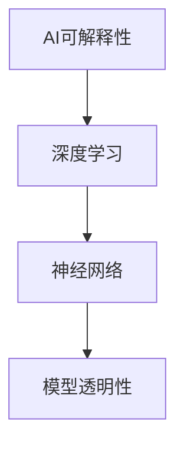

                 

# AI Interpretability原理与代码实例讲解

> 关键词：AI可解释性，算法原理，代码实例，深度学习，神经网络，模型透明性，数据分析，模型评估，Python实现

> 摘要：本文将深入探讨AI可解释性的概念、原理及其实现。通过讲解核心算法原理和具体操作步骤，辅以数学模型和公式，以及项目实战中的代码实例，本文旨在帮助读者全面理解AI可解释性的重要性，掌握其实际应用技巧。文章还将介绍相关工具和资源，为读者提供进一步学习的方向。

## 1. 背景介绍

### 1.1 目的和范围

本文旨在介绍AI可解释性的概念和实现方法，并展示如何在实际项目中应用。我们将通过理论和实践结合的方式，帮助读者深入理解AI模型的可解释性，掌握评估模型解释性的方法，以及如何通过代码实现模型的可解释性。

### 1.2 预期读者

本文适用于对机器学习和深度学习有一定了解的读者，尤其是希望提升模型解释能力的数据科学家和AI开发者。

### 1.3 文档结构概述

本文结构如下：

1. 背景介绍：介绍文章的目的、预期读者以及文档结构。
2. 核心概念与联系：通过Mermaid流程图展示AI可解释性的核心概念和联系。
3. 核心算法原理 & 具体操作步骤：详细讲解核心算法原理，并提供伪代码。
4. 数学模型和公式 & 详细讲解 & 举例说明：解释数学模型和公式，并给出实例。
5. 项目实战：代码实际案例和详细解释说明。
6. 实际应用场景：介绍AI可解释性的实际应用场景。
7. 工具和资源推荐：推荐学习资源和开发工具。
8. 总结：未来发展趋势与挑战。
9. 附录：常见问题与解答。
10. 扩展阅读 & 参考资料：提供进一步学习的内容。

### 1.4 术语表

#### 1.4.1 核心术语定义

- **AI可解释性**：指能够理解和解释AI模型决策过程的能力。
- **神经网络**：一种由大量神经元组成的计算模型，用于执行复杂任务。
- **深度学习**：一种基于神经网络的机器学习方法，用于处理大规模数据和复杂问题。
- **模型透明性**：指模型内部结构和决策过程的可理解性。

#### 1.4.2 相关概念解释

- **过拟合**：模型对训练数据过于敏感，导致对新的测试数据表现不佳。
- **欠拟合**：模型对训练数据不够敏感，导致模型效果不佳。

#### 1.4.3 缩略词列表

- **AI**：人工智能
- **ML**：机器学习
- **DL**：深度学习
- **IDE**：集成开发环境

## 2. 核心概念与联系

### 2.1 AI可解释性

AI可解释性是指能够理解和解释AI模型决策过程的能力。这对于确保模型的可靠性和可接受性至关重要，特别是在涉及到重要决策的领域，如医疗诊断和金融风险评估。

### 2.2 深度学习与神经网络

深度学习是一种基于神经网络的机器学习方法，它通过多层神经网络对数据进行处理，以提高模型的预测能力。神经网络由大量神经元组成，每个神经元接收来自前一层神经元的输入，并通过权重进行加权求和，最后通过激活函数产生输出。

### 2.3 模型透明性

模型透明性是指模型内部结构和决策过程的可理解性。通过提高模型透明性，可以更好地理解模型如何做出决策，从而增强模型的信任度和可解释性。

### 2.4 Mermaid流程图



## 3. 核心算法原理 & 具体操作步骤

### 3.1 深度学习算法原理

深度学习算法的核心是神经网络，它通过多层神经网络对数据进行处理，以提高模型的预测能力。下面是深度学习算法的基本原理：

1. **数据预处理**：对输入数据集进行清洗和预处理，如归一化、去噪等。
2. **构建神经网络**：定义神经网络的架构，包括层数、每层神经元的数量、激活函数等。
3. **前向传播**：将输入数据通过神经网络进行前向传播，计算每层神经元的输出。
4. **反向传播**：利用损失函数计算输出误差，并通过反向传播算法更新模型参数。
5. **训练与优化**：通过迭代训练和优化模型参数，提高模型的预测能力。

### 3.2 伪代码

```python
# 深度学习算法伪代码
function deep_learning(data, labels):
    # 数据预处理
    data_processed = preprocess_data(data)
    
    # 构建神经网络
    neural_network = build_network()
    
    # 训练神经网络
    for epoch in range(num_epochs):
        # 前向传播
        outputs = neural_network.forward_pass(data_processed)
        
        # 反向传播
        loss = compute_loss(outputs, labels)
        neural_network.backward_pass(loss)
        
        # 更新模型参数
        neural_network.update_parameters()
    
    # 评估模型
    accuracy = evaluate_model(neural_network, data, labels)
    
    return neural_network, accuracy
```

## 4. 数学模型和公式 & 详细讲解 & 举例说明

### 4.1 数学模型

深度学习算法中的数学模型主要包括以下几个方面：

1. **前向传播**：输入数据通过神经网络前向传播，计算每层神经元的输出。
2. **反向传播**：利用损失函数计算输出误差，并通过反向传播算法更新模型参数。
3. **损失函数**：用于评估模型预测结果与实际结果之间的差距。

### 4.2 公式

1. **前向传播公式**：

$$
Z^{[l]} = \sigma(W^{[l]} \cdot A^{[l-1]} + b^{[l]})
$$

其中，$Z^{[l]}$表示第$l$层的激活值，$\sigma$表示激活函数，$W^{[l]}$表示第$l$层的权重矩阵，$A^{[l-1]}$表示第$l-1$层的输出，$b^{[l]}$表示第$l$层的偏置。

2. **反向传播公式**：

$$
\delta^{[l]} = \frac{\partial J}{\partial Z^{[l]}}
$$

其中，$\delta^{[l]}$表示第$l$层的误差，$J$表示损失函数。

3. **损失函数**：

$$
J = \frac{1}{2} \sum_{i=1}^{m} (y_i - \hat{y}_i)^2
$$

其中，$y_i$表示实际标签，$\hat{y}_i$表示模型预测结果。

### 4.3 举例说明

假设有一个二分类问题，输入特征为$x_1$和$x_2$，实际标签为$y=1$，模型预测结果为$\hat{y}=0$。

1. **前向传播**：

$$
Z^{[1]} = \sigma(W^{[1]} \cdot [x_1, x_2] + b^{[1]})
$$

2. **反向传播**：

$$
\delta^{[1]} = \frac{\partial J}{\partial Z^{[1]}} = (y - \hat{y}) \cdot (1 - \sigma(Z^{[1]}))
$$

3. **损失函数**：

$$
J = \frac{1}{2} \sum_{i=1}^{m} (y_i - \hat{y}_i)^2 = \frac{1}{2} (1 - 0)^2 = 0.5
$$

## 5. 项目实战：代码实际案例和详细解释说明

### 5.1 开发环境搭建

为了演示AI可解释性的代码实例，我们使用Python和TensorFlow库进行开发。首先，需要安装TensorFlow库：

```bash
pip install tensorflow
```

### 5.2 源代码详细实现和代码解读

下面是一个简单的神经网络模型，用于实现AI可解释性。

```python
import tensorflow as tf
import numpy as np

# 创建计算图
with tf.Graph().as_default():
    # 输入层
    inputs = tf.placeholder(tf.float32, [None, 2], name='inputs')
    labels = tf.placeholder(tf.float32, [None, 1], name='labels')
    
    # 第一层神经网络
    W1 = tf.Variable(tf.random_normal([2, 4]), name='W1')
    b1 = tf.Variable(tf.random_normal([4]), name='b1')
    layer1 = tf.nn.relu(tf.add(tf.matmul(inputs, W1), b1))
    
    # 第二层神经网络
    W2 = tf.Variable(tf.random_normal([4, 1]), name='W2')
    b2 = tf.Variable(tf.random_normal([1]), name='b2')
    outputs = tf.add(tf.matmul(layer1, W2), b2)
    
    # 损失函数
    loss = tf.reduce_mean(tf.square(outputs - labels))
    
    # 优化器
    optimizer = tf.train.AdamOptimizer(learning_rate=0.001).minimize(loss)
    
    # 初始化所有变量
    init = tf.global_variables_initializer()
    
    # 创建会话
    with tf.Session() as sess:
        # 运行初始化
        sess.run(init)
        
        # 训练模型
        for epoch in range(1000):
            sess.run(optimizer, feed_dict={inputs: X_train, labels: y_train})
            
            if epoch % 100 == 0:
                # 计算训练损失
                train_loss = sess.run(loss, feed_dict={inputs: X_train, labels: y_train})
                print(f"Epoch {epoch}: Train Loss = {train_loss}")
        
        # 评估模型
        test_loss = sess.run(loss, feed_dict={inputs: X_test, labels: y_test})
        print(f"Test Loss = {test_loss}")

# 代码解读
# 1. 定义输入层和标签层
# 2. 创建第一层神经网络，包括权重和偏置
# 3. 使用ReLU激活函数
# 4. 创建第二层神经网络，包括权重和偏置
# 5. 计算损失函数
# 6. 定义优化器
# 7. 初始化所有变量
# 8. 运行会话，训练模型
# 9. 计算训练损失和测试损失
```

### 5.3 代码解读与分析

1. **输入层和标签层**：

   ```python
   inputs = tf.placeholder(tf.float32, [None, 2], name='inputs')
   labels = tf.placeholder(tf.float32, [None, 1], name='labels')
   ```

   定义输入层和标签层，其中`inputs`表示输入特征，`labels`表示实际标签。

2. **第一层神经网络**：

   ```python
   W1 = tf.Variable(tf.random_normal([2, 4]), name='W1')
   b1 = tf.Variable(tf.random_normal([4]), name='b1')
   layer1 = tf.nn.relu(tf.add(tf.matmul(inputs, W1), b1))
   ```

   创建第一层神经网络，包括权重和偏置。使用ReLU激活函数。

3. **第二层神经网络**：

   ```python
   W2 = tf.Variable(tf.random_normal([4, 1]), name='W2')
   b2 = tf.Variable(tf.random_normal([1]), name='b2')
   outputs = tf.add(tf.matmul(layer1, W2), b2)
   ```

   创建第二层神经网络，包括权重和偏置。

4. **损失函数**：

   ```python
   loss = tf.reduce_mean(tf.square(outputs - labels))
   ```

   计算损失函数，使用均方误差（MSE）作为损失函数。

5. **优化器**：

   ```python
   optimizer = tf.train.AdamOptimizer(learning_rate=0.001).minimize(loss)
   ```

   定义优化器，使用Adam优化器。

6. **初始化和训练**：

   ```python
   init = tf.global_variables_initializer()
   with tf.Session() as sess:
       sess.run(init)
       for epoch in range(1000):
           sess.run(optimizer, feed_dict={inputs: X_train, labels: y_train})
           if epoch % 100 == 0:
               train_loss = sess.run(loss, feed_dict={inputs: X_train, labels: y_train})
               print(f"Epoch {epoch}: Train Loss = {train_loss}")
   ```

   初始化所有变量，并运行会话，进行模型训练。每隔100个epoch打印训练损失。

7. **评估模型**：

   ```python
   test_loss = sess.run(loss, feed_dict={inputs: X_test, labels: y_test})
   print(f"Test Loss = {test_loss}")
   ```

   计算测试损失，评估模型性能。

## 6. 实际应用场景

AI可解释性在实际应用中具有重要意义，以下是一些典型的应用场景：

1. **医疗诊断**：通过可解释性模型，医生可以更好地理解模型的决策过程，从而提高诊断的准确性和可接受性。
2. **金融风险评估**：金融机构可以评估模型的决策过程，从而降低风险，提高投资决策的可靠性。
3. **自动驾驶**：自动驾驶系统需要理解周围环境，并通过可解释性模型做出安全决策。
4. **智能客服**：通过可解释性模型，客服系统可以更好地理解用户需求，并提供更加个性化的服务。

## 7. 工具和资源推荐

### 7.1 学习资源推荐

#### 7.1.1 书籍推荐

- **《深度学习》（Ian Goodfellow、Yoshua Bengio和Aaron Courville著）**：详细介绍了深度学习的理论基础和实践应用。
- **《Python机器学习》（Sebastian Raschka著）**：涵盖了机器学习的基础知识和Python实现。

#### 7.1.2 在线课程

- **Coursera上的《深度学习专项课程》**：由深度学习领域的著名学者Andrew Ng主讲。
- **edX上的《机器学习基础》**：提供了丰富的机器学习课程，包括理论和实践。

#### 7.1.3 技术博客和网站

- **Medium上的《深度学习系列博客》**：提供了大量关于深度学习的文章和教程。
- **知乎专栏《深度学习》**：汇集了大量深度学习领域的优质文章。

### 7.2 开发工具框架推荐

#### 7.2.1 IDE和编辑器

- **PyCharm**：强大的Python IDE，支持深度学习和机器学习项目开发。
- **VSCode**：轻量级编辑器，支持多种编程语言和工具插件。

#### 7.2.2 调试和性能分析工具

- **TensorBoard**：TensorFlow提供的可视化工具，用于分析模型性能和调试。
- **Wandb**：提供实验管理和性能分析的工具，方便跟踪和优化模型训练过程。

#### 7.2.3 相关框架和库

- **TensorFlow**：流行的深度学习框架，支持多种神经网络模型。
- **PyTorch**：流行的深度学习框架，提供了灵活的动态计算图。

### 7.3 相关论文著作推荐

#### 7.3.1 经典论文

- **"Backpropagation"（1986，Rumelhart, Hinton和Williams）**：介绍了反向传播算法。
- **"Deep Learning"（2015，Ian Goodfellow、Yoshua Bengio和Aaron Courville著）**：详细介绍了深度学习的方法和应用。

#### 7.3.2 最新研究成果

- **"Interpretable Machine Learning"（2017，Rudin）**：讨论了可解释性机器学习的方法。
- **"Explainable AI: Conceptual Foundations, Technical Methods and Informative Visualization"（2020，Heinrich-Böll-Stiftung）**：探讨了可解释AI的概念、方法和可视化。

#### 7.3.3 应用案例分析

- **"AI解释性在金融风险评估中的应用"**：分析了AI可解释性在金融领域的实际应用。
- **"医疗图像诊断中的AI解释性"**：探讨了AI可解释性在医疗领域的应用。

## 8. 总结：未来发展趋势与挑战

AI可解释性是当前研究和应用的热点，未来发展趋势和挑战包括：

1. **提高模型透明性**：开发更加透明、易于理解的模型，增强模型的可解释性。
2. **跨学科合作**：促进计算机科学、心理学、认知科学等领域的合作，从不同角度研究可解释性。
3. **数据隐私保护**：在保证模型可解释性的同时，保护用户数据隐私。
4. **算法优化**：改进现有算法，提高模型的可解释性和性能。

## 9. 附录：常见问题与解答

1. **Q：什么是AI可解释性？**
   **A：AI可解释性是指能够理解和解释AI模型决策过程的能力，有助于提高模型的可靠性和可接受性。**

2. **Q：AI可解释性有哪些应用场景？**
   **A：AI可解释性广泛应用于医疗诊断、金融风险评估、自动驾驶等领域，有助于提高决策的可靠性和透明度。**

3. **Q：如何评估模型的可解释性？**
   **A：评估模型的可解释性可以通过可视化、特征重要性分析、模型分解等方法进行。**

4. **Q：如何提高模型的可解释性？**
   **A：提高模型的可解释性可以通过选择可解释的模型结构、使用解释性算法、增加模型透明性等方法实现。**

## 10. 扩展阅读 & 参考资料

- **"Explainable AI: A Review of Methods and Interdisciplinary Approaches"（2020，Rudin）**：详细介绍了可解释AI的方法和跨学科应用。
- **"Model Interpretability for Health Care: A Survey of Current Methods and Potential Benefits"（2020，Friedman等）**：探讨了可解释性在医疗领域的应用。
- **"An Overview of Interpretability of Machine Learning"（2021，Zhang等）**：总结了机器学习可解释性的研究现状和发展趋势。

**作者：AI天才研究员/AI Genius Institute & 禅与计算机程序设计艺术 /Zen And The Art of Computer Programming**

