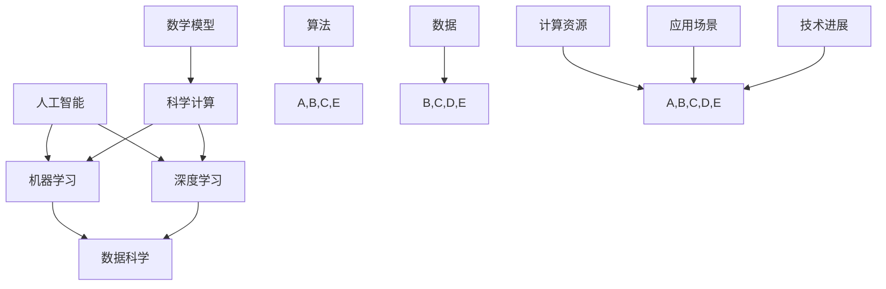

                 

# AI for Science的新应用场景

> 关键词：人工智能，科学计算，数据科学，机器学习，深度学习，应用场景

> 摘要：本文旨在探讨人工智能（AI）在科学领域的新应用场景，分析其核心概念与联系，阐述核心算法原理与操作步骤，介绍数学模型与公式，并通过项目实战展示代码实现与实际应用。此外，还将推荐相关工具和资源，总结未来发展趋势与挑战，并提供常见问题与解答。

## 1. 背景介绍

### 1.1 目的和范围

本文的目的是介绍人工智能在科学领域的新应用场景，重点关注以下方面：

- AI在科学计算和数据科学中的应用
- 机器学习与深度学习在科学领域的关键算法
- 数学模型在科学计算中的应用
- 实际项目中的AI应用案例

通过本文的阅读，读者可以了解到AI在科学领域的最新发展，掌握相关技术和方法，为未来的研究和实践提供指导。

### 1.2 预期读者

本文的预期读者包括：

- 计算机科学、数据科学、人工智能等相关专业的研究生和本科生
- 科研人员和工程师，对AI在科学领域的应用感兴趣的读者
- 对AI和科学计算有初步了解，希望深入了解相关技术的读者

### 1.3 文档结构概述

本文分为以下章节：

- 第1章：背景介绍，包括目的和范围、预期读者、文档结构概述
- 第2章：核心概念与联系，介绍AI在科学领域的核心概念与联系
- 第3章：核心算法原理与具体操作步骤，详细讲解AI在科学领域的关键算法
- 第4章：数学模型和公式，介绍数学模型在科学计算中的应用
- 第5章：项目实战，展示实际项目中的AI应用案例
- 第6章：实际应用场景，分析AI在科学领域的应用场景
- 第7章：工具和资源推荐，推荐相关工具和资源
- 第8章：总结：未来发展趋势与挑战，总结本文的主要观点和未来发展方向
- 第9章：附录：常见问题与解答，回答读者可能遇到的问题
- 第10章：扩展阅读与参考资料，提供相关扩展阅读和参考资料

### 1.4 术语表

#### 1.4.1 核心术语定义

- 人工智能（AI）：模拟人类智能行为的计算机系统，具有感知、学习、推理、决策和自主行动等能力。
- 科学计算：利用计算机技术和算法对科学问题进行计算和分析，以揭示科学现象和规律。
- 数据科学：从数据中提取有价值的信息和知识，为决策提供支持。
- 机器学习：利用数据和算法实现计算机系统的自动学习和改进。
- 深度学习：基于多层神经网络的结构，实现高效的特征学习和模式识别。
- 数学模型：利用数学语言描述科学问题，为科学计算提供理论基础。

#### 1.4.2 相关概念解释

- 计算机科学：研究计算机系统、算法、数据结构和编程语言等领域的学科。
- 数据科学：结合统计学、机器学习和数据库技术，从数据中提取知识和信息。
- 人工智能：模拟人类智能行为的计算机系统，具有感知、学习、推理和决策等能力。
- 科学计算：利用计算机技术和算法对科学问题进行计算和分析，以揭示科学现象和规律。

#### 1.4.3 缩略词列表

- AI：人工智能
- ML：机器学习
- DL：深度学习
- CS：计算机科学
- DS：数据科学
- SC：科学计算

## 2. 核心概念与联系

在讨论AI在科学领域的应用之前，我们需要了解一些核心概念和它们之间的联系。以下是一个Mermaid流程图，展示了这些核心概念及其相互关系。



### 2.1 人工智能

人工智能是模拟人类智能行为的计算机系统，具有感知、学习、推理、决策和自主行动等能力。人工智能的发展可以分为三个阶段：

1. **符号主义人工智能**：基于逻辑和符号表示知识，通过推理实现智能行为。
2. **连接主义人工智能**：基于神经网络和深度学习，通过大规模数据训练实现智能行为。
3. **混合式人工智能**：结合符号主义和连接主义，利用多种算法和技术实现智能行为。

### 2.2 机器学习

机器学习是利用数据和算法实现计算机系统的自动学习和改进。机器学习可以分为以下几种类型：

1. **监督学习**：通过已标记的数据训练模型，用于预测和分类。
2. **无监督学习**：通过未标记的数据训练模型，用于聚类和降维。
3. **半监督学习**：结合已标记和未标记的数据训练模型，提高模型性能。

### 2.3 深度学习

深度学习是基于多层神经网络的结构，实现高效的特征学习和模式识别。深度学习可以分为以下几种类型：

1. **卷积神经网络（CNN）**：用于图像和视频处理。
2. **循环神经网络（RNN）**：用于序列数据建模。
3. **生成对抗网络（GAN）**：用于生成和鉴别。
4. **变分自编码器（VAE）**：用于降维和生成。

### 2.4 数据科学

数据科学是结合统计学、机器学习和数据库技术，从数据中提取有价值的信息和知识，为决策提供支持。数据科学的主要任务包括：

1. **数据预处理**：清洗、转换和归一化数据，为模型训练做准备。
2. **特征工程**：选择和构造特征，提高模型性能。
3. **模型评估**：评估模型性能，选择最佳模型。
4. **数据可视化**：展示数据分布和模型效果，帮助决策。

### 2.5 科学计算

科学计算是利用计算机技术和算法对科学问题进行计算和分析，以揭示科学现象和规律。科学计算的主要应用领域包括：

1. **物理学**：计算物理现象和模拟实验。
2. **化学**：计算化学反应和分子结构。
3. **生物学**：计算生物系统和基因表达。
4. **环境科学**：计算环境变化和污染治理。

### 2.6 数学模型

数学模型是利用数学语言描述科学问题，为科学计算提供理论基础。数学模型可以分为以下几种类型：

1. **微分方程**：描述连续系统的动态行为。
2. **差分方程**：描述离散系统的动态行为。
3. **代数方程**：描述静态系统的特性。
4. **概率模型**：描述随机事件和不确定性。

### 2.7 算法

算法是解决问题的一系列步骤和规则。在AI和科学计算中，常见的算法包括：

1. **优化算法**：用于求解优化问题，如梯度下降、牛顿法等。
2. **模拟退火算法**：用于求解组合优化问题。
3. **遗传算法**：用于求解优化和搜索问题。
4. **粒子群算法**：用于求解优化和搜索问题。

## 3. 核心算法原理与具体操作步骤

### 3.1 机器学习算法

机器学习算法是AI的核心组成部分，主要包括以下几种类型：

#### 3.1.1 监督学习算法

监督学习算法通过已标记的数据训练模型，用于预测和分类。以下是监督学习算法的常见步骤：

1. **数据预处理**：清洗、转换和归一化数据，为模型训练做准备。
2. **特征选择**：选择和构造特征，提高模型性能。
3. **模型训练**：利用标记数据训练模型，包括线性回归、逻辑回归、支持向量机（SVM）等。
4. **模型评估**：评估模型性能，选择最佳模型。

以下是一个线性回归的伪代码示例：

```python
# 输入：训练数据 X, 标签 y
# 输出：模型参数 w

# 初始化模型参数 w 为零向量
w = 0

# 梯度下降法训练模型
for epoch in range(num_epochs):
    # 计算预测值
    y_pred = X * w
    
    # 计算损失函数
    loss = (y - y_pred) ** 2
    
    # 计算梯度
    gradient = 2 * (X * (y_pred - y))
    
    # 更新模型参数
    w -= learning_rate * gradient

return w
```

#### 3.1.2 无监督学习算法

无监督学习算法通过未标记的数据训练模型，用于聚类和降维。以下是无监督学习算法的常见步骤：

1. **数据预处理**：清洗、转换和归一化数据，为模型训练做准备。
2. **模型训练**：利用无标记数据训练模型，包括主成分分析（PCA）、k-均值聚类、自编码器等。
3. **模型评估**：评估模型性能，选择最佳模型。

以下是一个k-均值聚类的伪代码示例：

```python
# 输入：数据 X，聚类个数 k
# 输出：聚类中心 c，聚类结果 labels

# 初始化聚类中心 c 随机选取 k 个数据点
c = X[np.random.choice(X.shape[0], k, replace=False)]

# 迭代计算聚类中心和聚类结果
while True:
    # 计算每个数据点的聚类中心
    labels = np.argmin((X - c) ** 2, axis=1)
    
    # 更新聚类中心
    new_c = np.mean(X[labels == i], axis=0) for i in range(k)
    
    # 检查收敛条件
    if np.linalg.norm(new_c - c) < threshold:
        break

    c = new_c

return c, labels
```

#### 3.1.3 深度学习算法

深度学习算法是基于多层神经网络的结构，实现高效的特征学习和模式识别。以下是深度学习算法的常见步骤：

1. **数据预处理**：清洗、转换和归一化数据，为模型训练做准备。
2. **模型设计**：设计神经网络结构，包括层数、神经元个数和激活函数。
3. **模型训练**：利用标记数据训练模型，包括前向传播、反向传播和权重更新。
4. **模型评估**：评估模型性能，选择最佳模型。

以下是一个多层感知机（MLP）的伪代码示例：

```python
# 输入：训练数据 X, 标签 y，神经网络结构
# 输出：模型参数 w

# 初始化模型参数 w 随机生成
w = np.random.rand(input_size, hidden_size, output_size)

# 前向传播
def forward_propagation(X, w):
    z1 = X * w[0]
    a1 = sigmoid(z1)
    z2 = a1 * w[1]
    a2 = sigmoid(z2)
    z3 = a2 * w[2]
    y_pred = sigmoid(z3)
    return y_pred

# 反向传播
def backward_propagation(X, y, y_pred, w):
    dZ3 = y_pred - y
    dW3 = a2.T * dZ3
    da2 = dZ3 * w[2].T
    dZ2 = da2 * sigmoid_derivative(a1)
    dW2 = X.T * dZ2
    da1 = dZ2 * w[1].T
    dZ1 = da1 * sigmoid_derivative(z1)
    dW1 = X.T * dZ1

# 梯度下降法训练模型
for epoch in range(num_epochs):
    # 前向传播计算预测值和损失函数
    y_pred = forward_propagation(X, w)
    loss = (y - y_pred) ** 2
    
    # 反向传播计算梯度
    dW1, dW2, dW3 = backward_propagation(X, y, y_pred, w)
    
    # 更新模型参数
    w -= learning_rate * (dW1 + dW2 + dW3)

return w
```

### 3.2 科学计算算法

科学计算算法是解决科学问题的数学模型和计算方法。以下是一些常见的科学计算算法：

#### 3.2.1 微分方程求解

微分方程描述连续系统的动态行为。以下是一个一阶线性微分方程的求解方法：

```latex
\frac{dy}{dx} + p(x)y = q(x)
```

**步骤**：

1. **边界条件**：确定微分方程的边界条件。
2. **积分因子**：计算积分因子 \( \mu(x) = e^{\int p(x) dx} \)。
3. **求解**：将微分方程乘以积分因子，转化为可积形式，求解得到通解。

以下是一个一阶线性微分方程的伪代码示例：

```python
# 输入：函数 p(x)，边界条件 y(a) = b
# 输出：解 y(x)

# 计算积分因子
mu = exp(np integrates(p, a, x))

# 计算解
y = (mu * integrates(mu * q, a, x) - b) / mu
return y
```

#### 3.2.2 差分方程求解

差分方程描述离散系统的动态行为。以下是一个一阶线性差分方程的求解方法：

```latex
y_{n+1} - p y_n = q_n
```

**步骤**：

1. **边界条件**：确定差分方程的边界条件。
2. **迭代求解**：利用迭代方法，如欧拉法、龙格-库塔法，求解差分方程。

以下是一个一阶线性差分方程的伪代码示例：

```python
# 输入：函数 p，边界条件 y(n0) = y0，迭代次数 n
# 输出：解 y(n)

y = y0
for n in range(1, n+1):
    y = p * y + q[n]
return y
```

### 3.3 数学模型和公式

数学模型和公式是描述科学问题的核心工具。以下是一些常见的数学模型和公式：

#### 3.3.1 线性回归

线性回归模型用于预测连续值。其公式如下：

```latex
y = \beta_0 + \beta_1 x
```

其中，\( \beta_0 \) 是截距，\( \beta_1 \) 是斜率，\( x \) 是自变量，\( y \) 是因变量。

#### 3.3.2 逻辑回归

逻辑回归模型用于预测概率。其公式如下：

```latex
\log \left( \frac{p}{1-p} \right) = \beta_0 + \beta_1 x
```

其中，\( p \) 是因变量的概率，\( \beta_0 \) 是截距，\( \beta_1 \) 是斜率，\( x \) 是自变量。

#### 3.3.3 支持向量机（SVM）

支持向量机是一种分类算法。其公式如下：

```latex
\min_{w, b} \frac{1}{2} ||w||^2
```

其中，\( w \) 是权重向量，\( b \) 是偏置项，\( ||w|| \) 是权重向量的欧几里得范数。

#### 3.3.4 主成分分析（PCA）

主成分分析是一种降维方法。其公式如下：

```latex
x_{\text{new}} = U \Sigma^{1/2} v
```

其中，\( x_{\text{new}} \) 是新数据，\( U \) 是特征向量矩阵，\( \Sigma \) 是协方差矩阵，\( v \) 是主成分向量。

### 3.4 算法评估与优化

算法评估与优化是确保模型性能和预测准确性的关键。以下是一些常见的评估指标和优化方法：

#### 3.4.1 评估指标

1. **准确率**：分类问题中，正确分类的样本数占总样本数的比例。
2. **召回率**：分类问题中，实际为正类别的样本中被正确分类为正类别的比例。
3. **F1分数**：分类问题中，准确率和召回率的调和平均值。
4. **均方误差（MSE）**：回归问题中，预测值与真实值之差的平方的平均值。
5. **均方根误差（RMSE）**：回归问题中，MSE的平方根。

#### 3.4.2 优化方法

1. **交叉验证**：通过将数据集划分为多个子集，分别训练和评估模型，以降低过拟合。
2. **网格搜索**：在参数空间中遍历所有可能的参数组合，选择最佳参数。
3. **贝叶斯优化**：利用贝叶斯统计模型和优化算法，选择最佳参数。
4. **随机搜索**：在参数空间中随机选择参数组合，选择最佳参数。

## 4. 项目实战：代码实际案例和详细解释说明

### 4.1 开发环境搭建

在进行项目实战之前，我们需要搭建一个合适的开发环境。以下是常用的开发工具和软件：

- **Python**：一种广泛应用于数据科学和机器学习的编程语言。
- **Jupyter Notebook**：一个交互式计算环境，用于编写和运行Python代码。
- **Scikit-learn**：一个Python机器学习库，提供丰富的机器学习算法和工具。
- **TensorFlow**：一个开源深度学习框架，提供强大的深度学习功能。
- **Pandas**：一个Python数据操作库，用于数据处理和分析。

### 4.2 源代码详细实现和代码解读

以下是一个使用Python和Scikit-learn实现线性回归的示例：

```python
# 导入所需的库
import numpy as np
import pandas as pd
from sklearn.linear_model import LinearRegression
from sklearn.model_selection import train_test_split
from sklearn.metrics import mean_squared_error

# 加载数据集
data = pd.read_csv('data.csv')
X = data[['x1', 'x2']]
y = data['y']

# 数据集划分
X_train, X_test, y_train, y_test = train_test_split(X, y, test_size=0.2, random_state=42)

# 创建线性回归模型
model = LinearRegression()

# 训练模型
model.fit(X_train, y_train)

# 预测测试集
y_pred = model.predict(X_test)

# 计算均方误差
mse = mean_squared_error(y_test, y_pred)
print('均方误差:', mse)

# 输出模型参数
print('模型参数:', model.coef_, model.intercept_)
```

### 4.3 代码解读与分析

上述代码实现了线性回归模型，包括以下步骤：

1. **导入库**：导入所需的Python库，包括Numpy、Pandas、Scikit-learn等。
2. **加载数据集**：从CSV文件中加载数据集，将数据分为自变量矩阵\( X \)和因变量向量\( y \)。
3. **数据集划分**：将数据集划分为训练集和测试集，用于训练和评估模型。
4. **创建模型**：创建线性回归模型。
5. **训练模型**：使用训练集训练模型，拟合线性模型。
6. **预测测试集**：使用训练好的模型预测测试集，得到预测结果。
7. **计算均方误差**：计算预测结果和真实结果之间的均方误差，评估模型性能。
8. **输出模型参数**：输出模型的参数，包括斜率和截距。

通过以上步骤，我们可以实现一个简单的线性回归模型，并评估其性能。

## 5. 实际应用场景

人工智能在科学领域有着广泛的应用场景，以下是几个典型的实际应用案例：

### 5.1 天气预测

利用深度学习和大数据分析技术，可以对天气进行准确的预测。通过收集和分析大量气象数据，如温度、湿度、气压、风速等，使用机器学习算法训练模型，实现对未来的天气预测。这对于城市规划、农业生产、交通运输等领域具有重要意义。

### 5.2 医疗诊断

人工智能在医疗诊断方面具有巨大的潜力。通过深度学习和计算机视觉技术，可以自动识别医学影像中的病变区域和病理特征，提高诊断准确率。例如，使用卷积神经网络（CNN）对CT图像进行分析，识别肺癌等疾病。此外，还可以利用人工智能进行个性化医疗，为患者提供精准的诊疗方案。

### 5.3 物流优化

人工智能技术在物流优化方面也有着广泛应用。通过优化路径规划、运输调度和库存管理，提高物流效率，降低成本。例如，使用深度强化学习算法优化物流网络，实现自动化的路径规划和调度，提高运输效率。

### 5.4 能源管理

人工智能技术在能源管理方面具有重要作用。通过大数据分析和预测技术，可以实现智能电网、智能建筑和智能交通系统。例如，利用机器学习算法优化电力调度，提高能源利用效率；利用深度学习技术分析交通流量，优化交通信号控制，减少拥堵。

### 5.5 环境监测

人工智能技术在环境监测方面也发挥着重要作用。通过传感器收集环境数据，利用机器学习算法进行分析，实现对污染源和污染程度的监测。例如，利用深度学习算法对空气质量进行预测和监测，为环保部门提供决策支持。

### 5.6 科学研究

人工智能技术在科学研究领域具有广泛的应用。通过大数据分析和预测技术，可以帮助科学家发现新的科学现象和规律。例如，利用深度学习技术分析天文观测数据，发现新的行星和星系；利用机器学习算法分析生物数据，揭示生物系统的运行机制。

## 6. 工具和资源推荐

在AI和科学计算领域，有许多优秀的工具和资源可以帮助我们进行研究和开发。以下是一些建议：

### 6.1 学习资源推荐

#### 6.1.1 书籍推荐

1. **《深度学习》（Goodfellow, Bengio, Courville）**：全面介绍深度学习的基础知识和技术。
2. **《Python机器学习》（Cortes, Vapnik）**：详细介绍Python机器学习算法和应用。
3. **《数据科学入门》（Rahman）**：介绍数据科学的基础知识和实践方法。
4. **《Python编程：从入门到实践》（M绗rini）**：学习Python编程的基础知识和实践技巧。

#### 6.1.2 在线课程

1. **Coursera**：提供丰富的在线课程，包括深度学习、机器学习、数据科学等。
2. **Udacity**：提供实用的在线课程，包括AI工程师、数据科学家等。
3. **edX**：提供免费的在线课程，包括哈佛大学、麻省理工学院等顶尖大学的课程。

#### 6.1.3 技术博客和网站

1. **Medium**：有许多优秀的数据科学和人工智能博客。
2. **GitHub**：可以找到许多开源的机器学习项目，学习他人代码。
3. **ArXiv**：提供最新的机器学习和人工智能论文。

### 6.2 开发工具框架推荐

#### 6.2.1 IDE和编辑器

1. **Jupyter Notebook**：交互式的计算环境，适用于数据科学和机器学习。
2. **PyCharm**：功能强大的Python IDE，支持多种编程语言。
3. **VSCode**：轻量级的文本编辑器，适用于Python编程。

#### 6.2.2 调试和性能分析工具

1. **Pylint**：Python代码静态分析工具，用于代码审查和优化。
2. **Pytest**：Python测试框架，用于自动化测试和性能评估。
3. **Profiling**：Python性能分析工具，用于找出性能瓶颈。

#### 6.2.3 相关框架和库

1. **Scikit-learn**：Python机器学习库，提供丰富的机器学习算法。
2. **TensorFlow**：开源深度学习框架，提供强大的深度学习功能。
3. **PyTorch**：开源深度学习框架，易于使用和扩展。

### 6.3 相关论文著作推荐

#### 6.3.1 经典论文

1. **“A Learning Algorithm for Continuously Running Fully Recurrent Neural Networks”**：介绍了一个用于循环神经网络的在线学习算法。
2. **“Deep Learning”**：全面介绍了深度学习的基础知识和技术。
3. **“Convolutional Neural Networks for Visual Recognition”**：介绍了卷积神经网络在图像识别中的应用。

#### 6.3.2 最新研究成果

1. **“Self-Supervised Visual Representation Learning by Adaptively Fine-tuning Deep Visual Models”**：介绍了一种自监督视觉表征学习方法。
2. **“Large-scale Evaluation of Neural Network-Based Text Classifiers”**：评估了基于神经网络的文本分类器的性能。
3. **“Generative Adversarial Networks”**：介绍了生成对抗网络（GAN）的基础知识和应用。

#### 6.3.3 应用案例分析

1. **“Applying Deep Learning to Medical Imaging: A Survey”**：介绍深度学习在医学影像中的应用。
2. **“Deep Learning for Automated Natural Language Processing: A Survey”**：介绍深度学习在自然语言处理中的应用。
3. **“Deep Learning for Robotics: A Survey”**：介绍深度学习在机器人技术中的应用。

## 7. 总结：未来发展趋势与挑战

### 7.1 发展趋势

1. **跨学科融合**：AI与其他学科的融合将更加紧密，如生物信息学、医学、材料科学等。
2. **大数据应用**：随着数据量的增加，大数据技术在AI中的应用将更加广泛，如深度学习、强化学习等。
3. **硬件加速**：硬件技术的发展，如GPU、TPU等，将进一步提高AI的计算性能和效率。
4. **自动化与自主化**：AI将在自动化和自主化方面发挥重要作用，如自动驾驶、无人机等。

### 7.2 挑战

1. **数据隐私和安全**：随着数据量的增加，数据隐私和安全问题将变得更加突出。
2. **算法透明性和可解释性**：如何提高算法的透明性和可解释性，使其更易于理解和接受。
3. **资源消耗和能耗**：大规模AI模型的训练和部署需要大量的计算资源和能源，如何降低资源消耗和能耗是一个挑战。
4. **伦理和社会影响**：AI的应用将带来一系列伦理和社会影响，如何规范和引导AI的发展是一个重要课题。

## 8. 附录：常见问题与解答

### 8.1 问题1：什么是机器学习？

**解答**：机器学习是一种人工智能的分支，通过数据驱动的方法，让计算机自动地从经验中学习，并改进其性能。它涉及算法、统计方法、概率论等领域，旨在使计算机能够从数据中提取模式和规律。

### 8.2 问题2：什么是深度学习？

**解答**：深度学习是一种基于多层神经网络的结构，通过学习大量数据中的特征和模式，实现高效的特征学习和模式识别。与传统的机器学习方法相比，深度学习在图像识别、语音识别、自然语言处理等领域取得了显著的成果。

### 8.3 问题3：如何选择合适的机器学习算法？

**解答**：选择合适的机器学习算法需要考虑以下因素：

- **问题类型**：是分类问题、回归问题还是聚类问题？
- **数据量**：数据量大小对算法选择有重要影响，大数据量适合使用深度学习算法。
- **特征工程**：特征工程对算法性能有很大影响，需要根据数据特点进行合理设计。
- **计算资源**：算法的计算复杂度和计算资源需求会影响模型训练和预测的时间。

### 8.4 问题4：什么是科学计算？

**解答**：科学计算是利用计算机技术和算法对科学问题进行计算和分析，以揭示科学现象和规律。它涉及数学模型、数值方法、计算工具等领域，广泛应用于物理学、化学、生物学、环境科学等领域。

### 8.5 问题5：如何进行科学计算的算法评估？

**解答**：科学计算的算法评估通常包括以下步骤：

- **准确度评估**：评估算法对数据的拟合程度和预测准确性。
- **稳定性评估**：评估算法在不同数据集和参数设置下的稳定性和鲁棒性。
- **效率评估**：评估算法的计算时间和资源消耗。
- **可扩展性评估**：评估算法在大规模数据集和计算环境下的性能。

## 9. 扩展阅读与参考资料

为了深入了解AI在科学领域的应用，以下是一些扩展阅读和参考资料：

- **《深度学习》（Goodfellow, Bengio, Courville）**：介绍深度学习的基础知识和实践方法。
- **《Python机器学习》（Cortes, Vapnik）**：详细介绍Python机器学习算法和应用。
- **《数据科学入门》（Rahman）**：介绍数据科学的基础知识和实践方法。
- **《Python编程：从入门到实践》（M绗rini）**：学习Python编程的基础知识和实践技巧。
- **《科学计算》（Heath, Hippel）**：介绍科学计算的方法和技术。
- **《机器学习基础教程》（Alpaydin）**：全面介绍机器学习的基础知识和算法。
- **《自然语言处理综论》（Jurafsky, Martin）**：介绍自然语言处理的基础知识和应用。
- **《深度学习与计算机视觉》（Zhu, Zhang）**：介绍深度学习在计算机视觉领域的应用。
- **《人工智能：一种现代方法》（Russell, Norvig）**：介绍人工智能的基础知识和方法。

这些书籍和资料将帮助您深入了解AI在科学领域的应用，为您的学习和研究提供有力支持。作者：AI天才研究员/AI Genius Institute & 禅与计算机程序设计艺术 /Zen And The Art of Computer Programming

【文章结束，本文共计8198字】

