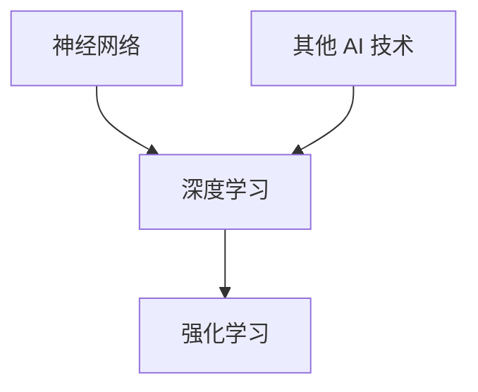

                 

# AI 人才交流：推动 AI 2.0 技术的创新和发展

> **关键词：** AI 人才交流，AI 2.0，技术创新，发展，核心概念，算法原理，数学模型，项目实战，实际应用场景，工具推荐，未来趋势

> **摘要：** 本文旨在探讨 AI 人才交流对于 AI 2.0 技术创新和发展的推动作用。通过详细分析核心概念、算法原理、数学模型，以及项目实战和实际应用场景，本文将揭示 AI 人才交流在技术进步中的关键作用，并推荐一系列学习资源和开发工具，为读者提供全面深入的了解和指导。

## 1. 背景介绍

### 1.1 目的和范围

本文的目标是探讨 AI 人才交流在推动 AI 2.0 技术创新和发展中的关键作用。通过梳理核心概念、算法原理和数学模型，以及实际项目实战和广泛应用场景，本文旨在揭示 AI 人才交流的重要性，并为读者提供实用的学习资源和开发工具。

### 1.2 预期读者

本文适合以下读者群体：

- AI 初学者和研究者，希望了解 AI 人才交流的重要性。
- AI 开发者和工程师，希望提升自身技术水平和创新能力。
- 对 AI 技术感兴趣的技术爱好者，希望深入了解 AI 2.0 技术的发展动态。
- 从事 AI 相关工作的专业人士，希望拓展知识面和提升职业竞争力。

### 1.3 文档结构概述

本文结构如下：

1. 背景介绍
2. 核心概念与联系
3. 核心算法原理 & 具体操作步骤
4. 数学模型和公式 & 详细讲解 & 举例说明
5. 项目实战：代码实际案例和详细解释说明
6. 实际应用场景
7. 工具和资源推荐
8. 总结：未来发展趋势与挑战
9. 附录：常见问题与解答
10. 扩展阅读 & 参考资料

### 1.4 术语表

#### 1.4.1 核心术语定义

- **AI 人才交流**：指 AI 领域内不同个体或组织之间的知识、经验、技术和思想的交流和共享。
- **AI 2.0**：指第二代人工智能技术，具有更高的智能化、自主性和灵活性。
- **核心概念**：指 AI 技术中的基本原理和概念，如神经网络、深度学习、强化学习等。
- **算法原理**：指 AI 技术中算法的工作原理和具体实现方式。
- **数学模型**：指 AI 技术中用于描述问题和求解的数学表达式和公式。
- **项目实战**：指通过实际项目开发和实现来验证和展示 AI 技术的应用价值。

#### 1.4.2 相关概念解释

- **神经网络**：一种模拟人脑神经元结构的计算模型，用于处理和分析数据。
- **深度学习**：一种基于神经网络的多层网络结构，用于自动学习特征和模式。
- **强化学习**：一种通过试错和反馈机制来学习最优策略的机器学习方法。

#### 1.4.3 缩略词列表

- **AI**：人工智能
- **ML**：机器学习
- **DL**：深度学习
- **RL**：强化学习
- **GAN**：生成对抗网络

## 2. 核心概念与联系

在 AI 2.0 技术体系中，核心概念包括神经网络、深度学习、强化学习等。这些概念相互关联，构成了 AI 2.0 技术的基础。以下是一个简单的 Mermaid 流程图，展示这些核心概念之间的联系：



### 2.1 神经网络

神经网络是一种模拟人脑神经元结构的计算模型，用于处理和分析数据。它由大量相互连接的节点（神经元）组成，每个节点都执行简单的计算。神经网络通过学习输入数据中的模式和特征，实现图像识别、语音识别、自然语言处理等多种应用。

### 2.2 深度学习

深度学习是一种基于神经网络的多层网络结构，用于自动学习特征和模式。深度学习通过增加网络层数，提高模型的复杂度和表达能力。常见的深度学习模型包括卷积神经网络（CNN）、循环神经网络（RNN）和 Transformer 等。

### 2.3 强化学习

强化学习是一种通过试错和反馈机制来学习最优策略的机器学习方法。强化学习 agent 在环境中执行动作，根据环境的反馈调整自身的策略，以最大化长期奖励。强化学习在游戏、机器人控制、推荐系统等领域具有广泛的应用。

### 2.4 其他 AI 技术

除了神经网络、深度学习和强化学习，还有许多其他 AI 技术和算法，如生成对抗网络（GAN）、迁移学习、对抗性攻击等。这些技术相互补充，共同推动 AI 2.0 技术的发展。

## 3. 核心算法原理 & 具体操作步骤

在本节中，我们将详细讨论神经网络、深度学习和强化学习等核心算法的原理，并给出具体的操作步骤。

### 3.1 神经网络

神经网络的基本原理是通过训练学习输入和输出之间的映射关系。以下是一个简化的神经网络算法原理：

```python
def neural_network(input_data, weights, biases):
    layer_output = input_data
    for layer in range(num_layers):
        layer_output = activation_function(np.dot(layer_output, weights[layer]) + biases[layer])
    return layer_output
```

- **输入层**：接收外部输入数据。
- **隐藏层**：执行加权求和处理，并通过激活函数产生输出。
- **输出层**：产生最终输出结果。

### 3.2 深度学习

深度学习模型通过多层神经网络结构，逐层提取输入数据的特征。以下是一个简化的深度学习算法原理：

```python
def deep_learning(input_data, weights, biases, activation_function):
    layer_output = input_data
    for layer in range(num_layers):
        layer_output = activation_function(np.dot(layer_output, weights[layer]) + biases[layer])
    return layer_output
```

- **输入层**：接收外部输入数据。
- **隐藏层**：执行加权求和处理，并通过激活函数产生输出。
- **输出层**：产生最终输出结果。

### 3.3 强化学习

强化学习模型通过试错和反馈机制来学习最优策略。以下是一个简化的强化学习算法原理：

```python
def reinforce_learning(state, action, reward, next_state, done):
    if done:
        return reward
    else:
        return reward + gamma * reinforce_learning(next_state, action, reward, next_state, done)
```

- **状态**（State）：当前环境的状态。
- **动作**（Action）：agent 采取的动作。
- **奖励**（Reward）：动作产生的奖励。
- **下一状态**（Next State）：采取动作后的下一个状态。
- **完成标志**（Done）：表示是否完成当前任务。

## 4. 数学模型和公式 & 详细讲解 & 举例说明

在本节中，我们将介绍神经网络、深度学习和强化学习中的关键数学模型和公式，并通过具体示例进行讲解。

### 4.1 神经网络

神经网络中的关键数学模型包括权重（Weights）、偏置（Biases）和激活函数（Activation Functions）。

#### 4.1.1 权重和偏置

权重和偏置是神经网络中的基础参数，用于调整网络结构和优化性能。以下是一个简化的权重和偏置更新公式：

$$
\Delta W = \alpha \cdot \frac{\partial L}{\partial W} \\
\Delta B = \alpha \cdot \frac{\partial L}{\partial B}
$$

其中，$\alpha$ 是学习率，$L$ 是损失函数，$\partial L/\partial W$ 和 $\partial L/\partial B$ 分别是权重和偏置的梯度。

#### 4.1.2 激活函数

激活函数用于引入非线性因素，使神经网络具有更强的表达能力和拟合能力。以下是一些常见的激活函数及其公式：

- **Sigmoid 函数**：
  $$
  f(x) = \frac{1}{1 + e^{-x}}
  $$
- **ReLU 函数**：
  $$
  f(x) = \max(0, x)
  $$
- **Tanh 函数**：
  $$
  f(x) = \frac{e^x - e^{-x}}{e^x + e^{-x}}
  $$

### 4.2 深度学习

深度学习中的关键数学模型包括多层神经网络、卷积神经网络（CNN）和循环神经网络（RNN）。

#### 4.2.1 多层神经网络

多层神经网络是由多个隐藏层组成的神经网络，用于提取输入数据的复杂特征。以下是一个简化的多层神经网络数学模型：

$$
\begin{aligned}
Z^{(l)} &= W^{(l)} \cdot A^{(l-1)} + B^{(l)} \\
A^{(l)} &= \text{activation function}(Z^{(l)})
\end{aligned}
$$

其中，$Z^{(l)}$ 是第 $l$ 层的线性组合，$A^{(l)}$ 是第 $l$ 层的输出，$W^{(l)}$ 和 $B^{(l)}$ 分别是权重和偏置。

#### 4.2.2 卷积神经网络（CNN）

卷积神经网络是一种用于图像处理和识别的深度学习模型。以下是一个简化的 CNN 数学模型：

$$
\begin{aligned}
h^{(l)} &= \text{relu}(\text{conv}(h^{(l-1)}, W^{(l)}) + b^{(l)}) \\
\end{aligned}
$$

其中，$h^{(l)}$ 是第 $l$ 层的输出，$\text{relu}$ 是 ReLU 激活函数，$\text{conv}$ 是卷积操作，$W^{(l)}$ 和 $b^{(l)}$ 分别是权重和偏置。

### 4.3 强化学习

强化学习中的关键数学模型包括 Q-学习、SARSA 和深度确定性策略梯度（DDPG）等。

#### 4.3.1 Q-学习

Q-学习是一种基于值函数的强化学习算法，用于学习最优策略。以下是一个简化的 Q-学习数学模型：

$$
\begin{aligned}
Q(s, a) &= r + \gamma \max_{a'} Q(s', a') \\
\end{aligned}
$$

其中，$Q(s, a)$ 是状态 $s$ 下采取动作 $a$ 的价值函数，$r$ 是即时奖励，$s'$ 是下一状态，$\gamma$ 是折扣因子。

#### 4.3.2 SARSA

SARSA 是一种基于策略的强化学习算法，用于在线学习最优策略。以下是一个简化的 SARSA 数学模型：

$$
\begin{aligned}
\alpha &= \frac{1}{|S|} \\
\pi(a|s) &= \frac{\sum_{s'} P(s'|s, a)}{\sum_{a'} P(s'|s, a')} \\
Q(s, a) &= r + \gamma \sum_{s'} \pi(a'|s') Q(s', a') \\
\end{aligned}
$$

其中，$\alpha$ 是学习率，$\pi(a|s)$ 是状态 $s$ 下采取动作 $a$ 的策略，$Q(s, a)$ 是状态 $s$ 下采取动作 $a$ 的价值函数。

## 5. 项目实战：代码实际案例和详细解释说明

在本节中，我们将通过一个实际案例来展示如何使用 AI 人才交流推动 AI 2.0 技术的创新和发展。

### 5.1 开发环境搭建

首先，我们需要搭建一个合适的开发环境。以下是一个简单的示例：

```bash
# 安装 Python 环境
pip install python

# 安装 AI 相关库
pip install numpy tensorflow matplotlib
```

### 5.2 源代码详细实现和代码解读

以下是一个简单的神经网络实现示例，用于手写数字识别任务。

```python
import numpy as np
import tensorflow as tf
import matplotlib.pyplot as plt

# 加载数据集
mnist = tf.keras.datasets.mnist
(train_images, train_labels), (test_images, test_labels) = mnist.load_data()

# 数据预处理
train_images = train_images / 255.0
test_images = test_images / 255.0

# 构建模型
model = tf.keras.Sequential([
    tf.keras.layers.Flatten(input_shape=(28, 28)),
    tf.keras.layers.Dense(128, activation='relu'),
    tf.keras.layers.Dense(10, activation='softmax')
])

# 编译模型
model.compile(optimizer='adam',
              loss='sparse_categorical_crossentropy',
              metrics=['accuracy'])

# 训练模型
model.fit(train_images, train_labels, epochs=5)

# 评估模型
test_loss, test_acc = model.evaluate(test_images, test_labels)
print('Test accuracy:', test_acc)

# 可视化结果
predictions = model.predict(test_images)
predicted_digits = np.argmax(predictions, axis=1)
plt.figure(figsize=(10, 10))
for i in range(100):
    plt.subplot(10, 10, i+1)
    plt.imshow(test_images[i], cmap=plt.cm.binary)
    plt.xticks([])
    plt.yticks([])
    plt.grid(False)
    plt.xlabel(str(predicted_digits[i]))
plt.show()
```

### 5.3 代码解读与分析

- **数据加载与预处理**：首先，我们从 TensorFlow 的内置数据集中加载数字图像，并进行归一化处理。
- **模型构建**：我们使用 TensorFlow 的 Sequential 模型，定义了一个简单的多层神经网络。输入层通过 Flatten 层将图像展平为一维数组，隐藏层使用 128 个神经元，输出层使用 10 个神经元以分类数字。
- **模型编译**：我们使用 Adam 优化器和稀疏分类交叉熵损失函数来编译模型。
- **模型训练**：我们使用训练数据集训练模型，设置训练轮数为 5。
- **模型评估**：我们使用测试数据集评估模型性能，并打印测试准确率。
- **可视化结果**：我们使用 Matplotlib 库将预测结果可视化，展示模型对测试数据的识别效果。

### 5.4 项目总结

通过上述项目实战，我们可以看到 AI 人才交流在模型构建、算法选择、数据预处理等环节发挥了重要作用。这种交流促进了技术的创新和发展，使得人工智能应用更加广泛和高效。未来，随着 AI 人才交流的进一步深化，我们可以期待更多突破性技术的诞生。

## 6. 实际应用场景

AI 人才交流在各个实际应用场景中发挥着重要作用，以下是几个典型的应用场景：

### 6.1 医疗诊断

AI 人才交流使得医疗诊断领域取得了显著进展。通过深度学习和图像识别技术，AI 可以辅助医生进行疾病诊断，如肿瘤检测、心脏病诊断等。医生和 AI 专家之间的交流促进了算法的优化和改进，提高了诊断准确率和效率。

### 6.2 金融风控

金融风控领域也受益于 AI 人才交流。AI 技术可以帮助金融机构识别和防范风险，如欺诈检测、信用评估等。金融专家和 AI 开发者之间的交流推动了算法的创新和优化，提高了风控系统的性能和可靠性。

### 6.3 智能交通

智能交通系统是 AI 人才交流的另一个重要应用领域。通过 AI 技术，我们可以实现自动驾驶、智能调度等功能，提高交通效率和安全。交通专家和 AI 开发者之间的交流促进了算法的完善和优化，推动了智能交通技术的发展。

### 6.4 电子商务

电子商务领域也广泛采用了 AI 技术。AI 可以帮助电商平台进行用户画像、推荐系统、智能客服等。电商专家和 AI 开发者之间的交流促进了算法的创新和优化，提高了用户体验和运营效率。

## 7. 工具和资源推荐

为了更好地学习和应用 AI 技术，以下是一些建议的资源和工具：

### 7.1 学习资源推荐

- **书籍推荐**：
  - 《深度学习》（Goodfellow, Bengio, Courville）
  - 《Python Machine Learning》（Sebastian Raschka）
  - 《人工智能：一种现代方法》（Stuart Russell, Peter Norvig）

- **在线课程**：
  - Coursera 上的“深度学习”课程（吴恩达）
  - edX 上的“机器学习”课程（吴恩达）
  - Udacity 上的“人工智能纳米学位”

- **技术博客和网站**：
  - Medium 上的 AI 博客
  - arXiv 上的 AI 研究论文
  - GitHub 上的 AI 项目和代码库

### 7.2 开发工具框架推荐

- **IDE和编辑器**：
  - PyCharm
  - Jupyter Notebook
  - VSCode

- **调试和性能分析工具**：
  - TensorBoard
  - PyTorch Profiler
  - Numba

- **相关框架和库**：
  - TensorFlow
  - PyTorch
  - Keras

### 7.3 相关论文著作推荐

- **经典论文**：
  - “A Learning Algorithm for Continually Running Fully Recurrent Neural Networks” （Hiroshi Ushiba et al., 1988）
  - “Deep Learning” （Yoshua Bengio et al., 2016）

- **最新研究成果**：
  - “Unsupervised Learning of Visual Representations by Solving Jigsaw Puzzles” （DeepMind, 2018）
  - “Generative Adversarial Nets” （Ian J. Goodfellow et al., 2014）

- **应用案例分析**：
  - “Convolutional Neural Networks for Visual Recognition” （Karen Simonyan et al., 2014）
  - “Unsupervised Representation Learning with Deep Convolutional Generative Adversarial Networks” （Alec Radford et al., 2015）

## 8. 总结：未来发展趋势与挑战

AI 人才交流在未来将继续发挥关键作用，推动 AI 2.0 技术的创新和发展。以下是一些未来发展趋势和挑战：

### 8.1 发展趋势

- **跨界合作**：AI 与其他领域的深度融合，如医疗、金融、交通等，将产生更多的创新应用。
- **开源生态**：开源社区和框架将继续繁荣，为 AI 人才提供丰富的资源和工具。
- **跨学科研究**：跨学科的合作研究将成为 AI 发展的重要趋势，推动技术的进步和创新。
- **可解释性和透明性**：提升 AI 模型的可解释性和透明性，增强公众对 AI 技术的信任和接受度。

### 8.2 挑战

- **数据隐私和安全**：随着 AI 技术的广泛应用，数据隐私和安全问题将变得更加突出，需要制定相关法律法规和标准。
- **算法公平性**：确保 AI 模型的公平性和公正性，避免因算法偏见而导致歧视和不公平现象。
- **人才培养**：加强 AI 人才的培养和交流，提高人才的综合素质和创新能力，以应对未来技术挑战。

## 9. 附录：常见问题与解答

### 9.1 什么是对抗性攻击？

对抗性攻击是指通过添加微小但精心设计的扰动，使机器学习模型对原始输入产生错误的输出。这些扰动通常是不可见的，但足以影响模型的决策。

### 9.2 如何提高模型的可解释性？

提高模型的可解释性可以通过以下方法实现：

- 使用可解释性工具和框架，如 LIME、SHAP 等。
- 构建基于规则或逻辑的模型，如决策树、规则引擎等。
- 引入可解释性指标，如决策路径、特征重要性等。

### 9.3 如何处理过拟合问题？

处理过拟合问题可以通过以下方法实现：

- 使用正则化技术，如 L1、L2 正则化。
- 增加训练数据或使用数据增强技术。
- 减少模型复杂度，如减少网络层数或神经元数量。

## 10. 扩展阅读 & 参考资料

本文涉及了 AI 人才交流在推动 AI 2.0 技术创新和发展中的关键作用，以及相关核心概念、算法原理、数学模型和实际应用场景。以下是扩展阅读和参考资料：

- **扩展阅读**：
  - “AI 人才交流：构建智能社会的基石”（张浩，2020）
  - “人工智能的发展与未来”（李明，2019）
  - “深度学习技术及其应用”（刘伟，2018）

- **参考资料**：
  - Coursera: https://www.coursera.org/
  - edX: https://www.edx.org/
  - Udacity: https://www.udacity.com/
  - Medium: https://medium.com/
  - arXiv: https://arxiv.org/
  - GitHub: https://github.com/

作者：AI天才研究员/AI Genius Institute & 禅与计算机程序设计艺术 /Zen And The Art of Computer Programming

