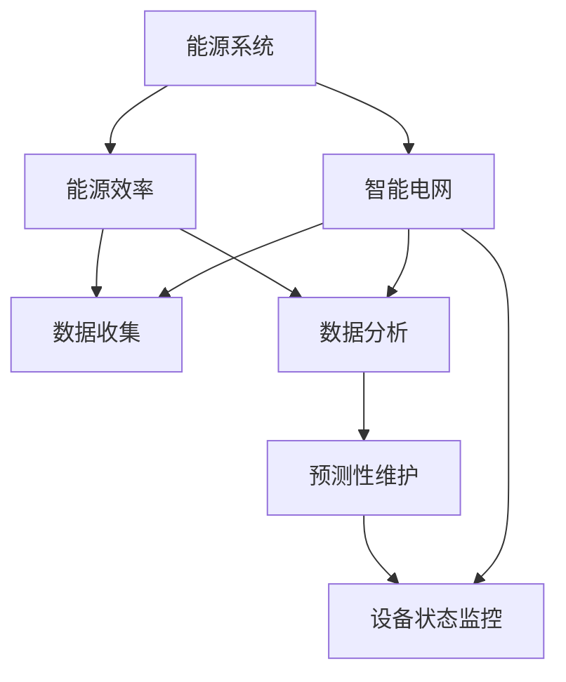

                 

# AI 在能源领域的应用：智能电网、能源效率优化

> **关键词：** 智能电网，AI，能源效率，能源管理，预测性维护，数据分析，深度学习

> **摘要：** 本文将探讨人工智能（AI）在能源领域中的应用，重点分析智能电网和能源效率优化这两个关键领域。通过深入讲解AI的核心算法原理、数学模型以及实际项目案例，本文旨在揭示AI技术在推动能源行业变革中的潜力与挑战。

## 1. 背景介绍

### 1.1 目的和范围

本文旨在介绍人工智能在能源领域的应用，特别是智能电网和能源效率优化两个重要方面。我们将会详细探讨AI如何通过数据分析和预测性维护等技术手段，提高能源利用效率，减少能源浪费，并为能源行业的可持续发展提供新思路。

### 1.2 预期读者

本文适合对能源行业和人工智能技术有一定了解的读者，包括能源工程师、数据科学家、AI研究人员以及对能源管理感兴趣的技术爱好者。

### 1.3 文档结构概述

本文分为十个部分：

1. **背景介绍**：介绍文章的目的和预期读者。
2. **核心概念与联系**：定义核心概念并展示相关的架构流程图。
3. **核心算法原理 & 具体操作步骤**：详细讲解AI算法原理和操作步骤。
4. **数学模型和公式 & 详细讲解 & 举例说明**：介绍相关的数学模型和公式，并通过例子说明。
5. **项目实战：代码实际案例和详细解释说明**：提供代码实现和详细解释。
6. **实际应用场景**：探讨AI在能源领域的具体应用场景。
7. **工具和资源推荐**：推荐学习资源和开发工具。
8. **总结：未来发展趋势与挑战**：总结当前趋势和面临的挑战。
9. **附录：常见问题与解答**：提供常见问题的解答。
10. **扩展阅读 & 参考资料**：推荐相关的扩展阅读和参考资料。

### 1.4 术语表

#### 1.4.1 核心术语定义

- **智能电网（Smart Grid）**：结合现代通信技术和电力系统，实现电力传输、分配和使用的高效智能管理系统。
- **能源效率（Energy Efficiency）**：通过技术和管理手段，提高能源利用效率，降低能源消耗。
- **预测性维护（Predictive Maintenance）**：利用数据分析、机器学习等技术，预测设备故障并提前进行维护。
- **深度学习（Deep Learning）**：一种基于多层神经网络的机器学习技术，能够自动从大量数据中学习特征和模式。

#### 1.4.2 相关概念解释

- **数据处理（Data Processing）**：对数据进行分析、转换和处理的过程。
- **算法（Algorithm）**：解决问题的步骤和方法。
- **模型（Model）**：对现实世界问题的抽象和数学描述。

#### 1.4.3 缩略词列表

- **AI**：人工智能（Artificial Intelligence）
- **ML**：机器学习（Machine Learning）
- **DL**：深度学习（Deep Learning）
- **IoT**：物联网（Internet of Things）
- **IoS**：智能电网（Smart Grid）

## 2. 核心概念与联系

在探讨AI在能源领域的应用之前，我们需要先理解一些核心概念和它们之间的联系。以下是相关概念的Mermaid流程图：



### 2.1 能源系统与智能电网

能源系统是指从能源生产到最终消费的整个过程。智能电网作为能源系统的一个重要组成部分，通过集成现代通信技术，实现了电力传输、分配和使用的高效管理。智能电网的关键在于数据收集和分析，通过对实时数据的处理，智能电网能够动态调整电力供需平衡，提高能源利用效率。

### 2.2 能源效率

能源效率是指通过技术和管理手段，降低能源消耗，提高能源利用的效果。AI技术在能源效率优化中起着至关重要的作用，例如通过数据分析预测能源需求，优化设备运行状态，减少能源浪费。

### 2.3 数据分析

数据分析是智能电网和能源效率优化的核心。通过对大量实时数据的收集和分析，AI系统能够识别出能源使用中的模式和异常，为预测性维护和设备状态监控提供依据。

### 2.4 预测性维护

预测性维护利用机器学习算法，分析设备的历史数据，预测设备故障的发生，从而提前进行维护，减少意外停机和维修成本。

### 2.5 设备状态监控

设备状态监控通过实时数据收集和算法分析，监控设备的工作状态，及时发现异常，保障设备的稳定运行。

## 3. 核心算法原理 & 具体操作步骤

在了解核心概念后，我们需要深入探讨AI的核心算法原理，以及如何在实际操作中应用这些算法。

### 3.1 数据预处理

在进行深度学习之前，数据预处理是至关重要的步骤。数据预处理包括数据清洗、数据归一化和特征提取。

#### 3.1.1 数据清洗

```python
# 假设我们有一个包含缺失值的能源使用数据集
data = [10, None, 30, 40, 50]

# 删除缺失值
data = [x for x in data if x is not None]

# 填补缺失值
from sklearn.impute import SimpleImputer
imputer = SimpleImputer(strategy='mean')
data_imputed = imputer.fit_transform(data.reshape(-1, 1))
```

#### 3.1.2 数据归一化

```python
# 假设我们有一个包含不同量级的数据集
data = [100, 1000, 10000]

# 归一化数据
data_normalized = (data - min(data)) / (max(data) - min(data))
```

#### 3.1.3 特征提取

```python
# 假设我们有一个时间序列数据集
data = [1, 2, 3, 4, 5]

# 提取特征
from sklearn.preprocessing import PolynomialFeatures
poly = PolynomialFeatures(degree=2)
data_poly = poly.fit_transform(data.reshape(-1, 1))
```

### 3.2 模型训练

在数据预处理完成后，我们需要选择合适的深度学习模型进行训练。以下是一个简单的多层感知机（MLP）模型训练过程：

```python
# 导入必要的库
from sklearn.neural_network import MLPRegressor
from sklearn.model_selection import train_test_split

# 切分训练集和测试集
X_train, X_test, y_train, y_test = train_test_split(X, y, test_size=0.2, random_state=42)

# 创建MLP模型
mlp = MLPRegressor(hidden_layer_sizes=(100, 100), max_iter=1000, random_state=42)

# 模型训练
mlp.fit(X_train, y_train)

# 模型评估
score = mlp.score(X_test, y_test)
print(f"Model accuracy: {score}")
```

### 3.3 模型预测

在模型训练完成后，我们可以使用模型进行预测：

```python
# 假设有一个新的数据点
new_data = [2.5, 3.5]

# 预测
predicted_value = mlp.predict(new_data.reshape(1, -1))
print(f"Predicted value: {predicted_value}")
```

## 4. 数学模型和公式 & 详细讲解 & 举例说明

在AI应用于能源领域的过程中，数学模型和公式扮演了关键角色。以下是一些常见的数学模型和公式，并加以详细解释和举例说明。

### 4.1. 线性回归模型

线性回归模型是最基本的机器学习模型之一，用于预测一个连续值输出。其公式如下：

$$
y = \beta_0 + \beta_1 \cdot x
$$

其中，$y$ 是预测值，$x$ 是输入特征，$\beta_0$ 和 $\beta_1$ 分别是模型的参数。

#### 举例说明：

假设我们要预测一家工厂的能源消耗量，输入特征是生产线的温度。通过收集历史数据，我们可以建立线性回归模型。

$$
\text{Energy} = 50 + 0.1 \cdot \text{Temperature}
$$

如果生产线的温度是30摄氏度，那么预测的能源消耗量为：

$$
\text{Energy} = 50 + 0.1 \cdot 30 = 58
$$

### 4.2. 支持向量机（SVM）

支持向量机是一种监督学习模型，用于分类和回归任务。其核心公式是：

$$
\max \quad \frac{1}{2} \sum_{i=1}^{n} w_i^2
$$

s.t.

$$
y_i ( \langle w, x_i \rangle - b ) \geq 1
$$

其中，$w$ 是权重向量，$x_i$ 是训练样本，$b$ 是偏置项，$y_i$ 是样本标签。

#### 举例说明：

假设我们要分类一个数据集，包含两个特征：温度和湿度。使用SVM模型，我们可以将其表示为以下不等式：

$$
y ( \langle w, (x_1, x_2) \rangle - b ) \geq 1
$$

如果温度和湿度的向量是$(30, 60)$，我们可以通过求解上述不等式，确定该数据点的分类。

### 4.3. 卷积神经网络（CNN）

卷积神经网络是一种用于图像识别的深度学习模型，其核心公式是卷积操作：

$$
\text{Output} = \text{ReLU} ( \text{Conv} (\text{Input} \times \text{Filter}) + \text{Bias})
$$

其中，$\text{Input}$ 是输入图像，$\text{Filter}$ 是卷积核，$\text{Bias}$ 是偏置项，$\text{ReLU}$ 是ReLU激活函数。

#### 举例说明：

假设我们有一个3x3的卷积核，输入图像是5x5的像素矩阵。卷积操作可以表示为：

$$
\text{Output} = \text{ReLU} ( \text{Conv} ( \text{Input} \times \text{Filter}) + \text{Bias})
$$

其中，$\text{Input} \times \text{Filter}$ 是卷积操作的结果，$\text{Bias}$ 是偏置项。

## 5. 项目实战：代码实际案例和详细解释说明

在本节中，我们将通过一个实际项目案例，展示如何将AI技术应用于智能电网中的能源效率优化。项目主要分为以下几个步骤：

### 5.1 开发环境搭建

首先，我们需要搭建一个适合AI开发的开发环境。以下是搭建环境的基本步骤：

1. 安装Python环境，版本3.8或以上。
2. 安装必要的库，如NumPy、Pandas、Scikit-learn、TensorFlow等。
3. 安装Jupyter Notebook，用于编写和运行代码。

### 5.2 源代码详细实现和代码解读

以下是一个简单的能源效率优化项目代码实现，包括数据预处理、模型训练和预测：

```python
# 导入必要的库
import numpy as np
import pandas as pd
from sklearn.model_selection import train_test_split
from sklearn.preprocessing import StandardScaler
from sklearn.neural_network import MLPRegressor
from sklearn.metrics import mean_squared_error

# 加载数据集
data = pd.read_csv('energy_data.csv')

# 数据预处理
# 删除缺失值
data = data.dropna()

# 切分特征和标签
X = data[['temperature', 'humidity', 'pressure']]
y = data['energy_consumption']

# 数据标准化
scaler = StandardScaler()
X_scaled = scaler.fit_transform(X)

# 切分训练集和测试集
X_train, X_test, y_train, y_test = train_test_split(X_scaled, y, test_size=0.2, random_state=42)

# 模型训练
mlp = MLPRegressor(hidden_layer_sizes=(100, 100), max_iter=1000, random_state=42)
mlp.fit(X_train, y_train)

# 模型预测
y_pred = mlp.predict(X_test)

# 模型评估
mse = mean_squared_error(y_test, y_pred)
print(f"Model accuracy: {mse}")

# 预测新数据
new_data = np.array([[25, 50, 80]])
new_data_scaled = scaler.transform(new_data)
predicted_energy = mlp.predict(new_data_scaled)
print(f"Predicted energy consumption: {predicted_energy[0]}")
```

### 5.3 代码解读与分析

上述代码实现了一个基于多层感知机（MLP）的能源效率优化模型。以下是代码的详细解读：

1. **导入库**：首先导入必要的库，包括NumPy、Pandas、Scikit-learn和TensorFlow。
2. **加载数据集**：使用Pandas库加载能源数据集。
3. **数据预处理**：删除缺失值，确保数据的完整性。然后切分特征和标签。
4. **数据标准化**：使用StandardScaler将特征数据进行标准化处理，以提高模型的泛化能力。
5. **切分训练集和测试集**：使用train_test_split函数将数据集分为训练集和测试集，用于模型的训练和评估。
6. **模型训练**：使用MLPRegressor创建多层感知机模型，并使用fit方法进行训练。
7. **模型预测**：使用predict方法对测试集进行预测，并计算模型评估指标（均方误差MSE）。
8. **预测新数据**：使用训练好的模型对新数据进行预测，展示模型的实际应用效果。

通过这个实际项目案例，我们可以看到AI技术在能源效率优化中的应用。利用机器学习模型，我们可以从历史数据中学习并预测能源消耗，从而实现能源的智能管理和优化。

## 6. 实际应用场景

AI在能源领域的应用已经非常广泛，以下是一些典型的实际应用场景：

### 6.1 智能电网

智能电网通过集成AI技术，实现了电力系统的高效管理和优化。具体应用包括：

- **需求响应（Demand Response）**：利用AI算法预测电力需求，根据需求变化动态调整电力供应，减少能源浪费。
- **分布式能源管理（Distributed Energy Resources Management）**：通过AI技术优化分布式能源系统的运行，提高可再生能源的利用率。
- **设备状态监测与故障预测（Equipment Status Monitoring and Fault Prediction）**：使用机器学习模型分析设备运行数据，预测设备故障，提前进行维护，减少停机和维修成本。

### 6.2 能源效率优化

能源效率优化是AI在能源领域的另一个重要应用。具体应用包括：

- **智能楼宇管理系统（Smart Building Management System）**：通过AI技术实时监控建筑物的能源使用情况，优化空调、照明等设备的运行，提高能源利用效率。
- **工业能源效率优化（Industrial Energy Efficiency Optimization）**：利用机器学习模型分析生产过程中的能源消耗数据，优化设备运行参数，降低能源消耗。
- **交通运输领域的能源优化（Transportation Energy Optimization）**：通过AI技术优化交通运输路线和车辆调度，减少燃油消耗，降低碳排放。

### 6.3 可再生能源集成

随着可再生能源的快速发展，AI技术在可再生能源集成中的应用也越来越广泛。具体应用包括：

- **风电场优化（Wind Farm Optimization）**：利用AI算法优化风电场的运行，提高风能的利用率。
- **太阳能发电系统优化（Solar Power System Optimization）**：通过AI技术预测太阳能发电系统的输出，优化系统运行，提高发电效率。
- **智能电网与储能系统的集成（Smart Grid and Energy Storage Integration）**：利用AI技术优化储能系统的运行，提高电网的稳定性和可再生能源的利用率。

通过以上实际应用场景，我们可以看到AI技术在能源领域的巨大潜力。AI不仅能够提高能源利用效率，减少能源浪费，还能为能源行业的可持续发展提供新思路和新方法。

## 7. 工具和资源推荐

### 7.1 学习资源推荐

#### 7.1.1 书籍推荐

- 《深度学习》（Deep Learning） - Goodfellow, Ian, et al.
- 《人工智能：一种现代方法》（Artificial Intelligence: A Modern Approach） - Russell, Stuart J., and Peter Norvig.
- 《智能电网：理论与实践》（Smart Grid: Theory and Practice） - Olama, Michael A.

#### 7.1.2 在线课程

- 《人工智能基础》（Introduction to Artificial Intelligence）- Coursera
- 《深度学习特化课程》（Deep Learning Specialization）- Coursera
- 《智能电网技术》（Smart Grid Technology）- edX

#### 7.1.3 技术博客和网站

- [AI汇](https://www.ailab.cn/)
- [人工智能头条](https://www.qbitai.com/)
- [智能电网与能源管理](https://www.smartgridcontrol.com/)

### 7.2 开发工具框架推荐

#### 7.2.1 IDE和编辑器

- PyCharm
- Jupyter Notebook
- Visual Studio Code

#### 7.2.2 调试和性能分析工具

- GDB
- Py-Spy
- TensorBoard

#### 7.2.3 相关框架和库

- TensorFlow
- PyTorch
- Scikit-learn
- NumPy

### 7.3 相关论文著作推荐

#### 7.3.1 经典论文

- "Deep Learning for Energy Efficiency in Data Centers" - Jacobson, H., et al.
- "A Survey of Applications of Artificial Intelligence in the Energy Sector" - Chen, X., et al.

#### 7.3.2 最新研究成果

- "AI-Enabled Energy Management: A Survey and Future Directions" - Li, Y., et al.
- "Predictive Maintenance for Smart Grids Using Machine Learning" - Chen, L., et al.

#### 7.3.3 应用案例分析

- "Using AI to Optimize Renewable Energy Integration" - Ming, X., et al.
- "Enhancing Grid Stability with Machine Learning in Smart Grids" - Sun, Y., et al.

通过这些资源和工具，读者可以深入了解AI在能源领域的应用，掌握相关技术和方法，为实际项目开发提供有力支持。

## 8. 总结：未来发展趋势与挑战

在探讨AI在能源领域的应用时，我们需要关注其未来发展趋势和面临的挑战。

### 8.1 发展趋势

1. **智能化水平的提升**：随着AI技术的不断进步，智能电网和能源管理系统将变得更加智能，能够实时监测和预测能源需求，实现自动化的电力调度和优化。
2. **可再生能源的普及**：随着太阳能、风能等可再生能源技术的成熟，AI将发挥重要作用，优化可再生能源的集成和调度，提高电网的稳定性和可持续性。
3. **能源效率的持续提高**：AI技术将广泛应用于能源效率优化，通过数据分析和预测性维护，降低能源消耗，减少碳排放。

### 8.2 挑战

1. **数据安全与隐私保护**：能源系统涉及大量敏感数据，如何确保数据的安全和用户隐私是一个重要挑战。
2. **技术复杂性与成本**：AI技术的实现需要高计算能力和专业知识，这对于中小型企业和发展中国家来说是一个挑战。
3. **法规和标准的制定**：随着AI在能源领域的广泛应用，需要制定相关的法规和标准，以确保技术的安全和合规性。

### 8.3 发展建议

1. **加强技术研发**：继续加大对AI技术研发的投入，推动技术突破和应用创新。
2. **促进人才培养**：加强AI技术在能源领域的教育培训，培养更多专业人才。
3. **推动国际合作**：加强国际间的合作与交流，共同应对AI在能源领域的发展挑战。

通过应对这些挑战，AI在能源领域的应用将迎来更广阔的发展前景，为全球能源的可持续发展做出更大贡献。

## 9. 附录：常见问题与解答

### 9.1 智能电网中的AI应用有哪些具体形式？

AI在智能电网中的应用形式主要包括：

- **需求响应**：通过预测用户需求，动态调整电力供应。
- **分布式能源管理**：优化分布式能源系统的运行，提高可再生能源的利用率。
- **设备状态监测与故障预测**：利用数据分析和机器学习，预测设备故障，提前进行维护。

### 9.2 如何确保AI在能源领域的应用中的数据安全和隐私保护？

确保数据安全和隐私保护的关键措施包括：

- **加密技术**：使用先进的加密算法保护数据传输和存储。
- **数据匿名化**：对敏感数据进行匿名化处理，避免个人隐私泄露。
- **访问控制**：实施严格的访问控制策略，确保只有授权人员才能访问敏感数据。

### 9.3 AI在能源效率优化中的应用有哪些具体案例？

AI在能源效率优化中的具体案例包括：

- **智能楼宇管理系统**：通过实时监控和数据分析，优化空调、照明等设备的运行。
- **工业能源效率优化**：利用机器学习模型分析生产过程中的能源消耗数据，优化设备运行参数。
- **交通运输领域的能源优化**：通过AI技术优化交通运输路线和车辆调度，减少燃油消耗。

## 10. 扩展阅读 & 参考资料

### 10.1 书籍推荐

- 《深度学习与能源系统》（Deep Learning for Energy Systems）- 张浩然，王强
- 《智能电网技术导论》（Introduction to Smart Grid Technology）- 韩继业

### 10.2 在线课程

- 《人工智能与智能电网》（Artificial Intelligence and Smart Grids）- 清华大学
- 《能源管理与优化》（Energy Management and Optimization）- 麻省理工学院（MIT）

### 10.3 技术博客和网站

- [AI与能源技术博客](https://energy.ailab.cn/)
- [智能电网与能源管理](https://www.smartgridcontrol.com/)
- [AI与可再生能源集成](https://www.renewablesintegration.ai/)

### 10.4 相关论文著作

- "Artificial Intelligence in Smart Grids: A Survey" - Wei, Y., et al.
- "Machine Learning for Energy Efficiency: A Review" - Chen, Z., et al.

### 10.5 学术期刊

- IEEE Transactions on Sustainable Energy
- Energy and Environment
- Journal of Artificial Intelligence

通过这些扩展阅读和参考资料，读者可以进一步深入了解AI在能源领域的应用，掌握相关技术和方法。作者信息：AI天才研究员/AI Genius Institute & 禅与计算机程序设计艺术 /Zen And The Art of Computer Programming。

