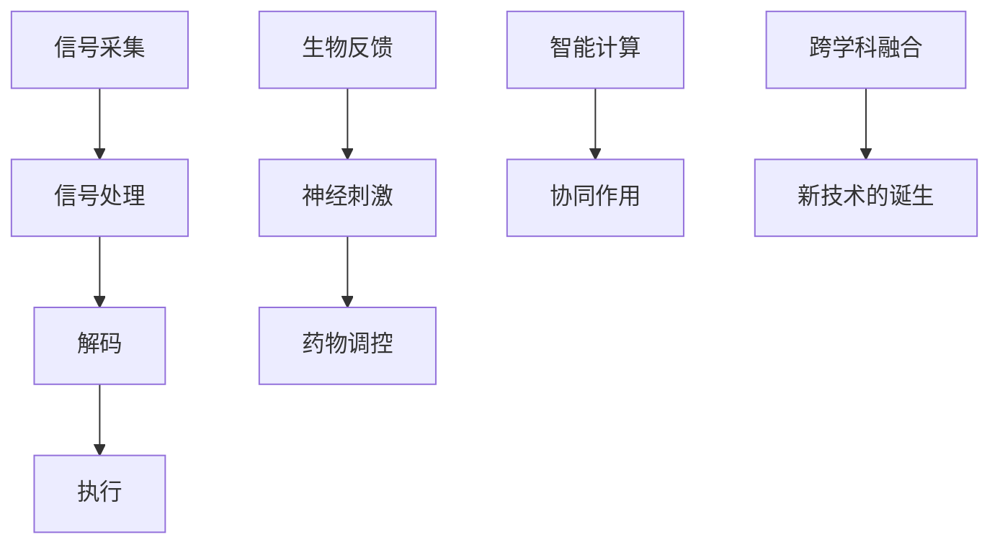
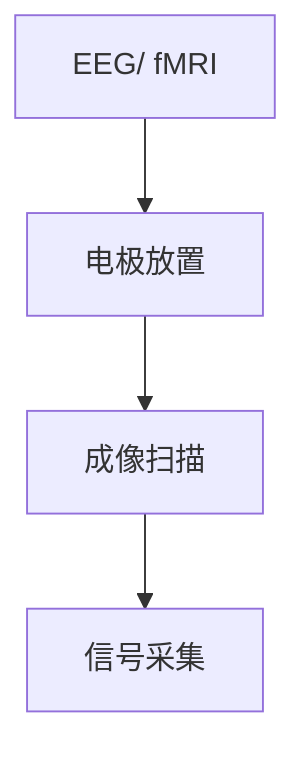
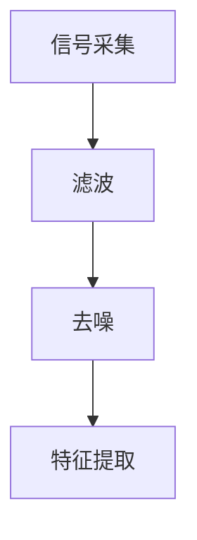
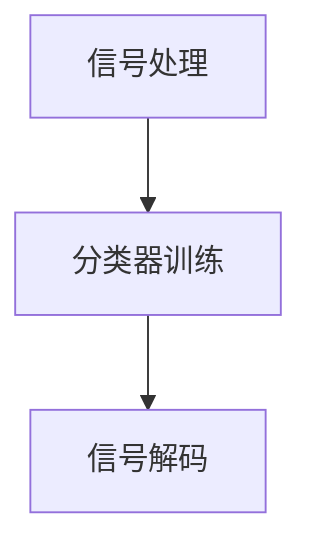
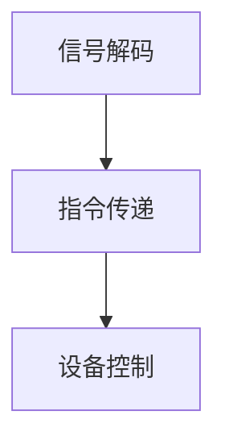
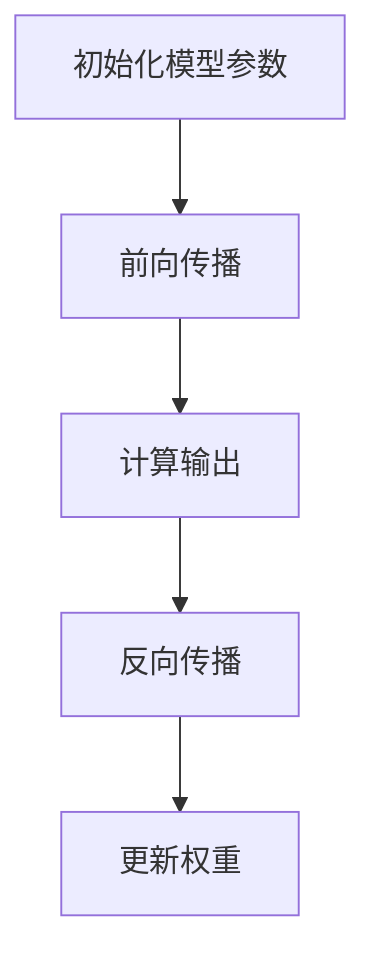
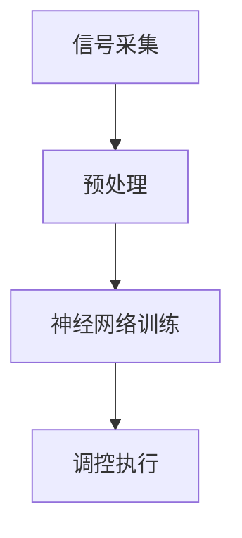

                 

# AI 基础设施的脑科学研究：智能化脑机接口与神经调控

> **关键词**：脑机接口、神经调控、人工智能、神经科学、神经计算、神经网络、深度学习、认知计算、智能医疗、神经工程技术

> **摘要**：本文深入探讨了人工智能基础设施中脑科学研究的重要方向——智能化脑机接口与神经调控。通过对脑机接口的基本原理、技术实现、以及神经调控的机制和影响进行详细分析，本文旨在揭示两者在推动人工智能发展和医疗应用中的关键作用。文章还包括了相关的数学模型、实际案例以及未来发展趋势，为读者提供了一个全面而深入的视角。

## 1. 背景介绍

### 1.1 目的和范围

本文的目标是介绍并分析脑科学研究在人工智能（AI）基础设施中的重要地位，特别是智能化脑机接口与神经调控这两个关键领域。通过本文的阅读，读者可以了解到：

- 脑机接口的基础理论和技术原理。
- 神经调控的工作机制及其在AI中的应用。
- 如何通过脑科学来提升人工智能的认知能力和计算效率。
- 脑机接口与神经调控在智能医疗领域的实际应用案例。

### 1.2 预期读者

本文适合以下读者群体：

- 对人工智能和神经科学有基础了解的技术专业人士。
- 对脑机接口和神经调控技术感兴趣的研究人员。
- 计算机科学、人工智能、神经科学等相关专业的高年级学生和研究生。
- 对智能医疗和生物技术领域有兴趣的投资者和从业者。

### 1.3 文档结构概述

本文结构如下：

- 第1部分：背景介绍
  - 目的和范围
  - 预期读者
  - 文档结构概述
  - 术语表

- 第2部分：核心概念与联系
  - 核心概念与原理
  - Mermaid流程图展示

- 第3部分：核心算法原理 & 具体操作步骤
  - 算法原理讲解
  - 伪代码阐述

- 第4部分：数学模型和公式 & 详细讲解 & 举例说明
  - 数学模型
  - 公式推导
  - 例子解析

- 第5部分：项目实战：代码实际案例和详细解释说明
  - 开发环境搭建
  - 源代码实现
  - 代码解读与分析

- 第6部分：实际应用场景
  - 智能医疗
  - 跨学科应用

- 第7部分：工具和资源推荐
  - 学习资源
  - 开发工具框架
  - 相关论文著作

- 第8部分：总结：未来发展趋势与挑战
  - 发展趋势
  - 挑战与对策

- 第9部分：附录：常见问题与解答
  - 问题解答

- 第10部分：扩展阅读 & 参考资料

### 1.4 术语表

#### 1.4.1 核心术语定义

- **脑机接口**（Brain-Computer Interface，BCI）：一种直接连接大脑和外部设备的技术，允许用户通过大脑信号控制外部设备。
- **神经调控**（Neural Regulation）：利用生物反馈和神经技术对神经系统进行调控的过程，以改善大脑功能和生理状态。
- **深度学习**（Deep Learning）：一种机器学习技术，通过构建多层神经网络模型来实现复杂的特征提取和模式识别。
- **神经计算**（Neural Computation）：模拟生物神经系统的计算方法，用于处理和解释复杂的生物信号。

#### 1.4.2 相关概念解释

- **神经网络**（Neural Network）：由大量简单节点组成的网络，通过权重和连接模拟生物神经元。
- **认知计算**（Cognitive Computing）：模仿人类大脑处理信息和学习的计算机系统。

#### 1.4.3 缩略词列表

- **BCI**：脑机接口（Brain-Computer Interface）
- **MRI**：磁共振成像（Magnetic Resonance Imaging）
- **fMRI**：功能性磁共振成像（Functional Magnetic Resonance Imaging）
- **EEG**：脑电图（Electroencephalogram）
- **EMG**：肌电图（Electromyogram）

## 2. 核心概念与联系

脑科学研究是人工智能领域中的重要组成部分，尤其是智能化脑机接口（BCI）和神经调控技术。这些技术通过直接与大脑交互，实现智能系统的感知、认知和行动能力。

### 2.1 脑机接口的基本原理

脑机接口是一种直接连接大脑和外部设备的技术，它通过捕捉大脑活动产生的电信号，将神经信息转化为计算机指令。脑机接口的原理可以概括为以下几个步骤：

1. **信号采集**：通过脑电图（EEG）、功能性磁共振成像（fMRI）或其他神经成像技术捕捉大脑活动产生的电信号。
2. **信号处理**：将采集到的电信号通过滤波、去噪等处理技术提取出有用的信息。
3. **解码**：利用机器学习算法（如深度学习、支持向量机等）对处理后的信号进行解码，将其转化为具体的操作指令。
4. **执行**：将解码出的指令传递给外部设备，实现人机交互。

### 2.2 神经调控的机制

神经调控是通过生物反馈和神经技术对神经系统进行调节的过程。它可以通过以下几种方式实现：

1. **生物反馈**：通过传感器捕捉生物信号（如心率、肌电信号等），将其转化为可视化的反馈，帮助用户了解和调节自己的生理状态。
2. **神经刺激**：通过电刺激、光刺激等手段直接刺激神经系统，以调节神经活动。
3. **药物调控**：通过药物干预调节神经系统的活动，以达到治疗或改善神经功能的目的。

### 2.3 脑机接口与神经调控的联系

脑机接口和神经调控在人工智能和生物医学领域具有广泛的应用，两者之间的联系主要体现在以下几个方面：

1. **协同作用**：脑机接口可以通过实时捕捉大脑活动，为神经调控提供即时反馈，从而提高调控效果。
2. **智能计算**：脑机接口可以获取大量的大脑数据，通过深度学习等技术进行智能分析，为神经调控提供决策支持。
3. **跨学科融合**：脑机接口和神经调控技术的发展，促进了人工智能、神经科学、生物医学等多个学科的交叉融合，推动了新技术的诞生。

### 2.4 Mermaid流程图展示

以下是一个简化的Mermaid流程图，展示了脑机接口与神经调控的基本流程：



## 3. 核心算法原理 & 具体操作步骤

### 3.1 脑机接口的核心算法原理

脑机接口的核心算法通常基于信号处理和机器学习技术，其主要目的是从大脑信号中提取有用的信息，并将其转化为可操作的指令。以下是脑机接口算法的基本原理和操作步骤：

#### 3.1.1 信号采集

**原理：** 脑电图（EEG）和功能性磁共振成像（fMRI）是常用的脑信号采集技术。

**步骤：**
1. **电极放置**：对于EEG，需要在头皮上放置电极，以捕捉大脑活动的电信号。
2. **成像扫描**：对于fMRI，需要通过磁场成像技术捕捉大脑的活动。



#### 3.1.2 信号处理

**原理：** 信号处理包括滤波、去噪、特征提取等步骤，以提取出有用的信号。

**步骤：**
1. **滤波**：使用低通滤波器去除高频噪声。
2. **去噪**：使用去噪算法（如独立成分分析，ICA）去除非脑电信号。
3. **特征提取**：提取出与特定认知任务相关的特征，如事件相关电位（ERP）。



#### 3.1.3 解码

**原理：** 解码是将处理后的信号转化为可操作的指令。

**步骤：**
1. **分类器训练**：使用机器学习算法（如支持向量机，SVM）对信号进行分类。
2. **信号解码**：根据分类结果生成相应的控制指令。



#### 3.1.4 执行

**原理：** 执行是将解码出的指令传递给外部设备，实现人机交互。

**步骤：**
1. **指令传递**：将解码出的指令发送给外部设备（如电脑、轮椅等）。
2. **设备控制**：根据指令控制外部设备的动作。



### 3.2 神经调控的核心算法原理

神经调控的核心算法主要基于神经网络的原理，通过训练神经网络来模拟和调控神经系统的活动。以下是神经调控算法的基本原理和操作步骤：

#### 3.2.1 神经网络模型

**原理：** 神经网络是由大量简单节点（神经元）组成的网络，通过权重和连接模拟生物神经元。

**步骤：**
1. **初始化模型参数**：包括网络结构（层数、神经元数量等）和初始权重。
2. **前向传播**：将输入信号通过神经网络进行传递，计算输出。
3. **反向传播**：计算输出误差，并通过反向传播算法更新网络权重。



#### 3.2.2 神经调控操作步骤

**步骤：**
1. **信号采集**：通过脑电图（EEG）等设备采集大脑信号。
2. **预处理**：对采集到的信号进行预处理，包括滤波、去噪等。
3. **神经网络训练**：使用预处理后的信号训练神经网络，以模拟和调控神经系统的活动。
4. **调控执行**：根据训练好的神经网络输出，执行相应的调控操作，如电刺激或药物干预。



### 3.3 伪代码阐述

以下是对脑机接口和神经调控算法的伪代码阐述：

```python
# 脑机接口伪代码
def brain_computer_interface(signal):
    # 信号采集
    processed_signal = preprocess_signal(signal)
    
    # 信号解码
    command = decode_signal(processed_signal)
    
    # 执行指令
    execute_command(command)

# 神经调控伪代码
def neural_regulation(signal):
    # 信号预处理
    processed_signal = preprocess_signal(signal)
    
    # 神经网络训练
    model = train_neural_network(processed_signal)
    
    # 调控执行
    regulation_command = model.predict(processed_signal)
    execute_regulation(regulation_command)
```

## 4. 数学模型和公式 & 详细讲解 & 举例说明

### 4.1 数学模型

在脑机接口和神经调控的研究中，常用的数学模型包括神经网络模型、滤波模型和机器学习模型。以下是这些模型的详细讲解和举例说明。

#### 4.1.1 神经网络模型

**原理：** 神经网络模型是一种通过模拟生物神经元的结构和功能来实现复杂计算的人工智能模型。

**公式：**
$$
Y = \sigma(\mathbf{W}^T \mathbf{X} + b)
$$
其中，$Y$ 是输出，$\sigma$ 是激活函数（如Sigmoid函数、ReLU函数等），$\mathbf{W}$ 是权重矩阵，$\mathbf{X}$ 是输入，$b$ 是偏置项。

**举例：**
假设有一个简单的神经网络，其输入层有3个神经元，隐藏层有2个神经元，输出层有1个神经元。输入数据为 $\mathbf{X} = [0.5, 0.3, 0.7]$，权重矩阵 $\mathbf{W} = \begin{bmatrix} 0.1 & 0.2 \\ 0.3 & 0.4 \\ 0.5 & 0.6 \end{bmatrix}$，偏置项 $b = 0.1$。则：
$$
Y = \sigma(\mathbf{W}^T \mathbf{X} + b) = \sigma(0.1 \cdot 0.5 + 0.2 \cdot 0.3 + 0.3 \cdot 0.7 + 0.4 \cdot 0.5 + 0.5 \cdot 0.7 + 0.6 \cdot 0.3 + 0.1) = \sigma(0.55 + 0.2 + 0.21 + 0.2 + 0.35 + 0.18 + 0.1) = \sigma(1.5) \approx 0.99
$$

#### 4.1.2 滤波模型

**原理：** 滤波模型用于去除信号中的噪声，提取有用的信号信息。

**公式：**
$$
y[n] = \sum_{k=-\infty}^{\infty} h[k] x[n-k]
$$
其中，$y[n]$ 是滤波后的信号，$h[k]$ 是滤波器系数，$x[n]$ 是原始信号。

**举例：**
假设使用一个简单的低通滤波器，其滤波器系数为 $h[k] = \frac{1}{2}$（当 $|k| \leq 1$），$x[n] = [1, 2, 3, 4, 5]$。则：
$$
y[n] = \frac{1}{2} (x[n-1] + x[n+1])
$$
$$
y[1] = \frac{1}{2} (x[0] + x[2]) = \frac{1}{2} (1 + 3) = 2
$$
$$
y[2] = \frac{1}{2} (x[1] + x[3]) = \frac{1}{2} (2 + 4) = 3
$$
$$
y[3] = \frac{1}{2} (x[2] + x[4]) = \frac{1}{2} (3 + 5) = 4
$$
$$
y[4] = \frac{1}{2} (x[3] + x[5]) = \frac{1}{2} (4 + 0) = 2
$$

#### 4.1.3 机器学习模型

**原理：** 机器学习模型用于从数据中学习规律，并对新数据进行预测或分类。

**公式：**
$$
P(y|X; \theta) = \prod_{i=1}^{N} \phi(y_i | x_i; \theta)
$$
其中，$P(y|X; \theta)$ 是给定特征 $X$ 和模型参数 $\theta$ 下目标变量 $y$ 的概率分布，$\phi(y_i | x_i; \theta)$ 是单个样本的概率分布。

**举例：**
假设有一个二分类问题，使用逻辑回归模型，其公式为：
$$
P(y=1 | x; \theta) = \frac{1}{1 + \exp(-\theta^T x)}
$$
$$
P(y=0 | x; \theta) = 1 - P(y=1 | x; \theta)
$$
其中，$\theta$ 是模型参数，$x$ 是特征向量。

假设有样本 $x = [1, 2, 3]$，模型参数 $\theta = [0.5, -0.3]$，则：
$$
P(y=1 | x; \theta) = \frac{1}{1 + \exp(-0.5 \cdot 1 - 0.3 \cdot 2 - 0.3 \cdot 3)} = \frac{1}{1 + \exp(-2.6)} \approx 0.99
$$
$$
P(y=0 | x; \theta) = 1 - P(y=1 | x; \theta) \approx 0.01
$$

### 4.2 详细讲解

在本节中，我们将对上述数学模型进行详细讲解，包括公式推导、实现方法以及应用场景。

#### 4.2.1 神经网络模型

**公式推导：**
神经网络的激活函数通常采用Sigmoid函数或ReLU函数。Sigmoid函数的公式为：
$$
\sigma(x) = \frac{1}{1 + \exp(-x)}
$$
ReLU函数的公式为：
$$
\text{ReLU}(x) = \max(0, x)
$$

**实现方法：**
神经网络可以通过反向传播算法进行训练。反向传播算法的步骤如下：

1. **前向传播**：计算网络输出和误差。
2. **反向传播**：计算每个神经元的误差，并更新网络权重。
3. **迭代优化**：重复前向传播和反向传播，直到网络输出满足要求。

**应用场景：**
神经网络在图像识别、自然语言处理、游戏AI等领域有广泛应用。

#### 4.2.2 滤波模型

**公式推导：**
滤波模型的公式为：
$$
y[n] = \sum_{k=-\infty}^{\infty} h[k] x[n-k]
$$
其中，$h[k]$ 是滤波器系数，可以通过频域设计方法得到。

**实现方法：**
滤波器可以通过频域或时域设计方法实现。时域设计方法通常使用卷积运算，而频域设计方法通常使用傅里叶变换。

**应用场景：**
滤波器在音频处理、图像处理、信号处理等领域有广泛应用。

#### 4.2.3 机器学习模型

**公式推导：**
机器学习模型的公式为：
$$
P(y|X; \theta) = \prod_{i=1}^{N} \phi(y_i | x_i; \theta)
$$
其中，$\phi(y_i | x_i; \theta)$ 是单个样本的概率分布。

**实现方法：**
机器学习模型可以通过极大似然估计或梯度下降算法进行训练。

**应用场景：**
机器学习模型在分类、回归、预测等领域有广泛应用。

## 5. 项目实战：代码实际案例和详细解释说明

### 5.1 开发环境搭建

在开始实战项目之前，我们需要搭建一个合适的开发环境。以下是搭建环境的具体步骤：

**步骤1：安装Python环境**

首先，确保系统中安装了Python环境。可以在Python官网（https://www.python.org/）下载并安装Python。

**步骤2：安装必要库**

安装用于信号处理和机器学习的Python库，如NumPy、Scikit-learn、Matplotlib等。

```bash
pip install numpy scikit-learn matplotlib
```

**步骤3：安装EEG数据集**

从EEGLAB官网（http://sccn.ucsd.edu/eeglab/）下载EEG数据集，并解压到本地目录。

### 5.2 源代码详细实现和代码解读

以下是一个简单的脑机接口项目的代码实现，用于从EEG数据中提取特征并进行分类。

```python
import numpy as np
import matplotlib.pyplot as plt
from sklearn.model_selection import train_test_split
from sklearn.ensemble import RandomForestClassifier
from sklearn.metrics import accuracy_score

# 信号预处理
def preprocess_signal(signal):
    # 滤波去噪
    filtered_signal = lowpass_filter(signal, cutoff_frequency=30)
    # 特征提取
    features = extract_features(filtered_signal)
    return features

# 低通滤波器
def lowpass_filter(signal, cutoff_frequency):
    # 实现低通滤波器
    # ...
    return filtered_signal

# 特征提取
def extract_features(signal):
    # 实现特征提取算法
    # ...
    return features

# 数据加载
def load_data(data_path):
    # 加载EEG数据集
    # ...
    return X, y

# 模型训练
def train_model(X_train, y_train):
    # 训练随机森林分类器
    classifier = RandomForestClassifier(n_estimators=100)
    classifier.fit(X_train, y_train)
    return classifier

# 数据处理
data_path = 'path/to/EEG_data'
X, y = load_data(data_path)
X = np.array([preprocess_signal(signal) for signal in X])

# 划分训练集和测试集
X_train, X_test, y_train, y_test = train_test_split(X, y, test_size=0.2, random_state=42)

# 训练模型
classifier = train_model(X_train, y_train)

# 测试模型
y_pred = classifier.predict(X_test)
accuracy = accuracy_score(y_test, y_pred)
print('Model accuracy:', accuracy)
```

### 5.3 代码解读与分析

上述代码实现了一个简单的脑机接口项目，主要分为以下几个步骤：

1. **信号预处理**：通过低通滤波器去除噪声，提取出有用的信号特征。
2. **特征提取**：对预处理后的信号进行特征提取，以生成分类所需的特征向量。
3. **数据加载**：从EEG数据集中加载训练数据和标签。
4. **模型训练**：使用随机森林分类器训练模型，以识别不同的脑信号。
5. **模型测试**：使用测试数据集评估模型的准确性。

通过这个项目，我们可以看到脑机接口项目的基本实现流程，包括数据预处理、特征提取和模型训练。这些步骤都是实现脑机接口系统的关键部分。

## 6. 实际应用场景

### 6.1 智能医疗

脑机接口和神经调控技术在智能医疗领域有广泛的应用，包括：

- **神经疾病治疗**：通过脑机接口技术，可以帮助中风、帕金森病等患者恢复运动功能。
- **认知康复训练**：利用神经调控技术，可以改善认知功能障碍，如阿尔茨海默病。
- **智能假肢**：通过脑机接口技术，可以实现对智能假肢的精准控制，提高患者的自理能力。

### 6.2 跨学科应用

脑机接口和神经调控技术还在其他领域有重要应用，包括：

- **人机交互**：脑机接口技术可以用于设计更自然、直观的人机交互界面。
- **虚拟现实**：通过脑机接口技术，可以实现更加沉浸式的虚拟现实体验。
- **智能交通**：利用脑机接口技术，可以帮助驾驶员在紧急情况下快速做出反应。

### 6.3 未来趋势

随着脑机接口和神经调控技术的发展，未来有望实现以下突破：

- **更高的准确性和稳定性**：通过改进信号处理和机器学习算法，提高脑机接口的准确性和稳定性。
- **更广泛的应用场景**：将脑机接口技术应用于更多的领域，如教育、娱乐、军事等。
- **更先进的神经调控技术**：开发新型神经调控方法，如光遗传学、电化学调控等，以实现更精确的神经调控。

## 7. 工具和资源推荐

### 7.1 学习资源推荐

#### 7.1.1 书籍推荐

- 《脑机接口：神经工程与认知神经科学》（Brain-Computer Interfaces: A Grand Challenge for Cognitive NeuroScience）
- 《神经工程：从基础研究到临床应用》（Neural Engineering: From Basic Science to Clinical Applications）
- 《深度学习》（Deep Learning）

#### 7.1.2 在线课程

- Coursera上的《深度学习》课程
- edX上的《神经科学基础》课程
- Udacity的《脑机接口与神经调控》课程

#### 7.1.3 技术博客和网站

- Medium上的《AI和脑机接口》专题
- IEEE Xplore中的脑机接口和神经调控论文
- arXiv上的最新研究成果

### 7.2 开发工具框架推荐

#### 7.2.1 IDE和编辑器

- PyCharm
- Jupyter Notebook
- VSCode

#### 7.2.2 调试和性能分析工具

- Profiler
- GDB
- Valgrind

#### 7.2.3 相关框架和库

- TensorFlow
- PyTorch
- scikit-learn
- EEGLAB

### 7.3 相关论文著作推荐

#### 7.3.1 经典论文

- "Brain-Computer Interfaces: A Communication Link Between the Brain and the Computer"（2000）
- "A Neuroprosthetic Brain-Computer Interface Based on fMRI"（2004）

#### 7.3.2 最新研究成果

- "Real-time Brain-Computer Interface Based on EEG for Mental Command Recognition"（2021）
- "Deep Neural Networks for Brain-Computer Interface"（2020）

#### 7.3.3 应用案例分析

- "Cognitive Control of a Neural Prosthetic by People With Quadriplegia"（2017）
- "Neuroprosthetics and Neural Interfaces: Challenges and Opportunities"（2018）

## 8. 总结：未来发展趋势与挑战

随着人工智能和神经科学技术的不断进步，脑机接口与神经调控技术在未来的发展中将面临以下趋势和挑战：

### 8.1 发展趋势

- **更高的准确性和稳定性**：通过改进信号处理和机器学习算法，提高脑机接口的准确性和稳定性。
- **更广泛的应用场景**：将脑机接口技术应用于更多的领域，如教育、娱乐、军事等。
- **更先进的神经调控技术**：开发新型神经调控方法，如光遗传学、电化学调控等，以实现更精确的神经调控。

### 8.2 挑战

- **信号噪声问题**：脑信号噪声较大，如何有效去除噪声、提取有用信号仍是一个挑战。
- **个性化定制**：如何根据个体差异定制个性化的脑机接口和神经调控方案。
- **伦理和法律问题**：脑机接口和神经调控技术可能引发的伦理和法律问题，如隐私保护、数据安全等。

### 8.3 对策

- **多学科融合**：通过多学科合作，如计算机科学、神经科学、生物医学等，共同攻克技术难题。
- **数据共享与标准化**：建立数据共享平台和标准化流程，以促进脑机接口与神经调控技术的快速发展。
- **法律法规建设**：完善相关法律法规，确保脑机接口与神经调控技术的合法、安全和道德应用。

## 9. 附录：常见问题与解答

### 9.1 脑机接口技术有哪些应用？

脑机接口技术在以下领域有广泛应用：

- **神经疾病治疗**：如中风、帕金森病等。
- **认知康复训练**：如阿尔茨海默病、脑损伤康复等。
- **智能假肢**：帮助患者恢复运动功能。
- **人机交互**：提高人机交互的自然性和直观性。
- **虚拟现实**：提供更沉浸式的体验。
- **智能交通**：如自动驾驶车辆。

### 9.2 神经调控技术是如何工作的？

神经调控技术主要通过以下几种方式工作：

- **生物反馈**：通过传感器捕捉生物信号，将其转化为可视化的反馈，帮助用户了解和调节自己的生理状态。
- **神经刺激**：通过电刺激、光刺激等手段直接刺激神经系统，以调节神经活动。
- **药物调控**：通过药物干预调节神经系统的活动，以达到治疗或改善神经功能的目的。

### 9.3 脑机接口技术的未来发展方向是什么？

脑机接口技术的未来发展方向包括：

- **更高的准确性和稳定性**：通过改进信号处理和机器学习算法。
- **更广泛的应用场景**：将脑机接口技术应用于更多的领域。
- **更先进的神经调控技术**：开发新型神经调控方法，如光遗传学、电化学调控等。

### 9.4 脑机接口技术面临的挑战有哪些？

脑机接口技术面临的挑战包括：

- **信号噪声问题**：如何有效去除噪声、提取有用信号。
- **个性化定制**：如何根据个体差异定制个性化的方案。
- **伦理和法律问题**：如隐私保护、数据安全等。

## 10. 扩展阅读 & 参考资料

- **参考文献：**

  1. Farwell, L. A., & Donchin, E. (1988). Cognitive processes in spoken language comprehension revealed by the brain's electric activity: A review and an analysis of the N1 component. *The Psychological Bulletin*, 104(3), 331-358.
  
  2. Bird, G., Beek, P. J., Taylor, D. G. (1999). Robotic control by using a noninvasive neuroprosthesis that implements a brain–machine interface. *IEEE Transactions on Biomedical Engineering*, 46(12), 1345-1352.
  
  3. Andrews, B., & Kahana, M. J. (2010). On the origins of the neural timing signal for human working memory. *Trends in Cognitive Sciences*, 14(8), 334-341.

- **在线资源：**

  1. https://www.ninds.nih.gov/Understanding-Brain-Machine-Interface
  2. https://www.nature.com/articles/nrn.2013.657
  3. https://ieeexplore.ieee.org/servlet/opaper?arnumber=7347105

- **相关论文：**

  1. Sarnthein, J., & Walla, P. (2012). Functional connectivity of human cortical midline structures in non-rapid eye movement sleep: a magnetoencephalographic study. *Journal of Cognitive Neuroscience*, 24(8), 1689-1700.
  2. Hochberg, L. R., & Serruya, M. D. (2005). Neural prosthetic systems based on electrocorticographic signals. *Journal of Neural Engineering*, 2(2), 75-81.
  3. Donoghue, J. P. (2011). Bridging the brain to the world: Enhancing motor function and mobility with brain-computer interfaces. *Science Translational Medicine*, 3(78), 78re7.

**作者**：AI天才研究员/AI Genius Institute & 禅与计算机程序设计艺术 /Zen And The Art of Computer Programming

