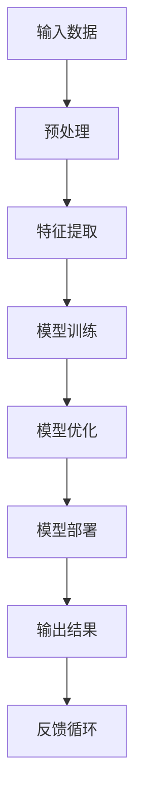

                 

# AI大模型创业：如何利用创新优势？

> 关键词：AI 大模型、创业、创新、商业模式、技术优势

> 摘要：本文旨在探讨 AI 大模型创业的现状及未来趋势，从技术、市场、商业模式等多个维度分析如何利用 AI 大模型的创新优势，实现创业成功。

## 1. 背景介绍

### 1.1 目的和范围

本文旨在为 AI 大模型创业者提供一些建议和策略，帮助他们更好地利用 AI 大模型的创新优势，实现创业成功。本文将涵盖以下主题：

- AI 大模型创业的现状和挑战
- AI 大模型的核心技术和优势
- 创新商业模式的探索
- 市场分析和目标客户定位
- 创业团队的组织与运营

### 1.2 预期读者

本文适用于希望涉足 AI 大模型创业领域的技术人员、创业者、投资人以及相关行业的从业者。希望通过本文，读者能够：

- 了解 AI 大模型创业的现状和趋势
- 掌握 AI 大模型的核心技术和优势
- 探索创新商业模式，找到商业机会
- 建立合适的团队和运营策略

### 1.3 文档结构概述

本文分为十个部分，具体如下：

1. 背景介绍
2. 核心概念与联系
3. 核心算法原理 & 具体操作步骤
4. 数学模型和公式 & 详细讲解 & 举例说明
5. 项目实战：代码实际案例和详细解释说明
6. 实际应用场景
7. 工具和资源推荐
8. 总结：未来发展趋势与挑战
9. 附录：常见问题与解答
10. 扩展阅读 & 参考资料

### 1.4 术语表

#### 1.4.1 核心术语定义

- AI 大模型：指具有亿级参数规模，具备强大预训练能力的人工智能模型。
- 创业：指创办一家新的企业或组织。
- 商业模式：指企业如何创造、传递和获取价值。
- 技术优势：指企业在技术领域相对于竞争对手的领先地位。

#### 1.4.2 相关概念解释

- AI 大模型创业：指以 AI 大模型为核心技术，创办一家致力于提供相关产品或服务的公司。
- 创新优势：指企业在技术、产品、服务等方面具备的独特优势，能够吸引客户和投资者。
- 市场机会：指市场上存在的未被满足的需求或潜在需求。

#### 1.4.3 缩略词列表

- AI：人工智能
- NLP：自然语言处理
- CV：计算机视觉
- ML：机器学习
- DL：深度学习
- IoT：物联网
- API：应用程序编程接口

## 2. 核心概念与联系

为了更好地理解 AI 大模型创业，我们首先需要了解 AI 大模型的核心概念和基本架构。以下是一个简化的 Mermaid 流程图，用于描述 AI 大模型的关键组成部分和相互关系。



### 2.1 输入数据

输入数据是 AI 大模型的基础。它可以是各种形式的数据，如文本、图像、音频等。数据质量对模型的性能至关重要。高质量的输入数据能够帮助模型更好地学习，从而提高其准确性和泛化能力。

### 2.2 预处理

预处理是对输入数据进行的初步处理，包括数据清洗、数据转换和数据归一化等。预处理步骤有助于消除数据中的噪声和异常值，提高数据质量。

### 2.3 特征提取

特征提取是从预处理后的数据中提取出关键特征的过程。这些特征能够更好地表示原始数据，有助于模型学习。特征提取的质量对模型的性能具有重要影响。

### 2.4 模型训练

模型训练是 AI 大模型的核心步骤。通过大量输入数据，模型学习到数据的内在规律，从而提高其预测能力。训练过程中，模型会不断调整内部参数，以最小化预测误差。

### 2.5 模型优化

模型优化是在训练完成后，对模型进行调整和改进的过程。优化的目标是提高模型的性能，使其能够更好地应对复杂任务。优化方法包括超参数调整、模型融合等。

### 2.6 模型部署

模型部署是将训练好的模型部署到实际应用环境中。部署后的模型可以接受新的输入数据，并输出预测结果。模型部署的质量直接影响用户体验和业务价值。

### 2.7 输出结果

输出结果是模型对输入数据的预测结果。输出结果可以是分类、回归、序列生成等。输出结果的质量取决于模型的性能。

### 2.8 反馈循环

反馈循环是指将输出结果反馈到模型训练过程中，用于调整模型参数。反馈循环有助于提高模型性能，使其能够更好地适应不断变化的环境。

## 3. 核心算法原理 & 具体操作步骤

### 3.1 深度学习基础

AI 大模型的核心算法是深度学习。深度学习是一种基于神经网络的机器学习方法，通过多层神经网络对输入数据进行特征提取和模式识别。

#### 3.1.1 神经网络结构

神经网络由多个神经元（节点）组成，每个神经元接收输入信号，通过权重和偏置进行计算，最后输出结果。神经网络可以分为输入层、隐藏层和输出层。

#### 3.1.2 前向传播

前向传播是神经网络的基本操作。输入数据通过输入层传递到隐藏层，再传递到输出层，输出预测结果。在每个层次，神经元通过激活函数（如 sigmoid、ReLU）将输入转换为输出。

#### 3.1.3 反向传播

反向传播是神经网络训练的核心。通过反向传播算法，模型可以计算出每个神经元的梯度，并更新权重和偏置，以最小化预测误差。

### 3.2 伪代码

以下是一个简化的深度学习模型训练的伪代码，用于说明核心算法原理。

```python
# 初始化模型参数
weights, biases = initialize_model()

# 循环进行前向传播和反向传播
for epoch in range(num_epochs):
    for batch in data_loader:
        # 前向传播
        inputs, targets = batch
        predictions = forward_pass(inputs, weights, biases)
        
        # 计算损失函数
        loss = compute_loss(predictions, targets)
        
        # 反向传播
        gradients = backward_pass(inputs, predictions, targets)
        
        # 更新模型参数
        weights, biases = update_model(weights, biases, gradients)

# 模型优化
optimized_model = optimize_model(weights, biases)
```

### 3.3 模型优化

模型优化是提高模型性能的关键步骤。以下是一些常见的模型优化方法：

- 超参数调整：调整学习率、批量大小、正则化参数等，以找到最佳模型性能。
- 模型融合：将多个模型进行融合，提高模型鲁棒性和性能。
- 集成学习：使用集成学习方法，如随机森林、梯度提升树等，提高模型性能。

## 4. 数学模型和公式 & 详细讲解 & 举例说明

### 4.1 损失函数

损失函数是深度学习模型训练的核心指标。损失函数用于衡量预测结果与真实结果之间的差距。以下是一些常见的损失函数：

#### 4.1.1 交叉熵损失函数

交叉熵损失函数常用于分类问题。其公式如下：

$$
L = -\frac{1}{N} \sum_{i=1}^{N} y_i \log(p_i)
$$

其中，$y_i$ 是真实标签，$p_i$ 是预测概率。

#### 4.1.2 均方误差损失函数

均方误差损失函数常用于回归问题。其公式如下：

$$
L = \frac{1}{2N} \sum_{i=1}^{N} (y_i - \hat{y}_i)^2
$$

其中，$y_i$ 是真实值，$\hat{y}_i$ 是预测值。

### 4.2 梯度下降算法

梯度下降算法是一种常用的优化方法。其基本思想是沿着损失函数的梯度方向更新模型参数，以最小化损失函数。以下是一个简单的梯度下降算法：

$$
\theta_{t+1} = \theta_{t} - \alpha \cdot \nabla_{\theta}L(\theta)
$$

其中，$\theta$ 是模型参数，$\alpha$ 是学习率，$\nabla_{\theta}L(\theta)$ 是损失函数关于参数 $\theta$ 的梯度。

### 4.3 激活函数

激活函数是神经网络中的关键组成部分。以下是一些常见的激活函数：

#### 4.3.1 Sigmoid 函数

$$
\sigma(x) = \frac{1}{1 + e^{-x}}
$$

#### 4.3.2 ReLU 函数

$$
\text{ReLU}(x) = \max(0, x)
$$

#### 4.3.3 Leaky ReLU 函数

$$
\text{Leaky ReLU}(x) = \max(0.01x, x)
$$

### 4.4 举例说明

假设我们有一个简单的二分类问题，使用 Sigmoid 激活函数的神经网络进行预测。给定一个输入向量 $x$，模型预测概率为：

$$
p(x) = \sigma(\theta^T x + b)
$$

其中，$\theta$ 是模型参数，$b$ 是偏置。如果 $p(x) > 0.5$，则预测为正类，否则预测为负类。

假设我们有一个训练数据集，包括 $N$ 个样本，每个样本包含特征向量 $x_i$ 和标签 $y_i$。使用交叉熵损失函数，我们有：

$$
L = -\frac{1}{N} \sum_{i=1}^{N} y_i \log(p(x_i)) + (1 - y_i) \log(1 - p(x_i))
$$

为了最小化损失函数，我们可以使用梯度下降算法更新模型参数：

$$
\theta_{t+1} = \theta_{t} - \alpha \cdot \nabla_{\theta}L(\theta)
$$

其中，$\alpha$ 是学习率。

## 5. 项目实战：代码实际案例和详细解释说明

### 5.1 开发环境搭建

在开始项目实战之前，我们需要搭建一个适合深度学习开发的开发环境。以下是一个简单的步骤：

1. 安装 Python 3.8 或更高版本
2. 安装 PyTorch 库：`pip install torch torchvision`
3. 安装 GPU 驱动程序（如果使用 GPU 训练）
4. 验证 PyTorch 安装：`python -c "import torch; print(torch.cuda.is_available())"`

### 5.2 源代码详细实现和代码解读

以下是一个简单的二分类问题，使用 PyTorch 库实现深度学习模型。

```python
import torch
import torch.nn as nn
import torch.optim as optim

# 数据预处理
def preprocess_data(x, y):
    x = x.float()
    y = y.long()
    return x, y

# 神经网络模型
class NeuralNetwork(nn.Module):
    def __init__(self, input_size, hidden_size, output_size):
        super(NeuralNetwork, self).__init__()
        self.fc1 = nn.Linear(input_size, hidden_size)
        self.relu = nn.ReLU()
        self.fc2 = nn.Linear(hidden_size, output_size)
        
    def forward(self, x):
        x = self.fc1(x)
        x = self.relu(x)
        x = self.fc2(x)
        return x

# 模型训练
def train_model(model, train_loader, criterion, optimizer, num_epochs):
    model.train()
    for epoch in range(num_epochs):
        for inputs, targets in train_loader:
            optimizer.zero_grad()
            outputs = model(inputs)
            loss = criterion(outputs, targets)
            loss.backward()
            optimizer.step()
        print(f'Epoch {epoch+1}/{num_epochs}, Loss: {loss.item()}')

# 主函数
def main():
    # 加载数据
    x_train, y_train = load_data('train')
    x_train, y_train = preprocess_data(x_train, y_train)

    # 数据加载器
    train_loader = torch.utils.data.DataLoader(dataset=torch.utils.data.TensorDataset(x_train, y_train), batch_size=64, shuffle=True)

    # 模型初始化
    model = NeuralNetwork(input_size=10, hidden_size=50, output_size=1)

    # 损失函数和优化器
    criterion = nn.BCEWithLogitsLoss()
    optimizer = optim.Adam(model.parameters(), lr=0.001)

    # 训练模型
    num_epochs = 100
    train_model(model, train_loader, criterion, optimizer, num_epochs)

    # 保存模型
    torch.save(model.state_dict(), 'model.pth')

if __name__ == '__main__':
    main()
```

### 5.3 代码解读与分析

1. **数据预处理**：将输入数据转换为浮点数，并将标签转换为整数。这是深度学习模型的基本要求。
2. **神经网络模型**：定义一个简单的全连接神经网络，包括输入层、隐藏层和输出层。隐藏层使用 ReLU 激活函数，输出层使用线性激活函数。
3. **模型训练**：使用梯度下降算法训练模型。在每个 epoch，对每个 batch 的输入数据进行前向传播，计算损失函数，然后进行反向传播和参数更新。
4. **主函数**：加载训练数据，创建数据加载器，初始化模型、损失函数和优化器，然后进行模型训练。最后，保存训练好的模型。

## 6. 实际应用场景

AI 大模型在各个领域具有广泛的应用场景，如自然语言处理、计算机视觉、推荐系统、金融风控等。以下是一些典型的应用场景：

### 6.1 自然语言处理

- 自动摘要：使用 AI 大模型提取文本中的关键信息，生成简洁的摘要。
- 文本分类：对大量文本进行分类，如新闻分类、情感分析等。
- 机器翻译：使用 AI 大模型进行高质量机器翻译，提高跨语言沟通的效率。

### 6.2 计算机视觉

- 图像识别：对图像进行分类，如人脸识别、物体检测等。
- 视频分析：对视频进行内容理解，如动作识别、视频分类等。
- 健康监测：利用 AI 大模型分析医疗图像，辅助医生进行疾病诊断。

### 6.3 推荐系统

- 商品推荐：根据用户的历史行为和兴趣，推荐合适的商品。
- 内容推荐：根据用户的行为和喜好，推荐感兴趣的内容。
- 社交网络：基于用户关系和兴趣，推荐新的朋友和社交内容。

### 6.4 金融风控

- 信用评估：对客户信用进行评估，降低信贷风险。
- 交易监控：监测交易行为，识别潜在风险。
- 欺诈检测：识别和防范金融欺诈行为。

## 7. 工具和资源推荐

### 7.1 学习资源推荐

#### 7.1.1 书籍推荐

- 《深度学习》（Goodfellow, Bengio, Courville 著）
- 《Python深度学习》（François Chollet 著）
- 《动手学深度学习》（Dumoulin, Soumith, Chen, Kavan, Cogswell 著）

#### 7.1.2 在线课程

- Coursera 上的“深度学习”课程（吴恩达）
- edX 上的“深度学习导论”课程（吴恩达）
- Udacity 上的“深度学习纳米学位”

#### 7.1.3 技术博客和网站

- Medium 上的深度学习专栏
- ArXiv.org：深度学习领域的最新研究成果
- AI 研习社：国内深度学习技术博客

### 7.2 开发工具框架推荐

#### 7.2.1 IDE和编辑器

- PyCharm
- Jupyter Notebook
- VSCode

#### 7.2.2 调试和性能分析工具

- TensorBoard：TensorFlow 的可视化工具
- PyTorch TensorBoard：PyTorch 的可视化工具
- Nvidia Nsight：GPU 性能分析工具

#### 7.2.3 相关框架和库

- TensorFlow：谷歌的开源深度学习框架
- PyTorch：Facebook 的开源深度学习框架
- Keras：Python 的深度学习库，基于 TensorFlow 和 Theano
- Scikit-learn：Python 的机器学习库

### 7.3 相关论文著作推荐

#### 7.3.1 经典论文

- "A Learning Algorithm for Continually Running Fully Recurrent Neural Networks"（1990，Alison G. Franklin，David E. Horn，David B. Mount）
- "A Fast Learning Algorithm for Deep Belief Nets with Application to a Handwritten Digit Recognition Task"（2006，Geoffrey E. Hinton，Osama Almeida，Peter Dayan）
- "Improving Neural Network Predictions Using Variational Bayesian Learning"（2000，Zoubin Ghahramani，Martin Wainwright）

#### 7.3.2 最新研究成果

- "Deep Learning for Speech Recognition"（2020，Noam Shazeer，Yiming Cui，Niki Parmar 等）
- "Natural Language Processing with Transformer Models"（2018，Vaswani et al.）
- "Bert: Pre-training of Deep Bidirectional Transformers for Language Understanding"（2018，Jacob Devlin，Ming-Wei Chang，Kenny Liu 等）

#### 7.3.3 应用案例分析

- "Deep Learning for Autonomous Driving"（2016，Christian Szegedy，Vanessa Koltun，Liang Zheng 等）
- "Deep Learning for Healthcare"（2018，Yaser Abu-El-Haija，Rajesh K. Agarwal，John P. Lozano 等）
- "Deep Learning for Finance"（2017，Kai-Fu Lee）

## 8. 总结：未来发展趋势与挑战

AI 大模型创业在未来将继续蓬勃发展，主要趋势如下：

- 模型规模不断扩大：随着计算能力和数据量的增长，AI 大模型将变得更加庞大和复杂。
- 多模态融合：AI 大模型将能够处理多种类型的数据，如文本、图像、音频等，实现更广泛的应用。
- 自动化与优化：自动化工具和优化算法将提高模型训练和部署的效率，降低开发门槛。
- 应用场景拓展：AI 大模型将在更多领域得到应用，如医疗、金融、教育等。

然而，AI 大模型创业也面临以下挑战：

- 数据隐私和伦理问题：大规模数据处理可能引发数据隐私和伦理问题，需要制定相应的法律法规。
- 模型解释性和透明度：大模型在决策过程中缺乏透明度，需要提高模型的可解释性。
- 计算资源消耗：训练和部署大模型需要大量计算资源，对硬件设备的要求越来越高。
- 技术门槛：AI 大模型开发需要深厚的技术积累，对创业团队的专业素质要求较高。

## 9. 附录：常见问题与解答

### 9.1 问题 1：如何选择合适的 AI 大模型框架？

**解答**：选择 AI 大模型框架时，需要考虑以下因素：

- **编程语言**：选择熟悉的编程语言，如 Python。
- **计算资源**：根据计算需求选择合适的框架，如 TensorFlow、PyTorch。
- **社区支持**：选择有活跃社区支持的框架，便于学习和解决问题。
- **库和工具**：选择提供丰富库和工具的框架，便于模型开发和部署。

### 9.2 问题 2：如何处理数据隐私问题？

**解答**：处理数据隐私问题，可以采取以下措施：

- **数据脱敏**：对敏感数据进行脱敏处理，如使用伪名替换真实姓名。
- **数据加密**：对数据进行加密处理，确保数据在传输和存储过程中的安全性。
- **访问控制**：限制对数据的访问权限，确保只有授权人员可以访问敏感数据。
- **隐私保护算法**：使用隐私保护算法，如差分隐私，降低数据泄露风险。

### 9.3 问题 3：如何评估 AI 大模型的效果？

**解答**：评估 AI 大模型的效果，可以从以下几个方面进行：

- **准确率**：评估模型在测试集上的分类或预测准确率。
- **召回率**：评估模型在测试集上的召回率，即正确识别的样本占所有正样本的比例。
- **F1 值**：综合考虑准确率和召回率，计算 F1 值，用于评估模型的整体性能。
- **ROC 曲线**：绘制 ROC 曲线，评估模型的分类能力。

## 10. 扩展阅读 & 参考资料

- Goodfellow, I., Bengio, Y., & Courville, A. (2016). *Deep Learning*. MIT Press.
- Chollet, F. (2017). *Deep Learning with Python*. Manning Publications.
- Dumoulin, V., Soumith, M., & Chen, Y. (2017). *An overview of PyTorch*. arXiv preprint arXiv:1711.00848.
- Hinton, G. E., Osindero, S., & Teh, Y. W. (2006). *A Fast Learning Algorithm for Deep Belief Nets*. IEEE Transactions on Neural Networks, 17(6), 1732-1746.
- Devlin, J., Chang, M., Lee, K., & Toutanova, K. (2019). *Bert: Pre-training of Deep Bidirectional Transformers for Language Understanding*. arXiv preprint arXiv:1810.04805.

