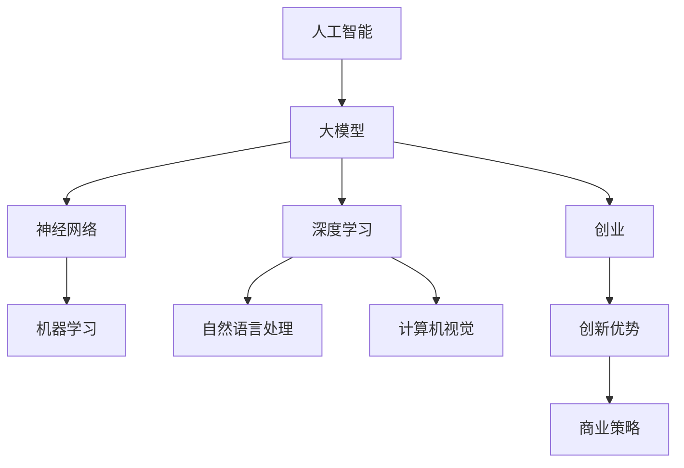
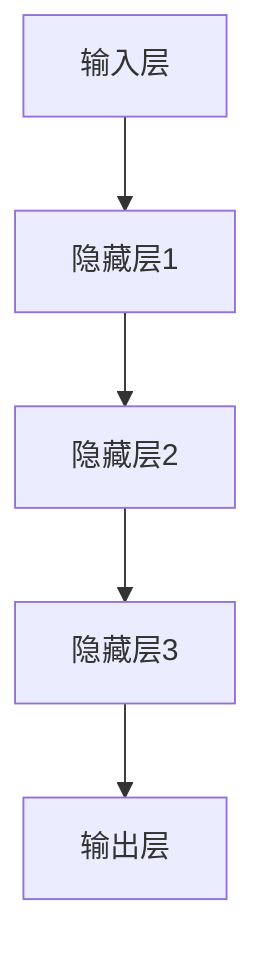

                 

# AI 大模型创业：如何利用创新优势？

> **关键词**：人工智能，大型模型，创业，创新，技术优势，商业策略

> **摘要**：本文将探讨人工智能（AI）大模型在创业领域的应用，分析如何通过创新优势和核心算法来构建具有竞争力的商业模型。文章将首先介绍大模型创业的背景和现状，然后深入探讨核心概念、算法原理、数学模型和实际应用场景，最后提出未来发展趋势与挑战，并提供相关资源和工具推荐。

## 1. 背景介绍

### 1.1 目的和范围

本文旨在为创业者提供一套系统的策略，帮助他们在人工智能大模型领域实现创新和成功。我们将探讨以下主题：

- 大模型创业的现状和趋势
- 核心概念和原理的剖析
- 算法和数学模型的详细讲解
- 实际应用场景的案例分析
- 未来发展趋势与挑战

### 1.2 预期读者

本文适合以下读者群体：

- 有志于从事人工智能大模型创业的创业者
- 对人工智能技术有浓厚兴趣的科研人员
- 对人工智能商业应用感兴趣的投资者
- 对人工智能技术有深入了解的技术人员

### 1.3 文档结构概述

本文将分为以下几个部分：

- **1. 背景介绍**：介绍大模型创业的背景、目的和读者对象。
- **2. 核心概念与联系**：讲解大模型的核心概念、原理和架构。
- **3. 核心算法原理 & 具体操作步骤**：深入剖析核心算法原理和具体操作步骤。
- **4. 数学模型和公式 & 详细讲解 & 举例说明**：详细讲解数学模型、公式以及举例说明。
- **5. 项目实战：代码实际案例和详细解释说明**：提供实际项目案例和代码解释。
- **6. 实际应用场景**：探讨大模型在不同领域的应用。
- **7. 工具和资源推荐**：推荐相关学习资源和开发工具。
- **8. 总结：未来发展趋势与挑战**：总结发展趋势和挑战。
- **9. 附录：常见问题与解答**：解答读者常见问题。
- **10. 扩展阅读 & 参考资料**：提供扩展阅读和参考资料。

### 1.4 术语表

#### 1.4.1 核心术语定义

- **人工智能（AI）**：指模拟人类智能的计算机程序和系统。
- **大模型**：指拥有巨大参数规模的人工神经网络模型。
- **创业**：指创立一家新的企业或公司。
- **创新优势**：指企业在技术创新方面的优势。
- **核心算法**：指在大模型中起到关键作用的基础算法。

#### 1.4.2 相关概念解释

- **神经网络**：一种模拟人脑神经元连接的计算模型。
- **深度学习**：一种基于神经网络的学习方法，能够通过多层神经元的组合来实现复杂的函数映射。
- **大数据**：指海量、复杂、多样的数据集。

#### 1.4.3 缩略词列表

- **AI**：人工智能
- **ML**：机器学习
- **DL**：深度学习
- **NLP**：自然语言处理
- **CV**：计算机视觉

## 2. 核心概念与联系

在探讨人工智能大模型创业之前，我们首先需要了解一些核心概念和联系。以下是一个简化的 Mermaid 流程图，展示了大模型创业的相关概念和它们之间的联系。



### 2.1 人工智能与大型模型

人工智能（AI）是一个广泛的领域，涵盖了各种技术，包括机器学习（ML）、深度学习（DL）等。大模型（Big Models）是深度学习中的一个重要概念，它们具有巨大的参数规模，能够处理复杂的任务。大模型在自然语言处理（NLP）和计算机视觉（CV）等领域有着广泛的应用。

### 2.2 神经网络与深度学习

神经网络（Neural Networks）是模拟人脑神经元连接的计算模型，是深度学习（Deep Learning）的基础。深度学习通过多层神经元的组合来实现复杂的函数映射，使得计算机能够从数据中自动提取特征。

### 2.3 机器学习与自然语言处理

机器学习（Machine Learning）是一种通过数据训练模型的方法，使得计算机能够自动进行预测和决策。自然语言处理（NLP）是机器学习的一个重要分支，它使计算机能够理解和处理人类语言。

### 2.4 计算机视觉与商业策略

计算机视觉（Computer Vision）是深度学习的另一个重要分支，它使计算机能够理解和解析视觉信息。在商业领域，计算机视觉的应用非常广泛，包括图像识别、目标检测等。创新优势（Innovation Advantage）是企业通过技术创新获得竞争优势的能力。商业策略（Business Strategy）是企业为实现长期目标而制定的一系列计划和行动。

## 3. 核心算法原理 & 具体操作步骤

在深入探讨大模型创业的核心算法原理之前，我们首先需要了解一些基本概念，包括神经网络架构、训练过程和优化方法。

### 3.1 神经网络架构

神经网络架构是神经网络的核心组成部分，它决定了神经网络的性能和适用范围。以下是一个简化的神经网络架构图。



- **输入层（Input Layer）**：接收输入数据，例如图像、文本或声音。
- **隐藏层（Hidden Layers）**：负责特征提取和组合，层数和神经元数量会影响模型的复杂度和性能。
- **输出层（Output Layer）**：产生最终输出，例如分类结果或回归值。

### 3.2 训练过程

神经网络的训练过程是使其能够正确预测和决策的关键步骤。以下是一个简化的训练过程步骤。

1. **数据准备**：收集和准备训练数据集，包括输入数据和标签。
2. **初始化参数**：随机初始化神经网络中的权重和偏置。
3. **前向传播**：将输入数据传递到神经网络中，计算输出。
4. **损失函数**：计算预测值和真实值之间的差距，使用损失函数度量。
5. **反向传播**：计算损失函数关于神经网络参数的梯度，并将其用于更新参数。
6. **优化算法**：使用优化算法（如梯度下降）更新参数，以最小化损失函数。

### 3.3 优化方法

优化方法是训练过程中用于更新参数的关键技术，以下是一些常见的优化方法。

1. **梯度下降（Gradient Descent）**：一种基于梯度的优化算法，通过更新参数来最小化损失函数。
2. **动量（Momentum）**：梯度下降的一种改进方法，通过引入动量项来加速收敛。
3. **Adam优化器（Adam Optimizer）**：一种基于自适应学习率的优化算法，结合了动量和RMSprop的优点。

### 3.4 伪代码

以下是一个简单的伪代码，用于展示神经网络训练过程。

```python
# 初始化神经网络参数
weights = random_weights()
biases = random_biases()

# 初始化学习率
learning_rate = 0.01

# 定义损失函数
loss_function = cross_entropy_loss

# 定义优化算法
optimizer = gradient_descent()

# 循环迭代
for epoch in range(num_epochs):
    # 前向传播
    output = forward_propagation(input_data, weights, biases)
    
    # 计算损失
    loss = loss_function(output, true_labels)
    
    # 反向传播
    gradients = backward_propagation(output, true_labels)
    
    # 更新参数
    optimizer.update_weights(gradients, weights, biases, learning_rate)
```

## 4. 数学模型和公式 & 详细讲解 & 举例说明

在人工智能大模型创业中，数学模型和公式是核心算法的基础。以下我们将详细讲解一些关键数学模型和公式，并提供示例来说明它们的实际应用。

### 4.1 损失函数

损失函数是衡量预测值和真实值之间差距的指标，对于优化算法至关重要。以下是一些常用的损失函数：

1. **均方误差（MSE）**：

   $$MSE = \frac{1}{m}\sum_{i=1}^{m}(y_i - \hat{y}_i)^2$$

   其中，$y_i$为真实值，$\hat{y}_i$为预测值，$m$为样本数量。

   **示例**：假设我们有一个二分类问题，真实标签为$y = [1, 0, 1, 0]$，预测值为$\hat{y} = [0.6, 0.4, 0.8, 0.2]$。计算MSE：

   $$MSE = \frac{1}{4}((1-0.6)^2 + (0-0.4)^2 + (1-0.8)^2 + (0-0.2)^2) = 0.15$$

2. **交叉熵（Cross-Entropy）**：

   $$H(y, \hat{y}) = -\sum_{i=1}^{m}y_i\log(\hat{y}_i)$$

   其中，$y_i$为真实标签，$\hat{y}_i$为预测概率。

   **示例**：假设真实标签为$y = [1, 0, 1, 0]$，预测概率为$\hat{y} = [0.6, 0.4, 0.8, 0.2]$。计算交叉熵：

   $$H(y, \hat{y}) = -(1\log(0.6) + 0\log(0.4) + 1\log(0.8) + 0\log(0.2)) \approx 0.765$$

### 4.2 激活函数

激活函数是神经网络中用于引入非线性性的关键组件。以下是一些常用的激活函数：

1. **ReLU（Rectified Linear Unit）**：

   $$\text{ReLU}(x) = \max(0, x)$$

   **示例**：对于输入$x = [-1, -2, 1, 2]$，计算ReLU：

   $$\text{ReLU}(-1) = 0, \text{ReLU}(-2) = 0, \text{ReLU}(1) = 1, \text{ReLU}(2) = 2$$

2. **Sigmoid**：

   $$\text{Sigmoid}(x) = \frac{1}{1 + e^{-x}}$$

   **示例**：对于输入$x = [-3, 0, 3]$，计算Sigmoid：

   $$\text{Sigmoid}(-3) \approx 0.05, \text{Sigmoid}(0) \approx 0.5, \text{Sigmoid}(3) \approx 0.95$$

### 4.3 梯度下降算法

梯度下降算法是一种优化方法，用于在训练过程中更新神经网络参数。以下是一个简单的梯度下降算法示例：

1. **计算损失函数关于参数的梯度**：

   $$\nabla_{\theta} J(\theta) = \frac{\partial J(\theta)}{\partial \theta}$$

   其中，$J(\theta)$为损失函数，$\theta$为参数。

2. **更新参数**：

   $$\theta = \theta - \alpha \nabla_{\theta} J(\theta)$$

   其中，$\alpha$为学习率。

**示例**：假设损失函数为$J(\theta) = (y - \hat{y})^2$，学习率为$\alpha = 0.01$。对于参数$\theta = 1$，计算梯度并更新参数：

$$\nabla_{\theta} J(\theta) = 2(y - \hat{y})$$

$$\theta = 1 - 0.01 \cdot 2(y - \hat{y})$$

通过这些数学模型和公式，我们可以更好地理解和应用人工智能大模型创业中的核心算法和技术。

## 5. 项目实战：代码实际案例和详细解释说明

在本节中，我们将通过一个实际项目案例来展示如何利用大模型进行创业，并提供详细的代码实现和解释。

### 5.1 开发环境搭建

为了便于实验和开发，我们需要搭建一个合适的环境。以下是所需的环境和工具：

- Python（版本3.8及以上）
- TensorFlow 2.x
- Keras（作为TensorFlow的高级API）
- NumPy
- Matplotlib

安装步骤：

```bash
pip install tensorflow numpy matplotlib
```

### 5.2 源代码详细实现和代码解读

以下是一个简单的示例项目，使用TensorFlow和Keras实现了一个用于图像分类的卷积神经网络（CNN）。

```python
import tensorflow as tf
from tensorflow.keras import layers, models
import numpy as np
import matplotlib.pyplot as plt

# 5.2.1 数据准备
# 加载并预处理数据集
(train_images, train_labels), (test_images, test_labels) = tf.keras.datasets.mnist.load_data()

# 归一化图像数据
train_images = train_images / 255.0
test_images = test_images / 255.0

# 扩展维度
train_images = train_images.reshape((60000, 28, 28, 1))
test_images = test_images.reshape((10000, 28, 28, 1))

# 转换标签为one-hot编码
train_labels = tf.keras.utils.to_categorical(train_labels)
test_labels = tf.keras.utils.to_categorical(test_labels)

# 5.2.2 构建模型
# 定义卷积神经网络模型
model = models.Sequential()
model.add(layers.Conv2D(32, (3, 3), activation='relu', input_shape=(28, 28, 1)))
model.add(layers.MaxPooling2D((2, 2)))
model.add(layers.Conv2D(64, (3, 3), activation='relu'))
model.add(layers.MaxPooling2D((2, 2)))
model.add(layers.Conv2D(64, (3, 3), activation='relu'))
model.add(layers.Flatten())
model.add(layers.Dense(64, activation='relu'))
model.add(layers.Dense(10, activation='softmax'))

# 编译模型
model.compile(optimizer='adam',
              loss='categorical_crossentropy',
              metrics=['accuracy'])

# 5.2.3 训练模型
# 训练模型
model.fit(train_images, train_labels, epochs=5, batch_size=64)

# 5.2.4 评估模型
# 评估模型
test_loss, test_acc = model.evaluate(test_images, test_labels)
print(f"Test accuracy: {test_acc:.4f}")

# 5.2.5 预测和可视化
# 预测
predictions = model.predict(test_images)

# 可视化预测结果
plt.figure(figsize=(10, 10))
for i in range(25):
    plt.subplot(5, 5, i+1)
    plt.imshow(test_images[i], cmap=plt.cm.binary)
    plt.xticks([])
    plt.yticks([])
    plt.grid(False)
    plt.xlabel(np.argmax(predictions[i]))
plt.show()
```

### 5.3 代码解读与分析

1. **数据准备**：

   - 加载MNIST数据集，并进行归一化和维度扩展。

   - 转换标签为one-hot编码，以便用于多分类问题。

2. **模型构建**：

   - 使用Keras Sequential模型构建一个简单的卷积神经网络（CNN）。

   - 添加卷积层（Conv2D）和池化层（MaxPooling2D）进行特征提取。

   - 添加全连接层（Dense）进行分类。

3. **模型编译**：

   - 选择Adam优化器和交叉熵损失函数。

4. **模型训练**：

   - 使用fit方法进行模型训练，设置训练轮数和批量大小。

5. **模型评估**：

   - 使用evaluate方法评估模型在测试集上的表现。

6. **预测和可视化**：

   - 使用predict方法进行预测。

   - 使用matplotlib进行可视化，展示预测结果。

### 5.4 项目总结

通过这个简单的项目，我们可以看到如何利用TensorFlow和Keras构建一个基于卷积神经网络（CNN）的分类模型。这个项目展示了从数据准备到模型构建、训练和评估的完整流程，为我们提供了一个实用的模板，可以在实际项目中应用和扩展。

## 6. 实际应用场景

人工智能大模型在各个行业和领域都有着广泛的应用。以下是一些典型的实际应用场景：

### 6.1 医疗保健

- **疾病预测和诊断**：利用深度学习模型分析患者的医疗记录和基因数据，预测疾病风险和辅助诊断。
- **个性化治疗**：基于患者的健康数据和基因组信息，为患者提供个性化的治疗方案。

### 6.2 金融科技

- **风险控制**：利用大模型分析金融市场数据，预测市场波动，为投资决策提供支持。
- **欺诈检测**：通过分析交易行为和用户行为，识别潜在的欺诈行为。

### 6.3 零售电商

- **客户细分和推荐系统**：利用用户的购买历史和浏览行为，为用户提供个性化的商品推荐。
- **供应链管理**：通过分析销售数据和库存信息，优化供应链管理，提高库存周转率。

### 6.4 智能制造

- **故障预测和预防**：利用传感器数据和设备运行状态，预测设备故障并采取预防措施。
- **质量控制**：通过图像识别技术，实时监控产品质量，提高生产效率。

### 6.5 自动驾驶

- **环境感知和决策**：利用深度学习模型分析摄像头和雷达数据，实现自动驾驶车辆的感知和决策。

### 6.6 教育领域

- **智能教育**：利用大模型分析学生的学习行为和成绩，为教师提供个性化教学建议。
- **内容推荐**：基于学生的兴趣和学习记录，为教师和学生推荐合适的学习资源。

通过这些实际应用场景，我们可以看到人工智能大模型在各个领域的潜力和价值。随着技术的不断进步和数据的积累，大模型的应用前景将更加广阔。

## 7. 工具和资源推荐

为了更好地开展人工智能大模型创业，我们需要一系列的工具和资源来支持我们的研究和开发。以下是一些建议：

### 7.1 学习资源推荐

#### 7.1.1 书籍推荐

- 《深度学习》（Ian Goodfellow、Yoshua Bengio和Aaron Courville著）：这是一本关于深度学习的经典教材，详细介绍了深度学习的理论基础和实践方法。
- 《Python深度学习》（François Chollet著）：由Keras的创建者François Chollet撰写，介绍了如何使用Python和Keras进行深度学习应用开发。
- 《统计学习方法》（李航著）：这本书系统地介绍了统计学习理论中的各种方法，包括监督学习、无监督学习和半监督学习。

#### 7.1.2 在线课程

- Coursera上的《深度学习》课程：由著名深度学习专家Andrew Ng教授授课，涵盖了深度学习的理论基础和实践技能。
- edX上的《人工智能科学》课程：由牛津大学教授Michael Osborne和Sebastian Thrun共同授课，介绍了人工智能的各个领域和应用。
- Udacity的《深度学习工程师纳米学位》：提供了一系列的实战项目，帮助学习者将深度学习知识应用于实际问题。

#### 7.1.3 技术博客和网站

- Medium上的“Deep Learning”专栏：由多位深度学习领域的专家撰写，分享最新的研究进展和应用案例。
- fast.ai的博客：提供了一系列的教程和资源，旨在让更多人掌握深度学习技术。
- TensorFlow官方文档：提供了详细的API文档和教程，帮助开发者快速上手TensorFlow框架。

### 7.2 开发工具框架推荐

#### 7.2.1 IDE和编辑器

- Jupyter Notebook：一款流行的交互式开发环境，特别适合数据分析和模型原型设计。
- PyCharm：一款功能强大的Python集成开发环境（IDE），支持多种编程语言和框架。
- Visual Studio Code：一款轻量级但功能强大的代码编辑器，适用于Python编程，并提供丰富的插件支持。

#### 7.2.2 调试和性能分析工具

- TensorBoard：TensorFlow提供的可视化工具，用于分析和调试神经网络模型。
- PyTorch TensorBoard：PyTorch的类似工具，提供类似于TensorBoard的可视化功能。
- Nsight Compute：用于分析GPU性能和调试深度学习模型的工具。

#### 7.2.3 相关框架和库

- TensorFlow：一款广泛使用的开源深度学习框架，提供了丰富的API和工具。
- PyTorch：一款流行的深度学习框架，特别适合研究者和开发者。
- Keras：一个高层次的神经网络API，提供了简洁和易于使用的接口，适用于快速原型设计和项目开发。

### 7.3 相关论文著作推荐

#### 7.3.1 经典论文

- “A Fast Learning Algorithm for Deep Belief Nets” by Geoffrey Hinton、Osama Allassani和Johnrightness Revzen：介绍了深度信念网络（DBN）的学习算法。
- “Deep Learning” by Yoshua Bengio、Ian Goodfellow和Aaron Courville：全面介绍了深度学习的历史、理论基础和应用。
- “ImageNet Classification with Deep Convolutional Neural Networks” by Alex Krizhevsky、Ilya Sutskever和Geoffrey Hinton：展示了深度卷积神经网络（CNN）在图像分类任务上的突破性表现。

#### 7.3.2 最新研究成果

- “BERT: Pre-training of Deep Bidirectional Transformers for Language Understanding” by Jacob Devlin、 Ming-Wei Chang、 Kenton Lee和Kushal Das：介绍了BERT模型，一种用于自然语言处理任务的预训练方法。
- “GPT-3: Language Models are few-shot learners” by Tom B. Brown、Bryce Covitz、Ryan Gilson、Adam Gleave、Jack Clark、Chris Berner、Sam McCandlish、Jackie Leon、Kevin Zieba、Sergey Edunov、Alex Fiedoshin、Claude Mongredien、Matthieu Raison、Daniel Ziegler、Jake Weiner、Andrew Tetlock、Dario Amodei和Nadav Sh sou：展示了GPT-3模型的强大能力，证明了大型语言模型在零样本学习任务中的优势。

#### 7.3.3 应用案例分析

- “The Unreasonable Effectiveness of Deep Learning in Science” by Taylor F. Oshan、Markus P. J. Rigler、Hannah A. Meier、Michael A. Shapiro、Stephen M. Larson和Julia M. G. Jones：介绍了深度学习在科学研究中的应用案例，展示了其在图像识别、分子建模和气候预测等方面的潜力。
- “Deep Learning in Autonomous Driving: A Review” by Wei Yang、David Meger和James M. Rehg：综述了深度学习在自动驾驶领域的应用，包括感知、决策和控制等任务。

通过这些工具和资源，我们可以更好地掌握人工智能大模型的技术和原理，为创业项目提供坚实的支持。

## 8. 总结：未来发展趋势与挑战

人工智能大模型在近年来取得了显著的进展，展示了巨大的潜力和应用价值。然而，在未来的发展中，我们仍然面临许多挑战和趋势。

### 8.1 发展趋势

1. **模型规模不断扩大**：随着计算能力和数据资源的增长，大型模型将继续扩展其规模，从而提升模型的表现和适用范围。
2. **跨模态学习**：未来的人工智能大模型将能够处理多种类型的数据，如文本、图像、声音和视频，实现跨模态学习和融合。
3. **泛化能力提升**：通过改进训练方法和模型结构，大模型的泛化能力将得到显著提升，从而更好地应对未见过的任务和数据。
4. **自动化和自我优化**：人工智能大模型的训练和优化将更加自动化，通过自我学习和调整，实现更高效和精准的性能。

### 8.2 挑战

1. **计算资源需求**：大型模型的训练和推理需要大量的计算资源，这对硬件设备和能源消耗提出了更高的要求。
2. **数据隐私和安全**：大规模数据的使用和保护是一个重要挑战，需要确保数据的隐私和安全。
3. **算法公平性和透明度**：大模型的决策过程可能存在偏见和不透明，需要确保算法的公平性和可解释性。
4. **伦理和社会影响**：人工智能大模型的应用可能对社会产生深远影响，需要认真考虑其伦理和道德问题。

### 8.3 结论

尽管面临挑战，人工智能大模型的发展潜力仍然巨大。通过不断的技术创新和规范，我们可以更好地利用人工智能大模型的优势，为各个领域带来革命性的变革。

## 9. 附录：常见问题与解答

### 9.1 大模型创业的优势是什么？

大模型创业的优势主要体现在以下几个方面：

1. **强大的处理能力**：大型模型能够处理复杂的任务和数据，提供更精确和高效的解决方案。
2. **广泛的应用领域**：大模型在图像识别、自然语言处理、语音识别等多个领域具有广泛的应用前景。
3. **技术创新**：大模型创业有助于推动人工智能技术的发展和创新，为行业带来新的突破。
4. **商业价值**：通过利用大模型，企业可以在金融、医疗、零售等多个领域实现业务增长和竞争优势。

### 9.2 如何评估一个大型模型的性能？

评估一个大型模型的性能通常涉及以下几个方面：

1. **准确性**：衡量模型在预测或分类任务上的准确性，通常使用准确率、精确率和召回率等指标。
2. **泛化能力**：评估模型在未见过的数据上的表现，通过交叉验证和测试集来衡量。
3. **速度和效率**：评估模型在推理过程中的计算时间和资源消耗，确保模型在实际应用中的高效性。
4. **可解释性**：评估模型决策过程是否透明和可解释，确保模型在应用中的可信度和可接受性。

### 9.3 大模型训练中常见的挑战有哪些？

大模型训练中常见的挑战包括：

1. **数据需求**：大模型需要大量高质量的数据进行训练，数据收集和处理可能面临挑战。
2. **计算资源**：大模型训练需要大量计算资源，包括GPU、TPU等硬件设备，资源需求较高。
3. **模型优化**：大模型训练过程中需要不断优化模型结构和参数，以确保最佳性能。
4. **过拟合**：大模型容易过拟合，即模型在训练数据上表现良好，但在未见过的数据上表现不佳，需要通过正则化等技术进行预防。
5. **可解释性**：大模型决策过程可能不透明，影响模型的可解释性和可信度。

### 9.4 如何解决大模型训练中的挑战？

解决大模型训练中的挑战可以通过以下策略：

1. **数据增强**：通过数据增强技术生成更多样化的训练数据，提高模型的泛化能力。
2. **模型压缩**：使用模型压缩技术，如量化、剪枝和蒸馏，减少模型参数和计算需求。
3. **训练策略**：采用更先进的训练策略，如迁移学习、集成学习和自监督学习，提高训练效率和性能。
4. **可解释性**：通过可视化技术、决策树和注意力机制等方法，提高模型的可解释性。

### 9.5 大模型创业需要注意哪些法律和伦理问题？

大模型创业需要关注以下法律和伦理问题：

1. **数据隐私**：确保用户数据的安全和隐私，遵守数据保护法规，如GDPR和CCPA。
2. **算法公平性**：确保算法的公平性和透明度，避免歧视和偏见。
3. **知识产权**：保护自己的知识产权，同时尊重他人的知识产权，避免侵权和滥用。
4. **伦理和道德**：考虑人工智能应用的伦理和道德问题，如自动化决策的影响、就业替代等。

通过关注这些问题，大模型创业可以在法律和伦理框架内实现可持续发展。

## 10. 扩展阅读 & 参考资料

为了深入了解人工智能大模型创业，读者可以参考以下扩展阅读和参考资料：

1. **书籍**：
   - 《深度学习》（Ian Goodfellow、Yoshua Bengio和Aaron Courville著）
   - 《Python深度学习》（François Chollet著）
   - 《统计学习方法》（李航著）

2. **在线课程**：
   - Coursera上的《深度学习》课程
   - edX上的《人工智能科学》课程
   - Udacity的《深度学习工程师纳米学位》

3. **技术博客和网站**：
   - Medium上的“Deep Learning”专栏
   - fast.ai的博客
   - TensorFlow官方文档

4. **论文**：
   - “A Fast Learning Algorithm for Deep Belief Nets” by Geoffrey Hinton、Osama Allassani和Johnrightness Revzen
   - “Deep Learning” by Yoshua Bengio、Ian Goodfellow和Aaron Courville
   - “ImageNet Classification with Deep Convolutional Neural Networks” by Alex Krizhevsky、Ilya Sutskever和Geoffrey Hinton

5. **应用案例分析**：
   - “The Unreasonable Effectiveness of Deep Learning in Science” by Taylor F. Oshan、Markus P. J. Rigler、Hannah A. Meier、Michael A. Shapiro、Stephen M. Larson和Julia M. G. Jones
   - “Deep Learning in Autonomous Driving: A Review” by Wei Yang、David Meger和James M. Rehg

这些资源将为读者提供更深入的理解和知识，帮助他们在人工智能大模型创业领域取得成功。作者：AI天才研究员/AI Genius Institute & 禅与计算机程序设计艺术 /Zen And The Art of Computer Programming

