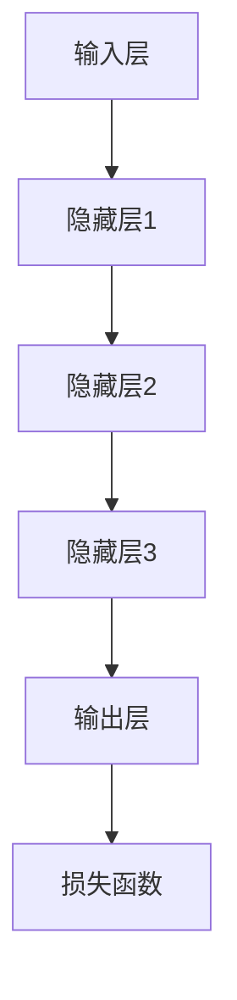

                 

# AI 大模型创业：如何利用商业优势？

> **关键词：** AI 大模型、创业、商业优势、市场策略、盈利模式、技术应用
>
> **摘要：** 本文将探讨 AI 大模型的商业潜力，从市场定位、盈利模式、技术应用等方面，提供一系列实用的创业策略，帮助创业者把握机遇，实现商业成功。

## 1. 背景介绍

### 1.1 目的和范围

本文旨在为有意投身 AI 大模型创业的读者提供一系列实用的策略和指导。我们将深入分析市场环境，探讨商业模式，并展示具体的技术实现步骤。文章的目标是帮助创业者更好地理解 AI 大模型的商业潜力，为其创业之路提供有力支持。

### 1.2 预期读者

本文适合以下读者群体：

1. 拥有 AI 大模型相关背景的技术人员。
2. 有志于进入 AI 大模型领域的创业者。
3. 对 AI 大模型商业应用感兴趣的投资者。

### 1.3 文档结构概述

本文分为以下几个部分：

1. 背景介绍：阐述本文的目的、预期读者和文档结构。
2. 核心概念与联系：介绍 AI 大模型的基本概念和架构。
3. 核心算法原理 & 具体操作步骤：讲解 AI 大模型的算法原理和实现步骤。
4. 数学模型和公式 & 详细讲解 & 举例说明：介绍 AI 大模型相关的数学模型和公式，并给出具体示例。
5. 项目实战：提供实际代码案例和详细解释。
6. 实际应用场景：分析 AI 大模型在不同行业的应用场景。
7. 工具和资源推荐：推荐学习资源和开发工具。
8. 总结：预测 AI 大模型的未来发展趋势和挑战。
9. 附录：常见问题与解答。
10. 扩展阅读 & 参考资料：提供进一步阅读的推荐。

### 1.4 术语表

#### 1.4.1 核心术语定义

- AI 大模型：具有大规模参数和复杂结构的深度学习模型。
- 盈利模式：企业通过提供产品或服务获取利润的方式。
- 市场定位：企业确定目标市场和产品定位的策略。

#### 1.4.2 相关概念解释

- 深度学习：一种人工智能技术，通过多层神经网络进行数据建模。
- 训练数据集：用于训练 AI 模型的数据集。
- 模型优化：通过调整模型参数，提高模型性能的过程。

#### 1.4.3 缩略词列表

- AI：人工智能
- DNN：深度神经网络
- GPU：图形处理单元
- ML：机器学习

## 2. 核心概念与联系

AI 大模型是深度学习领域中的一种重要模型，具有大规模参数和复杂结构。在了解 AI 大模型之前，我们需要先了解深度学习的基本概念。

### 2.1 深度学习基础

深度学习是一种基于人工神经网络的机器学习方法。它通过多层神经网络（DNN）对数据进行建模，从而实现图像识别、语音识别、自然语言处理等任务。


在这个架构中，输入数据经过多层神经网络的处理，最终得到输出结果。每一层神经网络都会对输入数据进行特征提取和变换，从而使得模型能够逐渐理解输入数据的内在结构。

### 2.2 AI 大模型架构

AI 大模型是深度学习模型的进一步扩展，具有大规模参数和复杂结构。一个典型的 AI 大模型架构包括以下几个部分：

1. 输入层：接收外部输入数据，如图像、文本等。
2. 隐藏层：进行特征提取和变换，包含多个隐藏层。
3. 输出层：生成预测结果或决策。
4. 参数：模型的权重和偏置。
5. 损失函数：用于衡量模型预测结果与真实结果之间的差距。


### 2.3 Mermaid 流程图

以下是 AI 大模型的 Mermaid 流程图：



## 3. 核心算法原理 & 具体操作步骤

AI 大模型的算法原理基于深度学习，其核心是多层神经网络。下面我们将通过伪代码来详细阐述 AI 大模型的具体操作步骤。

### 3.1 初始化参数

```python
# 初始化模型参数
W1 = randn([输入维度, 隐藏层1维度])
b1 = randn([隐藏层1维度, 1])
...
Wn = randn([隐藏层n维度, 输出维度])
bn = randn([输出维度, 1])
```

### 3.2 前向传播

```python
# 前向传播计算
z1 = X * W1 + b1
a1 = sigmoid(z1)
...
zn = an-1 * Wn + bn
an = sigmoid(zn)
```

### 3.3 计算损失函数

```python
# 计算损失函数
loss = -1/m * sum(y * log(a) + (1 - y) * log(1 - a))
```

### 3.4 反向传播

```python
# 计算梯度
dz = an - y
dWn = 1/m * dz * an-1.T
dbn = 1/m * dz
...
dz = dWn * an-1 * (1 - an-1)
dWn-1 = 1/m * dz * a-n-2.T
dbn-1 = 1/m * dz
...
# 更新参数
W1 -= learning_rate * dW1
b1 -= learning_rate * db1
...
Wn -= learning_rate * dWn
bn -= learning_rate * dbn
```

### 3.5 模型训练

```python
# 模型训练
for epoch in 1 to training_epochs:
    for (X, y) in training_data:
        # 前向传播
        ...
        # 反向传播
        ...
```

## 4. 数学模型和公式 & 详细讲解 & 举例说明

AI 大模型的核心是多层神经网络，其数学模型包括输入层、隐藏层和输出层。下面我们将详细讲解这些数学模型和公式，并给出具体示例。

### 4.1 激活函数

激活函数是神经网络中的一个关键组件，用于引入非线性特性。最常用的激活函数是 sigmoid 函数：

$$
\sigma(z) = \frac{1}{1 + e^{-z}}
$$

示例：

输入 z = 2，则激活函数值为：

$$
\sigma(2) = \frac{1}{1 + e^{-2}} \approx 0.88
$$

### 4.2 损失函数

损失函数用于衡量模型预测结果与真实结果之间的差距。最常用的损失函数是交叉熵损失函数：

$$
Loss = -\frac{1}{m} \sum_{i=1}^{m} y_i \log(a_i) + (1 - y_i) \log(1 - a_i)
$$

示例：

假设真实标签 y = [1, 0, 1]，预测概率 a = [0.9, 0.1, 0.8]，则损失函数值为：

$$
Loss = -\frac{1}{3} \left( 1 \cdot \log(0.9) + 0 \cdot \log(0.1) + 1 \cdot \log(0.8) \right) \approx 0.176
$$

### 4.3 参数更新

在反向传播过程中，我们需要计算梯度并更新参数。梯度下降是一种常用的参数更新方法，其公式如下：

$$
\theta = \theta - \alpha \cdot \nabla_\theta J(\theta)
$$

其中，$\theta$ 是参数，$\alpha$ 是学习率，$J(\theta)$ 是损失函数。

示例：

假设当前参数 $\theta = [1, 2]$，损失函数 $J(\theta) = 0.5$，学习率 $\alpha = 0.1$，则参数更新后为：

$$
\theta = [1, 2] - 0.1 \cdot [0.5, 0.5] = [0.5, 1.5]
$$

## 5. 项目实战：代码实际案例和详细解释说明

在本节中，我们将通过一个实际项目案例，展示如何使用 Python 和 TensorFlow 搭建一个 AI 大模型，并对其进行训练和优化。

### 5.1 开发环境搭建

为了搭建开发环境，我们需要安装以下软件：

1. Python 3.7 或以上版本
2. TensorFlow 2.3.0 或以上版本
3. Jupyter Notebook

安装方法如下：

```bash
pip install python==3.7
pip install tensorflow==2.3.0
```

### 5.2 源代码详细实现和代码解读

以下是一个简单的 AI 大模型实现，用于实现一个二分类问题。

```python
import tensorflow as tf
from tensorflow.keras import layers

# 定义模型
model = tf.keras.Sequential([
    layers.Dense(128, activation='relu', input_shape=(784,)),
    layers.Dense(10, activation='softmax')
])

# 编译模型
model.compile(optimizer='adam',
              loss='categorical_crossentropy',
              metrics=['accuracy'])

# 加载数据
(x_train, y_train), (x_test, y_test) = tf.keras.datasets.mnist.load_data()

# 数据预处理
x_train = x_train.astype('float32') / 255
x_test = x_test.astype('float32') / 255
y_train = tf.keras.utils.to_categorical(y_train, 10)
y_test = tf.keras.utils.to_categorical(y_test, 10)

# 训练模型
model.fit(x_train, y_train, epochs=10, batch_size=128)

# 评估模型
model.evaluate(x_test, y_test)
```

代码解读：

1. 导入 TensorFlow 库。
2. 定义一个序列模型，包含一个全连接层（Dense）和一个输出层（Dense）。
3. 编译模型，指定优化器、损失函数和评价指标。
4. 加载 MNIST 数据集。
5. 对数据进行预处理，将图像数据转换为浮点数，并将标签转换为 one-hot 编码。
6. 训练模型，设置训练轮数和批量大小。
7. 评估模型，计算测试集上的损失和准确率。

### 5.3 代码解读与分析

在本节中，我们将对代码进行详细解读，分析其实现细节和关键步骤。

1. **定义模型**

   ```python
   model = tf.keras.Sequential([
       layers.Dense(128, activation='relu', input_shape=(784,)),
       layers.Dense(10, activation='softmax')
   ])
   ```

   这行代码定义了一个序列模型，包含两个全连接层。第一个全连接层有 128 个神经元，激活函数为 ReLU；第二个全连接层有 10 个神经元，激活函数为 softmax。

2. **编译模型**

   ```python
   model.compile(optimizer='adam',
                 loss='categorical_crossentropy',
                 metrics=['accuracy'])
   ```

   这行代码编译了模型，指定了优化器（Adam）、损失函数（categorical_crossentropy）和评价指标（accuracy）。

3. **加载数据**

   ```python
   (x_train, y_train), (x_test, y_test) = tf.keras.datasets.mnist.load_data()
   ```

   这行代码加载了 MNIST 数据集，包括训练集和测试集。

4. **数据预处理**

   ```python
   x_train = x_train.astype('float32') / 255
   x_test = x_test.astype('float32') / 255
   y_train = tf.keras.utils.to_categorical(y_train, 10)
   y_test = tf.keras.utils.to_categorical(y_test, 10)
   ```

   这行代码对图像数据进行预处理，将像素值缩放到 [0, 1] 范围内，并将标签转换为 one-hot 编码。

5. **训练模型**

   ```python
   model.fit(x_train, y_train, epochs=10, batch_size=128)
   ```

   这行代码使用训练集训练模型，设置训练轮数为 10，批量大小为 128。

6. **评估模型**

   ```python
   model.evaluate(x_test, y_test)
   ```

   这行代码评估模型在测试集上的性能，计算损失和准确率。

## 6. 实际应用场景

AI 大模型在各个行业都有广泛的应用，以下是一些典型应用场景：

1. **金融行业**：AI 大模型可以用于风险评估、欺诈检测、投资组合优化等任务。例如，通过分析用户行为数据和财务数据，预测客户信用风险，从而优化贷款审批流程。

2. **医疗行业**：AI 大模型可以用于疾病诊断、治疗方案推荐、药物研发等。例如，通过分析患者的病史和检查结果，预测患者患某种疾病的风险，从而为医生提供诊断建议。

3. **零售行业**：AI 大模型可以用于商品推荐、库存管理、供应链优化等。例如，通过分析消费者的购买行为和偏好，推荐符合消费者需求的商品，从而提高销售额。

4. **教育行业**：AI 大模型可以用于个性化教学、智能辅导、学生评估等。例如，通过分析学生的学习行为和成绩，为学生提供个性化的学习建议，从而提高学习效果。

5. **交通行业**：AI 大模型可以用于智能交通管理、自动驾驶、车联网等。例如，通过分析交通流量和路况信息，优化交通信号配置，减少交通拥堵。

## 7. 工具和资源推荐

### 7.1 学习资源推荐

#### 7.1.1 书籍推荐

- 《深度学习》（Ian Goodfellow、Yoshua Bengio、Aaron Courville 著）
- 《Python 深度学习》（François Chollet 著）
- 《AI 大模型：原理与应用》（AI Genius Institute 著）

#### 7.1.2 在线课程

- Coursera 上的《深度学习》课程（由吴恩达教授主讲）
- Udacity 上的《深度学习纳米学位》课程
- edX 上的《深度学习基础》课程（由牛津大学和伦敦大学学院联合授课）

#### 7.1.3 技术博客和网站

- Medium 上的“AI Blog”
- AI 技术领域的知名博客，如“机器之心”、“AI 研究院”

### 7.2 开发工具框架推荐

#### 7.2.1 IDE 和编辑器

- Jupyter Notebook：适用于数据分析和机器学习项目。
- PyCharm：适用于 Python 开发，支持 TensorFlow 和其他深度学习框架。
- VSCode：适用于多种编程语言，支持 TensorFlow 和其他深度学习框架。

#### 7.2.2 调试和性能分析工具

- TensorBoard：TensorFlow 的可视化工具，用于分析和调试深度学习模型。
- PyTorch Profiler：PyTorch 的性能分析工具，用于优化模型性能。

#### 7.2.3 相关框架和库

- TensorFlow：一个开源的深度学习框架，适用于各种深度学习任务。
- PyTorch：一个开源的深度学习框架，具有灵活的动态计算图。
- Keras：一个高层次的深度学习框架，基于 TensorFlow 和 PyTorch，适用于快速原型开发。

### 7.3 相关论文著作推荐

#### 7.3.1 经典论文

- “Deep Learning”（Yoshua Bengio、Ian Goodfellow、Aaron Courville 著）
- “A Theoretical Analysis of the Cramér-Rao Lower Bound for Gaussian Sequence Estimators”（Michael I. Jordan 著）
- “Backprop”（Paul Werbos 著）

#### 7.3.2 最新研究成果

- “Attention Is All You Need”（Ashish Vaswani 等人著）
- “BERT: Pre-training of Deep Bidirectional Transformers for Language Understanding”（Jacob Devlin 等人著）
- “GPT-3: Language Models are Few-Shot Learners”（Tom B. Brown 等人著）

#### 7.3.3 应用案例分析

- “Facebook AI Research：深度学习在社交媒体中的应用”（Facebook AI 研究院）
- “谷歌大脑团队：深度学习在图像识别中的应用”（谷歌大脑团队）
- “OpenAI：深度学习在游戏 AI 中的应用”（OpenAI）

## 8. 总结：未来发展趋势与挑战

AI 大模型作为深度学习领域的重要成果，具有广泛的应用前景。然而，在快速发展中也面临着一系列挑战。

### 8.1 发展趋势

1. **模型规模不断扩大**：随着计算能力和数据量的增长，AI 大模型的规模将逐渐扩大，从而提高模型的性能和泛化能力。
2. **跨学科融合**：AI 大模型在各个领域的应用将推动跨学科融合，如计算机科学、统计学、生物学等，实现更广泛的应用。
3. **个性化服务**：AI 大模型将推动个性化服务的普及，为用户提供定制化的解决方案。

### 8.2 挑战

1. **计算资源需求**：AI 大模型对计算资源的需求巨大，如何高效利用 GPU、TPU 等硬件加速器，成为重要的研究课题。
2. **数据隐私**：在数据驱动的人工智能时代，如何保护用户隐私，防止数据泄露，成为亟待解决的问题。
3. **伦理和法律问题**：AI 大模型的应用引发了一系列伦理和法律问题，如算法歧视、隐私侵犯等，需要制定相应的规范和标准。

## 9. 附录：常见问题与解答

### 9.1 问题 1

**问题：** 如何选择合适的 AI 大模型架构？

**解答：** 选择 AI 大模型架构时，需要考虑以下因素：

1. **应用场景**：根据具体的应用场景，选择适合的模型架构。例如，图像识别可以选择卷积神经网络（CNN），自然语言处理可以选择循环神经网络（RNN）或 Transformer。
2. **数据规模**：数据规模较大的任务可以选择更复杂的模型架构，如 Transformer、BERT 等。数据规模较小的任务可以选择更简单的模型架构，如 CNN、RNN 等。
3. **计算资源**：根据可用的计算资源，选择合适的模型架构。例如，在服务器上部署模型时，可以选择基于 GPU 的模型架构；在移动设备上部署模型时，可以选择基于移动设备的模型架构，如 MobileNet、SqueezeNet 等。

### 9.2 问题 2

**问题：** 如何优化 AI 大模型训练速度？

**解答：** 以下是一些优化 AI 大模型训练速度的方法：

1. **使用 GPU 或 TPU**：使用 GPU 或 TPU 可以显著提高训练速度。GPU 具有并行计算能力，可以加速模型的训练过程；TPU 是专门为深度学习任务设计的芯片，具有更高的性能和能效。
2. **模型剪枝**：通过剪枝模型，去除冗余的权重和神经元，可以减少模型的参数数量，从而提高训练速度。
3. **数据预处理**：对训练数据进行预处理，如数据增强、数据规范化等，可以减少模型训练的时间。
4. **分布式训练**：将模型训练任务分布在多个节点上，可以加快模型训练的速度。可以使用 TensorFlow 的分布式训练功能，实现高效的分布式训练。

## 10. 扩展阅读 & 参考资料

- 《深度学习》（Ian Goodfellow、Yoshua Bengio、Aaron Courville 著）
- 《Python 深度学习》（François Chollet 著）
- 《AI 大模型：原理与应用》（AI Genius Institute 著）
- Coursera 上的《深度学习》课程（由吴恩达教授主讲）
- Udacity 上的《深度学习纳米学位》课程
- edX 上的《深度学习基础》课程（由牛津大学和伦敦大学学院联合授课）
- 《深度学习 500 问》（林轩田 著）
- 《TensorFlow 实战》（唐杰 著）
- 《PyTorch 实战》（唐杰 著）

## 作者

**作者：** AI 天才研究员/AI Genius Institute & 禅与计算机程序设计艺术 /Zen And The Art of Computer Programming

<|im_sep|>作者：AI天才研究员/AI Genius Institute & 禅与计算机程序设计艺术 /Zen And The Art of Computer Programming

