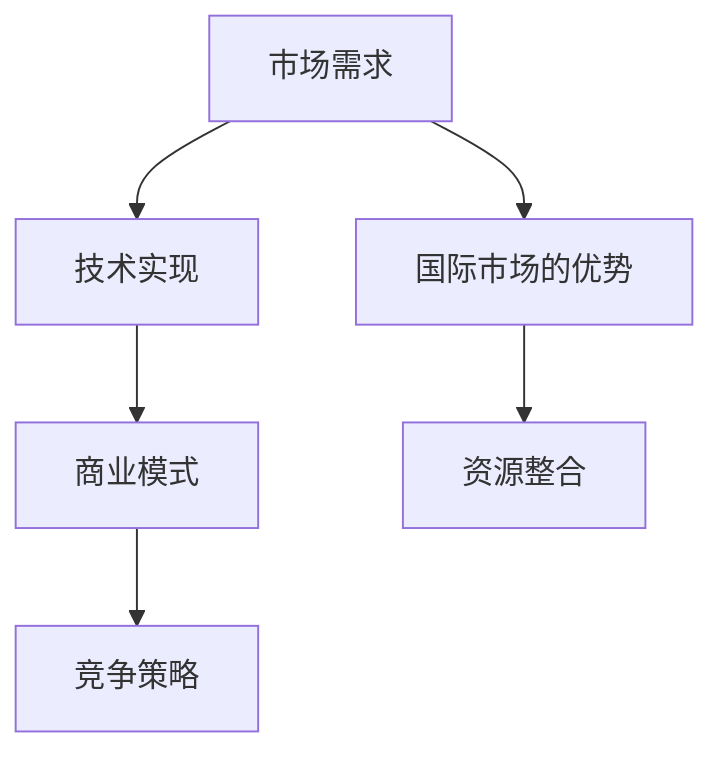

                 

# AI 大模型创业：如何利用国际优势？

> **关键词**：人工智能，大模型，创业，国际市场，技术优势，竞争策略

> **摘要**：本文将探讨AI大模型创业过程中如何充分发挥国际市场的优势，针对当前全球技术竞争态势，分析创业者如何从技术、市场、人才和资源等多个角度进行战略布局，实现创业项目的高效发展和持续创新。

## 1. 背景介绍

### 1.1 目的和范围

本文旨在为有意向在AI大模型领域创业的从业者提供一套系统的战略思路，帮助他们在全球市场中找到自己的立足点，通过合理利用国际优势，实现创业项目的成功。

### 1.2 预期读者

本文适合以下读者：

1. AI领域的技术创业者
2. 有意向进入AI大模型领域的创业者
3. AI研究者和工程师，对创业感兴趣
4. 对国际技术竞争态势和政策有兴趣的专业人士

### 1.3 文档结构概述

本文将从以下几个部分展开：

1. 核心概念与联系
2. 核心算法原理 & 具体操作步骤
3. 数学模型和公式 & 详细讲解 & 举例说明
4. 项目实战：代码实际案例和详细解释说明
5. 实际应用场景
6. 工具和资源推荐
7. 总结：未来发展趋势与挑战
8. 附录：常见问题与解答
9. 扩展阅读 & 参考资料

### 1.4 术语表

#### 1.4.1 核心术语定义

- **AI大模型**：指具有数亿甚至数十亿参数的大型神经网络模型，如GPT、BERT等。
- **创业**：创立新企业，开展新的商业活动。
- **国际市场**：指跨越国界的市场，包括全球各地消费者的需求和竞争环境。
- **技术优势**：指企业在某一领域内的技术领先地位和竞争优势。

#### 1.4.2 相关概念解释

- **人工智能**：一种模拟人类智能行为的技术，通过机器学习、深度学习等方法实现。
- **市场机会**：指市场环境中出现的有利于企业发展的条件或趋势。
- **人才战略**：企业在人才选拔、培养、激励等方面的策略。

#### 1.4.3 缩略词列表

- **AI**：人工智能（Artificial Intelligence）
- **GPT**：生成预训练模型（Generative Pre-trained Transformer）
- **BERT**：双向编码表示器（Bidirectional Encoder Representations from Transformers）

## 2. 核心概念与联系

为了更好地理解AI大模型创业的国际优势，我们需要先明确一些核心概念，并分析它们之间的联系。

### 2.1 AI大模型的核心概念

AI大模型是指基于深度学习技术训练的具有数亿甚至数十亿参数的大型神经网络模型。其核心概念包括：

- **深度学习**：一种机器学习方法，通过多层神经网络进行数据建模。
- **神经网络的参数**：模型中可训练的变量，用于捕捉数据中的复杂模式。
- **预训练**：在特定任务之前，对模型进行大规模数据集的训练，以提高泛化能力。

### 2.2 AI大模型与创业的联系

AI大模型创业的关键在于如何利用这些模型在全球市场中创造价值。具体而言，创业者需要考虑以下几个方面：

- **市场需求**：了解目标市场对AI大模型的需求，如自然语言处理、计算机视觉等。
- **技术实现**：掌握AI大模型的核心算法原理，确保创业项目的技术可行性。
- **商业模式**：设计合理的商业模式，将AI大模型应用于实际场景，创造商业价值。
- **竞争策略**：分析竞争对手的优势和劣势，制定有效的市场进入和竞争策略。

### 2.3 国际市场的优势

国际市场具有以下优势：

- **更广阔的市场空间**：相比于国内市场，国际市场拥有更多潜在用户和更大的商业机会。
- **多样化的市场需求**：不同国家和地区的消费者有不同的需求，有助于创业者找到独特的市场切入点。
- **技术竞争**：全球范围内的技术竞争促使创业者不断改进技术，提高产品质量。
- **资源整合**：国际市场可以更方便地整合全球范围内的技术、人才和资金资源。

### 2.4 Mermaid 流程图

以下是一个简单的Mermaid流程图，展示了AI大模型创业的核心概念和联系：



## 3. 核心算法原理 & 具体操作步骤

### 3.1 AI大模型的算法原理

AI大模型的算法原理主要基于深度学习技术，特别是基于 Transformer 架构的预训练模型。下面我们将通过伪代码来详细阐述这些算法原理。

#### 3.1.1 Transformer 架构

```python
class Transformer(Model):
    def __init__(self):
        self.embedding = Embedding(input_dim, d_model)
        self.encoder = Encoder(num_layers, d_model, d_inner, num_heads)
        self.decoder = Decoder(num_layers, d_model, d_inner, num_heads)
        self.fc = Dense(target_dim)

    def forward(self, x):
        x = self.embedding(x)
        x = self.encoder(x)
        x = self.decoder(x)
        x = self.fc(x)
        return x
```

#### 3.1.2 编码器（Encoder）

```python
class Encoder Layer(Model):
    def __init__(self, d_model, d_inner, num_heads):
        self.self_attn = MultiHeadAttention(d_model, num_heads)
        self.fc = nn.Sequential(
            nn.Linear(d_model, d_inner),
            nn.ReLU(),
            nn.Linear(d_inner, d_model)
        )

    def forward(self, x, mask=None):
        x = self.self_attn(x, x, x, mask)
        x = nn.dropout(x, rate=dropout_rate)
        x = x + x
        x = self.fc(x)
        return x
```

#### 3.1.3 解码器（Decoder）

```python
class Decoder Layer(Model):
    def __init__(self, d_model, d_inner, num_heads):
        self.self_attn = MultiHeadAttention(d_model, num_heads)
        self.cross_attn = MultiHeadAttention(d_model, num_heads)
        self.fc = nn.Sequential(
            nn.Linear(d_model, d_inner),
            nn.ReLU(),
            nn.Linear(d_inner, d_model)
        )

    def forward(self, x, enc_outputs, mask=None):
        x = self.self_attn(x, x, x, mask)
        x = self.cross_attn(x, enc_outputs, enc_outputs, mask)
        x = nn.dropout(x, rate=dropout_rate)
        x = x + x
        x = self.fc(x)
        return x
```

### 3.2 具体操作步骤

以下是AI大模型训练的具体操作步骤：

1. **数据预处理**：对输入数据进行预处理，包括分词、编码等操作，将其转换为模型可接受的格式。
2. **模型初始化**：根据设定的超参数，初始化模型中的权重和偏置。
3. **训练过程**：通过反向传播算法，不断调整模型参数，使其在训练数据上达到较好的性能。
4. **评估与优化**：在验证集上评估模型性能，并根据评估结果对模型进行优化。
5. **模型部署**：将训练好的模型部署到实际应用场景中，进行预测和推理。

伪代码如下：

```python
def train_model(model, train_loader, val_loader, num_epochs):
    for epoch in range(num_epochs):
        # 训练过程
        for inputs, targets in train_loader:
            optimizer.zero_grad()
            outputs = model(inputs)
            loss = criterion(outputs, targets)
            loss.backward()
            optimizer.step()

        # 评估过程
        with torch.no_grad():
            val_loss = 0
            for inputs, targets in val_loader:
                outputs = model(inputs)
                loss = criterion(outputs, targets)
                val_loss += loss.item()

        print(f'Epoch [{epoch+1}/{num_epochs}], Loss: {loss.item()}, Val Loss: {val_loss/len(val_loader)}')

    return model
```

## 4. 数学模型和公式 & 详细讲解 & 举例说明

### 4.1 数学模型

AI大模型的核心是深度学习，特别是基于 Transformer 架构的预训练模型。以下是一些关键数学模型的详细讲解。

#### 4.1.1 Transformer 架构

Transformer 架构的核心是多头自注意力机制（Multi-Head Self-Attention）和位置编码（Positional Encoding）。以下是相关的数学公式：

$$
\text{Attention}(Q, K, V) = \text{softmax}\left(\frac{QK^T}{\sqrt{d_k}}\right) V
$$

其中，$Q$、$K$ 和 $V$ 分别是查询（Query）、键（Key）和值（Value）向量，$d_k$ 是注意力机制的维度。

#### 4.1.2 位置编码

位置编码用于引入序列的顺序信息，其公式如下：

$$
\text{PE}(pos, 2d_{\text{model}} - 1) = \sin\left(\frac{pos}{10000^{2i/d_{\text{model}}}}\right) \text{ if } i \lt \frac{d_{\text{model}}}{2} \\
\text{PE}(pos, 2d_{\text{model}} - 1) = \cos\left(\frac{pos}{10000^{2i/d_{\text{model}}}}\right) \text{ if } i \geq \frac{d_{\text{model}}}{2}
$$

其中，$pos$ 是位置索引，$d_{\text{model}}$ 是模型的总维度。

#### 4.1.3 编码器（Encoder）

编码器的每一层由两个主要组件组成：多头自注意力机制（Multi-Head Self-Attention）和前馈网络（Feedforward Network）。以下是相关的数学公式：

$$
\text{Encoder}(X) = \text{LayerNorm}(X + \text{MultiHeadSelfAttention}(X, X, X)) + \text{LayerNorm}(X + \text{FFN}(\text{MultiHeadSelfAttention}(X, X, X)))
$$

其中，$X$ 是输入序列，$\text{LayerNorm}$ 是层归一化，$\text{FFN}$ 是前馈网络。

#### 4.1.4 解码器（Decoder）

解码器与编码器类似，但增加了跨层注意力机制（Cross-Attention）。以下是相关的数学公式：

$$
\text{Decoder}(X) = \text{LayerNorm}(X + \text{MultiHeadSelfAttention}(X, X, X)) + \text{LayerNorm}(X + \text{CrossAttention}(X, \text{Encoder}(X), \text{Encoder}(X))) + \text{LayerNorm}(X + \text{FFN}(\text{CrossAttention}(X, \text{Encoder}(X), \text{Encoder}(X))))
$$

### 4.2 举例说明

以下是一个简单的例子，展示如何使用 Transformer 架构进行文本生成：

1. **数据预处理**：首先，我们需要对输入文本进行分词和编码，将其转换为模型可接受的格式。
2. **模型初始化**：初始化 Transformer 模型，设置合适的超参数，如层数、维度等。
3. **训练过程**：使用训练数据对模型进行训练，通过反向传播算法不断调整模型参数。
4. **生成文本**：使用训练好的模型生成文本，通过自注意力机制捕捉文本中的上下文信息。

```python
# 示例：使用预训练的 GPT-2 模型生成文本
model = GPT2Model.from_pretrained('gpt2')
tokenizer = GPT2Tokenizer.from_pretrained('gpt2')

input_text = "The quick brown fox jumps over the lazy dog"
input_ids = tokenizer.encode(input_text, return_tensors='pt')

output_ids = model.generate(input_ids, max_length=20, num_return_sequences=1)

generated_text = tokenizer.decode(output_ids[0], skip_special_tokens=True)
print(generated_text)
```

## 5. 项目实战：代码实际案例和详细解释说明

### 5.1 开发环境搭建

为了进行AI大模型创业，我们需要搭建一个合适的开发环境。以下是搭建开发环境的具体步骤：

1. **安装 Python**：确保系统上安装了 Python 3.7 或更高版本。
2. **安装 PyTorch**：通过以下命令安装 PyTorch：

   ```bash
   pip install torch torchvision
   ```

3. **安装其他依赖**：根据项目需求，安装其他必要的库，如 Transformers、TensorBoard 等。

   ```bash
   pip install transformers tensorboard
   ```

4. **配置 CUDA**：如果使用 GPU 训练模型，确保系统已正确配置 CUDA，并安装了 NVIDIA 驱动程序。

### 5.2 源代码详细实现和代码解读

以下是使用 PyTorch 和 Transformers 库实现一个简单的 AI 大模型（GPT-2）的源代码，以及相关的详细解释说明。

```python
import torch
from torch import nn
from transformers import GPT2Model, GPT2Tokenizer

# 模型初始化
model = GPT2Model.from_pretrained('gpt2')
tokenizer = GPT2Tokenizer.from_pretrained('gpt2')

# 训练过程
def train(model, train_loader, criterion, optimizer, num_epochs):
    for epoch in range(num_epochs):
        model.train()
        for inputs, targets in train_loader:
            optimizer.zero_grad()
            outputs = model(inputs)
            loss = criterion(outputs.logits, targets)
            loss.backward()
            optimizer.step()
        print(f'Epoch [{epoch+1}/{num_epochs}], Loss: {loss.item()}')

# 生成文本
def generate_text(model, tokenizer, text, max_length=20):
    input_ids = tokenizer.encode(text, return_tensors='pt')
    output_ids = model.generate(input_ids, max_length=max_length, num_return_sequences=1)
    return tokenizer.decode(output_ids[0], skip_special_tokens=True)

# 主函数
if __name__ == '__main__':
    # 加载训练数据
    train_loader = ...

    # 模型配置
    criterion = nn.CrossEntropyLoss()
    optimizer = torch.optim.AdamW(model.parameters(), lr=1e-4)

    # 训练模型
    train(model, train_loader, criterion, optimizer, num_epochs=3)

    # 生成文本
    input_text = "The quick brown fox jumps over the lazy dog"
    generated_text = generate_text(model, tokenizer, input_text)
    print(generated_text)
```

### 5.3 代码解读与分析

以下是代码的详细解读和分析：

1. **模型初始化**：使用 Transformers 库提供的预训练 GPT-2 模型和分词器。这是实现 AI 大模型的第一步，也是最重要的步骤之一。

2. **训练过程**：定义一个训练函数，接收模型、训练数据加载器、损失函数和优化器作为输入。在训练过程中，使用优化器更新模型参数，以最小化损失函数。

3. **生成文本**：定义一个生成文本函数，接收模型、分词器和输入文本作为输入。使用模型生成文本，并将其解码为字符串。

4. **主函数**：加载训练数据，配置模型，训练模型，并生成文本。这是整个程序的核心部分。

通过以上代码，我们实现了使用 GPT-2 模型进行文本生成的基本功能。接下来，我们可以在此基础上进行扩展，如增加预处理和后处理步骤，优化模型参数，提高生成文本的质量。

## 6. 实际应用场景

AI大模型在各个行业和领域中都有着广泛的应用，以下是几个典型的实际应用场景：

### 6.1 自然语言处理

自然语言处理（NLP）是AI大模型最典型的应用场景之一。在NLP领域，AI大模型可以用于：

- 文本分类：对大量文本数据进行分类，如情感分析、新闻分类等。
- 文本生成：生成文章、报告、邮件等，如自动写作、对话生成等。
- 机器翻译：将一种语言的文本翻译成另一种语言。

### 6.2 计算机视觉

计算机视觉（CV）是AI大模型应用的另一个重要领域。在CV领域，AI大模型可以用于：

- 图像分类：对图像进行分类，如人脸识别、物体识别等。
- 目标检测：在图像中检测并定位特定的目标。
- 超分辨率：将低分辨率图像恢复为高分辨率图像。

### 6.3 语音识别

语音识别是将语音信号转换为文本的技术，AI大模型在语音识别领域也有着广泛的应用。例如：

- 语音转文字：将语音转换为文本，如实时字幕、语音输入等。
- 语音合成：将文本转换为语音，如语音助手、语音广告等。

### 6.4 医疗健康

AI大模型在医疗健康领域也有着重要的应用。例如：

- 疾病诊断：通过分析医学影像和病历数据，辅助医生进行疾病诊断。
- 药物研发：通过分析生物数据，加速药物研发过程。
- 医疗机器人：利用AI大模型进行手术规划和机器人辅助操作。

### 6.5 金融科技

在金融科技（FinTech）领域，AI大模型可以用于：

- 信贷评估：通过分析个人或企业的财务数据，评估其信用风险。
- 金融市场预测：通过分析历史数据和实时数据，预测市场走势。
- 量化交易：利用AI大模型进行算法交易，实现自动化投资。

### 6.6 教育

在教育领域，AI大模型可以用于：

- 个性化学习：根据学生的学习习惯和进度，提供个性化的学习资源和建议。
- 自动评分：对学生的作业和考试进行自动评分，提高教学效率。
- 教学辅助：利用AI大模型辅助教师进行教学设计和课堂管理。

### 6.7 娱乐和游戏

在娱乐和游戏领域，AI大模型可以用于：

- 游戏生成：利用AI大模型生成新的游戏关卡和剧情。
- 角色生成：根据玩家的喜好和行为，生成个性化的游戏角色。
- 对话系统：在游戏中实现智能对话系统，提供更好的用户体验。

通过以上实际应用场景，我们可以看到AI大模型在各个领域都有着巨大的潜力和价值。创业者可以根据自身的资源和优势，选择合适的领域进行创业，利用AI大模型的技术优势，打造出具有竞争力的产品和服务。

## 7. 工具和资源推荐

### 7.1 学习资源推荐

#### 7.1.1 书籍推荐

1. **《深度学习》（Deep Learning）** - Ian Goodfellow, Yoshua Bengio, Aaron Courville
   - 内容详实，是深度学习的经典教材。
2. **《Python深度学习》（Python Deep Learning）** - Francis Bach, Adam Pascal
   - 通过实例演示如何使用Python实现深度学习算法。
3. **《神经网络与深度学习》（Neural Networks and Deep Learning）** - Michael Nielsen
   - 清晰易懂的介绍，适合初学者入门。

#### 7.1.2 在线课程

1. **Coursera - 深度学习专项课程（Deep Learning Specialization）**
   - 由知名教授Andrew Ng主讲，适合系统学习深度学习知识。
2. **Udacity - 深度学习纳米学位（Deep Learning Nanodegree Program）**
   - 包含项目实践，适合有一定基础的学习者。
3. **edX - 人工智能基础（Introduction to Artificial Intelligence）**
   - 由诸多高校联合提供，内容全面。

#### 7.1.3 技术博客和网站

1. **ArXiv** - 专注于最新科研成果的学术数据库，可获取最新研究论文。
2. **Medium** - 许多深度学习领域的专家和研究者会在此发布文章和观点。
3. **Medium - Towards Data Science** - 数据科学和机器学习的文章集锦。

### 7.2 开发工具框架推荐

#### 7.2.1 IDE和编辑器

1. **PyCharm** - 强大的Python IDE，适合开发大型项目。
2. **VSCode** - 轻量级但功能强大的代码编辑器，支持多种编程语言。
3. **Jupyter Notebook** - 适合数据分析和快速原型开发。

#### 7.2.2 调试和性能分析工具

1. **TensorBoard** - Google开发的可视化工具，用于分析神经网络的训练过程。
2. **Wandb** - 用于机器学习实验跟踪和性能分析。
3. **Docker** - 用于创建容器化的开发环境，确保代码在不同环境中的一致性。

#### 7.2.3 相关框架和库

1. **PyTorch** - Facebook开发的开源深度学习框架，易用且灵活。
2. **TensorFlow** - Google开发的深度学习框架，功能强大。
3. **Keras** - 高级神经网络API，可用于快速搭建和训练模型。

### 7.3 相关论文著作推荐

#### 7.3.1 经典论文

1. **“A Theoretically Grounded Application of Dropout in Recurrent Neural Networks”**
   - Dropout在RNN中的应用，为深度学习提供了一种新的正则化方法。
2. **“Attention Is All You Need”**
   - 提出了Transformer架构，彻底改变了深度学习的发展方向。
3. **“Deep Learning for Natural Language Processing”**
   - 探讨了深度学习在自然语言处理领域的应用，包括词嵌入、文本分类等。

#### 7.3.2 最新研究成果

1. **“Large-scale Language Modeling”**
   - 大规模语言模型的最新研究，如GPT-3、BERT等。
2. **“Generative Adversarial Networks: An Overview”**
   - 对生成对抗网络（GAN）的全面介绍，探讨了其在图像生成和增强学习中的应用。
3. **“The Annotated Transformer”**
   - 对Transformer架构的详细分析，包括代码实现和算法原理。

#### 7.3.3 应用案例分析

1. **“Application of Deep Learning in Healthcare”**
   - 深度学习在医疗健康领域的应用案例，包括疾病诊断、药物研发等。
2. **“Deep Learning in Finance: A Review”**
   - 深度学习在金融领域的应用案例，包括信贷评估、市场预测等。
3. **“Natural Language Processing with Deep Learning”**
   - 深度学习在自然语言处理领域的应用案例，包括文本分类、对话系统等。

通过以上学习和资源推荐，创业者可以更好地掌握AI大模型的知识和技术，为自己的创业项目提供坚实的理论基础和实践指导。

## 8. 总结：未来发展趋势与挑战

在AI大模型创业领域，未来的发展趋势和挑战并存。以下是几个关键点：

### 8.1 发展趋势

1. **技术进步**：随着计算能力的提升和算法的优化，AI大模型将变得更加高效和强大。这将为创业者提供更多的机会，开发出更加先进和实用的产品。
2. **应用拓展**：AI大模型在各个领域的应用将不断拓展，从自然语言处理、计算机视觉到医疗健康、金融科技等，创业者可以在这些领域寻找新的商机。
3. **商业模式创新**：随着AI大模型技术的普及，创业者将不断探索新的商业模式，如基于订阅的服务、数据驱动的定制解决方案等，以更好地满足市场需求。
4. **国际合作**：国际市场的开放和全球化趋势将为创业者提供更多的合作机会。通过国际合作，创业者可以更方便地获取全球资源，拓展业务版图。

### 8.2 挑战

1. **数据安全与隐私**：随着AI大模型技术的广泛应用，数据安全和隐私问题日益凸显。创业者需要确保数据的安全性和合规性，以避免潜在的法律和商业风险。
2. **竞争加剧**：全球范围内，越来越多的企业和创业者进入AI大模型领域，竞争将越来越激烈。创业者需要不断创新，提升技术优势，以保持竞争力。
3. **技术门槛**：AI大模型技术具有较高的技术门槛，创业者需要具备深厚的专业知识和技能，才能顺利开展创业项目。
4. **政策监管**：各国政府对于AI技术的监管政策不断加强，创业者需要密切关注政策动态，确保合规经营。

### 8.3 应对策略

1. **技术创新**：持续关注和投入研发，不断提升技术水平和创新能力，以保持竞争优势。
2. **合作共赢**：与国际和国内的企业、研究机构建立合作关系，共同开展技术研发和市场拓展。
3. **人才培养**：重视人才队伍建设，培养一批具备专业知识和实践经验的团队，为创业项目提供坚实的人才保障。
4. **合规经营**：密切关注政策法规变化，确保企业运营合规，减少法律和商业风险。

通过积极应对未来发展趋势和挑战，AI大模型创业者可以在全球市场中找到自己的位置，实现创业项目的高效发展和持续创新。

## 9. 附录：常见问题与解答

### 9.1 问题1：AI大模型创业需要哪些技术基础？

**解答**：AI大模型创业需要扎实的深度学习基础，包括神经网络、优化算法、数据处理等知识。此外，创业者还需要掌握Python编程和相关的深度学习框架，如PyTorch、TensorFlow等。

### 9.2 问题2：国际市场有哪些优势？

**解答**：国际市场的优势包括更广阔的市场空间、多样化的市场需求、技术竞争以及全球范围内的资源整合。这些优势可以帮助创业者实现项目的全球化发展，提高企业的竞争力。

### 9.3 问题3：如何确保数据安全和隐私？

**解答**：确保数据安全和隐私需要采取以下措施：

1. **数据加密**：对传输和存储的数据进行加密，防止数据泄露。
2. **访问控制**：设置严格的访问控制策略，确保只有授权人员可以访问敏感数据。
3. **合规性审查**：定期审查数据保护法规，确保企业运营符合相关法律法规。
4. **隐私政策**：制定明确的隐私政策，告知用户数据的使用方式和保护措施。

### 9.4 问题4：AI大模型创业需要哪些资源？

**解答**：AI大模型创业需要以下资源：

1. **计算资源**：高性能的计算机硬件和云计算资源。
2. **数据资源**：大规模的训练数据和高质量的标注数据。
3. **人才资源**：专业的研发团队，包括数据科学家、机器学习工程师等。
4. **资金资源**：足够的启动资金，用于研发、市场推广和团队建设。

### 9.5 问题5：如何评估AI大模型项目的可行性？

**解答**：评估AI大模型项目的可行性可以从以下几个方面进行：

1. **市场需求**：分析目标市场的需求，确保项目有潜在的商业价值。
2. **技术可行性**：评估项目所需的技术水平，确保团队能够实现技术方案。
3. **资源状况**：评估团队的资源状况，包括人才、资金和设备等。
4. **竞争态势**：分析竞争对手的优势和劣势，确保项目在竞争中具有竞争力。
5. **风险评估**：识别项目可能面临的风险，制定相应的应对措施。

## 10. 扩展阅读 & 参考资料

**扩展阅读**：

1. **《深度学习》（Deep Learning）** - Ian Goodfellow, Yoshua Bengio, Aaron Courville
2. **《自然语言处理简明教程》（A Beginner's Guide to Natural Language Processing）** - Stephen Merity
3. **《机器学习年度报告2020》（The Annual Machine Learning Review）** - JMLR

**参考资料**：

1. **ArXiv** - https://arxiv.org/
2. **Medium - Towards Data Science** - https://towardsdatascience.com/
3. **PyTorch** - https://pytorch.org/
4. **TensorFlow** - https://www.tensorflow.org/
5. **Coursera - Deep Learning Specialization** - https://www.coursera.org/specializations/deeplearning

通过阅读以上扩展材料和参考资料，读者可以进一步深入了解AI大模型的相关知识和技术，为自己的创业项目提供更多的理论支持和实践指导。

---

**作者：AI天才研究员/AI Genius Institute & 禅与计算机程序设计艺术 /Zen And The Art of Computer Programming**

