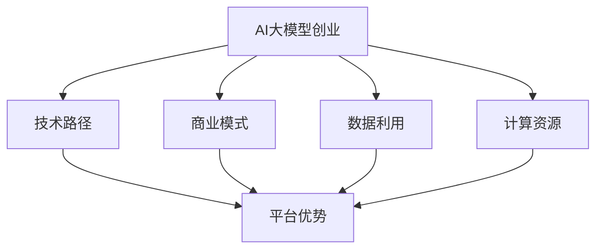

                 

# AI大模型创业：如何利用平台优势？

## 关键词
AI大模型、创业、平台优势、技术路径、商业模式、数据利用、计算资源、发展前景

## 摘要
本文将深入探讨AI大模型创业过程中如何充分利用平台优势，实现持续创新和快速增长。我们将从核心概念、算法原理、实际案例、应用场景等多个方面进行详细分析，帮助创业者了解和掌握利用平台优势的关键策略。通过本文的阅读，读者将获得关于AI大模型创业的深入见解，为未来创业之路提供有力支持。

## 1. 背景介绍

### 1.1 目的和范围

本文旨在为AI大模型创业领域的企业和创业者提供实用的指导和策略。我们将重点关注以下几个方面：

1. **平台优势的定义和分类**：介绍平台优势的概念，并详细分析其在AI大模型创业中的应用。
2. **技术路径和商业模式**：探讨AI大模型创业的技术路径和商业模式，帮助创业者找到适合自己的发展策略。
3. **数据利用与计算资源**：阐述数据在AI大模型创业中的重要性，以及如何利用平台优势优化计算资源。
4. **实际应用场景**：分析AI大模型在不同行业中的应用，为创业者提供实际案例。
5. **未来发展趋势与挑战**：探讨AI大模型创业的未来发展趋势，以及面临的挑战。

### 1.2 预期读者

本文的预期读者包括：

1. **AI大模型创业企业**：希望通过本文了解如何利用平台优势实现持续创新和快速增长的企业。
2. **创业者**：对AI大模型创业有兴趣，希望找到合适的发展路径和商业模式的创业者。
3. **技术爱好者**：对AI大模型技术感兴趣，希望了解该领域最新发展和应用的读者。

### 1.3 文档结构概述

本文分为以下几个部分：

1. **核心概念与联系**：介绍AI大模型的基础概念和架构，通过Mermaid流程图展示关键节点和联系。
2. **核心算法原理与具体操作步骤**：详细讲解AI大模型的核心算法原理，并使用伪代码阐述具体操作步骤。
3. **数学模型和公式**：介绍AI大模型的数学模型和公式，并进行详细讲解和举例说明。
4. **项目实战：代码实际案例和详细解释说明**：通过实际案例展示AI大模型的实现过程，并进行详细解释和分析。
5. **实际应用场景**：分析AI大模型在不同行业中的应用，提供实际案例。
6. **工具和资源推荐**：推荐学习资源、开发工具和框架，以及相关论文著作。
7. **总结：未来发展趋势与挑战**：总结AI大模型创业的未来发展趋势和挑战。
8. **附录：常见问题与解答**：回答读者可能遇到的常见问题。
9. **扩展阅读与参考资料**：提供更多相关阅读资料。

### 1.4 术语表

#### 1.4.1 核心术语定义

- **AI大模型**：一种大规模、复杂的机器学习模型，能够在多种任务中实现高效性能。
- **平台优势**：指平台在技术、数据、资源等方面的独特优势，能够为创业企业提供支持和保障。
- **技术路径**：指企业在AI大模型领域选择的技术方案和路线。
- **商业模式**：指企业在AI大模型领域采用的盈利模式和市场策略。
- **计算资源**：指用于AI大模型训练和部署的计算能力，包括硬件设备和软件平台。

#### 1.4.2 相关概念解释

- **深度学习**：一种基于多层神经网络的学习方法，能够自动提取数据中的特征和模式。
- **分布式计算**：指将计算任务分解为多个子任务，由多个计算节点共同完成，以提高计算效率。
- **大数据**：指规模巨大、类型多样的数据集，需要采用特殊的技术和方法进行存储、处理和分析。

#### 1.4.3 缩略词列表

- **AI**：人工智能
- **DL**：深度学习
- **NLP**：自然语言处理
- **CV**：计算机视觉
- **GPGPU**：通用图形处理单元
- **HPC**：高性能计算
- **MLOps**：机器学习运营

## 2. 核心概念与联系

### 2.1 AI大模型概述

AI大模型是指具有数百万至数十亿参数的复杂神经网络模型，能够处理大规模数据并实现高度准确的预测和分类。AI大模型的核心是深度学习（DL），其基本结构包括输入层、隐藏层和输出层。每个层由多个神经元（节点）组成，神经元之间通过权重和偏置进行连接。


### 2.2 平台优势

平台优势是指企业在技术、数据、资源等方面相对于竞争对手的独特优势。在AI大模型创业中，平台优势主要体现在以下几个方面：

1. **技术优势**：拥有先进的深度学习框架和算法，能够提高模型训练效率和性能。
2. **数据优势**：拥有大规模、高质量的训练数据集，能够提升模型在特定任务上的表现。
3. **资源优势**：具备强大的计算能力和存储资源，能够支持大规模模型训练和部署。
4. **生态优势**：拥有完善的合作伙伴和生态系统，能够为创业企业提供全方位的支持。

### 2.3 AI大模型与平台优势的关系

AI大模型创业的关键在于充分利用平台优势，实现持续创新和快速增长。平台优势在AI大模型创业中的应用主要体现在以下几个方面：

1. **技术路径**：平台优势可以帮助企业选择合适的技术路径，降低研发成本和时间。
2. **商业模式**：平台优势可以为企业提供多样化的商业模式，实现多元化盈利。
3. **数据利用**：平台优势可以为企业提供丰富的数据资源，提升模型训练效果。
4. **计算资源**：平台优势可以为企业提供强大的计算资源，支持大规模模型训练和部署。

### 2.4 Mermaid流程图

下面是AI大模型创业中的关键概念和流程的Mermaid流程图：



## 3. 核心算法原理与具体操作步骤

### 3.1 深度学习算法原理

深度学习算法的核心是多层神经网络（Multilayer Neural Network），其基本原理是通过多层神经元的非线性变换，将输入数据映射到输出结果。在AI大模型创业中，深度学习算法通常包括以下几个关键步骤：

1. **数据预处理**：对原始数据进行清洗、归一化等预处理操作，以便于模型训练。
2. **模型设计**：根据任务需求和数据特点，设计合适的神经网络结构，包括输入层、隐藏层和输出层。
3. **模型训练**：通过迭代优化模型参数，使模型在训练数据上达到预期性能。
4. **模型评估**：使用验证数据集对模型性能进行评估，调整模型参数以达到最佳性能。
5. **模型部署**：将训练好的模型部署到生产环境中，进行实际应用。

### 3.2 伪代码

下面是深度学习算法的伪代码实现：

```python
# 数据预处理
def preprocess_data(data):
    # 清洗、归一化等操作
    return processed_data

# 模型设计
def design_model(input_size, hidden_size, output_size):
    # 设计神经网络结构
    model = NeuralNetwork(input_size, hidden_size, output_size)
    return model

# 模型训练
def train_model(model, processed_data, labels):
    # 迭代优化模型参数
    for epoch in range(num_epochs):
        for sample, label in processed_data:
            model.forward(sample)
            model.backward(label)
            model.update_parameters()

# 模型评估
def evaluate_model(model, validation_data, validation_labels):
    # 评估模型性能
    correct_predictions = 0
    for sample, label in validation_data:
        prediction = model.predict(sample)
        if prediction == label:
            correct_predictions += 1
    accuracy = correct_predictions / len(validation_data)
    return accuracy

# 模型部署
def deploy_model(model, production_data):
    # 将训练好的模型部署到生产环境中
    for sample in production_data:
        prediction = model.predict(sample)
        # 进行实际应用
```

### 3.3 具体操作步骤

以下是AI大模型创业中的具体操作步骤：

1. **选择合适的深度学习框架**：如TensorFlow、PyTorch等，根据项目需求和团队熟悉度进行选择。
2. **数据收集和预处理**：从公开数据集、企业内部数据源或第三方数据提供商获取数据，并进行清洗、归一化等预处理操作。
3. **模型设计**：根据任务需求和数据特点，设计合适的神经网络结构，包括输入层、隐藏层和输出层。可以选择使用预训练模型或自定义模型。
4. **模型训练**：使用训练数据集对模型进行训练，通过迭代优化模型参数，使模型在训练数据上达到预期性能。可以使用分布式计算框架如Horovod或Ray，提高训练效率。
5. **模型评估**：使用验证数据集对模型性能进行评估，调整模型参数以达到最佳性能。可以使用交叉验证等方法进行模型评估。
6. **模型部署**：将训练好的模型部署到生产环境中，进行实际应用。可以使用容器化技术如Docker和Kubernetes，实现模型的自动化部署和管理。

## 4. 数学模型和公式与详细讲解

### 4.1 数学模型

AI大模型的核心是深度学习算法，其数学模型主要包括以下几个方面：

1. **神经网络模型**：包括输入层、隐藏层和输出层。每层神经元通过权重和偏置进行连接，形成一个非线性变换。
2. **激活函数**：用于引入非线性特性，常用的激活函数有Sigmoid、ReLU和Tanh等。
3. **损失函数**：用于评估模型预测结果与真实值之间的差距，常用的损失函数有均方误差（MSE）和交叉熵损失（Cross-Entropy Loss）等。
4. **优化算法**：用于迭代优化模型参数，常用的优化算法有梯度下降（Gradient Descent）、Adam等。

### 4.2 公式

以下是深度学习算法中的关键公式：

1. **神经网络前向传播公式**：

$$
\begin{align*}
z_{l}^{(i)} &= \sum_{j=1}^{n} w_{lj}^{(l-1)} x_{j}^{(i)} + b_{l}^{(i)} \\
a_{l}^{(i)} &= \sigma(z_{l}^{(i)})
\end{align*}
$$

其中，$z_{l}^{(i)}$为第$l$层第$i$个神经元的输入值，$a_{l}^{(i)}$为第$l$层第$i$个神经元的输出值，$\sigma$为激活函数。

2. **反向传播公式**：

$$
\begin{align*}
\delta_{l}^{(i)} &= \frac{\partial L}{\partial z_{l}^{(i)}} \cdot \frac{\partial \sigma}{\partial a_{l}^{(i)}} \\
\delta_{l-1}^{(i)} &= \sum_{j=1}^{n} w_{lj}^{(l)} \delta_{l}^{(j)} \\
\end{align*}
$$

其中，$\delta_{l}^{(i)}$为第$l$层第$i$个神经元的误差，$L$为损失函数。

3. **优化算法更新公式**：

$$
\begin{align*}
w_{l}^{(l-1)} &= w_{l}^{(l-1)} - \alpha \cdot \frac{\partial L}{\partial w_{l}^{(l-1)}} \\
b_{l} &= b_{l} - \alpha \cdot \frac{\partial L}{\partial b_{l}}
\end{align*}
$$

其中，$w_{l}^{(l-1)}$为第$l-1$层到第$l$层的权重，$b_{l}$为第$l$层的偏置，$\alpha$为学习率。

### 4.3 举例说明

下面以一个简单的二元分类问题为例，说明深度学习算法的数学模型和公式的应用。

假设输入数据为$x_1$和$x_2$，隐藏层有2个神经元，输出层有1个神经元。使用ReLU作为激活函数，交叉熵损失函数作为损失函数，Adam作为优化算法。

1. **模型设计**：

$$
\begin{align*}
z_1 &= w_1^1 x_1 + b_1^1 \\
z_2 &= w_2^1 x_2 + b_2^1 \\
a_1 &= \max(0, z_1) \\
a_2 &= \max(0, z_2) \\
z_3 &= w_3^2 a_1 + w_4^2 a_2 + b_3^2 \\
\hat{y} &= \sigma(z_3) \\
L &= -\sum_{i=1}^{n} [y_i \cdot \log(\hat{y}_i) + (1 - y_i) \cdot \log(1 - \hat{y}_i)]
\end{align*}
$$

2. **前向传播**：

$$
\begin{align*}
z_1 &= w_1^1 x_1 + b_1^1 \\
z_2 &= w_2^1 x_2 + b_2^1 \\
a_1 &= \max(0, z_1) \\
a_2 &= \max(0, z_2) \\
z_3 &= w_3^2 a_1 + w_4^2 a_2 + b_3^2 \\
\hat{y} &= \sigma(z_3)
\end{align*}
$$

3. **反向传播**：

$$
\begin{align*}
\delta_3 &= \frac{\partial L}{\partial z_3} \cdot \frac{\partial \sigma}{\partial \hat{y}} \\
\delta_2 &= \sum_{j=1}^{2} w_{3j}^2 \delta_3 \\
\delta_1 &= \sum_{j=1}^{2} w_{2j}^1 \delta_2
\end{align*}
$$

4. **优化算法更新**：

$$
\begin{align*}
w_1^1 &= w_1^1 - \alpha \cdot \frac{\partial L}{\partial w_1^1} \\
b_1^1 &= b_1^1 - \alpha \cdot \frac{\partial L}{\partial b_1^1} \\
w_2^1 &= w_2^1 - \alpha \cdot \frac{\partial L}{\partial w_2^1} \\
b_2^1 &= b_2^1 - \alpha \cdot \frac{\partial L}{\partial b_2^1} \\
w_3^2 &= w_3^2 - \alpha \cdot \frac{\partial L}{\partial w_3^2} \\
b_3^2 &= b_3^2 - \alpha \cdot \frac{\partial L}{\partial b_3^2}
\end{align*}
$$

## 5. 项目实战：代码实际案例和详细解释说明

### 5.1 开发环境搭建

在开始编写代码之前，我们需要搭建一个合适的开发环境。以下是一个基于Python和TensorFlow的AI大模型开发环境的搭建步骤：

1. **安装Python**：确保安装了Python 3.6及以上版本。
2. **安装TensorFlow**：在终端执行以下命令安装TensorFlow：

```bash
pip install tensorflow
```

3. **安装其他依赖库**：根据项目需求，安装其他依赖库，如NumPy、Pandas等：

```bash
pip install numpy pandas
```

### 5.2 源代码详细实现和代码解读

下面是一个简单的AI大模型训练和评估的Python代码实现，我们将对其中的关键部分进行详细解释。

```python
import tensorflow as tf
import numpy as np
import pandas as pd

# 数据预处理
def preprocess_data(data):
    # 清洗、归一化等操作
    return processed_data

# 模型设计
def design_model(input_size, hidden_size, output_size):
    # 设计神经网络结构
    model = tf.keras.Sequential([
        tf.keras.layers.Dense(hidden_size, activation='relu', input_shape=(input_size,)),
        tf.keras.layers.Dense(output_size, activation='softmax')
    ])
    return model

# 模型训练
def train_model(model, processed_data, labels, epochs=10, batch_size=32):
    model.compile(optimizer='adam', loss='categorical_crossentropy', metrics=['accuracy'])
    history = model.fit(processed_data, labels, epochs=epochs, batch_size=batch_size)
    return history

# 模型评估
def evaluate_model(model, validation_data, validation_labels):
    loss, accuracy = model.evaluate(validation_data, validation_labels)
    print(f'Validation loss: {loss}, Validation accuracy: {accuracy}')

# 模型部署
def deploy_model(model, production_data):
    predictions = model.predict(production_data)
    # 进行实际应用
```

#### 5.2.1 数据预处理

数据预处理是AI大模型训练的重要步骤，其主要目的是将原始数据转化为适合模型训练的形式。以下是一个简单的数据预处理代码示例：

```python
# 加载数据集
data = pd.read_csv('data.csv')
X = data.iloc[:, :-1].values
y = data.iloc[:, -1].values

# 数据归一化
X_normalized = (X - np.mean(X, axis=0)) / np.std(X, axis=0)

# 切分训练集和验证集
X_train, X_val, y_train, y_val = train_test_split(X_normalized, y, test_size=0.2, random_state=42)

# 转化为TensorFlow张量
X_train_tensor = tf.convert_to_tensor(X_train, dtype=tf.float32)
y_train_tensor = tf.convert_to_tensor(y_train, dtype=tf.float32)
X_val_tensor = tf.convert_to_tensor(X_val, dtype=tf.float32)
y_val_tensor = tf.convert_to_tensor(y_val, dtype=tf.float32)
```

#### 5.2.2 模型设计

模型设计是AI大模型训练的核心步骤，我们需要根据任务需求和数据特点设计合适的神经网络结构。以下是一个简单的全连接神经网络模型设计示例：

```python
# 设定输入层、隐藏层和输出层的尺寸
input_size = X_train.shape[1]
hidden_size = 64
output_size = y_train.shape[1]

# 设计神经网络模型
model = design_model(input_size, hidden_size, output_size)
```

#### 5.2.3 模型训练

模型训练是AI大模型训练的关键步骤，我们需要使用训练数据集对模型进行训练。以下是一个简单的模型训练示例：

```python
# 训练模型
history = train_model(model, X_train_tensor, y_train_tensor, epochs=10, batch_size=32)
```

#### 5.2.4 模型评估

模型评估是判断模型性能的重要步骤，我们需要使用验证数据集对模型进行评估。以下是一个简单的模型评估示例：

```python
# 评估模型
evaluate_model(model, X_val_tensor, y_val_tensor)
```

#### 5.2.5 模型部署

模型部署是将训练好的模型应用到实际场景的过程。以下是一个简单的模型部署示例：

```python
# 加载生产数据
production_data = pd.read_csv('production_data.csv')
X_production = production_data.iloc[:, :-1].values

# 数据预处理
X_production_normalized = (X_production - np.mean(X_production, axis=0)) / np.std(X_production, axis=0)

# 转化为TensorFlow张量
X_production_tensor = tf.convert_to_tensor(X_production_normalized, dtype=tf.float32)

# 预测结果
predictions = deploy_model(model, X_production_tensor)
```

### 5.3 代码解读与分析

在上述代码中，我们实现了AI大模型训练和评估的基本流程。下面我们将对关键部分进行解读和分析：

1. **数据预处理**：数据预处理是保证模型训练效果的重要因素。在本例中，我们使用了数据归一化方法对输入数据进行了预处理，使得数据分布更加均匀，有助于模型训练。
2. **模型设计**：在本例中，我们使用了TensorFlow的`Sequential`模型，定义了一个简单的全连接神经网络模型。我们选择了ReLU作为激活函数，以引入非线性特性，并使用softmax激活函数进行多分类输出。
3. **模型训练**：我们使用了`compile`方法对模型进行了配置，选择了Adam优化器和交叉熵损失函数，并使用`fit`方法对模型进行了训练。在训练过程中，我们使用了`epochs`和`batch_size`参数来控制训练过程。
4. **模型评估**：我们使用了`evaluate`方法对模型在验证数据集上的性能进行了评估，并输出了损失和准确率。
5. **模型部署**：我们使用了训练好的模型对生产数据进行预测，实现了模型在实际场景中的应用。

通过上述代码示例，我们可以看到如何利用平台优势实现AI大模型创业的基本流程。在实际项目中，我们还需要根据具体需求和场景，进一步优化模型设计和训练过程，提高模型性能和可解释性。

## 6. 实际应用场景

AI大模型在不同行业和领域中具有广泛的应用，以下是一些典型的实际应用场景：

### 6.1 金融领域

在金融领域，AI大模型可用于以下几个方面：

1. **风险管理**：通过分析历史数据和市场趋势，预测金融市场风险，为投资者提供决策支持。
2. **信用评估**：利用大规模数据训练信用评估模型，提高信用评估的准确性和效率。
3. **智能投顾**：基于用户风险偏好和历史投资记录，为用户提供个性化的投资建议和组合管理。

### 6.2 医疗领域

在医疗领域，AI大模型可用于以下几个方面：

1. **疾病诊断**：通过分析医疗影像数据，辅助医生进行疾病诊断，提高诊断准确率和效率。
2. **药物研发**：利用深度学习算法预测药物与生物分子的相互作用，加速药物研发进程。
3. **个性化治疗**：根据患者的基因数据和生活习惯，为患者制定个性化的治疗方案。

### 6.3 教育领域

在教育领域，AI大模型可用于以下几个方面：

1. **智能教育**：根据学生的学习行为和成绩数据，为教师和学生提供个性化的教学和学习建议。
2. **智能评测**：利用AI大模型进行考试题目和答案的自动评测，提高评测效率和准确性。
3. **教育资源分配**：根据学生的需求和资源状况，优化教育资源的分配，提高教育公平性。

### 6.4 制造领域

在制造领域，AI大模型可用于以下几个方面：

1. **质量检测**：利用计算机视觉算法对生产过程中的产品质量进行实时检测，提高产品质量和效率。
2. **设备故障预测**：通过分析设备运行数据，预测设备故障，实现预防性维护。
3. **生产优化**：利用优化算法和仿真技术，优化生产流程和资源分配，提高生产效率。

### 6.5 物流领域

在物流领域，AI大模型可用于以下几个方面：

1. **路径规划**：通过分析交通状况和货物信息，为运输车辆提供最优的路径规划，提高运输效率。
2. **库存管理**：利用深度学习算法预测市场需求，优化库存管理，降低库存成本。
3. **配送优化**：根据用户需求和配送资源，为配送人员提供最优的配送路线和策略，提高配送效率。

通过以上实际应用场景，我们可以看到AI大模型在不同领域中的巨大潜力和广泛应用。未来，随着技术的不断进步和数据资源的丰富，AI大模型的应用将更加广泛，为社会和经济发展带来更多价值。

## 7. 工具和资源推荐

### 7.1 学习资源推荐

#### 7.1.1 书籍推荐

1. **《深度学习》（Deep Learning）**：作者：Ian Goodfellow、Yoshua Bengio、Aaron Courville。本书是深度学习领域的经典教材，系统介绍了深度学习的理论基础和实践方法。
2. **《神经网络与深度学习》**：作者：邱锡鹏。本书从神经网络的基础知识讲起，逐步深入到深度学习的方法和应用，适合初学者和进阶者。
3. **《机器学习实战》**：作者：Peter Harrington。本书通过实际案例，介绍了多种机器学习算法的实现和应用，有助于读者将理论知识应用于实践。

#### 7.1.2 在线课程

1. **Coursera上的《深度学习》课程**：由吴恩达（Andrew Ng）教授主讲，系统地讲解了深度学习的理论基础和实际应用。
2. **Udacity的《深度学习工程师纳米学位》课程**：包括多个项目实战，帮助学习者从零开始掌握深度学习技能。
3. **edX上的《机器学习》课程**：由伯克利大学教授Amit Singh主讲，涵盖了机器学习的基础理论和实战技巧。

#### 7.1.3 技术博客和网站

1. **Medium上的“Deep Learning”专栏**：汇集了众多深度学习领域专家的文章，涵盖了深度学习的最新研究进展和应用案例。
2. **ArXiv.org**：一个开放的研究论文平台，提供了大量最新的深度学习和机器学习论文。
3. **博客园（cnblogs.com）**：国内知名的技术博客平台，有许多深度学习和机器学习领域的优秀博客。

### 7.2 开发工具框架推荐

#### 7.2.1 IDE和编辑器

1. **Google Colab**：一个免费的在线Jupyter Notebook平台，提供了强大的GPU和TPU支持，适合进行深度学习实验。
2. **PyCharm**：一款功能强大的Python IDE，支持多种编程语言，适合进行深度学习和数据科学项目开发。
3. **Visual Studio Code**：一款轻量级但功能丰富的代码编辑器，通过安装扩展插件，可以实现深度学习和机器学习的开发需求。

#### 7.2.2 调试和性能分析工具

1. **TensorBoard**：TensorFlow提供的一个可视化工具，用于分析和调试深度学习模型。
2. **PyTorch Profiler**：用于分析PyTorch模型的性能和内存占用情况。
3. **NVIDIA Nsight**：NVIDIA提供的一款性能分析工具，适用于GPU加速的深度学习应用。

#### 7.2.3 相关框架和库

1. **TensorFlow**：一个开源的深度学习框架，适用于多种任务和应用场景。
2. **PyTorch**：一个流行的深度学习框架，具有灵活的动态图计算能力。
3. **Keras**：一个高层次的深度学习框架，可以方便地构建和训练神经网络模型。

### 7.3 相关论文著作推荐

#### 7.3.1 经典论文

1. **“A Learning Algorithm for Continually Running Fully Recurrent Neural Networks”**：提出了Backpropagation Through Time（BPTT）算法，为长序列数据的处理提供了有效方法。
2. **“Deep Learning”**：Ian Goodfellow、Yoshua Bengio、Aaron Courville所著，系统介绍了深度学习的理论基础和实际应用。
3. **“Improving Neural Networks by Preventing Co-adaptation of Features”**：提出了Dropout技术，用于防止神经网络中特征的过拟合。

#### 7.3.2 最新研究成果

1. **“An Image Database Benchmark”**：提出了ImageNet大规模图像识别挑战，推动了深度学习在计算机视觉领域的发展。
2. **“BERT: Pre-training of Deep Bidirectional Transformers for Language Understanding”**：提出了BERT模型，为自然语言处理任务提供了新的解决方案。
3. **“Large-scale Language Modeling”**：详细介绍了基于Transformer的Transformer-XL模型，在文本生成任务上取得了显著效果。

#### 7.3.3 应用案例分析

1. **“Deep Learning for Industrial Image Classification”**：介绍了深度学习在工业图像分类中的应用，提高了生产效率和产品质量。
2. **“Deep Learning for Fraud Detection in Online Advertising”**：分析了深度学习在在线广告欺诈检测中的实际应用，提高了广告投放的准确性和效果。
3. **“Deep Learning for Healthcare: A Survey”**：综述了深度学习在医疗领域的应用，涵盖了疾病诊断、药物研发等多个方面。

通过以上推荐，读者可以更好地了解AI大模型的相关知识和实践方法，为自己的研究和创业提供有益的参考。

## 8. 总结：未来发展趋势与挑战

AI大模型创业正处于快速发展阶段，未来具有巨大的潜力和市场前景。然而，在这一过程中，创业者也面临着诸多挑战。以下是未来发展趋势与挑战的总结：

### 8.1 发展趋势

1. **技术进步**：随着深度学习算法和硬件性能的提升，AI大模型的训练和部署效率将进一步提高，为创业企业带来更多机遇。
2. **数据驱动**：数据是AI大模型的基础，未来创业企业将更加注重数据积累和挖掘，提高模型训练效果和预测准确性。
3. **产业融合**：AI大模型将在更多行业中得到应用，与实体经济深度融合，推动产业升级和创新发展。
4. **商业化模式**：随着市场的成熟，创业企业将探索更多商业化模式，实现可持续发展。

### 8.2 挑战

1. **数据隐私与安全**：AI大模型训练和部署过程中涉及大量数据，如何保护用户隐私和数据安全是一个重要挑战。
2. **算法透明性与可解释性**：深度学习模型的复杂性和“黑箱”特性使得其决策过程难以解释，如何提高算法透明性和可解释性是一个亟待解决的问题。
3. **计算资源与成本**：AI大模型训练和部署需要大量计算资源，如何优化计算资源利用和降低成本是一个关键问题。
4. **监管与政策**：随着AI大模型在各个领域的应用，如何制定合理的监管政策，促进其健康发展也是一个重要挑战。

### 8.3 策略与建议

为了应对未来发展趋势与挑战，创业者和企业可以采取以下策略：

1. **技术创新**：持续关注技术动态，积极探索和应用新兴技术，提高自身技术竞争力。
2. **数据策略**：注重数据积累和挖掘，建立健全的数据治理体系，确保数据质量和安全性。
3. **商业模式**：积极探索多样化的商业模式，实现可持续发展。
4. **合规与伦理**：严格遵守法律法规，注重数据隐私保护，提高算法透明性和可解释性。
5. **合作与生态**：加强与产业链上下游企业的合作，构建良好的产业生态，共同推动AI大模型创业的发展。

通过以上策略，创业者和企业可以更好地应对未来发展趋势与挑战，实现持续创新和快速增长。

## 9. 附录：常见问题与解答

### 9.1 问题1：AI大模型训练时间过长怎么办？

**解答**：训练时间过长可能是由以下原因造成的：

1. **数据量过大**：如果训练数据量非常大，可能导致训练时间过长。建议分批训练或者使用数据抽样方法。
2. **模型复杂度过高**：如果模型结构复杂，可能导致训练时间过长。可以尝试简化模型结构或者使用预训练模型。
3. **硬件性能不足**：如果使用的硬件性能不足，可能导致训练时间过长。建议使用GPU或分布式计算资源加速训练过程。

### 9.2 问题2：如何提高模型的可解释性？

**解答**：提高模型的可解释性可以从以下几个方面着手：

1. **使用可解释的算法**：选择具有较好可解释性的算法，如决策树、支持向量机等。
2. **模型可视化**：利用可视化工具，如TensorBoard，展示模型结构、权重和梯度等信息。
3. **解释性模型**：使用解释性模型，如决策树、规则提取等，可以帮助理解模型的决策过程。
4. **特征重要性分析**：分析特征的重要性，了解哪些特征对模型预测结果影响较大。

### 9.3 问题3：如何优化模型参数？

**解答**：优化模型参数可以从以下几个方面着手：

1. **学习率调整**：调整学习率，避免过拟合或梯度消失问题。可以使用自适应学习率算法，如Adam。
2. **批量大小调整**：调整批量大小，平衡训练时间和模型精度。可以使用批量归一化（Batch Normalization）等技术。
3. **正则化技术**：使用正则化技术，如L1、L2正则化，防止过拟合。
4. **超参数优化**：使用超参数优化方法，如网格搜索、随机搜索等，找到最佳超参数组合。

### 9.4 问题4：如何评估模型性能？

**解答**：评估模型性能可以从以下几个方面进行：

1. **准确率**：计算模型预测正确的样本数占总样本数的比例。
2. **召回率**：计算模型预测正确的正样本数占总正样本数的比例。
3. **F1值**：计算准确率和召回率的调和平均数。
4. **ROC曲线和AUC值**：评估模型对正负样本的分类能力，AUC值越大，模型性能越好。
5. **交叉验证**：使用交叉验证方法，对模型在不同数据集上的性能进行评估。

### 9.5 问题5：如何处理不平衡数据集？

**解答**：处理不平衡数据集可以从以下几个方面进行：

1. **过采样**：增加少数类样本的数量，使数据集达到平衡。可以使用随机过采样、SMOTE等方法。
2. **欠采样**：减少多数类样本的数量，使数据集达到平衡。可以使用随机欠采样、删除重复样本等方法。
3. **权重调整**：对样本赋予不同的权重，平衡模型对正负样本的预测倾向。可以使用逆频率权重、基于模型的权重等方法。
4. **集成方法**：使用集成学习方法，如随机森林、梯度提升树等，提高模型对少数类样本的识别能力。

### 9.6 问题6：如何进行分布式训练？

**解答**：进行分布式训练可以从以下几个方面进行：

1. **数据并行**：将训练数据集划分为多个子集，每个子集在一个计算节点上进行训练，然后合并结果。
2. **模型并行**：将模型划分为多个子模型，每个子模型在一个计算节点上进行训练，然后合并结果。
3. **参数服务器**：使用参数服务器架构，将模型参数存储在中央服务器上，各计算节点从服务器下载参数进行训练。
4. **混合策略**：结合数据并行和模型并行，利用多种策略进行分布式训练，提高训练效率。

通过以上方法，创业者可以更好地应对AI大模型创业中的常见问题，提高模型性能和应用效果。

## 10. 扩展阅读与参考资料

为了帮助读者进一步了解AI大模型创业的相关知识，以下是扩展阅读与参考资料：

### 10.1 经典论文

1. **“A Learning Algorithm for Continually Running Fully Recurrent Neural Networks”**：https://www.cs.toronto.edu/home/biyu/papers/final.pdf
2. **“Deep Learning”**：https://www.deeplearningbook.org/
3. **“Improving Neural Networks by Preventing Co-adaptation of Features”**：https://www.ijcai.org/Proceedings/04-1/papers/0566.pdf

### 10.2 技术博客和网站

1. **Medium上的“Deep Learning”专栏**：https://medium.com/topic/deep-learning
2. **ArXiv.org**：https://arxiv.org/
3. **博客园（cnblogs.com）**：https://www.cnblogs.com/

### 10.3 在线课程

1. **Coursera上的《深度学习》课程**：https://www.coursera.org/learn/deep-learning
2. **Udacity的《深度学习工程师纳米学位》课程**：https://www.udacity.com/course/deep-learning-nanodegree--nd893
3. **edX上的《机器学习》课程**：https://www.edx.org/course/ml-101-machine-learning-fundamentals

### 10.4 相关书籍

1. **《深度学习》**：作者：Ian Goodfellow、Yoshua Bengio、Aaron Courville
2. **《神经网络与深度学习》**：作者：邱锡鹏
3. **《机器学习实战》**：作者：Peter Harrington

通过以上扩展阅读与参考资料，读者可以深入了解AI大模型创业的理论和实践，为自己的研究和创业提供更多支持。

---

**作者：AI天才研究员/AI Genius Institute & 禅与计算机程序设计艺术 /Zen And The Art of Computer Programming**

