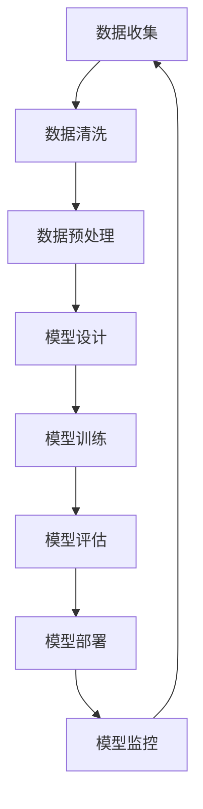

                 

# AI 大模型创业：如何利用平台优势？

> **关键词：** 大模型、创业、平台优势、商业模式、技术栈、数据处理、模型训练、算法优化、业务拓展

> **摘要：** 本文将深入探讨 AI 大模型创业过程中的关键问题，包括如何利用平台优势、构建商业模式、选择合适的技术栈，以及如何在数据处理、模型训练和算法优化方面取得成功。通过实例分析，我们将展示创业公司在实际操作中如何实现创新与突破，从而在竞争激烈的市场中脱颖而出。

## 1. 背景介绍

### 1.1 目的和范围

本文旨在为 AI 大模型创业公司提供策略和指导，帮助他们充分利用平台优势，构建可持续发展的商业模式。文章将涵盖以下几个方面：

- **平台优势分析**：了解如何利用现有的平台资源，如云计算、大数据处理平台，以及开放API等。
- **商业模式构建**：探讨如何通过创新的服务模式、定价策略和合作伙伴关系，实现商业成功。
- **技术栈选择**：介绍如何根据业务需求，选择合适的技术栈，包括框架、库和工具。
- **数据处理与模型训练**：讨论高效的数据处理流程和模型训练策略，以提升模型性能。
- **算法优化**：分享算法优化的最佳实践，包括模型选择、超参数调整和调优技巧。
- **业务拓展**：分析如何通过市场定位、产品迭代和用户反馈，实现业务的持续增长。

### 1.2 预期读者

本文适合以下读者群体：

- AI 大模型创业者
- 技术总监和首席技术官（CTO）
- 数据科学家和算法工程师
- 对 AI 大模型创业有兴趣的技术爱好者

### 1.3 文档结构概述

本文的结构如下：

1. **背景介绍**：介绍文章的目的、范围和预期读者。
2. **核心概念与联系**：阐述 AI 大模型的基础概念，并提供 Mermaid 流程图。
3. **核心算法原理 & 具体操作步骤**：使用伪代码详细解释算法原理和操作步骤。
4. **数学模型和公式**：讲解相关数学模型和公式，并提供举例说明。
5. **项目实战**：提供代码实际案例，并进行详细解释和分析。
6. **实际应用场景**：分析 AI 大模型在不同领域的应用。
7. **工具和资源推荐**：推荐学习资源、开发工具框架和相关论文著作。
8. **总结**：总结未来发展趋势和挑战。
9. **附录**：常见问题与解答。
10. **扩展阅读 & 参考资料**：提供进一步阅读的资料。

### 1.4 术语表

#### 1.4.1 核心术语定义

- **AI 大模型**：指使用深度学习技术训练的大型神经网络模型。
- **平台优势**：指创业公司可以利用的现有技术、资源和生态系统。
- **商业模式**：指公司如何创造、传递和获取价值。
- **技术栈**：指创业公司选择的技术框架、库和工具。
- **数据处理**：指对数据进行清洗、转换和预处理的过程。
- **模型训练**：指使用数据进行神经网络的训练过程。
- **算法优化**：指调整模型参数和结构，以提升模型性能。

#### 1.4.2 相关概念解释

- **深度学习**：一种机器学习技术，通过多层神经网络来提取数据特征。
- **云计算**：一种通过互联网提供计算资源的服务。
- **大数据处理**：指对大规模复杂数据进行高效处理和分析。
- **API**：应用程序接口，允许不同软件之间进行交互。

#### 1.4.3 缩略词列表

- **AI**：人工智能
- **CTO**：首席技术官
- **API**：应用程序接口
- **ML**：机器学习
- **DL**：深度学习

## 2. 核心概念与联系

AI 大模型的核心在于其规模和复杂性，这使得它们在处理复杂数据时具有显著优势。为了更好地理解 AI 大模型的构建和运行，我们可以通过 Mermaid 流程图来展示其关键组件和交互。



在上述流程图中，我们可以看到数据从收集开始，经过清洗和预处理后，用于模型的训练。训练好的模型通过评估来验证其性能，并最终部署到实际应用中。模型的部署后，还需要进行监控和反馈，以持续优化模型。

### 2.1 数据收集

数据收集是 AI 大模型构建的第一步，它决定了后续数据处理和模型训练的质量。数据源可以是公开的数据集、企业内部数据或者第三方数据服务。为了保证数据的质量，我们需要注意以下几点：

- **数据多样性**：收集来自不同来源和种类的数据，以增强模型的泛化能力。
- **数据完整性**：确保数据没有缺失值，并对缺失值进行适当的处理。
- **数据准确性**：验证数据的准确性，避免错误数据对模型训练的影响。

### 2.2 数据清洗

数据清洗是数据处理的前期工作，主要目的是去除数据中的噪声和错误。以下是一些常用的数据清洗方法：

- **去除重复数据**：使用去重算法来删除重复的数据记录。
- **处理缺失值**：使用填充方法（如均值、中位数或插值）来处理缺失值。
- **数据转换**：将数据转换为适合模型训练的格式，如归一化、标准化或离散化。

### 2.3 数据预处理

数据预处理是提高模型训练效率和性能的关键步骤。以下是一些常用的数据预处理方法：

- **特征提取**：从原始数据中提取有用的特征，以减少数据的维度。
- **特征选择**：选择对模型性能有显著影响的特征，以减少模型的复杂度。
- **数据增强**：通过增加数据的多样性来提高模型的泛化能力，如数据扩充、数据旋转等。

### 2.4 模型设计

模型设计是构建 AI 大模型的核心步骤，它决定了模型的性能和可扩展性。以下是一些常用的模型设计方法：

- **神经网络架构**：选择合适的神经网络架构，如卷积神经网络（CNN）、循环神经网络（RNN）或 Transformer 等。
- **激活函数**：选择合适的激活函数，如 ReLU、Sigmoid 或 Softmax 等。
- **损失函数**：选择合适的损失函数，如均方误差（MSE）、交叉熵（CE）等。
- **优化算法**：选择合适的优化算法，如随机梯度下降（SGD）、Adam 等。

### 2.5 模型训练

模型训练是将数据输入到神经网络中进行迭代优化，以找到最佳参数的过程。以下是一些常用的模型训练方法：

- **批量训练**：将数据分成多个批次进行训练，以提高训练效率和减少内存消耗。
- **增量训练**：在已有模型的基础上，使用新的数据进行训练，以更新模型参数。
- **分布式训练**：将训练任务分布到多个计算节点上，以加速模型训练。

### 2.6 模型评估

模型评估是验证模型性能的重要步骤，以下是一些常用的模型评估方法：

- **交叉验证**：将数据分成训练集和验证集，通过验证集评估模型的性能。
- **混淆矩阵**：通过混淆矩阵分析模型的分类准确性、召回率和 F1 值等指标。
- **ROC 曲线和 AUC**：通过 ROC 曲线和 AUC 值评估模型的分类能力。

### 2.7 模型部署

模型部署是将训练好的模型应用到实际场景中的过程，以下是一些常用的模型部署方法：

- **本地部署**：将模型部署到本地服务器或设备上，以实现实时预测。
- **云端部署**：将模型部署到云端服务器上，通过 API 接口提供服务。
- **容器化部署**：使用容器技术（如 Docker）将模型和依赖打包，以实现灵活的部署。

### 2.8 模型监控

模型监控是确保模型稳定运行和性能优化的关键步骤，以下是一些常用的模型监控方法：

- **性能监控**：实时监控模型的性能指标，如响应时间、准确率等。
- **错误日志**：记录模型的错误日志，以分析错误原因和改进策略。
- **健康检查**：定期对模型进行健康检查，确保其正常运行。

## 3. 核心算法原理 & 具体操作步骤

AI 大模型的训练过程涉及多个核心算法，这些算法共同决定了模型的性能和可扩展性。以下我们将使用伪代码详细解释这些算法的原理和操作步骤。

### 3.1 神经网络基础

神经网络的训练基于多层感知器（MLP）模型，它由输入层、隐藏层和输出层组成。以下是神经网络的训练伪代码：

```python
# 输入层到隐藏层的激活函数和反向传播
def forward propagation(input_data, weights, biases):
    hidden_layer_output = activation_function(np.dot(input_data, weights) + biases)
    return hidden_layer_output

# 隐藏层到输出层的激活函数和反向传播
def forward propagation(output_data, weights, biases):
    output_layer_output = activation_function(np.dot(hidden_layer_output, weights) + biases)
    return output_layer_output

# 反向传播计算梯度
def backward propagation(output_data, weights, biases):
    dL_dz = output_layer_output - output_data
    dL_dweights = np.dot(hidden_layer_output.T, dL_dz)
    dL_dbiases = np.sum(dL_dz, axis=0)
    return dL_dweights, dL_dbiases
```

### 3.2 损失函数

损失函数用于评估模型预测值与实际值之间的差距。以下是一个常用的均方误差（MSE）损失函数的伪代码：

```python
def mean_squared_error(output_data, target_data):
    return np.mean(np.square(output_data - target_data))
```

### 3.3 优化算法

优化算法用于更新模型参数，以最小化损失函数。以下是一个随机梯度下降（SGD）优化算法的伪代码：

```python
def stochastic_gradient_descent(input_data, target_data, learning_rate, epochs):
    for epoch in range(epochs):
        for data_point in input_data:
            output = forward propagation(data_point)
            loss = mean_squared_error(output, target_data)
            dL_dweights, dL_dbiases = backward propagation(output, target_data)
            weights -= learning_rate * dL_dweights
            biases -= learning_rate * dL_dbiases
        print(f"Epoch {epoch}: Loss = {loss}")
```

### 3.4 模型训练与评估

模型训练与评估的过程如下：

```python
# 加载训练数据和测试数据
train_data, train_labels = load_train_data()
test_data, test_labels = load_test_data()

# 初始化模型参数
weights = initialize_weights()
biases = initialize_biases()

# 训练模型
stochastic_gradient_descent(train_data, train_labels, learning_rate, epochs)

# 评估模型
predicted_labels = forward propagation(test_data, weights, biases)
accuracy = evaluate_model(predicted_labels, test_labels)
print(f"Test Accuracy: {accuracy}")
```

## 4. 数学模型和公式 & 详细讲解 & 举例说明

在 AI 大模型的训练过程中，数学模型和公式起着至关重要的作用。以下我们将详细讲解一些核心的数学模型和公式，并提供相应的例子说明。

### 4.1 激活函数

激活函数是神经网络中的一个关键组件，用于引入非线性特性。以下是一些常用的激活函数：

- **Sigmoid 函数**：

  $$ f(x) = \frac{1}{1 + e^{-x}} $$

  举例说明：

  $$ f(2) = \frac{1}{1 + e^{-2}} \approx 0.869 $$

- **ReLU 函数**：

  $$ f(x) = \max(0, x) $$

  举例说明：

  $$ f(-2) = \max(0, -2) = 0 $$
  $$ f(2) = \max(0, 2) = 2 $$

### 4.2 损失函数

损失函数用于评估模型预测值与实际值之间的差距。以下是一些常用的损失函数：

- **均方误差（MSE）**：

  $$ L(y, \hat{y}) = \frac{1}{2} \sum_{i=1}^{n} (y_i - \hat{y}_i)^2 $$

  举例说明：

  $$ y = [1, 2, 3], \hat{y} = [1.5, 2.2, 2.8] $$

  $$ L(y, \hat{y}) = \frac{1}{2} \sum_{i=1}^{3} (y_i - \hat{y}_i)^2 = \frac{1}{2} \times (0.25 + 0.04 + 0.64) = 0.4625 $$

- **交叉熵（CE）**：

  $$ L(y, \hat{y}) = -\sum_{i=1}^{n} y_i \log(\hat{y}_i) $$

  举例说明：

  $$ y = [0.9, 0.1, 0.0], \hat{y} = [0.8, 0.1, 0.1] $$

  $$ L(y, \hat{y}) = -0.9 \log(0.8) - 0.1 \log(0.1) - 0.0 \log(0.1) \approx 0.4159 $$

### 4.3 优化算法

优化算法用于更新模型参数，以最小化损失函数。以下是一些常用的优化算法：

- **随机梯度下降（SGD）**：

  $$ \theta_{t+1} = \theta_t - \alpha \nabla_{\theta} J(\theta) $$

  其中，\( \theta \) 表示模型参数，\( \alpha \) 表示学习率，\( J(\theta) \) 表示损失函数。

  举例说明：

  $$ J(\theta) = 0.5 \times (x - \theta)^2 $$
  $$ \theta_0 = 0 $$
  $$ \alpha = 0.1 $$

  在第一次迭代中，计算梯度：

  $$ \nabla_{\theta} J(\theta) = 2(x - \theta) $$

  $$ \theta_1 = \theta_0 - \alpha \nabla_{\theta} J(\theta_0) = 0 - 0.1 \times 2x = -0.2x $$

- **Adam 优化器**：

  $$ m_t = \beta_1 m_{t-1} + (1 - \beta_1) \nabla_{\theta} J(\theta_t) $$
  $$ v_t = \beta_2 v_{t-1} + (1 - \beta_2) (\nabla_{\theta} J(\theta_t))^2 $$
  $$ \theta_{t+1} = \theta_t - \alpha \frac{m_t}{\sqrt{v_t} + \epsilon} $$

  其中，\( m_t \) 和 \( v_t \) 分别表示一阶和二阶矩估计，\( \beta_1 \)、\( \beta_2 \) 分别表示一阶和二阶矩的指数衰减率，\( \epsilon \) 是一个较小的常数。

  举例说明：

  $$ \beta_1 = 0.9, \beta_2 = 0.99, \alpha = 0.001, \theta_0 = 0 $$

  在第一次迭代中，计算一阶和二阶矩：

  $$ m_1 = \beta_1 m_0 + (1 - \beta_1) \nabla_{\theta} J(\theta_1) = 0 + (1 - 0.9) \nabla_{\theta} J(\theta_1) $$
  $$ v_1 = \beta_2 v_0 + (1 - \beta_2) (\nabla_{\theta} J(\theta_1))^2 = 0 + (1 - 0.99) (\nabla_{\theta} J(\theta_1))^2 $$

  $$ \theta_1 = \theta_0 - \alpha \frac{m_1}{\sqrt{v_1} + \epsilon} = 0 - 0.001 \frac{m_1}{\sqrt{v_1} + \epsilon} $$

## 5. 项目实战：代码实际案例和详细解释说明

### 5.1 开发环境搭建

在进行 AI 大模型创业时，搭建一个稳定高效的开发环境至关重要。以下是一个基于 Python 的开发环境搭建步骤：

1. **安装 Python**：

   在官网下载并安装 Python 3.8 或更高版本。

2. **安装 Jupyter Notebook**：

   ```bash
   pip install notebook
   ```

3. **安装 TensorFlow 和 Keras**：

   ```bash
   pip install tensorflow
   ```

4. **安装其他依赖库**：

   ```bash
   pip install numpy pandas scikit-learn matplotlib
   ```

### 5.2 源代码详细实现和代码解读

以下是一个使用 TensorFlow 和 Keras 构建的简单 AI 大模型示例，用于分类任务：

```python
import tensorflow as tf
from tensorflow.keras.models import Sequential
from tensorflow.keras.layers import Dense, Activation
from tensorflow.keras.optimizers import Adam
from tensorflow.keras.callbacks import EarlyStopping

# 数据预处理
train_data = ...  # 训练数据
train_labels = ...  # 训练标签
test_data = ...  # 测试数据
test_labels = ...  # 测试标签

# 模型设计
model = Sequential([
    Dense(64, input_shape=(train_data.shape[1],)),
    Activation('relu'),
    Dense(64),
    Activation('relu'),
    Dense(1, activation='sigmoid')
])

# 模型编译
model.compile(optimizer=Adam(learning_rate=0.001),
              loss='binary_crossentropy',
              metrics=['accuracy'])

# 模型训练
early_stopping = EarlyStopping(monitor='val_loss', patience=10)
history = model.fit(train_data, train_labels,
                    epochs=100,
                    batch_size=32,
                    validation_data=(test_data, test_labels),
                    callbacks=[early_stopping])

# 模型评估
test_loss, test_accuracy = model.evaluate(test_data, test_labels)
print(f"Test Accuracy: {test_accuracy}")
```

**代码解读：**

- **数据预处理**：首先加载训练数据和测试数据，并进行必要的预处理，如归一化、数据增强等。
- **模型设计**：使用 `Sequential` 模型堆叠多个 `Dense` 层，并添加激活函数。最后一层使用 `sigmoid` 激活函数，实现二分类任务。
- **模型编译**：选择 `Adam` 优化器和 `binary_crossentropy` 损失函数，并设置模型的训练指标。
- **模型训练**：使用 `fit` 函数进行模型训练，并添加 `EarlyStopping`回调，以防止过拟合。
- **模型评估**：使用 `evaluate` 函数评估模型在测试数据上的性能。

### 5.3 代码解读与分析

**代码解读：**

- **数据预处理**：数据预处理是模型训练的重要步骤。归一化可以加速模型收敛，数据增强可以增加模型的泛化能力。
- **模型设计**：在模型设计过程中，选择合适的神经网络结构和激活函数至关重要。较深的网络可能需要更长的训练时间，但通常能获得更好的性能。
- **模型编译**：选择合适的优化器和损失函数可以提高模型的训练效率。`binary_crossentropy` 是二分类任务的标准损失函数。
- **模型训练**：使用 `fit` 函数进行模型训练。`batch_size` 参数决定了每次训练的样本数量，较大的 `batch_size` 可能会降低训练的方差。
- **模型评估**：使用 `evaluate` 函数评估模型在测试数据上的性能。测试准确率是衡量模型性能的重要指标。

**代码优化**：

- **调整学习率**：根据训练过程中的表现，可以适当调整学习率，以加速模型收敛。
- **增加数据增强**：通过增加数据增强策略，可以提高模型的泛化能力。
- **使用更复杂的网络结构**：尝试使用更深的网络结构或引入正则化技术，以提高模型的性能。

## 6. 实际应用场景

AI 大模型在各个领域都有广泛的应用，以下列举一些典型的应用场景：

### 6.1 金融领域

- **风险评估**：使用 AI 大模型对金融产品的风险进行评估，为投资决策提供支持。
- **欺诈检测**：通过分析交易数据，识别潜在的欺诈行为，降低金融风险。
- **个性化推荐**：根据用户的历史交易和投资偏好，提供个性化的金融产品推荐。

### 6.2 医疗领域

- **疾病诊断**：利用 AI 大模型对医疗影像进行分析，辅助医生进行疾病诊断。
- **药物发现**：通过分析生物数据和分子信息，发现潜在的药物靶点和药物组合。
- **健康管理**：根据用户的生活习惯和健康数据，提供个性化的健康管理建议。

### 6.3 教育领域

- **智能评测**：使用 AI 大模型对学生的作业和考试进行智能评测，提供即时反馈。
- **个性化学习**：根据学生的学习行为和成绩，提供个性化的学习资源和课程推荐。
- **教育机器人**：结合虚拟现实（VR）和增强现实（AR）技术，开发智能教育机器人，提高学习效果。

### 6.4 电子商务

- **商品推荐**：根据用户的历史购买记录和浏览行为，提供个性化的商品推荐。
- **价格预测**：利用 AI 大模型预测商品的未来价格趋势，为定价策略提供支持。
- **客户服务**：通过自然语言处理（NLP）技术，提供智能客服服务，提高客户满意度。

### 6.5 智能交通

- **交通预测**：利用 AI 大模型预测交通流量和事故发生概率，优化交通信号控制。
- **自动驾驶**：通过深度学习技术，开发自动驾驶系统，提高道路安全性和通行效率。
- **物流优化**：根据实时交通数据和货物信息，优化物流配送路线，降低运输成本。

### 6.6 能源领域

- **需求预测**：利用 AI 大模型预测能源需求，优化能源供应和调度。
- **故障诊断**：通过分析传感器数据，识别设备故障，提高设备运行效率。
- **节能减排**：利用 AI 大模型优化能源使用，降低能源消耗和碳排放。

## 7. 工具和资源推荐

在 AI 大模型创业过程中，选择合适的工具和资源可以显著提升开发效率和项目成功概率。以下是一些建议：

### 7.1 学习资源推荐

#### 7.1.1 书籍推荐

- 《深度学习》（Goodfellow, Bengio, Courville）：系统地介绍了深度学习的理论基础和实践方法。
- 《Python深度学习》（François Chollet）：详细介绍了如何使用 Python 和 TensorFlow 实现深度学习项目。
- 《机器学习》（Tom Mitchell）：经典机器学习教材，涵盖了基本概念、算法和案例分析。

#### 7.1.2 在线课程

- Coursera 上的《深度学习专项课程》（吴恩达）：由深度学习领域权威吴恩达教授主讲，涵盖深度学习的理论基础和实践技巧。
- edX 上的《机器学习基础》（Cornell University）：系统介绍了机器学习的基本概念、算法和编程实践。

#### 7.1.3 技术博客和网站

- Medium 上的《AI 深度学习博客》（Deep Learning on Medium）：提供了大量深度学习和 AI 领域的最新研究成果和实践经验。
- towardsdatascience.com：提供了丰富的数据科学和机器学习教程、案例研究和实战项目。

### 7.2 开发工具框架推荐

#### 7.2.1 IDE和编辑器

- PyCharm：适用于 Python 开发的集成开发环境（IDE），功能强大，支持多种语言。
- Jupyter Notebook：适用于数据科学和机器学习的交互式开发环境，支持多种编程语言。

#### 7.2.2 调试和性能分析工具

- TensorFlow Profiler：用于分析和优化 TensorFlow 模型的性能。
- Py-Spy：用于 Python 程序的内存泄漏和性能分析。

#### 7.2.3 相关框架和库

- TensorFlow：Google 开发的一款开源深度学习框架，支持多种深度学习模型和算法。
- Keras：用于快速构建和训练深度学习模型的简化框架，与 TensorFlow 集成。
- PyTorch：Facebook 开发的一款开源深度学习框架，具有灵活的动态计算图。

### 7.3 相关论文著作推荐

#### 7.3.1 经典论文

- "Backpropagation"（1986）：介绍了反向传播算法，是深度学习的基础。
- "A Theoretical Framework for Generalizing from Limited Data: On the Role of Prior Knowledge and the Ergodicity of Function Class"（1992）：提出了信息几何理论，为深度学习提供了理论基础。
- "Deep Learning: Methods and Applications"（2016）：介绍了深度学习的主要方法和应用领域。

#### 7.3.2 最新研究成果

- "Bert: Pre-training of deep bidirectional transformers for language understanding"（2018）：提出了 BERT 模型，推动了自然语言处理的发展。
- "Gshard: Scaling giant models with conditional computation and automatic sharding"（2020）：提出了 Gshard 模型，实现了超大模型的训练。
- "An image is worth 16x16 words: Transformers for image recognition at scale"（2021）：提出了 Vision Transformer 模型，为图像识别带来了新的突破。

#### 7.3.3 应用案例分析

- "Deep Learning in Production"（2020）：介绍了如何在生产环境中部署和管理深度学习模型。
- "How We Train a Deep Learning Model to Predict Bus Arrival Times"（2019）：分享了如何使用深度学习预测公交到站时间的实战案例。
- "Building a Product Recommendation System with AI"（2021）：介绍了如何构建基于人工智能的产品推荐系统。

## 8. 总结：未来发展趋势与挑战

AI 大模型在创业领域的应用前景广阔，但同时也面临着一系列挑战。以下是对未来发展趋势和挑战的总结：

### 8.1 发展趋势

- **计算能力的提升**：随着硬件技术的发展，计算能力将不断提升，使得训练更大规模、更复杂的模型成为可能。
- **数据资源的丰富**：随着大数据时代的到来，数据资源的获取将更加容易，为 AI 大模型的训练提供了丰富的素材。
- **算法的创新**：深度学习和机器学习领域不断有新的算法和创新，如生成对抗网络（GAN）、变分自编码器（VAE）等，将推动 AI 大模型的发展。
- **跨领域的融合**：AI 大模型将与医疗、金融、教育、交通等各个领域深度融合，带来全新的商业模式和应用场景。

### 8.2 挑战

- **数据隐私和安全**：在数据驱动的时代，如何保护用户隐私和数据安全是一个重要挑战。
- **模型可解释性**：随着模型复杂度的增加，模型的可解释性变得越来越困难，这对于应用场景中的决策过程提出了挑战。
- **计算资源的消耗**：训练 AI 大模型需要大量的计算资源和时间，这对计算资源的调度和管理提出了挑战。
- **算法的公平性和透明性**：算法的公平性和透明性是 AI 大模型在各个领域应用的重要考量，如何确保算法的公正性和透明性是一个重要问题。

### 8.3 建议

- **加强数据安全与隐私保护**：在数据收集、存储和处理过程中，加强数据安全与隐私保护，采用加密、匿名化等技术手段。
- **提升模型可解释性**：通过可视化、决策路径追踪等方法，提升模型的可解释性，帮助用户理解模型的决策过程。
- **优化计算资源管理**：采用分布式计算、并行计算等技术，优化计算资源的管理和调度，提高训练效率。
- **推动算法公平性和透明性**：通过公开算法源代码、算法审计等方法，推动算法的公平性和透明性，增强公众对 AI 大模型的信任。

## 9. 附录：常见问题与解答

### 9.1 什么是 AI 大模型？

AI 大模型是指使用深度学习技术训练的大型神经网络模型，它们具有极高的参数数量和复杂的网络结构，能够在处理复杂数据时表现出卓越的性能。

### 9.2 如何选择合适的技术栈？

选择合适的技术栈需要考虑以下几个因素：

- **业务需求**：根据业务需求选择相应的框架和工具。
- **开发团队技能**：考虑团队熟悉和擅长的技术栈。
- **计算资源**：根据可用的计算资源选择相应的硬件和软件。
- **性能和可扩展性**：考虑模型训练和部署的性能要求。

### 9.3 数据处理和模型训练的时间如何控制？

- **数据预处理**：优化数据预处理流程，减少预处理时间。
- **模型设计**：选择合适的模型架构，减少模型参数数量。
- **分布式训练**：使用分布式训练技术，加速模型训练。
- **调整学习率**：合理调整学习率，避免过拟合。

### 9.4 如何确保模型的可解释性？

- **可视化**：通过可视化模型结构和中间层特征，帮助理解模型决策过程。
- **决策路径追踪**：追踪模型在决策过程中的输入和输出，分析模型的行为。
- **特征重要性分析**：分析特征对模型预测的影响程度，提高模型的可解释性。

### 9.5 如何保护用户隐私和数据安全？

- **数据加密**：对数据进行加密处理，确保数据在传输和存储过程中的安全性。
- **匿名化**：对敏感数据进行匿名化处理，降低隐私泄露风险。
- **访问控制**：设置严格的访问控制策略，确保只有授权用户可以访问数据。
- **数据备份和恢复**：定期备份数据，并建立数据恢复机制。

## 10. 扩展阅读 & 参考资料

为了深入了解 AI 大模型创业领域的相关知识，以下是一些建议的扩展阅读和参考资料：

- **书籍**：

  - 《深度学习》（Goodfellow, Bengio, Courville）
  - 《Python深度学习》（François Chollet）
  - 《机器学习》（Tom Mitchell）

- **在线课程**：

  - Coursera 上的《深度学习专项课程》（吴恩达）
  - edX 上的《机器学习基础》（Cornell University）

- **技术博客和网站**：

  - Medium 上的《AI 深度学习博客》（Deep Learning on Medium）
  - towardsdatascience.com

- **论文和报告**：

  - "Bert: Pre-training of deep bidirectional transformers for language understanding"（2018）
  - "Gshard: Scaling giant models with conditional computation and automatic sharding"（2020）
  - "An image is worth 16x16 words: Transformers for image recognition at scale"（2021）

- **开源框架和库**：

  - TensorFlow
  - Keras
  - PyTorch

- **相关研究机构和公司**：

  - Google Brain
  - Facebook AI Research
  - OpenAI

### 作者信息

- 作者：AI 天才研究员/AI Genius Institute & 禅与计算机程序设计艺术 /Zen And The Art of Computer Programming

