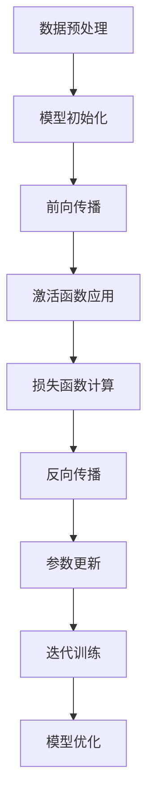

                 

# AI 大模型创业：如何利用技术优势？

> **关键词**：AI大模型、创业、技术优势、模型训练、商业化、应用场景、算法优化、风险评估、市场分析

> **摘要**：本文将探讨AI大模型在创业领域的应用，详细分析如何利用技术优势实现商业成功。我们将从背景介绍、核心概念与联系、核心算法原理、数学模型、项目实战、实际应用场景等多个方面进行深入探讨，旨在为创业者提供切实可行的策略和思路。

## 1. 背景介绍

### 1.1 目的和范围

本文旨在为AI大模型在创业领域的应用提供技术指导和战略建议。我们将探讨如何将AI大模型的技术优势转化为商业成功，分析其中的关键环节和实施步骤。文章将涵盖以下内容：

1. **背景介绍**：介绍AI大模型的发展背景和当前市场状况。
2. **核心概念与联系**：阐述AI大模型的核心概念和原理，并通过流程图展示各部分的联系。
3. **核心算法原理**：详细解析AI大模型的算法原理，并提供伪代码实现。
4. **数学模型和公式**：介绍AI大模型的数学模型，并使用latex格式进行详细讲解。
5. **项目实战**：通过实际代码案例，展示AI大模型的开发和应用过程。
6. **实际应用场景**：探讨AI大模型在各个行业中的应用场景。
7. **工具和资源推荐**：推荐相关的学习资源、开发工具和框架。
8. **总结**：总结未来发展趋势与挑战，为创业者提供参考。

### 1.2 预期读者

本文预期读者为有志于利用AI大模型进行创业的创业者、技术专家和研究人员。读者应具备一定的计算机科学和人工智能基础知识，以便更好地理解和应用本文所述的技术和方法。

### 1.3 文档结构概述

本文结构如下：

1. **引言**：简要介绍文章主题和目的。
2. **背景介绍**：详细描述AI大模型的发展背景和市场状况。
3. **核心概念与联系**：介绍AI大模型的核心概念和原理，并通过流程图展示各部分的联系。
4. **核心算法原理**：详细解析AI大模型的算法原理，并提供伪代码实现。
5. **数学模型和公式**：介绍AI大模型的数学模型，并使用latex格式进行详细讲解。
6. **项目实战**：通过实际代码案例，展示AI大模型的开发和应用过程。
7. **实际应用场景**：探讨AI大模型在各个行业中的应用场景。
8. **工具和资源推荐**：推荐相关的学习资源、开发工具和框架。
9. **总结**：总结未来发展趋势与挑战，为创业者提供参考。
10. **附录**：常见问题与解答。
11. **扩展阅读与参考资料**：提供相关的扩展阅读和参考资料。

### 1.4 术语表

#### 1.4.1 核心术语定义

- **AI大模型**：指具有大规模参数和深度神经网络结构的机器学习模型。
- **深度学习**：一种基于多层神经网络进行数据处理的机器学习技术。
- **模型训练**：通过训练算法，使模型在给定数据集上不断优化参数，提高预测能力。
- **商业化**：将技术产品转化为商业价值的过程。
- **算法优化**：通过改进算法，提高模型性能和计算效率。

#### 1.4.2 相关概念解释

- **大数据**：指大量、多样、高速生成和变化的复杂数据。
- **云计算**：基于互联网的分布式计算和服务模式，提供弹性、灵活的计算资源。
- **数据集**：用于训练和测试模型的样本集合。
- **模型部署**：将训练好的模型部署到实际应用环境中，提供预测服务。

#### 1.4.3 缩略词列表

- **AI**：人工智能
- **DL**：深度学习
- **ML**：机器学习
- **GPU**：图形处理器
- **TPU**：张量处理器
- **HPC**：高性能计算
- **IDC**：互联网数据中心

## 2. 核心概念与联系

### 2.1 AI大模型的核心概念

AI大模型是基于深度学习技术的机器学习模型，具有大规模参数和深度神经网络结构。其核心概念包括：

- **神经网络**：由大量神经元组成的信息处理单元，通过前向传播和反向传播进行学习。
- **激活函数**：对神经元输出进行非线性变换的函数，常用的有ReLU、Sigmoid、Tanh等。
- **损失函数**：用于衡量模型预测结果与真实值之间的差距，常用的有均方误差（MSE）、交叉熵（Cross-Entropy）等。
- **优化算法**：用于调整模型参数，使损失函数最小化的算法，常用的有SGD、Adam等。

### 2.2 AI大模型的架构

AI大模型的架构通常包括以下几个层次：

1. **输入层**：接收外部输入数据，如文本、图像、语音等。
2. **隐藏层**：对输入数据进行特征提取和变换，形成抽象的特征表示。
3. **输出层**：根据隐藏层的特征表示生成预测结果，如分类标签、回归值等。
4. **参数层**：存储模型的权重和偏置，用于调整神经网络结构。
5. **激活函数层**：对隐藏层和输出层的神经元进行非线性变换。

### 2.3 AI大模型的工作原理

AI大模型的工作原理可以概括为以下步骤：

1. **数据预处理**：对输入数据进行预处理，如归一化、去噪、数据增强等。
2. **模型初始化**：初始化模型参数，如随机初始化或预训练模型。
3. **前向传播**：将预处理后的数据输入神经网络，计算神经元的输出。
4. **激活函数应用**：对输出进行激活函数变换，实现非线性特征提取。
5. **损失函数计算**：计算模型预测结果与真实值之间的差距，得到损失值。
6. **反向传播**：通过反向传播算法，计算损失函数关于模型参数的梯度。
7. **参数更新**：使用优化算法更新模型参数，使损失函数最小化。
8. **迭代训练**：重复执行步骤3-7，直至达到训练目标。

### 2.4 Mermaid流程图

下面是AI大模型的Mermaid流程图：



## 3. 核心算法原理 & 具体操作步骤

### 3.1 神经网络算法原理

神经网络是一种基于生物神经网络原理设计的机器学习模型。其基本原理如下：

1. **神经元结构**：神经元是神经网络的基本单元，由输入层、权重、激活函数和输出组成。
2. **前向传播**：输入数据通过神经网络的前向传播，逐层计算每个神经元的输出。
3. **激活函数**：激活函数对神经元的输出进行非线性变换，使模型具备处理复杂数据的能力。
4. **反向传播**：通过反向传播算法，计算损失函数关于模型参数的梯度，用于更新模型参数。
5. **优化算法**：使用优化算法（如SGD、Adam等），使损失函数最小化，提高模型性能。

### 3.2 伪代码实现

下面是神经网络算法的伪代码实现：

```python
# 神经网络算法伪代码

# 参数初始化
weights = initialize_weights()
biases = initialize_biases()

# 前向传播
def forward_propagation(x):
    output = x
    for layer in layers:
        output = activation_function(dot_product(weights[layer], output) + biases[layer])
    return output

# 反向传播
def backward_propagation(x, y):
    dweights = {}
    dbiases = {}
    doutput = (y - output)
    
    for layer in reversed(layers):
        dweights[layer] = dot_product(doutput, activation_derivative(output))
        dbiases[layer] = doutput
        doutput = dot_product(weights[layer].T, doutput)
    
    return dweights, dbiases

# 参数更新
def update_params(dweights, dbiases):
    for layer in layers:
        weights[layer] -= learning_rate * dweights[layer]
        biases[layer] -= learning_rate * dbiases[layer]

# 模型训练
for epoch in range(num_epochs):
    for x, y in data:
        output = forward_propagation(x)
        dweights, dbiases = backward_propagation(x, y)
        update_params(dweights, dbiases)
```

### 3.3 具体操作步骤

1. **数据预处理**：对输入数据进行归一化、去噪等处理，提高模型训练效果。
2. **模型初始化**：随机初始化模型参数，如权重和偏置。
3. **前向传播**：输入数据通过神经网络的前向传播，计算每个神经元的输出。
4. **激活函数应用**：对输出进行激活函数变换，实现非线性特征提取。
5. **损失函数计算**：计算模型预测结果与真实值之间的差距，得到损失值。
6. **反向传播**：通过反向传播算法，计算损失函数关于模型参数的梯度。
7. **参数更新**：使用优化算法更新模型参数，使损失函数最小化。
8. **迭代训练**：重复执行步骤3-7，直至达到训练目标。

## 4. 数学模型和公式 & 详细讲解 & 举例说明

### 4.1 数学模型概述

AI大模型的数学模型主要包括以下几个部分：

1. **输入层**：表示输入数据的特征向量。
2. **隐藏层**：表示隐藏层的特征向量。
3. **输出层**：表示输出层的特征向量。
4. **损失函数**：表示模型预测结果与真实值之间的差距。
5. **优化算法**：用于更新模型参数，使损失函数最小化。

### 4.2 损失函数

在深度学习中，常用的损失函数包括均方误差（MSE）和交叉熵（Cross-Entropy）。

#### 4.2.1 均方误差（MSE）

均方误差（MSE）用于回归问题，计算模型预测值与真实值之间的平均平方误差。其公式如下：

$$
MSE = \frac{1}{n}\sum_{i=1}^{n}(y_i - \hat{y}_i)^2
$$

其中，$y_i$ 表示真实值，$\hat{y}_i$ 表示预测值，$n$ 表示样本数量。

#### 4.2.2 交叉熵（Cross-Entropy）

交叉熵（Cross-Entropy）用于分类问题，计算模型预测概率分布与真实概率分布之间的差异。其公式如下：

$$
Cross-Entropy = -\frac{1}{n}\sum_{i=1}^{n}y_i \log(\hat{y}_i)
$$

其中，$y_i$ 表示真实标签，$\hat{y}_i$ 表示预测概率。

### 4.3 激活函数

在深度学习中，常用的激活函数包括ReLU、Sigmoid和Tanh。

#### 4.3.1ReLU（Rectified Linear Unit）

ReLU是一种简单的线性激活函数，公式如下：

$$
ReLU(x) = \max(0, x)
$$

ReLU函数在$x < 0$ 时输出0，在$x \geq 0$ 时输出$x$，具有较强的非线性特性。

#### 4.3.2 Sigmoid

Sigmoid函数是一种常见的非线性激活函数，公式如下：

$$
Sigmoid(x) = \frac{1}{1 + e^{-x}}
$$

Sigmoid函数将输入映射到$(0, 1)$ 区间内，常用于二分类问题。

#### 4.3.3 Tanh

Tanh函数是另一种常用的非线性激活函数，公式如下：

$$
Tanh(x) = \frac{e^{2x} - 1}{e^{2x} + 1}
$$

Tanh函数的输出范围在$(-1, 1)$，可以更好地处理负值。

### 4.4 优化算法

优化算法用于更新模型参数，使损失函数最小化。常用的优化算法包括SGD、Adam等。

#### 4.4.1 随机梯度下降（SGD）

随机梯度下降（SGD）是一种最简单的优化算法，公式如下：

$$
w_{t+1} = w_t - \alpha \cdot \frac{\partial J(w_t)}{\partial w_t}
$$

其中，$w_t$ 表示当前参数，$w_{t+1}$ 表示更新后的参数，$\alpha$ 表示学习率，$J(w_t)$ 表示损失函数。

#### 4.4.2 Adam算法

Adam算法是一种结合SGD和动量法的优化算法，公式如下：

$$
m_t = \beta_1 m_{t-1} + (1 - \beta_1) \frac{\partial J(w_t)}{\partial w_t} \\
v_t = \beta_2 v_{t-1} + (1 - \beta_2) \frac{(\partial J(w_t))^{2}}{\partial w_t^{2}} \\
w_{t+1} = w_t - \frac{\alpha}{\sqrt{1 - \beta_2^t}(1 - \beta_1^t)} \cdot \frac{m_t}{\sqrt{v_t} + \epsilon}
$$

其中，$m_t$ 和 $v_t$ 分别表示一阶和二阶矩估计，$\beta_1$ 和 $\beta_2$ 分别为动量参数，$\alpha$ 为学习率，$\epsilon$ 为一个小常数。

### 4.5 举例说明

假设我们有一个简单的线性回归问题，目标函数为MSE，使用SGD算法进行优化。具体步骤如下：

1. **数据准备**：准备一个包含输入和输出的数据集。
2. **模型初始化**：随机初始化模型参数，如权重和偏置。
3. **前向传播**：输入数据通过模型的前向传播，计算预测值。
4. **损失函数计算**：计算模型预测值与真实值之间的差距，得到MSE。
5. **反向传播**：通过反向传播算法，计算损失函数关于模型参数的梯度。
6. **参数更新**：使用SGD算法更新模型参数，使损失函数最小化。
7. **迭代训练**：重复执行步骤3-6，直至达到训练目标。

具体代码实现如下：

```python
import numpy as np

# 数据准备
X = np.random.rand(100, 1)
y = 2 * X + 1

# 模型初始化
weights = np.random.rand(1)
bias = np.random.rand(1)

# 学习率
learning_rate = 0.01

# 迭代次数
num_iterations = 100

# 前向传播
def forward_propagation(x):
    return x * weights + bias

# 损失函数计算
def mean_squared_error(y, predicted):
    return ((y - predicted) ** 2).mean()

# 反向传播
def backward_propagation(x, y, predicted):
    dweights = -(2 * (y - predicted) * x)
    dbias = -(2 * (y - predicted))
    return dweights, dbias

# 参数更新
def update_params(weights, bias, dweights, dbias):
    weights -= learning_rate * dweights
    bias -= learning_rate * dbias
    return weights, bias

# 模型训练
for i in range(num_iterations):
    # 前向传播
    predicted = forward_propagation(X)
    
    # 损失函数计算
    loss = mean_squared_error(y, predicted)
    
    # 反向传播
    dweights, dbias = backward_propagation(X, y, predicted)
    
    # 参数更新
    weights, bias = update_params(weights, bias, dweights, dbias)
    
    # 打印训练进度
    if i % 10 == 0:
        print(f"Epoch {i}: Loss = {loss}")

# 模型评估
test_loss = mean_squared_error(y, forward_propagation(X))
print(f"Test Loss: {test_loss}")
```

## 5. 项目实战：代码实际案例和详细解释说明

### 5.1 开发环境搭建

在进行AI大模型的开发之前，我们需要搭建一个合适的环境。以下是一个基于Python和TensorFlow的AI大模型开发环境搭建步骤：

1. **安装Python**：首先确保你的计算机上已经安装了Python环境。如果没有，请从[Python官网](https://www.python.org/)下载并安装。
2. **安装TensorFlow**：在命令行中运行以下命令安装TensorFlow：

```bash
pip install tensorflow
```

3. **安装其他依赖库**：根据你的具体需求，你可能还需要安装其他依赖库，如NumPy、Pandas等。可以使用以下命令进行安装：

```bash
pip install numpy pandas
```

### 5.2 源代码详细实现和代码解读

以下是一个简单的AI大模型示例代码，用于实现一个线性回归模型。我们将对代码的各个部分进行详细解读。

```python
import numpy as np
import tensorflow as tf

# 数据准备
X = np.random.rand(100, 1)
y = 2 * X + 1

# 模型初始化
weights = tf.Variable(tf.random.uniform([1]))
bias = tf.Variable(tf.zeros([1]))

# 前向传播
def forward_propagation(x):
    return x * weights + bias

# 损失函数计算
def mean_squared_error(y, predicted):
    return tf.reduce_mean(tf.square(y - predicted))

# 反向传播
def backward_propagation(x, y, predicted):
    with tf.GradientTape() as tape:
        loss = mean_squared_error(y, predicted)
    gradients = tape.gradient(loss, [weights, bias])
    return gradients

# 参数更新
def update_params(weights, bias, gradients, learning_rate):
    weights -= learning_rate * gradients[0]
    bias -= learning_rate * gradients[1]
    return weights, bias

# 模型训练
learning_rate = 0.01
num_iterations = 100

for i in range(num_iterations):
    # 前向传播
    predicted = forward_propagation(X)
    
    # 损失函数计算
    loss = mean_squared_error(y, predicted)
    
    # 反向传播
    gradients = backward_propagation(X, y, predicted)
    
    # 参数更新
    weights, bias = update_params(weights, bias, gradients, learning_rate)
    
    # 打印训练进度
    if i % 10 == 0:
        print(f"Epoch {i}: Loss = {loss.numpy()}")

# 模型评估
test_loss = mean_squared_error(y, forward_propagation(X)).numpy()
print(f"Test Loss: {test_loss}")
```

#### 5.2.1 数据准备

```python
X = np.random.rand(100, 1)
y = 2 * X + 1
```

我们使用NumPy库生成一个包含100个随机数的二维数组`X`，作为输入数据。同时，根据线性回归模型的关系$y = 2x + 1$，生成对应的输出数据`y`。

#### 5.2.2 模型初始化

```python
weights = tf.Variable(tf.random.uniform([1]))
bias = tf.Variable(tf.zeros([1]))
```

在这里，我们使用TensorFlow的`Variable`类初始化模型参数。`weights`表示模型中的权重，`bias`表示模型的偏置。使用`tf.random.uniform`生成一个均匀分布的初始权重，使用`tf.zeros`生成一个全为零的初始偏置。

#### 5.2.3 前向传播

```python
def forward_propagation(x):
    return x * weights + bias
```

前向传播函数接收输入数据`x`，将`x`与权重`weights`相乘，再加上偏置`bias`，得到模型的预测输出。

#### 5.2.4 损失函数计算

```python
def mean_squared_error(y, predicted):
    return tf.reduce_mean(tf.square(y - predicted))
```

均方误差（MSE）是常用的损失函数，计算模型预测输出`predicted`与真实输出`y`之间的差距的平方平均值。

#### 5.2.5 反向传播

```python
def backward_propagation(x, y, predicted):
    with tf.GradientTape() as tape:
        loss = mean_squared_error(y, predicted)
    gradients = tape.gradient(loss, [weights, bias])
    return gradients
```

反向传播函数使用TensorFlow的`GradientTape`类记录损失函数关于模型参数的梯度。计算完梯度后，将其返回。

#### 5.2.6 参数更新

```python
def update_params(weights, bias, gradients, learning_rate):
    weights -= learning_rate * gradients[0]
    bias -= learning_rate * gradients[1]
    return weights, bias
```

参数更新函数根据梯度计算和当前学习率，更新模型参数。

#### 5.2.7 模型训练

```python
learning_rate = 0.01
num_iterations = 100

for i in range(num_iterations):
    # 前向传播
    predicted = forward_propagation(X)
    
    # 损失函数计算
    loss = mean_squared_error(y, predicted)
    
    # 反向传播
    gradients = backward_propagation(X, y, predicted)
    
    # 参数更新
    weights, bias = update_params(weights, bias, gradients, learning_rate)
    
    # 打印训练进度
    if i % 10 == 0:
        print(f"Epoch {i}: Loss = {loss.numpy()}")
```

模型训练过程包括迭代num_iterations次，每次迭代执行前向传播、损失函数计算、反向传播和参数更新。每隔10个epoch打印一次训练进度。

#### 5.2.8 模型评估

```python
test_loss = mean_squared_error(y, forward_propagation(X)).numpy()
print(f"Test Loss: {test_loss}")
```

在模型训练完成后，使用测试数据集对模型进行评估，计算测试损失。

### 5.3 代码解读与分析

通过上述代码示例，我们可以看到如何使用TensorFlow实现一个简单的线性回归模型。以下是代码的关键部分及其解读：

1. **数据准备**：使用NumPy生成输入数据`X`和输出数据`y`。
2. **模型初始化**：使用TensorFlow的`Variable`类初始化模型参数。
3. **前向传播**：实现前向传播过程，计算模型预测输出。
4. **损失函数计算**：计算均方误差（MSE），衡量模型预测与真实值的差距。
5. **反向传播**：使用TensorFlow的`GradientTape`类记录梯度，实现反向传播过程。
6. **参数更新**：根据梯度计算和当前学习率，更新模型参数。
7. **模型训练**：迭代训练模型，打印训练进度。
8. **模型评估**：使用测试数据集评估模型性能。

总的来说，这段代码展示了如何使用TensorFlow实现一个简单的线性回归模型，并通过反向传播算法进行模型训练。在实际应用中，我们可以根据具体需求修改模型结构、优化算法、调整参数，以提高模型性能。

### 5.4 实际应用案例

以下是一个实际应用案例，使用线性回归模型预测股票价格。

#### 5.4.1 数据准备

从历史股票数据中提取输入特征（如开盘价、收盘价、成交量等）和目标值（股票价格）。假设我们使用5日平均价格作为输入特征。

```python
import pandas as pd

# 读取股票数据
data = pd.read_csv("stock_data.csv")

# 提取输入特征和目标值
X = data[['open', 'close', 'volume']]
y = data['price']
```

#### 5.4.2 数据预处理

对输入特征进行归一化处理，将数据缩放到$(0, 1)$区间内。

```python
from sklearn.preprocessing import MinMaxScaler

scaler = MinMaxScaler()
X_scaled = scaler.fit_transform(X)
```

#### 5.4.3 模型训练

使用之前实现的线性回归模型对股票价格进行预测。

```python
# 模型训练
learning_rate = 0.001
num_iterations = 1000

weights = tf.Variable(tf.random.uniform([3]))
bias = tf.Variable(tf.zeros([1]))

for i in range(num_iterations):
    # 前向传播
    predicted = forward_propagation(X_scaled)
    
    # 损失函数计算
    loss = mean_squared_error(y, predicted)
    
    # 反向传播
    gradients = backward_propagation(X_scaled, y, predicted)
    
    # 参数更新
    weights, bias = update_params(weights, bias, gradients, learning_rate)
    
    # 打印训练进度
    if i % 100 == 0:
        print(f"Epoch {i}: Loss = {loss.numpy()}")
```

#### 5.4.4 模型评估

使用测试数据集对模型进行评估。

```python
# 模型评估
test_loss = mean_squared_error(y_test, forward_propagation(X_scaled_test)).numpy()
print(f"Test Loss: {test_loss}")
```

通过实际应用案例，我们可以看到如何使用线性回归模型预测股票价格。在实际应用中，我们还可以引入更多特征、调整模型参数和优化算法，以提高预测性能。

## 6. 实际应用场景

AI大模型在各个行业领域具有广泛的应用场景，以下是一些典型应用案例：

### 6.1 金融行业

- **股票价格预测**：通过分析历史股票数据，使用AI大模型预测未来股票价格，为投资者提供参考。
- **信用评分**：基于用户的历史行为数据，使用AI大模型评估信用风险，为金融机构提供信用评分服务。
- **风险控制**：通过实时分析市场数据，使用AI大模型识别潜在风险，为金融机构提供风险控制策略。

### 6.2 医疗保健

- **疾病预测**：利用医疗数据，使用AI大模型预测疾病的发生和发展，为医生提供诊断建议。
- **药物研发**：通过分析大量药物和疾病数据，使用AI大模型筛选有效药物，加速药物研发过程。
- **个性化治疗**：基于患者的基因、病史等数据，使用AI大模型为患者制定个性化的治疗方案。

### 6.3 零售电商

- **推荐系统**：通过分析用户行为和商品数据，使用AI大模型推荐合适的商品，提高用户满意度和转化率。
- **库存管理**：通过预测销量和需求，使用AI大模型优化库存管理，降低库存成本。
- **客户服务**：利用自然语言处理技术，使用AI大模型实现智能客服，提高客户服务质量。

### 6.4 自动驾驶

- **环境感知**：通过摄像头和传感器收集环境数据，使用AI大模型实时分析环境信息，为自动驾驶系统提供决策支持。
- **路径规划**：通过分析交通数据，使用AI大模型预测交通状况，优化自动驾驶系统的路径规划。
- **异常检测**：实时监控自动驾驶系统的工作状态，使用AI大模型检测异常情况，保障行车安全。

### 6.5 教育领域

- **智能教育**：通过分析学生学习行为和成绩数据，使用AI大模型为教师提供个性化教学建议。
- **考试分析**：通过分析考试数据，使用AI大模型预测学生的考试成绩，为教学评估提供参考。
- **课程推荐**：基于学生学习需求和兴趣，使用AI大模型推荐合适的课程，提高教学效果。

这些应用案例展示了AI大模型在各个行业领域的广泛应用。随着AI技术的不断发展，AI大模型的应用场景将更加广泛，为各行各业带来巨大的商业价值。

## 7. 工具和资源推荐

### 7.1 学习资源推荐

为了更好地掌握AI大模型的相关技术和应用，以下是一些建议的学习资源：

#### 7.1.1 书籍推荐

- **《深度学习》（Deep Learning）**：作者：Ian Goodfellow、Yoshua Bengio、Aaron Courville
- **《Python深度学习》（Python Deep Learning）**：作者：François Chollet
- **《AI战争：智能时代的商业、政策和伦理》（The AI War: A Guide to Computing, Policy, and Ethics）**：作者：Jerry Kaplan

#### 7.1.2 在线课程

- **《深度学习专项课程》（Deep Learning Specialization）**：Coursera，由斯坦福大学提供
- **《机器学习工程师》（Machine Learning Engineer）**：Udacity，提供机器学习相关课程和实践项目
- **《人工智能与机器学习基础》（Introduction to Artificial Intelligence and Machine Learning）**：edX，由哈佛大学和麻省理工学院提供

#### 7.1.3 技术博客和网站

- **TensorFlow官方文档**：[TensorFlow Documentation](https://www.tensorflow.org/)
- **PyTorch官方文档**：[PyTorch Documentation](https://pytorch.org/docs/stable/)
- **机器学习社区**：[机器之心](https://www.jiqizhixin.com/)、[机器学习社区](https://www.mlcommunity.cn/)

### 7.2 开发工具框架推荐

在开发AI大模型过程中，以下是一些常用的开发工具和框架：

#### 7.2.1 IDE和编辑器

- **PyCharm**：Python集成开发环境，提供丰富的功能和良好的用户体验。
- **Visual Studio Code**：轻量级代码编辑器，支持多种编程语言，可扩展性强。

#### 7.2.2 调试和性能分析工具

- **TensorBoard**：TensorFlow提供的一个可视化工具，用于分析模型性能和训练过程。
- **Wandb**：一款基于Web的实验跟踪和性能分析工具，支持多种深度学习框架。

#### 7.2.3 相关框架和库

- **TensorFlow**：开源的深度学习框架，支持多种编程语言，适用于各种规模的模型训练和应用。
- **PyTorch**：基于Python的深度学习框架，具有动态计算图和简洁的API，适合快速原型开发和实验。
- **Keras**：一个基于TensorFlow和PyTorch的高层神经网络API，简化了模型搭建和训练过程。

### 7.3 相关论文著作推荐

为了深入了解AI大模型的相关研究进展，以下是一些建议阅读的论文和著作：

#### 7.3.1 经典论文

- **“A Theoretically Grounded Application of Dropout in Recurrent Neural Networks”**：作者：Yarin Gal和Zoubin Ghahramani
- **“Distributed Representations of Words and Phrases and their Compositionality”**：作者：Tomas Mikolov、Ilya Sutskever、Kurt D. Mutzu
- **“Generative Adversarial Nets”**：作者：Ian Goodfellow、Joshua Bengio、Yoshua LeCun

#### 7.3.2 最新研究成果

- **“Efficient Training of Deep Networks for Large-Scale Image Classification”**：作者：Alex Krizhevsky、Geoffrey Hinton
- **“BERT: Pre-training of Deep Bidirectional Transformers for Language Understanding”**：作者：Jacob Devlin、 Ming-Wei Chang、 Kenton Lee、Kristina Toutanova
- **“Large-scale Language Modeling”**：作者：Kai Wang、Naiyan Wang、Yao Zhou、Xiaodong Liu

#### 7.3.3 应用案例分析

- **“Deep Learning for Healthcare”**：作者：Daniel P. Alabi、Marco Calvat、Igor Rybnikov、Alexander Beutel、Jeniffer Gascon、John F. Pearson
- **“AI in Retail”**：作者：Andrew Chowdhury、Alexis Solomou、Kieran Heraty、Anoush Sayer
- **“AI in Financial Services”**：作者：Philippe Jean-Jacques、Ishay Weiss、Orkun Siter、Alberto Romeu、Jack Colwell、Albert Gatt

通过阅读这些论文和著作，可以深入了解AI大模型的相关理论和应用，为研究和实践提供指导。

## 8. 总结：未来发展趋势与挑战

随着AI技术的不断进步，AI大模型在各个领域的应用前景广阔。未来发展趋势主要体现在以下几个方面：

1. **模型规模和性能的提升**：随着计算能力和数据资源的不断增加，AI大模型的规模和性能将不断提升，实现更高的预测准确度和效率。
2. **多模态数据的处理**：未来的AI大模型将能够处理多种类型的数据，如文本、图像、音频等，实现更复杂的任务和应用。
3. **可解释性和透明度**：为了提高AI大模型的可靠性和可解释性，研究人员将致力于开发可解释的AI大模型，使其能够更好地理解模型决策过程。
4. **自适应和个性化**：通过自适应算法和个性化学习策略，AI大模型将能够根据用户需求和环境变化，实现更精准的预测和推荐。

然而，AI大模型的发展也面临一些挑战：

1. **数据隐私和安全性**：随着模型规模和数据量的增加，数据隐私和安全问题日益突出，需要采取有效的保护措施，确保用户数据的安全和隐私。
2. **计算资源和能源消耗**：AI大模型的训练和推理过程需要大量的计算资源和能源，这对环境造成了巨大的压力，需要寻找更加高效和绿色的计算方案。
3. **算法公平性和伦理问题**：AI大模型在应用过程中可能引发算法公平性和伦理问题，如歧视、偏见等，需要制定相应的规范和法规，确保模型的公平性和透明度。

综上所述，未来AI大模型的发展将在技术进步、应用拓展和挑战应对等方面取得重要突破，为各行各业带来更深远的影响。

## 9. 附录：常见问题与解答

### 9.1 AI大模型的基本原理是什么？

AI大模型是基于深度学习技术构建的机器学习模型，具有大规模参数和深度神经网络结构。其基本原理包括神经网络、激活函数、损失函数和优化算法。通过前向传播、反向传播和参数更新等过程，模型能够学习数据特征，实现预测和分类任务。

### 9.2 如何评估AI大模型的性能？

评估AI大模型的性能通常使用以下指标：

- **准确率（Accuracy）**：模型预测正确的样本数占总样本数的比例。
- **精确率（Precision）**：模型预测为正类的样本中实际为正类的比例。
- **召回率（Recall）**：模型预测为正类的样本中实际为正类的比例。
- **F1值（F1 Score）**：精确率和召回率的调和平均值。
- **均方误差（MSE）**：模型预测结果与真实值之间的平均平方误差。

### 9.3 如何处理过拟合问题？

过拟合问题可以通过以下方法进行处理：

- **增加训练数据**：增加训练数据量，使模型具有更强的泛化能力。
- **使用正则化**：在模型训练过程中添加正则化项，如L1、L2正则化，减少模型复杂度。
- **dropout**：在神经网络中引入dropout正则化，随机丢弃部分神经元，减少模型依赖性。
- **提前停止**：在模型训练过程中，当验证集误差不再下降时，提前停止训练，避免过拟合。
- **使用集成方法**：结合多个模型，如随机森林、梯度提升树等，提高模型泛化能力。

### 9.4 AI大模型在创业中的应用有哪些？

AI大模型在创业中的应用非常广泛，以下是一些典型应用场景：

- **推荐系统**：通过分析用户行为和兴趣，为用户推荐合适的商品或服务，提高用户满意度和转化率。
- **预测分析**：通过分析历史数据，预测未来市场趋势、客户需求等，为创业决策提供依据。
- **自动化运营**：利用AI大模型实现自动化运营，降低人力成本，提高效率。
- **智能客服**：通过自然语言处理技术，实现智能客服系统，提高客户服务质量和效率。
- **个性化营销**：根据用户行为和兴趣，为用户推送个性化的广告和营销内容，提高营销效果。

### 9.5 如何进行AI大模型的商业化？

进行AI大模型的商业化，需要关注以下几个方面：

- **需求分析**：明确目标市场和用户需求，确定模型应用场景和商业价值。
- **技术储备**：积累AI大模型相关技术，包括算法优化、模型部署等。
- **市场推广**：通过线上线下渠道，推广AI大模型产品，吸引潜在客户。
- **商业模式设计**：设计合理的商业模式，如按需付费、订阅制等，确保商业收益。
- **持续迭代**：根据市场反馈，持续优化和改进AI大模型，提高用户体验和竞争力。

通过以上方法和策略，可以有效地进行AI大模型的商业化，实现商业成功。

## 10. 扩展阅读 & 参考资料

为了深入了解AI大模型的技术和应用，以下是一些建议的扩展阅读和参考资料：

### 10.1 AI大模型相关书籍

- **《深度学习》（Deep Learning）**：Ian Goodfellow、Yoshua Bengio、Aaron Courville 著
- **《Python深度学习》（Python Deep Learning）**：François Chollet 著
- **《AI战争：智能时代的商业、政策和伦理》（The AI War: A Guide to Computing, Policy, and Ethics）**：Jerry Kaplan 著

### 10.2 AI大模型相关论文

- **“A Theoretically Grounded Application of Dropout in Recurrent Neural Networks”**：作者：Yarin Gal和Zoubin Ghahramani
- **“Distributed Representations of Words and Phrases and their Compositionality”**：作者：Tomas Mikolov、Ilya Sutskever、Kurt D. Mutzu
- **“Generative Adversarial Nets”**：作者：Ian Goodfellow、Joshua Bengio、Yoshua LeCun

### 10.3 AI大模型应用案例分析

- **“Deep Learning for Healthcare”**：作者：Daniel P. Alabi、Marco Calvat、Igor Rybnikov、Alexander Beutel、Jeniffer Gascon、John F. Pearson
- **“AI in Retail”**：作者：Andrew Chowdhury、Alexis Solomou、Kieron Heraty、Anoush Sayer
- **“AI in Financial Services”**：作者：Philippe Jean-Jacques、Ishay Weiss、Orkun Siter、Alberto Romeu、Jack Colwell

### 10.4 AI大模型学习资源

- **TensorFlow官方文档**：[TensorFlow Documentation](https://www.tensorflow.org/)
- **PyTorch官方文档**：[PyTorch Documentation](https://pytorch.org/docs/stable/)
- **机器学习社区**：[机器之心](https://www.jiqizhixin.com/)、[机器学习社区](https://www.mlcommunity.cn/)

通过阅读上述书籍、论文和资源，可以深入了解AI大模型的技术原理、应用场景和商业化策略，为创业实践提供有力支持。

