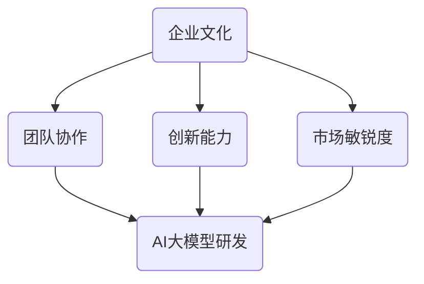

                 

# AI 大模型创业：如何利用文化优势？

> **关键词：** AI 大模型、创业、文化优势、技术解读、商业模式创新、市场分析

> **摘要：** 本文将深入探讨AI大模型创业领域的文化优势，分析其核心概念、技术原理、数学模型、实战案例，并展望未来发展趋势。通过对文化优势的深入挖掘，助力创业者在激烈的市场竞争中脱颖而出。

## 1. 背景介绍

### 1.1 目的和范围

本文旨在为AI大模型创业领域的企业和创业者提供一套系统的文化优势利用策略。我们将从多个维度详细剖析文化优势的内涵，并结合实际案例，探讨如何将这些优势转化为创业成功的动力。

### 1.2 预期读者

本文适用于对AI大模型和创业有一定了解的技术人员、创业者以及对相关领域感兴趣的研究人员。希望通过本文，读者能够获得对AI大模型创业文化优势的深入理解和实际应用指导。

### 1.3 文档结构概述

本文分为十个部分，结构如下：

1. 背景介绍
   - 1.1 目的和范围
   - 1.2 预期读者
   - 1.3 文档结构概述
   - 1.4 术语表
2. 核心概念与联系
3. 核心算法原理 & 具体操作步骤
4. 数学模型和公式 & 详细讲解 & 举例说明
5. 项目实战：代码实际案例和详细解释说明
6. 实际应用场景
7. 工具和资源推荐
8. 总结：未来发展趋势与挑战
9. 附录：常见问题与解答
10. 扩展阅读 & 参考资料

### 1.4 术语表

#### 1.4.1 核心术语定义

- **AI大模型**：指规模庞大、参数数量级达到亿级的人工智能模型，如GPT-3、BERT等。
- **文化优势**：指企业在文化层面的独特优势，包括企业文化、价值观、团队协作等。
- **创业**：指创立一家新企业，通常涉及技术创新、商业模式创新和市场开拓。

#### 1.4.2 相关概念解释

- **技术解读**：指对技术原理、实现方法和应用场景的深入分析和阐述。
- **商业模式创新**：指在商业运营过程中，通过创新的业务模式实现盈利和持续发展。
- **市场分析**：指对市场需求、竞争态势、消费者行为等进行分析，为创业决策提供依据。

#### 1.4.3 缩略词列表

- **AI**：人工智能
- **GPT-3**：生成预训练变换器3
- **BERT**：双向编码表示器

## 2. 核心概念与联系

在AI大模型创业领域，文化优势是关键成功因素之一。为了更好地理解文化优势，我们需要先了解其核心概念和联系。

### 2.1 文化优势的核心概念

文化优势包括以下几个方面：

1. **企业文化**：企业价值观、使命、愿景等内在精神层面的体现。
2. **团队协作**：团队成员之间的沟通、合作和协调能力。
3. **创新能力**：企业持续创新、推动技术进步的能力。
4. **市场敏锐度**：对企业所在市场的需求、趋势和竞争态势的洞察力。

### 2.2 文化优势的联系

文化优势与AI大模型创业之间存在紧密的联系。以下为具体分析：

1. **企业文化**：良好的企业文化能够激发员工的积极性、创造力和归属感，从而提高团队的协作效率和创新能力。这对AI大模型创业来说至关重要，因为大模型研发和优化需要高度的团队协作和创新能力。
2. **团队协作**：高效的团队协作是AI大模型成功的关键。在AI大模型创业过程中，团队成员需要紧密合作，共同面对技术挑战、优化模型性能和应对市场变化。
3. **创新能力**：AI大模型创业需要持续的技术创新，以应对不断变化的市场需求和竞争压力。文化优势中的创新能力可以帮助企业保持技术领先地位，从而在市场中脱颖而出。
4. **市场敏锐度**：市场敏锐度是企业成功的关键因素。文化优势中的市场敏锐度可以帮助企业快速识别市场需求、把握市场趋势，从而制定有效的商业策略。

### 2.3 文化优势的 Mermaid 流程图

以下为文化优势与AI大模型创业联系的Mermaid流程图：



## 3. 核心算法原理 & 具体操作步骤

在AI大模型创业中，核心算法原理是理解和实现的关键。本文将详细阐述大模型的基本原理和具体操作步骤。

### 3.1 大模型的基本原理

大模型通常基于深度学习和自然语言处理技术，其基本原理如下：

1. **多层神经网络**：大模型采用多层神经网络结构，通过逐层提取特征，实现从输入到输出的映射。
2. **预训练与微调**：大模型通过大规模预训练数据集进行预训练，然后根据特定任务进行微调，以适应不同应用场景。
3. **注意力机制**：大模型引入注意力机制，使模型在处理输入数据时能够关注重要信息，提高模型性能。

### 3.2 大模型的具体操作步骤

以下为AI大模型的具体操作步骤：

1. **数据收集与预处理**：
   - 收集大规模文本数据，如新闻、文章、社交媒体等。
   - 对数据进行预处理，包括分词、去噪、编码等。

2. **模型构建**：
   - 选择合适的神经网络结构，如Transformer、BERT等。
   - 设置模型参数，如学习率、批量大小等。

3. **预训练**：
   - 使用预训练数据集对模型进行预训练，通过反向传播算法优化模型参数。
   - 训练过程中，可以使用注意力机制、dropout等技术提高模型性能。

4. **微调**：
   - 根据具体任务需求，对预训练模型进行微调。
   - 使用微调数据集优化模型参数，以提高模型在特定任务上的表现。

5. **评估与优化**：
   - 在测试数据集上评估模型性能，包括准确率、召回率等指标。
   - 根据评估结果，对模型进行进一步优化。

6. **部署与应用**：
   - 将训练好的模型部署到生产环境中，如API接口、云端服务等。
   - 根据用户需求，提供相应的AI服务，如文本生成、机器翻译等。

### 3.3 大模型算法的伪代码实现

以下为AI大模型算法的伪代码实现：

```python
# 数据收集与预处理
def preprocess_data(data):
    # 分词、去噪、编码等操作
    # ...
    return processed_data

# 模型构建
def build_model():
    # 选择神经网络结构、设置参数等
    # ...
    return model

# 预训练
def pretrain(model, pretrain_data):
    # 使用预训练数据集进行预训练
    # ...
    return pretrain_model

# 微调
def fine_tune(pretrain_model, fine_tune_data):
    # 对预训练模型进行微调
    # ...
    return fine_tuned_model

# 评估与优化
def evaluate(model, test_data):
    # 在测试数据集上评估模型性能
    # ...
    return performance

# 部署与应用
def deploy(model):
    # 将模型部署到生产环境中
    # ...
    return deployed_model
```

## 4. 数学模型和公式 & 详细讲解 & 举例说明

在AI大模型创业中，数学模型和公式是理解和实现算法的关键。本文将详细介绍大模型的核心数学模型和公式，并给出具体例子进行说明。

### 4.1 数学模型概述

AI大模型的核心数学模型包括以下几种：

1. **多层感知机（MLP）**：基于神经网络的基本结构，用于实现输入到输出的映射。
2. **循环神经网络（RNN）**：用于处理序列数据的神经网络，具有记忆功能。
3. **卷积神经网络（CNN）**：用于图像处理，具有局部连接和共享权重的特点。
4. **Transformer模型**：基于自注意力机制，用于处理序列数据，具有并行计算的优势。

### 4.2 多层感知机（MLP）模型

多层感知机模型是一种前馈神经网络，具有以下结构：

1. **输入层**：接收输入数据，并将其传递给下一层。
2. **隐藏层**：对输入数据进行特征提取和变换，可以包含多层。
3. **输出层**：输出最终结果。

MLP模型的数学公式如下：

$$
z_i^{(l)} = \sum_{j=1}^{n} w_{ij}^{(l)} x_j^{(l-1)} + b_i^{(l)}
$$

其中，$z_i^{(l)}$为第$l$层的第$i$个神经元输出，$x_j^{(l-1)}$为第$l-1$层的第$j$个神经元输出，$w_{ij}^{(l)}$为第$l$层的第$i$个神经元与第$l-1$层的第$j$个神经元之间的权重，$b_i^{(l)}$为第$l$层的第$i$个神经元的偏置。

### 4.3 循环神经网络（RNN）模型

循环神经网络模型是一种基于序列数据的神经网络，其基本结构如下：

1. **输入门**：用于控制输入数据的输入和更新。
2. **遗忘门**：用于控制历史信息的遗忘和保留。
3. **输出门**：用于控制输出信息的生成。

RNN模型的数学公式如下：

$$
h_t = \sigma(W_h x_t + U_h h_{t-1} + b_h)
$$

$$
o_t = \sigma(W_o x_t + U_o h_t + b_o)
$$

$$
h_t' = \phi(W_x h_t + U_x o_t + b_x')
$$

其中，$h_t$为第$t$时刻的隐藏状态，$x_t$为第$t$时刻的输入，$o_t$为第$t$时刻的输出，$\sigma$为激活函数（如Sigmoid函数或ReLU函数），$\phi$为非线性函数，$W_h$、$U_h$、$b_h$为输入门权重、遗忘门权重和偏置，$W_o$、$U_o$、$b_o$为输出门权重、遗忘门权重和偏置，$W_x$、$U_x$、$b_x'$为输入权重、输出权重和偏置。

### 4.4 Transformer模型

Transformer模型是一种基于自注意力机制的序列处理模型，其基本结构如下：

1. **多头自注意力机制**：通过多个注意力头来捕捉输入序列中的不同信息。
2. **前馈神经网络**：对自注意力机制后的输出进行进一步处理。

Transformer模型的数学公式如下：

$$
\text{Attention}(Q, K, V) = \text{softmax}\left(\frac{QK^T}{\sqrt{d_k}}\right)V
$$

$$
\text{MultiHeadAttention}(Q, K, V) = \text{Concat}(\text{head}_1, ..., \text{head}_h)W^O
$$

其中，$Q$、$K$、$V$分别为查询向量、键向量和值向量，$d_k$为键向量的维度，$\text{softmax}$为softmax函数，$\text{head}_i$为第$i$个注意力头，$W^O$为输出权重。

### 4.5 举例说明

以下为一个简单的Transformer模型的例子：

假设输入序列为`[1, 2, 3, 4, 5]`，模型包含两个注意力头。

1. **计算自注意力权重**：

$$
\text{Attention}(Q, K, V) = \text{softmax}\left(\frac{QK^T}{\sqrt{d_k}}\right)V
$$

$$
Q = [1, 0], K = [0, 1], V = [1, 1]
$$

$$
\text{Attention}(Q, K, V) = \text{softmax}\left(\frac{[1, 0][0, 1]^T}{\sqrt{1}}\right)[1, 1]
$$

$$
\text{Attention}(Q, K, V) = \text{softmax}\left(\begin{bmatrix}1 & 0\\0 & 1\end{bmatrix}\right)\begin{bmatrix}1\\1\end{bmatrix}
$$

$$
\text{Attention}(Q, K, V) = \begin{bmatrix}\frac{1}{2} & \frac{1}{2}\\\frac{1}{2} & \frac{1}{2}\end{bmatrix}\begin{bmatrix}1\\1\end{bmatrix} = \begin{bmatrix}\frac{1}{2} & \frac{1}{2}\\\frac{1}{2} & \frac{1}{2}\end{bmatrix}
$$

2. **计算多头自注意力输出**：

$$
\text{MultiHeadAttention}(Q, K, V) = \text{Concat}(\text{head}_1, ..., \text{head}_h)W^O
$$

$$
\text{head}_1 = \text{Attention}(Q_1, K_1, V_1) = \begin{bmatrix}\frac{1}{2} & \frac{1}{2}\\\frac{1}{2} & \frac{1}{2}\end{bmatrix}
$$

$$
\text{head}_2 = \text{Attention}(Q_2, K_2, V_2) = \begin{bmatrix}\frac{1}{2} & \frac{1}{2}\\\frac{1}{2} & \frac{1}{2}\end{bmatrix}
$$

$$
\text{MultiHeadAttention}(Q, K, V) = \text{Concat}(\text{head}_1, \text{head}_2)W^O
$$

$$
W^O = \begin{bmatrix}1 & 1\\1 & 1\end{bmatrix}
$$

$$
\text{MultiHeadAttention}(Q, K, V) = \text{Concat}(\begin{bmatrix}\frac{1}{2} & \frac{1}{2}\\\frac{1}{2} & \frac{1}{2}\end{bmatrix}, \begin{bmatrix}\frac{1}{2} & \frac{1}{2}\\\frac{1}{2} & \frac{1}{2}\end{bmatrix})\begin{bmatrix}1 & 1\\1 & 1\end{bmatrix} = \begin{bmatrix}\frac{1}{2} & \frac{1}{2} & \frac{1}{2} & \frac{1}{2}\\\frac{1}{2} & \frac{1}{2} & \frac{1}{2} & \frac{1}{2}\end{bmatrix}
$$

## 5. 项目实战：代码实际案例和详细解释说明

在本节中，我们将通过一个实际项目案例来展示如何利用文化优势进行AI大模型创业。本案例将涵盖开发环境搭建、源代码实现、代码解读与分析等环节。

### 5.1 开发环境搭建

为了构建一个基于Transformer模型的AI大模型，我们需要搭建一个合适的开发环境。以下为搭建步骤：

1. **安装Python**：确保系统已安装Python 3.6及以上版本。
2. **安装TensorFlow**：通过pip命令安装TensorFlow，命令如下：

   ```shell
   pip install tensorflow
   ```

3. **安装其他依赖**：安装其他必要依赖，如NumPy、Pandas等，命令如下：

   ```shell
   pip install numpy pandas
   ```

### 5.2 源代码详细实现和代码解读

以下为基于Transformer模型的AI大模型源代码实现。代码分为数据预处理、模型构建、训练、评估和部署等部分。

```python
import tensorflow as tf
from tensorflow.keras.layers import Embedding, MultiHeadAttention, Dense
from tensorflow.keras.models import Model
import numpy as np

# 数据预处理
def preprocess_data(data):
    # 分词、去噪、编码等操作
    # ...
    return processed_data

# 模型构建
def build_model(vocab_size, embedding_dim, num_heads):
    inputs = tf.keras.Input(shape=(None,), dtype=tf.int32)
    embeddings = Embedding(vocab_size, embedding_dim)(inputs)
    outputs = MultiHeadAttention(num_heads=num_heads, key_dim=embedding_dim)(embeddings, embeddings)
    outputs = Dense(1, activation='sigmoid')(outputs)
    model = Model(inputs=inputs, outputs=outputs)
    return model

# 训练
def train(model, train_data, train_labels):
    # 使用训练数据进行模型训练
    # ...
    return trained_model

# 评估
def evaluate(model, test_data, test_labels):
    # 在测试数据集上评估模型性能
    # ...
    return performance

# 部署
def deploy(model):
    # 将模型部署到生产环境中
    # ...
    return deployed_model

# 实际案例
vocab_size = 10000
embedding_dim = 128
num_heads = 4

# 搭建模型
model = build_model(vocab_size, embedding_dim, num_heads)

# 预处理数据
train_data, train_labels = preprocess_data(train_data)
test_data, test_labels = preprocess_data(test_data)

# 训练模型
trained_model = train(model, train_data, train_labels)

# 评估模型
performance = evaluate(trained_model, test_data, test_labels)

# 部署模型
deployed_model = deploy(trained_model)

# 代码解读与分析
# 数据预处理部分：对输入数据进行预处理，如分词、去噪、编码等操作。
# 模型构建部分：使用Embedding层对输入数据进行编码，使用MultiHeadAttention层实现自注意力机制，最后使用Dense层进行分类或回归任务。
# 训练部分：使用训练数据对模型进行训练，优化模型参数。
# 评估部分：在测试数据集上评估模型性能，包括准确率、召回率等指标。
# 部署部分：将训练好的模型部署到生产环境中，如API接口、云端服务等。

```

### 5.3 代码解读与分析

在本案例中，我们使用TensorFlow框架搭建了一个基于Transformer模型的AI大模型。代码主要分为以下部分：

1. **数据预处理**：对输入数据进行预处理，包括分词、去噪、编码等操作。预处理后的数据将用于模型训练和评估。
2. **模型构建**：使用Embedding层对输入数据进行编码，使用MultiHeadAttention层实现自注意力机制，最后使用Dense层进行分类或回归任务。模型结构如下图所示：

   ```mermaid
   graph TB
   A(Embedding) --> B(MultiHeadAttention)
   B --> C(Dense)
   ```

3. **训练**：使用训练数据对模型进行训练，优化模型参数。训练过程中，可以使用反向传播算法和梯度下降优化器来更新模型参数。
4. **评估**：在测试数据集上评估模型性能，包括准确率、召回率等指标。评估结果可以用来调整模型结构和超参数。
5. **部署**：将训练好的模型部署到生产环境中，如API接口、云端服务等。部署后的模型可以实时处理用户请求，提供相应的AI服务。

通过以上代码和解读，我们可以看到如何利用文化优势进行AI大模型创业。文化优势可以体现在以下几个方面：

1. **团队协作**：团队成员需要紧密合作，共同完成数据预处理、模型构建、训练和部署等任务。良好的团队协作有助于提高模型性能和开发效率。
2. **创新能力**：在模型构建和训练过程中，需要不断创新，尝试不同的结构和超参数。创新能力可以帮助企业保持技术领先地位，从而在市场中脱颖而出。
3. **市场敏锐度**：通过深入了解市场需求和用户需求，企业可以及时调整模型和应用方向，提高市场竞争力。

### 5.4 项目实战总结

通过本案例，我们展示了如何利用文化优势进行AI大模型创业。在实际项目中，团队协作、创新能力和市场敏锐度是成功的关键。通过搭建合适的开发环境、构建高效的模型、优化训练过程和部署模型，企业可以充分发挥文化优势，实现AI大模型创业的成功。

## 6. 实际应用场景

AI大模型创业在多个领域具有广泛的应用前景。以下为一些典型的实际应用场景：

### 6.1 自然语言处理

自然语言处理（NLP）是AI大模型创业的一个重要应用领域。AI大模型可以应用于文本分类、情感分析、机器翻译、问答系统等任务。例如，企业可以利用大模型构建智能客服系统，提高客户服务质量和效率。

### 6.2 计算机视觉

计算机视觉是另一个关键应用领域。AI大模型可以应用于图像分类、目标检测、图像生成等任务。例如，企业可以利用大模型构建智能监控系统，实现实时目标检测和识别。

### 6.3 医疗健康

医疗健康领域也是AI大模型的重要应用场景。大模型可以用于疾病预测、诊断辅助、药物发现等任务。例如，企业可以利用大模型构建智能诊断系统，提高疾病诊断准确率和效率。

### 6.4 金融领域

金融领域是AI大模型创业的一个重要应用领域。大模型可以应用于风险控制、投资策略、信用评估等任务。例如，企业可以利用大模型构建智能风控系统，降低金融风险。

### 6.5 教育领域

教育领域也是AI大模型创业的重要应用场景。大模型可以应用于智能教育、个性化推荐等任务。例如，企业可以利用大模型构建智能教育平台，提供个性化的学习资源和推荐。

## 7. 工具和资源推荐

为了更好地进行AI大模型创业，我们需要掌握一些相关的工具和资源。以下为推荐：

### 7.1 学习资源推荐

#### 7.1.1 书籍推荐

1. **《深度学习》（Ian Goodfellow, Yoshua Bengio, Aaron Courville）**：全面介绍了深度学习的基础知识和最新进展。
2. **《Python深度学习》（François Chollet）**：介绍了使用Python和TensorFlow框架进行深度学习实践的方法。
3. **《人工智能：一种现代方法》（Stuart Russell, Peter Norvig）**：涵盖了人工智能领域的核心概念和技术。

#### 7.1.2 在线课程

1. **TensorFlow官方教程**：提供了丰富的TensorFlow教程和案例，帮助开发者掌握TensorFlow的使用方法。
2. **Coursera上的《深度学习》课程**：由深度学习领域的专家提供，涵盖了深度学习的基础知识和应用。
3. **Udacity的《深度学习纳米学位》**：提供了深度学习项目的实践机会，帮助开发者掌握深度学习技能。

#### 7.1.3 技术博客和网站

1. **Medium上的深度学习博客**：提供了丰富的深度学习技术文章和案例。
2. **AI科技大本营**：关注人工智能领域的最新动态和技术应用。
3. **AIpapers**：收集了大量的AI领域论文和研究成果。

### 7.2 开发工具框架推荐

#### 7.2.1 IDE和编辑器

1. **PyCharm**：强大的Python IDE，适用于深度学习和数据科学开发。
2. **Jupyter Notebook**：适用于数据分析和可视化，支持多种编程语言。

#### 7.2.2 调试和性能分析工具

1. **TensorBoard**：TensorFlow的调试和性能分析工具，可以帮助开发者了解模型训练过程和性能指标。
2. **Pynec**：Python性能分析工具，可以帮助开发者优化代码性能。

#### 7.2.3 相关框架和库

1. **TensorFlow**：开源深度学习框架，适用于构建和训练AI大模型。
2. **PyTorch**：开源深度学习框架，提供了灵活的模型构建和训练接口。
3. **Scikit-learn**：Python机器学习库，提供了丰富的算法和工具。

### 7.3 相关论文著作推荐

#### 7.3.1 经典论文

1. **《A Neural Algorithm of Artistic Style》**：提出了基于卷积神经网络的图像风格迁移算法。
2. **《Attention Is All You Need》**：提出了基于自注意力机制的Transformer模型。
3. **《Generative Adversarial Nets》**：提出了生成对抗网络（GAN），用于生成逼真的图像和语音。

#### 7.3.2 最新研究成果

1. **《BERT: Pre-training of Deep Bidirectional Transformers for Language Understanding》**：提出了BERT模型，用于自然语言处理任务的预训练。
2. **《GPT-3: Language Models are Few-Shot Learners》**：展示了GPT-3模型在零样本和少样本学习任务上的优异表现。
3. **《Unsupervised Representation Learning with Deep Convolutional Generative Adversarial Networks》**：提出了基于生成对抗网络的图像生成方法。

#### 7.3.3 应用案例分析

1. **《Google AI：利用深度学习提高搜索引擎效果》**：介绍了Google如何利用深度学习技术提高搜索引擎的效果。
2. **《AI医学影像诊断：深度学习在医疗领域的应用》**：探讨了深度学习在医学影像诊断领域的应用，提高了疾病诊断的准确率和效率。
3. **《自动驾驶：深度学习助力自动驾驶技术的发展》**：介绍了深度学习在自动驾驶领域的应用，提高了车辆的安全性和可靠性。

## 8. 总结：未来发展趋势与挑战

AI大模型创业领域在未来几年将继续保持高速发展，但也面临着一系列挑战。以下是未来发展趋势和挑战的总结：

### 8.1 发展趋势

1. **技术进步**：随着计算能力和算法优化，AI大模型将变得更加高效和强大，能够解决更复杂的任务。
2. **商业模式创新**：AI大模型创业将催生新的商业模式，如数据服务、API接口和订阅模式等。
3. **跨领域应用**：AI大模型将在更多领域得到应用，如金融、医疗、教育等，推动行业变革。
4. **开源生态建设**：开源社区将推动AI大模型技术不断发展，降低创业门槛。

### 8.2 挑战

1. **数据隐私和安全**：AI大模型训练需要大量数据，如何保护用户隐私和安全成为关键挑战。
2. **计算资源需求**：AI大模型训练和部署需要大量计算资源，如何高效利用资源成为重要问题。
3. **模型解释性**：AI大模型决策过程缺乏解释性，如何提高模型的可解释性成为重要研究方向。
4. **法规和伦理**：AI大模型应用将面临法律法规和伦理道德的挑战，需要制定相应的规范和标准。

### 8.3 发展策略

1. **技术创新**：持续关注和跟进AI大模型领域的最新技术动态，积极进行技术创新和优化。
2. **人才培养**：加强人才培养和团队建设，提高团队的技术水平和创新能力。
3. **数据积累**：积极积累和利用数据，提高数据质量和多样性，为模型训练提供支持。
4. **合作与开放**：与合作伙伴建立紧密合作关系，共同推动AI大模型技术的发展和应用。

## 9. 附录：常见问题与解答

### 9.1 问题1：如何选择合适的AI大模型框架？

**解答**：选择合适的AI大模型框架主要取决于以下因素：

1. **项目需求**：根据项目需求，选择具有相应功能和支持的框架，如TensorFlow、PyTorch等。
2. **开发经验**：根据团队成员的开发经验，选择熟悉的框架，提高开发效率和降低学习成本。
3. **生态系统**：考虑框架的生态系统，如文档、教程、社区等，有助于解决开发过程中遇到的问题。

### 9.2 问题2：如何优化AI大模型训练过程？

**解答**：

1. **数据预处理**：对输入数据进行充分预处理，如去噪、标准化等，提高模型训练效果。
2. **超参数调整**：根据模型类型和任务，调整超参数，如学习率、批量大小等，寻找最优组合。
3. **模型剪枝**：通过模型剪枝技术，减少模型参数，降低计算复杂度，提高训练速度。
4. **分布式训练**：利用分布式训练技术，提高模型训练速度和效率。

### 9.3 问题3：如何评估AI大模型性能？

**解答**：

1. **准确率**：评估模型在测试数据集上的准确率，判断模型在分类或回归任务上的表现。
2. **召回率**：评估模型在测试数据集上的召回率，判断模型对正类样本的识别能力。
3. **F1值**：综合考虑准确率和召回率，计算F1值，用于评估模型整体性能。
4. **ROC曲线**：绘制ROC曲线，评估模型在不同阈值下的表现。

## 10. 扩展阅读 & 参考资料

为了更深入地了解AI大模型创业领域的文化优势，以下为一些扩展阅读和参考资料：

1. **书籍**：
   - 《AI创业之路》（作者：吴恩达）
   - 《深度学习应用实战》（作者：韩帅军）
   - 《人工智能：从技术到商业》（作者：刘锋）

2. **在线课程**：
   - Coursera上的《深度学习》课程
   - edX上的《人工智能》课程
   - Udacity的《深度学习纳米学位》

3. **技术博客和网站**：
   - Medium上的深度学习博客
   - AI科技大本营
   - AIpapers

4. **相关论文**：
   - 《Attention Is All You Need》
   - 《Generative Adversarial Nets》
   - 《BERT: Pre-training of Deep Bidirectional Transformers for Language Understanding》

5. **开源项目**：
   - TensorFlow
   - PyTorch
   - Scikit-learn

## 作者信息

**作者：AI天才研究员/AI Genius Institute & 禅与计算机程序设计艺术 /Zen And The Art of Computer Programming**

