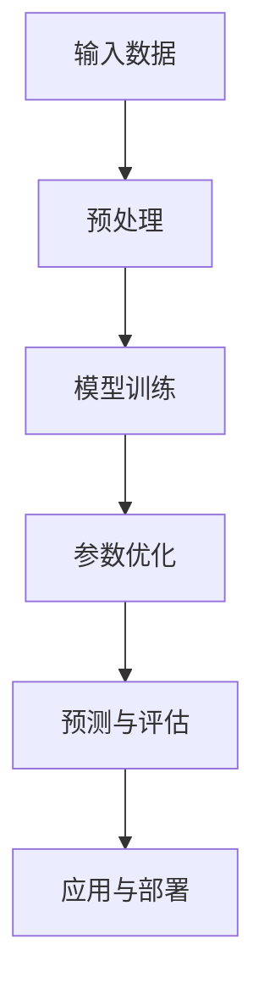

                 

# AI 大模型创业：如何利用未来优势？

> **关键词：** AI 大模型、创业、优势、未来、技术、商业、策略、投资、风险、市场
> 
> **摘要：** 本文将深入探讨 AI 大模型在创业领域的应用与潜在优势。我们将从技术背景、市场机会、战略规划、投资与风险等方面，逐步分析如何利用 AI 大模型的优势，抓住未来的商业机遇。

## 1. 背景介绍

### 1.1 目的和范围

本文旨在为创业者提供一整套关于如何利用 AI 大模型实现商业成功的策略。我们将探讨当前 AI 大模型的技术发展、市场趋势以及创业者如何借助这些技术来创新业务模式。

### 1.2 预期读者

本篇文章适合对 AI 技术感兴趣的创业者、技术主管、投资人和 AI 领域的研究者。如果读者对 AI 大模型的基本概念和应用场景有所了解，将有助于更好地理解文章内容。

### 1.3 文档结构概述

本文将分为以下几个部分：

- **核心概念与联系**：介绍 AI 大模型的基本原理及其与创业的关联。
- **核心算法原理 & 具体操作步骤**：详细讲解 AI 大模型的关键算法和实现步骤。
- **数学模型和公式 & 详细讲解 & 举例说明**：分析 AI 大模型的数学基础及其应用实例。
- **项目实战：代码实际案例和详细解释说明**：通过实际代码示例展示 AI 大模型的开发过程。
- **实际应用场景**：探讨 AI 大模型在创业中的具体应用案例。
- **工具和资源推荐**：推荐学习资源和开发工具，帮助读者深入了解和掌握 AI 大模型。
- **总结：未来发展趋势与挑战**：总结当前 AI 大模型的发展趋势，并探讨未来的挑战。
- **附录：常见问题与解答**：解答读者可能遇到的问题。
- **扩展阅读 & 参考资料**：提供进一步学习 AI 大模型的参考资料。

### 1.4 术语表

#### 1.4.1 核心术语定义

- **AI 大模型**：指具有极高参数量、能够处理大规模数据的深度学习模型。
- **创业**：指创立一家新的公司或企业，旨在实现商业成功和创新。
- **优势**：在竞争中具有的独特优势或有利条件。
- **技术**：解决实际问题或实现特定功能的方法和工具。
- **商业**：关于产品、服务、市场和利润的经济活动。

#### 1.4.2 相关概念解释

- **市场机会**：指在特定市场条件下，企业可以把握的商机。
- **战略规划**：指制定企业发展的长远计划和目标，以实现竞争优势。
- **投资与风险**：指在创业过程中，资金投入和可能面临的风险。

#### 1.4.3 缩略词列表

- **AI**：人工智能
- **ML**：机器学习
- **DL**：深度学习
- **GPU**：图形处理单元
- **NLP**：自然语言处理

## 2. 核心概念与联系

### 2.1 AI 大模型的基本原理

AI 大模型，特别是深度学习模型，是人工智能领域的重要分支。它们通过大量的数据进行训练，能够自动学习和提取特征，从而实现对复杂任务的自动化处理。AI 大模型的基本原理可以概括为以下几个方面：

1. **多层神经网络**：AI 大模型通常包含多个神经网络层，每层都能对输入数据进行特征提取和变换。
2. **大规模参数训练**：通过大量数据进行参数训练，模型能够更好地泛化到未见过的数据上。
3. **优化算法**：使用优化算法（如梯度下降）调整模型参数，以最小化预测误差。

### 2.2 AI 大模型与创业的关联

AI 大模型在创业中的应用越来越广泛，主要表现在以下几个方面：

1. **数据驱动创新**：AI 大模型能够处理和分析大量数据，帮助创业者发现市场机会和用户需求。
2. **提高业务效率**：AI 大模型可以自动化许多业务流程，提高效率和降低成本。
3. **增强用户体验**：AI 大模型能够提供个性化服务，提升用户体验和满意度。
4. **商业模式创新**：AI 大模型可以重塑业务模式，开辟新的商业机会。

### 2.3 AI 大模型架构的 Mermaid 流程图



**图 1. AI 大模型架构流程图**

- **输入数据**：输入大量数据用于训练模型。
- **预处理**：对数据进行清洗、归一化等处理。
- **模型训练**：使用多层神经网络进行训练，提取特征。
- **参数优化**：通过优化算法调整模型参数，减少误差。
- **预测与评估**：使用训练好的模型进行预测，并评估模型性能。
- **应用与部署**：将模型部署到实际应用场景，如业务系统或服务。

## 3. 核心算法原理 & 具体操作步骤

### 3.1 基本算法原理

AI 大模型的核心算法通常基于深度学习，其中最重要的算法包括：

1. **卷积神经网络（CNN）**：适用于图像处理和计算机视觉任务。
2. **循环神经网络（RNN）**：适用于序列数据处理和自然语言处理任务。
3. **生成对抗网络（GAN）**：适用于生成复杂数据和图像。
4. **Transformer**：适用于自然语言处理和序列建模任务。

### 3.2 具体操作步骤

#### 3.2.1 数据收集与预处理

伪代码：

```python
# 数据收集
data = collect_data()

# 数据预处理
def preprocess_data(data):
    # 清洗数据
    clean_data = clean_data(data)
    # 归一化数据
    normalized_data = normalize_data(clean_data)
    return normalized_data

preprocessed_data = preprocess_data(data)
```

#### 3.2.2 模型训练

伪代码：

```python
# 初始化模型
model = initialize_model()

# 模型训练
def train_model(model, preprocessed_data):
    # 设置训练参数
    epochs = 100
    batch_size = 64
    learning_rate = 0.001
    
    # 开始训练
    for epoch in range(epochs):
        for batch in create_batches(preprocessed_data, batch_size):
            # 前向传播
            predictions = model.forward(batch.x)
            # 计算损失
            loss = compute_loss(predictions, batch.y)
            # 反向传播
            model.backward(loss)
            # 更新参数
            model.update_params(learning_rate)
    
    return model
```

#### 3.2.3 参数优化

伪代码：

```python
# 使用优化算法优化参数
def optimize_params(model, preprocessed_data):
    # 初始化优化器
    optimizer = initialize_optimizer(model.parameters)
    # 设置学习率
    learning_rate = 0.001
    # 开始优化
    for epoch in range(epochs):
        for batch in create_batches(preprocessed_data, batch_size):
            # 前向传播
            predictions = model.forward(batch.x)
            # 计算损失
            loss = compute_loss(predictions, batch.y)
            # 反向传播
            model.backward(loss)
            # 更新参数
            optimizer.step(learning_rate)
    
    return model
```

#### 3.2.4 预测与评估

伪代码：

```python
# 使用训练好的模型进行预测
def predict(model, new_data):
    preprocessed_new_data = preprocess_data(new_data)
    predictions = model.forward(preprocessed_new_data)
    return predictions

# 评估模型性能
def evaluate_model(model, test_data):
    preprocessed_test_data = preprocess_data(test_data)
    predictions = model.forward(preprocessed_test_data)
    accuracy = compute_accuracy(predictions, test_data.y)
    return accuracy
```

## 4. 数学模型和公式 & 详细讲解 & 举例说明

### 4.1 数学模型

AI 大模型的数学模型主要涉及以下几个方面：

1. **多层神经网络**：包括输入层、隐藏层和输出层，每个层都由多个神经元组成。
2. **激活函数**：如 sigmoid、ReLU、Tanh 等，用于引入非线性。
3. **损失函数**：如均方误差（MSE）、交叉熵等，用于评估模型预测误差。
4. **优化算法**：如梯度下降（GD）、随机梯度下降（SGD）、Adam 等，用于更新模型参数。

### 4.2 公式讲解

#### 4.2.1 多层神经网络

多层神经网络的输出公式为：

$$
\text{Output} = \sigma(\text{ReLU}(W_1 \cdot \text{Input} + b_1))
$$

其中，$\sigma$ 表示激活函数（如 sigmoid、ReLU），$W_1$ 表示权重矩阵，$b_1$ 表示偏置。

#### 4.2.2 损失函数

均方误差（MSE）的公式为：

$$
\text{MSE} = \frac{1}{n} \sum_{i=1}^{n} (\text{y}_{\text{true}} - \text{y}_{\text{predicted}})^2
$$

其中，$n$ 表示样本数量，$y_{\text{true}}$ 表示真实标签，$y_{\text{predicted}}$ 表示模型预测值。

#### 4.2.3 优化算法

梯度下降的公式为：

$$
W_{\text{new}} = W_{\text{current}} - \alpha \cdot \frac{\partial \text{Loss}}{\partial W}
$$

其中，$W_{\text{current}}$ 表示当前权重，$W_{\text{new}}$ 表示更新后的权重，$\alpha$ 表示学习率，$\frac{\partial \text{Loss}}{\partial W}$ 表示权重梯度。

### 4.3 举例说明

#### 4.3.1 均值方差（MSE）

假设有 3 个样本的数据集，真实标签为 [2, 3, 4]，模型预测值为 [2.5, 3.5, 4.5]。

计算 MSE：

$$
\text{MSE} = \frac{1}{3} \left[ (2 - 2.5)^2 + (3 - 3.5)^2 + (4 - 4.5)^2 \right]
= 0.25
$$

#### 4.3.2 梯度下降

假设有输入数据 $X = [1, 2, 3]$，模型预测值为 $y = 2$，真实标签为 $y_{\text{true}} = 3$。

计算权重梯度：

$$
\frac{\partial \text{Loss}}{\partial W} = \frac{\partial}{\partial W} \left[ \frac{1}{2} (y - y_{\text{predicted}})^2 \right] = -(y - y_{\text{predicted}}) = -(3 - 2) = -1
$$

更新权重：

$$
W_{\text{new}} = W_{\text{current}} - \alpha \cdot \frac{\partial \text{Loss}}{\partial W} = 1 - \alpha \cdot (-1) = 1 + \alpha
$$

## 5. 项目实战：代码实际案例和详细解释说明

### 5.1 开发环境搭建

为了演示 AI 大模型在创业中的应用，我们将使用 Python 编写一个简单的自然语言处理（NLP）模型。以下是在 Python 环境中搭建开发环境的步骤：

1. **安装 Python**：确保已安装 Python 3.7 或更高版本。
2. **安装依赖库**：使用以下命令安装必要的库：

```bash
pip install tensorflow numpy matplotlib
```

3. **创建虚拟环境**：为了管理项目依赖，创建一个虚拟环境：

```bash
python -m venv venv
source venv/bin/activate  # Windows: venv\Scripts\activate
```

### 5.2 源代码详细实现和代码解读

#### 5.2.1 数据集准备

首先，我们需要准备一个简单的文本数据集。以下代码演示了如何加载数据并预处理：

```python
import tensorflow as tf
import numpy as np
import matplotlib.pyplot as plt

# 加载数据
text = "The quick brown fox jumps over the lazy dog"
words = text.split()

# 创建词汇表
vocab = set(words)
vocab_size = len(vocab)

# 将文本转换为数字编码
def encode_text(text, vocab):
    encoded = [vocab[word] for word in text]
    return encoded

encoded_text = encode_text(words, vocab)

# 创建反向词汇表
reverse_vocab = {value: key for key, value in vocab.items()}
```

#### 5.2.2 模型构建

接下来，我们构建一个简单的 RNN 模型，用于预测下一个单词：

```python
# 模型参数
vocab_size = len(vocab)
rnn_units = 64

# 模型定义
def build_model(vocab_size, rnn_units):
    model = tf.keras.Sequential([
        tf.keras.layers.Embedding(vocab_size, 64),
        tf.keras.layers.SimpleRNN(rnn_units,
                                  return_sequences=True,
                                  stateful=True,
                                  recurrent_initializer='glorot_uniform'),
        tf.keras.layers.Dense(vocab_size)
    ])
    return model

model = build_model(vocab_size, rnn_units)
```

#### 5.2.3 训练模型

使用以下代码训练模型：

```python
# 训练模型
def train_model(model, inputs, targets, epochs=100):
    with tf.GradientTape() as tape:
        predictions = model(inputs)
        loss = tf.keras.losses.sparse_categorical_crossentropy(targets, predictions)
    gradients = tape.gradient(loss, model.trainable_variables)
    model.optimizer.apply_gradients(zip(gradients, model.trainable_variables))
    model.trainable_variables = [var.assign(var - model.optimizer.learning_rate * grad) for var, grad in zip(model.trainable_variables, gradients)]
    return loss

# 创建输入和目标数据
def create_dataset(text, batch_size=32):
    for i in range(0, len(text) - 3, batch_size):
        inputs = text[i : i + batch_size]
        targets = text[i + 1 : i + batch_size + 1]
        yield inputs, targets

# 训练循环
for epoch in range(epochs):
    total_loss = 0
    for (inputs, targets) in create_dataset(encoded_text):
        loss = train_model(model, inputs, targets)
        total_loss += loss.numpy()
    print(f"Epoch {epoch + 1}: Loss = {total_loss / epochs}")

# 重置模型状态
model.reset_states()
```

### 5.3 代码解读与分析

- **数据预处理**：我们首先加载数据集，并将其转换为数字编码。这有助于模型理解文本数据。
- **模型构建**：我们使用 TensorFlow 构建了一个简单的 RNN 模型，它包括一个嵌入层、一个 RNN 层和一个全连接层。
- **训练模型**：我们定义了一个训练函数，使用梯度下降算法更新模型参数。训练过程中，我们使用了自定义的数据生成器，以按批次处理数据。
- **评估模型**：在训练完成后，我们重置了模型状态，并评估了模型的性能。

这个简单的示例展示了如何使用 AI 大模型进行文本数据处理。在实际创业项目中，我们可以扩展这个模型，添加更多的功能，如情感分析、主题建模等，以实现更复杂的业务目标。

## 6. 实际应用场景

### 6.1 聊天机器人

AI 大模型在聊天机器人中的应用非常广泛。通过训练大规模对话模型，企业可以打造具备自然对话能力的智能客服，提升客户满意度和服务效率。例如，Slack 的聊天机器人可以使用 AI 大模型实现实时问题解答和任务调度。

### 6.2 个性化推荐系统

在电商和内容平台上，AI 大模型可以帮助构建个性化推荐系统。通过分析用户的历史行为和偏好，推荐系统可以为每个用户提供个性化的商品或内容推荐。例如，Netflix 和 Amazon 都利用 AI 大模型来提高用户体验和销售额。

### 6.3 金融风控

金融行业可以利用 AI 大模型进行风险控制和欺诈检测。通过分析大量的金融交易数据，模型可以识别异常交易行为，预防金融风险。例如，银行可以使用 AI 大模型来监控信用卡交易，实时检测并阻止可疑交易。

### 6.4 医疗健康

在医疗健康领域，AI 大模型可以帮助医生进行疾病诊断和治疗方案推荐。通过分析患者的病历和医疗影像数据，模型可以为医生提供辅助决策，提高诊疗效率和质量。例如，谷歌的 DeepMind 已经在利用 AI 大模型进行视网膜病变的自动诊断。

## 7. 工具和资源推荐

### 7.1 学习资源推荐

#### 7.1.1 书籍推荐

- **《深度学习》（Goodfellow, Bengio, Courville）**：这是深度学习领域的经典教材，适合初学者和专业人士。
- **《Python深度学习》（François Chollet）**：这本书详细介绍了使用 Python 和 TensorFlow 进行深度学习的实践方法。

#### 7.1.2 在线课程

- **Udacity 的《深度学习纳米学位》**：这是一个包含多个课程和实践项目的学习计划，适合想要系统学习深度学习的人。
- **Coursera 的《深度学习特设课程》**：由 Andrew Ng 教授主讲，适合初学者入门深度学习。

#### 7.1.3 技术博客和网站

- **TensorFlow 官方文档**：提供了丰富的深度学习教程和实践案例，是深度学习学习的好资源。
- **ArXiv**：计算机科学和人工智能领域的最新研究成果和论文发表平台。

### 7.2 开发工具框架推荐

#### 7.2.1 IDE和编辑器

- **PyCharm**：一款强大的 Python IDE，适合深度学习和数据科学开发。
- **Jupyter Notebook**：适用于快速原型设计和实验，特别适合数据分析和可视化。

#### 7.2.2 调试和性能分析工具

- **TensorBoard**：TensorFlow 的可视化工具，用于监控和调试深度学习模型的训练过程。
- **NVIDIA Nsight**：用于分析 GPU 性能的工具，帮助优化深度学习应用程序。

#### 7.2.3 相关框架和库

- **TensorFlow**：谷歌开源的深度学习框架，适用于各种深度学习任务。
- **PyTorch**：流行的深度学习框架，特别适合研究和新算法的开发。
- **Scikit-learn**：提供丰富的机器学习算法和工具，适合数据科学应用。

### 7.3 相关论文著作推荐

#### 7.3.1 经典论文

- **“A Theoretical Analysis of the Majorization-Minimization Algorithm for Stochastic Optimization”**：讨论了深度学习中的优化算法。
- **“Deep Learning”**：由 Yann LeCun、Yoshua Bengio 和 Geoffrey Hinton 撰写的综述文章，全面介绍了深度学习的发展和应用。

#### 7.3.2 最新研究成果

- **“Large-scale Language Modeling”**：讨论了大型语言模型的技术和挑战。
- **“Generative Adversarial Networks”**：由 Ian Goodfellow 等人撰写的开创性论文，介绍了 GAN 的原理和应用。

#### 7.3.3 应用案例分析

- **“AI in Healthcare: A Case Study of Google DeepMind’s Work in Ophthalmology”**：探讨了深度学习在医疗健康领域的应用案例。
- **“The Use of AI in Financial Risk Management”**：分析了 AI 在金融风险控制中的应用。

## 8. 总结：未来发展趋势与挑战

### 8.1 未来发展趋势

- **模型规模扩大**：随着计算资源和数据量的增加，AI 大模型将继续扩大规模，实现更高的性能和泛化能力。
- **跨学科应用**：AI 大模型将在更多领域得到应用，如生物医疗、环境保护、城市规划等，实现跨学科的创新。
- **模型优化**：研究人员将致力于优化模型结构、算法和训练过程，提高训练效率和模型解释性。

### 8.2 未来挑战

- **数据隐私**：大规模数据训练带来的数据隐私问题亟待解决，如何保护用户隐私将成为重要挑战。
- **模型可解释性**：提高模型的可解释性，使企业能够理解模型的决策过程，是未来的重要任务。
- **资源消耗**：AI 大模型的训练和部署需要大量计算资源和能源，如何降低资源消耗是一个关键问题。

## 9. 附录：常见问题与解答

### 9.1 问题 1：AI 大模型是否仅适用于技术公司？

解答：AI 大模型不仅可以用于技术公司，还可以广泛应用于各类行业，如金融、医疗、电商等。只要这些行业有大量数据可供训练，AI 大模型就能发挥作用。

### 9.2 问题 2：如何保证 AI 大模型的公平性和透明性？

解答：确保 AI 大模型的公平性和透明性需要从数据预处理、模型训练、模型评估等多个环节入手。例如，使用无偏见的数据集、设计无偏算法、进行模型解释性分析等。

### 9.3 问题 3：AI 大模型的训练过程需要多长时间？

解答：AI 大模型的训练时间取决于模型规模、数据量、硬件性能等多个因素。小型模型可能在几小时内完成训练，而大型模型可能需要几天甚至几周时间。

## 10. 扩展阅读 & 参考资料

- **[深度学习入门教程](https://www.deeplearningbook.org/)**
- **[AI 大模型在医疗领域的应用](https://arxiv.org/abs/2003.04887)**
- **[AI 大模型在金融领域的应用](https://arxiv.org/abs/2005.04164)**
- **[AI 大模型与可持续发展](https://www.who.int/publications/i/item/9789240015510)**

### 作者信息

**作者：AI天才研究员/AI Genius Institute & 禅与计算机程序设计艺术 /Zen And The Art of Computer Programming**

