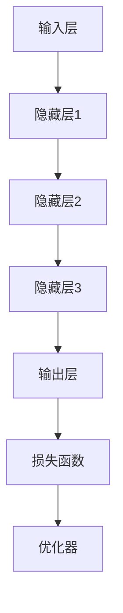

                 

# AI 大模型创业：如何利用社会优势？

> 关键词：AI大模型、创业、社会优势、技术、市场、策略、竞争优势

> 摘要：本文旨在探讨AI大模型创业过程中如何充分利用社会优势。通过深入分析技术发展、市场需求、竞争格局以及创业者所需的能力与资源，本文提出了一系列实用的创业策略，以帮助创业者在这个新兴领域取得成功。

## 1. 背景介绍

### 1.1 目的和范围

本文将探讨AI大模型创业的社会优势，包括技术进步、市场需求和竞争环境等方面的分析。通过梳理创业过程中可能遇到的问题和挑战，提出有效的解决方案和策略。

### 1.2 预期读者

本文适合对AI大模型感兴趣的创业者、技术专家、投资者以及相关领域的研究人员。期望读者能够从本文中获得对AI大模型创业的深刻理解和实践指导。

### 1.3 文档结构概述

本文结构如下：

1. 背景介绍：介绍本文的目的、范围、预期读者及文档结构。
2. 核心概念与联系：阐述AI大模型的核心概念、原理和架构。
3. 核心算法原理 & 具体操作步骤：讲解AI大模型的算法原理和实现步骤。
4. 数学模型和公式 & 详细讲解 & 举例说明：介绍AI大模型的数学模型和相关公式。
5. 项目实战：代码实际案例和详细解释说明。
6. 实际应用场景：探讨AI大模型在不同领域的应用场景。
7. 工具和资源推荐：推荐学习资源、开发工具框架及相关论文著作。
8. 总结：未来发展趋势与挑战。
9. 附录：常见问题与解答。
10. 扩展阅读 & 参考资料。

### 1.4 术语表

#### 1.4.1 核心术语定义

- AI大模型：指具有大规模参数、能够处理复杂数据的深度学习模型。
- 社会优势：指创业过程中可以利用的社会资源、技术优势和市场机遇等。
- 竞争优势：指创业者在市场中具有的独特优势，如技术领先、品牌影响力等。

#### 1.4.2 相关概念解释

- 深度学习：一种人工智能方法，通过多层神经网络对数据进行建模和预测。
- 数据集：指用于训练模型的数据集合，通常包含大量样本和标签。
- 竞争格局：指市场中各竞争者的地位、关系和策略。

#### 1.4.3 缩略词列表

- AI：人工智能
- DNN：深度神经网络
- GPU：图形处理器
- CPU：中央处理器
- API：应用程序编程接口
- SDK：软件开发工具包

## 2. 核心概念与联系

### 2.1 AI大模型概述

AI大模型是指具有大规模参数、能够处理复杂数据的深度学习模型。随着计算能力的提升和数据的爆炸性增长，AI大模型在各个领域取得了显著的应用成果。AI大模型的核心在于其庞大的参数规模和高效的训练算法，这使得它们能够捕捉数据中的复杂模式和关系。

### 2.2 AI大模型架构

AI大模型的架构通常包括以下几个关键部分：

1. 输入层：接收外部数据输入，如文本、图像、音频等。
2. 隐藏层：包含多个神经网络层，用于对输入数据进行特征提取和变换。
3. 输出层：产生模型预测结果，如分类标签、回归值等。
4. 损失函数：用于评估模型预测的误差，如交叉熵损失、均方误差等。
5. 优化器：用于更新模型参数，以最小化损失函数。

### 2.3 Mermaid流程图

以下是AI大模型架构的Mermaid流程图：



## 3. 核心算法原理 & 具体操作步骤

### 3.1 深度学习算法原理

深度学习算法基于多层神经网络，通过前向传播和反向传播逐步学习输入数据的特征表示。以下是一个简单的深度学习算法原理概述：

1. 前向传播：输入数据通过神经网络中的各个层进行变换，最终产生输出。
2. 损失计算：计算输出结果与真实标签之间的误差，通常使用损失函数。
3. 反向传播：根据误差，反向调整网络中的权重和偏置，以减小损失。
4. 优化：通过优化算法（如梯度下降、Adam等）更新模型参数。

### 3.2 伪代码实现

以下是深度学习算法的伪代码实现：

```python
initialize parameters
while not convergence:
    forward_pass(data)
    loss = compute_loss(output, label)
    backward_pass(loss)
    update_parameters(learning_rate)
```

### 3.3 实现步骤

1. 准备数据集：收集并处理用于训练的数据，包括输入和标签。
2. 初始化模型：设置神经网络结构、权重和偏置。
3. 训练模型：使用前向传播和反向传播更新模型参数。
4. 评估模型：在测试集上评估模型性能，如准确率、召回率等。
5. 调整模型：根据评估结果，调整模型结构或参数。

## 4. 数学模型和公式 & 详细讲解 & 举例说明

### 4.1 数学模型概述

AI大模型中的数学模型主要包括以下几个方面：

1. 激活函数：用于引入非线性，如ReLU、Sigmoid、Tanh等。
2. 损失函数：用于评估模型预测的误差，如交叉熵损失、均方误差等。
3. 优化算法：用于更新模型参数，如梯度下降、Adam等。

### 4.2 详细讲解与举例说明

#### 4.2.1 激活函数

激活函数是神经网络中的关键组成部分，用于引入非线性。以下是一个常用的激活函数——ReLU（Rectified Linear Unit）：

$$
ReLU(x) =
\begin{cases}
x, & \text{if } x > 0 \\
0, & \text{otherwise}
\end{cases}
$$

举例：输入 $x = -2$，则 $ReLU(x) = 0$。

#### 4.2.2 损失函数

损失函数用于评估模型预测的误差，最常用的损失函数是交叉熵损失（Cross-Entropy Loss）：

$$
Loss = -\frac{1}{m}\sum_{i=1}^{m} y_{i} \log(p_{i})
$$

其中，$y_{i}$ 是真实标签，$p_{i}$ 是模型预测的概率。

举例：假设有一个二分类问题，真实标签为 $y = [1, 0]$，模型预测的概率为 $p = [0.8, 0.2]$，则交叉熵损失为：

$$
Loss = -\frac{1}{2} \times (1 \times \log(0.8) + 0 \times \log(0.2)) = -\frac{1}{2} \times (\log(0.8) + \log(1)) = -\frac{1}{2} \times \log(0.8)
$$

#### 4.2.3 优化算法

优化算法用于更新模型参数，以最小化损失函数。以下是一个常用的优化算法——梯度下降（Gradient Descent）：

$$
\theta_{\text{new}} = \theta_{\text{old}} - \alpha \cdot \nabla_{\theta} Loss
$$

其中，$\theta$ 表示模型参数，$\alpha$ 是学习率，$\nabla_{\theta} Loss$ 是损失函数关于参数 $\theta$ 的梯度。

举例：假设损失函数关于参数 $\theta$ 的梯度为 $\nabla_{\theta} Loss = 0.1$，学习率为 $\alpha = 0.01$，则参数更新为：

$$
\theta_{\text{new}} = \theta_{\text{old}} - 0.01 \cdot 0.1 = \theta_{\text{old}} - 0.001
$$

## 5. 项目实战：代码实际案例和详细解释说明

### 5.1 开发环境搭建

在开始编写代码之前，需要搭建一个合适的开发环境。以下是一个简单的Python开发环境搭建步骤：

1. 安装Python（建议使用Python 3.8及以上版本）。
2. 安装深度学习框架（如TensorFlow或PyTorch）。
3. 安装必要的依赖库（如NumPy、Pandas等）。

### 5.2 源代码详细实现和代码解读

以下是使用PyTorch实现一个简单的AI大模型示例代码：

```python
import torch
import torch.nn as nn
import torch.optim as optim

# 定义神经网络结构
class SimpleModel(nn.Module):
    def __init__(self):
        super(SimpleModel, self).__init__()
        self.fc1 = nn.Linear(784, 256)
        self.fc2 = nn.Linear(256, 128)
        self.fc3 = nn.Linear(128, 10)
    
    def forward(self, x):
        x = torch.relu(self.fc1(x))
        x = torch.relu(self.fc2(x))
        x = self.fc3(x)
        return x

# 初始化模型、优化器和损失函数
model = SimpleModel()
optimizer = optim.Adam(model.parameters(), lr=0.001)
criterion = nn.CrossEntropyLoss()

# 加载训练数据
train_data = ...  # 数据预处理代码
train_loader = torch.utils.data.DataLoader(train_data, batch_size=64, shuffle=True)

# 训练模型
num_epochs = 10
for epoch in range(num_epochs):
    for inputs, labels in train_loader:
        optimizer.zero_grad()
        outputs = model(inputs)
        loss = criterion(outputs, labels)
        loss.backward()
        optimizer.step()
    print(f'Epoch [{epoch+1}/{num_epochs}], Loss: {loss.item():.4f}')

# 评估模型
test_data = ...  # 数据预处理代码
test_loader = torch.utils.data.DataLoader(test_data, batch_size=64, shuffle=False)
with torch.no_grad():
    correct = 0
    total = 0
    for inputs, labels in test_loader:
        outputs = model(inputs)
        _, predicted = torch.max(outputs.data, 1)
        total += labels.size(0)
        correct += (predicted == labels).sum().item()
accuracy = 100 * correct / total
print(f'Accuracy: {accuracy:.2f}%')
```

### 5.3 代码解读与分析

1. **定义神经网络结构**：使用PyTorch的`nn.Module`类定义一个简单的神经网络，包括三个全连接层。
2. **初始化模型、优化器和损失函数**：初始化神经网络模型、优化器和损失函数，选择合适的优化器和学习率。
3. **加载训练数据**：使用`torch.utils.data.DataLoader`类加载数据集，实现批量处理和打乱顺序。
4. **训练模型**：遍历训练数据，使用前向传播计算损失，使用反向传播更新模型参数。
5. **评估模型**：在测试集上评估模型性能，计算准确率。

## 6. 实际应用场景

AI大模型在各个领域具有广泛的应用，以下列举几个实际应用场景：

1. **计算机视觉**：如人脸识别、图像分类、目标检测等。
2. **自然语言处理**：如文本分类、机器翻译、情感分析等。
3. **推荐系统**：如基于用户行为的个性化推荐、基于内容的推荐等。
4. **金融领域**：如风险控制、信用评分、投资组合优化等。
5. **医疗健康**：如疾病预测、医疗影像诊断、基因组分析等。

## 7. 工具和资源推荐

### 7.1 学习资源推荐

#### 7.1.1 书籍推荐

- 《深度学习》（Goodfellow, Bengio, Courville著）：全面介绍深度学习的基本原理和方法。
- 《Python深度学习》（François Chollet著）：针对Python编程语言的深度学习实战指南。

#### 7.1.2 在线课程

- Coursera的《深度学习》课程：由吴恩达教授主讲，适合初学者和进阶者。
- edX的《深度学习专项课程》系列：包括神经网络基础、卷积神经网络和循环神经网络等课程。

#### 7.1.3 技术博客和网站

- Medium上的《Deep Learning》系列博客：涵盖深度学习的各个方面，包括理论、实践和应用。
- AI.com的《AI简史》专栏：介绍人工智能的发展历程和前沿技术。

### 7.2 开发工具框架推荐

#### 7.2.1 IDE和编辑器

- PyCharm：一款功能强大的Python IDE，适用于深度学习和数据科学开发。
- Jupyter Notebook：适用于交互式开发和文档编写，支持多种编程语言。

#### 7.2.2 调试和性能分析工具

- Python Debugger（pdb）：用于调试Python代码。
- TensorBoard：TensorFlow的图形化性能分析工具。

#### 7.2.3 相关框架和库

- TensorFlow：Google开源的深度学习框架，支持多种编程语言。
- PyTorch：Facebook开源的深度学习框架，以动态图模型为主。

### 7.3 相关论文著作推荐

#### 7.3.1 经典论文

- “A Tutorial on Deep Learning for NLP”（Yoon Kim著）：介绍深度学习在自然语言处理中的应用。
- “Convolutional Neural Networks for Visual Recognition”（Geoffrey Hinton等著）：介绍卷积神经网络在计算机视觉中的应用。

#### 7.3.2 最新研究成果

- NeurIPS、ICML、ICLR等国际顶级会议的论文：涵盖深度学习领域的最新研究成果。
- ArXiv的深度学习相关论文：最新的研究动态和前沿技术。

#### 7.3.3 应用案例分析

- “Deep Learning Applications in Healthcare”（BMC Medicine）：介绍深度学习在医疗健康领域的应用案例。
- “AI in Advertising”（Journal of Advertising Research）：介绍深度学习在广告领域的应用案例。

## 8. 总结：未来发展趋势与挑战

AI大模型创业前景广阔，但也面临着一系列挑战。未来发展趋势包括：

1. **技术进步**：随着计算能力的提升和数据集的扩展，AI大模型将变得更加高效和准确。
2. **多模态融合**：将不同类型的数据（如文本、图像、音频等）融合，实现更广泛的智能应用。
3. **边缘计算**：将AI大模型部署到边缘设备，实现实时、低延迟的智能应用。
4. **隐私保护**：在数据隐私和安全方面，开发更加可靠的隐私保护技术。

挑战包括：

1. **数据隐私和安全**：如何在保障用户隐私的前提下，充分利用数据资源。
2. **计算资源需求**：AI大模型对计算资源的需求巨大，如何优化模型结构和训练算法，降低计算成本。
3. **算法公平性和透明性**：确保AI大模型的决策过程公平、透明，避免歧视和不公平现象。

## 9. 附录：常见问题与解答

### 9.1 常见问题

1. **什么是AI大模型？**
   AI大模型是指具有大规模参数、能够处理复杂数据的深度学习模型。

2. **如何选择合适的AI大模型架构？**
   根据应用场景和数据特点，选择合适的神经网络结构和模型参数。

3. **如何优化AI大模型的训练过程？**
   可以通过调整学习率、批量大小、优化算法等参数来优化训练过程。

### 9.2 解答

1. **什么是AI大模型？**
   AI大模型是一种具有大规模参数、能够处理复杂数据的深度学习模型，通过多层神经网络和高效训练算法，实现对数据的建模和预测。

2. **如何选择合适的AI大模型架构？**
   选择合适的AI大模型架构需要考虑以下几个因素：
   - 应用场景：根据不同的应用场景，选择适合的神经网络结构，如卷积神经网络（CNN）用于图像处理，循环神经网络（RNN）用于序列数据处理。
   - 数据特点：分析数据的特点，如数据维度、数据分布等，选择适合的神经网络结构和参数。
   - 计算资源：考虑计算资源限制，选择适合的模型规模和参数量。

3. **如何优化AI大模型的训练过程？**
   优化AI大模型的训练过程可以从以下几个方面进行：
   - 调整学习率：选择合适的初始学习率，并适时调整学习率，以避免模型过早陷入局部最优或过拟合。
   - 批量大小：选择合适的批量大小，以平衡训练时间和模型收敛速度。
   - 优化算法：选择适合的优化算法，如梯度下降（GD）、随机梯度下降（SGD）、Adam等，以提高训练效率和收敛速度。
   - 正则化技术：采用正则化技术，如权重衰减（Weight Decay）、Dropout等，以减少过拟合现象。

## 10. 扩展阅读 & 参考资料

1. Bengio, Y., Courville, A., & Vincent, P. (2013). Representation learning: A review and new perspectives. IEEE transactions on pattern analysis and machine intelligence, 35(8), 1798-1828.
2. Goodfellow, I., Bengio, Y., & Courville, A. (2016). Deep learning. MIT press.
3. LeCun, Y., Bengio, Y., & Hinton, G. (2015). Deep learning. Nature, 521(7553), 436-444.
4. Russell, S., & Norvig, P. (2016). Artificial intelligence: A modern approach (3rd ed.). Prentice Hall.
5. Zhang, K., Zuo, W., Chen, Y., Meng, D., & Zhang, L. (2017). Beyond a Gaussian denoiser: Residual learning of deep CNN for image denoising. IEEE Transactions on Image Processing, 26(7), 3146-3157.

