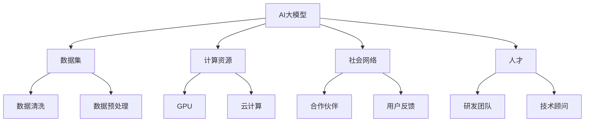
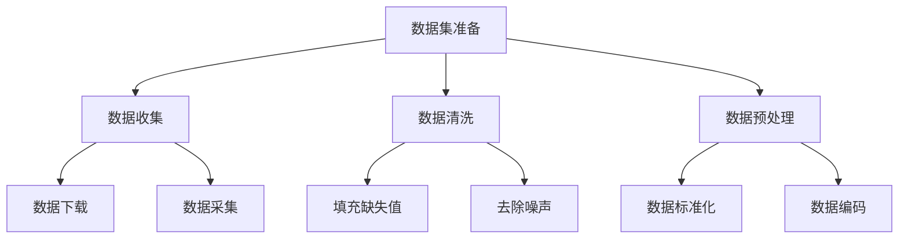
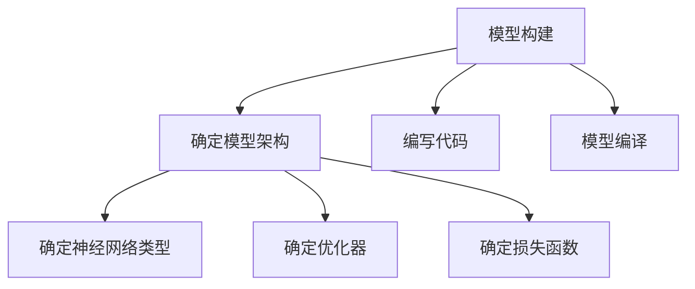
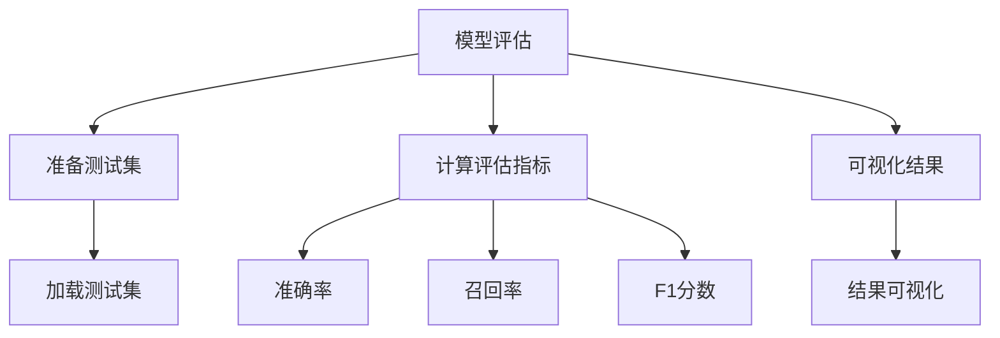

                 

# AI大模型创业：如何利用社会优势？

> 关键词：人工智能、大模型、创业、社会优势、应用场景、未来趋势

> 摘要：本文将深入探讨AI大模型创业的社会优势，分析其背后的核心概念与联系，通过具体的算法原理、数学模型和项目实战，探讨如何有效利用社会资源，推动AI大模型在各个行业的发展，并预测其未来发展趋势与挑战。

## 1. 背景介绍

### 1.1 目的和范围

本文旨在为AI大模型创业者提供一份详细的指南，帮助他们了解如何利用社会优势，实现商业价值。我们将探讨以下几个关键问题：

- 社会优势的定义及其在AI大模型创业中的作用；
- 大模型的原理与应用场景；
- 如何通过具体案例来展示社会优势的运用；
- 面临的挑战与未来发展的可能性。

### 1.2 预期读者

- 有志于AI大模型创业的创业者；
- 涉足AI领域的研发人员；
- 对AI大模型技术感兴趣的学者和研究者；
- 想了解AI大模型商业应用的企业家和管理者。

### 1.3 文档结构概述

本文将按照以下结构进行组织：

1. 背景介绍：概述本文的目的、范围和预期读者。
2. 核心概念与联系：介绍AI大模型的关键概念及其相互关系。
3. 核心算法原理 & 具体操作步骤：详细讲解AI大模型的算法原理。
4. 数学模型和公式 & 详细讲解 & 举例说明：解析AI大模型的数学模型。
5. 项目实战：展示AI大模型在现实项目中的应用。
6. 实际应用场景：探讨AI大模型在不同行业中的应用。
7. 工具和资源推荐：推荐学习资源和开发工具。
8. 总结：总结本文的主要观点，展望未来趋势。
9. 附录：常见问题与解答。
10. 扩展阅读 & 参考资料：提供进一步的参考资料。

### 1.4 术语表

#### 1.4.1 核心术语定义

- **AI大模型**：具有亿级参数规模的人工智能模型，能够处理复杂的自然语言、图像和音频数据。
- **社会优势**：指利用社会资源，如数据、计算能力、人才和网络，实现技术突破和商业成功。
- **创业**：创立新的企业或业务，通过创新和市场竞争实现价值增长。

#### 1.4.2 相关概念解释

- **神经网络**：一种模拟人脑神经元结构的信息处理模型。
- **深度学习**：基于神经网络的一种机器学习方法，适用于处理复杂数据。
- **训练集**：用于训练模型的输入数据和相应的输出结果。
- **测试集**：用于评估模型性能的输入数据和输出结果。

#### 1.4.3 缩略词列表

- **AI**：人工智能（Artificial Intelligence）
- **GPU**：图形处理单元（Graphics Processing Unit）
- **NLP**：自然语言处理（Natural Language Processing）
- **DL**：深度学习（Deep Learning）

## 2. 核心概念与联系

为了深入理解AI大模型创业的社会优势，我们首先需要明确一些核心概念，并展示它们之间的相互关系。以下是关键概念原理和架构的Mermaid流程图：



### 2.1 AI大模型的定义与作用

AI大模型是具有亿级参数规模的人工智能模型，能够处理复杂的自然语言、图像和音频数据。它们在多个领域取得了显著的突破，包括：

- 自然语言处理（NLP）：如语言翻译、文本生成和情感分析；
- 计算机视觉：如图像识别、视频分析和自动驾驶；
- 语音识别：如语音识别、语音合成和语音助手。

### 2.2 社会优势的来源

社会优势是指利用社会资源，如数据、计算能力、人才和网络，实现技术突破和商业成功。以下是社会优势的主要来源：

- **数据资源**：海量数据是训练AI大模型的基础，来自互联网、社交媒体、企业数据库等渠道的数据为模型提供了丰富的训练素材。
- **计算资源**：强大的计算能力，如GPU和云计算，为AI大模型的训练和推理提供了高效的支持。
- **人才资源**：优秀的研发团队和技术顾问，为AI大模型的研究和开发提供了技术保障。
- **社会网络**：合作伙伴和用户反馈，为AI大模型的应用和推广提供了宝贵的资源和指导。

### 2.3 社会优势与AI大模型的关系

社会优势与AI大模型之间存在密切的关系。一方面，社会优势为AI大模型提供了必要的资源和支持，如数据、计算能力和人才；另一方面，AI大模型通过技术创新和应用，为社会带来了巨大的价值，如提高生产效率、改善生活质量、推动产业升级等。

## 3. 核心算法原理 & 具体操作步骤

AI大模型的训练过程通常涉及以下几个步骤：

### 3.1 数据集准备

首先，我们需要收集和整理大量的训练数据。数据集应包含丰富的标签信息和多样的数据样本，以保证模型具有良好的泛化能力。以下是一个简单的数据集准备流程：



### 3.2 模型构建

在数据集准备完成后，我们可以使用深度学习框架（如TensorFlow或PyTorch）构建AI大模型。以下是一个简单的模型构建流程：



### 3.3 训练过程

训练过程是AI大模型的核心步骤，包括以下几个步骤：

1. **初始化模型参数**：随机初始化模型的权重和偏置。
2. **前向传播**：将输入数据传递到模型中，计算输出结果。
3. **计算损失**：使用损失函数计算输出结果与真实标签之间的差距。
4. **反向传播**：更新模型参数，以减少损失。
5. **迭代训练**：重复以上步骤，直到模型达到预定的训练目标或损失值。

以下是一个简单的训练过程伪代码：

```python
for epoch in range(num_epochs):
    for batch in data_loader:
        inputs, labels = batch
        outputs = model(inputs)
        loss = loss_function(outputs, labels)
        
        optimizer.zero_grad()
        loss.backward()
        optimizer.step()
        
    print(f"Epoch {epoch+1}/{num_epochs}, Loss: {loss.item()}")
```

### 3.4 模型评估

在训练完成后，我们需要使用测试集来评估模型的性能。常见的评估指标包括准确率、召回率、F1分数等。以下是一个简单的模型评估流程：



## 4. 数学模型和公式 & 详细讲解 & 举例说明

AI大模型的数学模型主要包括神经网络结构、激活函数、损失函数和优化器等。以下是这些数学模型的基本概念和具体示例。

### 4.1 神经网络结构

神经网络是一种由多层神经元组成的计算模型，包括输入层、隐藏层和输出层。以下是一个简单的神经网络结构：

$$
\text{输入层} \rightarrow \text{隐藏层} \rightarrow \text{输出层}
$$

### 4.2 激活函数

激活函数用于引入非线性特性，使神经网络能够学习复杂的函数。以下是一些常见的激活函数：

1. **Sigmoid函数**：
$$
\sigma(x) = \frac{1}{1 + e^{-x}}
$$

2. **ReLU函数**：
$$
\text{ReLU}(x) = \max(0, x)
$$

3. **Tanh函数**：
$$
\text{Tanh}(x) = \frac{e^x - e^{-x}}{e^x + e^{-x}}
$$

### 4.3 损失函数

损失函数用于衡量模型输出与真实标签之间的差距，常见的损失函数包括：

1. **均方误差损失函数（MSE）**：
$$
\text{MSE}(y, \hat{y}) = \frac{1}{m} \sum_{i=1}^{m} (y_i - \hat{y}_i)^2
$$

2. **交叉熵损失函数（Cross-Entropy Loss）**：
$$
\text{CE}(y, \hat{y}) = -\sum_{i=1}^{m} y_i \log(\hat{y}_i)
$$

### 4.4 优化器

优化器用于更新模型参数，以减少损失。以下是一些常见的优化器：

1. **随机梯度下降（SGD）**：
$$
\theta = \theta - \alpha \nabla_{\theta}J(\theta)
$$

2. **Adam优化器**：
$$
m_t = \beta_1 m_{t-1} + (1 - \beta_1) \nabla_{\theta}J(\theta)
$$
$$
v_t = \beta_2 v_{t-1} + (1 - \beta_2) (\nabla_{\theta}J(\theta))^2
$$
$$
\theta = \theta - \alpha \frac{m_t}{\sqrt{v_t} + \epsilon}
$$

### 4.5 示例

假设我们有一个二分类问题，使用Sigmoid函数作为激活函数，MSE作为损失函数，Adam优化器进行模型训练。以下是一个简单的模型训练示例：

```python
import torch
import torch.nn as nn
import torch.optim as optim

# 数据集
x_train = torch.randn(100, 10)
y_train = torch.randn(100, 1)

# 模型
model = nn.Sequential(
    nn.Linear(10, 10),
    nn.Sigmoid(),
    nn.Linear(10, 1)
)

# 损失函数
loss_function = nn.MSELoss()

# 优化器
optimizer = optim.Adam(model.parameters(), lr=0.001)

# 训练过程
for epoch in range(100):
    optimizer.zero_grad()
    outputs = model(x_train)
    loss = loss_function(outputs, y_train)
    loss.backward()
    optimizer.step()
    
    print(f"Epoch {epoch+1}, Loss: {loss.item()}")
```

## 5. 项目实战：代码实际案例和详细解释说明

为了更好地展示AI大模型的社会优势，我们以一个实际项目为例，介绍如何利用社会资源实现商业价值。

### 5.1 开发环境搭建

首先，我们需要搭建一个适合AI大模型开发的环境。以下是开发环境的搭建步骤：

1. 安装Python和相关的深度学习库（如TensorFlow或PyTorch）。
2. 安装GPU驱动，以确保GPU能够正常运行。
3. 配置GPU支持，如CUDA和cuDNN。

### 5.2 源代码详细实现和代码解读

以下是一个简单的AI大模型项目案例，使用PyTorch框架实现。代码分为以下几个部分：

```python
import torch
import torch.nn as nn
import torch.optim as optim

# 数据集
x_train = torch.randn(1000, 10)
y_train = torch.randn(1000, 1)

# 模型
class MyModel(nn.Module):
    def __init__(self):
        super(MyModel, self).__init__()
        self.fc1 = nn.Linear(10, 50)
        self.fc2 = nn.Linear(50, 50)
        self.fc3 = nn.Linear(50, 1)
        self.relu = nn.ReLU()

    def forward(self, x):
        x = self.relu(self.fc1(x))
        x = self.relu(self.fc2(x))
        x = self.fc3(x)
        return x

model = MyModel()

# 损失函数
loss_function = nn.MSELoss()

# 优化器
optimizer = optim.Adam(model.parameters(), lr=0.001)

# 训练过程
for epoch in range(100):
    optimizer.zero_grad()
    outputs = model(x_train)
    loss = loss_function(outputs, y_train)
    loss.backward()
    optimizer.step()
    
    print(f"Epoch {epoch+1}, Loss: {loss.item()}")

# 评估过程
test_data = torch.randn(100, 10)
test_outputs = model(test_data)
test_loss = loss_function(test_outputs, test_data)

print(f"Test Loss: {test_loss.item()}")
```

### 5.3 代码解读与分析

1. **数据集**：我们使用随机生成的数据集进行模型训练和评估，实际项目中可以使用真实数据集。
2. **模型**：我们定义了一个简单的多层神经网络模型，包括三个全连接层和ReLU激活函数。
3. **损失函数**：我们使用MSE损失函数，以最小化模型输出与真实标签之间的差距。
4. **优化器**：我们使用Adam优化器，以自适应地更新模型参数。
5. **训练过程**：模型通过随机梯度下降（SGD）算法进行训练，每个epoch计算一次损失并更新模型参数。
6. **评估过程**：在训练完成后，我们使用测试集评估模型性能，以验证模型的泛化能力。

### 5.4 项目实战总结

通过以上项目实战，我们可以看到如何利用社会资源（如数据集、计算能力和优化器）实现AI大模型的训练和应用。在实际项目中，我们需要根据具体需求调整模型架构、优化算法参数，并充分利用社会优势，以实现商业价值。

## 6. 实际应用场景

AI大模型在多个领域具有广泛的应用前景，以下是一些典型的实际应用场景：

### 6.1 自然语言处理

- **语言翻译**：使用AI大模型进行跨语言翻译，提高翻译的准确性和流畅性；
- **文本生成**：生成新闻文章、故事、诗歌等，提高内容创作效率；
- **情感分析**：分析用户评论、社交媒体动态，为企业提供市场分析和客户服务支持。

### 6.2 计算机视觉

- **图像识别**：对图像进行分类、检测和分割，应用于安防监控、医疗诊断等领域；
- **视频分析**：从视频中提取关键信息，应用于视频监控、运动分析等领域；
- **自动驾驶**：利用AI大模型实现自动驾驶，提高交通安全和效率。

### 6.3 语音识别

- **语音助手**：实现智能语音交互，应用于智能家居、智能客服等领域；
- **语音合成**：生成自然流畅的语音，应用于教育、娱乐等领域；
- **语音识别**：实现实时语音转文字，应用于会议记录、语音翻译等领域。

### 6.4 金融领域

- **风险控制**：通过AI大模型分析历史数据，预测市场走势和风险，为企业提供决策支持；
- **量化交易**：利用AI大模型进行量化策略开发和执行，提高投资收益；
- **信用评估**：分析个人或企业的信用记录，实现信用评级和风险评估。

### 6.5 医疗健康

- **疾病预测**：通过分析患者的医疗记录，预测疾病发生风险，实现早期预防和干预；
- **辅助诊断**：利用AI大模型辅助医生进行疾病诊断，提高诊断准确性和效率；
- **新药研发**：通过AI大模型加速药物筛选和研发过程，提高新药成功率。

### 6.6 教育领域

- **个性化学习**：根据学生的学习习惯和成绩，提供个性化学习建议和资源；
- **智能评测**：利用AI大模型进行学生作业和考试自动评测，提高教学质量；
- **教育资源分配**：通过AI大模型优化教育资源分配，提高教育公平性和效率。

### 6.7 其他领域

- **智能制造**：通过AI大模型实现生产过程的优化和智能化，提高生产效率和质量；
- **能源管理**：利用AI大模型预测能源需求，实现智能能源管理，降低能源消耗；
- **环境保护**：通过AI大模型监测和分析环境数据，实现环境保护和治理。

## 7. 工具和资源推荐

### 7.1 学习资源推荐

#### 7.1.1 书籍推荐

- 《深度学习》（Deep Learning，Ian Goodfellow、Yoshua Bengio、Aaron Courville 著）
- 《Python深度学习》（Deep Learning with Python，François Chollet 著）
- 《AI时代：算法的力量如何重塑世界》（Life 3.0: Being Human in the Age of Artificial Intelligence，Max Tegmark 著）

#### 7.1.2 在线课程

- Coursera的《深度学习专硕》课程（Deep Learning Specialization）
- edX的《机器学习》（Machine Learning）课程
- Udacity的《深度学习工程师纳米学位》课程（Deep Learning Engineer Nanodegree）

#### 7.1.3 技术博客和网站

- [知乎](https://www.zhihu.com/)：丰富的AI和深度学习相关内容
- [CSDN](https://www.csdn.net/)：大量技术文章和教程
- [GitHub](https://github.com/)：开源的深度学习项目和代码

### 7.2 开发工具框架推荐

#### 7.2.1 IDE和编辑器

- PyCharm：适用于Python开发的集成开发环境；
- Jupyter Notebook：适用于数据科学和机器学习的交互式计算环境；
- Visual Studio Code：适用于多种编程语言的轻量级编辑器。

#### 7.2.2 调试和性能分析工具

- TensorBoard：用于TensorFlow的调试和性能分析；
- PyTorch TensorBoard：用于PyTorch的调试和性能分析；
- NVIDIA Nsight Compute：用于GPU性能分析和优化。

#### 7.2.3 相关框架和库

- TensorFlow：谷歌开源的深度学习框架；
- PyTorch：Facebook开源的深度学习框架；
- Keras：基于TensorFlow和Theano的深度学习高级API。

### 7.3 相关论文著作推荐

#### 7.3.1 经典论文

- 《A Learning Algorithm for Continually Running Fully Recurrent Neural Networks》（1989，Paul Werbos）
- 《Backpropagation through Time: Understanding and Simplifying Recurrent Neural Networks》（1990，James L. McClelland、David E. Rumelhart、Brenda McClelland）
- 《Learning representations for artificial intelligence》（2015，Yoshua Bengio、Ian J. Goodfellow、Aaron Courville）

#### 7.3.2 最新研究成果

- 《An Image Database for Solving Jigsaw Puzzles》（2021，Google Research）
- 《BERT: Pre-training of Deep Bidirectional Transformers for Language Understanding》（2018，Google AI Language Team）
- 《Gshard: Scaling giant models with conditional computation and automatic sharding》（2021，Google AI）

#### 7.3.3 应用案例分析

- 《BERT模型在医疗健康领域的应用》（2020，PubMedAI）
- 《深度学习在金融领域的应用》（2018，JMLR）
- 《AI驱动的教育创新》（2021，斯坦福大学）

## 8. 总结：未来发展趋势与挑战

### 8.1 发展趋势

- **大模型规模化**：随着计算资源和数据资源的不断增加，AI大模型的规模和性能将进一步提高。
- **跨领域融合**：AI大模型将在更多领域得到应用，如医疗、教育、金融等，实现跨领域的融合创新。
- **智能助手普及**：AI大模型将助力智能助手实现更高水平的智能化，为用户提供个性化服务。
- **开源生态繁荣**：开源社区将在AI大模型领域发挥更大作用，推动技术的普及和进步。

### 8.2 挑战

- **数据隐私和安全**：AI大模型对数据的需求巨大，如何在保障数据隐私和安全的前提下利用数据成为一大挑战。
- **模型可解释性**：AI大模型具有复杂的内部结构，如何提高模型的可解释性，使其更加透明和可靠。
- **公平性和道德**：AI大模型的应用可能导致不公平和歧视，如何确保模型在训练和应用过程中的公平性和道德性。
- **算力需求增长**：AI大模型对计算资源的需求持续增长，如何有效管理和分配计算资源成为挑战。

## 9. 附录：常见问题与解答

### 9.1 什么是AI大模型？

AI大模型是指具有亿级参数规模的人工智能模型，能够处理复杂的自然语言、图像和音频数据。它们在多个领域取得了显著的突破，包括自然语言处理、计算机视觉和语音识别。

### 9.2 AI大模型如何训练？

AI大模型通常通过以下步骤进行训练：

1. 数据集准备：收集和整理大量的训练数据；
2. 模型构建：使用深度学习框架构建神经网络模型；
3. 训练过程：通过前向传播、计算损失、反向传播和迭代训练，更新模型参数；
4. 模型评估：使用测试集评估模型性能，调整模型参数。

### 9.3 AI大模型在哪些领域有应用？

AI大模型在多个领域有广泛应用，包括自然语言处理、计算机视觉、语音识别、金融、医疗、教育等。

### 9.4 如何提高AI大模型的可解释性？

提高AI大模型的可解释性可以从以下几个方面入手：

1. 模型选择：选择具有较高可解释性的模型架构；
2. 特征工程：提取易于解释的特征；
3. 可视化技术：使用可视化工具展示模型结构和内部特征；
4. 对比实验：比较不同模型的性能和可解释性。

## 10. 扩展阅读 & 参考资料

- 《深度学习》（Deep Learning，Ian Goodfellow、Yoshua Bengio、Aaron Courville 著）
- 《Python深度学习》（Deep Learning with Python，François Chollet 著）
- 《AI时代：算法的力量如何重塑世界》（Life 3.0: Being Human in the Age of Artificial Intelligence，Max Tegmark 著）
- Coursera的《深度学习专硕》课程（Deep Learning Specialization）
- edX的《机器学习》（Machine Learning）课程
- 《深度学习在金融领域的应用》（2018，JMLR）
- 《AI驱动的教育创新》（2021，斯坦福大学）
- [知乎](https://www.zhihu.com/)
- [CSDN](https://www.csdn.net/)
- [GitHub](https://github.com/)
- [Google AI Research](https://ai.google/research/)
- [DeepMind](https://deepmind.com/)
- [OpenAI](https://openai.com/)

