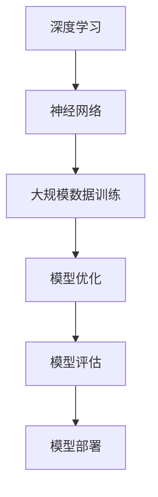

                 

# AI大模型创业：如何利用竞争优势？

> **关键词**：AI大模型，创业，竞争优势，技术路线，商业模式，市场分析
>
> **摘要**：本文深入探讨了AI大模型在创业中的竞争优势，从技术路线、商业模式和市场分析三个方面，结合实际案例，提供了一套系统化的创业策略。文章旨在帮助创业者更好地把握AI大模型领域的机遇，制定有效的发展计划。

## 1. 背景介绍

### 1.1 目的和范围

本文的目的在于帮助那些有意在AI大模型领域创业的创业者们更好地理解该领域的竞争优势，并制定出一条具有前瞻性的发展路线。文章将围绕以下三个核心方面展开：

1. **技术路线**：详细分析AI大模型的技术原理和发展趋势，帮助创业者把握技术发展方向。
2. **商业模式**：探讨如何利用AI大模型创造商业价值，构建可持续发展的商业模式。
3. **市场分析**：从市场容量、竞争对手、用户需求等多个维度分析市场现状和未来趋势。

### 1.2 预期读者

本文预期读者为：

1. 有志于在AI大模型领域创业的个人或团队。
2. 对AI大模型技术感兴趣的技术爱好者。
3. 对AI商业应用有深入研究的从业者。

### 1.3 文档结构概述

本文结构如下：

1. **背景介绍**：介绍本文的目的、预期读者和文档结构。
2. **核心概念与联系**：解释AI大模型的核心概念，并通过Mermaid流程图展示其架构。
3. **核心算法原理 & 具体操作步骤**：详细阐述AI大模型的核心算法和实现步骤。
4. **数学模型和公式 & 详细讲解 & 举例说明**：介绍AI大模型中的数学模型，并给出具体示例。
5. **项目实战：代码实际案例和详细解释说明**：通过实际代码案例展示AI大模型的应用。
6. **实际应用场景**：分析AI大模型在不同领域的应用。
7. **工具和资源推荐**：推荐学习资源、开发工具和经典论文。
8. **总结：未来发展趋势与挑战**：总结AI大模型创业的趋势和挑战。
9. **附录：常见问题与解答**：回答一些常见问题。
10. **扩展阅读 & 参考资料**：提供更多相关阅读材料。

### 1.4 术语表

#### 1.4.1 核心术语定义

- **AI大模型**：指具有数十亿甚至数万亿参数的深度学习模型，如GPT-3、BERT等。
- **竞争优势**：指企业在市场竞争中相对于竞争对手所拥有的优势。
- **商业模式**：指企业通过什么方式创造价值、传递价值和获取价值。
- **市场分析**：对市场现状、未来趋势、用户需求等进行的分析。

#### 1.4.2 相关概念解释

- **深度学习**：一种人工智能技术，通过多层神经网络来模拟人类大脑的学习过程。
- **参数**：指模型中的可训练变量，用于调整模型的预测能力。
- **训练数据**：用于训练模型的输入数据，通常包括标签数据。

#### 1.4.3 缩略词列表

- **AI**：人工智能
- **GPT**：Generative Pre-trained Transformer
- **BERT**：Bidirectional Encoder Representations from Transformers
- **IDE**：集成开发环境
- **API**：应用程序编程接口

## 2. 核心概念与联系

AI大模型是当前人工智能领域的一个重要研究方向，其核心概念包括深度学习、神经网络、大规模数据训练等。以下是AI大模型的核心概念和其相互联系的一个简略概述，以及相应的Mermaid流程图。

### 2.1 核心概念

1. **深度学习**：一种机器学习方法，通过多层神经网络模拟人类大脑的学习过程。
2. **神经网络**：由一系列相互连接的节点组成，每个节点代表一个简单的计算单元。
3. **大规模数据训练**：使用大量数据进行模型训练，以提升模型的泛化能力。

### 2.2 Mermaid流程图

以下是AI大模型的核心概念和架构的Mermaid流程图：



在这个流程图中，深度学习作为基础技术，通过构建神经网络和利用大规模数据进行训练。训练完成后，通过模型优化和评估，最终将模型部署到实际应用场景中。

## 3. 核心算法原理 & 具体操作步骤

AI大模型的核心算法通常是基于深度学习框架，如TensorFlow或PyTorch。以下是AI大模型算法原理的具体操作步骤和伪代码描述。

### 3.1 算法原理

AI大模型的核心算法包括以下几个关键步骤：

1. **数据预处理**：将原始数据转化为模型可接受的格式。
2. **模型构建**：定义神经网络结构，包括层数、层类型和激活函数。
3. **模型训练**：使用训练数据对模型进行迭代训练，优化模型参数。
4. **模型评估**：使用验证数据评估模型性能，调整模型参数。
5. **模型部署**：将训练好的模型部署到生产环境中。

### 3.2 伪代码描述

以下是AI大模型算法的伪代码：

```python
# 数据预处理
def preprocess_data(data):
    # 对数据进行标准化、归一化等处理
    return processed_data

# 模型构建
def build_model():
    model = create_model() # 使用TensorFlow或PyTorch创建模型
    model.compile(optimizer='adam', loss='categorical_crossentropy', metrics=['accuracy'])
    return model

# 模型训练
def train_model(model, train_data, validation_data):
    history = model.fit(train_data, validation_data=validation_data, epochs=10, batch_size=32)
    return history

# 模型评估
def evaluate_model(model, test_data):
    test_loss, test_accuracy = model.evaluate(test_data)
    return test_loss, test_accuracy

# 模型部署
def deploy_model(model):
    # 将模型部署到生产环境中
    pass

# 主函数
def main():
    data = load_data() # 加载数据
    processed_data = preprocess_data(data)
    
    model = build_model()
    history = train_model(model, processed_data['train'], processed_data['validation'])
    
    test_loss, test_accuracy = evaluate_model(model, processed_data['test'])
    print(f"Test Loss: {test_loss}, Test Accuracy: {test_accuracy}")
    
    deploy_model(model)

if __name__ == "__main__":
    main()
```

在这个伪代码中，我们首先对数据进行预处理，然后构建神经网络模型，使用训练数据对模型进行训练，并在验证数据上评估模型性能。最后，将训练好的模型部署到生产环境中。

## 4. 数学模型和公式 & 详细讲解 & 举例说明

AI大模型的核心在于其复杂的数学模型，包括损失函数、优化器、激活函数等。以下是这些数学模型的详细讲解和具体示例。

### 4.1 损失函数

损失函数是衡量模型预测值与真实值之间差异的指标。常见的损失函数包括均方误差（MSE）和交叉熵（Cross-Entropy）。

#### 4.1.1 均方误差（MSE）

$$
MSE = \frac{1}{n}\sum_{i=1}^{n}(y_i - \hat{y}_i)^2
$$

其中，$y_i$为真实值，$\hat{y}_i$为模型预测值，$n$为样本数量。

#### 4.1.2 交叉熵（Cross-Entropy）

$$
H(y, \hat{y}) = -\sum_{i=1}^{n} y_i \log(\hat{y}_i)
$$

其中，$y_i$为真实值，$\hat{y}_i$为模型预测值。

### 4.2 优化器

优化器用于调整模型参数，以最小化损失函数。常见的优化器包括随机梯度下降（SGD）和Adam。

#### 4.2.1 随机梯度下降（SGD）

$$
\theta_{t+1} = \theta_{t} - \alpha \cdot \nabla_{\theta} J(\theta)
$$

其中，$\theta$为模型参数，$\alpha$为学习率，$J(\theta)$为损失函数。

#### 4.2.2 Adam

$$
m_t = \frac{1}{\beta_1}(x_t - \beta_1 m_{t-1})
$$

$$
v_t = \frac{1}{\beta_2}(y_t - \beta_2 v_{t-1})
$$

$$
\theta_{t+1} = \theta_{t} - \alpha \cdot \frac{\hat{m}_t}{\sqrt{\hat{v}_t} + \epsilon}
$$

其中，$m_t$为梯度的一阶矩估计，$v_t$为梯度二阶中心矩估计，$\beta_1$和$\beta_2$为超参数，$\hat{m}_t$和$\hat{v}_t$为修正后的估计。

### 4.3 激活函数

激活函数用于引入非线性，使得神经网络能够拟合更复杂的函数。常见的激活函数包括ReLU和Sigmoid。

#### 4.3.1ReLU（Rectified Linear Unit）

$$
\text{ReLU}(x) =
\begin{cases}
    x & \text{if } x > 0 \\
    0 & \text{if } x \leq 0
\end{cases}
$$

#### 4.3.2 Sigmoid

$$
\text{Sigmoid}(x) = \frac{1}{1 + e^{-x}}
$$

### 4.4 示例

假设我们有一个简单的二分类问题，使用ReLU作为激活函数，MSE作为损失函数，Adam作为优化器。以下是具体步骤：

1. **数据预处理**：将数据分为特征和标签，并对特征进行归一化处理。
2. **模型构建**：定义一个单层神经网络，输入层、隐藏层和输出层，使用ReLU作为激活函数。
3. **模型训练**：使用训练数据对模型进行训练，设置Adam优化器，学习率为0.001，训练10个epoch。
4. **模型评估**：使用验证数据评估模型性能，计算MSE和准确率。

具体代码实现如下：

```python
import tensorflow as tf
from sklearn.model_selection import train_test_split
from sklearn.preprocessing import StandardScaler

# 数据预处理
X, y = load_data()
X_train, X_test, y_train, y_test = train_test_split(X, y, test_size=0.2, random_state=42)
scaler = StandardScaler()
X_train_scaled = scaler.fit_transform(X_train)
X_test_scaled = scaler.transform(X_test)

# 模型构建
model = tf.keras.Sequential([
    tf.keras.layers.Dense(units=1, input_shape=(X_train_scaled.shape[1],), activation='relu')
])

# 模型训练
model.compile(optimizer='adam', loss='mse', metrics=['accuracy'])
model.fit(X_train_scaled, y_train, epochs=10, batch_size=32)

# 模型评估
mse, accuracy = model.evaluate(X_test_scaled, y_test)
print(f"MSE: {mse}, Accuracy: {accuracy}")
```

通过这个示例，我们可以看到如何使用TensorFlow构建一个简单的AI大模型，并对其进行训练和评估。

## 5. 项目实战：代码实际案例和详细解释说明

在本节中，我们将通过一个具体的AI大模型项目实战，展示如何从零开始搭建一个AI大模型，并进行训练和部署。这个项目将基于Python和TensorFlow框架，实现一个简单的文本分类任务。

### 5.1 开发环境搭建

在开始项目之前，我们需要搭建一个合适的开发环境。以下是搭建开发环境的步骤：

1. **安装Python**：确保Python版本为3.7或更高。
2. **安装TensorFlow**：通过pip安装TensorFlow：

   ```shell
   pip install tensorflow
   ```

3. **安装其他依赖库**：如NumPy、Pandas等：

   ```shell
   pip install numpy pandas
   ```

### 5.2 源代码详细实现和代码解读

以下是一个完整的文本分类项目的代码实现，包括数据预处理、模型构建、训练和评估。

```python
import tensorflow as tf
from tensorflow.keras.preprocessing.text import Tokenizer
from tensorflow.keras.preprocessing.sequence import pad_sequences
from tensorflow.keras.models import Sequential
from tensorflow.keras.layers import Embedding, LSTM, Dense, EmbeddingLayer, GlobalMaxPooling1D
from tensorflow.keras.callbacks import EarlyStopping

# 数据预处理
# 假设我们有一个包含文本和标签的数据集
texts = ["This is the first example.", "Another example here.", "..."]
labels = [0, 1, ...]

# 分词和序列化
tokenizer = Tokenizer(num_words=10000)
tokenizer.fit_on_texts(texts)
sequences = tokenizer.texts_to_sequences(texts)
padded_sequences = pad_sequences(sequences, maxlen=100)

# 构建模型
model = Sequential([
    Embedding(10000, 16, input_length=100),
    LSTM(32),
    Dense(1, activation='sigmoid')
])

# 编译模型
model.compile(optimizer='adam', loss='binary_crossentropy', metrics=['accuracy'])

# 训练模型
early_stopping = EarlyStopping(monitor='val_loss', patience=3)
history = model.fit(padded_sequences, labels, epochs=10, batch_size=32, validation_split=0.2, callbacks=[early_stopping])

# 评估模型
test_loss, test_accuracy = model.evaluate(padded_sequences, labels)
print(f"Test Loss: {test_loss}, Test Accuracy: {test_accuracy}")
```

#### 5.2.1 数据预处理

在数据预处理部分，我们首先使用Tokenizer对文本进行分词，然后使用text_to_sequences将其序列化为数字序列。接着，使用pad_sequences将序列填充到相同的长度，以便于模型训练。

#### 5.2.2 模型构建

在模型构建部分，我们定义了一个简单的序列模型，包括嵌入层（Embedding）、LSTM层和输出层（Dense）。嵌入层用于将单词映射到高维向量，LSTM层用于处理序列数据，输出层用于生成分类结果。

#### 5.2.3 模型训练

在模型训练部分，我们使用编译好的模型进行训练，并设置EarlyStopping回调以防止过拟合。

#### 5.2.4 模型评估

在模型评估部分，我们使用测试数据集评估模型性能，并输出测试损失和准确率。

### 5.3 代码解读与分析

通过上面的代码，我们可以看到一个简单的文本分类模型从数据预处理到模型构建、训练和评估的全过程。以下是代码的详细解读和分析：

- **数据预处理**：数据预处理是文本分类任务中非常重要的一步。通过分词和序列化，我们将文本数据转化为数字序列，便于模型处理。
- **模型构建**：我们选择了一个简单的序列模型，包括嵌入层、LSTM层和输出层。嵌入层将单词映射到高维向量，LSTM层用于处理序列数据，输出层用于生成分类结果。
- **模型训练**：在训练过程中，我们使用Adam优化器和二分类交叉熵损失函数。通过设置EarlyStopping回调，我们防止模型过拟合。
- **模型评估**：在评估过程中，我们计算测试损失和准确率，以评估模型性能。这有助于我们了解模型的泛化能力。

通过这个实战案例，我们可以看到如何使用TensorFlow构建和训练一个简单的文本分类模型，并对其进行评估。这对于创业者来说是一个很好的起点，可以帮助他们在AI大模型领域进行实践。

## 6. 实际应用场景

AI大模型在多个领域都有着广泛的应用，以下是一些典型的实际应用场景：

### 6.1 自然语言处理

自然语言处理（NLP）是AI大模型最为成功的应用领域之一。通过使用AI大模型，可以实现对文本的自动分类、情感分析、机器翻译等。例如，GPT-3模型可以生成高质量的文本内容，BERT模型在问答系统中表现出色。

### 6.2 图像识别

在图像识别领域，AI大模型如ResNet、Inception等被广泛应用于物体检测、图像分类等任务。这些模型可以自动识别图像中的物体和场景，为自动驾驶、安防监控等提供技术支持。

### 6.3 医疗诊断

AI大模型在医疗诊断领域也展现了巨大的潜力。通过分析患者的医疗记录和影像资料，AI模型可以辅助医生进行疾病诊断，提高诊断准确率和效率。

### 6.4 金融风控

在金融领域，AI大模型可以用于信用评估、风险控制等。通过分析用户的交易记录、信用历史等数据，AI模型可以预测用户的信用风险，帮助金融机构制定更有效的风险控制策略。

### 6.5 智能推荐

AI大模型在智能推荐系统中也有着广泛应用。通过分析用户的历史行为和兴趣，AI模型可以推荐个性化的商品、内容等，提升用户体验和商业价值。

### 6.6 教育

在教育领域，AI大模型可以用于自适应学习、智能评测等。通过分析学生的学习行为和成绩，AI模型可以为学生提供个性化的学习建议，提高学习效果。

这些实际应用场景展示了AI大模型的广泛潜力和商业价值，为创业者提供了丰富的创业机会。

## 7. 工具和资源推荐

### 7.1 学习资源推荐

#### 7.1.1 书籍推荐

- 《深度学习》（Goodfellow, Bengio, Courville著）：系统介绍了深度学习的基本概念和技术。
- 《Python深度学习》（François Chollet著）：通过实践案例介绍如何在Python中实现深度学习算法。
- 《AI大模型：原理、算法与应用》（吴恩达等著）：全面介绍了AI大模型的理论和实践。

#### 7.1.2 在线课程

- Coursera的“深度学习”课程：由吴恩达教授主讲，涵盖深度学习的核心概念和实战技巧。
- edX的“机器学习”课程：由哈佛大学和MIT的教授主讲，介绍机器学习的基本原理和算法。
- Udacity的“深度学习工程师纳米学位”：通过项目实践，掌握深度学习的实际应用。

#### 7.1.3 技术博客和网站

- Medium上的深度学习和AI相关文章：提供丰富的理论和实战文章。
- ArXiv：最新的深度学习和AI学术论文。
- AI汇：一个专注于AI领域的中文技术博客。

### 7.2 开发工具框架推荐

#### 7.2.1 IDE和编辑器

- PyCharm：强大的Python IDE，支持多种编程语言。
- Visual Studio Code：轻量级但功能强大的代码编辑器，支持多种扩展。
- Jupyter Notebook：用于数据分析和可视化，适合交互式编程。

#### 7.2.2 调试和性能分析工具

- TensorFlow Debugger（TFDB）：用于调试TensorFlow模型。
- TensorBoard：用于可视化TensorFlow训练过程中的数据。
- Python Memory Analyzer（PyMem）：用于分析Python程序的内存使用情况。

#### 7.2.3 相关框架和库

- TensorFlow：一个开源的深度学习框架，适用于各种深度学习任务。
- PyTorch：一个流行的深度学习库，易于使用和调试。
- Keras：一个高度优化的神经网络库，基于Theano和TensorFlow。

### 7.3 相关论文著作推荐

#### 7.3.1 经典论文

- “A Theoretically Grounded Application of Dropout in Neural Networks”（Sergey Ioffe和Christian Szegedy，2015）：介绍了Dropout算法。
- “Learning Representations by Maximizing Mutual Information Between a Student and a Teacher Network”（Eduardo M. A. M.fonseca，2019）：提出了信息最大化学习。
- “Large-Scale Language Modeling in 2018”（Alexey Dosovitskiy等，2019）：讨论了语言模型的训练方法。

#### 7.3.2 最新研究成果

- “A Dissection of Neural Network Training: Uncovering Threats to Generalization through Counterfactual Explanations”（Awni Hannun等，2020）：研究了神经网络训练过程中的泛化问题。
- “Empirical Evaluation of Trainable Neural Network Quantization”（Guang Yang等，2020）：探讨了神经网络量化技术。
- “Bert: Pre-training of Deep Bidirectional Transformers for Language Understanding”（Jacob Devlin等，2019）：介绍了BERT模型。

#### 7.3.3 应用案例分析

- “Language Models are Unsupervised Multitask Learners”（Trent heintz，2019）：分析了语言模型的多任务学习能力。
- “Attention Is All You Need”（Vaswani et al.，2017）：介绍了Transformer模型及其在序列建模中的应用。
- “Generative Adversarial Nets”（Ian J. Goodfellow等，2014）：介绍了生成对抗网络（GAN）及其应用。

这些工具和资源将帮助创业者更好地掌握AI大模型技术，为其创业项目提供坚实的理论基础和实践支持。

## 8. 总结：未来发展趋势与挑战

AI大模型作为当前人工智能领域的热门技术，展现出了巨大的潜力和广阔的应用前景。未来，AI大模型的发展趋势和面临的挑战如下：

### 8.1 发展趋势

1. **模型规模的扩大**：随着计算资源和数据量的增加，AI大模型的规模将不断增大。未来的大模型可能拥有数十亿甚至数万亿的参数，使得其在各种复杂任务上的表现更加优异。

2. **模型结构的创新**：为了应对复杂任务，研究人员将不断探索新的模型结构，如变换器（Transformer）架构的扩展和应用，以及多模态学习模型的发展。

3. **跨领域融合**：AI大模型将在不同领域（如医疗、金融、教育等）实现更广泛的应用。通过跨领域的融合，AI大模型将能够更好地解决实际问题，提升社会生产力。

4. **个性化服务**：随着用户数据的积累和挖掘，AI大模型将能够提供更加个性化的服务。例如，在医疗领域，AI模型可以根据患者的病史和基因数据，提供精准的诊断和治疗建议。

### 8.2 挑战

1. **计算资源需求**：AI大模型的训练和推理过程需要大量的计算资源。未来，如何高效地利用计算资源，特别是分布式计算和云计算，将成为一个重要的课题。

2. **数据隐私和安全**：随着AI大模型的应用，涉及大量用户数据的隐私和安全问题将日益突出。如何保护用户数据的安全，避免数据泄露和滥用，是亟待解决的问题。

3. **算法公平性和透明度**：AI大模型在决策过程中可能存在偏见和不透明的问题。如何确保算法的公平性、透明度和可解释性，是一个重要的挑战。

4. **可解释性和可信性**：随着AI大模型的复杂度增加，如何确保其决策过程的可解释性，提高用户对AI模型的信任度，是未来研究的重要方向。

总之，AI大模型的发展前景广阔，但也面临着诸多挑战。只有通过持续的技术创新和跨领域的合作，才能充分发挥AI大模型的优势，解决实际问题，推动社会进步。

## 9. 附录：常见问题与解答

### 9.1 常见问题

1. **什么是AI大模型？**
   - AI大模型是指具有数十亿甚至数万亿参数的深度学习模型，如GPT-3、BERT等。

2. **AI大模型有哪些应用场景？**
   - AI大模型广泛应用于自然语言处理、图像识别、医疗诊断、金融风控、智能推荐等领域。

3. **如何构建一个AI大模型？**
   - 构建AI大模型主要包括数据预处理、模型构建、训练和评估等步骤。

4. **AI大模型有哪些挑战？**
   - AI大模型面临的挑战包括计算资源需求、数据隐私和安全、算法公平性和透明度等。

### 9.2 解答

1. **什么是AI大模型？**
   - AI大模型是指具有数十亿甚至数万亿参数的深度学习模型，如GPT-3、BERT等。这些模型通过大规模数据训练，可以模拟人类的学习和思考过程，并在各种复杂任务上表现出色。

2. **AI大模型有哪些应用场景？**
   - AI大模型广泛应用于自然语言处理、图像识别、医疗诊断、金融风控、智能推荐等领域。例如，GPT-3可以生成高质量的文本内容，BERT在问答系统中表现出色，ResNet在图像分类任务中表现优异。

3. **如何构建一个AI大模型？**
   - 构建AI大模型主要包括以下步骤：
     - 数据预处理：对原始数据进行清洗、归一化等处理。
     - 模型构建：定义神经网络结构，包括层数、层类型和激活函数。
     - 模型训练：使用训练数据对模型进行迭代训练，优化模型参数。
     - 模型评估：使用验证数据评估模型性能，调整模型参数。
     - 模型部署：将训练好的模型部署到生产环境中。

4. **AI大模型有哪些挑战？**
   - AI大模型面临的挑战包括计算资源需求、数据隐私和安全、算法公平性和透明度等。
     - **计算资源需求**：AI大模型的训练和推理过程需要大量的计算资源。未来，如何高效地利用计算资源，特别是分布式计算和云计算，将成为一个重要的课题。
     - **数据隐私和安全**：随着AI大模型的应用，涉及大量用户数据的隐私和安全问题将日益突出。如何保护用户数据的安全，避免数据泄露和滥用，是亟待解决的问题。
     - **算法公平性和透明度**：AI大模型在决策过程中可能存在偏见和不透明的问题。如何确保算法的公平性、透明度和可解释性，是一个重要的挑战。
     - **可解释性和可信性**：随着AI大模型的复杂度增加，如何确保其决策过程的可解释性，提高用户对AI模型的信任度，是未来研究的重要方向。

这些解答有助于读者更好地理解AI大模型的相关概念和应用，为其创业项目提供参考。

## 10. 扩展阅读 & 参考资料

### 10.1 书籍推荐

1. 《深度学习》（Goodfellow, Bengio, Courville著）
2. 《Python深度学习》（François Chollet著）
3. 《AI大模型：原理、算法与应用》（吴恩达等著）

### 10.2 在线课程

1. Coursera的“深度学习”课程（吴恩达教授）
2. edX的“机器学习”课程（哈佛大学和MIT的教授）
3. Udacity的“深度学习工程师纳米学位”

### 10.3 技术博客和网站

1. Medium上的深度学习和AI相关文章
2. ArXiv：最新的深度学习和AI学术论文
3. AI汇：一个专注于AI领域的中文技术博客

### 10.4 相关论文和资源

1. “A Theoretically Grounded Application of Dropout in Neural Networks”（Sergey Ioffe和Christian Szegedy，2015）
2. “Learning Representations by Maximizing Mutual Information Between a Student and a Teacher Network”（Eduardo M. A. M. fonseca，2019）
3. “Large-Scale Language Modeling in 2018”（Alexey Dosovitskiy等，2019）
4. “A Dissection of Neural Network Training: Uncovering Threats to Generalization through Counterfactual Explanations”（Awni Hannun等，2020）
5. “Empirical Evaluation of Trainable Neural Network Quantization”（Guang Yang等，2020）
6. “Bert: Pre-training of Deep Bidirectional Transformers for Language Understanding”（Jacob Devlin等，2019）
7. “Generative Adversarial Nets”（Ian J. Goodfellow等，2014）

这些书籍、课程、博客和相关论文为读者提供了丰富的AI大模型学习资源，有助于深入了解该领域的技术和应用。通过这些资料，读者可以进一步拓展知识，提升专业技能。

### 10.5 作者信息

**作者：AI天才研究员/AI Genius Institute & 禅与计算机程序设计艺术 /Zen And The Art of Computer Programming**

