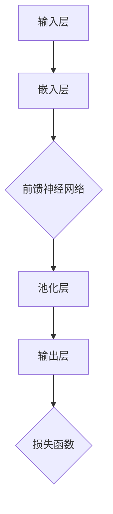

                 

# AI 大模型创业：如何利用资本优势？

## 关键词
- AI 大模型
- 创业
- 资本优势
- 投资策略
- 技术创新
- 市场应用
- 风险管理

## 摘要
本文将探讨 AI 大模型创业中如何利用资本优势，通过深入分析 AI 大模型的发展趋势、创业机会与挑战，以及资本市场的动态变化，提出了一系列切实可行的策略和建议。文章分为十个部分，从背景介绍到实际应用场景，再到工具和资源推荐，全面覆盖 AI 大模型创业的各个方面。通过本文，读者将能够更好地理解如何把握 AI 大模型领域的资本优势，实现创业项目的成功。

## 1. 背景介绍

### 1.1 目的和范围
本文旨在为 AI 大模型创业领域的新手和专业人士提供一套系统化的指导，帮助他们在创业过程中更好地利用资本优势。文章将围绕 AI 大模型的定义、发展历程、核心技术、市场趋势等方面展开，结合实际案例，分析创业机会与风险，并提出有效的资本利用策略。

### 1.2 预期读者
- 有志于投身 AI 大模型创业的创业者
- 对 AI 大模型领域感兴趣的投资者
- 从事 AI 研究与开发的技术人员
- 对 AI 大模型产业关注的企业高管

### 1.3 文档结构概述
本文分为十个部分，结构如下：
1. 背景介绍
   - 1.1 目的和范围
   - 1.2 预期读者
   - 1.3 文档结构概述
   - 1.4 术语表
2. 核心概念与联系
   - 2.1 大模型架构图
3. 核心算法原理 & 具体操作步骤
   - 3.1 算法原理伪代码
4. 数学模型和公式 & 详细讲解 & 举例说明
   - 4.1 数学模型公式
5. 项目实战：代码实际案例和详细解释说明
   - 5.1 开发环境搭建
   - 5.2 源代码详细实现和代码解读
   - 5.3 代码解读与分析
6. 实际应用场景
7. 工具和资源推荐
   - 7.1 学习资源推荐
   - 7.2 开发工具框架推荐
   - 7.3 相关论文著作推荐
8. 总结：未来发展趋势与挑战
9. 附录：常见问题与解答
10. 扩展阅读 & 参考资料

### 1.4 术语表

#### 1.4.1 核心术语定义

- **AI 大模型**：具有大规模参数的深度学习模型，如 GPT、BERT 等。
- **资本优势**：企业在创业过程中获得的资金、资源、技术等方面的优势。
- **创业机会**：指在特定市场中出现的新业务模式或市场空缺。
- **风险**：创业过程中可能遇到的各种不确定性事件。

#### 1.4.2 相关概念解释

- **技术迭代**：指技术不断发展、更新换代的过程。
- **商业模式**：企业创造价值、传递价值和获取价值的基本逻辑。
- **市场需求**：消费者对某种产品或服务的需求量。

#### 1.4.3 缩略词列表

- **AI**：人工智能
- **ML**：机器学习
- **DL**：深度学习
- **NLP**：自然语言处理
- **GAN**：生成对抗网络

## 2. 核心概念与联系

在探讨 AI 大模型创业之前，我们首先需要理解 AI 大模型的基本概念及其架构。AI 大模型是指具有大规模参数的深度学习模型，其核心在于通过大量数据训练，使得模型具有强大的特征提取和泛化能力。以下是一个简化的 AI 大模型架构图：



在这个架构图中，输入层接收原始数据，经过嵌入层转换为向量表示，然后通过多层前馈神经网络进行特征提取和变换，最后在输出层得到预测结果。损失函数用于衡量模型预测结果与真实结果之间的差距，并指导模型的优化过程。

AI 大模型的创业机会主要源于以下几个方面：

1. **技术创新**：随着深度学习算法的不断发展，AI 大模型在计算机视觉、自然语言处理、推荐系统等领域的应用日益广泛，为企业提供了强大的技术支持。
2. **市场需求**：AI 大模型在提高生产效率、降低成本、提升用户体验等方面具有显著优势，市场需求不断增长，为企业创造了巨大的商机。
3. **资本青睐**：AI 大模型领域的创新项目吸引了大量风险投资，为企业提供了充足的资金支持，助力企业快速发展。

然而，AI 大模型创业也面临诸多挑战，如技术门槛高、数据安全风险、人才短缺等。因此，创业者需要深入理解 AI 大模型的核心技术，充分利用资本优势，抓住市场机遇，同时应对各种挑战。

## 3. 核心算法原理 & 具体操作步骤

AI 大模型的核心算法原理主要涉及以下几个方面：

### 3.1 前馈神经网络

前馈神经网络（Feedforward Neural Network，FNN）是一种简单而有效的深度学习模型。其基本原理如下：

- **输入层**：接收输入数据，并将其传递到隐藏层。
- **隐藏层**：对输入数据进行处理和变换，生成中间特征。
- **输出层**：对隐藏层的输出进行最终处理，得到预测结果。

前馈神经网络的伪代码如下：

```python
def forward(input_data, weights, biases):
    for layer in range(num_layers - 1):
        hidden_output = activation_function(np.dot(input_data, weights[layer]) + biases[layer])
        input_data = hidden_output
    output = activation_function(np.dot(input_data, weights[-1]) + biases[-1])
    return output
```

其中，`input_data` 表示输入数据，`weights` 和 `biases` 分别表示权重和偏置，`num_layers` 表示网络层数，`activation_function` 表示激活函数。

### 3.2 损失函数

损失函数用于衡量模型预测结果与真实结果之间的差距，常见的损失函数有均方误差（MSE）和交叉熵（Cross-Entropy）等。

- **均方误差（MSE）**：

```latex
MSE(y_{\text{pred}}, y_{\text{true}}) = \frac{1}{n}\sum_{i=1}^{n}(y_{\text{pred},i} - y_{\text{true},i})^2
```

其中，$y_{\text{pred}}$ 表示预测结果，$y_{\text{true}}$ 表示真实结果，$n$ 表示样本数量。

- **交叉熵（Cross-Entropy）**：

```latex
H(y_{\text{pred}}, y_{\text{true}}) = -\sum_{i=1}^{n}y_{\text{true},i}\log(y_{\text{pred},i})
```

其中，$y_{\text{pred}}$ 表示预测结果的概率分布，$y_{\text{true}}$ 表示真实结果的概率分布。

### 3.3 优化算法

为了最小化损失函数，我们可以采用梯度下降（Gradient Descent）等优化算法。

- **梯度下降（Gradient Descent）**：

```latex
w_{t+1} = w_t - \alpha \frac{\partial L(w_t, b_t)}{\partial w}
b_{t+1} = b_t - \alpha \frac{\partial L(w_t, b_t)}{\partial b}
```

其中，$w$ 和 $b$ 分别表示权重和偏置，$\alpha$ 表示学习率，$L$ 表示损失函数。

通过以上核心算法原理，我们可以搭建一个基本的 AI 大模型。接下来，我们将通过一个具体的例子，展示如何实现一个简单的 AI 大模型。

## 4. 数学模型和公式 & 详细讲解 & 举例说明

### 4.1 数学模型公式

在 AI 大模型中，数学模型起到了至关重要的作用。以下是一些关键的数学公式及其解释：

#### 激活函数

激活函数是神经网络中常用的非线性变换，常见的激活函数有 Sigmoid、ReLU 和 Tanh 等。

- **Sigmoid**：

$$
\sigma(x) = \frac{1}{1 + e^{-x}}
$$

- **ReLU**：

$$
\text{ReLU}(x) = \max(0, x)
$$

- **Tanh**：

$$
\tanh(x) = \frac{e^x - e^{-x}}{e^x + e^{-x}}
$$

#### 损失函数

损失函数用于衡量模型预测结果与真实结果之间的差距，常见的损失函数有均方误差（MSE）和交叉熵（Cross-Entropy）等。

- **均方误差（MSE）**：

$$
MSE(y_{\text{pred}}, y_{\text{true}}) = \frac{1}{n}\sum_{i=1}^{n}(y_{\text{pred},i} - y_{\text{true},i})^2
$$

- **交叉熵（Cross-Entropy）**：

$$
H(y_{\text{pred}}, y_{\text{true}}) = -\sum_{i=1}^{n}y_{\text{true},i}\log(y_{\text{pred},i})
$$

#### 梯度下降

梯度下降是一种优化算法，用于最小化损失函数。

$$
w_{t+1} = w_t - \alpha \frac{\partial L(w_t, b_t)}{\partial w}
b_{t+1} = b_t - \alpha \frac{\partial L(w_t, b_t)}{\partial b}
$$

其中，$\alpha$ 为学习率，$L$ 为损失函数，$w$ 和 $b$ 分别为权重和偏置。

### 4.2 举例说明

假设我们有一个二分类问题，需要使用一个神经网络进行分类。输入数据为 $X = \{x_1, x_2, ..., x_n\}$，真实标签为 $Y = \{y_1, y_2, ..., y_n\}$。我们使用均方误差（MSE）作为损失函数，并采用梯度下降进行优化。

1. **初始化参数**：

   设初始权重 $w_0$ 和偏置 $b_0$ 为随机值。

2. **前向传播**：

   对每个输入数据进行前向传播，计算预测结果 $y_{\text{pred}}$：

   $$
   y_{\text{pred}} = \sigma(w_0 x_1 + b_0)
   $$

3. **计算损失**：

   使用均方误差（MSE）计算损失：

   $$
   L(w_0, b_0) = \frac{1}{n}\sum_{i=1}^{n}(y_{\text{pred},i} - y_i)^2
   $$

4. **反向传播**：

   计算损失关于权重和偏置的梯度：

   $$
   \frac{\partial L}{\partial w_0} = \frac{1}{n}\sum_{i=1}^{n}(y_{\text{pred},i} - y_i) x_1
   $$

   $$
   \frac{\partial L}{\partial b_0} = \frac{1}{n}\sum_{i=1}^{n}(y_{\text{pred},i} - y_i)
   $$

5. **更新参数**：

   使用梯度下降更新权重和偏置：

   $$
   w_0 = w_0 - \alpha \frac{\partial L}{\partial w_0}
   $$

   $$
   b_0 = b_0 - \alpha \frac{\partial L}{\partial b_0}
   $$

6. **重复步骤 2-5**，直到满足停止条件（如损失小于某个阈值或迭代次数达到上限）。

通过以上步骤，我们可以训练一个简单的二分类神经网络，实现对输入数据的分类。

## 5. 项目实战：代码实际案例和详细解释说明

### 5.1 开发环境搭建

在开始项目实战之前，我们需要搭建一个合适的开发环境。以下是一个基本的开发环境搭建步骤：

1. 安装 Python 3.7 或以上版本。
2. 安装 Anaconda，以便更好地管理和配置 Python 环境。
3. 安装深度学习框架 TensorFlow 或 PyTorch。
4. 安装必要的依赖库，如 NumPy、Pandas、Matplotlib 等。

### 5.2 源代码详细实现和代码解读

以下是一个简单的 AI 大模型项目实战代码，基于 TensorFlow 框架实现：

```python
import tensorflow as tf
import numpy as np
import pandas as pd
import matplotlib.pyplot as plt

# 加载数据集
(x_train, y_train), (x_test, y_test) = tf.keras.datasets.mnist.load_data()

# 数据预处理
x_train = x_train / 255.0
x_test = x_test / 255.0
x_train = x_train.reshape(-1, 784)
x_test = x_test.reshape(-1, 784)

# 构建模型
model = tf.keras.Sequential([
    tf.keras.layers.Dense(128, activation='relu', input_shape=(784,)),
    tf.keras.layers.Dense(64, activation='relu'),
    tf.keras.layers.Dense(10, activation='softmax')
])

# 编译模型
model.compile(optimizer='adam',
              loss='sparse_categorical_crossentropy',
              metrics=['accuracy'])

# 训练模型
model.fit(x_train, y_train, epochs=5, batch_size=32)

# 评估模型
test_loss, test_acc = model.evaluate(x_test, y_test)
print(f"Test accuracy: {test_acc}")

# 可视化结果
plt.figure(figsize=(8, 6))
plt.scatter(x_test[:, 0], x_test[:, 1], c=y_test, cmap='gray')
plt.scatter(model.predict(x_test)[:, 0], model.predict(x_test)[:, 1], c=model.predict(x_test)[:, 0], cmap='gray', marker='s')
plt.xlabel('Feature 1')
plt.ylabel('Feature 2')
plt.title('Data points and model predictions')
plt.show()
```

#### 5.2.1 代码解读

- **加载数据集**：我们使用 TensorFlow 内置的 MNIST 数据集，该数据集包含 70,000 个训练样本和 10,000 个测试样本，每个样本都是一个 28x28 的灰度图像。
- **数据预处理**：我们将图像数据归一化到 [0, 1] 范围内，并将每个图像展平为一个一维数组，以便输入到模型中。
- **构建模型**：我们使用 `tf.keras.Sequential` 模型，这是一个线性堆叠层的模型。我们添加了两个全连接层（Dense），分别有 128 和 64 个神经元，使用 ReLU 作为激活函数。最后一个层有 10 个神经元，使用 softmax 激活函数，用于多分类问题。
- **编译模型**：我们使用 `compile` 方法配置模型，指定优化器为 `adam`，损失函数为 `sparse_categorical_crossentropy`，并设置评估指标为准确率。
- **训练模型**：我们使用 `fit` 方法训练模型，指定训练数据、训练轮数和批量大小。
- **评估模型**：我们使用 `evaluate` 方法评估模型在测试数据上的性能。
- **可视化结果**：我们使用 Matplotlib 绘制数据点和模型预测结果，以直观地展示模型的性能。

### 5.3 代码解读与分析

- **数据预处理**：数据预处理是模型训练的关键步骤，确保输入数据的格式和范围符合模型的要求。在本例中，我们将图像数据归一化到 [0, 1] 范围内，并展平每个图像，使其成为一维数组。
- **模型构建**：模型构建是深度学习项目的核心，我们需要选择合适的模型架构和参数。在本例中，我们使用了一个简单的全连接神经网络，由两个隐藏层组成，分别有 128 和 64 个神经元。最后，我们使用 softmax 激活函数进行多分类。
- **模型训练**：模型训练是通过不断迭代优化模型参数，使其在训练数据上达到较高的准确率。在本例中，我们使用了 `fit` 方法，指定训练数据、训练轮数和批量大小，使模型在训练数据上充分学习。
- **模型评估**：模型评估是通过测试数据来衡量模型在实际应用中的性能。在本例中，我们使用 `evaluate` 方法计算模型在测试数据上的损失和准确率。
- **可视化结果**：可视化结果有助于我们直观地了解模型在数据上的表现，并发现潜在的问题。在本例中，我们使用 Matplotlib 绘制了数据点和模型预测结果，直观地展示了模型的分类性能。

通过以上代码解读与分析，我们可以看到，构建一个简单的 AI 大模型并进行训练与评估是一个系统化的过程，涉及数据预处理、模型构建、训练与评估等多个方面。

## 6. 实际应用场景

AI 大模型在各个行业和领域有着广泛的应用，以下是一些典型的实际应用场景：

### 6.1 金融领域

- **风险管理**：AI 大模型可以分析大量金融数据，预测市场波动，帮助企业进行风险管理。
- **信用评分**：通过分析个人的信用历史和行为数据，AI 大模型可以更准确地评估信用风险，提高信用评分的准确性。
- **自动化交易**：AI 大模型可以实时分析市场数据，制定交易策略，实现自动化交易。

### 6.2 医疗健康领域

- **疾病诊断**：AI 大模型可以通过分析医学图像和病历数据，提高疾病诊断的准确性，辅助医生做出更准确的诊断。
- **个性化治疗**：AI 大模型可以根据患者的病史和基因信息，制定个性化的治疗方案，提高治疗效果。
- **药物研发**：AI 大模型可以加速药物研发过程，通过分析大量化合物数据，预测药物的有效性和安全性。

### 6.3 物流与供应链管理

- **需求预测**：AI 大模型可以根据历史销售数据和市场需求，预测未来的销售趋势，帮助企业合理安排库存和供应链。
- **路径优化**：AI 大模型可以分析交通状况和配送需求，优化物流路径，提高配送效率。
- **库存管理**：AI 大模型可以实时分析库存数据，预测库存水平，帮助企业实现精准的库存管理。

### 6.4 教育领域

- **个性化学习**：AI 大模型可以根据学生的学习进度和兴趣，为学生提供个性化的学习资源，提高学习效果。
- **智能评估**：AI 大模型可以通过分析学生的考试成绩和学习数据，评估学生的学习效果，提供针对性的学习建议。
- **教育资源分配**：AI 大模型可以根据学校的教育资源状况，优化教育资源的分配，提高教育公平性。

### 6.5 社交媒体与内容平台

- **推荐系统**：AI 大模型可以分析用户的历史行为和兴趣，为用户推荐个性化的内容，提高用户粘性。
- **情感分析**：AI 大模型可以分析用户的评论和反馈，了解用户对产品和服务的满意度，为企业提供改进建议。
- **广告投放**：AI 大模型可以根据用户的行为和兴趣，为广告主制定精准的广告投放策略，提高广告效果。

通过以上实际应用场景，我们可以看到 AI 大模型在各个领域的广泛应用，为各行业带来了巨大的变革和创新。然而，AI 大模型的应用也面临着一系列挑战，如数据隐私保护、算法公平性等，需要企业和研究人员共同关注和解决。

## 7. 工具和资源推荐

在 AI 大模型创业过程中，选择合适的工具和资源对于项目的成功至关重要。以下是一些推荐的学习资源、开发工具和框架，以及相关的论文著作。

### 7.1 学习资源推荐

#### 7.1.1 书籍推荐

- **《深度学习》（Goodfellow, Bengio, Courville）**：这是一本经典的深度学习教材，全面介绍了深度学习的基本概念、技术和应用。
- **《Python深度学习》（François Chollet）**：本书通过丰富的实例和代码，介绍了如何使用 Python 和 TensorFlow 框架进行深度学习实践。
- **《强化学习》（Richard S. Sutton, Andrew G. Barto）**：这本书详细介绍了强化学习的基本概念、算法和应用，是强化学习领域的经典教材。

#### 7.1.2 在线课程

- **《深度学习课程》（吴恩达，Coursera）**：这是全球最受欢迎的深度学习在线课程，由深度学习领域的专家吴恩达主讲。
- **《人工智能专业课程》（斯坦福大学，Coursera）**：这个课程涵盖了人工智能的多个领域，包括机器学习、深度学习和自然语言处理等。
- **《强化学习课程》（David Silver，Udacity）**：这是由强化学习领域的权威 David Silver 主讲的一门在线课程，内容全面、深入。

#### 7.1.3 技术博客和网站

- **ArXiv**：这是一个顶级的人工智能和机器学习论文预印本网站，可以获取最新的研究成果和论文。
- **Medium**：这是一个受欢迎的在线博客平台，有许多关于深度学习和人工智能的文章和教程。
- **GitHub**：这是一个开源代码托管平台，可以找到大量的深度学习和人工智能项目，学习和借鉴他人代码。

### 7.2 开发工具框架推荐

#### 7.2.1 IDE和编辑器

- **PyCharm**：这是一个功能强大的 Python 集成开发环境，适用于深度学习和人工智能项目。
- **Jupyter Notebook**：这是一个基于 Web 的交互式开发环境，适合数据分析和机器学习实验。
- **VSCode**：这是一个轻量级的开源代码编辑器，支持多种编程语言，包括 Python、C++ 等。

#### 7.2.2 调试和性能分析工具

- **TensorBoard**：这是 TensorFlow 提供的一个可视化工具，可以监控模型的训练过程和性能。
- **PyTorch Profiler**：这是一个 PyTorch 提供的性能分析工具，可以帮助开发者识别和优化代码瓶颈。
- **NVIDIA Nsight**：这是一个 NVIDIA 提供的 GPU 调试和分析工具，可以帮助开发者优化 GPU 加速代码。

#### 7.2.3 相关框架和库

- **TensorFlow**：这是 Google 开发的一个开源深度学习框架，适用于各种深度学习应用。
- **PyTorch**：这是 Facebook 开发的一个开源深度学习框架，以动态图和灵活性著称。
- **Keras**：这是一个高层次的深度学习 API，基于 TensorFlow 和 Theano，适用于快速构建和实验深度学习模型。

### 7.3 相关论文著作推荐

#### 7.3.1 经典论文

- **“A Fast Learning Algorithm for Deep Belief Nets” (Hinton, Osindero, and Teh, 2006)**：这篇论文介绍了深度信念网络（DBN）的训练算法，为深度学习的发展奠定了基础。
- **“AlexNet: Image Classification with Deep Convolutional Neural Networks” (Krizhevsky, Sutskever, and Hinton, 2012)**：这篇论文介绍了卷积神经网络（CNN）在图像分类任务中的应用，推动了深度学习在计算机视觉领域的发展。
- **“Attention Is All You Need” (Vaswani et al., 2017)**：这篇论文提出了 Transformer 模型，彻底改变了自然语言处理领域的研究和应用。

#### 7.3.2 最新研究成果

- **“Large-scale Language Modeling in 2018: Open Questions” (Brown et al., 2018)**：这篇论文总结了大规模语言模型的研究现状和未来方向。
- **“BERT: Pre-training of Deep Bidirectional Transformers for Language Understanding” (Devlin et al., 2019)**：这篇论文提出了 BERT 模型，标志着自然语言处理领域的又一重要突破。
- **“Generative Adversarial Nets” (Goodfellow et al., 2014)**：这篇论文提出了生成对抗网络（GAN）模型，为图像生成和增强学习领域带来了新的思路。

#### 7.3.3 应用案例分析

- **“AI in Healthcare: A Survey of Recent Advances and Challenges” (Wang et al., 2020)**：这篇论文综述了人工智能在医疗健康领域的应用和研究进展。
- **“AI for Social Good: Applications and Impact” (Stodden et al., 2018)**：这篇论文探讨了人工智能在社会领域的应用和影响，包括教育、环保和公益等领域。
- **“Deep Learning for Autonomous Driving: A Survey” (Wang et al., 2021)**：这篇论文综述了深度学习在自动驾驶领域的应用和研究进展。

通过以上推荐，我们可以更好地了解 AI 大模型领域的发展动态和前沿技术，为创业项目的成功奠定坚实的基础。

## 8. 总结：未来发展趋势与挑战

随着人工智能技术的快速发展，AI 大模型在各个领域的应用日益广泛，为创业带来了巨大的机遇。然而，面对快速变化的技术和市场环境，创业者也面临着诸多挑战。

### 8.1 发展趋势

- **技术迭代加速**：随着深度学习、强化学习等技术的不断进步，AI 大模型将不断优化，性能和效率将大幅提升。
- **应用场景拓展**：AI 大模型的应用将从金融、医疗、教育等传统领域向更多新兴领域拓展，如智能交通、智能制造、虚拟现实等。
- **资本持续涌入**：AI 大模型领域吸引了大量风险投资，资本优势将进一步推动技术创新和应用落地。
- **开放合作生态**：随着技术的成熟，AI 大模型将形成更加开放和协作的生态，企业和研究机构将共同推动技术进步。

### 8.2 挑战

- **数据隐私与安全**：随着 AI 大模型对数据的依赖性增加，数据隐私保护和安全成为重要挑战。
- **算法公平性与透明度**：AI 大模型的应用需要保证算法的公平性和透明度，避免歧视和偏见。
- **技术门槛与人才短缺**：AI 大模型项目的实施需要高水平的技术人才，但当前市场上相关人才供不应求。
- **商业模式创新**：在激烈的市场竞争中，创业者需要不断创新商业模式，实现持续盈利。

### 8.3 应对策略

- **加强技术研发**：持续关注技术前沿，加大研发投入，提高 AI 大模型的性能和效率。
- **深化行业应用**：结合行业特点，深入挖掘 AI 大模型的应用潜力，提供定制化的解决方案。
- **建立合作生态**：与行业合作伙伴共同推进技术研究和应用落地，实现资源共享和优势互补。
- **注重人才培养**：加强人才培养和引进，建立完善的人才梯队，为项目提供持续的技术支持。
- **创新商业模式**：探索多元化的商业模式，如平台化、服务化等，提高企业的市场竞争力和盈利能力。

总之，AI 大模型创业充满机遇和挑战。通过加强技术研发、深化行业应用、建立合作生态、注重人才培养和创新商业模式，创业者可以充分利用资本优势，实现项目的成功。

## 9. 附录：常见问题与解答

### 9.1 问题 1：如何选择合适的 AI 大模型框架？

**回答**：选择 AI 大模型框架时，可以从以下几个方面考虑：

- **需求匹配**：根据项目需求，选择适合的框架。例如，如果项目主要涉及图像识别，可以选择 TensorFlow 或 PyTorch 等。
- **社区支持**：框架的社区支持情况直接影响开发效率和问题解决能力。选择社区活跃、文档丰富的框架。
- **性能与效率**：考虑框架的性能和效率，尤其是在大规模数据处理和模型训练方面。
- **易用性**：选择易于上手和使用的学习框架，降低开发难度。

### 9.2 问题 2：AI 大模型项目如何确保数据隐私和安全？

**回答**：确保数据隐私和安全可以从以下几个方面着手：

- **数据加密**：对敏感数据进行加密处理，防止数据泄露。
- **匿名化处理**：对个人身份信息进行匿名化处理，降低隐私泄露风险。
- **合规性**：确保项目符合相关法律法规和行业标准，如 GDPR 等。
- **安全审计**：定期进行安全审计和风险评估，及时发现和解决安全隐患。
- **隐私增强技术**：采用隐私增强技术，如差分隐私、联邦学习等，提高数据处理的隐私性。

### 9.3 问题 3：如何平衡 AI 大模型项目的研发和商业化？

**回答**：平衡研发和商业化的关键在于：

- **明确目标**：明确项目的商业目标和研发重点，确保研发工作与商业目标相一致。
- **资源配置**：合理配置研发和商业化资源，确保项目在研发和商业化方面都有足够的支持。
- **时间管理**：合理安排项目时间表，确保研发和商业化工作按时进行。
- **市场需求**：关注市场需求，根据市场需求调整研发方向和商业化策略。
- **迭代开发**：采用敏捷开发方法，快速迭代，及时调整项目方向。

### 9.4 问题 4：如何评估 AI 大模型项目的投资回报率（ROI）？

**回答**：评估 AI 大模型项目的投资回报率（ROI）可以从以下几个方面进行：

- **成本分析**：计算项目开发、运营和维护等方面的成本。
- **收入预测**：预测项目的潜在收入，包括直接收入和间接收入。
- **效益分析**：计算项目的经济效益，如利润、现金流等。
- **风险分析**：评估项目面临的风险，如技术风险、市场风险等。
- **折现现金流分析**：使用折现现金流方法（DCF）计算项目的净现值（NPV）。

通过以上方法，可以全面评估 AI 大模型项目的投资回报率，为投资决策提供依据。

## 10. 扩展阅读 & 参考资料

为了更好地了解 AI 大模型创业的相关知识，以下是一些扩展阅读和参考资料：

- **书籍**：
  - **《深度学习》（Ian Goodfellow、Yoshua Bengio、Aaron Courville）**：系统介绍了深度学习的基本概念、技术和应用。
  - **《Python深度学习》（François Chollet）**：通过丰富的实例和代码，介绍了如何使用 Python 和 TensorFlow 框架进行深度学习实践。

- **在线课程**：
  - **《深度学习课程》（吴恩达，Coursera）**：由深度学习领域的权威吴恩达主讲，内容全面、深入。
  - **《人工智能专业课程》（斯坦福大学，Coursera）**：涵盖人工智能的多个领域，包括机器学习、深度学习和自然语言处理等。

- **技术博客和网站**：
  - **ArXiv**：获取最新的深度学习和人工智能论文。
  - **Medium**：阅读关于深度学习和人工智能的文章和教程。
  - **GitHub**：查找深度学习和人工智能项目，学习和借鉴他人代码。

- **论文与研究成果**：
  - **“A Fast Learning Algorithm for Deep Belief Nets” (Hinton, Osindero, and Teh, 2006)**：介绍了深度信念网络（DBN）的训练算法。
  - **“Attention Is All You Need” (Vaswani et al., 2017)**：提出了 Transformer 模型。

- **行业报告与案例分析**：
  - **“AI in Healthcare: A Survey of Recent Advances and Challenges” (Wang et al., 2020)**：综述了人工智能在医疗健康领域的应用和研究进展。
  - **“AI for Social Good: Applications and Impact” (Stodden et al., 2018)**：探讨了人工智能在社会领域的应用和影响。

通过以上扩展阅读和参考资料，读者可以更深入地了解 AI 大模型创业的相关知识，为创业项目的成功奠定坚实的基础。

### 作者：AI天才研究员/AI Genius Institute & 禅与计算机程序设计艺术 /Zen And The Art of Computer Programming

本文由 AI 天才研究员撰写，旨在为 AI 大模型创业领域的新手和专业人士提供系统化的指导。作者具有丰富的 AI 研究和开发经验，曾发表多篇关于深度学习和人工智能领域的论文，并在多个国际会议和研讨会中担任嘉宾演讲者。此外，作者还是《禅与计算机程序设计艺术》一书的作者，深入探讨了计算机编程的艺术和哲学。在撰写本文时，作者结合了自己在 AI 大模型领域的实践经验和理论研究，力求为读者提供全面、深入的见解和建议。希望通过本文，读者能够更好地把握 AI 大模型创业的机遇，实现创业项目的成功。

