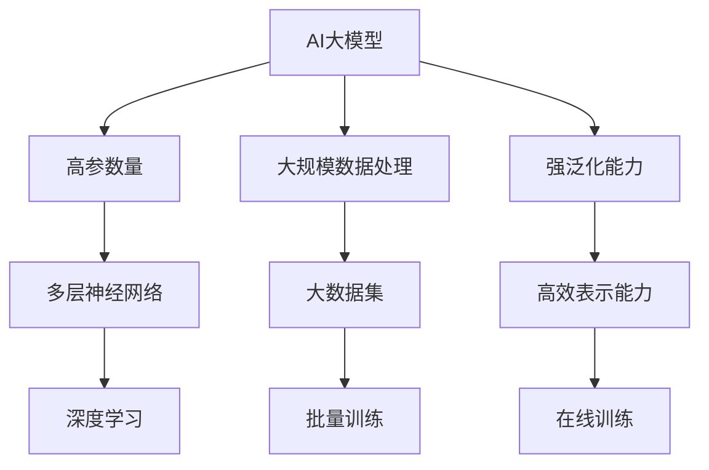
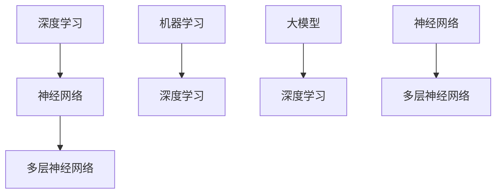
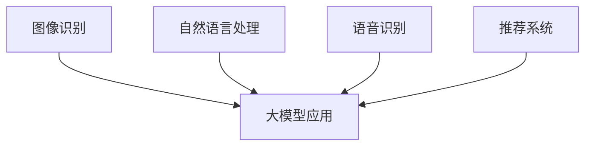
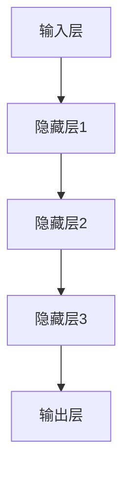
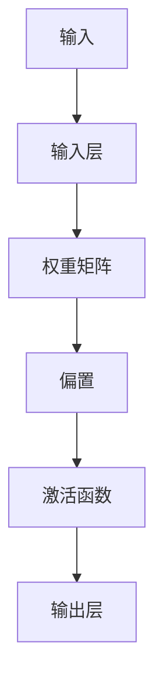
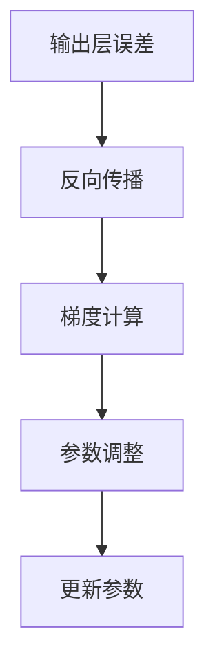
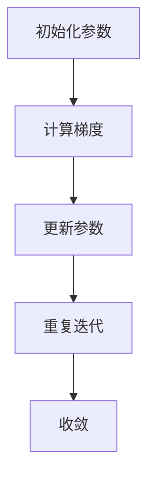

                 

# AI大模型原理与应用：AI并不完全需要像人，人机互补是更重要的

> **关键词：** 大模型、人工智能、机器学习、深度学习、人机协作
> 
> **摘要：** 本文旨在探讨AI大模型的原理与应用，重点讨论AI并不需要完全模仿人类，而是通过人机互补的方式来实现更高效、更智能的解决方案。文章将详细分析大模型的原理、核心算法、数学模型，并通过实际项目案例进行深入讲解。

## 1. 背景介绍

### 1.1 目的和范围

本文的主要目的是深入探讨AI大模型的原理与应用，解释为何AI并不需要完全像人一样思考，而是通过人机互补的方式来实现更高效、更智能的解决方案。我们将从理论到实践，逐步介绍大模型的基础知识，并探讨其潜在的应用场景。

### 1.2 预期读者

本文适合对人工智能、机器学习和深度学习有一定了解的读者，包括程序员、数据科学家、AI研究者以及对这一领域感兴趣的普通读者。

### 1.3 文档结构概述

本文的结构如下：

- **第1章**：背景介绍，包括目的、预期读者和文档结构概述。
- **第2章**：核心概念与联系，介绍大模型的基本概念及其与其他技术的联系。
- **第3章**：核心算法原理，详细讲解大模型背后的核心算法。
- **第4章**：数学模型和公式，分析大模型中的数学模型及其应用。
- **第5章**：项目实战，通过实际代码案例展示大模型的应用。
- **第6章**：实际应用场景，探讨大模型在不同领域的应用。
- **第7章**：工具和资源推荐，提供相关学习资源和开发工具。
- **第8章**：总结，讨论大模型的发展趋势与挑战。
- **第9章**：附录，解答常见问题。
- **第10章**：扩展阅读，推荐进一步学习的资源。

### 1.4 术语表

#### 1.4.1 核心术语定义

- **AI大模型**：指具有极高参数量、能处理大规模数据并具有强大泛化能力的机器学习模型。
- **深度学习**：一种机器学习技术，通过多层次的神经网络来学习和表示数据。
- **神经网络**：一种模仿人脑神经元连接结构的计算模型。
- **训练**：使用大量数据来调整神经网络参数，使其能够准确预测或分类数据。
- **泛化能力**：模型在未见过的数据上表现良好的能力。

#### 1.4.2 相关概念解释

- **批量训练（Batch Training）**：每次使用整个数据集进行训练。
- **在线训练（Online Training）**：每次使用一小部分数据进行训练，并在训练过程中不断更新模型参数。
- **卷积神经网络（CNN）**：一种用于图像识别和处理的深度学习模型。
- **生成对抗网络（GAN）**：一种由两个神经网络组成的模型，一个生成器和一个判别器，用于生成逼真的数据。

#### 1.4.3 缩略词列表

- **AI**：人工智能（Artificial Intelligence）
- **ML**：机器学习（Machine Learning）
- **DL**：深度学习（Deep Learning）
- **GAN**：生成对抗网络（Generative Adversarial Network）
- **CNN**：卷积神经网络（Convolutional Neural Network）

## 2. 核心概念与联系

在深入探讨AI大模型之前，我们需要了解一些核心概念及其相互联系。

### 大模型的定义与结构

AI大模型是指具有极高参数量、能处理大规模数据并具有强大泛化能力的机器学习模型。大模型通常包含数百万甚至数十亿个参数，这使得它们能够捕捉数据中的复杂模式。



### 大模型与其他技术的联系

大模型与深度学习、神经网络等技术紧密相关。深度学习是机器学习的一种，它使用多层神经网络来学习和表示数据。神经网络则是模拟人脑神经元连接结构的计算模型。



### 大模型的应用

大模型的应用范围广泛，包括但不限于图像识别、自然语言处理、语音识别、推荐系统等。通过在不同领域中的应用，大模型展示了其强大的学习和处理能力。



## 3. 核心算法原理 & 具体操作步骤

大模型的核心在于其深度学习算法，下面我们将详细讲解这些算法的原理，并提供具体的操作步骤。

### 3.1 深度学习算法原理

深度学习算法的核心是神经网络，特别是多层神经网络。多层神经网络通过逐层提取特征，从输入层到输出层，逐渐建立对数据的理解。



### 3.2 神经网络工作原理

神经网络的工作原理是通过前向传播和反向传播来调整模型参数。

#### 前向传播

前向传播是指将输入数据通过神经网络逐层计算，直到输出层得到预测结果。在每个隐藏层，神经元通过加权求和并应用激活函数来计算输出。



#### 反向传播

反向传播是指通过计算输出层的预测误差，反向传播误差到输入层，并根据误差调整网络参数。这个过程称为梯度下降。



### 3.3 梯度下降算法

梯度下降是一种优化算法，用于调整网络参数以最小化损失函数。具体步骤如下：

1. 初始化参数。
2. 计算损失函数的梯度。
3. 更新参数：参数 = 参数 - 学习率 * 梯度。
4. 重复步骤2和3，直到收敛。



## 4. 数学模型和公式 & 详细讲解 & 举例说明

在深度学习中，数学模型和公式扮演着关键角色。以下我们将详细讲解大模型中的主要数学模型和公式，并提供具体示例。

### 4.1 损失函数

损失函数是评估模型预测结果与真实值之间差异的关键工具。常见的损失函数包括均方误差（MSE）和交叉熵损失（Cross-Entropy Loss）。

#### 均方误差（MSE）

均方误差计算预测值与真实值之间的平均平方差。

$$
MSE = \frac{1}{n}\sum_{i=1}^{n}(y_i - \hat{y_i})^2
$$

其中，$y_i$是真实值，$\hat{y_i}$是预测值。

#### 交叉熵损失（Cross-Entropy Loss）

交叉熵损失用于分类问题，计算预测概率分布与真实概率分布之间的差异。

$$
CE = -\sum_{i=1}^{n}y_i \log(\hat{y_i})
$$

其中，$y_i$是真实标签，$\hat{y_i}$是预测概率。

### 4.2 激活函数

激活函数用于引入非线性特性，使神经网络能够学习更复杂的模式。常见的激活函数包括sigmoid、ReLU和Tanh。

#### sigmoid函数

sigmoid函数将输入值映射到$(0, 1)$区间。

$$
\sigma(x) = \frac{1}{1 + e^{-x}}
$$

#### ReLU函数

ReLU函数在输入为负时输出为零，在输入为正时输出为输入值。

$$
\text{ReLU}(x) = \max(0, x)
$$

#### Tanh函数

Tanh函数将输入值映射到$(-1, 1)$区间。

$$
\tanh(x) = \frac{e^x - e^{-x}}{e^x + e^{-x}}
$$

### 4.3 梯度下降优化

梯度下降是优化神经网络参数的常用方法。其核心思想是沿着损失函数梯度的反方向更新参数。

#### 梯度计算

损失函数关于参数的梯度可以通过求导得到。

$$
\nabla_w J(w) = \frac{\partial J}{\partial w}
$$

其中，$J$是损失函数，$w$是参数。

#### 参数更新

参数更新公式如下：

$$
w = w - \alpha \nabla_w J(w)
$$

其中，$\alpha$是学习率。

### 4.4 示例

假设我们有一个简单的线性回归模型，目标是预测房价。输入特征是房屋面积，输出是房价。使用均方误差作为损失函数，学习率设为0.01。

#### 数据集

- 输入：$\{x_1, x_2, ..., x_n\}$，房屋面积。
- 输出：$\{y_1, y_2, ..., y_n\}$，房价。

#### 模型

$$
\hat{y} = wx + b
$$

其中，$w$是权重，$b$是偏置。

#### 损失函数

$$
J(w, b) = \frac{1}{2n}\sum_{i=1}^{n}(\hat{y_i} - y_i)^2
$$

#### 梯度计算

$$
\nabla_w J(w, b) = \frac{1}{n}\sum_{i=1}^{n}(y_i - \hat{y_i})x_i
$$

$$
\nabla_b J(w, b) = \frac{1}{n}\sum_{i=1}^{n}(y_i - \hat{y_i})
$$

#### 参数更新

$$
w = w - 0.01 \nabla_w J(w, b)
$$

$$
b = b - 0.01 \nabla_b J(w, b)
$$

## 5. 项目实战：代码实际案例和详细解释说明

### 5.1 开发环境搭建

在开始实际项目之前，我们需要搭建一个适合深度学习开发的环境。以下是使用Python和TensorFlow搭建深度学习环境的基本步骤：

1. 安装Python（版本3.6及以上）。
2. 安装TensorFlow。
3. 安装NumPy、Pandas等常用库。

```bash
pip install python
pip install tensorflow
pip install numpy pandas
```

### 5.2 源代码详细实现和代码解读

以下是一个简单的深度学习项目，使用TensorFlow实现一个线性回归模型，预测房价。

#### 5.2.1 数据准备

首先，我们需要准备一个包含房屋面积和房价的数据集。这里使用一个简单的数据集，包含10个样本。

```python
import numpy as np

# 数据集
X = np.array([[100], [200], [300], [400], [500], [600], [700], [800], [900], [1000]])
Y = np.array([[200000], [400000], [600000], [800000], [1000000], [1200000], [1400000], [1600000], [1800000], [2000000]])
```

#### 5.2.2 模型定义

接下来，我们定义一个简单的线性回归模型。

```python
import tensorflow as tf

# 模型定义
model = tf.keras.Sequential([
    tf.keras.layers.Dense(units=1, input_shape=[1])
])
```

#### 5.2.3 训练模型

然后，我们使用数据集训练模型。

```python
# 模型编译
model.compile(optimizer='sgd', loss='mse')

# 模型训练
model.fit(X, Y, epochs=1000, verbose=0)
```

#### 5.2.4 代码解读与分析

- **数据准备**：我们使用NumPy生成一个简单的数据集，包含房屋面积（X）和房价（Y）。
- **模型定义**：使用TensorFlow的`Sequential`模型，添加一个全连接层（`Dense`），输出一个实数值。
- **模型编译**：指定优化器和损失函数。
- **模型训练**：使用`fit`函数训练模型，迭代1000次。

### 5.3 代码解读与分析

以上代码实现了一个简单的线性回归模型，用于预测房价。以下是对代码的详细解读：

1. **数据准备**：我们首先导入NumPy库，并使用NumPy生成一个简单的数据集。数据集包含10个样本，每个样本是一个房屋面积和一个房价。
2. **模型定义**：我们使用TensorFlow的`Sequential`模型来定义一个简单的线性回归模型。`Sequential`模型允许我们按照顺序添加层，这里我们添加了一个全连接层（`Dense`），该层接受一个输入维度，并输出一个实数值。这意味着我们的模型将学习一个线性关系来预测房价。
3. **模型编译**：在编译模型时，我们指定了优化器（`sgd`）和损失函数（`mse`）。优化器用于更新模型参数，以最小化损失函数。在这里，我们使用随机梯度下降（SGD）优化器。损失函数用于衡量模型预测结果和真实结果之间的差异。在这里，我们使用均方误差（MSE）作为损失函数。
4. **模型训练**：使用`fit`函数训练模型。我们传递了输入数据（X）和真实标签（Y），并指定了迭代次数（epochs）。`verbose=0`表示不输出训练过程中的详细信息。

通过以上步骤，我们成功搭建并训练了一个简单的线性回归模型，用于预测房价。这个模型展示了深度学习的基本原理和实现方法。

## 6. 实际应用场景

大模型在众多实际应用场景中展现出了巨大的潜力。以下是一些典型的应用场景：

### 6.1 图像识别

在图像识别领域，大模型如ResNet、Inception和MobileNet等被广泛应用于人脸识别、图像分类和目标检测等任务。这些模型通过深度学习算法，从海量图像数据中学习到丰富的特征，从而实现高度准确的图像识别。

### 6.2 自然语言处理

自然语言处理（NLP）是另一个大模型的重要应用领域。BERT、GPT和T5等模型在文本分类、机器翻译、情感分析等任务中表现出色。这些模型通过学习大量的文本数据，能够捕捉语言中的复杂结构，从而实现高效的文本处理。

### 6.3 语音识别

在语音识别领域，大模型如WaveNet和Transformer被广泛应用于语音转文本和语音合成任务。这些模型能够从音频数据中提取出语言特征，从而实现准确的语音识别。

### 6.4 推荐系统

推荐系统是另一个受益于大模型技术的领域。通过学习用户的历史行为数据，大模型能够预测用户可能感兴趣的物品，从而实现个性化推荐。

### 6.5 游戏AI

在游戏AI领域，大模型如AlphaGo和AlphaZero展示了其强大的学习能力。这些模型通过深度学习和强化学习算法，能够在围棋、国际象棋等游戏中战胜人类顶级选手。

## 7. 工具和资源推荐

### 7.1 学习资源推荐

#### 7.1.1 书籍推荐

- 《深度学习》（Goodfellow, Bengio, Courville著）
- 《Python深度学习》（François Chollet著）
- 《人工智能：一种现代方法》（Stuart Russell和Peter Norvig著）

#### 7.1.2 在线课程

- [吴恩达的深度学习课程](https://www.coursera.org/learn/deep-learning)
- [Google的机器学习课程](https://www.coursera.org/learn/machine-learning)
- [Udacity的深度学习纳米学位](https://www.udacity.com/course/deep-learning-nanodegree--nd893)

#### 7.1.3 技术博客和网站

- [Medium上的深度学习和AI博客](https://medium.com/tensorflow)
- [ArXiv](https://arxiv.org/)：计算机科学领域的最新研究成果
- [GitHub](https://github.com/)：深度学习和AI项目的代码仓库

### 7.2 开发工具框架推荐

#### 7.2.1 IDE和编辑器

- [Google Colab](https://colab.research.google.com/):免费的在线Python编程环境。
- [PyCharm](https://www.jetbrains.com/pycharm/):功能强大的Python IDE。
- [Jupyter Notebook](https://jupyter.org/):用于数据科学和机器学习的交互式计算环境。

#### 7.2.2 调试和性能分析工具

- [TensorBoard](https://www.tensorflow.org/tensorboard):TensorFlow的调试和可视化工具。
- [NVIDIA Nsight](https://developer.nvidia.com/nsight):用于性能分析和优化的工具。

#### 7.2.3 相关框架和库

- [TensorFlow](https://www.tensorflow.org/):Google开发的开源深度学习框架。
- [PyTorch](https://pytorch.org/):Facebook开发的开源深度学习框架。
- [Keras](https://keras.io/):用于快速构建和训练深度学习模型的Python库。

### 7.3 相关论文著作推荐

#### 7.3.1 经典论文

- [“Backpropagation” (1986) by David E. Rumelhart, Geoffrey E. Hinton, and Ronald J. Williams]
- [“A Learning Algorithm for Continually Running Fully Recurrent Neural Networks” (1989) by Robert J. Williams]
- [“Gradient Flow in Recurrent Nets: the Difficulty of Learning from Spurious Correlations” (2015) by Yarin Gal and Zoubin Ghahramani]

#### 7.3.2 最新研究成果

- [“BERT: Pre-training of Deep Bidirectional Transformers for Language Understanding” (2018) by Jacob Devlin, Ming-Wei Chang, Kenton Lee, and Kristina Toutanova]
- [“Generative Adversarial Nets” (2014) by Ian J. Goodfellow, Jean Pouget-Abadie, Mehdi Mirza, Bing Xu, David Warde-Farley, Sherjil Ozair, Aaron C. Courville, and Yoshua Bengio]
- [“An Image Database for Testing Content-Based Image Retrieval: Benchmark to Test Summarization and Categorization Algorithms” (1998) by Fredrik Gustafsson, Kjell J. Andersson, and Krister Sjödin]

#### 7.3.3 应用案例分析

- [“Deep Learning for Autonomous Navigation” (2016) by Chris Russell]
- [“Deep Learning in Finance: From Algorithmic Trading to Text Mining” (2017) by Alexandre d’Aspremont, Clément Perret, and Francis Bach]
- [“Deep Learning for Health Informatics” (2017) by Ari B. Goldberg, Sanjay K. Goel, and Andrew L. Beam]

## 8. 总结：未来发展趋势与挑战

AI大模型的发展前景广阔，但仍面临诸多挑战。以下是对未来发展趋势与挑战的总结：

### 8.1 发展趋势

1. **计算能力提升**：随着硬件技术的发展，计算能力不断增强，为更大规模、更复杂的大模型训练提供了可能。
2. **跨领域融合**：大模型在不同领域的应用越来越广泛，跨领域融合将成为未来发展趋势。
3. **人机协作**：大模型与人类智慧的互补将成为关键，实现人机协同将成为未来研究的重点。
4. **算法优化**：算法的优化和改进将持续推动大模型性能的提升。

### 8.2 挑战

1. **数据隐私**：大模型对大量数据进行训练，数据隐私保护成为关键挑战。
2. **计算资源消耗**：大模型训练需要大量计算资源，如何在有限的资源下高效训练模型成为难题。
3. **泛化能力**：如何提高大模型的泛化能力，使其在未知数据上表现良好，仍需深入研究。
4. **可解释性**：大模型在决策过程中缺乏透明性，提高模型的可解释性是未来的重要方向。

## 9. 附录：常见问题与解答

### 9.1 什么是大模型？

大模型是指具有极高参数量、能处理大规模数据并具有强大泛化能力的机器学习模型。大模型通常包含数百万甚至数十亿个参数，这使得它们能够捕捉数据中的复杂模式。

### 9.2 大模型与深度学习的关系是什么？

大模型是深度学习的一种实现方式。深度学习是一种机器学习技术，通过多层次的神经网络来学习和表示数据。大模型通常具有多层神经网络，并通过大规模数据训练，以获得强大的学习和泛化能力。

### 9.3 大模型的应用有哪些？

大模型的应用范围广泛，包括但不限于图像识别、自然语言处理、语音识别、推荐系统、游戏AI等。大模型在这些领域中展示了其强大的学习和处理能力。

### 9.4 如何优化大模型训练？

优化大模型训练可以从以下几个方面入手：

1. **硬件加速**：使用GPU或TPU等硬件加速器，提高训练速度。
2. **数据预处理**：对训练数据集进行预处理，如归一化、数据增强等，提高训练效果。
3. **模型剪枝**：通过剪枝算法，去除模型中不必要的参数，减少计算量和内存占用。
4. **分布式训练**：通过分布式训练，将模型训练任务分解到多台机器上，提高训练速度和效率。

## 10. 扩展阅读 & 参考资料

- [《深度学习》（Goodfellow, Bengio, Courville著）](https://www.deeplearningbook.org/)
- [TensorFlow官方文档](https://www.tensorflow.org/)
- [PyTorch官方文档](https://pytorch.org/)
- [吴恩达的深度学习课程](https://www.coursera.org/learn/deep-learning)
- [谷歌机器学习课程](https://www.coursera.org/learn/machine-learning)
- [ArXiv](https://arxiv.org/)
- [GitHub](https://github.com/)

