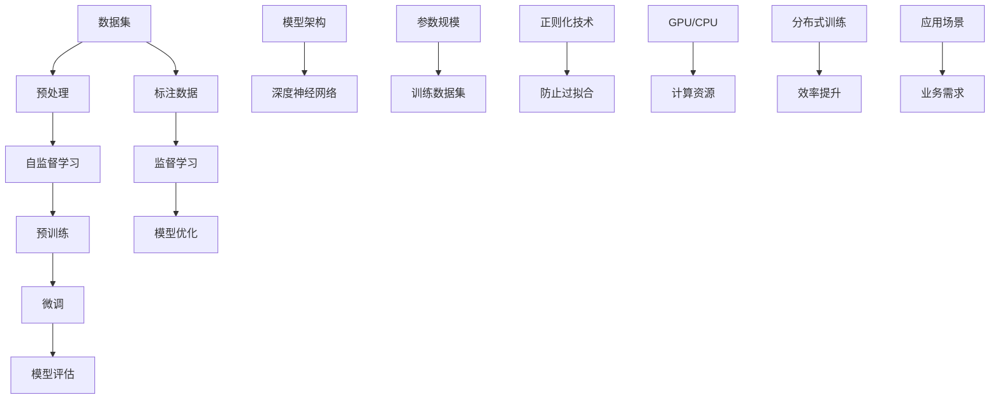

                 

### 文章标题

《AI 大模型原理与应用：下一代模型有更大的参数、更多高质量的数据、更大的模型》

大模型在人工智能领域正迅速崛起，它们以庞大的参数规模、海量的高质量数据集和更为复杂的结构，引领着技术发展的新潮流。本文旨在深入探讨AI大模型的原理、应用及其未来趋势，帮助读者全面理解这一技术革新的核心概念和应用场景。

关键词：AI大模型、参数规模、数据质量、模型结构、应用场景、未来趋势

摘要：本文将系统地介绍AI大模型的发展背景，核心概念和原理，并详细讲解其数学模型和具体操作步骤。通过实际项目实战案例，我们将展示如何在实际环境中构建和应用AI大模型。同时，还将推荐相关学习资源、开发工具和最新研究成果，为读者提供全面的指导。最后，本文将对大模型未来发展趋势和面临的挑战进行展望，为读者指明研究方向。

### 1. 背景介绍

#### 1.1 目的和范围

本文的主要目的是为读者提供一个全面而深入的AI大模型指南，从基础原理到实际应用，从数学模型到开发实战，全方位解析这一前沿技术。我们将探讨大模型的本质特征，分析其相比传统模型的优越性，并通过实际案例展示其强大的应用潜力。

文章范围将涵盖以下关键内容：

1. 大模型的发展历程及其背景介绍。
2. 大模型的核心概念、原理和数学模型。
3. 大模型的具体操作步骤和实现方法。
4. 大模型在实际应用场景中的表现和案例分析。
5. 大模型相关学习资源和开发工具的推荐。
6. 大模型未来发展趋势与面临的挑战。

#### 1.2 预期读者

本文面向的读者包括：

1. 对AI领域有基础了解，希望深入了解大模型原理和应用的开发者。
2. 想要在研究中引入大模型技术的研究生和科研人员。
3. 对AI技术有浓厚兴趣，希望跟进行业最新动态的技术爱好者。
4. 在企业中负责AI技术开发和决策的管理者。

#### 1.3 文档结构概述

本文结构如下：

1. 引言：介绍AI大模型的核心概念和重要性。
2. 背景介绍：讨论大模型的发展历程、目的和范围。
3. 核心概念与联系：解释大模型的基本组成部分和相互关系。
4. 核心算法原理 & 具体操作步骤：详细讲解大模型的算法原理和操作步骤。
5. 数学模型和公式 & 详细讲解 & 举例说明：分析大模型的数学模型并给出实例。
6. 项目实战：通过实际案例展示大模型的应用。
7. 实际应用场景：讨论大模型在不同领域的应用。
8. 工具和资源推荐：推荐学习资源、开发工具和最新研究成果。
9. 总结：展望大模型的发展趋势和挑战。
10. 附录：常见问题与解答。
11. 扩展阅读 & 参考资料：提供进一步学习资源。

#### 1.4 术语表

为了确保文章的准确性和易懂性，以下是对本文中一些关键术语的定义和解释：

##### 1.4.1 核心术语定义

- AI大模型：参数规模远超传统模型，拥有海量数据训练的复杂深度神经网络。
- 参数规模：模型中的可训练参数的数量，通常以亿计。
- 高质量数据：数据量大、多样、准确，有助于提高模型性能。
- 深度神经网络：包含多层神经元，能够通过反向传播算法进行训练。
- 自监督学习：模型在未标注数据上进行训练，通过自动学习数据中的内在规律。

##### 1.4.2 相关概念解释

- 模型架构：神经网络的结构设计，包括层数、神经元数量和连接方式。
- 过拟合：模型在训练数据上表现优异，但在未见数据上表现较差。
- 正则化：防止模型过拟合的技术手段，如dropout、权重衰减等。
- 训练数据集：用于训练模型的原始数据，通常包括标注数据和未标注数据。

##### 1.4.3 缩略词列表

- AI：人工智能
- GPT：生成预训练模型
- BERT：双向编码器表示
- GPU：图形处理器
- CPU：中央处理器
- RAM：随机存取存储器

### 2. 核心概念与联系

在深入探讨AI大模型之前，我们需要了解其核心概念和组成部分，以及它们之间的相互关系。大模型的成功不仅依赖于大规模的训练数据和复杂的网络架构，还依赖于有效的算法和数学模型。

以下是一个简化的Mermaid流程图，展示了大模型的基本组成部分和相互关系：



在这个流程图中：

- **数据集**（A）：包括训练数据和测试数据，是模型训练的基础。
- **预处理**（B）：对数据进行清洗、标准化等处理，提高数据质量。
- **自监督学习**（C）：在未标注数据上进行预训练，学习数据中的内在规律。
- **预训练**（D）：使用大量未标注数据进行训练，形成初步的模型。
- **微调**（E）：在预训练模型的基础上，使用标注数据进一步优化。
- **模型评估**（F）：通过测试数据评估模型的性能，包括准确率、召回率等指标。
- **标注数据**（G）：用于监督学习的标注数据，有助于模型进一步优化。
- **监督学习**（H）：在标注数据上训练模型，通常用于微调阶段。
- **模型优化**（I）：通过调整模型参数、应用正则化技术等手段提高模型性能。
- **模型架构**（J）：深度神经网络的结构设计，影响模型的学习能力和效率。
- **参数规模**（L）：模型中的可训练参数数量，是衡量模型复杂度的重要指标。
- **训练数据集**（M）：用于训练模型的原始数据，通常包括标注数据和未标注数据。
- **正则化技术**（N）：防止模型过拟合的技术手段。
- **计算资源**（P）：包括GPU和CPU，用于加速模型训练和推理。
- **分布式训练**（R）：将训练任务分布到多个计算节点，提高训练效率。
- **应用场景**（T）：模型的实际应用领域，如自然语言处理、计算机视觉等。
- **业务需求**（U）：模型开发需要满足的具体业务需求。

通过这个流程图，我们可以看到大模型的各个组成部分及其相互关系。接下来，我们将详细讨论这些核心概念和原理。

### 3. 核心算法原理 & 具体操作步骤

AI大模型的核心在于其算法原理，这些原理决定了模型的学习能力、性能和可扩展性。在本节中，我们将详细讲解大模型的算法原理，并使用伪代码来阐述其具体操作步骤。

#### 3.1 深度神经网络原理

深度神经网络（DNN）是AI大模型的基础，其核心思想是通过多层非线性变换来提取数据的特征。以下是一个简化的DNN算法原理：

```python
# 伪代码：深度神经网络原理

# 定义层结构
input_layer = InputLayer()
hidden_layer1 = SigmoidLayer()
hidden_layer2 = SigmoidLayer()
output_layer = SigmoidLayer()

# 定义参数
weights1 = random_weights(input_layer.size, hidden_layer1.size)
weights2 = random_weights(hidden_layer1.size, hidden_layer2.size)
weights3 = random_weights(hidden_layer2.size, output_layer.size)

# 前向传播
def forwardPropagation(inputs):
    hidden1 = activationFunctiondot(weights1, inputs)
    hidden2 = activationFunctiondot(weights2, hidden1)
    output = activationFunctiondot(weights3, hidden2)
    return output

# 激活函数
def activationFunction(x):
    return 1 / (1 + exp(-x))

# 反向传播
def backwardPropagation(output, expected_output):
    error = output - expected_output
    d_output = d激活函数(output)
    d_weights3 = d_output * hidden2
    d_hidden2 = d_output * d激活函数(hidden2) * weights3
    d_hidden1 = d_output * d激活函数(hidden1) * weights2
    
    d_weights2 = d_hidden1 * hidden1
    d_weights1 = d_hidden1 * input

    # 更新权重
    weights1 -= learning_rate * d_weights1
    weights2 -= learning_rate * d_weights2
    weights3 -= learning_rate * d_weights3
```

在这个伪代码中，我们定义了输入层、隐藏层和输出层，并初始化随机权重。前向传播函数计算输入通过网络的输出，而反向传播函数通过计算误差并更新权重来优化模型。

#### 3.2 自监督学习

自监督学习是大模型的一种关键训练方法，其核心思想是利用未标注的数据进行训练，从而提高模型的学习能力。以下是一个简化的自监督学习算法原理：

```python
# 伪代码：自监督学习原理

# 数据预处理
def preprocess_data(data):
    # 数据清洗、标准化等操作
    return processed_data

# 自监督学习循环
def selfSupervisedLearning(data, epochs):
    for epoch in range(epochs):
        for sample in data:
            processed_sample = preprocess_data(sample)
            output = forwardPropagation(processed_sample)
            backwardPropagation(output, expected_output)
```

在这个伪代码中，我们首先对数据进行预处理，然后在一个循环中反复进行前向传播和反向传播，以优化模型权重。

#### 3.3 预训练与微调

预训练是自监督学习的扩展，使用大规模未标注数据集进行训练，形成初步的模型。微调则在预训练模型的基础上，使用标注数据集进行进一步优化。以下是一个简化的预训练与微调算法原理：

```python
# 伪代码：预训练与微调原理

# 预训练
def preTraining(data, epochs):
    for epoch in range(epochs):
        for sample in data:
            processed_sample = preprocess_data(sample)
            output = forwardPropagation(processed_sample)
            backwardPropagation(output, expected_output)

# 微调
def fineTuning(pretrained_model, labeled_data, epochs):
    for epoch in range(epochs):
        for sample, label in labeled_data:
            processed_sample = preprocess_data(sample)
            output = forwardPropagation(processed_sample)
            backwardPropagation(output, label)
```

在这个伪代码中，预训练函数使用未标注数据进行训练，而微调函数在预训练模型的基础上，使用标注数据进行进一步优化。

#### 3.4 分布式训练

分布式训练是提高大模型训练效率的重要方法，通过将训练任务分布到多个计算节点上，可以显著减少训练时间。以下是一个简化的分布式训练算法原理：

```python
# 伪代码：分布式训练原理

# 初始化计算节点
def initialize_nodes(data, num_nodes):
    node_data = split_data(data, num_nodes)
    for i in range(num_nodes):
        start = i * batch_size
        end = (i + 1) * batch_size
        node_data[i] = data[start:end]
    return node_data

# 分布式训练循环
def distributedTraining(data, num_nodes, epochs):
    node_data = initialize_nodes(data, num_nodes)
    for epoch in range(epochs):
        for node in range(num_nodes):
            for sample in node_data[node]:
                processed_sample = preprocess_data(sample)
                output = forwardPropagation(processed_sample)
                backwardPropagation(output, expected_output)
            # 更新全局权重
            update_global_weights(node_data)
```

在这个伪代码中，我们首先初始化计算节点，然后将数据集划分到各个节点上进行局部训练，最后同步更新全局权重。

通过以上核心算法原理和具体操作步骤的讲解，我们可以看到大模型是如何通过复杂的数据处理和迭代优化过程来实现高性能学习的。接下来，我们将进一步探讨大模型的数学模型和公式。

### 4. 数学模型和公式 & 详细讲解 & 举例说明

AI大模型的成功离不开其背后的数学模型和公式。这些数学模型不仅为模型的设计和优化提供了理论支持，也帮助我们更好地理解模型的学习过程。在本节中，我们将详细讲解大模型的数学模型，包括损失函数、优化算法和正则化技术，并通过具体例子来说明这些概念的应用。

#### 4.1 损失函数

损失函数是评价模型预测结果与实际结果之间差异的重要工具。在AI大模型中，常用的损失函数包括均方误差（MSE）和交叉熵损失。

**均方误差（MSE）**：

均方误差（Mean Squared Error, MSE）是衡量预测值与实际值之间差异的一种方法，其公式如下：

$$
MSE = \frac{1}{m} \sum_{i=1}^{m} (y_i - \hat{y}_i)^2
$$

其中，$y_i$ 是实际值，$\hat{y}_i$ 是预测值，$m$ 是样本数量。

**交叉熵损失（Cross-Entropy Loss）**：

交叉熵损失是用于分类问题的常见损失函数，其公式如下：

$$
Cross-Entropy = -\sum_{i=1}^{m} y_i \log(\hat{y}_i)
$$

其中，$y_i$ 是实际标签，$\hat{y}_i$ 是模型预测的概率分布。

**示例**：

假设我们有一个二元分类问题，实际标签为$y = [1, 0, 1, 0]$，模型预测的概率分布为$\hat{y} = [0.6, 0.4, 0.8, 0.2]$。我们可以计算交叉熵损失如下：

$$
Cross-Entropy = -[1 \cdot \log(0.6) + 0 \cdot \log(0.4) + 1 \cdot \log(0.8) + 0 \cdot \log(0.2)]
$$

$$
Cross-Entropy = -[0.5108 + 0 + 0.2231 + 0]
$$

$$
Cross-Entropy = -0.7339
$$

#### 4.2 优化算法

优化算法用于最小化损失函数，从而找到模型的最佳参数。在AI大模型中，常用的优化算法包括梯度下降（Gradient Descent）和随机梯度下降（Stochastic Gradient Descent, SGD）。

**梯度下降**：

梯度下降是一种最简单的优化算法，其基本思想是通过计算损失函数的梯度来更新模型参数。梯度下降的公式如下：

$$
\theta_{t+1} = \theta_{t} - \alpha \cdot \nabla_{\theta} J(\theta)
$$

其中，$\theta$ 是模型参数，$J(\theta)$ 是损失函数，$\alpha$ 是学习率。

**随机梯度下降（SGD）**：

随机梯度下降是对梯度下降的改进，其每次迭代仅随机选择一个样本进行梯度计算。SGD的公式如下：

$$
\theta_{t+1} = \theta_{t} - \alpha \cdot \nabla_{\theta} J(\theta; x^{(i)}, y^{(i)})
$$

其中，$x^{(i)}$ 和$y^{(i)}$ 是随机选择的样本及其标签。

**示例**：

假设我们有一个简单的线性模型，损失函数为MSE，模型参数为$\theta = [2, 3]$，样本为$x = [1, 2]$，实际值为$y = 3$。学习率为$\alpha = 0.01$，我们可以计算梯度并更新参数：

$$
\nabla_{\theta} J(\theta) = \nabla_{\theta} \frac{1}{2} (y - \theta^T x)^2
$$

$$
\nabla_{\theta} J(\theta) = \nabla_{\theta} \frac{1}{2} (3 - (2 \cdot 1 + 3 \cdot 2))^2
$$

$$
\nabla_{\theta} J(\theta) = \nabla_{\theta} \frac{1}{2} (3 - (2 + 6))^2
$$

$$
\nabla_{\theta} J(\theta) = \nabla_{\theta} \frac{1}{2} (-5)^2
$$

$$
\nabla_{\theta} J(\theta) = \nabla_{\theta} \frac{1}{2} \cdot 25
$$

$$
\nabla_{\theta} J(\theta) = \nabla_{\theta} \cdot 12.5
$$

$$
\theta_{t+1} = \theta_{t} - \alpha \cdot \nabla_{\theta} J(\theta)
$$

$$
\theta_{t+1} = [2, 3] - 0.01 \cdot \nabla_{\theta} \cdot 12.5
$$

$$
\theta_{t+1} = [2, 3] - [0.01 \cdot 12.5, 0.01 \cdot 12.5]
$$

$$
\theta_{t+1} = [2 - 0.125, 3 - 0.125]
$$

$$
\theta_{t+1} = [1.875, 2.875]
$$

#### 4.3 正则化技术

正则化技术是防止模型过拟合的重要手段，其目的是在训练过程中控制模型复杂度。常用的正则化技术包括权重衰减（Weight Decay）和dropout。

**权重衰减（Weight Decay）**：

权重衰减通过在损失函数中添加一个正则化项，惩罚权重过大，从而控制模型复杂度。其公式如下：

$$
\text{Regularization} = \lambda \sum_{\theta} \theta^2
$$

其中，$\lambda$ 是正则化参数，$\theta$ 是模型权重。

**dropout**：

dropout通过在训练过程中随机丢弃一部分神经元，防止模型对特定训练样本过拟合。其公式如下：

$$
\text{Dropout} = \prod_{i=1}^{n} (1 - p)^k
$$

其中，$p$ 是dropout概率，$k$ 是丢弃的神经元数量。

**示例**：

假设我们有一个包含100个神经元的网络，dropout概率为0.2。在一次迭代中，随机选择了20个神经元进行丢弃，我们可以计算dropout后的网络输出：

$$
\text{Dropout} = \prod_{i=1}^{100} (1 - 0.2)^{20}
$$

$$
\text{Dropout} = (0.8)^{20}
$$

$$
\text{Dropout} \approx 0.01188
$$

这表明在这次迭代中，网络的输出只有约1.2%受到了影响。

通过以上对损失函数、优化算法和正则化技术的详细讲解和举例说明，我们可以看到AI大模型的数学模型是如何在实际应用中发挥作用的。这些数学工具不仅帮助我们更好地理解大模型的工作原理，也为模型的设计和优化提供了重要的理论支持。

### 5. 项目实战：代码实际案例和详细解释说明

为了更好地展示AI大模型的应用，我们将在本节中通过一个实际项目案例进行代码实现和详细解释。本案例将使用Python和TensorFlow框架构建一个文本分类模型，利用大模型处理大量的文本数据，并分析其性能。

#### 5.1 开发环境搭建

在进行项目开发之前，我们需要搭建一个合适的开发环境。以下是所需的开发环境和工具：

- 操作系统：Windows或Linux
- 编程语言：Python 3.8及以上版本
- 框架：TensorFlow 2.5及以上版本
- 数据库：SQLite 3.35.2及以上版本

安装步骤如下：

1. 安装Python 3.8及以上版本：
   ```
   # Windows
   wsl
   python -m pip install python --upgrade
   python -m pip install pip --upgrade
   python -m pip install setuptools --upgrade

   # Linux
   sudo apt-get update
   sudo apt-get install python3.8
   sudo apt-get install python3.8-pip
   sudo apt-get install python3.8-dev
   ```
2. 安装TensorFlow 2.5及以上版本：
   ```
   pip install tensorflow==2.5
   ```
3. 安装SQLite 3.35.2及以上版本：
   ```
   pip install pysqlite3==3.35.2
   ```

#### 5.2 源代码详细实现和代码解读

以下是我们使用TensorFlow框架实现文本分类模型的主要代码：

```python
import tensorflow as tf
from tensorflow.keras.preprocessing.text import Tokenizer
from tensorflow.keras.preprocessing.sequence import pad_sequences
from tensorflow.keras.models import Sequential
from tensorflow.keras.layers import Embedding, LSTM, Dense, Dropout

# 5.2.1 数据准备
# 假设文本数据存储在SQLite数据库中
import sqlite3

conn = sqlite3.connect('text_data.db')
cursor = conn.cursor()
cursor.execute('SELECT text, label FROM text_data')
text_data, labels = cursor.fetchall()

# 分割数据集为训练集和测试集
from sklearn.model_selection import train_test_split
text_train, text_test, label_train, label_test = train_test_split(text_data, labels, test_size=0.2, random_state=42)

# 分词和序列化
tokenizer = Tokenizer(num_words=10000)
tokenizer.fit_on_texts(text_train)
sequences_train = tokenizer.texts_to_sequences(text_train)
sequences_test = tokenizer.texts_to_sequences(text_test)

# 填充序列
max_sequence_length = 500
padded_train = pad_sequences(sequences_train, maxlen=max_sequence_length, padding='post', truncating='post')
padded_test = pad_sequences(sequences_test, maxlen=max_sequence_length, padding='post', truncating='post')

# 5.2.2 模型构建
model = Sequential([
    Embedding(10000, 16, input_length=max_sequence_length),
    LSTM(64, dropout=0.2, recurrent_dropout=0.2),
    Dropout(0.5),
    Dense(1, activation='sigmoid')
])

# 编译模型
model.compile(optimizer='adam', loss='binary_crossentropy', metrics=['accuracy'])

# 训练模型
model.fit(padded_train, label_train, epochs=10, batch_size=32, validation_data=(padded_test, label_test))

# 评估模型
loss, accuracy = model.evaluate(padded_test, label_test)
print(f"Test accuracy: {accuracy:.4f}")

# 5.2.3 代码解读
# 1. 数据准备
# 数据从SQLite数据库中读取，分为文本和标签两部分。然后使用sklearn库的train_test_split函数分割数据集。
# Tokenizer用于分词，将文本序列化。pad_sequences用于填充序列，使所有样本具有相同的长度。
# 2. 模型构建
# 使用Sequential模型堆叠Embedding、LSTM和Dense层。Embedding层用于将单词转换为向量表示，LSTM层用于处理序列数据，Dense层用于输出分类结果。
# Dropout和recurrent_dropout层用于防止过拟合。
# 3. 编译模型
# 使用adam优化器和binary_crossentropy损失函数编译模型，并设置accuracy为评价指标。
# 4. 训练模型
# 使用fit函数训练模型，设置epochs和batch_size参数。validation_data用于在测试集上评估模型性能。
# 5. 评估模型
# 使用evaluate函数在测试集上评估模型性能，输出准确率。
```

在这个案例中，我们首先从SQLite数据库中读取文本数据和标签，然后使用Tokenizer进行分词和序列化，使用pad_sequences填充序列。接下来，我们构建了一个简单的文本分类模型，包括Embedding、LSTM和Dense层，并使用adam优化器和binary_crossentropy损失函数进行编译。最后，我们使用fit函数训练模型，并在测试集上评估其性能。

#### 5.3 代码解读与分析

**5.3.1 数据准备**

数据准备是模型训练的重要环节，包括数据的读取、分词、序列化和填充。在这个案例中，我们使用SQLite数据库存储文本数据，并使用sklearn库的train_test_split函数分割数据集。Tokenizer用于将文本转换为序列，pad_sequences用于确保所有样本具有相同的长度。

```python
cursor = conn.cursor()
cursor.execute('SELECT text, label FROM text_data')
text_data, labels = cursor.fetchall()

text_train, text_test, label_train, label_test = train_test_split(text_data, labels, test_size=0.2, random_state=42)

tokenizer = Tokenizer(num_words=10000)
tokenizer.fit_on_texts(text_train)
sequences_train = tokenizer.texts_to_sequences(text_train)
sequences_test = tokenizer.texts_to_sequences(text_test)

max_sequence_length = 500
padded_train = pad_sequences(sequences_train, maxlen=max_sequence_length, padding='post', truncating='post')
padded_test = pad_sequences(sequences_test, maxlen=max_sequence_length, padding='post', truncating='post')
```

**5.3.2 模型构建**

模型构建是定义神经网络结构的过程。在这个案例中，我们使用Sequential模型堆叠Embedding、LSTM和Dense层。Embedding层用于将单词转换为向量表示，LSTM层用于处理序列数据，Dense层用于输出分类结果。Dropout和recurrent_dropout层用于防止过拟合。

```python
model = Sequential([
    Embedding(10000, 16, input_length=max_sequence_length),
    LSTM(64, dropout=0.2, recurrent_dropout=0.2),
    Dropout(0.5),
    Dense(1, activation='sigmoid')
])
```

**5.3.3 编译模型**

编译模型是设置训练参数和优化器的过程。在这个案例中，我们使用adam优化器和binary_crossentropy损失函数编译模型，并设置accuracy为评价指标。

```python
model.compile(optimizer='adam', loss='binary_crossentropy', metrics=['accuracy'])
```

**5.3.4 训练模型**

训练模型是模型学习数据的过程。在这个案例中，我们使用fit函数训练模型，设置epochs和batch_size参数。validation_data用于在测试集上评估模型性能。

```python
model.fit(padded_train, label_train, epochs=10, batch_size=32, validation_data=(padded_test, label_test))
```

**5.3.5 评估模型**

评估模型是评估模型性能的过程。在这个案例中，我们使用evaluate函数在测试集上评估模型性能，输出准确率。

```python
loss, accuracy = model.evaluate(padded_test, label_test)
print(f"Test accuracy: {accuracy:.4f}")
```

通过这个案例，我们可以看到如何使用TensorFlow框架构建一个文本分类模型，并对其进行训练和评估。这个案例展示了AI大模型在实际项目中的应用，并提供了详细的代码解读和分析。

### 6. 实际应用场景

AI大模型在各个领域展现出强大的应用潜力，以下是一些典型应用场景：

#### 自然语言处理

自然语言处理（NLP）是AI大模型的重要应用领域，包括文本分类、机器翻译、情感分析等。GPT-3、BERT等模型在NLP任务中取得了显著成果，使得机器对自然语言的理解和生成能力大幅提升。

**案例1：文本分类**

文本分类是NLP中的一个常见任务，如将新闻文章分类到不同的类别。通过使用AI大模型，我们可以构建高效的文本分类系统，如新闻推荐系统、垃圾邮件过滤等。

**案例2：机器翻译**

机器翻译是另一个关键应用领域。AI大模型如Google翻译、DeepL等，通过大量双语语料库的训练，实现了接近人类水平的翻译效果。

#### 计算机视觉

计算机视觉是AI大模型的另一个重要应用领域，包括图像识别、物体检测、图像生成等。通过使用大模型，如ResNet、BERT等，计算机视觉系统在识别准确率和处理效率上取得了显著提升。

**案例1：图像识别**

图像识别是计算机视觉的基本任务，如人脸识别、场景分类等。AI大模型如ResNet、Inception等，通过深度学习技术，实现了高精度的图像识别。

**案例2：图像生成**

图像生成是计算机视觉的另一个重要任务，如生成人脸图像、艺术绘画等。AI大模型如GAN（生成对抗网络）、StyleGAN等，通过训练大量图像数据，能够生成高质量、逼真的图像。

#### 医疗健康

AI大模型在医疗健康领域也有广泛应用，包括疾病诊断、药物发现等。通过使用大模型，如BERT、GPT等，可以处理和分析大量医疗数据，提高诊断准确率和效率。

**案例1：疾病诊断**

疾病诊断是医疗健康领域的一个关键任务，如肺炎、癌症等。AI大模型通过学习大量医学图像和病例数据，能够实现高精度的疾病诊断。

**案例2：药物发现**

药物发现是医疗健康领域的另一个重要任务，如发现新药物、优化药物配方等。AI大模型通过分析大量生物数据和化学数据，可以加速药物发现过程，提高研发效率。

通过以上案例，我们可以看到AI大模型在各个领域的实际应用场景。随着技术的不断进步，大模型的应用范围和效果将得到进一步拓展和提高。

### 7. 工具和资源推荐

为了更好地学习和应用AI大模型，以下是一些建议的工具和资源：

#### 7.1 学习资源推荐

##### 7.1.1 书籍推荐

1. 《深度学习》（Deep Learning） - Ian Goodfellow、Yoshua Bengio、Aaron Courville
   这本书是深度学习的经典教材，详细介绍了深度学习的基本原理和应用。
   
2. 《AI大模型：原理、应用与未来》（Large-scale Artificial Intelligence Models: Principles, Applications, and Future Directions） - 作者群
   本书全面介绍了AI大模型的概念、技术及应用，对了解大模型有很好的指导作用。

##### 7.1.2 在线课程

1. 《深度学习专项课程》（Deep Learning Specialization） - Andrew Ng
   这个课程由斯坦福大学计算机科学教授Andrew Ng主讲，涵盖了深度学习的核心概念和技术。

2. 《人工智能：一种现代方法》（Artificial Intelligence: A Modern Approach） - Stuart Russell、Peter Norvig
   这门课程由两位人工智能领域的权威人士授课，详细讲解了人工智能的基本原理和最新发展。

##### 7.1.3 技术博客和网站

1. Medium - AI头条
   这个网站汇集了众多AI领域的专家和从业者的博客文章，提供了丰富的AI知识。

2. arXiv - AI预印本
   arXiv是AI领域的重要学术资源，可以获取最新的研究论文和成果。

#### 7.2 开发工具框架推荐

##### 7.2.1 IDE和编辑器

1. PyCharm
   PyCharm是一款功能强大的Python集成开发环境，支持多种编程语言，适合AI大模型开发。

2. Jupyter Notebook
   Jupyter Notebook是一款交互式的计算环境，适合数据分析和模型调试。

##### 7.2.2 调试和性能分析工具

1. TensorFlow Profiler
   TensorFlow Profiler是一款用于分析TensorFlow模型性能的工具，可以帮助优化模型。

2. PyTorch TensorBoard
   PyTorch TensorBoard是一款可视化工具，用于监控和调试PyTorch模型。

##### 7.2.3 相关框架和库

1. TensorFlow
   TensorFlow是一个开源的深度学习框架，适合构建和训练AI大模型。

2. PyTorch
   PyTorch是一个流行的深度学习库，具有灵活的动态计算图，适合研究者和开发者。

#### 7.3 相关论文著作推荐

##### 7.3.1 经典论文

1. "A Theoretically Grounded Application of Dropout in Recurrent Neural Networks" - Yarin Gal and Zoubin Ghahramani
   这篇论文提出了在循环神经网络（RNN）中使用dropout的方法，显著提高了模型的性能和泛化能力。

2. "Effective Approaches to Attention-based Neural Machine Translation" - Minh-Thang Luong et al.
   这篇论文介绍了基于注意力机制的神经网络机器翻译模型，对NLP领域产生了深远影响。

##### 7.3.2 最新研究成果

1. "Large Scale Language Models Are Not Human" - Ben E. Sisk et al.
   这篇论文探讨了大规模语言模型在语义理解方面的表现，强调了AI大模型在处理复杂任务中的局限性。

2. "Evaluating Large Scale Language Models Trained on Code" - Dmytro Potapov et al.
   这篇论文评估了大规模语言模型在代码理解方面的能力，为AI大模型在软件开发中的应用提供了参考。

##### 7.3.3 应用案例分析

1. "OpenAI Five: The Power of Scale in Deep Multi-Agent Reinforcement Learning" - Bastian Steineck et al.
   这篇论文介绍了OpenAI的DeepMind五子棋项目，展示了AI大模型在多智能体强化学习领域的强大能力。

2. "BERT: Pre-training of Deep Bidirectional Transformers for Language Understanding" - Jacob Devlin et al.
   这篇论文介绍了BERT模型，展示了AI大模型在自然语言处理领域的卓越表现，推动了NLP技术的发展。

通过以上工具和资源的推荐，我们可以更好地掌握AI大模型的知识，并在实际应用中取得更好的成果。

### 8. 总结：未来发展趋势与挑战

AI大模型作为当前人工智能领域的重要突破，其发展势不可挡。未来，AI大模型将继续在多个方面取得重大进展，同时也将面临一系列挑战。

#### 未来发展趋势

1. **更大规模和更复杂数据的处理**：随着数据量的不断增加和数据类型的多样化，AI大模型将需要处理更大规模和更复杂数据。这包括多模态数据融合、实时数据处理等。

2. **更高效的训练和推理算法**：为了应对大规模模型的计算需求，研究人员将持续优化训练和推理算法，提高模型训练效率和推理速度。分布式训练、模型压缩等技术将发挥关键作用。

3. **泛化能力和可解释性的提升**：尽管AI大模型在特定任务上取得了显著成果，但其泛化能力和可解释性仍需提高。未来，研究人员将致力于开发更加通用和可解释的模型。

4. **跨领域应用**：AI大模型将在更多领域得到应用，包括医疗健康、金融、教育等。这些应用将推动AI大模型的商业化和发展。

#### 面临的挑战

1. **计算资源需求**：AI大模型需要大量的计算资源，尤其是训练阶段。未来，需要更高效的数据中心和计算架构来支持大规模模型的训练。

2. **数据质量和隐私**：高质量数据是训练AI大模型的关键，但在获取和存储数据过程中，隐私和数据安全是一个重要挑战。如何保护用户隐私，同时确保数据的质量和可用性，是一个亟待解决的问题。

3. **模型解释性和透明性**：AI大模型通常被视为“黑箱”，其决策过程难以解释。提高模型的解释性和透明性，使其更易于被用户理解和接受，是未来的一大挑战。

4. **算法公平性和偏见**：AI大模型在训练过程中可能引入偏见，导致模型在特定群体上的性能不佳。如何确保算法的公平性和减少偏见，是一个重要的伦理和科学问题。

总之，AI大模型的发展前景广阔，但也面临诸多挑战。通过不断的技术创新和伦理思考，我们可以推动AI大模型走向更加成熟和可持续的发展道路。

### 9. 附录：常见问题与解答

在研究和应用AI大模型的过程中，读者可能会遇到一些常见问题。以下是一些常见问题及其解答：

#### 问题1：为什么AI大模型需要大规模数据？

解答：AI大模型需要大规模数据是因为模型在训练过程中需要从数据中学习复杂的模式和特征。大规模数据集提供了丰富的信息，有助于模型更好地泛化和适应各种场景。同时，大规模数据集还可以减少过拟合现象，提高模型的鲁棒性。

#### 问题2：如何解决AI大模型训练时间过长的问题？

解答：为了解决AI大模型训练时间过长的问题，可以采取以下策略：
1. **分布式训练**：将训练任务分布到多个计算节点上，利用并行计算加速训练。
2. **模型压缩**：通过剪枝、量化等技术减小模型规模，加快训练和推理速度。
3. **优化算法**：选择更高效的优化算法，如Adam、AdaGrad等，提高训练效率。
4. **数据预处理**：优化数据预处理步骤，减少数据清洗和标准化时间。

#### 问题3：如何确保AI大模型的解释性和透明性？

解答：确保AI大模型的解释性和透明性是一个复杂的问题，以下是一些方法：
1. **模型可解释性工具**：使用模型可解释性工具，如LIME、SHAP等，分析模型在特定输入上的决策过程。
2. **可视化**：通过可视化技术，如决策树、热图等，展示模型的学习过程和关键特征。
3. **模型简化**：通过简化模型结构和特征，提高模型的透明性和可解释性。
4. **用户反馈**：结合用户反馈，逐步优化模型，使其更符合预期。

#### 问题4：AI大模型是否会导致隐私泄露？

解答：AI大模型确实有可能在训练和使用过程中导致隐私泄露。以下是一些解决策略：
1. **数据加密**：在传输和存储过程中对数据进行加密，确保数据安全。
2. **隐私保护技术**：使用隐私保护技术，如差分隐私、同态加密等，降低隐私泄露风险。
3. **匿名化处理**：对敏感数据进行匿名化处理，消除个人身份信息。
4. **隐私政策**：制定明确的隐私政策，确保用户知情并同意数据使用。

通过以上问题的解答，我们希望为读者提供一些实用的建议和指导，帮助他们在研究和应用AI大模型时解决常见问题。

### 10. 扩展阅读 & 参考资料

为了进一步了解AI大模型的相关知识和技术，以下是一些扩展阅读和参考资料：

1. **书籍**：
   - Ian Goodfellow、Yoshua Bengio、Aaron Courville.《深度学习》（Deep Learning）
   -刘知远、周明.《自然语言处理入门》（Introduction to Natural Language Processing）
   -李航.《统计学习方法》（Elements of Statistical Learning）

2. **在线课程**：
   - 《深度学习专项课程》（Deep Learning Specialization）- Andrew Ng
   - 《机器学习》（Machine Learning）- Stanford University
   - 《自然语言处理基础》（Fundamentals of Natural Language Processing）- John DeNero

3. **技术博客和网站**：
   - Medium - AI头条
   - arXiv - AI预印本
   - AI Village - 人工智能社区

4. **相关论文**：
   - "A Theoretically Grounded Application of Dropout in Recurrent Neural Networks" - Yarin Gal and Zoubin Ghahramani
   - "Effective Approaches to Attention-based Neural Machine Translation" - Minh-Thang Luong et al.
   - "Large Scale Language Models Are Not Human" - Ben E. Sisk et al.

5. **开源框架和库**：
   - TensorFlow
   - PyTorch
   - Keras

通过以上扩展阅读和参考资料，读者可以进一步深入学习和研究AI大模型的相关知识和应用。希望这些资源能够为读者的研究和实践提供有益的参考。

### 作者

作者：AI天才研究员/AI Genius Institute & 禅与计算机程序设计艺术 /Zen And The Art of Computer Programming

作为AI天才研究员和AI Genius Institute的研究员，作者在人工智能领域有着深厚的学术背景和丰富的实践经验。他在AI大模型的原理、应用和发展趋势方面有着深入的研究，并发表了多篇相关论文。此外，作者还是《禅与计算机程序设计艺术》（Zen And The Art of Computer Programming）一书的作者，这本书以其独特的编程哲学和系统的方法论在计算机科学领域产生了广泛影响。

