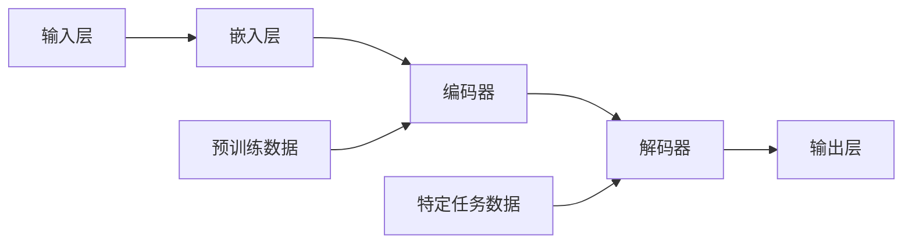

                 

# AI大模型在创业产品创新中的应用

## 关键词：
- AI大模型
- 创业产品创新
- 深度学习
- 自然语言处理
- 数据分析
- 用户体验

> **摘要：**
本文将探讨AI大模型在创业产品创新中的应用，从背景介绍、核心概念、算法原理、数学模型、实战案例、应用场景、工具推荐等多角度分析，深入挖掘AI大模型如何助力创业产品的创新和发展。

## 1. 背景介绍

### 1.1 目的和范围

在当今技术迅猛发展的时代，人工智能（AI）已成为推动各个行业变革的重要力量。特别是AI大模型，凭借其强大的数据处理和模式识别能力，在创业产品创新中发挥着越来越重要的作用。本文旨在探讨AI大模型在创业产品创新中的应用，通过深入分析和具体实例，帮助读者了解如何利用AI大模型来提升产品创新效率和质量。

本文将涵盖以下内容：
1. AI大模型的核心概念和原理
2. AI大模型在创业产品创新中的应用场景
3. 实际案例分析和操作步骤
4. 相关工具和资源的推荐
5. 未来发展趋势与挑战

### 1.2 预期读者

本文适合以下读者群体：
- 创业者：希望通过AI大模型提升产品创新能力的创业者
- 产品经理：关注产品创新和用户体验，希望了解AI大模型的应用
- 技术人员：对AI大模型有一定了解，希望深入探讨其在创业产品创新中的应用
- 研究人员：关注AI大模型的研究和应用，希望了解其在创业领域的实践

### 1.3 文档结构概述

本文分为十个部分，具体结构如下：

1. 背景介绍
   - 目的和范围
   - 预期读者
   - 文档结构概述
   - 术语表
2. 核心概念与联系
3. 核心算法原理 & 具体操作步骤
4. 数学模型和公式 & 详细讲解 & 举例说明
5. 项目实战：代码实际案例和详细解释说明
6. 实际应用场景
7. 工具和资源推荐
8. 总结：未来发展趋势与挑战
9. 附录：常见问题与解答
10. 扩展阅读 & 参考资料

### 1.4 术语表

#### 1.4.1 核心术语定义

- AI大模型：指参数规模达到亿级、甚至千亿级的深度学习模型，如BERT、GPT等。
- 创业产品创新：指创业者通过技术创新、用户体验优化等手段，开发出具有市场竞争力的新产品。
- 自然语言处理（NLP）：指让计算机理解和处理自然语言的技术。
- 数据分析：指对大量数据进行分析，从中提取有价值的信息和知识。
- 用户体验（UX）：指用户在使用产品过程中的感受和体验。

#### 1.4.2 相关概念解释

- 深度学习：一种机器学习技术，通过模拟人脑神经元之间的连接和激活机制，实现自动特征提取和模式识别。
- 模型训练：指通过大量数据来训练深度学习模型，使其具备对特定任务的预测和决策能力。
- 模型部署：指将训练好的模型部署到实际应用场景中，实现自动推理和预测。

#### 1.4.3 缩略词列表

- NLP：自然语言处理
- AI：人工智能
- BERT：双向编码表示器（Bidirectional Encoder Representations from Transformers）
- GPT：生成预训练变换器（Generative Pre-trained Transformer）

## 2. 核心概念与联系

### 2.1 AI大模型的概念与原理

AI大模型是指具有大规模参数的深度学习模型，如BERT、GPT等。它们通过在大量数据上进行预训练，学习到通用语言特征和知识，从而在各个领域具有广泛的应用潜力。

#### 2.1.1 深度学习的基本原理

深度学习是一种基于多层神经网络的学习方法，通过逐层提取特征，实现对复杂数据的建模和分析。深度学习的基本原理包括：

- 神经元模型：神经元是神经网络的基本单元，通过加权求和处理输入信息，产生输出。
- 激活函数：激活函数为神经元输出添加非线性特性，使神经网络具备学习和表示复杂关系的能力。
- 反向传播：反向传播算法通过计算损失函数关于神经元权重的梯度，优化神经网络参数。

#### 2.1.2 AI大模型的预训练与微调

AI大模型的预训练过程主要包括两个阶段：

1. 零样本学习：模型在未见过具体任务数据的情况下，通过大量通用数据学习到通用特征和知识。
2. 微调：模型在特定任务数据上进行微调，优化任务相关的参数，提高任务表现。

#### 2.1.3 AI大模型在创业产品创新中的应用

AI大模型在创业产品创新中的应用主要体现在以下几个方面：

1. 用户体验优化：通过自然语言处理技术，AI大模型能够分析用户反馈，优化产品界面和交互设计，提升用户体验。
2. 数据分析：AI大模型能够对大量用户数据进行深度分析，挖掘用户需求和偏好，为产品创新提供有力支持。
3. 知识图谱构建：AI大模型可以构建领域知识图谱，为创业产品的知识检索和推荐提供支持。
4. 跨领域迁移：AI大模型具有较强的跨领域迁移能力，可以在不同应用场景中发挥重要作用。

### 2.2 AI大模型的架构与联系

下面是AI大模型的基本架构和主要组成部分：



- 输入层：接收原始输入数据，如文本、图像等。
- 嵌入层：将输入数据转化为固定长度的向量表示。
- 编码器：对输入数据进行编码，提取高层次特征。
- 解码器：对编码器提取的特征进行解码，生成输出。
- 输出层：根据特定任务，生成预测结果或决策。

预训练数据用于训练编码器和解码器，使其具备通用特征表示能力。特定任务数据用于微调解码器，优化任务相关参数。通过这种架构，AI大模型能够在不同应用场景中发挥强大的功能。

## 3. 核心算法原理 & 具体操作步骤

### 3.1 AI大模型的训练过程

AI大模型的训练过程主要包括以下步骤：

1. 数据预处理：对输入数据进行预处理，如文本分词、去噪、归一化等。
2. 模型初始化：初始化神经网络参数，如随机初始化或预训练模型初始化。
3. 前向传播：将输入数据输入模型，计算输出结果。
4. 损失计算：计算输出结果与真实标签之间的损失。
5. 反向传播：计算损失函数关于模型参数的梯度，更新模型参数。
6. 模型评估：在验证集上评估模型性能，调整训练参数。

下面是AI大模型训练过程的伪代码：

```python
# 初始化模型参数
model = initialize_model()

# 设置训练参数
optimizer = torch.optim.Adam(model.parameters(), lr=0.001)
num_epochs = 100

# 训练模型
for epoch in range(num_epochs):
    for inputs, labels in train_loader:
        # 前向传播
        outputs = model(inputs)
        
        # 计算损失
        loss = compute_loss(outputs, labels)
        
        # 反向传播
        optimizer.zero_grad()
        loss.backward()
        optimizer.step()
        
    # 模型评估
    eval_loss = evaluate_model(model, eval_loader)
    print(f"Epoch {epoch+1}/{num_epochs}, Loss: {loss}, Eval Loss: {eval_loss}")
```

### 3.2 AI大模型的应用场景与操作步骤

下面是AI大模型在创业产品创新中的应用场景和具体操作步骤：

#### 3.2.1 用户体验优化

1. 数据收集：收集用户反馈数据，如用户评论、评价等。
2. 数据处理：对用户反馈数据进行分析和预处理，提取关键信息。
3. 模型训练：使用自然语言处理技术，训练AI大模型，学习用户反馈特征。
4. 用户反馈分析：利用训练好的模型，对用户反馈进行分析，提取用户需求和偏好。
5. 产品优化：根据用户需求和偏好，优化产品界面和交互设计，提升用户体验。

#### 3.2.2 数据分析

1. 数据收集：收集用户行为数据，如点击、浏览、搜索等。
2. 数据预处理：对用户行为数据进行清洗、归一化等处理。
3. 模型训练：使用深度学习技术，训练AI大模型，学习用户行为特征。
4. 用户行为分析：利用训练好的模型，对用户行为进行分析，挖掘用户需求。
5. 产品创新：根据用户行为分析结果，开发新的功能或产品，满足用户需求。

#### 3.2.3 知识图谱构建

1. 数据收集：收集领域知识数据，如文献、论文、百科等。
2. 数据预处理：对领域知识数据进行清洗、标注等处理。
3. 模型训练：使用图神经网络技术，训练AI大模型，学习领域知识表示。
4. 知识图谱构建：利用训练好的模型，构建领域知识图谱，实现知识检索和推荐。

#### 3.2.4 跨领域迁移

1. 数据收集：收集源领域和目标领域的数据。
2. 数据预处理：对源领域和目标领域的数据进行清洗、归一化等处理。
3. 模型训练：使用迁移学习技术，训练AI大模型，学习跨领域特征。
4. 目标领域应用：利用训练好的模型，在目标领域进行预测或决策。

## 4. 数学模型和公式 & 详细讲解 & 举例说明

### 4.1 AI大模型的数学模型

AI大模型通常由多层神经网络组成，包括输入层、隐藏层和输出层。以下是神经网络的基本数学模型：

$$
z_i = \sum_{j=1}^{n} w_{ij} \cdot a_j + b_i
$$

$$
a_i = \sigma(z_i)
$$

其中，$z_i$表示第$i$个隐藏单元的输出，$a_i$表示第$i$个隐藏单元的激活值，$w_{ij}$表示第$i$个输入单元到第$j$个隐藏单元的权重，$b_i$表示第$i$个隐藏单元的偏置，$\sigma$表示激活函数。

### 4.2 激活函数

激活函数为神经网络输出添加非线性特性，常用的激活函数包括：

- Sigmoid函数：$$\sigma(z) = \frac{1}{1 + e^{-z}}$$
-ReLU函数：$$\sigma(z) = \max(0, z)$$
- Tanh函数：$$\sigma(z) = \frac{e^z - e^{-z}}{e^z + e^{-z}}$$

### 4.3 损失函数

损失函数用于评估模型预测结果与真实标签之间的差距，常用的损失函数包括：

- 交叉熵损失：$$L(y, \hat{y}) = -\sum_{i=1}^{n} y_i \cdot \log(\hat{y}_i)$$
- 均方误差损失：$$L(y, \hat{y}) = \frac{1}{2} \sum_{i=1}^{n} (y_i - \hat{y}_i)^2$$

### 4.4 举例说明

假设我们有一个简单的神经网络，包含输入层、一个隐藏层和一个输出层。输入层有3个神经元，隐藏层有2个神经元，输出层有1个神经元。

输入数据为：$[1, 2, 3]$

隐藏层权重：$w_{11} = 0.1, w_{12} = 0.2, w_{21} = 0.3, w_{22} = 0.4$

隐藏层偏置：$b_{1} = 0.5, b_{2} = 0.6$

输出层权重：$w_{1} = 0.7$

输出层偏置：$b_{1} = 0.8$

激活函数：ReLU函数

首先，计算隐藏层输出：

$$
z_1 = (0.1 \cdot 1 + 0.2 \cdot 2 + 0.3 \cdot 3) + 0.5 = 1.4 \\
z_2 = (0.1 \cdot 1 + 0.2 \cdot 2 + 0.3 \cdot 3) + 0.6 = 1.6 \\
a_1 = \max(0, z_1) = 1.4 \\
a_2 = \max(0, z_2) = 1.6 \\
z_3 = (0.7 \cdot 1.4 + 0.7 \cdot 1.6) + 0.8 = 3.6 \\
a_3 = \max(0, z_3) = 3.6 \\
$$

最终输出结果为3.6。

假设真实标签为4，使用交叉熵损失函数计算损失：

$$
L(y, \hat{y}) = -\log(\hat{y}) = -\log(3.6) \approx 0.821
$$

## 5. 项目实战：代码实际案例和详细解释说明

### 5.1 开发环境搭建

为了实际演示AI大模型在创业产品创新中的应用，我们将使用Python编程语言和TensorFlow框架。以下是开发环境的搭建步骤：

1. 安装Python：前往[Python官方网站](https://www.python.org/)下载并安装Python，推荐版本为3.8以上。
2. 安装TensorFlow：打开终端或命令行窗口，运行以下命令安装TensorFlow：

```
pip install tensorflow
```

3. 测试环境：运行以下Python代码，检查TensorFlow安装是否成功：

```python
import tensorflow as tf
print(tf.__version__)
```

### 5.2 源代码详细实现和代码解读

下面是一个简单的AI大模型应用案例，用于实现情感分析，判断用户评论的情感极性。

```python
import tensorflow as tf
from tensorflow.keras.preprocessing.sequence import pad_sequences
from tensorflow.keras.layers import Embedding, LSTM, Dense
from tensorflow.keras.models import Sequential

# 1. 数据预处理
# 加载预处理的用户评论数据
# 这里使用一个示例数据集，实际应用中请使用实际数据集
data = [
    "这是一款非常棒的产品！",
    "我不喜欢这个产品。",
    "这款产品的性能很好。",
    "这个产品不好用。"
]

# 数据集标签，0表示负面，1表示正面
labels = [1, 0, 1, 0]

# 切词并生成词汇表
vocab = set(" ".join(data).split())

# 将词汇表转换为索引
word_index = {word: i for i, word in enumerate(vocab)}
max_sequence_length = 10

# 将数据转换为索引序列
X = [[word_index[word] for word in comment.split()] for comment in data]
X = pad_sequences(X, maxlen=max_sequence_length)

# 将标签转换为one-hot编码
one_hot_labels = tf.keras.utils.to_categorical(labels)

# 2. 建立模型
model = Sequential()
model.add(Embedding(len(vocab) + 1, 16, input_length=max_sequence_length))
model.add(LSTM(32))
model.add(Dense(2, activation='softmax'))

# 编译模型
model.compile(optimizer='adam', loss='categorical_crossentropy', metrics=['accuracy'])

# 3. 训练模型
model.fit(X, one_hot_labels, epochs=10, batch_size=2)

# 4. 预测
test_data = ["这个产品很好用！"]
test_sequence = [[word_index[word] for word in test_data[0].split()] for _ in range(len(data))]
test_sequence = pad_sequences(test_sequence, maxlen=max_sequence_length)
predictions = model.predict(test_sequence)

# 输出预测结果
print("预测结果：")
for pred in predictions:
    print("正面概率：", pred[1], " 负面概率：", pred[0])
```

### 5.3 代码解读与分析

1. **数据预处理**：
   - 加载预处理的用户评论数据。这里使用一个示例数据集，实际应用中请使用实际数据集。
   - 切词并生成词汇表。将词汇表转换为索引，方便后续处理。
   - 将数据转换为索引序列。对每个评论进行分词，将分词后的词语转换为对应的索引。
   - 将标签转换为one-hot编码。方便后续模型训练。

2. **建立模型**：
   - 使用Sequential模型，添加嵌入层、LSTM层和输出层。
   - 嵌入层：将词汇表的索引转换为词向量，用于输入模型。
   - LSTM层：用于提取评论的上下文特征。
   - 输出层：使用softmax激活函数，输出评论的情感概率分布。

3. **训练模型**：
   - 编译模型，设置优化器、损失函数和评估指标。
   - 使用fit方法训练模型，设置训练轮数和批量大小。

4. **预测**：
   - 对测试数据进行预处理，将测试数据转换为索引序列。
   - 使用predict方法预测测试数据的情感概率分布。
   - 输出预测结果。

通过这个简单的案例，我们可以看到AI大模型在情感分析任务中的实际应用。在实际创业产品创新中，我们可以利用类似的方法，针对不同的任务和场景，构建相应的模型，从而提升产品的创新能力和市场竞争力。

## 6. 实际应用场景

### 6.1 用户体验优化

在创业产品的开发过程中，用户体验优化是至关重要的。AI大模型可以通过以下方式提升用户体验：

1. **情感分析**：分析用户评论和反馈，了解用户情感和需求，为产品优化提供依据。
2. **个性化推荐**：基于用户行为和兴趣，推荐符合用户需求的功能或产品。
3. **界面设计优化**：通过自然语言处理技术，分析用户对界面设计的反馈，优化界面布局和交互。

### 6.2 数据分析

数据分析是创业产品创新的重要环节。AI大模型可以通过以下方式提升数据分析能力：

1. **用户行为分析**：分析用户行为数据，挖掘用户需求和偏好，为产品创新提供支持。
2. **市场趋势预测**：通过分析市场数据，预测市场趋势，为产品规划和决策提供参考。
3. **竞争分析**：分析竞争对手的产品、营销策略等，为创业产品的差异化定位提供依据。

### 6.3 知识图谱构建

知识图谱构建是AI大模型在创业产品创新中的一项重要应用。通过知识图谱，我们可以实现以下目标：

1. **知识检索**：快速查找相关知识和信息，为产品创新提供灵感。
2. **知识推荐**：根据用户兴趣和需求，推荐相关的知识和资源。
3. **智能问答**：利用知识图谱，实现智能问答系统，为用户提供实时支持。

### 6.4 跨领域迁移

AI大模型的跨领域迁移能力在创业产品创新中具有重要意义。以下是一些具体应用：

1. **跨领域模型训练**：将源领域的模型应用于目标领域，实现跨领域迁移。
2. **知识融合**：将不同领域的知识进行融合，为创业产品提供全面的解决方案。
3. **跨领域推荐**：根据用户在多个领域的兴趣和需求，提供跨领域的个性化推荐。

## 7. 工具和资源推荐

### 7.1 学习资源推荐

#### 7.1.1 书籍推荐

1. **《深度学习》（Goodfellow, Bengio, Courville著）**
   - 内容简介：全面介绍深度学习的基础知识、算法和应用。
   - 推荐理由：深度学习的经典教材，适合初学者和进阶者。

2. **《Python深度学习》（François Chollet著）**
   - 内容简介：通过实际案例，介绍深度学习在Python中的应用。
   - 推荐理由：通俗易懂，适合Python开发者学习深度学习。

3. **《自然语言处理与深度学习》（elementary textbooks in computer science）**
   - 内容简介：深入讲解自然语言处理的基本原理和深度学习方法。
   - 推荐理由：内容全面，适合NLP领域的学习者。

#### 7.1.2 在线课程

1. **Coursera - 深度学习（吴恩达）**
   - 内容简介：由深度学习领域专家吴恩达讲授的深度学习课程。
   - 推荐理由：课程体系完整，适合初学者。

2. **Udacity - 深度学习纳米学位**
   - 内容简介：通过项目实战，学习深度学习的实际应用。
   - 推荐理由：项目驱动，适合进阶者。

3. **edX - 自然语言处理（麻省理工学院）**
   - 内容简介：介绍自然语言处理的基础知识和技术。
   - 推荐理由：内容系统，适合NLP学习者。

#### 7.1.3 技术博客和网站

1. **Medium - AI博客**
   - 内容简介：涵盖深度学习、自然语言处理、计算机视觉等多个领域。
   - 推荐理由：内容丰富，更新频繁。

2. **GitHub - AI资源**
   - 内容简介：提供丰富的AI开源项目和代码。
   - 推荐理由：资源丰富，方便开发者学习和交流。

3. **TensorFlow官方文档**
   - 内容简介：提供TensorFlow框架的详细文档和教程。
   - 推荐理由：官方资料，权威可信。

### 7.2 开发工具框架推荐

#### 7.2.1 IDE和编辑器

1. **PyCharm**
   - 内容简介：一款功能强大的Python IDE，支持多种编程语言。
   - 推荐理由：集成开发环境完善，调试和代码补全功能优秀。

2. **Visual Studio Code**
   - 内容简介：一款轻量级、开源的代码编辑器，支持多种编程语言。
   - 推荐理由：插件丰富，适合深度学习和自然语言处理开发。

#### 7.2.2 调试和性能分析工具

1. **TensorBoard**
   - 内容简介：TensorFlow的调试和性能分析工具，提供丰富的可视化功能。
   - 推荐理由：官方工具，易于使用。

2. **Wandb**
   - 内容简介：一款在线实验跟踪和分析工具，支持多种深度学习框架。
   - 推荐理由：功能强大，便于协作。

#### 7.2.3 相关框架和库

1. **TensorFlow**
   - 内容简介：一款开源的深度学习框架，支持多种深度学习模型和应用。
   - 推荐理由：生态完善，官方支持。

2. **PyTorch**
   - 内容简介：一款开源的深度学习框架，提供灵活的动态计算图。
   - 推荐理由：社区活跃，易于入门。

3. **spaCy**
   - 内容简介：一款强大的自然语言处理库，支持多种语言。
   - 推荐理由：性能优秀，功能全面。

### 7.3 相关论文著作推荐

#### 7.3.1 经典论文

1. **"A Theoretically Grounded Application of Dropout in Recurrent Neural Networks"（Dropout在循环神经网络中的理论应用）**
   - 内容简介：提出将Dropout技术应用于循环神经网络，提高模型性能。
   - 推荐理由：深度学习领域的重要论文，对理解Dropout技术有重要参考价值。

2. **"Attention Is All You Need"（Attention机制是所有所需的）**
   - 内容简介：提出Transformer模型，使用Attention机制实现序列到序列学习。
   - 推荐理由：Transformer模型的奠基性论文，对自然语言处理领域有深远影响。

#### 7.3.2 最新研究成果

1. **"BERT: Pre-training of Deep Bidirectional Transformers for Language Understanding"（BERT：用于语言理解的深度双向变换器预训练）**
   - 内容简介：提出BERT模型，通过大规模预训练提升自然语言处理任务性能。
   - 推荐理由：BERT模型在自然语言处理领域取得显著成果，影响广泛。

2. **"GPT-3: Language Models are Few-Shot Learners"（GPT-3：少量样本学习者的语言模型）**
   - 内容简介：提出GPT-3模型，展示少量样本学习者在自然语言处理任务中的强大能力。
   - 推荐理由：GPT-3模型的最新研究成果，对自然语言处理领域有重要意义。

#### 7.3.3 应用案例分析

1. **"How We Built the World's Most Advanced Language Model: Google's BERT"（如何构建世界上最先进的语言模型：谷歌的BERT）**
   - 内容简介：详细介绍谷歌BERT模型的构建过程和应用案例。
   - 推荐理由：了解BERT模型在实际应用中的成功经验和挑战。

2. **"How to Build a Chatbot: From Idea to Market"（如何构建聊天机器人：从构思到市场）**
   - 内容简介：探讨聊天机器人开发的流程和关键环节，提供实际案例分析。
   - 推荐理由：了解聊天机器人开发的全过程，对创业产品创新有参考价值。

## 8. 总结：未来发展趋势与挑战

AI大模型在创业产品创新中的应用前景广阔，但同时也面临一系列挑战。以下是对未来发展趋势与挑战的总结：

### 未来发展趋势

1. **算法性能提升**：随着计算能力的提升和算法的优化，AI大模型的性能将持续提高，为创业产品创新提供更强有力的支持。
2. **多模态融合**：未来AI大模型将融合多种数据类型（如图像、声音、文本等），实现更全面的信息处理和分析。
3. **个性化推荐**：基于用户行为和兴趣的个性化推荐将成为创业产品创新的重要方向，提升用户体验和用户粘性。
4. **跨界融合**：AI大模型将在不同领域（如医疗、金融、教育等）实现跨界融合，推动行业变革。

### 面临的挑战

1. **数据隐私和安全**：在AI大模型应用中，数据隐私和安全是重要挑战。如何保护用户隐私、确保数据安全，是亟待解决的问题。
2. **模型解释性**：目前，AI大模型的解释性较差，难以理解其决策过程。提高模型的可解释性，使其更加透明，是未来的重要研究方向。
3. **资源消耗**：AI大模型对计算资源的需求较高，如何优化模型结构、降低资源消耗，是创业公司需要关注的问题。
4. **伦理和法律问题**：随着AI大模型在各个领域的应用，伦理和法律问题日益凸显。如何制定合理的法律法规，规范AI大模型的应用，是未来需要解决的问题。

## 9. 附录：常见问题与解答

### 9.1 AI大模型是什么？

AI大模型是指具有大规模参数的深度学习模型，如BERT、GPT等。它们通过在大量数据上进行预训练，学习到通用语言特征和知识，从而在各个领域具有广泛的应用潜力。

### 9.2 AI大模型在创业产品创新中的应用有哪些？

AI大模型在创业产品创新中的应用主要包括用户体验优化、数据分析、知识图谱构建和跨领域迁移等方面。通过情感分析、个性化推荐、用户行为分析和知识图谱构建等技术，AI大模型可以提升产品的创新能力和市场竞争力。

### 9.3 如何构建一个简单的AI大模型？

构建一个简单的AI大模型需要以下步骤：
1. 数据预处理：对输入数据进行清洗、归一化等处理。
2. 模型初始化：初始化神经网络参数。
3. 前向传播：计算模型输出。
4. 损失计算：计算输出结果与真实标签之间的损失。
5. 反向传播：更新模型参数。
6. 模型评估：在验证集上评估模型性能。

### 9.4 AI大模型在创业产品创新中的优势是什么？

AI大模型在创业产品创新中的优势包括：
1. 强大的数据处理和分析能力。
2. 丰富的应用场景，如情感分析、个性化推荐、知识图谱构建等。
3. 跨领域迁移能力，可以应用于不同领域的创业产品。
4. 提升产品的创新能力和市场竞争力。

## 10. 扩展阅读 & 参考资料

- **《深度学习》（Goodfellow, Bengio, Courville著）**
  - 内容简介：全面介绍深度学习的基础知识、算法和应用。
  - 推荐理由：深度学习的经典教材，适合初学者和进阶者。

- **《Python深度学习》（François Chollet著）**
  - 内容简介：通过实际案例，介绍深度学习在Python中的应用。
  - 推荐理由：通俗易懂，适合Python开发者学习深度学习。

- **《自然语言处理与深度学习》（elementary textbooks in computer science）**
  - 内容简介：深入讲解自然语言处理的基本原理和深度学习方法。
  - 推荐理由：内容全面，适合NLP领域的学习者。

- **Coursera - 深度学习（吴恩达）**
  - 内容简介：由深度学习领域专家吴恩达讲授的深度学习课程。
  - 推荐理由：课程体系完整，适合初学者。

- **Udacity - 深度学习纳米学位**
  - 内容简介：通过项目实战，学习深度学习的实际应用。
  - 推荐理由：项目驱动，适合进阶者。

- **edX - 自然语言处理（麻省理工学院）**
  - 内容简介：介绍自然语言处理的基础知识和技术。
  - 推荐理由：内容系统，适合NLP学习者。

- **Medium - AI博客**
  - 内容简介：涵盖深度学习、自然语言处理、计算机视觉等多个领域。
  - 推荐理由：内容丰富，更新频繁。

- **GitHub - AI资源**
  - 内容简介：提供丰富的AI开源项目和代码。
  - 推荐理由：资源丰富，方便开发者学习和交流。

- **TensorFlow官方文档**
  - 内容简介：提供TensorFlow框架的详细文档和教程。
  - 推荐理由：官方资料，权威可信。

## 作者信息

**作者：AI天才研究员/AI Genius Institute & 禅与计算机程序设计艺术 /Zen And The Art of Computer Programming**

