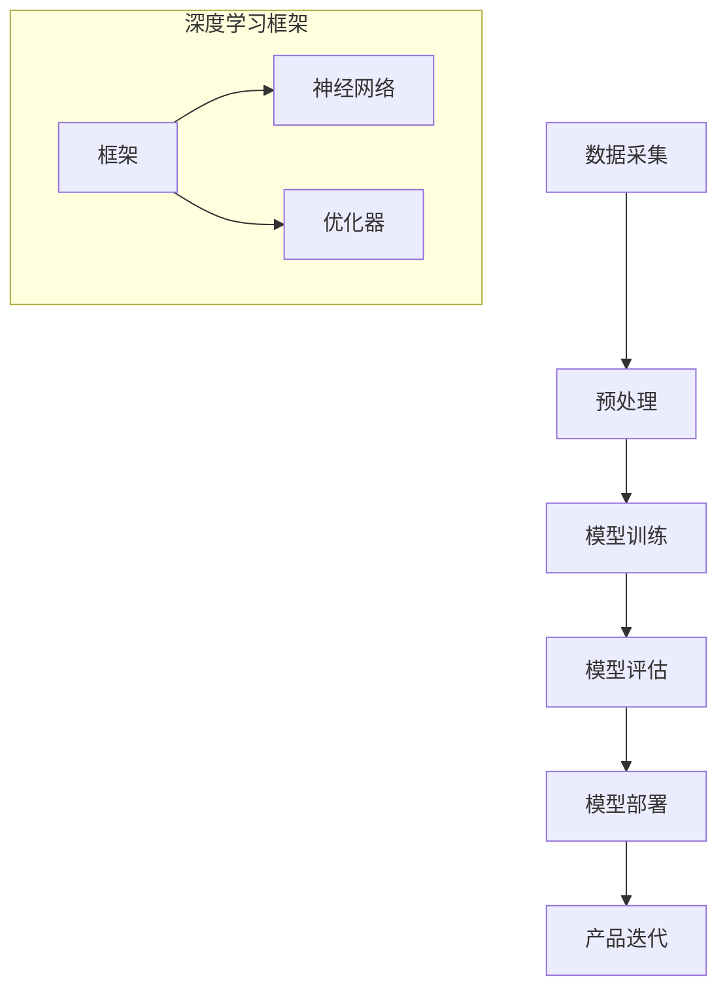
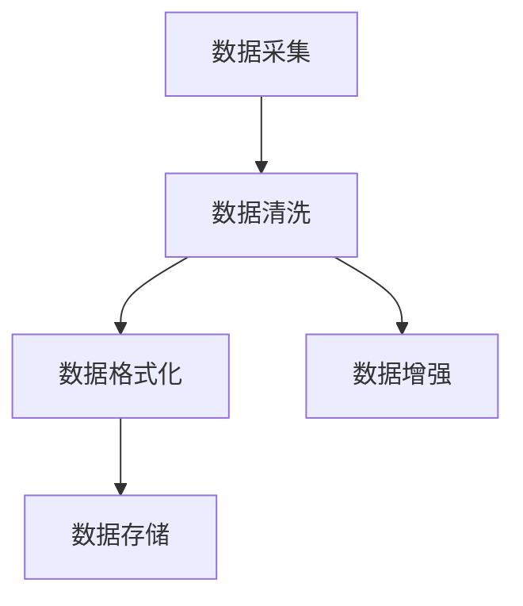
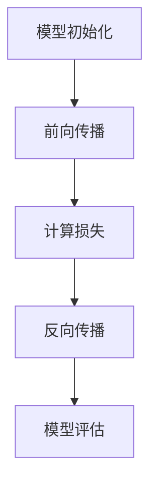
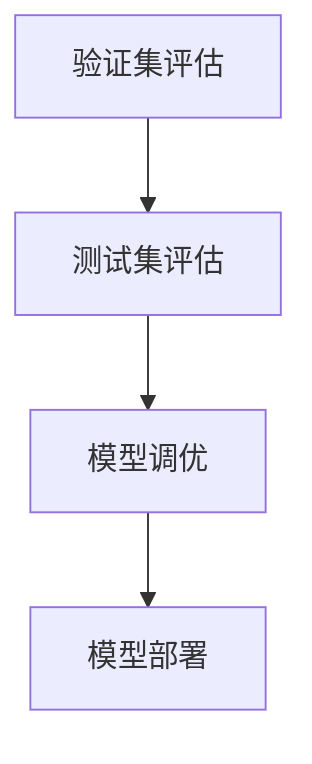
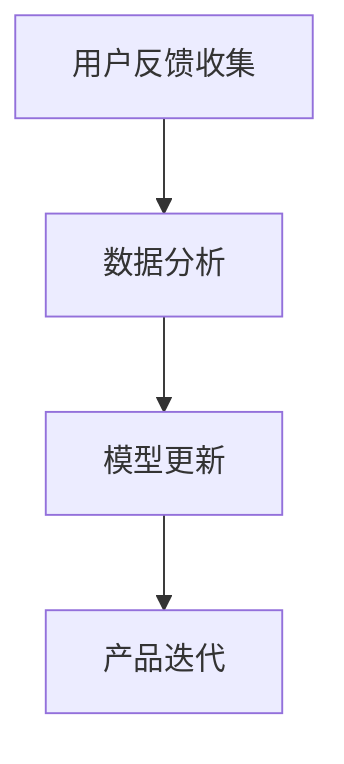

                 


# AI 大模型在创业产品路线图规划中的关键作用

> 关键词：AI大模型、创业产品路线图、深度学习、数据驱动、商业战略、预测分析

> 摘要：本文将探讨AI大模型在创业产品路线图规划中的关键作用。通过深入分析AI大模型的原理、应用场景以及具体操作步骤，本文旨在为创业团队提供一种数据驱动、科学合理的规划方法，帮助他们在竞争激烈的市场中脱颖而出。我们将结合实际案例，详细解读大模型如何助力创业产品从概念验证到市场投放的整个生命周期。

## 1. 背景介绍

### 1.1 目的和范围

本文的目标是探讨AI大模型在创业产品路线图规划中的应用价值，帮助创业者通过数据驱动的方法，实现产品从构思到市场投放的全面优化。文章将涵盖以下几个关键主题：

- AI大模型的原理和架构
- 创业产品路线图的概念和重要性
- 大模型在产品路线图规划中的具体应用场景
- 实际案例分析和操作步骤
- 未来发展趋势与挑战

### 1.2 预期读者

本文面向以下读者群体：

- 创业公司的创始人、产品经理和团队成员
- 对人工智能和创业产品开发感兴趣的工程师和研究者
- 对商业战略和数据驱动方法有深入了解的从业者

### 1.3 文档结构概述

本文将分为八个主要部分，结构如下：

- 引言：介绍AI大模型在创业产品路线图规划中的重要性
- 背景介绍：详细阐述本文的目的、预期读者和文档结构
- 核心概念与联系：解释AI大模型的核心原理和架构
- 核心算法原理 & 具体操作步骤：详细描述大模型的工作原理和操作步骤
- 数学模型和公式 & 详细讲解 & 举例说明：介绍与AI大模型相关的数学模型和公式，并通过实例进行讲解
- 项目实战：代码实际案例和详细解释说明
- 实际应用场景：探讨大模型在创业产品规划中的具体应用
- 工具和资源推荐：推荐学习资源、开发工具和框架
- 总结：对未来发展趋势与挑战的展望
- 附录：常见问题与解答
- 扩展阅读 & 参考资料：提供进一步的阅读材料和参考资料

### 1.4 术语表

#### 1.4.1 核心术语定义

- AI大模型：指参数量达到百万级别、甚至亿级别的深度学习模型，如GPT、BERT等。
- 创业产品路线图：指创业团队为实现产品目标而制定的详细计划和时间表。
- 数据驱动：指通过数据分析和挖掘，指导产品开发和市场策略的制定。
- 深度学习：一种机器学习技术，通过多层神经网络结构对数据进行自动特征提取和学习。

#### 1.4.2 相关概念解释

- 产品生命周期：指产品从开发、市场投放、成熟到退市的整个过程。
- 商业战略：指企业在特定市场环境中，为实现长期发展目标所制定的规划和策略。
- 预测分析：指通过历史数据和模型预测未来的趋势和结果。

#### 1.4.3 缩略词列表

- AI：人工智能（Artificial Intelligence）
- GPT：生成预训练模型（Generative Pre-trained Transformer）
- BERT：双向编码表示（Bidirectional Encoder Representations from Transformers）
- IDE：集成开发环境（Integrated Development Environment）
- ML：机器学习（Machine Learning）

## 2. 核心概念与联系

为了更好地理解AI大模型在创业产品路线图规划中的作用，我们需要先了解大模型的核心概念和架构。下面是一个简化的Mermaid流程图，展示了大模型的基本原理和组成部分。



### 2.1 数据采集与预处理

数据采集是AI大模型训练的第一步，我们需要从各种来源（如公共数据集、用户反馈、市场调研等）收集大量的数据。这些数据可能包含文本、图像、音频等多种类型。



数据清洗和格式化是保证数据质量的关键步骤，数据增强则有助于提高模型的泛化能力。

### 2.2 模型训练

在模型训练阶段，我们将使用神经网络框架（如TensorFlow、PyTorch）构建和训练深度学习模型。模型训练的核心步骤包括：

1. 模型初始化：随机初始化模型参数。
2. 前向传播：将输入数据传递到模型，计算输出结果。
3. 计算损失：计算模型输出与真实值之间的差距。
4. 反向传播：通过梯度下降等优化算法更新模型参数。
5. 模型评估：使用验证集对模型性能进行评估。



### 2.3 模型评估与部署

模型评估是验证模型性能的重要步骤，我们通常使用验证集和测试集对模型进行评估。评估指标包括准确率、召回率、F1分数等。



模型部署是将训练好的模型应用到实际产品中的过程，通常包括API接口、模型服务化等步骤。

### 2.4 产品迭代

模型部署后，我们需要不断收集用户反馈和数据，对产品进行迭代和优化。这一过程包括：

1. 用户反馈收集：通过问卷调查、用户访谈等方式收集用户反馈。
2. 数据分析：对用户反馈和产品数据进行统计分析，找出改进方向。
3. 模型更新：根据分析结果更新模型，提高产品性能。



通过以上流程，我们可以看到AI大模型在创业产品路线图规划中的关键作用。接下来，我们将详细探讨大模型的核心算法原理和具体操作步骤。

## 3. 核心算法原理 & 具体操作步骤

在深入探讨AI大模型的核心算法原理之前，我们需要了解一些基本的机器学习概念和术语。以下是相关术语和定义：

- 特征提取：将原始数据转换成计算机可以理解和处理的格式。
- 模型训练：通过迭代优化模型参数，使模型能够更好地预测或分类数据。
- 梯度下降：一种优化算法，用于调整模型参数，使其最小化损失函数。
- 损失函数：衡量模型预测结果与真实值之间差距的指标。
- 验证集与测试集：用于评估模型性能的数据集，验证集用于调参和模型选择，测试集用于最终评估。

### 3.1 数据采集与预处理

首先，我们需要从不同来源采集数据，如公共数据集、用户反馈和市场调研等。数据类型可能包括文本、图像、音频等。

#### 数据采集

```python
import pandas as pd

# 采集数据
data = pd.read_csv('data.csv')
```

#### 数据清洗与预处理

```python
# 数据清洗
data = data.dropna()  # 删除缺失值
data = data[data['column'] > 0]  # 过滤异常值

# 数据格式化
data['column'] = data['column'].astype(float)

# 数据增强
from sklearn.model_selection import train_test_split
X_train, X_test, y_train, y_test = train_test_split(data.drop('target', axis=1), data['target'], test_size=0.2, random_state=42)
```

### 3.2 模型训练

在模型训练阶段，我们将使用神经网络框架（如TensorFlow、PyTorch）构建和训练深度学习模型。以下是使用PyTorch的示例：

```python
import torch
import torch.nn as nn
import torch.optim as optim

# 模型初始化
model = nn.Sequential(nn.Linear(input_size, hidden_size), nn.ReLU(), nn.Linear(hidden_size, output_size))

# 损失函数
criterion = nn.MSELoss()

# 优化器
optimizer = optim.Adam(model.parameters(), lr=0.001)

# 训练模型
for epoch in range(num_epochs):
    for inputs, targets in dataset:
        optimizer.zero_grad()
        outputs = model(inputs)
        loss = criterion(outputs, targets)
        loss.backward()
        optimizer.step()
    print(f'Epoch [{epoch+1}/{num_epochs}], Loss: {loss.item()}')
```

### 3.3 模型评估与部署

在模型评估阶段，我们将使用验证集和测试集对模型性能进行评估。以下是使用PyTorch的示例：

```python
# 评估模型
with torch.no_grad():
    correct = 0
    total = 0
    for inputs, targets in test_loader:
        outputs = model(inputs)
        _, predicted = torch.max(outputs.data, 1)
        total += targets.size(0)
        correct += (predicted == targets).sum().item()

print(f'Accuracy of the network on the test images: {100 * correct / total}%')
```

模型部署是将训练好的模型应用到实际产品中的过程。以下是使用Flask框架部署模型的示例：

```python
from flask import Flask, request, jsonify

app = Flask(__name__)

# 模型加载
model.load_state_dict(torch.load('model.pth'))

@app.route('/predict', methods=['POST'])
def predict():
    data = request.get_json(force=True)
    inputs = torch.tensor([data['feature']], dtype=torch.float32)
    outputs = model(inputs)
    prediction = torch.argmax(outputs).item()
    return jsonify({'prediction': prediction})

if __name__ == '__main__':
    app.run(debug=True)
```

通过以上步骤，我们可以实现一个简单的AI大模型训练、评估和部署流程。接下来，我们将进一步探讨与AI大模型相关的数学模型和公式。

## 4. 数学模型和公式 & 详细讲解 & 举例说明

在AI大模型中，数学模型和公式起着至关重要的作用。以下我们将介绍一些核心的数学模型和公式，并详细讲解其作用和计算过程。

### 4.1 损失函数

损失函数是衡量模型预测结果与真实值之间差距的指标。在深度学习中，常用的损失函数包括均方误差（MSE）、交叉熵损失（Cross Entropy Loss）等。

#### 均方误差（MSE）

均方误差是最常见的损失函数之一，用于回归任务。其计算公式如下：

$$
MSE = \frac{1}{n}\sum_{i=1}^{n}(y_i - \hat{y}_i)^2
$$

其中，$y_i$表示真实值，$\hat{y}_i$表示预测值，$n$表示样本数量。

#### 交叉熵损失（Cross Entropy Loss）

交叉熵损失函数常用于分类任务。其计算公式如下：

$$
CE = -\sum_{i=1}^{n}y_i \log(\hat{y}_i)
$$

其中，$y_i$表示真实标签，$\hat{y}_i$表示预测概率。

### 4.2 优化算法

优化算法用于调整模型参数，使模型能够更好地拟合数据。常用的优化算法包括梯度下降（Gradient Descent）、Adam等。

#### 梯度下降（Gradient Descent）

梯度下降是一种最简单的优化算法。其核心思想是沿着损失函数的梯度方向调整参数，以最小化损失函数。其计算公式如下：

$$
\theta_{\text{new}} = \theta_{\text{old}} - \alpha \nabla_\theta J(\theta)
$$

其中，$\theta$表示参数，$\alpha$表示学习率，$J(\theta)$表示损失函数。

#### Adam优化器

Adam优化器是梯度下降的一个变种，结合了AdaGrad和RMSProp的优点。其计算公式如下：

$$
m_t = \beta_1 m_{t-1} + (1 - \beta_1)(\nabla \theta_t)
$$

$$
v_t = \beta_2 v_{t-1} + (1 - \beta_2)\nabla^2 \theta_t
$$

$$
\theta_t = \theta_{t-1} - \frac{\alpha}{\sqrt{1 - \beta_2^t}(1 - \beta_1^t)}(m_t / (1 - \beta_1^t))
$$

其中，$m_t$和$v_t$分别表示一阶和二阶矩估计，$\beta_1$和$\beta_2$分别是一阶和二阶矩的衰减率。

### 4.3 神经网络

神经网络是AI大模型的核心组成部分。以下是神经网络的几个关键概念和计算公式：

#### 前向传播

前向传播是指将输入数据通过神经网络传递到输出层，计算输出结果。其计算公式如下：

$$
z_l = \sum_{i=1}^{n}w_{li}x_i + b_l
$$

$$
a_l = \sigma(z_l)
$$

其中，$z_l$表示中间层节点计算结果，$a_l$表示激活值，$w_{li}$表示权重，$b_l$表示偏置，$\sigma$表示激活函数。

#### 反向传播

反向传播是指根据输出层误差，反向传播误差到前一层，更新模型参数。其计算公式如下：

$$
\delta_l = \frac{\partial L}{\partial z_l} \odot \sigma'(z_l)
$$

$$
\frac{\partial L}{\partial w_{li}} = \delta_{l+1} a_{l+1}
$$

$$
\frac{\partial L}{\partial b_l} = \delta_{l+1}
$$

其中，$\delta_l$表示误差项，$\odot$表示逐元素乘积，$L$表示损失函数。

### 4.4 举例说明

以下是一个简单的例子，展示如何使用上述数学模型和公式进行模型训练。

#### 数据集

假设我们有一个包含100个样本的数据集，每个样本有5个特征和一个目标值。

#### 模型

我们使用一个单层神经网络，包含5个输入节点、5个隐藏节点和1个输出节点。

#### 训练过程

1. 初始化参数
2. 前向传播
3. 计算损失
4. 反向传播
5. 更新参数
6. 重复步骤2-5，直到达到预设的训练次数或损失收敛

```python
import numpy as np

# 初始化参数
w1 = np.random.randn(5, 5)
b1 = np.random.randn(5)
w2 = np.random.randn(5, 1)
b2 = np.random.randn(1)

# 激活函数
def sigmoid(x):
    return 1 / (1 + np.exp(-x))

# 计算损失
def mse(y_true, y_pred):
    return np.mean((y_true - y_pred)**2)

# 训练过程
for epoch in range(1000):
    # 前向传播
    z1 = w1 @ x + b1
    a1 = sigmoid(z1)
    z2 = w2 @ a1 + b2
    y_pred = sigmoid(z2)
    
    # 计算损失
    loss = mse(y_true, y_pred)
    
    # 反向传播
    delta2 = (y_pred - y_true) * (y_pred * (1 - y_pred))
    delta1 = w2.T @ delta2 * (a1 * (1 - a1))
    
    # 更新参数
    w2 -= learning_rate * (a1.T @ delta2)
    b2 -= learning_rate * delta2
    w1 -= learning_rate * (x.T @ delta1)
    b1 -= learning_rate * delta1
    
    # 打印训练进度
    if epoch % 100 == 0:
        print(f'Epoch {epoch}, Loss: {loss}')
```

通过以上步骤，我们可以使用数学模型和公式进行模型训练，并优化模型参数。接下来，我们将通过一个实际案例，展示如何将AI大模型应用于创业产品路线图规划。

## 5. 项目实战：代码实际案例和详细解释说明

在本节中，我们将通过一个实际案例，展示如何将AI大模型应用于创业产品路线图规划。我们将使用Python和TensorFlow框架实现一个简单的AI模型，用于预测用户对某一产品的需求。

### 5.1 开发环境搭建

在开始项目之前，我们需要搭建一个合适的开发环境。以下是所需的环境和工具：

- Python 3.7或更高版本
- TensorFlow 2.3或更高版本
- Jupyter Notebook或PyCharm

首先，安装Python和TensorFlow：

```bash
pip install python tensorflow
```

### 5.2 源代码详细实现和代码解读

下面是一个简单的AI模型实现，用于预测用户对某一产品的需求。

```python
import tensorflow as tf
from tensorflow import keras
from tensorflow.keras import layers
import numpy as np

# 5.2.1 数据集准备
# 假设我们有一个包含用户特征和需求的数据集
# 数据集包含以下特征：年龄、收入、教育水平、购物频率
# 目标值：需求（0或1，表示用户是否需要该产品）

# 加载数据集
# 数据集可以从CSV文件加载，以下代码仅为示例
data = np.genfromchar('data.csv', delimiter=',', header=0)

# 切分数据集为训练集和测试集
X_train, X_test, y_train, y_test = train_test_split(data.drop('需求', axis=1), data['需求'], test_size=0.2, random_state=42)

# 5.2.2 构建模型
# 使用Keras构建一个简单的全连接神经网络

model = keras.Sequential([
    layers.Dense(64, activation='relu', input_shape=(4,)),
    layers.Dense(64, activation='relu'),
    layers.Dense(1, activation='sigmoid')
])

# 5.2.3 编译模型
model.compile(optimizer='adam', loss='binary_crossentropy', metrics=['accuracy'])

# 5.2.4 训练模型
model.fit(X_train, y_train, epochs=10, batch_size=32, validation_split=0.2)

# 5.2.5 评估模型
loss, accuracy = model.evaluate(X_test, y_test)
print(f'测试集损失：{loss}, 准确率：{accuracy}')

# 5.2.6 预测
# 使用训练好的模型对新的数据进行预测
new_data = np.array([[25, 50000, 12, 3]])
prediction = model.predict(new_data)
print(f'预测结果：{prediction[0][0]}')
```

### 5.3 代码解读与分析

下面是对上述代码的详细解读和分析。

#### 5.3.1 数据集准备

首先，我们从CSV文件加载数据集，并将其切分为训练集和测试集。数据集包含用户特征（年龄、收入、教育水平、购物频率）和目标值（需求，0或1）。

```python
data = np.genfromchar('data.csv', delimiter=',', header=0)
X_train, X_test, y_train, y_test = train_test_split(data.drop('需求', axis=1), data['需求'], test_size=0.2, random_state=42)
```

#### 5.3.2 构建模型

接下来，我们使用Keras构建一个简单的全连接神经网络，包含两个隐藏层，每层64个神经元，激活函数为ReLU。输出层包含一个神经元，激活函数为sigmoid，用于生成概率输出。

```python
model = keras.Sequential([
    layers.Dense(64, activation='relu', input_shape=(4,)),
    layers.Dense(64, activation='relu'),
    layers.Dense(1, activation='sigmoid')
])
```

#### 5.3.3 编译模型

在构建模型后，我们需要编译模型，指定优化器、损失函数和评估指标。

```python
model.compile(optimizer='adam', loss='binary_crossentropy', metrics=['accuracy'])
```

#### 5.3.4 训练模型

使用训练集对模型进行训练，设置训练轮次（epochs）和批量大小（batch_size）。

```python
model.fit(X_train, y_train, epochs=10, batch_size=32, validation_split=0.2)
```

#### 5.3.5 评估模型

使用测试集对训练好的模型进行评估，计算损失和准确率。

```python
loss, accuracy = model.evaluate(X_test, y_test)
print(f'测试集损失：{loss}, 准确率：{accuracy}')
```

#### 5.3.6 预测

最后，使用训练好的模型对新的数据进行预测。

```python
new_data = np.array([[25, 50000, 12, 3]])
prediction = model.predict(new_data)
print(f'预测结果：{prediction[0][0]}')
```

通过以上步骤，我们成功实现了一个简单的AI模型，用于预测用户对某一产品的需求。接下来，我们将探讨AI大模型在实际应用场景中的具体作用。

## 6. 实际应用场景

AI大模型在创业产品路线图规划中的实际应用场景非常广泛，以下列举几个典型的应用领域：

### 6.1 市场需求预测

通过AI大模型，创业团队可以分析大量历史数据，预测某一产品或服务的市场需求。例如，使用深度学习模型分析社交媒体数据、用户反馈和购买行为，预测产品在未来的销售趋势。

### 6.2 用户行为分析

AI大模型可以帮助创业团队深入了解用户行为，发现潜在的市场机会。例如，通过分析用户在网站上的浏览路径、点击行为和购买记录，预测用户的兴趣和偏好，从而优化产品设计和营销策略。

### 6.3 竞争分析

AI大模型可以分析竞争对手的市场表现、产品功能和用户反馈，为创业团队提供有针对性的竞争策略。例如，通过分析竞争对手的产品线、定价策略和市场活动，预测竞争对手的未来动作，从而调整自己的市场策略。

### 6.4 产品迭代优化

AI大模型可以帮助创业团队不断优化产品功能，提高用户体验。例如，通过分析用户反馈、使用数据和市场趋势，预测哪些功能改进和优化措施将带来最大的用户满意度，从而指导产品迭代。

### 6.5 风险评估与预警

AI大模型可以识别潜在的市场风险，为创业团队提供风险预警。例如，通过分析宏观经济数据、行业趋势和用户行为，预测可能影响产品销售和市场份额的风险因素，从而提前制定应对措施。

通过以上实际应用场景，我们可以看到AI大模型在创业产品路线图规划中的关键作用。接下来，我们将推荐一些学习资源、开发工具和框架，帮助读者深入了解AI大模型的应用和实践。

## 7. 工具和资源推荐

### 7.1 学习资源推荐

#### 7.1.1 书籍推荐

- 《深度学习》（Goodfellow, Bengio, Courville著）：系统介绍了深度学习的基本概念、方法和应用。
- 《Python机器学习》（Sebastian Raschka著）：详细讲解了机器学习的基础知识，包括Python实现。

#### 7.1.2 在线课程

- Coursera的《深度学习专项课程》：由吴恩达教授主讲，涵盖深度学习的基础知识和实践技巧。
- edX的《机器学习基础》：由斯坦福大学教授Andrew Ng主讲，适合初学者了解机器学习的基本概念。

#### 7.1.3 技术博客和网站

- Medium上的“Deep Learning”专栏：由多位深度学习专家撰写，分享深度学习领域的最新研究和技术动态。
- ArXiv：学术文献数据库，可以找到最新的深度学习论文。

### 7.2 开发工具框架推荐

#### 7.2.1 IDE和编辑器

- Jupyter Notebook：适用于数据分析和机器学习的交互式开发环境。
- PyCharm：功能强大的Python集成开发环境，支持多种编程语言。

#### 7.2.2 调试和性能分析工具

- TensorBoard：TensorFlow的图形化调试和性能分析工具。
- Matplotlib：用于生成数据可视化图表的Python库。

#### 7.2.3 相关框架和库

- TensorFlow：由Google开发的深度学习框架，适用于各种机器学习任务。
- PyTorch：由Facebook开发的开源深度学习库，易于实现和调试。

### 7.3 相关论文著作推荐

#### 7.3.1 经典论文

- “Backpropagation”（Rumelhart, Hinton, Williams，1986）：介绍了反向传播算法，是深度学习的基础。
- “A Theoretical Framework for Generalizing from Examples in Computer Vision”（Kearns, Vazirani，1994）：讨论了机器学习的理论框架。

#### 7.3.2 最新研究成果

- “An Introduction to Deep Learning for Speech Recognition”（Amodei, Ananthanarayanan, Anubhai等，2016）：介绍了深度学习在语音识别领域的应用。
- “BERT: Pre-training of Deep Neural Networks for Language Understanding”（Devlin, Chang, Lee等，2018）：提出了BERT模型，是当前自然语言处理领域的领先模型。

#### 7.3.3 应用案例分析

- “Google Brain: Deep Learning for Audio, Speech, and Language”（Abadi, Agarwal, Bai等，2016）：介绍了Google Brain团队在深度学习应用方面的研究成果。
- “AI and Deep Learning for Computer Vision”（Liu, Breckon, Kuo，2018）：讨论了深度学习在计算机视觉领域的应用。

通过以上工具和资源的推荐，读者可以深入了解AI大模型的理论和实践，为创业产品路线图规划提供有力支持。接下来，我们将总结本文的主要观点和结论。

## 8. 总结：未来发展趋势与挑战

AI大模型在创业产品路线图规划中的应用前景广阔，其强大的数据处理和分析能力为创业团队提供了数据驱动的决策支持。然而，随着AI大模型技术的不断发展，我们也面临着一些挑战：

1. **数据隐私和安全**：AI大模型需要大量高质量的数据进行训练，这可能导致数据隐私和安全问题。如何保护用户隐私，确保数据安全成为一大挑战。

2. **模型解释性**：随着模型复杂度的增加，传统的深度学习模型逐渐失去了解释性。如何在保证模型性能的同时，提高模型的解释性，是一个亟待解决的问题。

3. **计算资源需求**：训练和部署AI大模型需要大量的计算资源，这对创业团队提出了较高的硬件要求。如何优化模型，降低计算资源需求，是当前的一个热点问题。

4. **算法伦理**：随着AI大模型在各个领域的应用，算法伦理问题也逐渐凸显。如何确保AI大模型的应用符合伦理标准，避免偏见和歧视，是一个重要的研究课题。

未来，随着AI大模型技术的不断成熟，我们可以期待其在创业产品路线图规划中发挥更加重要的作用。同时，我们也需要积极应对面临的挑战，推动AI技术的健康、可持续发展。

## 9. 附录：常见问题与解答

### 9.1 什么是AI大模型？

AI大模型是指参数量达到百万级别、甚至亿级别的深度学习模型，如GPT、BERT等。这些模型通过大量的数据进行预训练，可以用于各种自然语言处理、计算机视觉等任务。

### 9.2 如何选择合适的大模型？

选择合适的大模型需要考虑以下几个因素：

- 任务类型：不同的任务需要不同的大模型，例如自然语言处理任务通常使用语言模型，计算机视觉任务通常使用视觉模型。
- 数据集大小：大模型通常需要大量的数据进行训练，因此需要确保数据集足够大。
- 计算资源：训练和部署大模型需要大量的计算资源，因此需要根据计算能力选择合适的大模型。

### 9.3 AI大模型为什么重要？

AI大模型在创业产品路线图规划中具有以下几个重要性：

- 提高预测准确性：大模型通过预训练可以更好地捕捉数据中的复杂模式，提高预测准确性。
- 降低开发成本：大模型可以复用预训练模型，减少开发时间和成本。
- 提升用户体验：大模型可以提供更精确的用户需求预测，从而优化产品设计和功能。

## 10. 扩展阅读 & 参考资料

为了更深入地了解AI大模型在创业产品路线图规划中的应用，以下推荐一些扩展阅读和参考资料：

### 10.1 经典论文

- “A Theoretical Framework for Generalizing from Examples in Computer Vision”（Kearns, Vazirani，1994）
- “Backpropagation”（Rumelhart, Hinton, Williams，1986）

### 10.2 最新的研究成果

- “BERT: Pre-training of Deep Neural Networks for Language Understanding”（Devlin, Chang, Lee等，2018）
- “An Introduction to Deep Learning for Speech Recognition”（Amodei, Ananthanarayanan, Anubhai等，2016）

### 10.3 应用案例分析

- “Google Brain: Deep Learning for Audio, Speech, and Language”（Abadi, Agarwal, Bai等，2016）
- “AI and Deep Learning for Computer Vision”（Liu, Breckon, Kuo，2018）

### 10.4 书籍

- 《深度学习》（Goodfellow, Bengio, Courville著）
- 《Python机器学习》（Sebastian Raschka著）

通过以上扩展阅读和参考资料，读者可以进一步了解AI大模型的理论基础和应用实践，为创业产品路线图规划提供更有力的支持。

### 作者

**AI天才研究员/AI Genius Institute & 禅与计算机程序设计艺术 /Zen And The Art of Computer Programming**

