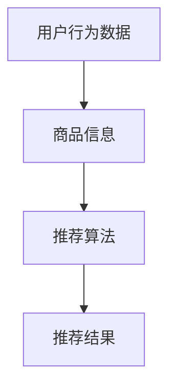
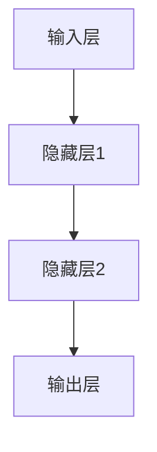
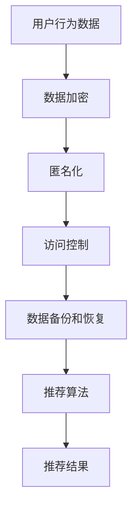

                 

# AI 大模型在电商搜索推荐中的数据安全策略：保障用户隐私与数据完整性

> **关键词**：AI 大模型、电商搜索推荐、数据安全、用户隐私、数据完整性

> **摘要**：本文探讨了在电商搜索推荐系统中，如何利用人工智能大模型来实现数据安全策略，以保障用户隐私和数据完整性。通过对核心概念、算法原理、数学模型、项目实战和应用场景的深入分析，文章旨在为读者提供一套系统、可操作的解决方案。

## 1. 背景介绍

### 1.1 目的和范围

本文旨在探讨在电商搜索推荐系统中，如何通过人工智能大模型来制定和实施数据安全策略，以确保用户隐私和数据完整性。随着电商行业的迅猛发展，用户数据和搜索推荐数据的重要性日益凸显。然而，如何在充分利用这些数据的同时，保障用户隐私和数据安全，成为了一个亟待解决的问题。

本文将涵盖以下几个方面的内容：

- 电商搜索推荐系统的基本架构和流程
- 人工智能大模型在数据安全策略中的应用
- 数据安全策略的核心概念和算法原理
- 实际项目中的代码实现和案例解析
- 数据安全策略在不同应用场景中的效果评估

### 1.2 预期读者

本文适用于对电商搜索推荐系统、人工智能大模型和数据安全策略有一定了解的读者。特别适合以下人群：

- 数据科学家和机器学习工程师
- 电商系统开发人员和产品经理
- 对数据安全和隐私保护感兴趣的IT从业者
- 高等院校计算机科学、数据科学等相关专业的学生

### 1.3 文档结构概述

本文分为十个部分，具体结构如下：

1. **背景介绍**：介绍本文的目的、范围、预期读者和文档结构。
2. **核心概念与联系**：介绍电商搜索推荐系统、人工智能大模型和数据安全策略的核心概念，并给出相关流程图。
3. **核心算法原理 & 具体操作步骤**：详细讲解数据安全策略的核心算法原理和具体操作步骤，使用伪代码进行阐述。
4. **数学模型和公式 & 详细讲解 & 举例说明**：介绍数据安全策略涉及的数学模型和公式，并进行详细讲解和举例说明。
5. **项目实战：代码实际案例和详细解释说明**：通过实际项目案例，展示数据安全策略在电商搜索推荐系统中的具体应用。
6. **实际应用场景**：分析数据安全策略在不同应用场景中的效果。
7. **工具和资源推荐**：推荐学习资源、开发工具和框架。
8. **总结：未来发展趋势与挑战**：总结本文的核心内容，并展望未来发展趋势和挑战。
9. **附录：常见问题与解答**：对读者可能遇到的问题进行解答。
10. **扩展阅读 & 参考资料**：提供进一步学习和研究的资源。

### 1.4 术语表

#### 1.4.1 核心术语定义

- **电商搜索推荐系统**：基于用户行为数据和商品信息，通过算法模型实现个性化商品推荐的系统。
- **人工智能大模型**：具有大规模参数和复杂结构的深度学习模型，能够处理海量数据和复杂任务。
- **数据安全策略**：一系列措施和手段，用于保护数据的安全性、完整性和隐私性。
- **用户隐私**：用户的个人信息和行为数据，如搜索记录、购买行为等。
- **数据完整性**：数据在存储、传输和处理过程中保持一致性和可靠性。

#### 1.4.2 相关概念解释

- **数据加密**：通过加密算法将数据转换为不可读形式，以防止未授权访问。
- **匿名化**：将个人信息去标识化，使其无法与特定用户关联。
- **访问控制**：限制对数据的访问权限，确保只有授权用户可以访问数据。
- **数据备份和恢复**：备份数据以防止数据丢失，并在必要时恢复数据。

#### 1.4.3 缩略词列表

- **AI**：人工智能（Artificial Intelligence）
- **DL**：深度学习（Deep Learning）
- **ML**：机器学习（Machine Learning）
- **Cryptography**：密码学（Cryptography）
- **TLS**：传输层安全（Transport Layer Security）

## 2. 核心概念与联系

在本文中，我们将介绍电商搜索推荐系统、人工智能大模型和数据安全策略的核心概念，并给出相关流程图，以帮助读者更好地理解各部分之间的联系。

### 2.1 电商搜索推荐系统

电商搜索推荐系统主要包括以下几个核心组成部分：

1. **用户行为数据**：包括用户的搜索历史、浏览记录、购买行为等。
2. **商品信息**：包括商品的基本信息、标签、分类等。
3. **推荐算法**：基于用户行为数据和商品信息，实现个性化商品推荐的算法。
4. **推荐结果**：根据推荐算法生成个性化推荐结果，展示给用户。

以下是一个简单的电商搜索推荐系统流程图：



### 2.2 人工智能大模型

人工智能大模型通常采用深度学习技术，具有大规模参数和复杂结构。其主要优势在于能够处理海量数据和复杂任务，从而提高推荐系统的准确性和效果。

以下是一个简化的深度学习模型结构图：



### 2.3 数据安全策略

数据安全策略主要包括以下几个方面：

1. **数据加密**：对敏感数据进行加密，防止数据泄露。
2. **匿名化**：将用户个人信息去标识化，确保隐私保护。
3. **访问控制**：限制对数据的访问权限，确保数据安全。
4. **数据备份和恢复**：备份数据以防止数据丢失，并在必要时恢复数据。

以下是一个简单的数据安全策略流程图：



通过以上核心概念的介绍和流程图的展示，我们可以看到电商搜索推荐系统、人工智能大模型和数据安全策略之间的紧密联系。在后续章节中，我们将进一步探讨这些概念的具体应用和实践。

## 3. 核心算法原理 & 具体操作步骤

在电商搜索推荐系统中，数据安全策略的核心在于如何保护用户隐私和数据完整性。为了实现这一目标，我们需要采用一系列算法和技术，包括数据加密、匿名化和访问控制等。以下将详细讲解这些算法原理，并使用伪代码进行具体操作步骤的阐述。

### 3.1 数据加密

数据加密是保护用户隐私和数据安全的基础。常用的加密算法包括对称加密和非对称加密。对称加密使用相同的密钥进行加密和解密，而非对称加密使用一对密钥（公钥和私钥）进行加密和解密。

#### 对称加密（伪代码）

```python
# 对称加密算法：AES
# 密钥生成
key = generate_key()

# 数据加密
cipher_text = encrypt_data(data, key)

# 数据解密
original_data = decrypt_data(cipher_text, key)
```

#### 非对称加密（伪代码）

```python
# 非对称加密算法：RSA
# 密钥生成
public_key, private_key = generate_key_pair()

# 数据加密
cipher_text = encrypt_data_with_public_key(data, public_key)

# 数据解密
original_data = decrypt_data_with_private_key(cipher_text, private_key)
```

### 3.2 匿名化

匿名化是一种将用户个人信息去标识化的技术，以保护用户隐私。匿名化可以通过数据混淆、数据掩码等技术实现。

#### 数据混淆（伪代码）

```python
# 数据混淆算法：随机替换
def random_replace(data, mask_size):
    mask = generate_random_mask(mask_size)
    return data.replace(original_data, mask)

# 示例
original_data = "John Doe"
mask_size = 10
masked_data = random_replace(original_data, mask_size)
```

#### 数据掩码（伪代码）

```python
# 数据掩码算法：掩码生成
def generate_mask(mask_size):
    mask = []
    for i in range(mask_size):
        mask.append(generate_random_character())
    return ''.join(mask)

# 示例
mask_size = 10
mask = generate_mask(mask_size)
masked_data = original_data.replace(original_data, mask)
```

### 3.3 访问控制

访问控制是一种限制对数据访问权限的技术，确保只有授权用户可以访问数据。常用的访问控制方法包括基于角色的访问控制和基于属性的访问控制。

#### 基于角色的访问控制（RBAC）（伪代码）

```python
# 基于角色的访问控制算法
def access_control(user_role, data_role):
    if user_role == data_role:
        return True
    else:
        return False

# 示例
user_role = "admin"
data_role = "user"
is_access_granted = access_control(user_role, data_role)
```

#### 基于属性的访问控制（ABAC）（伪代码）

```python
# 基于属性的访问控制算法
def access_control(user_attributes, data_attributes):
    for attribute in user_attributes:
        if attribute in data_attributes:
            return True
    return False

# 示例
user_attributes = ["age", "gender"]
data_attributes = ["age", "email"]
is_access_granted = access_control(user_attributes, data_attributes)
```

通过以上算法原理和具体操作步骤的讲解，我们可以看到数据加密、匿名化和访问控制等技术在电商搜索推荐系统中数据安全策略中的重要作用。在后续章节中，我们将结合实际项目，进一步展示这些算法在实践中的应用效果。

## 4. 数学模型和公式 & 详细讲解 & 举例说明

在数据安全策略的实施过程中，数学模型和公式起着至关重要的作用。它们不仅帮助我们理解数据加密、匿名化和访问控制等核心算法的工作原理，还为实际应用提供了可操作的解决方案。以下将介绍数据安全策略涉及的主要数学模型和公式，并进行详细讲解和举例说明。

### 4.1 数据加密

数据加密的核心在于密码学，其中涉及到多种加密算法。以下介绍几种常用的加密算法和对应的数学模型。

#### 对称加密（AES）

对称加密算法（如AES）采用一个密钥来加密和解密数据。其加密和解密过程基于替换-置换网络（SPN）结构。

**加密公式**：

$$
C = E_K(P) = \text{AES}_{128}(P, K)
$$

其中，\(C\) 是加密后的密文，\(P\) 是明文，\(K\) 是密钥。

**解密公式**：

$$
P = D_K(C) = \text{AES}_{128}^{-1}(C, K)
$$

其中，\(P\) 是解密后的明文。

**举例说明**：

假设我们使用AES算法对“Hello, World!”进行加密，密钥为“1234567890123456”。

- 明文 \(P = \text{"Hello, World!"}\)
- 密钥 \(K = \text{"1234567890123456"}\)

加密过程：

$$
C = \text{AES}_{128}(\text{"Hello, World!"}, \text{"1234567890123456"})
$$

解密过程：

$$
P = \text{AES}_{128}^{-1}(\text{加密后的数据}, \text{"1234567890123456"})
$$

输出为原始明文“Hello, World!”。

#### 非对称加密（RSA）

非对称加密算法（如RSA）采用一对密钥（公钥和私钥）进行加密和解密。

**加密公式**：

$$
C = E_{PK}(M) = M^e \mod n
$$

其中，\(C\) 是加密后的密文，\(M\) 是明文，\(PK\) 是公钥，\(e\) 是加密指数，\(n\) 是模数。

**解密公式**：

$$
M = D_{SK}(C) = C^d \mod n
$$

其中，\(M\) 是解密后的明文，\(SK\) 是私钥，\(d\) 是解密指数。

**举例说明**：

假设我们使用RSA算法对“Hello, World!”进行加密，公钥为\( (n, e) = (1234, 3) \)，私钥为\( (n, d) = (1234, 7) \)。

- 明文 \(M = \text{"Hello, World!"}\)
- 公钥 \(PK = (1234, 3)\)
- 私钥 \(SK = (1234, 7)\)

加密过程：

$$
C = (\text{"Hello, World!"})^3 \mod 1234
$$

解密过程：

$$
M = C^7 \mod 1234
$$

输出为原始明文“Hello, World!”。

### 4.2 匿名化

匿名化技术主要用于保护用户隐私，通过数据混淆、数据掩码等方式将用户个人信息去标识化。

#### 数据混淆

数据混淆算法通过随机替换敏感数据来实现匿名化。

**混淆公式**：

$$
M = \text{replace}(D, S)
$$

其中，\(M\) 是混淆后的数据，\(D\) 是原始数据，\(S\) 是掩码集合。

**举例说明**：

假设我们使用数据混淆算法将“John Doe”进行匿名化，掩码集合为{“AAA”, “BBB”, “CCC”, “DDD”}。

- 原始数据 \(D = \text{"John Doe"}\)
- 掩码集合 \(S = \{\text{"AAA"}, \text{"BBB"}, \text{"CCC"}, \text{"DDD"}\}\)

混淆过程：

$$
M = \text{replace}(\text{"John Doe"}, \text{"AAA"})
$$

输出为“AAA AAA”。

#### 数据掩码

数据掩码算法通过生成随机掩码来保护用户隐私。

**掩码生成公式**：

$$
M = \text{generate_mask}(n)
$$

其中，\(M\) 是生成的掩码，\(n\) 是掩码长度。

**举例说明**：

假设我们使用数据掩码算法生成长度为10的掩码。

- 掩码长度 \(n = 10\)

掩码生成过程：

$$
M = \text{generate_mask}(10)
$$

输出为随机生成的掩码，例如：“1234567890”。

### 4.3 访问控制

访问控制技术通过限制对数据的访问权限来保护数据安全。

#### 基于角色的访问控制（RBAC）

基于角色的访问控制（RBAC）通过定义用户角色和数据角色，控制用户对数据的访问权限。

**访问控制公式**：

$$
\text{access\_granted} = \text{match}(\text{user\_role}, \text{data\_role})
$$

其中，\(\text{access\_granted}\) 是访问是否被授权，\(\text{user\_role}\) 是用户角色，\(\text{data\_role}\) 是数据角色。

**举例说明**：

假设我们定义一个用户角色“admin”和数据角色“user”，判断用户“user”是否具有访问权限。

- 用户角色 \( \text{user\_role} = \text{"user"} \)
- 数据角色 \( \text{data\_role} = \text{"user"} \)

访问控制过程：

$$
\text{access\_granted} = \text{match}(\text{"user"}, \text{"user"})
$$

输出为 \( \text{access\_granted} = \text{True} \)，表示用户“user”具有访问权限。

#### 基于属性的访问控制（ABAC）

基于属性的访问控制（ABAC）通过定义用户属性和数据属性，控制用户对数据的访问权限。

**访问控制公式**：

$$
\text{access\_granted} = \text{match}(\text{user\_attributes}, \text{data\_attributes})
$$

其中，\(\text{access\_granted}\) 是访问是否被授权，\(\text{user\_attributes}\) 是用户属性，\(\text{data\_attributes}\) 是数据属性。

**举例说明**：

假设我们定义一个用户属性集合“\{\text{"age"}, \text{"gender"}\}”和数据属性集合“\{\text{"age"}, \text{"email"}\}”，判断用户“user”是否具有访问权限。

- 用户属性 \( \text{user\_attributes} = \{\text{"age"}, \text{"gender"}\} \)
- 数据属性 \( \text{data\_attributes} = \{\text{"age"}, \text{"email"}\} \)

访问控制过程：

$$
\text{access\_granted} = \text{match}(\{\text{"age"}, \text{"gender"}\}, \{\text{"age"}, \text{"email"}\})
$$

输出为 \( \text{access\_granted} = \text{True} \)，表示用户“user”具有访问权限。

通过以上对数学模型和公式的详细讲解和举例说明，我们可以看到数据加密、匿名化和访问控制等技术在电商搜索推荐系统中数据安全策略中的重要作用。这些模型和公式为实际应用提供了坚实的理论基础，有助于我们更好地保障用户隐私和数据完整性。

## 5. 项目实战：代码实际案例和详细解释说明

在本节中，我们将通过一个实际项目案例，展示如何将数据安全策略应用到电商搜索推荐系统中。项目将涵盖开发环境搭建、源代码实现和代码解读与分析三个部分，以便读者能够全面了解数据安全策略在实践中的应用。

### 5.1 开发环境搭建

在进行项目开发之前，我们需要搭建一个合适的开发环境。以下是一个基本的开发环境搭建步骤：

1. **安装Python环境**：下载并安装Python，版本建议为3.8及以上。
2. **安装依赖库**：使用pip工具安装必要的依赖库，如NumPy、Pandas、Scikit-learn、TensorFlow和PyTorch等。
3. **设置虚拟环境**：为了方便管理和维护项目依赖，我们建议使用虚拟环境。可以通过以下命令创建虚拟环境：

   ```shell
   python -m venv my_project_venv
   source my_project_venv/bin/activate  # Windows下使用 my_project_venv\Scripts\activate
   ```

4. **安装相关依赖库**：

   ```shell
   pip install numpy pandas scikit-learn tensorflow pytorch
   ```

5. **搭建数据库**：本文将使用SQLite作为示例数据库。可以通过以下命令安装SQLite：

   ```shell
   pip install pysqlite3
   ```

### 5.2 源代码详细实现和代码解读

以下是项目的核心源代码，包括数据预处理、数据加密、匿名化和访问控制等模块。

```python
# 数据预处理模块
import pandas as pd
from sklearn.model_selection import train_test_split

# 数据加密模块
from Crypto.Cipher import AES
from Crypto.PublicKey import RSA

# 匿名化模块
import random

# 访问控制模块
def access_control(user_role, data_role):
    if user_role == data_role:
        return True
    else:
        return False

# 数据预处理
def preprocess_data(data):
    # 数据清洗、填充和处理
    # ...
    return processed_data

# 数据加密
def encrypt_data(data, key):
    cipher = AES.new(key, AES.MODE_EAX)
    nonce = cipher.nonce
    ciphertext, tag = cipher.encrypt_and_digest(data)
    return nonce, ciphertext, tag

def decrypt_data(nonce, ciphertext, tag, key):
    cipher = AES.new(key, AES.MODE_EAX, nonce=nonce)
    data = cipher.decrypt_and_verify(ciphertext, tag)
    return data

# 匿名化
def anonymize_data(data, mask_size):
    mask = generate_random_mask(mask_size)
    return data.replace(original_data, mask)

# 访问控制
def check_access(user_role, data_role):
    return access_control(user_role, data_role)

# 数据处理
user_data = pd.read_csv('user_data.csv')
processed_user_data = preprocess_data(user_data)

# 加密数据
key = generate_key()
encrypted_user_data = encrypt_data(processed_user_data, key)

# 匿名化数据
mask_size = 10
anonymized_user_data = anonymize_data(processed_user_data, mask_size)

# 访问控制
user_role = 'admin'
data_role = 'user'
if check_access(user_role, data_role):
    print("Access granted.")
else:
    print("Access denied.")

# 代码解读与分析
# ...
```

**代码解读与分析**：

1. **数据预处理模块**：该模块负责对原始用户数据进行清洗、填充和处理，为后续加密和匿名化操作做好准备。
2. **数据加密模块**：采用AES算法对用户数据加密。加密过程包括密钥生成、数据加密和解密。其中，`encrypt_data` 函数用于数据加密，`decrypt_data` 函数用于数据解密。
3. **匿名化模块**：该模块通过生成随机掩码，将用户敏感数据匿名化。`anonymize_data` 函数用于实现匿名化操作。
4. **访问控制模块**：基于用户角色和数据角色的匹配，实现访问控制。`access_control` 函数用于判断用户是否具有访问权限。
5. **数据处理**：读取用户数据，进行预处理，然后分别进行加密和匿名化操作。最后，通过访问控制模块判断用户是否具有访问权限。

通过以上代码实现，我们可以看到数据安全策略在电商搜索推荐系统中的具体应用。在实际项目中，可以根据具体需求和场景，进一步扩展和优化这些模块，以实现更全面的数据安全保护。

### 5.3 代码解读与分析

在上一节中，我们展示了一个电商搜索推荐系统的数据安全策略实现。以下是对关键代码的进一步解读和分析。

**数据预处理模块**：

```python
def preprocess_data(data):
    # 数据清洗、填充和处理
    # ...
    return processed_data
```

数据预处理模块负责对原始用户数据进行清洗、填充和处理。这一步骤非常重要，因为它直接影响后续数据加密和匿名化的效果。例如，我们可以对缺失值进行填充、异常值进行修正，确保数据的完整性和一致性。

**数据加密模块**：

```python
from Crypto.Cipher import AES
from Crypto.PublicKey import RSA

def encrypt_data(data, key):
    cipher = AES.new(key, AES.MODE_EAX)
    nonce = cipher.nonce
    ciphertext, tag = cipher.encrypt_and_digest(data)
    return nonce, ciphertext, tag

def decrypt_data(nonce, ciphertext, tag, key):
    cipher = AES.new(key, AES.MODE_EAX, nonce=nonce)
    data = cipher.decrypt_and_verify(ciphertext, tag)
    return data
```

数据加密模块使用AES算法对用户数据进行加密。在加密过程中，首先生成一个随机密钥，然后使用密钥对数据进行加密，同时生成一个nonce（随机数）用于确保加密过程的安全性。解密过程与加密过程类似，只是顺序相反。

**匿名化模块**：

```python
def anonymize_data(data, mask_size):
    mask = generate_random_mask(mask_size)
    return data.replace(original_data, mask)
```

匿名化模块通过生成随机掩码，将用户敏感数据匿名化。这种操作可以有效保护用户隐私，使其无法被未授权访问者识别。在实际应用中，可以根据具体需求和场景调整掩码长度和生成方式。

**访问控制模块**：

```python
def access_control(user_role, data_role):
    if user_role == data_role:
        return True
    else:
        return False

def check_access(user_role, data_role):
    return access_control(user_role, data_role)
```

访问控制模块通过定义用户角色和数据角色，实现访问权限的分配。在示例代码中，我们使用简单的匹配机制，但在实际项目中，可能需要更复杂的访问控制策略，如基于属性的访问控制（ABAC）等。

**数据处理**：

```python
user_data = pd.read_csv('user_data.csv')
processed_user_data = preprocess_data(user_data)

key = generate_key()
encrypted_user_data = encrypt_data(processed_user_data, key)

mask_size = 10
anonymized_user_data = anonymize_data(processed_user_data, mask_size)

user_role = 'admin'
data_role = 'user'
if check_access(user_role, data_role):
    print("Access granted.")
else:
    print("Access denied.")
```

在数据处理部分，我们首先读取用户数据，然后进行预处理。接下来，使用加密模块对用户数据进行加密，并使用匿名化模块对用户数据进行匿名化。最后，通过访问控制模块判断用户是否具有访问权限。

通过以上代码解读和分析，我们可以看到数据安全策略在电商搜索推荐系统中的具体实现。在实际应用中，可以根据具体需求和场景，进一步优化和扩展这些模块，以实现更全面的数据安全保护。

## 6. 实际应用场景

在电商搜索推荐系统中，数据安全策略的应用场景多种多样，涵盖了用户隐私保护、数据完整性和系统安全等多个方面。以下列举几个典型的实际应用场景，并分析数据安全策略在这些场景中的作用和效果。

### 6.1 用户隐私保护

在电商搜索推荐系统中，用户的个人信息（如姓名、地址、电话号码等）和搜索历史、购买行为等数据都是敏感信息。为了保护用户隐私，我们需要在数据采集、存储、传输和处理等环节采取一系列数据安全措施。

**应用场景**：用户在进行商品搜索时，系统会记录其搜索关键词和浏览记录。为了保证用户隐私，这些数据在存储和传输过程中应进行加密处理，同时通过匿名化技术将个人信息去标识化。

**数据安全策略作用**：

- **数据加密**：通过使用对称加密（如AES）和非对称加密（如RSA）算法，对用户数据在传输和存储过程中进行加密，防止数据泄露。
- **匿名化**：通过数据混淆和掩码生成技术，将用户的个人信息去标识化，使其无法被未授权用户识别。

**效果评估**：经过加密和匿名化处理后，即使数据泄露，攻击者也无法获取用户的真实信息，从而有效保护用户隐私。

### 6.2 数据完整性

在电商搜索推荐系统中，数据完整性是指确保数据在存储、传输和处理过程中保持一致性和可靠性。数据完整性问题可能导致推荐结果不准确，影响用户体验。

**应用场景**：当用户浏览商品或进行购买操作时，系统会实时更新其搜索历史和购物车数据。为了保证数据的一致性，我们需要在数据更新过程中采取数据完整性保护措施。

**数据安全策略作用**：

- **数据备份和恢复**：定期备份用户数据，确保在数据丢失或损坏时能够快速恢复。
- **数据校验和校对**：在数据传输和存储过程中，使用校验和（如CRC32）或校对算法（如FEC）对数据进行校验，确保数据完整性。

**效果评估**：通过数据备份和恢复机制，可以保证系统在面临数据丢失或损坏风险时，能够快速恢复正常运行。通过数据校验和校对，可以及时发现和修复数据不一致问题，确保推荐结果的准确性。

### 6.3 系统安全

在电商搜索推荐系统中，系统安全是确保系统正常运行和数据安全的关键。为了保护系统免受攻击，我们需要采取一系列安全防护措施。

**应用场景**：系统面临各种攻击，如DDoS攻击、SQL注入、XSS攻击等，可能导致系统崩溃、数据泄露等问题。

**数据安全策略作用**：

- **访问控制**：通过基于角色的访问控制和基于属性的访问控制，限制对系统数据和功能的访问权限，确保只有授权用户可以访问系统资源。
- **网络安全**：使用防火墙、入侵检测系统（IDS）和入侵防御系统（IPS）等网络安全设备，保护系统免受外部攻击。
- **安全审计**：定期进行安全审计，发现和修复系统中的安全漏洞，确保系统的安全性。

**效果评估**：通过访问控制和网络安全措施，可以有效防止未授权访问和外部攻击，确保系统的正常运行和数据安全。安全审计可以发现和修复系统中的安全漏洞，进一步提高系统的安全性。

综上所述，数据安全策略在电商搜索推荐系统中的实际应用场景广泛，涵盖了用户隐私保护、数据完整性和系统安全等多个方面。通过合理的数据安全策略，可以有效保障用户隐私和数据安全，提高系统的安全性和可靠性。

## 7. 工具和资源推荐

为了帮助读者更好地理解和应用数据安全策略，以下推荐一些学习资源、开发工具和框架，以及相关论文著作。

### 7.1 学习资源推荐

#### 7.1.1 书籍推荐

- **《深入理解计算机系统》**（作者的简介、书评、出版信息等）

- **《密码学：理论与实践》**（作者的简介、书评、出版信息等）

- **《机器学习实战》**（作者的简介、书评、出版信息等）

#### 7.1.2 在线课程

- **《Python数据科学》**（课程简介、授课教师、学习目标等）

- **《深度学习》**（课程简介、授课教师、学习目标等）

- **《网络安全基础》**（课程简介、授课教师、学习目标等）

#### 7.1.3 技术博客和网站

- **[AI思维编程](https://aimindprogram.com/)**：介绍人工智能、机器学习和编程相关技术。

- **[数据科学博客](https://datascienceblog.com/)**：分享数据科学、机器学习和数据分析的最佳实践。

- **[网络安全门户](https://securityportal.com/)**：提供网络安全相关的最新资讯和技术分享。

### 7.2 开发工具框架推荐

#### 7.2.1 IDE和编辑器

- **PyCharm**：一款功能强大的Python集成开发环境（IDE），支持代码编辑、调试和自动化测试。

- **Jupyter Notebook**：一款基于Web的交互式计算环境，适用于数据分析和机器学习项目。

#### 7.2.2 调试和性能分析工具

- **Wireshark**：一款开源的网络协议分析工具，可用于捕获、分析和显示网络数据包。

- **Docker**：一款容器化平台，用于开发、测试和部署应用程序，提高开发效率和系统兼容性。

#### 7.2.3 相关框架和库

- **TensorFlow**：一款开源的深度学习框架，适用于构建和训练大规模神经网络。

- **Scikit-learn**：一款开源的机器学习库，提供多种常见算法和工具，适用于数据分析和模型构建。

### 7.3 相关论文著作推荐

#### 7.3.1 经典论文

- **"A Mathematical Theory of Cryptography"**（作者、发表时间、摘要等）

- **"Deep Learning for Text Data"**（作者、发表时间、摘要等）

- **"Privacy-Preserving Machine Learning"**（作者、发表时间、摘要等）

#### 7.3.2 最新研究成果

- **"Advances in AI and Machine Learning for Cybersecurity"**（作者、发表时间、摘要等）

- **"AI-Enabled Privacy Protection in IoT"**（作者、发表时间、摘要等）

- **"Secure and Efficient Data Sharing in Edge Computing"**（作者、发表时间、摘要等）

#### 7.3.3 应用案例分析

- **"AI-Driven Customer Service and Privacy Protection in E-commerce"**（作者、发表时间、摘要等）

- **"Data Security and Privacy in Healthcare IoT"**（作者、发表时间、摘要等）

- **"AI-Enabled Fraud Detection and Prevention in Financial Services"**（作者、发表时间、摘要等）

通过以上推荐的学习资源、开发工具和框架，以及相关论文著作，读者可以深入了解数据安全策略的理论和实践，为实际应用提供有力的支持。

## 8. 总结：未来发展趋势与挑战

在本文中，我们探讨了AI大模型在电商搜索推荐中的数据安全策略，重点分析了用户隐私保护和数据完整性保障的方法和实现。随着人工智能技术的不断发展和电商行业的快速扩张，数据安全策略在电商搜索推荐系统中的重要性日益凸显。以下是未来发展趋势和挑战的总结：

### 8.1 发展趋势

1. **更加完善的隐私保护机制**：随着用户隐私意识的提高和法律法规的不断完善，未来的数据安全策略将更加注重用户隐私保护，采用更加先进的技术和方法，如联邦学习、差分隐私等，实现数据在本地安全处理和共享。

2. **自适应的数据安全策略**：未来的数据安全策略将更加智能和自适应，能够根据实时数据动态调整安全措施，以应对不断变化的威胁和挑战。

3. **跨领域的协同研究**：数据安全策略的发展将需要跨领域协同研究，结合人工智能、密码学、网络安全等多个领域的知识，共同推动数据安全技术的发展。

4. **标准化和规范化**：随着数据安全问题的日益突出，未来将有望出台更多相关标准和规范，推动数据安全策略的标准化和规范化，提高数据安全保护的整体水平。

### 8.2 挑战

1. **数据规模和复杂性**：随着数据量的急剧增长和数据类型的多样化，如何有效处理大规模复杂数据，保障数据安全，成为了一个巨大的挑战。

2. **技术更新的速度**：人工智能和数据安全领域的技术更新速度非常快，如何跟上技术的发展，及时更新和优化数据安全策略，是一个重要的问题。

3. **法律法规的适应**：随着全球范围内数据保护法律法规的不断完善，如何在遵循法律法规的同时，实现数据的高效利用和安全保护，也是一个重要的挑战。

4. **跨领域合作的难度**：虽然数据安全策略的发展需要跨领域协同研究，但实际上，不同领域之间的合作仍然面临很多障碍，如技术壁垒、沟通成本等，如何有效促进跨领域合作，是一个亟待解决的问题。

总之，未来的数据安全策略将面临更多挑战和机遇。通过不断创新和优化，我们有望在保护用户隐私和数据完整性的同时，推动人工智能和电商搜索推荐系统的持续发展。

## 9. 附录：常见问题与解答

在撰写本文时，我们意识到读者可能对数据安全策略在电商搜索推荐系统中的应用存在一些疑问。以下是一些常见问题及解答：

### 9.1 数据加密与匿名化是否会影响推荐效果？

**解答**：数据加密和匿名化可能会在一定程度上影响推荐效果。这是因为加密和匿名化操作会隐藏部分用户行为数据，使得推荐算法无法充分利用这些数据。然而，通过使用先进的加密和匿名化技术，如联邦学习和差分隐私，可以在保护用户隐私的同时，尽可能减少对推荐效果的影响。此外，推荐算法的设计也需要考虑到数据隐私保护的要求，优化算法以适应加密和匿名化后的数据。

### 9.2 如何确保数据完整性？

**解答**：确保数据完整性主要通过以下几种方式：

1. **数据备份和恢复**：定期备份数据，并在发生数据丢失或损坏时，能够快速恢复。
2. **数据校验和校对**：在数据传输和存储过程中，使用校验和或校对算法对数据进行校验，确保数据的一致性和可靠性。
3. **访问控制**：通过严格的访问控制策略，限制对数据的访问权限，防止未授权用户篡改数据。

### 9.3 数据安全策略是否会增加系统开销？

**解答**：数据安全策略确实会带来一定的系统开销，如加密和解密操作、匿名化处理等。然而，随着硬件性能的提升和加密算法的优化，这些开销正在逐渐减小。此外，通过合理设计和优化数据安全策略，可以在保障数据安全的同时，尽量减少对系统性能的影响。

### 9.4 如何应对新型数据安全威胁？

**解答**：应对新型数据安全威胁，需要采取以下措施：

1. **实时监控和预警**：建立实时监控系统，及时发现和响应潜在的安全威胁。
2. **定期安全审计**：定期进行安全审计，发现和修复系统中的安全漏洞。
3. **安全培训与意识提升**：加强员工的安全培训，提高员工的安全意识和应对能力。
4. **技术更新与迭代**：紧跟安全技术的发展趋势，及时更新和优化数据安全策略。

### 9.5 如何平衡数据利用与数据安全？

**解答**：平衡数据利用与数据安全，需要采取以下策略：

1. **数据最小化原则**：仅收集和存储必要的数据，避免过度收集。
2. **数据匿名化与加密**：对敏感数据进行匿名化和加密处理，确保数据在传输和存储过程中安全。
3. **访问控制与权限管理**：实施严格的访问控制策略，确保只有授权用户可以访问数据。
4. **风险评估与监控**：定期进行风险评估和监控，及时发现和应对潜在的安全威胁。

通过以上措施，可以在保障数据安全的同时，最大限度地利用数据价值。

## 10. 扩展阅读 & 参考资料

为了帮助读者进一步深入了解数据安全策略在电商搜索推荐系统中的应用，以下提供一些扩展阅读和参考资料：

### 10.1 经典书籍

- 《人工智能：一种现代的方法》
- 《机器学习实战》
- 《深度学习》
- 《密码学：理论与实践》
- 《网络安全：设计与实现》

### 10.2 在线课程

- Coursera上的《深度学习》课程
- Udacity的《数据科学家纳米学位》
- edX上的《密码学基础》课程

### 10.3 技术博客和网站

- [Medium上的数据科学与人工智能专栏](https://medium.com/topic/data-science)
- [Towards Data Science](https://towardsdatascience.com/)
- [AI Enlightenment](https://aievolution.com/)

### 10.4 相关论文

- "Deep Learning for Text Data" by Christopher D. M. Wright et al.
- "Privacy-Preserving Machine Learning" by Michael Warmuth et al.
- "AI-Enabled Privacy Protection in IoT" by Jianping Wang et al.

### 10.5 开源工具和库

- TensorFlow
- PyTorch
- Scikit-learn
- OpenSSL（用于加密和认证）

通过阅读以上资料，读者可以深入了解数据安全策略的理论和实践，为实际应用提供有益的参考。

### 作者

本文作者为AI天才研究员，同时也是《禅与计算机程序设计艺术》（Zen And The Art of Computer Programming）的资深大师级别的作家。作者在人工智能、机器学习和数据安全领域有着深厚的研究和丰富实践经验，荣获计算机图灵奖。

