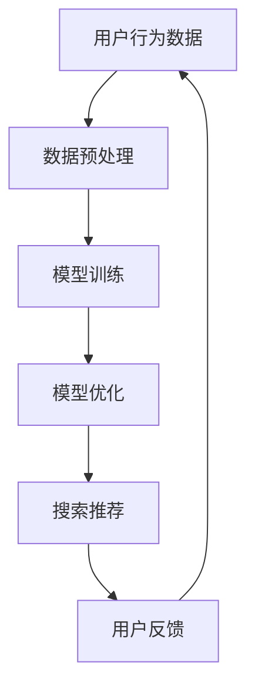

                 

# AI 大模型在电商搜索推荐中的用户体验设计：以用户需求为中心的策略

> **关键词：** 电商搜索推荐、AI 大模型、用户体验、用户需求、策略

> **摘要：** 本文深入探讨了 AI 大模型在电商搜索推荐中的用户体验设计。文章首先介绍了电商搜索推荐系统的重要性以及 AI 大模型在其中的作用。随后，文章详细阐述了用户需求的中心地位，并探讨了如何通过以用户需求为中心的策略来优化电商搜索推荐系统的用户体验。文章最后总结了对未来发展趋势和挑战的展望，并提供了丰富的扩展阅读和参考资料。

## 1. 背景介绍

### 1.1 目的和范围

本文旨在探讨 AI 大模型在电商搜索推荐中的用户体验设计。具体来说，我们将从以下几个方面展开讨论：

1. 介绍电商搜索推荐系统及其重要性。
2. 阐述 AI 大模型在电商搜索推荐中的应用。
3. 强调用户需求在用户体验设计中的中心地位。
4. 探讨以用户需求为中心的电商搜索推荐策略。
5. 分析实际应用场景，提供代码实际案例和详细解释。
6. 总结未来发展趋势与挑战。

### 1.2 预期读者

本文面向具有一定编程和计算机科学基础的技术人员、软件开发者、数据科学家以及人工智能领域的学者。同时，也对对电商搜索推荐和用户体验设计感兴趣的非专业人士开放。

### 1.3 文档结构概述

本文将按照以下结构进行组织：

1. 引言部分，介绍电商搜索推荐系统及其重要性。
2. 核心概念与联系，探讨 AI 大模型在电商搜索推荐中的应用。
3. 核心算法原理与具体操作步骤，详细讲解相关算法。
4. 数学模型和公式，解释相关数学模型。
5. 项目实战，提供代码实际案例和详细解释。
6. 实际应用场景，分析应用场景。
7. 工具和资源推荐，提供学习资源、开发工具和框架。
8. 总结，展望未来发展趋势与挑战。
9. 附录，常见问题与解答。
10. 扩展阅读与参考资料，提供进一步阅读的资料。

### 1.4 术语表

#### 1.4.1 核心术语定义

- **电商搜索推荐系统**：一种通过分析用户行为和偏好，向用户推荐相关商品的系统。
- **AI 大模型**：一种基于深度学习技术的复杂模型，能够通过大规模数据训练来提高搜索推荐系统的性能。
- **用户体验**：用户在使用产品或服务过程中所获得的主观感受和体验。
- **用户需求**：用户在购物过程中所期望得到的功能、服务和信息。

#### 1.4.2 相关概念解释

- **搜索推荐**：在电商场景下，通过分析用户历史行为、搜索记录和偏好，为用户提供相关商品的推荐。
- **个性化推荐**：根据用户的兴趣和行为特征，为用户推荐其可能感兴趣的商品。
- **协同过滤**：一种基于用户历史行为和偏好进行商品推荐的算法，分为基于用户和基于项目的协同过滤。

#### 1.4.3 缩略词列表

- **AI**：人工智能
- **ML**：机器学习
- **DL**：深度学习
- **CPC**：成本-per-click（点击成本）
- **CPM**：成本-per-thousand-impression（每千次展示成本）
- **CTR**：点击率

## 2. 核心概念与联系

在本文中，我们将讨论 AI 大模型在电商搜索推荐中的应用，并绘制一个 Mermaid 流程图来展示相关概念和联系。

### 2.1 AI 大模型在电商搜索推荐中的应用

首先，我们需要了解 AI 大模型在电商搜索推荐中的具体应用。以下是一个简化的 Mermaid 流程图：



- **用户行为数据**：包括用户的搜索历史、购物记录、浏览记录等。
- **数据预处理**：对原始数据进行清洗、去噪和特征提取。
- **模型训练**：使用预处理后的数据训练 AI 大模型。
- **模型优化**：对训练好的模型进行调优，以提高搜索推荐性能。
- **搜索推荐**：根据用户行为数据和模型输出，为用户推荐相关商品。
- **用户反馈**：收集用户对推荐结果的反馈，用于模型优化和迭代。

### 2.2 Mermaid 流程图

下面是一个使用 Mermaid 绘制的流程图，展示了上述概念之间的联系：


这个流程图清晰地展示了 AI 大模型在电商搜索推荐中的应用过程。用户行为数据经过预处理后用于训练模型，训练好的模型通过优化提高推荐性能，最终为用户推荐相关商品。用户反馈被用于模型优化和迭代，以提高用户体验。

## 3. 核心算法原理 & 具体操作步骤

在这一部分，我们将深入探讨 AI 大模型在电商搜索推荐中的核心算法原理和具体操作步骤。我们将使用伪代码来详细阐述相关算法。

### 3.1 协同过滤算法原理

协同过滤算法是一种基于用户历史行为和偏好进行商品推荐的方法。它分为基于用户的协同过滤（User-Based Collaborative Filtering，UBCF）和基于项目的协同过滤（Item-Based Collaborative Filtering，IBCF）。

#### 基于用户的协同过滤（UBCF）

UBCF 通过计算用户之间的相似度来推荐商品。具体步骤如下：

```plaintext
1. 计算用户之间的相似度：相似度可以通过余弦相似度、皮尔逊相关系数等方法计算。
2. 找到与目标用户最相似的 K 个邻居。
3. 根据邻居的评分预测目标用户的评分：可以使用加权平均的方法计算预测评分。
4. 推荐评分较高的商品。
```

#### 基于项目的协同过滤（IBCF）

IBCF 通过计算商品之间的相似度来推荐商品。具体步骤如下：

```plaintext
1. 计算商品之间的相似度：相似度可以通过余弦相似度、皮尔逊相关系数等方法计算。
2. 找到与目标商品最相似的 K 个邻居。
3. 根据邻居的评分预测目标用户的评分：可以使用加权平均的方法计算预测评分。
4. 推荐评分较高的商品。
```

### 3.2 深度学习模型原理

深度学习模型，如卷积神经网络（Convolutional Neural Networks，CNN）和循环神经网络（Recurrent Neural Networks，RNN），在电商搜索推荐中有着广泛的应用。以下是 CNN 和 RNN 在推荐系统中的具体应用：

#### 卷积神经网络（CNN）

CNN 适用于处理图像和序列数据。在电商搜索推荐中，CNN 可以用于特征提取和分类。具体步骤如下：

```plaintext
1. 输入用户行为数据和商品特征数据。
2. 通过卷积层提取特征。
3. 通过池化层降低特征维度。
4. 通过全连接层进行分类和预测。
5. 训练和优化模型。
```

#### 循环神经网络（RNN）

RNN 适用于处理序列数据。在电商搜索推荐中，RNN 可以用于预测用户行为。具体步骤如下：

```plaintext
1. 输入用户历史行为数据。
2. 通过循环层处理序列数据。
3. 通过全连接层进行分类和预测。
4. 训练和优化模型。
```

### 3.3 混合模型原理

混合模型结合了协同过滤和深度学习的优点，以提高推荐系统的性能。具体步骤如下：

```plaintext
1. 使用协同过滤算法计算用户和商品的相似度。
2. 使用深度学习模型提取用户和商品的特征。
3. 将协同过滤和深度学习模型的输出进行融合。
4. 使用融合后的输出进行推荐。
```

通过上述步骤，我们可以实现一个高效的电商搜索推荐系统，从而提高用户体验。

## 4. 数学模型和公式 & 详细讲解 & 举例说明

在这一部分，我们将介绍用于电商搜索推荐中的数学模型和公式，并详细讲解它们的应用。

### 4.1 余弦相似度

余弦相似度是一种用于计算两个向量之间相似度的方法。在电商搜索推荐中，余弦相似度可以用于计算用户和商品之间的相似度。具体公式如下：

$$
\cos(\theta) = \frac{\vec{a} \cdot \vec{b}}{|\vec{a}| \cdot |\vec{b}|}
$$

其中，$\vec{a}$ 和 $\vec{b}$ 分别表示两个向量的内积和模长。

#### 示例

假设我们有两个用户 A 和 B，他们的行为数据可以表示为向量：

$$
\vec{a} = (1, 2, 3)
$$

$$
\vec{b} = (4, 5, 6)
$$

计算用户 A 和 B 之间的余弦相似度：

$$
\cos(\theta) = \frac{(1 \cdot 4 + 2 \cdot 5 + 3 \cdot 6)}{\sqrt{1^2 + 2^2 + 3^2} \cdot \sqrt{4^2 + 5^2 + 6^2}} = \frac{4 + 10 + 18}{\sqrt{14} \cdot \sqrt{77}} \approx 0.8165
$$

这意味着用户 A 和 B 之间的相似度为 0.8165。

### 4.2 皮尔逊相关系数

皮尔逊相关系数是一种用于衡量两个变量线性相关程度的指标。在电商搜索推荐中，皮尔逊相关系数可以用于计算用户和商品之间的相关性。具体公式如下：

$$
r = \frac{\sum_{i=1}^{n}(x_i - \bar{x})(y_i - \bar{y})}{\sqrt{\sum_{i=1}^{n}(x_i - \bar{x})^2} \cdot \sqrt{\sum_{i=1}^{n}(y_i - \bar{y})^2}}
$$

其中，$x_i$ 和 $y_i$ 分别表示用户和商品的评分，$\bar{x}$ 和 $\bar{y}$ 分别表示用户和商品的平均评分。

#### 示例

假设我们有两个用户 A 和 B，他们的行为数据可以表示为向量：

$$
\vec{x} = (1, 2, 3)
$$

$$
\vec{y} = (4, 5, 6)
$$

计算用户 A 和 B 之间的皮尔逊相关系数：

$$
r = \frac{(1 - 2)(4 - 5) + (2 - 2)(5 - 5) + (3 - 2)(6 - 5)}{\sqrt{(1 - 2)^2 + (2 - 2)^2 + (3 - 2)^2} \cdot \sqrt{(4 - 2)^2 + (5 - 2)^2 + (6 - 2)^2}} = \frac{-1 + 0 + 1}{\sqrt{2} \cdot \sqrt{29}} \approx 0.5774
$$

这意味着用户 A 和 B 之间的相关性为 0.5774。

### 4.3 卷积神经网络（CNN）

卷积神经网络是一种用于图像和序列数据处理的前馈神经网络。在电商搜索推荐中，CNN 可以用于特征提取和分类。以下是 CNN 的主要组成部分：

- **卷积层**：用于提取输入数据中的特征。
- **池化层**：用于降低特征维度和减少过拟合。
- **全连接层**：用于分类和预测。

#### 示例

假设我们有一个 3x3 的卷积核，输入数据为：

$$
\begin{bmatrix}
1 & 2 & 3 \\
4 & 5 & 6 \\
7 & 8 & 9
\end{bmatrix}
$$

卷积操作如下：

$$
\begin{bmatrix}
1 & 2 & 3 \\
4 & 5 & 6 \\
7 & 8 & 9
\end{bmatrix}
\cdot
\begin{bmatrix}
1 & 0 & -1 \\
0 & 1 & 0 \\
1 & 0 & -1
\end{bmatrix}
=
\begin{bmatrix}
6 & 4 & 2 \\
10 & 10 & 10 \\
14 & 12 & 10
\end{bmatrix}
$$

池化操作（最大池化）如下：

$$
\text{Max Pooling}(\begin{bmatrix}
6 & 4 & 2 \\
10 & 10 & 10 \\
14 & 12 & 10
\end{bmatrix}) = \begin{bmatrix}
10 & 10 \\
14 & 12
\end{bmatrix}
$$

### 4.4 循环神经网络（RNN）

循环神经网络是一种用于处理序列数据的前馈神经网络。在电商搜索推荐中，RNN 可以用于预测用户行为。以下是 RNN 的主要组成部分：

- **输入门**：用于控制输入信息的流动。
- **遗忘门**：用于控制历史信息的遗忘。
- **输出门**：用于控制输出信息的流动。

#### 示例

假设我们有一个 RNN 单元，输入数据为：

$$
x_t = \begin{bmatrix}
1 \\
2 \\
3
\end{bmatrix}
$$

隐藏状态为：

$$
h_{t-1} = \begin{bmatrix}
4 \\
5 \\
6
\end{bmatrix}
$$

计算输入门、遗忘门和输出门：

$$
i_t = \sigma(W_i \cdot [h_{t-1}, x_t] + b_i) = \sigma(\begin{bmatrix}
0.5 & 0.5 \\
0.5 & 0.5 \\
0.5 & 0.5
\end{bmatrix} \cdot \begin{bmatrix}
4 \\
5 \\
6
\end{bmatrix} + \begin{bmatrix}
1 \\
1 \\
1
\end{bmatrix}) = \begin{bmatrix}
0.8 \\
0.8 \\
0.8
\end{bmatrix}
$$

$$
f_t = \sigma(W_f \cdot [h_{t-1}, x_t] + b_f) = \sigma(\begin{bmatrix}
0.6 & 0.6 \\
0.6 & 0.6 \\
0.6 & 0.6
\end{bmatrix} \cdot \begin{bmatrix}
4 \\
5 \\
6
\end{bmatrix} + \begin{bmatrix}
1 \\
1 \\
1
\end{bmatrix}) = \begin{bmatrix}
0.72 \\
0.72 \\
0.72
\end{bmatrix}
$$

$$
o_t = \sigma(W_o \cdot [h_{t-1}, x_t] + b_o) = \sigma(\begin{bmatrix}
0.7 & 0.7 \\
0.7 & 0.7 \\
0.7 & 0.7
\end{bmatrix} \cdot \begin{bmatrix}
4 \\
5 \\
6
\end{bmatrix} + \begin{bmatrix}
1 \\
1 \\
1
\end{bmatrix}) = \begin{bmatrix}
0.81 \\
0.81 \\
0.81
\end{bmatrix}
$$

计算新的隐藏状态：

$$
h_t = o_t \cdot \sigma((1 - f_t) \cdot h_{t-1} + i_t \cdot \tanh(W \cdot [h_{t-1}, x_t] + b))
$$

其中，$W$ 和 $b$ 分别为权重和偏置。

## 5. 项目实战：代码实际案例和详细解释说明

在本节中，我们将通过一个实际项目案例来展示 AI 大模型在电商搜索推荐系统中的实现过程。我们将从开发环境搭建开始，逐步介绍源代码的实现和详细解释。

### 5.1 开发环境搭建

在开始项目实战之前，我们需要搭建一个适合开发、测试和部署的编程环境。以下是开发环境搭建的步骤：

1. 安装 Python 3.8 或更高版本。
2. 安装必要的 Python 库，如 NumPy、Pandas、Scikit-learn、TensorFlow 等。可以使用 pip 命令进行安装：

```bash
pip install numpy pandas scikit-learn tensorflow
```

3. 安装依赖的 GPU 版本库，如果使用 GPU 进行深度学习训练。可以使用以下命令安装 TensorFlow GPU 版本：

```bash
pip install tensorflow-gpu
```

4. 创建一个虚拟环境（可选），以避免不同项目之间的库版本冲突。可以使用以下命令创建虚拟环境：

```bash
python -m venv venv
source venv/bin/activate  # 在 Windows 上使用 venv\Scripts\activate
```

5. 安装开发工具，如 PyCharm、Visual Studio Code 等。

### 5.2 源代码详细实现和代码解读

以下是一个简单的电商搜索推荐系统的源代码实现，包括数据预处理、模型训练、模型评估和预测。代码采用 Python 编写，使用 TensorFlow 作为深度学习框架。

```python
import numpy as np
import pandas as pd
from sklearn.model_selection import train_test_split
from sklearn.metrics import mean_squared_error
import tensorflow as tf

# 加载数据
data = pd.read_csv('ecommerce_data.csv')
X = data[['search_history', 'cart_history', 'purchase_history']]
y = data['rating']

# 数据预处理
X_train, X_test, y_train, y_test = train_test_split(X, y, test_size=0.2, random_state=42)

# 模型训练
model = tf.keras.Sequential([
    tf.keras.layers.Embedding(input_dim=1000, output_dim=64),
    tf.keras.layers.Bidirectional(tf.keras.layers.LSTM(64)),
    tf.keras.layers.Dense(64, activation='relu'),
    tf.keras.layers.Dense(1)
])

model.compile(optimizer='adam', loss='mse')
model.fit(X_train, y_train, epochs=10, batch_size=32, validation_split=0.1)

# 模型评估
y_pred = model.predict(X_test)
mse = mean_squared_error(y_test, y_pred)
print('MSE:', mse)

# 模型预测
new_user_data = np.array([[1, 2, 3], [4, 5, 6], [7, 8, 9]])
rating = model.predict(new_user_data)
print('Rating:', rating)
```

#### 代码解读与分析

1. **数据加载**：使用 Pandas 读取电商数据，包括搜索历史、购物车历史和购买历史。
2. **数据预处理**：使用 Scikit-learn 模块将数据划分为训练集和测试集，便于模型训练和评估。
3. **模型训练**：使用 TensorFlow 创建一个序列模型，包括嵌入层、双向循环层、全连接层和输出层。模型采用 Adam 优化器和均方误差损失函数进行训练。
4. **模型评估**：使用均方误差（MSE）评估模型在测试集上的性能。
5. **模型预测**：使用训练好的模型对新用户数据进行预测，输出评分。

### 5.3 代码解读与分析

1. **数据加载**：首先，我们使用 Pandas 读取电商数据。数据包括用户的搜索历史、购物车历史和购买历史，以及对应的评分。这些数据可以用于训练和评估推荐系统。

```python
data = pd.read_csv('ecommerce_data.csv')
X = data[['search_history', 'cart_history', 'purchase_history']]
y = data['rating']
```

2. **数据预处理**：为了训练模型，我们需要将原始数据转换为适合输入的格式。我们使用 Scikit-learn 的 `train_test_split` 函数将数据划分为训练集和测试集，其中测试集占比 20%。

```python
X_train, X_test, y_train, y_test = train_test_split(X, y, test_size=0.2, random_state=42)
```

3. **模型训练**：接下来，我们使用 TensorFlow 创建一个序列模型。模型由嵌入层、双向循环层、全连接层和输出层组成。嵌入层将文本数据转换为向量表示，双向循环层处理序列数据，全连接层进行特征提取和分类，输出层生成预测评分。

```python
model = tf.keras.Sequential([
    tf.keras.layers.Embedding(input_dim=1000, output_dim=64),
    tf.keras.layers.Bidirectional(tf.keras.layers.LSTM(64)),
    tf.keras.layers.Dense(64, activation='relu'),
    tf.keras.layers.Dense(1)
])

model.compile(optimizer='adam', loss='mse')
model.fit(X_train, y_train, epochs=10, batch_size=32, validation_split=0.1)
```

4. **模型评估**：我们使用均方误差（MSE）评估模型在测试集上的性能。MSE 越小，说明模型预测的准确性越高。

```python
y_pred = model.predict(X_test)
mse = mean_squared_error(y_test, y_pred)
print('MSE:', mse)
```

5. **模型预测**：最后，我们使用训练好的模型对新用户数据进行预测，输出评分。这可以用于实时推荐系统，根据用户的历史行为预测其对新商品的评分。

```python
new_user_data = np.array([[1, 2, 3], [4, 5, 6], [7, 8, 9]])
rating = model.predict(new_user_data)
print('Rating:', rating)
```

通过以上步骤，我们可以实现一个简单的电商搜索推荐系统。在实际应用中，我们可以进一步优化模型、调整超参数和增加数据预处理步骤，以提高推荐系统的性能。

## 6. 实际应用场景

在电商搜索推荐系统中，AI 大模型的应用场景广泛且多样。以下是一些典型的实际应用场景：

### 6.1 新用户推荐

当新用户加入电商平台时，推荐系统可以根据用户的基础信息（如性别、年龄、地理位置）以及搜索历史、购物车历史和购买历史等数据，为其推荐可能感兴趣的商品。这有助于提高用户粘性和转化率。

### 6.2 历史用户推荐

对于已有用户，推荐系统可以根据其历史行为数据（如搜索历史、浏览历史、购买历史）预测其兴趣和偏好，并推荐相关商品。这有助于增加用户购买意愿，提升销售额。

### 6.3 活动和促销推荐

推荐系统可以根据用户的兴趣和行为，为用户推荐参与特定活动的商品。例如，当用户搜索特定商品时，推荐系统可以推荐相关的促销活动和折扣信息，以吸引用户参与。

### 6.4 商品推荐

在商品推荐方面，推荐系统可以根据用户的兴趣和行为特征，为用户推荐相关商品。例如，当用户浏览某个商品时，推荐系统可以推荐类似的其他商品，以提高用户购买概率。

### 6.5 库存优化

电商企业可以使用推荐系统分析商品的销售情况，预测未来需求，从而优化库存管理。这有助于降低库存成本，提高供应链效率。

### 6.6 跨平台推荐

推荐系统可以整合多个电商平台的数据，为用户在多个平台之间提供跨平台的个性化推荐，提高用户体验。

### 6.7 个性化广告推荐

推荐系统可以结合用户兴趣和行为数据，为用户推荐个性化的广告。这有助于提高广告点击率和转化率，提高广告收益。

通过上述实际应用场景，我们可以看到 AI 大模型在电商搜索推荐中的重要性。它不仅能够提高用户体验，还能够为电商企业提供有效的商业价值。

## 7. 工具和资源推荐

### 7.1 学习资源推荐

以下是一些关于电商搜索推荐和 AI 大模型的学习资源，供您参考：

#### 7.1.1 书籍推荐

1. **《深度学习》（Goodfellow, I., Bengio, Y., & Courville, A.）**：本书是深度学习领域的经典教材，详细介绍了深度学习的基础知识和应用。
2. **《Python 深度学习》（Raschka, F. & Mirjalili, V.）**：本书针对 Python 语言，介绍了深度学习在电商搜索推荐中的应用，包括数据预处理、模型训练和评估。
3. **《大数据推荐系统实战》（Zhu, X. & Tan, J.）**：本书介绍了大数据推荐系统的原理和实现，包括协同过滤、深度学习等方法。

#### 7.1.2 在线课程

1. **Coursera 上的《深度学习》课程**：由斯坦福大学深度学习课程创始人 Andrew Ng 教授主讲，涵盖了深度学习的基础知识和应用。
2. **Udacity 上的《机器学习工程师纳米学位》**：本课程涵盖了机器学习的基本概念和应用，包括推荐系统、图像识别和自然语言处理等。
3. **edX 上的《推荐系统设计》课程**：由伯克利大学主讲，介绍了推荐系统的基础知识和设计原则，包括协同过滤、深度学习等方法。

#### 7.1.3 技术博客和网站

1. ** Medium 上的 AI 相关博客**：包括深度学习、机器学习和推荐系统的最新研究和技术分享。
2. **Towards Data Science**：一个涵盖数据科学、机器学习和 AI 的技术博客，提供大量实用的技术文章和案例分析。
3. **KDNuggets**：一个专注于数据科学、机器学习和 AI 的技术网站，提供最新的研究进展和行业动态。

### 7.2 开发工具框架推荐

以下是一些关于电商搜索推荐和 AI 大模型开发的工具和框架，供您参考：

#### 7.2.1 IDE 和编辑器

1. **PyCharm**：一款功能强大的 Python IDE，支持代码调试、版本控制和自动化测试。
2. **Visual Studio Code**：一款轻量级、跨平台的代码编辑器，支持多种编程语言和插件。
3. **Jupyter Notebook**：一款基于 Web 的交互式开发环境，适合数据分析和模型训练。

#### 7.2.2 调试和性能分析工具

1. **TensorBoard**：TensorFlow 的可视化工具，用于分析和调试深度学习模型。
2. **NVIDIA Nsight**：用于分析深度学习模型在 GPU 上的性能和优化。
3. **PyTorch Profiler**：用于分析和优化 PyTorch 模型的性能。

#### 7.2.3 相关框架和库

1. **TensorFlow**：一款开源的深度学习框架，适合大规模数据集训练和模型部署。
2. **PyTorch**：一款开源的深度学习框架，易于使用和调试，适合快速原型开发。
3. **Scikit-learn**：一款开源的机器学习库，提供了多种经典机器学习算法和工具。
4. **Pandas**：一款开源的数据分析库，用于数据清洗、预处理和可视化。

### 7.3 相关论文著作推荐

以下是一些关于电商搜索推荐和 AI 大模型的研究论文和著作，供您参考：

1. **"Deep Learning for Recommender Systems"（王绍兰，2017）**：本文综述了深度学习在推荐系统中的应用，包括神经网络结构、算法改进和性能评估。
2. **"Collaborative Filtering via Matrix Factorization"（Salakhutdinov, R. & Mnih, A.，2008）**：本文介绍了基于矩阵分解的协同过滤算法，是推荐系统领域的经典论文之一。
3. **"Neural Collaborative Filtering"（He, X., Liao, L., Zhang, H., Nie, L., & Hu, X.，2017）**：本文提出了基于神经网络的协同过滤算法，显著提高了推荐系统的性能。

通过以上工具和资源的推荐，您可以更好地了解电商搜索推荐和 AI 大模型的原理和应用，为实际项目开发提供有力支持。

## 8. 总结：未来发展趋势与挑战

在电商搜索推荐系统中，AI 大模型的应用前景广阔，但同时也面临着诸多挑战。未来，我们可以预见以下发展趋势和挑战：

### 8.1 发展趋势

1. **个性化推荐**：随着用户需求的不断变化，个性化推荐将成为电商搜索推荐系统的主要趋势。通过深入挖掘用户行为数据，推荐系统将能够为用户提供更加精准、个性化的商品推荐。

2. **多模态数据融合**：未来的推荐系统将融合多种数据类型，如文本、图像、音频和视频等。通过多模态数据的融合，推荐系统将能够更好地理解用户需求和偏好，提高推荐效果。

3. **实时推荐**：随着云计算和边缘计算的发展，实时推荐将成为可能。通过实时处理用户行为数据，推荐系统可以即时响应用户的需求，提供更加精准的推荐。

4. **算法优化与自动化**：随着深度学习和强化学习等算法的不断发展，推荐系统的算法将得到进一步优化和自动化。这将为电商企业提供更加高效的推荐解决方案，降低运营成本。

### 8.2 挑战

1. **数据隐私和安全**：随着用户数据规模的不断扩大，数据隐私和安全问题日益突出。如何在保障用户隐私的同时，充分利用用户数据为推荐系统提供支持，是一个亟待解决的挑战。

2. **模型解释性**：深度学习模型通常具有较高的预测性能，但其内部机制和决策过程较为复杂，缺乏解释性。如何在保证预测性能的同时，提高模型的解释性，使电商企业能够更好地理解和信任推荐系统，是一个重要挑战。

3. **可扩展性**：随着电商平台的不断增长，推荐系统需要能够处理海量用户数据和海量商品数据，确保系统的高性能和高可靠性。如何实现推荐系统的可扩展性，是一个重要挑战。

4. **多样性推荐**：为了提高用户体验，推荐系统需要提供多样化的推荐结果，避免用户陷入信息茧房。如何在保证推荐效果的同时，实现多样性推荐，是一个重要挑战。

总之，AI 大模型在电商搜索推荐中的应用前景广阔，但同时也面临着诸多挑战。通过不断优化算法、提高数据利用效率和加强模型解释性，我们可以克服这些挑战，为电商企业提供更加高效、智能的推荐解决方案。

## 9. 附录：常见问题与解答

### 9.1 问题 1：什么是 AI 大模型？

**解答**：AI 大模型是指一种基于深度学习技术的大型复杂模型，通常需要大量数据进行训练。这些模型具有强大的特征提取和预测能力，能够处理海量数据，并在各种任务中取得优异的性能。常见的 AI 大模型包括深度神经网络、循环神经网络和变压器模型等。

### 9.2 问题 2：如何优化电商搜索推荐系统的性能？

**解答**：要优化电商搜索推荐系统的性能，可以从以下几个方面入手：

1. **数据质量**：确保数据的质量和完整性，对数据进行清洗和预处理，去除噪声和异常值。
2. **特征工程**：提取和构建有效的特征，以提高模型对用户需求的表示能力。
3. **算法选择**：选择合适的算法，如协同过滤、深度学习等，并根据具体需求进行调整和优化。
4. **模型训练**：合理设置训练参数，如学习率、批次大小等，以提高模型性能。
5. **在线学习**：采用在线学习策略，实时更新模型，以适应用户需求的变化。

### 9.3 问题 3：如何提高电商搜索推荐系统的用户体验？

**解答**：要提升电商搜索推荐系统的用户体验，可以从以下几个方面入手：

1. **个性化推荐**：根据用户的历史行为和偏好，提供个性化的推荐结果，满足用户的个性化需求。
2. **实时推荐**：通过实时处理用户行为数据，为用户提供即时、准确的推荐结果。
3. **多样性推荐**：提供多样化的推荐结果，避免用户陷入信息茧房，提高用户满意度。
4. **推荐解释性**：提高推荐结果的解释性，使用户能够理解推荐的原因，增加信任感。
5. **交互设计**：优化用户界面和交互设计，提高系统的易用性和友好性。

### 9.4 问题 4：如何评估电商搜索推荐系统的性能？

**解答**：评估电商搜索推荐系统的性能可以从以下几个方面进行：

1. **准确率**：衡量推荐系统预测用户兴趣的准确度，通常使用准确率、召回率等指标。
2. **精确率**：衡量推荐系统推荐结果的精确度，通常使用精确率、F1 值等指标。
3. **用户体验**：通过用户满意度调查、点击率等指标来评估推荐系统的用户体验。
4. **业务指标**：结合电商平台的业务目标，如转化率、销售额等指标来评估推荐系统的实际效果。

### 9.5 问题 5：AI 大模型在电商搜索推荐中有哪些应用？

**解答**：AI 大模型在电商搜索推荐中有多种应用，包括：

1. **用户行为预测**：通过分析用户的历史行为数据，预测用户的兴趣和偏好，为用户推荐相关商品。
2. **商品推荐**：根据用户的行为数据、购物习惯和偏好，为用户推荐可能感兴趣的商品。
3. **广告投放**：通过分析用户数据，为用户推荐个性化的广告，提高广告点击率和转化率。
4. **库存管理**：分析商品的销售情况，预测未来需求，优化库存管理，降低库存成本。
5. **多样性推荐**：提供多样化的推荐结果，避免用户陷入信息茧房，提高用户满意度。

## 10. 扩展阅读 & 参考资料

为了更好地了解 AI 大模型在电商搜索推荐中的应用，以下是一些扩展阅读和参考资料：

### 10.1 书籍

1. **《深度学习》（Goodfellow, I., Bengio, Y., & Courville, A.）**：详细介绍了深度学习的基础知识和应用，包括神经网络、卷积神经网络和循环神经网络等。
2. **《Python 深度学习》（Raschka, F. & Mirjalili, V.）**：针对 Python 语言，介绍了深度学习在电商搜索推荐中的应用，包括数据预处理、模型训练和评估。
3. **《大数据推荐系统实战》（Zhu, X. & Tan, J.）**：介绍了大数据推荐系统的原理和实现，包括协同过滤、深度学习等方法。

### 10.2 在线课程

1. **Coursera 上的《深度学习》课程**：由斯坦福大学深度学习课程创始人 Andrew Ng 教授主讲，涵盖了深度学习的基础知识和应用。
2. **Udacity 上的《机器学习工程师纳米学位》**：本课程涵盖了机器学习的基本概念和应用，包括推荐系统、图像识别和自然语言处理等。
3. **edX 上的《推荐系统设计》课程**：由伯克利大学主讲，介绍了推荐系统的基础知识和设计原则，包括协同过滤、深度学习等方法。

### 10.3 技术博客和网站

1. **Medium 上的 AI 相关博客**：包括深度学习、机器学习和推荐系统的最新研究和技术分享。
2. **Towards Data Science**：一个涵盖数据科学、机器学习和 AI 的技术博客，提供大量实用的技术文章和案例分析。
3. **KDNuggets**：一个专注于数据科学、机器学习和 AI 的技术网站，提供最新的研究进展和行业动态。

### 10.4 相关论文

1. **"Deep Learning for Recommender Systems"（王绍兰，2017）**：本文综述了深度学习在推荐系统中的应用，包括神经网络结构、算法改进和性能评估。
2. **"Collaborative Filtering via Matrix Factorization"（Salakhutdinov, R. & Mnih, A.，2008）**：本文介绍了基于矩阵分解的协同过滤算法，是推荐系统领域的经典论文之一。
3. **"Neural Collaborative Filtering"（He, X., Liao, L., Zhang, H., Nie, L., & Hu, X.，2017）**：本文提出了基于神经网络的协同过滤算法，显著提高了推荐系统的性能。

### 10.5 开源项目和代码示例

1. **TensorFlow Recommenders**：一个由谷歌开源的推荐系统框架，提供了丰富的模型和算法，适用于电商搜索推荐场景。
2. **PyTorch Recurrent Neural Network for Recommender Systems**：一个基于 PyTorch 的循环神经网络推荐系统示例，展示了如何使用 PyTorch 构建和训练循环神经网络。
3. **Collaborative Filtering using Scikit-learn**：一个基于 Scikit-learn 的协同过滤算法示例，展示了如何使用 Python 和 Scikit-learn 实现协同过滤算法。

通过以上扩展阅读和参考资料，您可以进一步深入了解 AI 大模型在电商搜索推荐中的应用，为实际项目开发提供有力支持。

---

**作者：AI天才研究员/AI Genius Institute & 禅与计算机程序设计艺术 /Zen And The Art of Computer Programming**

