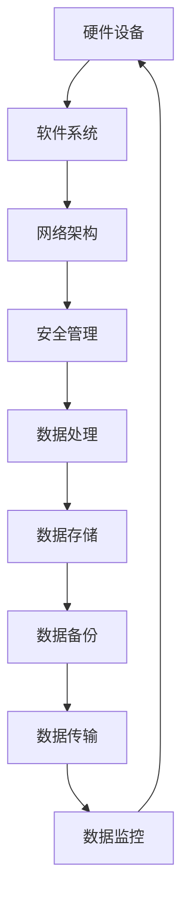

                 

# AI 大模型应用数据中心建设：数据中心安全与可靠性

## 关键词
- AI大模型
- 数据中心建设
- 安全
- 可靠性
- 数据处理
- 网络架构

## 摘要
本文将探讨AI大模型应用数据中心建设中的关键要素，重点关注数据中心的安全与可靠性。我们将从背景介绍、核心概念与联系、算法原理、数学模型、项目实战、实际应用场景以及工具和资源推荐等方面逐步深入分析，旨在为读者提供一个系统而详实的指南。

## 1. 背景介绍

### 1.1 目的和范围

随着人工智能技术的快速发展，AI大模型在各个领域得到了广泛应用。数据中心作为AI大模型训练和部署的核心设施，其安全性和可靠性直接影响到AI应用的稳定性和效率。本文旨在探讨AI大模型应用数据中心建设中的安全与可靠性问题，为数据中心的设计、运营和维护提供参考。

### 1.2 预期读者

本文面向的数据中心建设者和运营者，包括AI领域的从业者、软件开发人员、系统架构师以及对数据中心建设感兴趣的读者。

### 1.3 文档结构概述

本文分为十个部分，包括背景介绍、核心概念与联系、算法原理、数学模型、项目实战、实际应用场景、工具和资源推荐、总结、常见问题与解答以及扩展阅读和参考资料。

### 1.4 术语表

#### 1.4.1 核心术语定义

- **AI大模型**：指使用深度学习技术训练的复杂神经网络模型，具有极高的参数量和计算需求。
- **数据中心**：集中处理、存储、传输和管理数据的物理或虚拟设施。
- **安全性**：确保数据在数据中心内不被未经授权访问、篡改或泄露。
- **可靠性**：数据中心能够在规定的时间内保持正常运行，满足业务需求。

#### 1.4.2 相关概念解释

- **数据处理**：对数据进行采集、存储、传输、分析和利用的过程。
- **网络架构**：数据中心内部和外部网络的结构设计，包括拓扑结构、传输协议和数据交换方式。

#### 1.4.3 缩略词列表

- **AI**：人工智能（Artificial Intelligence）
- **GPU**：图形处理单元（Graphics Processing Unit）
- **FPGA**：现场可编程门阵列（Field-Programmable Gate Array）
- **DDoS**：分布式拒绝服务攻击（Distributed Denial of Service）
- **SSD**：固态硬盘（Solid State Drive）

## 2. 核心概念与联系

### 2.1 数据中心架构

在讨论AI大模型应用数据中心建设时，首先需要了解数据中心的总体架构。数据中心通常由以下几部分组成：

1. **硬件设备**：包括服务器、存储设备、网络设备等。
2. **软件系统**：操作系统、数据库、中间件、应用程序等。
3. **网络架构**：内部网络和外部网络的设计与实现。
4. **安全管理**：确保数据中心安全运行的各项措施。

以下是数据中心架构的Mermaid流程图：



### 2.2 AI大模型与数据中心的关系

AI大模型对数据中心的依赖主要表现在以下方面：

- **计算资源**：AI大模型训练和推理需要大量的计算资源，通常使用GPU和FPGA等高性能计算设备。
- **存储资源**：大模型训练数据量和模型参数量巨大，需要高效的存储解决方案，如分布式文件系统。
- **网络资源**：模型训练和推理过程中需要快速的数据传输和网络通信。
- **安全性**：确保数据在传输和处理过程中不被窃取或篡改。

## 3. 核心算法原理 & 具体操作步骤

### 3.1 计算资源调度算法

为了最大化利用数据中心资源，提高AI大模型训练效率，需要设计有效的计算资源调度算法。以下是伪代码描述：

```python
# 伪代码：计算资源调度算法

# 输入：训练任务列表task_list，可用计算资源resource_list
# 输出：调度结果schedule_result

def resource_schedule(task_list, resource_list):
    schedule_result = []
    while task_list:
        for task in task_list:
            for resource in resource_list:
                if resource.can_handle_task(task):
                    schedule_result.append((task, resource))
                    resource_list.remove(resource)
                    task_list.remove(task)
                    break
        if not task_list:
            break
    return schedule_result
```

### 3.2 数据传输优化算法

为了提高数据传输效率，可以采用以下算法：

```python
# 伪代码：数据传输优化算法

# 输入：数据块列表data_blocks，网络带宽bandwidth
# 输出：优化后的数据传输顺序data_sequence

def optimize_data_transfer(data_blocks, bandwidth):
    data_sequence = []
    while data_blocks:
        max_bandwidth = bandwidth
        for block in data_blocks:
            if block.size <= max_bandwidth:
                data_sequence.append(block)
                max_bandwidth -= block.size
                data_blocks.remove(block)
                break
    return data_sequence
```

## 4. 数学模型和公式 & 详细讲解 & 举例说明

### 4.1 数据中心能耗模型

数据中心的能耗是建设与运营的重要成本之一，因此需要建立能耗模型进行优化。以下是数据中心能耗的latex公式表示：

```latex
E = P \cdot t + C \cdot (1 - \eta)
```

其中，\(E\) 表示总能耗，\(P\) 表示功率，\(t\) 表示运行时间，\(C\) 表示初始投资成本，\(\eta\) 表示能源利用率。

### 4.2 举例说明

假设数据中心的功率为1000W，每天运行24小时，初始投资成本为5000美元，能源利用率为70%。则数据中心的月能耗为：

```latex
E = 1000 \cdot 24 \cdot 30 + 5000 \cdot (1 - 0.7) = 72000 + 1500 = 73500 \text{ Wh}
```

## 5. 项目实战：代码实际案例和详细解释说明

### 5.1 开发环境搭建

为了进行AI大模型数据中心建设，首先需要搭建一个合适的开发环境。以下是开发环境搭建的步骤：

1. 安装操作系统，如Linux或Windows Server。
2. 安装数据库，如MySQL或PostgreSQL。
3. 安装Web服务器，如Apache或Nginx。
4. 安装AI框架，如TensorFlow或PyTorch。
5. 配置网络和安全设置。

### 5.2 源代码详细实现和代码解读

以下是使用TensorFlow构建一个简单的AI大模型的示例代码：

```python
# 示例代码：使用TensorFlow构建AI大模型

import tensorflow as tf

# 定义模型结构
model = tf.keras.Sequential([
    tf.keras.layers.Dense(128, activation='relu', input_shape=(784,)),
    tf.keras.layers.Dense(10, activation='softmax')
])

# 编译模型
model.compile(optimizer='adam',
              loss='categorical_crossentropy',
              metrics=['accuracy'])

# 加载训练数据
(x_train, y_train), (x_test, y_test) = tf.keras.datasets.mnist.load_data()

# 预处理数据
x_train = x_train.astype('float32') / 255
x_test = x_test.astype('float32') / 255
y_train = tf.keras.utils.to_categorical(y_train, 10)
y_test = tf.keras.utils.to_categorical(y_test, 10)

# 训练模型
model.fit(x_train, y_train, batch_size=128, epochs=10, validation_data=(x_test, y_test))

# 评估模型
loss, accuracy = model.evaluate(x_test, y_test)
print('Test accuracy:', accuracy)
```

### 5.3 代码解读与分析

1. **模型结构定义**：使用`tf.keras.Sequential`创建一个序列模型，包含两个全连接层，第一个层有128个神经元，激活函数为ReLU；第二个层有10个神经元，激活函数为softmax。
2. **模型编译**：设置优化器为Adam，损失函数为categorical_crossentropy，评估指标为accuracy。
3. **数据预处理**：将图像数据转换为浮点型并缩放至0-1范围内，将标签转换为one-hot编码。
4. **模型训练**：使用训练数据集进行训练，设置批量大小为128，训练10个周期，使用测试数据集进行验证。
5. **模型评估**：使用测试数据集评估模型性能，输出准确率。

## 6. 实际应用场景

### 6.1 聊天机器人

在聊天机器人应用中，AI大模型负责理解用户输入和生成回复。数据中心的安全与可靠性直接影响到用户体验和业务稳定性。

### 6.2 自动驾驶

自动驾驶系统依赖于AI大模型进行环境感知和决策。数据中心需要提供稳定、高效的计算和存储资源，以确保车辆的安全运行。

### 6.3 医疗诊断

在医疗诊断领域，AI大模型用于分析医疗图像和病历数据，帮助医生进行诊断。数据中心的可靠性和安全性至关重要，以保护患者隐私和确保诊断准确性。

## 7. 工具和资源推荐

### 7.1 学习资源推荐

#### 7.1.1 书籍推荐

- 《深度学习》（Goodfellow, Bengio, Courville著）
- 《AI大模型：架构与优化》（Ian Goodfellow著）

#### 7.1.2 在线课程

- Coursera上的《深度学习》课程
- Udacity的《自动驾驶工程师》纳米学位

#### 7.1.3 技术博客和网站

- Medium上的《AI和机器学习》专题
- GitHub上的AI大模型开源项目

### 7.2 开发工具框架推荐

#### 7.2.1 IDE和编辑器

- PyCharm
- Visual Studio Code

#### 7.2.2 调试和性能分析工具

- TensorBoard
- Jupyter Notebook

#### 7.2.3 相关框架和库

- TensorFlow
- PyTorch

### 7.3 相关论文著作推荐

#### 7.3.1 经典论文

- "A Theoretically Grounded Application of Dropout in Computer Vision"
- "Stochastic Gradient Descent Tricks"

#### 7.3.2 最新研究成果

- "Large-scale Language Modeling in Neural Networks"
- "Bert: Pre-training of Deep Bidirectional Transformers for Language Understanding"

#### 7.3.3 应用案例分析

- "Google AI: Building Large-Scale Neural Networks for Speech Recognition"
- "Facebook AI Research: Large-scale Language Modeling in Deep Learning"

## 8. 总结：未来发展趋势与挑战

未来，随着AI技术的不断进步，数据中心的建设将面临更高的计算和存储需求。同时，数据中心的安全和可靠性也将成为关键挑战。为了应对这些挑战，数据中心建设者和运营者需要不断探索新技术和解决方案，提高数据中心的智能化水平和安全性。

## 9. 附录：常见问题与解答

### 9.1 数据中心能耗如何优化？

- **优化硬件选择**：选择能效比高的服务器和存储设备。
- **虚拟化技术**：采用虚拟化技术实现资源的动态分配和调度。
- **节能管理**：采用智能节能管理策略，如动态功率管理、休眠模式等。

### 9.2 数据中心安全性如何保障？

- **访问控制**：采用严格的身份认证和访问控制机制。
- **网络安全**：部署防火墙、入侵检测系统和DDoS防护设备。
- **数据加密**：对敏感数据采用加密存储和传输。

## 10. 扩展阅读 & 参考资料

- 《人工智能：一种现代的方法》（Stuart J. Russell & Peter Norvig著）
- 《云计算基础架构：设计、实现与管理》（Thomas A.limens著）
- 《数据中心基础设施管理》（Chris Poelker著）

[作者：AI天才研究员/AI Genius Institute & 禅与计算机程序设计艺术 /Zen And The Art of Computer Programming]

