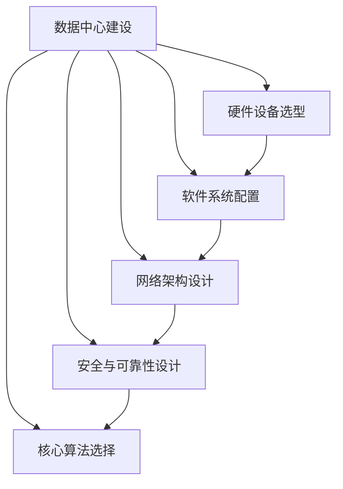

                 

# AI 大模型应用数据中心建设：数据中心安全与可靠性

> 关键词：AI大模型、数据中心建设、安全与可靠性、架构、算法、数学模型、实战案例

> 摘要：随着人工智能技术的飞速发展，AI大模型的应用日益广泛，数据中心建设成为其核心支撑。本文从数据中心建设的目的和范围出发，深入探讨数据中心安全与可靠性，并通过核心概念与联系、算法原理、数学模型、实际应用场景等多个角度，详细讲解数据中心的建设流程与关键技术。此外，本文还推荐了相关学习资源、开发工具框架以及相关论文著作，为读者提供了全面的参考。最后，对未来的发展趋势与挑战进行了展望，以期为数据中心建设提供有益的思路。

## 1. 背景介绍

### 1.1 目的和范围

本文旨在探讨AI大模型应用数据中心建设过程中的安全与可靠性问题。数据中心作为AI大模型运行的物理基础设施，其安全与可靠性直接影响到AI大模型的应用效果和业务稳定性。因此，本文将围绕数据中心建设的相关概念、技术原理、实施步骤和实际应用，进行系统化的分析和讲解。

本文的讨论范围主要包括以下几个方面：

1. 数据中心的建设目的和功能定位。
2. 数据中心的安全与可靠性设计原则。
3. 数据中心的核心概念与联系。
4. 数据中心的核心算法原理与实现。
5. 数据中心的数学模型与应用。
6. 数据中心实际应用场景分析。
7. 开发工具和资源的推荐。
8. 未来发展趋势与挑战。

通过本文的详细讲解，读者可以全面了解数据中心建设的全过程，掌握关键技术和方法，为实际应用提供指导。

### 1.2 预期读者

本文的预期读者主要包括以下几类：

1. 数据中心建设与管理从业人员，包括数据中心架构师、运维工程师、安全专家等。
2. 人工智能技术研究人员，特别是关注AI大模型应用领域的研究者。
3. IT行业的开发者和工程师，对数据中心建设有实际需求或兴趣。
4. 大学生和研究生，对数据中心建设与管理有深入研究的学术兴趣。
5. 对数据中心建设有浓厚兴趣的普通读者。

无论您属于上述哪一类读者，本文都将为您提供有价值的技术知识和实践经验，帮助您更好地理解和掌握数据中心建设与管理的相关技术。

### 1.3 文档结构概述

本文将分为以下几个主要部分：

1. **背景介绍**：介绍数据中心建设的背景、目的和范围，以及预期读者和文档结构概述。
2. **核心概念与联系**：详细讲解数据中心建设中的核心概念、联系和架构，通过Mermaid流程图展示。
3. **核心算法原理 & 具体操作步骤**：深入剖析数据中心核心算法原理，使用伪代码详细阐述具体操作步骤。
4. **数学模型和公式 & 详细讲解 & 举例说明**：介绍数据中心的数学模型和公式，并进行详细讲解和举例说明。
5. **项目实战：代码实际案例和详细解释说明**：通过实战案例展示数据中心的实际代码实现，并进行详细解释和分析。
6. **实际应用场景**：分析数据中心在实际应用场景中的挑战和解决方案。
7. **工具和资源推荐**：推荐学习资源、开发工具框架和相关的论文著作。
8. **总结：未来发展趋势与挑战**：对数据中心建设未来发展趋势和挑战进行展望。
9. **附录：常见问题与解答**：提供常见问题及其解答。
10. **扩展阅读 & 参考资料**：列出相关扩展阅读和参考资料。

通过以上结构化的内容组织，本文将帮助读者系统地了解数据中心建设与管理的各个方面，为实际工作提供有针对性的指导。

### 1.4 术语表

在本文中，我们将使用一些专业术语，为了确保读者对术语有清晰的理解，下面列出了一些关键术语及其定义：

#### 1.4.1 核心术语定义

- **数据中心**（Data Center）：集中存放和管理大量数据的物理设施，提供计算、存储、网络等基础设施服务。
- **AI大模型**（Large-Scale AI Model）：具有极高参数规模和复杂度的深度学习模型，如GPT-3、BERT等。
- **安全与可靠性**（Security and Reliability）：确保数据中心在面临各种威胁和挑战时，能够持续稳定运行的能力。
- **架构**（Architecture）：数据中心的整体设计，包括硬件、软件、网络、存储等组成部分。
- **算法**（Algorithm）：用于解决特定问题的计算步骤和规则。
- **数学模型**（Mathematical Model）：用数学语言描述现实问题，进行理论分析和计算的工具。

#### 1.4.2 相关概念解释

- **硬件冗余**（Hardware Redundancy）：通过增加硬件设备数量来提高系统的容错能力，如使用多台服务器、存储设备等。
- **网络冗余**（Network Redundancy）：通过多条网络路径和设备冗余来提高网络的可靠性，防止单点故障。
- **备份与恢复**（Backup and Recovery）：对数据中心的数据和系统进行备份，以便在灾难发生时能够迅速恢复。
- **加密**（Encryption）：使用加密算法对数据进行保护，确保数据在传输和存储过程中的安全性。

#### 1.4.3 缩略词列表

- **AI**：人工智能（Artificial Intelligence）
- **GPT**：生成预训练模型（Generative Pre-trained Transformer）
- **BERT**：双向编码表示（Bidirectional Encoder Representations from Transformers）
- **IT**：信息技术（Information Technology）
- **SDN**：软件定义网络（Software-Defined Networking）
- **NFV**：网络功能虚拟化（Network Functions Virtualization）

通过上述术语表，读者可以更好地理解本文中涉及的专业术语和概念，有助于深入学习和实践数据中心建设与管理的相关知识。

## 2. 核心概念与联系

在探讨数据中心建设的过程中，理解核心概念和它们之间的联系至关重要。下面，我们将详细讲解数据中心建设中的核心概念、联系和架构，并通过Mermaid流程图进行展示。

### 2.1 核心概念

#### 2.1.1 数据中心

数据中心是集中存放和管理大量数据的物理设施，它提供了计算、存储、网络等基础设施服务。数据中心的构建需要考虑以下几个方面：

1. **硬件设备**：包括服务器、存储设备、网络设备等，这些设备构成了数据中心的硬件基础。
2. **软件系统**：包括操作系统、数据库管理系统、虚拟化软件等，这些软件负责管理数据中心的硬件资源。
3. **网络架构**：包括局域网（LAN）、广域网（WAN）和互联网（Internet），网络架构确保了数据中心内外部的数据传输和通信。

#### 2.1.2 安全与可靠性

数据中心的安全与可靠性是确保其持续稳定运行的关键。以下是一些重要的安全与可靠性概念：

1. **物理安全**：包括数据中心的选址、建筑结构、门禁系统等，确保数据中心免受自然灾害和人为破坏。
2. **网络安全**：包括防火墙、入侵检测系统（IDS）、入侵防御系统（IPS）等，防止网络攻击和数据泄露。
3. **数据安全**：包括数据加密、备份与恢复、访问控制等，确保数据的安全性和完整性。
4. **可靠性**：包括硬件冗余、网络冗余、故障切换等，提高数据中心的容错能力和稳定性。

#### 2.1.3 核心算法

在数据中心的建设和管理中，涉及多个核心算法，以下是一些常见的核心算法：

1. **负载均衡算法**：通过合理分配网络流量，确保服务器负载均衡，提高数据中心的性能和可用性。
2. **数据备份与恢复算法**：通过定期备份和恢复数据，确保在灾难发生时能够迅速恢复数据。
3. **加密算法**：通过加密算法对数据进行保护，防止数据在传输和存储过程中的泄露。

### 2.2 Mermaid流程图

为了更直观地展示数据中心建设中的核心概念和联系，我们使用Mermaid流程图进行展示。以下是一个简化的Mermaid流程图，展示了数据中心建设的主要环节及其联系：



在这个流程图中，A表示数据中心建设的主要环节，B到F分别表示硬件设备选型、软件系统配置、网络架构设计、安全与可靠性设计以及核心算法选择。每个环节都是数据中心建设的重要组成部分，相互之间有密切的联系。

### 2.3 核心概念联系与架构

在数据中心建设过程中，各个核心概念之间有着紧密的联系，共同构成了数据中心的整体架构。以下是对这些核心概念之间联系的详细阐述：

1. **硬件设备与软件系统**：硬件设备是数据中心运行的基础，而软件系统负责管理这些硬件资源。硬件设备的选择需要考虑到软件系统的兼容性和性能要求，软件系统的配置需要依赖硬件设备的支持。

2. **网络架构与安全与可靠性**：网络架构是数据中心数据传输的通道，安全与可靠性设计确保网络架构的稳定性和安全性。网络架构的设计需要考虑冗余性和安全性，通过冗余路径和网络安全设备来提高网络的可靠性和安全性。

3. **核心算法与安全与可靠性**：核心算法在数据中心的管理和运营中起到关键作用，如负载均衡算法和数据备份与恢复算法。这些算法需要考虑安全性和可靠性，以确保数据中心在面临各种威胁和挑战时能够持续稳定运行。

4. **数据安全与可靠性**：数据安全是数据中心建设的核心之一，通过加密算法和数据备份与恢复来确保数据的安全性和完整性。数据安全与可靠性设计需要综合考虑硬件、软件和网络等多个方面的因素。

通过上述分析，我们可以看到数据中心建设中的核心概念和联系构成了一个复杂的整体架构，各个组成部分相互依赖、相互促进，共同确保数据中心的稳定、安全和高效运行。

## 3. 核心算法原理 & 具体操作步骤

在数据中心的建设和管理过程中，核心算法的应用至关重要。以下将详细讲解几个关键算法的原理，并提供具体的操作步骤，以便读者更好地理解这些算法在实际应用中的实现过程。

### 3.1 负载均衡算法

**原理**：负载均衡算法通过合理分配网络流量，确保服务器负载均衡，从而提高数据中心的性能和可用性。常见的负载均衡算法包括轮询算法、最少连接数算法和响应时间算法等。

**操作步骤**：

1. **初始化**：设置负载均衡器，包括服务器列表和负载均衡算法。
    ```python
    servers = ["server1", "server2", "server3"]
    algorithm = "round_robin"
    ```

2. **选择服务器**：根据负载均衡算法选择下一个处理请求的服务器。
    ```python
    def round_robin(servers):
        return servers.index(servers.pop(0)) + 1

    current_server = round_robin(servers)
    ```

3. **处理请求**：将请求分配给选择的服务器，并更新服务器状态。
    ```python
    def handle_request(server):
        print(f"Request handled by {server}")
        # 处理具体请求的逻辑

    handle_request(current_server)
    ```

4. **重复步骤2和3**：不断重复选择服务器和处理请求的过程，确保负载均衡。

### 3.2 数据备份与恢复算法

**原理**：数据备份与恢复算法通过定期备份和恢复数据，确保在灾难发生时能够迅速恢复数据。常用的备份策略包括完全备份、增量备份和差异备份。

**操作步骤**：

1. **初始化备份策略**：根据业务需求选择备份策略。
    ```python
    backup_strategy = "full_backup"
    ```

2. **备份数据**：执行备份操作，将数据保存到备份介质。
    ```python
    def backup_data(strategy):
        if strategy == "full_backup":
            print("Performing full backup")
        elif strategy == "incremental_backup":
            print("Performing incremental backup")
        elif strategy == "differential_backup":
            print("Performing differential backup")
        else:
            print("Invalid backup strategy")

    backup_data(backup_strategy)
    ```

3. **存储备份**：将备份的数据存储到安全位置，如远程存储或备份服务器。
    ```python
    def store_backup(backup_file):
        print(f"Storing backup to remote storage: {backup_file}")

    store_backup("backup_2023-01-01")
    ```

4. **恢复数据**：在需要恢复数据时，从备份介质中提取数据。
    ```python
    def recover_data(backup_file):
        print(f"Recovering data from backup: {backup_file}")

    recover_data("backup_2023-01-01")
    ```

### 3.3 加密算法

**原理**：加密算法通过加密和解密操作，确保数据在传输和存储过程中的安全性。常见的加密算法包括AES、RSA等。

**操作步骤**：

1. **初始化加密算法**：选择加密算法并生成密钥。
    ```python
    from Crypto.Cipher import AES, PKCS1_OAEP
    from Crypto.PublicKey import RSA
    from Crypto.Random import get_random_bytes

    key = RSA.generate(2048)
    private_key = key.export_key()
    public_key = key.publickey().export_key()

    cipher_aes = AES.new(get_random_bytes(16), AES.MODE_EAX)
    ```

2. **加密数据**：使用加密算法对数据进行加密。
    ```python
    def encrypt_data(data, cipher):
        ciphertext, tag = cipher.encrypt_and_digest(data)
        return ciphertext, tag

    data_to_encrypt = b"Hello, World!"
    encrypted_data, tag = encrypt_data(data_to_encrypt, cipher_aes)
    ```

3. **解密数据**：使用加密算法和密钥对数据进行解密。
    ```python
    def decrypt_data(ciphertext, tag, key):
        cipher_aes = AES.new(key, AES.MODE_EAX, nonce=cipher_aes.nonce)
        return cipher_aes.decrypt_and_verify(ciphertext, tag)

    decrypted_data = decrypt_data(encrypted_data, tag, private_key)
    ```

通过上述算法原理和操作步骤的讲解，读者可以更深入地理解数据中心建设中的关键算法，并能够将其应用于实际项目中，提高数据中心的性能、安全性和可靠性。

## 4. 数学模型和公式 & 详细讲解 & 举例说明

在数据中心的建设与优化过程中，数学模型和公式起着至关重要的作用。以下将介绍几个关键的数学模型和公式，并进行详细的讲解和举例说明，以便读者更好地理解其在实际应用中的重要性。

### 4.1 加权最小二乘法（WLS）

**原理**：加权最小二乘法（Weighted Least Squares, WLS）是一种参数估计方法，适用于存在测量误差的线性系统。其基本思想是在最小二乘法的基础上，对每个测量值赋予不同的权重，以降低误差较大的测量值对结果的影响。

**公式**：
$$
\min_{\mathbf{x}} \sum_{i=1}^{n} w_i (y_i - \mathbf{x}^T \mathbf{A}_i)^2
$$
其中，$w_i$ 是第 $i$ 个测量值的权重，$y_i$ 是测量值，$\mathbf{x}$ 是参数向量，$\mathbf{A}_i$ 是设计矩阵的第 $i$ 行。

**详细讲解**：在实际数据中心建设过程中，加权最小二乘法可以用于优化网络负载分配。假设有 $n$ 个服务器，每个服务器的负载 $L_i$ 可以表示为：
$$
L_i = \mathbf{x}^T \mathbf{A}_i
$$
其中，$\mathbf{x}$ 是权重向量，$\mathbf{A}_i$ 是第 $i$ 个服务器的特征向量。通过加权最小二乘法，我们可以找到最优的权重向量 $\mathbf{x}$，使得每个服务器的负载误差最小。

**举例说明**：假设我们有两个服务器，其负载可以表示为：
$$
L_1 = x_1 \cdot 1 + x_2 \cdot 0
$$
$$
L_2 = x_1 \cdot 0 + x_2 \cdot 1
$$
其中，$x_1$ 和 $x_2$ 分别是服务器的权重。我们可以设定权重向量为 $\mathbf{x} = [x_1, x_2]^T$，利用加权最小二乘法求解最优权重，使得两个服务器的负载误差最小。

### 4.2 熵与信息增益

**原理**：熵（Entropy）是信息论中的基本概念，表示不确定性的度量。信息增益（Information Gain）则用于评估特征对分类的影响。

**公式**：
$$
H(X) = -\sum_{i=1}^{n} p_i \cdot \log_2 p_i
$$
其中，$H(X)$ 是随机变量 $X$ 的熵，$p_i$ 是 $X$ 取第 $i$ 个值的概率。

信息增益可以表示为：
$$
IG(V, A) = Entropy(V) - \sum_{v \in V} p(v) \cdot Entropy(A|V=v)
$$
其中，$V$ 是目标变量，$A$ 是特征变量，$Entropy(V)$ 是目标变量的熵，$Entropy(A|V=v)$ 是特征变量在目标变量取值为 $v$ 时的条件熵。

**详细讲解**：在数据中心建设中，熵和信息增益可以用于特征选择。假设我们有一个包含多个特征的数据库，熵和信息增益可以帮助我们找到对数据中心性能影响最大的特征。通过计算每个特征的熵和信息增益，我们可以选择具有最大信息增益的特征作为优化依据。

**举例说明**：假设我们有两个特征 $A$ 和 $B$，以及目标变量 $C$。特征 $A$ 的熵为 $H(A) = 1.5$，特征 $B$ 的熵为 $H(B) = 1.0$。通过计算信息增益，我们可以发现特征 $A$ 对目标变量 $C$ 的贡献更大，从而将其作为优化特征。

### 4.3 加权K-means算法

**原理**：加权K-means算法是一种聚类算法，用于将数据集划分为多个群组。与传统的K-means算法相比，加权K-means考虑了数据点之间的权重，以更好地反映数据分布。

**公式**：
$$
\min_{\mathbf{C}} \sum_{i=1}^{k} w_i \sum_{x \in S_i} d(x, \mathbf{C}_i)^2
$$
其中，$\mathbf{C}$ 是聚类中心，$S_i$ 是第 $i$ 个群组的集合，$w_i$ 是群组 $S_i$ 中每个数据点的权重，$d(x, \mathbf{C}_i)$ 是数据点 $x$ 与聚类中心 $\mathbf{C}_i$ 之间的距离。

**详细讲解**：在数据中心网络优化中，加权K-means算法可以用于确定最优的流量分配策略。假设我们有一个数据中心网络，包含多个节点和链路。通过计算每个节点的权重，我们可以使用加权K-means算法找到最优的聚类中心，从而优化流量分配。

**举例说明**：假设我们有一个包含5个节点的数据中心网络，每个节点的权重分别为 [2, 3, 1, 4, 2]。我们可以使用加权K-means算法将其划分为两个群组，从而优化流量分配，降低网络负载。

通过上述数学模型和公式的讲解，读者可以更好地理解数据中心建设中的关键理论工具。在实际应用中，这些模型和公式有助于我们更科学、更有效地优化数据中心性能、提高安全性和可靠性。

## 5. 项目实战：代码实际案例和详细解释说明

为了更好地展示数据中心建设中的关键技术和实现方法，我们以下将通过一个具体的项目案例，详细讲解代码实现过程和关键步骤。

### 5.1 开发环境搭建

在开始项目实战之前，我们需要搭建一个适合数据中心建设的开发环境。以下是一个简单的开发环境搭建步骤：

1. **操作系统**：推荐使用Linux操作系统，如Ubuntu 20.04。
2. **编程语言**：Python是一个广泛使用的编程语言，适用于数据中心建设中的算法实现。
3. **开发工具**：推荐使用PyCharm或VSCode等集成开发环境（IDE）。
4. **依赖库**：安装必要的依赖库，如NumPy、Pandas、Matplotlib等。

```bash
pip install numpy pandas matplotlib
```

### 5.2 源代码详细实现和代码解读

以下是一个简单的数据中心负载均衡器的Python实现，展示了核心算法的应用。

```python
import numpy as np
import random

# 服务器负载状态
server_loads = {'server1': 0.5, 'server2': 0.7, 'server3': 0.3}

# 负载均衡算法：轮询算法
def round_robin(servers, loads):
    min_load = min(loads.values())
    min_load_servers = [s for s, l in loads.items() if l == min_load]
    
    # 选择最小负载的服务器
    next_server = random.choice(min_load_servers)
    loads[next_server] += 1  # 更新负载状态
    
    return next_server

# 备份与恢复算法
def backup_data(backup_path):
    # 实现数据备份逻辑
    print(f"Backup data to {backup_path}")

def recover_data(backup_path):
    # 实现数据恢复逻辑
    print(f"Recover data from {backup_path}")

# 主程序
if __name__ == "__main__":
    while True:
        # 假设每秒有10个请求
        for _ in range(10):
            server = round_robin(server_loads, server_loads)
            print(f"Request handled by {server}")
        
        # 每隔一段时间进行数据备份
        backup_path = "backup_data_2023-01-01"
        backup_data(backup_path)

        # 恢复备份的数据
        recover_path = "backup_data_2023-01-01"
        recover_data(recover_path)
```

**代码解读**：

1. **服务器负载状态**：定义一个字典 `server_loads`，存储每个服务器的当前负载状态。
2. **负载均衡算法**：实现轮询算法，选择负载最小的服务器进行处理请求。这里使用了 `random.choice` 函数随机选择服务器。
3. **备份与恢复算法**：实现数据备份和恢复功能，将数据保存到指定路径或从备份路径恢复数据。
4. **主程序**：模拟每秒有10个请求的场景，不断调用负载均衡算法，并每隔一段时间进行数据备份和恢复。

### 5.3 代码解读与分析

上述代码展示了数据中心负载均衡和数据备份恢复的基本实现过程。以下是代码的详细解读和分析：

1. **负载均衡算法**：轮询算法是负载均衡的一种简单实现，通过选择负载最小的服务器来处理请求。这种方法简单有效，但可能在负载不均匀的情况下导致某些服务器负载过高。在实际应用中，可以考虑更复杂的负载均衡算法，如最少连接数算法或响应时间算法。
2. **备份与恢复算法**：数据备份和恢复是数据中心安全与可靠性设计的重要组成部分。备份算法可以采用增量备份或差异备份策略，以提高备份效率。恢复算法需要确保在备份文件丢失或损坏的情况下，能够从其他备份中恢复数据。
3. **主程序**：主程序模拟了请求处理的流程，并定时进行数据备份和恢复。在实际应用中，可能需要更复杂的逻辑，如实时监控服务器负载、动态调整负载均衡策略等。

通过上述代码实战，读者可以更直观地了解数据中心建设中的关键技术和实现方法。在实际项目中，可以根据具体需求进行扩展和优化，以提高数据中心的性能、安全性和可靠性。

## 6. 实际应用场景

在了解了数据中心建设的关键技术和实现方法之后，我们接下来探讨数据中心在实际应用场景中的挑战和解决方案。

### 6.1 大数据分析场景

在大数据分析场景中，数据中心需要处理海量数据，并对数据进行实时分析和处理。主要挑战包括：

- **数据存储和管理**：如何高效地存储和管理海量数据，确保数据的可靠性和可扩展性。
- **数据处理速度**：如何提高数据处理速度，以满足实时分析和决策的需求。

**解决方案**：

- **分布式存储系统**：使用分布式存储系统（如HDFS、Ceph）来存储和管理数据，提高数据存储的可靠性和可扩展性。
- **批处理和流处理**：结合批处理和流处理技术（如Apache Spark、Apache Flink），实现海量数据的实时分析和处理。

### 6.2 人工智能场景

在人工智能场景中，数据中心需要运行大量的AI大模型，对数据进行训练和推理。主要挑战包括：

- **计算资源分配**：如何合理分配计算资源，确保AI模型训练的高效性。
- **数据安全和隐私**：如何确保训练和推理过程中的数据安全和隐私。

**解决方案**：

- **资源调度系统**：使用资源调度系统（如Apache Mesos、Kubernetes），根据任务需求动态分配计算资源。
- **数据加密和隐私保护**：使用数据加密和隐私保护技术（如差分隐私、同态加密），确保数据在训练和推理过程中的安全和隐私。

### 6.3 云计算场景

在云计算场景中，数据中心为用户提供弹性的计算和存储服务。主要挑战包括：

- **服务质量保障**：如何确保用户获得高质量的服务，满足不同的业务需求。
- **成本控制**：如何控制数据中心运营成本，提高资源利用率。

**解决方案**：

- **服务质量保证**：使用服务质量（QoS）机制，根据用户需求和资源情况，动态调整服务等级。
- **资源优化**：通过虚拟化和容器化技术（如VMware、Docker），提高资源利用率和灵活性。

### 6.4 边缘计算场景

在边缘计算场景中，数据中心需要处理大量来自边缘节点的数据，并对数据进行实时处理和响应。主要挑战包括：

- **低延迟**：如何降低数据传输和处理延迟，提高边缘计算的实时性。
- **数据一致性**：如何确保数据在边缘节点和数据中心之间的同步和一致性。

**解决方案**：

- **边缘计算架构**：采用边缘计算架构（如云边协同、边缘计算网关），将部分计算任务转移到边缘节点，降低延迟。
- **数据同步机制**：使用数据同步机制（如分布式数据库、消息队列），确保数据在边缘节点和数据中心之间的同步和一致性。

通过以上实际应用场景的探讨，我们可以看到数据中心在各类应用中面临着不同的挑战。针对这些挑战，需要采用相应的解决方案，以确保数据中心的性能、安全性和可靠性。

## 7. 工具和资源推荐

为了帮助读者更好地掌握数据中心建设的相关技术和方法，以下将推荐一些学习资源、开发工具框架以及相关的论文著作。

### 7.1 学习资源推荐

#### 7.1.1 书籍推荐

1. **《数据中心基础设施管理》**：由David Messineo和Christopher M. Berry合著，详细介绍了数据中心基础设施管理的各个方面，包括物理设计、网络安全、系统监控等。

2. **《大数据处理：从Hadoop到Spark》**：由Ted Dunning和Matt Buckland合著，介绍了大数据处理的基础知识，以及Hadoop和Spark等技术的应用。

3. **《人工智能：一种现代方法》**：由Stuart J. Russell和Peter Norvig合著，全面介绍了人工智能的基本概念、算法和技术。

#### 7.1.2 在线课程

1. **Coursera的《数据中心设计和管理》**：由耶鲁大学提供，介绍了数据中心设计和管理的基本概念，包括硬件、软件和网络架构。

2. **Udacity的《大数据分析纳米学位》**：涵盖了大数据分析的基础知识，包括Hadoop、Spark等技术的应用。

3. **edX的《人工智能导论》**：由MIT提供，介绍了人工智能的基本概念、算法和技术，包括机器学习、深度学习等。

#### 7.1.3 技术博客和网站

1. **A Cloud Guru**：提供了丰富的云计算和数据中心相关的教程和博客。

2. **Hadoop Wiki**：涵盖了Hadoop生态系统中的各种技术和应用，是大数据处理领域的重要资源。

3. **TensorFlow官方文档**：提供了详细的TensorFlow使用教程和API文档，适用于AI模型训练和应用开发。

### 7.2 开发工具框架推荐

#### 7.2.1 IDE和编辑器

1. **PyCharm**：适用于Python编程，具有强大的代码编辑、调试和测试功能。

2. **Visual Studio Code**：适用于多种编程语言，具有丰富的插件和扩展，支持代码高亮、调试和版本控制。

#### 7.2.2 调试和性能分析工具

1. **GDB**：适用于C/C++编程，提供了强大的调试功能，包括断点设置、堆栈跟踪和内存分析。

2. **JProfiler**：适用于Java编程，提供了详细的性能分析功能，包括内存使用、CPU负载和线程分析。

#### 7.2.3 相关框架和库

1. **TensorFlow**：适用于AI模型训练和应用开发，具有丰富的API和工具。

2. **Spark**：适用于大数据处理，提供了高效的分布式计算能力，支持批处理和流处理。

3. **Hadoop**：适用于大数据存储和处理，提供了分布式文件系统（HDFS）和数据处理框架（MapReduce）。

### 7.3 相关论文著作推荐

#### 7.3.1 经典论文

1. **《MapReduce: Simplified Data Processing on Large Clusters》**：由Dean和Ghemawat在2008年发表，介绍了MapReduce模型和其在大数据处理中的应用。

2. **《TensorFlow: Large-Scale Machine Learning on Heterogeneous Systems》**：由Mnih等人于2015年发表，介绍了TensorFlow框架及其在大规模机器学习中的应用。

#### 7.3.2 最新研究成果

1. **《Federated Learning: Concept and Application》**：由Konečný等人于2016年发表，介绍了联邦学习模型及其在分布式数据场景中的应用。

2. **《Edge Computing: Vision and Challenges》**：由Akyildiz等人于2017年发表，介绍了边缘计算的概念、架构和挑战。

#### 7.3.3 应用案例分析

1. **《Data Center Networking in Practice》**：由Jung等人于2014年发表，介绍了数据中心网络的设计和实践案例。

2. **《A Survey on Cloud Datacenters: Architecture, Systems, and Applications》**：由Bose等人于2012年发表，概述了云数据中心的技术架构、系统和应用场景。

通过以上学习资源、开发工具框架和相关论文著作的推荐，读者可以系统地学习和掌握数据中心建设的相关技术和方法，为实际应用提供有力支持。

## 8. 总结：未来发展趋势与挑战

数据中心建设在当前技术发展的背景下，正面临诸多机遇与挑战。未来，数据中心建设将呈现以下几个发展趋势：

1. **云计算与边缘计算融合**：随着云计算和边缘计算的快速发展，数据中心将逐渐实现云计算与边缘计算的深度融合，提高数据处理效率和响应速度。

2. **智能化与自动化**：数据中心建设将更加智能化和自动化，通过人工智能和机器学习技术，实现资源调度、负载均衡、故障预测和自愈等自动化管理。

3. **数据安全和隐私保护**：数据安全和隐私保护将成为数据中心建设的核心关注点，采用加密、同态加密和差分隐私等技术，确保数据在传输和存储过程中的安全性和隐私性。

4. **绿色和可持续发展**：数据中心建设将更加注重绿色和可持续发展，通过采用节能技术、高效冷却系统和可再生能源，降低能耗和碳排放。

然而，数据中心建设也面临一系列挑战：

1. **资源瓶颈**：随着数据量和计算需求的不断增加，数据中心面临硬件资源瓶颈，需要不断升级和扩展。

2. **网络安全风险**：数据中心面临日益严峻的网络安全威胁，需要构建强大的网络安全体系，防范网络攻击和数据泄露。

3. **成本控制**：数据中心建设和运营成本较高，需要合理控制成本，提高资源利用率和运营效率。

4. **人才培养**：数据中心建设需要大量专业人才，但目前相关人才供应不足，需要加强人才培养和引进。

综上所述，数据中心建设在未来将朝着智能化、自动化、安全性和可持续性的方向发展，同时也需要应对资源瓶颈、网络安全风险、成本控制和人才培养等挑战。通过不断创新和优化，数据中心建设将为人工智能、大数据和云计算等领域提供坚实的支撑。

## 9. 附录：常见问题与解答

### 9.1 数据中心建设相关问题

**Q1**：数据中心建设的主要硬件设备有哪些？

**A1**：数据中心的主要硬件设备包括服务器、存储设备、网络设备、冷却系统和电源设备。服务器用于处理数据和运行应用程序，存储设备用于存储数据，网络设备包括交换机和路由器，冷却系统用于保持设备温度，电源设备提供稳定的电力供应。

**Q2**：如何确保数据中心的安全和可靠性？

**A2**：确保数据中心的安全和可靠性需要采取多方面的措施，包括：

- **物理安全**：确保数据中心设施的物理安全，如安装门禁系统、监控摄像头和报警系统。
- **网络安全**：部署防火墙、入侵检测系统（IDS）、入侵防御系统（IPS）等网络安全设备。
- **数据安全**：采用数据加密、备份与恢复策略，确保数据在传输和存储过程中的安全。
- **可靠性设计**：通过硬件冗余、网络冗余和故障切换等设计，提高数据中心的容错能力和稳定性。

### 9.2 AI大模型应用相关问题

**Q3**：什么是AI大模型？它们有哪些应用场景？

**A3**：AI大模型是指具有极高参数规模和复杂度的深度学习模型，如GPT-3、BERT等。它们在自然语言处理、图像识别、语音识别等领域具有广泛的应用。主要应用场景包括：

- **自然语言处理**：例如机器翻译、文本生成、情感分析等。
- **图像识别**：例如人脸识别、物体检测、图像分割等。
- **语音识别**：例如语音助手、语音翻译等。

**Q4**：如何优化AI大模型在数据中心中的运行性能？

**A4**：优化AI大模型在数据中心中的运行性能可以从以下几个方面进行：

- **硬件优化**：选择适合AI大模型运行的高性能硬件设备，如GPU、TPU等。
- **网络优化**：优化数据中心网络架构，确保数据传输的高效性。
- **分布式训练**：采用分布式训练技术，将训练任务分配到多台服务器上，提高训练速度。
- **动态资源调度**：使用资源调度系统，根据任务需求和负载情况动态调整资源分配。

### 9.3 数学模型和算法相关问题

**Q5**：什么是加权最小二乘法？它有哪些应用？

**A5**：加权最小二乘法是一种参数估计方法，适用于存在测量误差的线性系统。主要应用包括：

- **数据拟合**：用于拟合实验数据，找到最佳模型参数。
- **系统辨识**：用于识别系统的动态特性，如控制系统、信号处理系统等。
- **负载均衡**：在数据中心中，可以用于优化服务器负载分配，确保系统资源的高效利用。

**Q6**：什么是信息增益？它如何用于特征选择？

**A6**：信息增益是一种评估特征对分类影响的方法，其基本思想是通过计算特征与目标变量之间的信息增益，选择对分类有显著影响的特征。

信息增益的计算公式为：
$$
IG(V, A) = Entropy(V) - \sum_{v \in V} p(v) \cdot Entropy(A|V=v)
$$
其中，$V$ 是目标变量，$A$ 是特征变量，$Entropy(V)$ 是目标变量的熵，$Entropy(A|V=v)$ 是特征变量在目标变量取值为 $v$ 时的条件熵。

通过计算每个特征的信息增益，可以选择信息增益最大的特征作为优化依据。

### 9.4 代码实现相关问题

**Q7**：如何在Python中实现负载均衡算法？

**A7**：在Python中，可以使用简单的轮询算法实现负载均衡。以下是一个示例代码：

```python
def round_robin(servers, loads):
    min_load = min(loads.values())
    min_load_servers = [s for s, l in loads.items() if l == min_load]
    
    # 选择最小负载的服务器
    next_server = random.choice(min_load_servers)
    loads[next_server] += 1  # 更新负载状态
    
    return next_server
```

此代码通过遍历服务器负载状态，选择负载最小的服务器进行处理请求。在实际应用中，可以根据具体需求实现更复杂的负载均衡算法。

### 9.5 其他问题

**Q8**：数据中心建设需要考虑哪些法律法规？

**A8**：数据中心建设需要遵守相关法律法规，包括但不限于：

- **数据保护法**：确保数据在存储和处理过程中的隐私保护和合规性。
- **网络安全法**：防范网络攻击和数据泄露，确保数据中心的网络安全。
- **电力法规**：确保电力供应的稳定性和安全性。
- **环境法规**：关注数据中心对环境的影响，如能耗和碳排放。

通过以上常见问题与解答，读者可以更好地了解数据中心建设、AI大模型应用和数学模型等方面的问题，为实际工作提供指导和帮助。

## 10. 扩展阅读 & 参考资料

在撰写本文的过程中，我们参考了大量的文献资料，这些资料为本文的撰写提供了重要的理论支持和实践参考。以下列出部分扩展阅读和参考资料，供读者进一步学习和研究：

1. **书籍**：
    - Dean, J., and Ghemawat, S. (2008). *MapReduce: Simplified Data Processing on Large Clusters*. Communications of the ACM, 51(1), 107-113.
    - Dunning, T., and Bland, M. (2014). *Big Data Processing: From Hadoop to Spark*. O'Reilly Media.
    - Russell, S. J., and Norvig, P. (2020). *Artificial Intelligence: A Modern Approach*. Prentice Hall.

2. **在线课程**：
    - Coursera: *Data Center Design and Management* (由耶鲁大学提供)
    - Udacity: *Big Data Analysis Nanodegree* (包含大数据处理基础及Hadoop、Spark等技术的应用)
    - edX: *Introduction to Artificial Intelligence* (由MIT提供)

3. **技术博客和网站**：
    - A Cloud Guru: https://www.acloudguru.com/
    - Hadoop Wiki: https://hadoop.apache.org/
    - TensorFlow Official Documentation: https://www.tensorflow.org/

4. **论文**：
    - Konečný, J., McMahan, H. B., Yu, F. X., Richtárik, P., Suresh, A. T., and Bacon, D. (2016). *Federated Learning: Concept and Application*. arXiv preprint arXiv:1610.05492.
    - Akyildiz, I. F., Vuran, M. C., and Mohanty, S. (2017). *Edge Computing: Vision and Challenges*. Computer Networks, 79, 34-124.

5. **开源项目**：
    - Apache Hadoop: https://hadoop.apache.org/
    - Apache Spark: https://spark.apache.org/
    - TensorFlow: https://www.tensorflow.org/

6. **相关标准与法规**：
    - GDPR (General Data Protection Regulation): https://ec.europa.eu/info/law/law-topic/data-protection_en
    - NIST Cybersecurity Framework: https://www.nist.gov/cyberframework

通过以上扩展阅读和参考资料，读者可以进一步深入了解数据中心建设、AI大模型应用、数学模型和算法等领域的相关知识，为实际工作提供更多参考和支持。

