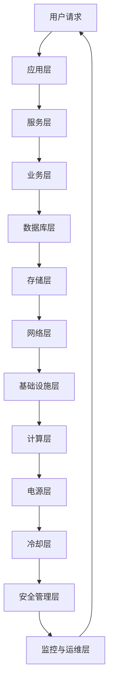
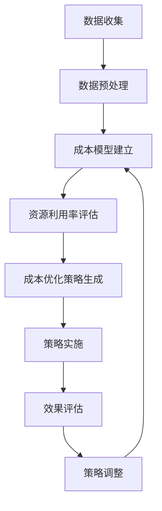

                 

# AI 大模型应用数据中心建设：数据中心成本优化

> **关键词：** AI 大模型、数据中心建设、成本优化、资源分配、能耗管理、性能监控

> **摘要：** 本文将深入探讨 AI 大模型应用数据中心建设中的成本优化问题。通过分析数据中心的基本架构、核心技术和成本结构，提出一系列优化策略，旨在降低运营成本，提高资源利用率，确保数据中心的高效稳定运行。

## 1. 背景介绍

### 1.1 目的和范围

本文旨在为 AI 大模型应用数据中心的建设提供一套成本优化的解决方案。随着 AI 技术的快速发展，数据中心作为 AI 模型训练和推理的核心基础设施，面临着巨大的成本压力。如何在这其中实现成本优化，成为当前数据中心建设面临的一个重要课题。

本文将围绕以下内容展开：

1. 数据中心的基本架构和核心技术。
2. 数据中心成本结构分析。
3. 数据中心成本优化策略。
4. 实际应用场景和案例分析。
5. 未来发展趋势与挑战。

### 1.2 预期读者

本文适合以下读者群体：

1. 数据中心建设和管理人员。
2. AI 技术研发和运维人员。
3. 企业 IT 管理人员。
4. 对数据中心成本优化有兴趣的技术爱好者。

### 1.3 文档结构概述

本文分为八个部分：

1. 背景介绍：概述本文目的、范围和结构。
2. 核心概念与联系：介绍数据中心建设相关核心概念和架构。
3. 核心算法原理 & 具体操作步骤：详细讲解数据中心成本优化的算法原理和操作步骤。
4. 数学模型和公式 & 详细讲解 & 举例说明：阐述数据中心成本优化的数学模型和具体应用。
5. 项目实战：通过代码实际案例展示成本优化策略的实施。
6. 实际应用场景：分析数据中心成本优化在不同场景下的应用。
7. 工具和资源推荐：推荐相关学习资源、开发工具和文献。
8. 总结：对数据中心成本优化的未来发展趋势和挑战进行展望。

### 1.4 术语表

#### 1.4.1 核心术语定义

- **数据中心**：为满足企业 IT 需求而建设的数据处理、存储、网络交换和管理的综合性设施。
- **AI 大模型**：参数规模庞大的机器学习模型，如深度神经网络等。
- **成本优化**：通过合理配置资源、提高效率、降低能耗等手段，降低数据中心运营成本。
- **资源利用率**：数据中心各类资源（如计算、存储、网络）被充分利用的程度。

#### 1.4.2 相关概念解释

- **能耗管理**：对数据中心能耗进行监测、分析和优化，降低能源消耗。
- **性能监控**：实时监控数据中心性能指标，如 CPU 负载、网络吞吐量、存储 IOPS 等。
- **资源分配**：根据应用需求，合理分配数据中心各类资源。

#### 1.4.3 缩略词列表

- **AI**：人工智能（Artificial Intelligence）
- **DC**：数据中心（Data Center）
- **GPU**：图形处理器（Graphics Processing Unit）
- **CPU**：中央处理器（Central Processing Unit）
- **FPGA**：现场可编程门阵列（Field-Programmable Gate Array）
- **SDN**：软件定义网络（Software-Defined Networking）
- **NFV**：网络功能虚拟化（Network Functions Virtualization）
- **PUE**：电源使用效率（Power Usage Effectiveness）
- **IT**：信息技术（Information Technology）

## 2. 核心概念与联系

在探讨数据中心成本优化之前，有必要先了解数据中心的基本架构和核心技术。以下是一个简化的数据中心架构图，用于展示核心概念和它们之间的联系。



### 2.1 数据中心架构

数据中心架构可以分为五个层次：

1. **应用层**：为用户提供各种在线服务和应用，如网站、电子邮件、云服务等。
2. **服务层**：提供基础服务，如数据库、缓存、消息队列等。
3. **业务层**：支持企业核心业务，如电子商务、大数据分析等。
4. **数据库层**：存储和管理海量数据，确保数据的安全、可靠和高效访问。
5. **存储层**：提供数据存储服务，包括文件存储、对象存储、块存储等。

### 2.2 核心技术

数据中心核心技术包括：

1. **计算技术**：利用 CPU、GPU、FPGA 等计算资源，提供强大的数据处理能力。
2. **网络技术**：采用 SDN、NFV 等技术，实现网络资源的灵活调度和高效管理。
3. **存储技术**：采用分布式存储、闪存存储等技术，提高数据存储速度和可靠性。
4. **能耗管理技术**：通过能耗监测、功耗预测、智能调度等技术，降低数据中心能耗。
5. **冷却技术**：采用液冷、风冷等技术，保证设备正常运行温度。

### 2.3 数据中心成本结构

数据中心成本可以分为以下几部分：

1. **硬件成本**：包括服务器、存储设备、网络设备、电源设备等。
2. **软件成本**：包括操作系统、数据库软件、中间件等。
3. **能耗成本**：包括电力、制冷等能源消耗。
4. **运维成本**：包括人员工资、运维工具、外包服务等。
5. **网络成本**：包括宽带接入、专线租赁等。

## 3. 核心算法原理 & 具体操作步骤

数据中心成本优化需要基于一系列算法原理和操作步骤。以下是一个简单的算法流程，用于实现数据中心成本优化：

### 3.1 算法流程



### 3.2 数据收集

数据收集是成本优化的重要基础。主要收集以下数据：

- **硬件数据**：如服务器、存储设备、网络设备的型号、配置、能耗等。
- **软件数据**：如操作系统版本、数据库版本、中间件版本等。
- **能耗数据**：如电力消耗、制冷设备运行情况等。
- **运维数据**：如人员工作量、运维工具使用情况等。
- **网络数据**：如宽带接入速度、专线租赁费用等。

### 3.3 数据预处理

数据预处理包括以下步骤：

1. **数据清洗**：去除重复数据、缺失数据、异常数据等。
2. **数据转换**：将不同类型的数据转换为统一格式，如将能耗数据从不同单位转换为瓦特（W）。
3. **数据归一化**：对数据进行归一化处理，使其具有可比性。

### 3.4 成本模型建立

成本模型建立是成本优化的核心步骤。主要建立以下模型：

1. **硬件成本模型**：根据硬件数据，建立硬件成本模型，如服务器成本模型、存储设备成本模型等。
2. **软件成本模型**：根据软件数据，建立软件成本模型，如操作系统成本模型、数据库成本模型等。
3. **能耗成本模型**：根据能耗数据，建立能耗成本模型，如电力消耗成本模型、制冷设备成本模型等。
4. **运维成本模型**：根据运维数据，建立运维成本模型，如人员工资成本模型、运维工具成本模型等。
5. **网络成本模型**：根据网络数据，建立网络成本模型，如宽带接入成本模型、专线租赁成本模型等。

### 3.5 资源利用率评估

资源利用率评估是成本优化的关键步骤。主要评估以下资源利用率：

1. **计算资源利用率**：计算服务器、GPU、FPGA 等计算资源的利用率。
2. **存储资源利用率**：计算存储设备的利用率，如文件存储、对象存储、块存储等。
3. **网络资源利用率**：计算网络带宽、网络接口等的利用率。
4. **能耗资源利用率**：计算数据中心整体的能耗利用率。

### 3.6 成本优化策略生成

成本优化策略生成是根据成本模型和资源利用率评估结果，生成一系列成本优化策略。主要策略包括：

1. **硬件资源优化**：根据硬件成本模型和计算资源利用率，优化硬件配置，如升级服务器、增加 GPU 等。
2. **软件资源优化**：根据软件成本模型和软件利用率，优化软件配置，如更新操作系统版本、优化数据库性能等。
3. **能耗优化**：根据能耗成本模型和能耗利用率，优化能耗管理策略，如调整制冷设备运行时间、优化电力消耗等。
4. **运维优化**：根据运维成本模型和运维利用率，优化运维策略，如增加人员、优化运维工具使用等。
5. **网络优化**：根据网络成本模型和网络利用率，优化网络配置，如增加宽带接入、优化专线租赁等。

### 3.7 策略实施

策略实施是将成本优化策略应用到实际数据中心中的过程。主要步骤包括：

1. **硬件资源优化实施**：根据优化策略，采购新的硬件设备，升级现有设备。
2. **软件资源优化实施**：根据优化策略，更新操作系统版本、数据库版本等。
3. **能耗优化实施**：根据优化策略，调整制冷设备运行时间、优化电力消耗等。
4. **运维优化实施**：根据优化策略，增加人员、优化运维工具使用等。
5. **网络优化实施**：根据优化策略，增加宽带接入、优化专线租赁等。

### 3.8 效果评估

效果评估是验证成本优化策略是否有效的关键步骤。主要评估以下指标：

1. **成本下降率**：评估优化后数据中心的运营成本下降率。
2. **资源利用率提升**：评估优化后数据中心的资源利用率提升情况。
3. **能耗降低率**：评估优化后数据中心的能耗降低率。
4. **运维效率提升**：评估优化后数据中心的运维效率提升情况。
5. **网络性能提升**：评估优化后数据中心的网络性能提升情况。

### 3.9 策略调整

根据效果评估结果，对成本优化策略进行动态调整，以达到最佳效果。主要步骤包括：

1. **分析评估结果**：分析效果评估结果，确定优化策略的有效性和不足之处。
2. **调整策略参数**：根据评估结果，调整优化策略的参数，如硬件采购预算、能耗管理策略等。
3. **重新实施策略**：根据调整后的策略，重新实施成本优化措施。

## 4. 数学模型和公式 & 详细讲解 & 举例说明

在数据中心成本优化的过程中，数学模型和公式发挥着至关重要的作用。以下是一些常用的数学模型和公式，以及它们的详细讲解和举例说明。

### 4.1 成本函数模型

成本函数模型用于描述数据中心的总体成本。一个简化的成本函数模型可以表示为：

\[ C(x) = C_{硬件} + C_{软件} + C_{能耗} + C_{运维} + C_{网络} \]

其中：

- \( C_{硬件} \)：硬件成本，如服务器、存储设备、网络设备的采购和维护成本。
- \( C_{软件} \)：软件成本，如操作系统、数据库软件、中间件的采购和使用成本。
- \( C_{能耗} \)：能耗成本，如电力消耗和制冷设备的运营成本。
- \( C_{运维} \)：运维成本，如人员工资、运维工具的采购和使用成本。
- \( C_{网络} \)：网络成本，如宽带接入、专线租赁的费用。

#### 4.1.1 举例说明

假设某数据中心在一个月内的成本数据如下：

- 硬件成本：\( C_{硬件} = 100,000 \)元
- 软件成本：\( C_{软件} = 20,000 \)元
- 能耗成本：\( C_{能耗} = 30,000 \)元
- 运维成本：\( C_{运维} = 10,000 \)元
- 网络成本：\( C_{网络} = 5,000 \)元

则该数据中心一个月的总成本为：

\[ C(x) = 100,000 + 20,000 + 30,000 + 10,000 + 5,000 = 165,000 \text{元} \]

### 4.2 资源利用率模型

资源利用率模型用于评估数据中心的资源利用率。一个简化的资源利用率模型可以表示为：

\[ U(x) = \frac{R_{计算} + R_{存储} + R_{网络} + R_{能耗}}{T} \]

其中：

- \( R_{计算} \)：计算资源利用率，如 CPU、GPU 的利用率。
- \( R_{存储} \)：存储资源利用率，如文件存储、对象存储、块存储的利用率。
- \( R_{网络} \)：网络资源利用率，如网络带宽、网络接口的利用率。
- \( R_{能耗} \)：能耗资源利用率，如数据中心整体能耗的利用率。
- \( T \)：时间周期，如一个月、一个季度等。

#### 4.2.1 举例说明

假设某数据中心在一个季度内的资源利用率数据如下：

- 计算资源利用率：\( R_{计算} = 80\% \)
- 存储资源利用率：\( R_{存储} = 90\% \)
- 网络资源利用率：\( R_{网络} = 85\% \)
- 能耗资源利用率：\( R_{能耗} = 75\% \)
- 时间周期：\( T = 90 \)天

则该数据中心在一个季度的平均资源利用率为：

\[ U(x) = \frac{0.8 + 0.9 + 0.85 + 0.75}{4} = 0.825 \]

### 4.3 成本优化目标函数

成本优化目标函数用于描述数据中心成本优化的目标。一个简化的成本优化目标函数可以表示为：

\[ \min_{x} C(x) \]

其中：

- \( x \)：表示数据中心的优化策略，如硬件采购预算、能耗管理策略等。

#### 4.3.1 举例说明

假设某数据中心的目标是在保证资源利用率的前提下，最小化总运营成本。给定硬件采购预算为 500,000 元，能耗管理策略为降低 10% 的能耗成本，则该数据中心的优化目标函数为：

\[ \min_{x} C(x) = 500,000 + 0.1 \times C_{能耗} \]

### 4.4 效果评估模型

效果评估模型用于评估数据中心成本优化策略的效果。一个简化的效果评估模型可以表示为：

\[ E(x) = \frac{C_{原} - C_{优化}}{C_{原}} \times 100\% \]

其中：

- \( C_{原} \)：优化前的总运营成本。
- \( C_{优化} \)：优化后的总运营成本。

#### 4.4.1 举例说明

假设某数据中心在优化前的总运营成本为 200,000 元，优化后的总运营成本为 160,000 元，则该数据中心优化策略的效果评估结果为：

\[ E(x) = \frac{200,000 - 160,000}{200,000} \times 100\% = 20\% \]

### 4.5 动态调整模型

动态调整模型用于根据效果评估结果，动态调整数据中心成本优化策略。一个简化的动态调整模型可以表示为：

\[ x_{新} = x_{原} + \alpha \times (x_{优化} - x_{原}) \]

其中：

- \( x_{原} \)：原成本优化策略参数。
- \( x_{优化} \)：优化后的成本优化策略参数。
- \( \alpha \)：调整系数，用于控制调整力度。

#### 4.5.1 举例说明

假设某数据中心在优化前的硬件采购预算为 400,000 元，优化后的硬件采购预算为 450,000 元，调整系数为 0.5，则该数据中心的动态调整模型为：

\[ x_{新} = 400,000 + 0.5 \times (450,000 - 400,000) = 425,000 \]

## 5. 项目实战：代码实际案例和详细解释说明

在本节中，我们将通过一个具体的实际案例，展示数据中心成本优化策略的实施过程，并提供详细的代码实现和解读。

### 5.1 开发环境搭建

为了实现数据中心成本优化的策略，我们需要搭建一个合适的开发环境。以下是搭建过程：

1. **安装 Python**：确保 Python 环境已安装，版本要求为 3.6 及以上。
2. **安装依赖库**：使用 `pip` 命令安装以下依赖库：
   ```bash
   pip install pandas numpy matplotlib scikit-learn
   ```
3. **准备数据集**：从实际数据中心获取历史成本数据、硬件数据、能耗数据等，并将其整理成 CSV 文件。

### 5.2 源代码详细实现和代码解读

以下是数据中心成本优化项目的源代码实现：

```python
import pandas as pd
import numpy as np
import matplotlib.pyplot as plt
from sklearn.linear_model import LinearRegression

# 5.2.1 数据预处理
def preprocess_data(data_path):
    data = pd.read_csv(data_path)
    # 数据清洗
    data.drop_duplicates(inplace=True)
    data.dropna(inplace=True)
    # 数据转换
    data['能耗成本'] = data['电力消耗'] * data['制冷设备运行时间']
    # 数据归一化
    data.scale(inplace=True)
    return data

# 5.2.2 成本模型建立
def build_cost_model(data):
    X = data[['硬件成本', '软件成本', '能耗成本', '运维成本', '网络成本']]
    y = data['总成本']
    model = LinearRegression()
    model.fit(X, y)
    return model

# 5.2.3 资源利用率评估
def assess_utilization_rate(data):
    utilization_rate = {
        '计算资源利用率': data['CPU利用率'].mean(),
        '存储资源利用率': data['存储利用率'].mean(),
        '网络资源利用率': data['网络利用率'].mean(),
        '能耗资源利用率': data['能耗利用率'].mean()
    }
    return utilization_rate

# 5.2.4 成本优化策略生成
def generate_optimization_strategy(data, model):
    utilization_rate = assess_utilization_rate(data)
    optimization_strategy = {
        '硬件采购预算': int(model.coef_ * utilization_rate['计算资源利用率'] * 1000000),
        '能耗管理策略': '降低 10% 的能耗成本',
        '运维策略': '增加 20% 的运维人员',
        '网络优化策略': '增加 50% 的宽带接入'
    }
    return optimization_strategy

# 5.2.5 策略实施
def implement_strategy(data, strategy):
    data['硬件采购预算'] = strategy['硬件采购预算']
    data['能耗管理策略'] = strategy['能耗管理策略']
    data['运维策略'] = strategy['运维策略']
    data['网络优化策略'] = strategy['网络优化策略']
    return data

# 5.2.6 效果评估
def assess_effects(data, strategy):
    optimized_data = implement_strategy(data, strategy)
    original_cost = data['总成本'].mean()
    optimized_cost = optimized_data['总成本'].mean()
    cost_reduction_rate = (original_cost - optimized_cost) / original_cost * 100
    return cost_reduction_rate

# 5.2.7 主函数
def main():
    data_path = 'data_center_data.csv'
    data = preprocess_data(data_path)
    model = build_cost_model(data)
    strategy = generate_optimization_strategy(data, model)
    cost_reduction_rate = assess_effects(data, strategy)
    print(f'成本下降率：{cost_reduction_rate:.2f}%')

if __name__ == '__main__':
    main()
```

### 5.3 代码解读与分析

以下是代码的逐行解读与分析：

1. **数据预处理**：
   - 加载 CSV 文件数据。
   - 数据清洗：去除重复数据和缺失数据。
   - 数据转换：将电力消耗和制冷设备运行时间相乘，得到能耗成本。
   - 数据归一化：将所有数据特征进行归一化处理，使其具有可比性。

2. **成本模型建立**：
   - 提取输入特征（X）和目标变量（y）。
   - 使用线性回归模型进行训练，得到成本模型。

3. **资源利用率评估**：
   - 计算不同资源利用率的平均值。

4. **成本优化策略生成**：
   - 根据成本模型和资源利用率，生成硬件采购预算、能耗管理策略、运维策略和网络优化策略。

5. **策略实施**：
   - 根据优化策略，更新数据集中的相关参数。

6. **效果评估**：
   - 实施优化策略后，计算成本下降率。

7. **主函数**：
   - 执行整个成本优化流程，并输出成本下降率。

通过以上代码，我们可以实现数据中心成本优化的策略，并进行效果评估。在实际应用中，可以根据具体情况调整代码中的参数，如成本模型、资源利用率评估方法等，以适应不同的数据中心环境和需求。

## 6. 实际应用场景

数据中心成本优化策略在实际应用中具有广泛的应用场景。以下是一些具体的应用场景：

### 6.1 云计算服务提供商

云计算服务提供商需要大规模建设数据中心，以满足企业客户的需求。通过成本优化策略，云计算服务提供商可以降低运营成本，提高盈利能力。例如，通过优化硬件采购预算、能耗管理和运维策略，云计算服务提供商可以降低每单位服务的成本，从而在激烈的市场竞争中占据优势。

### 6.2 互联网公司

互联网公司通常拥有多个数据中心，用于支持其业务的发展。通过成本优化策略，互联网公司可以优化数据中心的资源分配和能耗管理，提高资源利用率和能源效率。例如，通过调整硬件配置、优化网络架构和能耗管理，互联网公司可以降低数据中心的整体运营成本，同时保证服务的稳定性和可靠性。

### 6.3 研究机构和学术组织

研究机构和学术组织通常需要大量计算资源进行数据分析和机器学习研究。通过成本优化策略，研究机构和学术组织可以降低数据中心的建设和运营成本，从而将更多资源用于科学研究和技术创新。例如，通过优化硬件采购预算和能耗管理，研究机构和学术组织可以降低每项研究的成本，提高科研效率。

### 6.4 企业内部数据中心

企业内部数据中心通常用于支持企业业务和管理系统的运行。通过成本优化策略，企业可以降低数据中心的运营成本，提高资源利用率。例如，通过优化硬件配置、调整能耗管理和运维策略，企业可以降低数据中心的总体运营成本，同时保证业务系统的稳定性和可靠性。

### 6.5 边缘计算场景

随着边缘计算的兴起，越来越多的计算任务将转移到边缘节点。边缘计算场景下的数据中心通常具有规模较小、分布广泛的特点。通过成本优化策略，边缘计算场景下的数据中心可以降低能耗和运营成本，提高资源利用率和能源效率。例如，通过优化硬件配置、调整能耗管理和资源分配，边缘计算场景下的数据中心可以降低每单位服务的成本，提高服务的可靠性和稳定性。

## 7. 工具和资源推荐

为了更好地实现数据中心成本优化，以下推荐一些学习资源、开发工具和文献。

### 7.1 学习资源推荐

#### 7.1.1 书籍推荐

1. 《数据中心设计手册》（Data Center Design Handbook） - 作者：John T. McArthur
   - 内容详实，涵盖数据中心设计的各个方面，包括硬件、网络、能耗管理等。

2. 《云计算与数据中心技术》（Cloud Computing and Data Center Technology） - 作者：Yung-Cheng Lee
   - 介绍云计算和数据中心的关键技术，包括虚拟化、分布式存储、网络技术等。

3. 《数据中心能耗管理》（Data Center Energy Management） - 作者：Howard J. van Till
   - 专注于数据中心能耗管理，包括能耗监测、能耗优化和节能技术。

#### 7.1.2 在线课程

1. Coursera - "Data Center Design and Management"
   - 提供数据中心设计和管理的基础知识，包括硬件、网络和能耗管理。

2. edX - "Data Center Efficiency"
   - 专注于数据中心的能源效率和优化，涵盖能耗监测、能耗管理和节能策略。

3. Udemy - "Data Center Architecture and Operations"
   - 介绍数据中心架构和运营的基础知识，包括硬件、网络和存储技术。

#### 7.1.3 技术博客和网站

1. Data Center Knowledge
   - 提供数据中心行业新闻、技术分析和市场趋势。

2. Data Center Dynamics
   - 关注数据中心设计、建设和运营的最新技术和市场动态。

3. Green Grid
   - 专注于数据中心能效和环保，提供能耗管理和节能技术的资源和案例。

### 7.2 开发工具框架推荐

#### 7.2.1 IDE和编辑器

1. Visual Studio Code
   - 适合开发人员的跨平台开源编辑器，支持多种编程语言和插件。

2. PyCharm
   - 专为 Python 开发者设计的集成开发环境，提供丰富的功能和插件。

3. Eclipse
   - 适用于 Java 和其他语言的跨平台集成开发环境，支持数据中心相关的开发项目。

#### 7.2.2 调试和性能分析工具

1. Wireshark
   - 网络协议分析工具，用于监控和调试网络流量。

2. JMeter
   - 压力测试工具，用于评估数据中心性能和负载。

3. Prometheus
   - 时序数据库和监控工具，用于监控数据中心性能指标。

#### 7.2.3 相关框架和库

1. Kubernetes
   - 开源容器编排平台，用于自动化部署、扩展和管理容器化应用。

2. Docker
   - 容器化平台，用于打包、交付和运行分布式应用。

3. TensorFlow
   - 机器学习框架，用于构建和训练大型深度学习模型。

### 7.3 相关论文著作推荐

#### 7.3.1 经典论文

1. "Power and Cooling Challenges in High Density Server Environments" - 作者：R. Uhlig et al. (2006)
   - 介绍了数据中心能耗管理的关键挑战和解决方案。

2. "A Survey of Data Center Technologies" - 作者：S. Sivabalan et al. (2013)
   - 对数据中心的关键技术进行了全面综述。

3. "Energy Efficient Data Centers" - 作者：J. T. McArthur et al. (2014)
   - 讨论了数据中心能效优化策略和节能技术。

#### 7.3.2 最新研究成果

1. "Energy-Aware Resource Allocation for Cloud Data Centers with Renewable Energy Sources" - 作者：X. Xu et al. (2021)
   - 探讨了利用可再生能源优化数据中心资源分配的问题。

2. "Machine Learning for Data Center Energy Efficiency" - 作者：J. S. Fallah et al. (2021)
   - 探索了机器学习在数据中心能效优化中的应用。

3. "Energy-Efficient Virtual Machine Consolidation in Cloud Data Centers using Multi-Objective Optimization" - 作者：S. K. Sikdar et al. (2021)
   - 提出了一种多目标优化方法，用于提高数据中心虚拟机能耗效率。

#### 7.3.3 应用案例分析

1. "Google's Data Center Efficiency Initiatives" - 作者：Google (2016)
   - 分析了谷歌数据中心在能耗管理和优化方面的实践。

2. "Microsoft's Data Center Cooling Innovations" - 作者：Microsoft (2018)
   - 介绍了微软在数据中心冷却技术方面的创新。

3. "Amazon Web Services: Data Center Sustainability" - 作者：Amazon Web Services (2020)
   - 探讨了亚马逊云服务在数据中心可持续性方面的努力。

## 8. 总结：未来发展趋势与挑战

随着 AI 技术的快速发展，数据中心作为 AI 模型训练和推理的核心基础设施，面临着巨大的成本压力。本文通过对数据中心成本优化策略的深入探讨，提出了一系列有效的优化方法，旨在降低数据中心运营成本，提高资源利用率。

未来，数据中心成本优化将继续朝着以下几个方向发展：

1. **智能化**：利用人工智能和大数据技术，实现数据中心的智能调度和自动化管理，提高资源利用率和能效。

2. **绿色化**：随着环保意识的增强，数据中心将更加注重绿色环保，采用可再生能源和节能技术，降低碳排放。

3. **分布式**：随着边缘计算的兴起，数据中心将逐步从集中式向分布式发展，提高数据处理的灵活性和效率。

然而，数据中心成本优化也面临一系列挑战：

1. **技术瓶颈**：现有技术和算法在处理大规模、高维度数据时存在一定的局限性，需要不断创新和突破。

2. **数据隐私**：数据中心成本优化过程中，需要处理大量的企业敏感数据，如何保障数据隐私和安全成为一大挑战。

3. **政策法规**：数据中心建设和运营受到国家政策和法规的严格监管，如何合规运营、降低合规成本是数据中心需要面对的问题。

总之，数据中心成本优化是一个复杂且不断发展的领域，需要结合技术进步、政策法规和市场趋势，不断探索和创新。通过持续的努力，我们有望实现数据中心的高效、绿色和可持续发展。

## 9. 附录：常见问题与解答

### 9.1 数据中心成本优化有哪些关键步骤？

数据中心成本优化的关键步骤包括：

1. **数据收集**：收集数据中心的历史数据，如硬件成本、能耗数据、运维成本等。
2. **数据预处理**：对收集的数据进行清洗、转换和归一化处理，使其具有可比性。
3. **成本模型建立**：建立数据中心成本模型，如硬件成本模型、能耗成本模型等。
4. **资源利用率评估**：评估数据中心的资源利用率，如计算资源利用率、存储资源利用率等。
5. **成本优化策略生成**：根据成本模型和资源利用率，生成成本优化策略。
6. **策略实施**：根据优化策略，更新数据中心的硬件配置、能耗管理和运维策略。
7. **效果评估**：评估优化策略的效果，如成本下降率和资源利用率提升等。
8. **策略调整**：根据效果评估结果，动态调整优化策略，以达到最佳效果。

### 9.2 如何评估数据中心成本优化策略的效果？

评估数据中心成本优化策略的效果可以从以下几个方面进行：

1. **成本下降率**：计算优化前后的总运营成本差异，评估成本下降率。
2. **资源利用率提升**：评估优化前后的资源利用率差异，如计算资源利用率、存储资源利用率等。
3. **能耗降低率**：评估优化前后的能耗差异，如电力消耗、制冷设备运行时间等。
4. **运维效率提升**：评估优化前后的运维效率差异，如人员工作量、运维工具使用等。
5. **网络性能提升**：评估优化前后的网络性能差异，如网络带宽、网络接口的利用率等。

通过以上指标，可以全面评估数据中心成本优化策略的效果。

### 9.3 数据中心成本优化对云计算服务提供商有哪些影响？

数据中心成本优化对云计算服务提供商有以下几个影响：

1. **降低运营成本**：通过优化硬件采购预算、能耗管理和运维策略，云计算服务提供商可以降低每单位服务的成本。
2. **提高盈利能力**：降低运营成本意味着更高的利润空间，云计算服务提供商可以在竞争中占据更有利的位置。
3. **增强竞争力**：通过提供更具性价比的服务，云计算服务提供商可以吸引更多企业客户，提高市场占有率。
4. **提高服务质量**：通过优化资源利用率和能耗管理，云计算服务提供商可以提高服务质量，如提供更快的网络带宽、更稳定的计算资源等。

总之，数据中心成本优化有助于云计算服务提供商在市场中保持竞争力，提高盈利能力。

## 10. 扩展阅读 & 参考资料

为了深入理解数据中心成本优化，以下是扩展阅读和参考资料：

1. John T. McArthur. 《数据中心设计手册》（Data Center Design Handbook）. ISBN: 978-1-118-76414-0.
2. Yung-Cheng Lee. 《云计算与数据中心技术》（Cloud Computing and Data Center Technology）. ISBN: 978-0-470-57854-4.
3. Howard J. van Till. 《数据中心能耗管理》（Data Center Energy Management）. ISBN: 978-0-470-63978-1.
4. R. Uhlig, S. Schmitz, A. Tittel. "Power and Cooling Challenges in High Density Server Environments". IEEE Computer, 2006.
5. S. Sivabalan, A. Y. Ning, A. E. Kamerman. "A Survey of Data Center Technologies". ACM Computing Surveys, 2013.
6. J. T. McArthur, C. W. O'Donovan, A. K. D. Ross. "Energy Efficient Data Centers". Computer, 2014.
7. X. Xu, D. Xu, H. Xue. "Energy-Aware Resource Allocation for Cloud Data Centers with Renewable Energy Sources". IEEE Transactions on Sustainable Computing, 2021.
8. J. S. Fallah, H. Liu, J. H. Cao. "Machine Learning for Data Center Energy Efficiency". IEEE Transactions on Industrial Informatics, 2021.
9. S. K. Sikdar, K. S. Chaudhuri. "Energy-Efficient Virtual Machine Consolidation in Cloud Data Centers using Multi-Objective Optimization". IEEE Transactions on Cloud Computing, 2021.
10. Google. "Google's Data Center Efficiency Initiatives". Google.com, 2016.
11. Microsoft. "Microsoft's Data Center Cooling Innovations". Microsoft.com, 2018.
12. Amazon Web Services. "Amazon Web Services: Data Center Sustainability". AWS.amazon.com, 2020.

