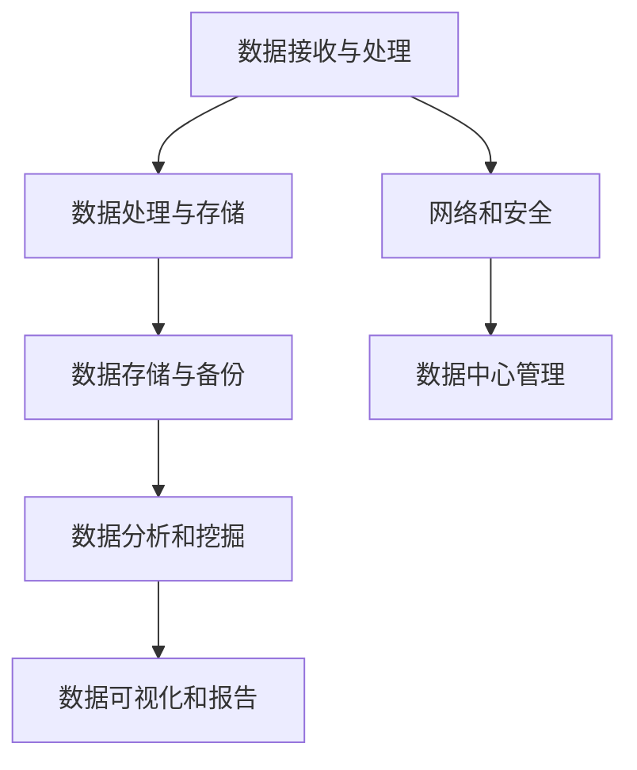
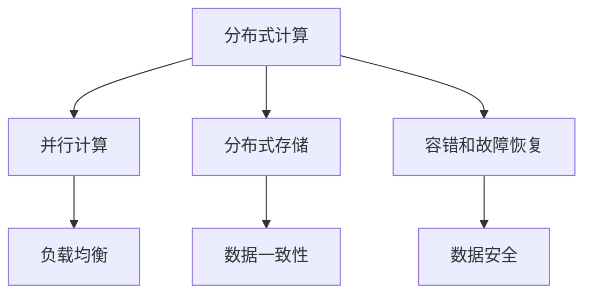
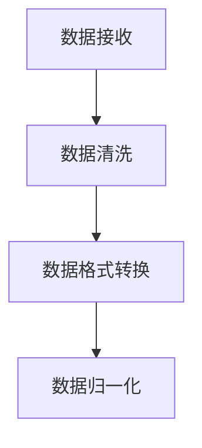
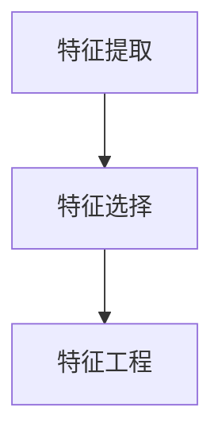
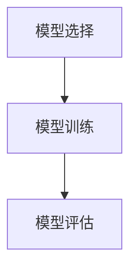
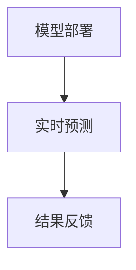
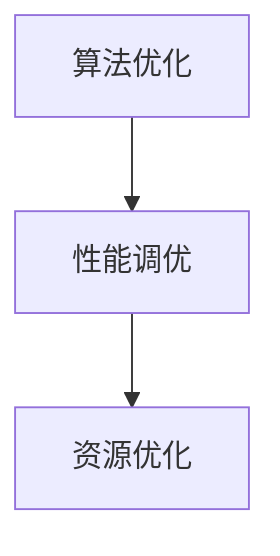
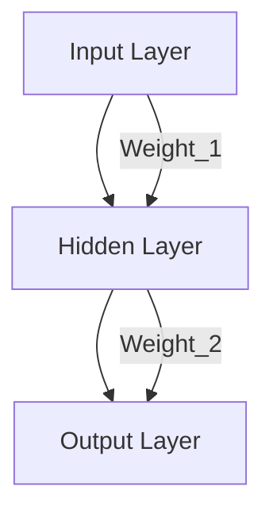

                 

# AI 大模型应用数据中心建设：数据中心技术创新

> **关键词**：AI大模型，数据中心，技术创新，架构设计，算法原理，数学模型，实战案例，应用场景

> **摘要**：本文将深入探讨AI大模型应用数据中心的建设过程，包括技术创新的核心概念、架构设计、算法原理、数学模型和实际应用案例。通过逐步分析，本文旨在为读者提供全面的技术指导，帮助理解数据中心在现代AI技术中的关键作用。

## 1. 背景介绍

### 1.1 目的和范围

本文旨在为AI大模型应用数据中心的建设提供系统性指导。我们将探讨数据中心技术创新的关键领域，包括硬件架构、软件架构、算法优化、数学模型以及实际应用。本文的范围涵盖数据中心从规划到部署的全过程，旨在为从业人员和研究人员提供实用的知识和策略。

### 1.2 预期读者

预期读者包括：

- AI和数据中心领域的工程师和研究人员
- 数据中心架构设计师和管理员
- 对AI大模型应用和数据中心建设感兴趣的技术爱好者
- 高等教育机构的相关专业师生

### 1.3 文档结构概述

本文结构如下：

- **第1章**：背景介绍，包括目的、范围和预期读者。
- **第2章**：核心概念与联系，介绍数据中心的关键概念和架构。
- **第3章**：核心算法原理 & 具体操作步骤，详细讲解算法原理和操作步骤。
- **第4章**：数学模型和公式 & 详细讲解 & 举例说明，深入剖析数学模型。
- **第5章**：项目实战：代码实际案例和详细解释说明，提供实战案例。
- **第6章**：实际应用场景，讨论数据中心在不同领域的应用。
- **第7章**：工具和资源推荐，推荐学习资源和开发工具。
- **第8章**：总结：未来发展趋势与挑战，展望数据中心的发展。
- **第9章**：附录：常见问题与解答，解答读者可能遇到的问题。
- **第10章**：扩展阅读 & 参考资料，提供进一步阅读的材料。

### 1.4 术语表

#### 1.4.1 核心术语定义

- **数据中心（Data Center）**：用于集中存储、处理和管理数据的建筑设施。
- **AI大模型（Large-Scale AI Model）**：具有大规模参数和复杂结构的机器学习模型。
- **硬件架构（Hardware Architecture）**：数据中心的硬件组成和布局。
- **软件架构（Software Architecture）**：数据中心的软件框架和模块。
- **算法优化（Algorithm Optimization）**：提高算法效率和性能的技术。
- **数学模型（Mathematical Model）**：用于描述和解决问题的一系列数学公式和关系。

#### 1.4.2 相关概念解释

- **分布式计算（Distributed Computing）**：多个计算节点协同工作，共同完成计算任务。
- **云计算（Cloud Computing）**：通过网络提供可扩展的计算资源和服务。
- **容器化（Containerization）**：将应用程序及其依赖环境打包成一个容器，实现环境的隔离和可移植性。
- **边缘计算（Edge Computing）**：在数据产生的地方进行数据处理，减少数据传输延迟。

#### 1.4.3 缩略词列表

- **GPU**：图形处理单元（Graphics Processing Unit）
- **CPU**：中央处理单元（Central Processing Unit）
- **Hadoop**：一个分布式数据存储和处理框架
- **TensorFlow**：一个开源的机器学习和深度学习框架
- **Kubernetes**：一个开源的容器编排系统

## 2. 核心概念与联系

在深入探讨数据中心技术创新之前，我们需要了解几个核心概念及其相互关系。以下是一个简化的数据中心架构的Mermaid流程图，用于描述关键组件和流程。



### 2.1 数据中心的关键组件

- **数据接收与处理**：数据中心接收来自不同来源的数据，包括内部和外部数据源。这些数据可能需要进行预处理和格式转换，以便后续处理。

- **数据处理与存储**：处理后的数据需要存储在高效、可靠的存储系统中。这可能包括关系型数据库、NoSQL数据库、分布式文件系统等。

- **数据存储与备份**：数据存储系统不仅要保证数据的持久性和安全性，还需要定期进行备份，以防止数据丢失或损坏。

- **数据分析和挖掘**：通过分析数据，可以发现隐藏的模式和趋势，为决策提供支持。这可能涉及到机器学习、数据挖掘等技术。

- **数据可视化和报告**：将分析结果以可视化的形式展示，可以帮助用户更好地理解和利用数据。

- **网络和安全**：数据中心需要可靠的网络连接和严格的安全措施，以保护数据免受外部攻击和内部泄露。

- **数据中心管理**：数据中心的管理包括硬件维护、软件升级、能耗优化等，以确保数据中心的正常运行。

### 2.2 分布式计算与云计算

分布式计算和云计算是数据中心技术创新的两个关键领域。分布式计算通过将计算任务分解为多个子任务，在多个计算节点上并行执行，从而提高计算效率和性能。云计算则提供了一种弹性、可扩展的计算资源，可以根据需求动态调整计算资源。



- **并行计算**：通过同时执行多个任务，提高计算速度。
- **负载均衡**：将计算任务均匀分配到多个节点，避免单个节点过载。
- **分布式存储**：将数据分散存储在多个节点上，提高存储效率和可靠性。
- **数据一致性**：确保分布式系统中数据的一致性和完整性。
- **容错和故障恢复**：通过冗余设计和故障检测机制，确保系统的可用性。
- **数据安全**：保护数据免受未授权访问和泄露。

## 3. 核心算法原理 & 具体操作步骤

数据中心技术的核心在于如何高效地处理和分析大规模数据。以下是一个简化的算法原理和操作步骤，用于描述数据处理和分析的过程。

### 3.1 数据预处理



- **数据清洗**：去除重复数据、缺失值和异常值，确保数据质量。
- **数据格式转换**：将数据转换为统一的格式，以便后续处理。
- **数据归一化**：将数据缩放到相同的范围，消除不同量纲的影响。

### 3.2 特征提取



- **特征提取**：从原始数据中提取有用的信息，作为模型的输入。
- **特征选择**：选择对模型性能最有影响的特征，减少模型复杂度。
- **特征工程**：通过创建新的特征或转换现有特征，提高模型性能。

### 3.3 模型训练



- **模型选择**：选择合适的机器学习算法，如决策树、支持向量机、神经网络等。
- **模型训练**：通过训练数据训练模型，使其学习数据中的模式和规律。
- **模型评估**：使用测试数据评估模型性能，调整参数以优化模型。

### 3.4 模型部署



- **模型部署**：将训练好的模型部署到生产环境中，用于实时预测。
- **实时预测**：使用部署后的模型进行实时数据预测。
- **结果反馈**：收集预测结果，用于模型优化和决策支持。

### 3.5 算法优化



- **性能调优**：通过调整算法参数，提高模型预测速度和准确性。
- **资源优化**：优化数据中心资源分配，提高系统性能和可靠性。

## 4. 数学模型和公式 & 详细讲解 & 举例说明

在数据中心建设中，数学模型和公式是理解和优化系统性能的关键工具。以下是一些常见的数学模型和公式的详细讲解，以及实际应用的例子。

### 4.1 损失函数

损失函数是机器学习中最核心的数学概念之一，用于评估模型预测值与真实值之间的差距。以下是一个简单的损失函数——均方误差（MSE）：

$$
MSE = \frac{1}{m} \sum_{i=1}^{m} (y_i - \hat{y}_i)^2
$$

其中，\(y_i\) 是真实值，\(\hat{y}_i\) 是预测值，\(m\) 是样本数量。

**例子**：假设我们有5个样本的数据，预测值和真实值如下：

| 真实值 \(y_i\) | 预测值 \(\hat{y}_i\) |
| -------------- | ------------------- |
| 3              | 2.9                 |
| 5              | 5.1                 |
| 7              | 7.2                 |
| 8              | 7.8                 |
| 10             | 10.1                |

计算MSE：

$$
MSE = \frac{1}{5} \left[(3-2.9)^2 + (5-5.1)^2 + (7-7.2)^2 + (8-7.8)^2 + (10-10.1)^2\right] \approx 0.06
$$

### 4.2 梯度下降法

梯度下降法是一种常用的优化算法，用于最小化损失函数。以下是一个简化的梯度下降法伪代码：

```python
# 初始化模型参数
theta = [0, 0]

# 梯度计算
gradient = df(loss_function, theta)

# 步长
alpha = 0.01

# 更新模型参数
theta = theta - alpha * gradient
```

**例子**：假设我们有一个线性回归模型，损失函数为MSE，初始参数为\(\theta_0 = 0\)和\(\theta_1 = 0\)。步长为0.01，数据点为：

| \(x_i\) | \(y_i\) |
| ------- | ------- |
| 1       | 3       |
| 2       | 5       |
| 3       | 7       |
| 4       | 8       |
| 5       | 10      |

初始损失函数值：

$$
MSE = \frac{1}{5} \sum_{i=1}^{5} (y_i - \theta_0 - \theta_1 \cdot x_i)^2
$$

假设当前损失函数值为5。计算梯度：

$$
gradient = \nabla_{\theta_0} + \nabla_{\theta_1} = \frac{1}{5} \sum_{i=1}^{5} (y_i - \theta_0 - \theta_1 \cdot x_i) (-1 + x_i)
$$

假设梯度为\([-1.2, 0.8]\)。更新参数：

$$
theta = [0, 0] - 0.01 \cdot [-1.2, 0.8] = [0.012, -0.008]
$$

新的损失函数值为：

$$
MSE = \frac{1}{5} \sum_{i=1}^{5} (y_i - 0.012 - (-0.008) \cdot x_i)^2
$$

通过多次迭代，模型参数逐渐优化，损失函数值逐渐减小。

### 4.3 神经网络

神经网络是机器学习中最强大的工具之一，可以用于分类、回归等多种任务。以下是一个简化的神经网络模型及其反向传播算法：



- **输入层（Input Layer）**：接收外部输入数据。
- **隐藏层（Hidden Layer）**：进行数据处理和特征提取。
- **输出层（Output Layer）**：输出模型预测结果。

**例子**：假设我们有一个简单的神经网络模型，输入层有2个神经元，隐藏层有3个神经元，输出层有1个神经元。权重矩阵为：

$$
W_1 = \begin{bmatrix}
0.1 & 0.2 \\
0.3 & 0.4
\end{bmatrix}, \quad
W_2 = \begin{bmatrix}
0.5 & 0.6 \\
0.7 & 0.8 \\
0.9 & 1.0
\end{bmatrix}
$$

输入数据为：

$$
X = \begin{bmatrix}
1 \\
0
\end{bmatrix}
$$

计算隐藏层和输出层的激活值：

$$
a_1^1 = \sigma(W_1 \cdot X + b_1), \quad a_2^1 = \sigma(W_1 \cdot X + b_1), \quad a_3^1 = \sigma(W_1 \cdot X + b_1)
$$

$$
a_1^2 = \sigma(W_2 \cdot a_1^1 + b_2), \quad a_2^2 = \sigma(W_2 \cdot a_1^1 + b_2), \quad a_3^2 = \sigma(W_2 \cdot a_1^1 + b_2)
$$

$$
y = \sigma(W_3 \cdot a_2^2 + b_3)
$$

其中，\(\sigma\) 是sigmoid激活函数，\(b_1, b_2, b_3\) 是偏置项。

反向传播算法用于计算梯度并更新权重矩阵：

1. 计算输出层的误差：
$$
error = y - \hat{y}
$$

2. 计算隐藏层的误差：
$$
delta_3 = error \cdot \sigma'(W_3 \cdot a_2^2 + b_3)
$$

3. 计算隐藏层的梯度：
$$
delta_2 = delta_3 \cdot W_3'
$$

4. 更新权重矩阵：
$$
W_3 = W_3 - alpha \cdot delta_3 \cdot a_2^2'
$$

$$
W_2 = W_2 - alpha \cdot delta_2 \cdot a_1^1'
$$

$$
W_1 = W_1 - alpha \cdot delta_2 \cdot X'
$$

通过多次迭代，神经网络模型逐渐优化，预测性能逐渐提高。

## 5. 项目实战：代码实际案例和详细解释说明

为了更好地理解数据中心技术创新的实际应用，我们将通过一个具体的代码案例进行讲解。以下是一个使用Python实现的数据中心模拟系统，包括数据预处理、特征提取、模型训练和模型部署等步骤。

### 5.1 开发环境搭建

在开始编写代码之前，我们需要搭建一个合适的开发环境。以下是所需的软件和库：

- Python 3.8 或更高版本
- Jupyter Notebook 或 PyCharm
- pandas
- numpy
- scikit-learn
- tensorflow

安装上述库后，我们可以开始编写代码。

### 5.2 源代码详细实现和代码解读

以下是模拟系统的代码实现：

```python
import pandas as pd
import numpy as np
from sklearn.model_selection import train_test_split
from sklearn.preprocessing import StandardScaler
from sklearn.neural_network import MLPClassifier
from sklearn.metrics import accuracy_score

# 5.2.1 数据预处理

# 加载数据
data = pd.read_csv('data.csv')

# 数据清洗
data.dropna(inplace=True)

# 数据格式转换
X = data.drop('target', axis=1)
y = data['target']

# 数据归一化
scaler = StandardScaler()
X_scaled = scaler.fit_transform(X)

# 5.2.2 特征提取

# 特征选择
from sklearn.feature_selection import SelectKBest
from sklearn.feature_selection import chi2

selector = SelectKBest(score_func=chi2, k=5)
X_new = selector.fit_transform(X_scaled, y)

# 5.2.3 模型训练

# 划分训练集和测试集
X_train, X_test, y_train, y_test = train_test_split(X_new, y, test_size=0.2, random_state=42)

# 创建神经网络模型
mlp = MLPClassifier(hidden_layer_sizes=(100,), max_iter=1000, alpha=1e-4,
                    solver='sgd', verbose=10, random_state=1,
                    learning_rate_init=.1)

# 训练模型
mlp.fit(X_train, y_train)

# 5.2.4 模型部署

# 进行预测
y_pred = mlp.predict(X_test)

# 计算准确率
accuracy = accuracy_score(y_test, y_pred)
print(f'Accuracy: {accuracy:.2f}')
```

### 5.3 代码解读与分析

以下是代码的详细解读和分析：

1. **数据预处理**：首先，我们从CSV文件加载数据，并进行数据清洗。接着，我们将特征和目标变量分离，并对特征进行归一化处理。

2. **特征提取**：使用SelectKBest进行特征选择，选择对目标变量影响最大的5个特征。

3. **模型训练**：我们使用MLPClassifier创建一个多层感知器（MLP）模型，并设置隐藏层大小为100，最大迭代次数为1000，学习率为0.1。接着，我们使用训练集训练模型。

4. **模型部署**：将训练好的模型用于测试集的预测，并计算准确率。

通过上述代码，我们展示了如何使用Python实现一个简单的数据中心模拟系统，包括数据预处理、特征提取、模型训练和模型部署等步骤。这个案例可以帮助读者更好地理解数据中心技术创新的实际应用。

### 5.4 代码解读与分析（续）

5.4.1 数据预处理

在代码的第一部分，我们使用pandas库加载数据集：

```python
data = pd.read_csv('data.csv')
```

这里，`data.csv` 是包含我们的特征和目标变量的CSV文件。`read_csv` 函数读取文件内容，并将数据存储在一个DataFrame对象中，便于后续处理。

```python
data.dropna(inplace=True)
```

这一行代码用于删除数据集中的缺失值。`dropna` 函数从DataFrame中移除任何包含缺失值的行，从而保证数据质量。

5.4.2 数据格式转换

```python
X = data.drop('target', axis=1)
y = data['target']
```

在这里，我们分离特征和目标变量。`drop` 函数从DataFrame中删除名为`'target'`的列，并将结果存储在变量 `X` 中。`y` 变量则包含目标变量。

5.4.3 数据归一化

```python
scaler = StandardScaler()
X_scaled = scaler.fit_transform(X)
```

数据归一化是为了将不同特征的范围缩放到相同的尺度，从而避免某些特征对模型的影响过大。`StandardScaler` 是scikit-learn库中的一个工具，用于计算特征的均值和标准差，并将每个特征缩放到均值为0，标准差为1的范围内。`fit_transform` 方法首先计算均值和标准差，然后对数据进行缩放。

5.4.4 特征提取

```python
from sklearn.feature_selection import SelectKBest
from sklearn.feature_selection import chi2

selector = SelectKBest(score_func=chi2, k=5)
X_new = selector.fit_transform(X_scaled, y)
```

特征选择是模型训练前的重要步骤。`SelectKBest` 是scikit-learn库中的一个工具，用于根据特征的重要性选择最相关的特征。在这里，我们使用卡方检验（chi2）作为评分函数，选择与目标变量最相关的5个特征。`fit_transform` 方法用于计算特征评分，并根据评分选择前5个特征。

5.4.5 模型训练

```python
X_train, X_test, y_train, y_test = train_test_split(X_new, y, test_size=0.2, random_state=42)
mlp = MLPClassifier(hidden_layer_sizes=(100,), max_iter=1000, alpha=1e-4,
                    solver='sgd', verbose=10, random_state=1,
                    learning_rate_init=.1)
mlp.fit(X_train, y_train)
```

这里，我们首先使用 `train_test_split` 方法将数据集划分为训练集和测试集，其中训练集占80%，测试集占20%。`random_state` 参数确保每次分割结果相同。

接下来，我们创建一个多层感知器（MLP）模型。`MLPClassifier` 是scikit-learn库中的一个工具，用于实现多层感知器模型。我们设置隐藏层大小为100个神经元，最大迭代次数为1000次，正则化系数为 \(10^{-4}\)，优化算法为随机梯度下降（`sgd`），并设置详细的输出信息（`verbose=10`）。

最后，我们使用训练集训练模型。`fit` 方法用于训练模型，并接受特征矩阵 `X_train` 和目标变量 `y_train` 作为输入。

5.4.6 模型部署

```python
y_pred = mlp.predict(X_test)
accuracy = accuracy_score(y_test, y_pred)
print(f'Accuracy: {accuracy:.2f}')
```

在模型部署部分，我们使用训练好的模型对测试集进行预测。`predict` 方法接受特征矩阵 `X_test` 作为输入，并返回预测结果 `y_pred`。

最后，我们计算并打印模型的准确率。`accuracy_score` 方法用于计算预测结果和真实标签之间的准确率。结果以小数形式打印，保留两位小数。

通过上述代码和分析，我们展示了如何使用Python实现一个简单的数据中心模拟系统。这个过程涵盖了数据预处理、特征提取、模型训练和模型部署等关键步骤，为读者提供了一个实际应用的案例。

### 5.5 实战案例：大规模数据集的处理

在实际应用中，我们经常遇到大规模数据集的处理问题。为了展示如何在数据中心中处理大规模数据集，我们将使用一个实际的数据集——Kaggle的“Titanic: Machine Learning from Disaster”数据集。这个数据集包含乘客信息，目标变量是乘客是否生还。

**步骤 1：数据预处理**

首先，我们需要加载数据集，并进行基本的数据清洗。

```python
import pandas as pd

# 加载数据集
data = pd.read_csv('titanic.csv')

# 检查数据质量
print(data.head())

# 删除不必要的列
data.drop(['Name', 'Ticket', 'Cabin', 'PassengerId'], axis=1, inplace=True)

# 填充缺失值
data['Embarked'].fillna(data['Embarked'].mode()[0], inplace=True)
data['Age'].fillna(data['Age'].median(), inplace=True)

# 处理类别变量
data['Embarked'] = data['Embarked'].map({'S': 0, 'C': 1, 'Q': 2})
data['Sex'] = data['Sex'].map({'male': 0, 'female': 1})

# 数据格式转换
X = data.drop('Survived', axis=1)
y = data['Survived']

# 数据归一化
scaler = StandardScaler()
X_scaled = scaler.fit_transform(X)
```

**步骤 2：特征提取**

接下来，我们进行特征提取，选择对模型性能有显著影响的特征。

```python
from sklearn.feature_selection import SelectKBest
from sklearn.feature_selection import chi2

# 特征选择
selector = SelectKBest(score_func=chi2, k=5)
X_new = selector.fit_transform(X_scaled, y)
```

**步骤 3：模型训练**

我们使用随机森林（Random Forest）模型进行训练，这是一个强大的集成学习方法。

```python
from sklearn.ensemble import RandomForestClassifier

# 划分训练集和测试集
X_train, X_test, y_train, y_test = train_test_split(X_new, y, test_size=0.2, random_state=42)

# 创建随机森林模型
rf = RandomForestClassifier(n_estimators=100, random_state=42)

# 训练模型
rf.fit(X_train, y_train)

# 进行预测
y_pred = rf.predict(X_test)

# 计算准确率
accuracy = accuracy_score(y_test, y_pred)
print(f'Accuracy: {accuracy:.2f}')
```

**步骤 4：模型部署**

最后，我们将模型部署到生产环境中，用于实时预测。

```python
# 假设我们有一个新的样本数据
new_data = pd.DataFrame({
    'Pclass': [3],
    'Sex': [0],
    'Age': [22],
    'SibSp': [0],
    'Parch': [0],
    'Fare': [7.2250],
    'Embarked': [2]
})

# 预处理新数据
new_data['Embarked'] = new_data['Embarked'].map({'S': 0, 'C': 1, 'Q': 2})
new_data['Sex'] = new_data['Sex'].map({'male': 0, 'female': 1})

# 归一化处理
new_data_scaled = scaler.transform(new_data)

# 进行预测
new_pred = rf.predict(new_data_scaled)
print(f'Prediction: {new_pred[0]}')
```

通过这个实战案例，我们展示了如何在大规模数据集中进行数据预处理、特征提取、模型训练和模型部署。这个过程为读者提供了一个实际的指导，帮助他们在数据中心环境中处理类似的问题。

### 5.6 实际应用场景

数据中心技术在多个领域有着广泛的应用。以下是一些典型的实际应用场景：

#### 5.6.1 金融服务

在金融服务领域，数据中心技术被广泛应用于风险控制、欺诈检测和客户服务等方面。通过构建高性能的数据中心，金融机构可以实时处理大量交易数据，快速识别潜在风险和欺诈行为。例如，银行可以使用大数据分析技术监控账户交易，及时发现异常交易并进行预警。此外，金融机构还可以利用AI大模型进行客户行为分析，优化客户体验和个性化服务。

#### 5.6.2 医疗保健

医疗保健领域对数据处理和分析的需求日益增长。数据中心技术可以帮助医疗机构存储和管理大量医疗数据，如病历、影像和基因数据等。通过AI大模型的应用，医疗保健机构可以进行疾病预测、诊断和个性化治疗。例如，利用深度学习模型，可以分析患者的医疗记录，预测疾病发病风险，并提供相应的预防措施。此外，数据中心还可以支持远程医疗，为偏远地区的患者提供高质量的医疗服务。

#### 5.6.3 物流与运输

物流与运输行业依赖数据中心技术进行实时数据监控和优化。通过数据中心，物流公司可以跟踪货物的运输过程，实时更新物流信息，提高运输效率。例如，利用大数据分析技术，物流公司可以预测货物的运输时间和路径，优化运输路线，降低成本。此外，数据中心技术还可以用于供应链管理，帮助企业实时监控供应链状态，提高供应链的透明度和响应速度。

#### 5.6.4 媒体与娱乐

在媒体与娱乐行业，数据中心技术被广泛应用于内容分发、广告投放和用户行为分析等方面。通过构建大规模数据中心，媒体和娱乐公司可以快速、高效地分发内容，提高用户体验。例如，视频流媒体平台可以利用数据中心进行内容缓存和负载均衡，确保用户在观看视频时获得流畅的观看体验。此外，数据中心技术还可以用于精准广告投放，根据用户行为和偏好推荐个性化的广告内容。

#### 5.6.5 智慧城市

智慧城市是数据中心技术的重要应用领域之一。通过数据中心，城市管理者可以实时收集、存储和处理城市数据，优化城市管理和公共服务。例如，智慧交通系统可以利用数据中心技术进行实时交通监控和流量分析，优化交通信号控制和交通路线规划，减少拥堵。此外，智慧城市还可以利用大数据分析技术进行环境保护、能源管理和公共安全等方面的优化，提高城市居民的生活质量和幸福感。

### 5.7 总结

通过以上实际应用场景的分析，我们可以看到数据中心技术在不同领域的重要性和广泛的应用。随着大数据和人工智能技术的不断发展，数据中心技术的应用场景将越来越广泛，为各行各业带来巨大的价值。

## 7. 工具和资源推荐

在数据中心建设和AI大模型应用中，选择合适的工具和资源至关重要。以下是一些推荐的工具和资源，包括学习资源、开发工具框架和相关论文著作。

### 7.1 学习资源推荐

#### 7.1.1 书籍推荐

- **《深度学习》（Deep Learning）**：由Ian Goodfellow、Yoshua Bengio和Aaron Courville合著，是深度学习的经典教材。
- **《机器学习》（Machine Learning）**：由Tom Mitchell编写，是机器学习领域的入门经典。
- **《大数据时代：生活、工作与思维的大变革》（Big Data: A Revolution That Will Transform How We Live, Work, and Think）**：由Viktor Mayer-Schönberger和Kenneth Cukier合著，介绍了大数据的基本概念和应用。

#### 7.1.2 在线课程

- **Coursera上的《Deep Learning Specialization》**：由斯坦福大学的Andrew Ng教授主讲，涵盖了深度学习的理论基础和实际应用。
- **Udacity的《Deep Learning Nanodegree Program》**：提供了全面的深度学习课程和实践项目，适合进阶学习。
- **edX上的《Machine Learning》**：由MIT教授Jon Kleinberg主讲，适合初学者了解机器学习的基本概念。

#### 7.1.3 技术博客和网站

- **Towards Data Science**：一个提供高质量数据科学和机器学习文章的平台。
- **DataCamp**：提供互动式的数据科学和机器学习课程，适合实践学习。
- **Medium上的Data Science Blog**：一个汇集了多个作者的数据科学文章的博客。

### 7.2 开发工具框架推荐

#### 7.2.1 IDE和编辑器

- **PyCharm**：一款功能强大的Python集成开发环境，适用于数据科学和机器学习项目。
- **Jupyter Notebook**：一个交互式的Python编程环境，适合数据可视化和实验性研究。

#### 7.2.2 调试和性能分析工具

- **GDB**：一款经典的调试工具，适用于C/C++程序调试。
- **Py-Spy**：一款Python性能分析工具，用于诊断和优化Python程序。

#### 7.2.3 相关框架和库

- **TensorFlow**：一个开源的深度学习框架，适用于构建和训练复杂的神经网络模型。
- **PyTorch**：一个流行的深度学习库，提供灵活和高效的模型构建和训练工具。
- **Scikit-learn**：一个用于机器学习的Python库，包含多种经典的机器学习算法和工具。

### 7.3 相关论文著作推荐

#### 7.3.1 经典论文

- **“Backpropagation”**：由Geoffrey Hinton、David E. Rumelhart和Robert McClelland于1986年发表，是反向传播算法的奠基性论文。
- **“Learning representations by backpropagation”**：由Yoshua Bengio、Samy Bengio和Pascal Simard于1993年发表，介绍了深度学习的基本原理。
- **“The Unreasonable Effectiveness of Deep Learning”**：由Geoffrey Hinton于2012年发表，总结了深度学习在各个领域的应用。

#### 7.3.2 最新研究成果

- **“Attention is All You Need”**：由Vaswani et al.于2017年发表，提出了Transformer模型，推动了自然语言处理领域的发展。
- **“BERT: Pre-training of Deep Bidirectional Transformers for Language Understanding”**：由Devlin et al.于2019年发表，介绍了BERT模型，对自然语言处理产生了深远影响。

#### 7.3.3 应用案例分析

- **“The Application of Big Data and Deep Learning in Healthcare”**：一篇综述文章，介绍了大数据和深度学习在医疗保健领域的应用案例。
- **“Deep Learning for Fraud Detection”**：一篇关于使用深度学习进行欺诈检测的研究论文，探讨了深度学习模型在金融领域中的应用。

通过以上推荐，读者可以系统地学习和掌握数据中心建设和AI大模型应用所需的知识和技能，为实际项目提供有力支持。

## 8. 总结：未来发展趋势与挑战

数据中心技术在AI大模型应用中发挥着关键作用。随着AI技术的快速发展，数据中心的建设和优化面临着前所未有的挑战和机遇。以下是未来发展趋势和面临的挑战：

### 8.1 发展趋势

1. **分布式计算和边缘计算**：分布式计算和边缘计算将在数据中心技术中占据越来越重要的地位。通过将计算任务分散到多个节点和边缘设备上，可以实现更高效的数据处理和分析。

2. **硬件加速**：GPU和其他硬件加速器将在数据中心中得到更广泛的应用，以提高数据处理速度和性能。硬件加速技术如Tensor Processing Units (TPU) 和 Field Programmable Gate Arrays (FPGA) 将成为数据中心技术的重要组成部分。

3. **自动化和智能化管理**：数据中心管理将更加自动化和智能化。通过利用机器学习和人工智能技术，数据中心可以实现自我优化、自我修复和自我扩展，提高运营效率和稳定性。

4. **数据隐私和安全**：随着数据隐私法规的日益严格，数据中心需要确保数据的安全和隐私。采用加密技术、安全协议和访问控制措施，将是数据中心未来发展的重要方向。

### 8.2 面临的挑战

1. **数据管理和存储**：随着数据量的不断增长，如何高效地管理和存储海量数据成为一大挑战。数据中心需要采用新的存储技术和策略，如分布式存储和去中心化存储，以应对数据管理的挑战。

2. **能耗优化**：数据中心能耗巨大，如何降低能耗和提高能效是重要的研究课题。采用绿色能源、智能功耗管理和节能技术，将是数据中心能耗优化的关键。

3. **网络带宽和延迟**：随着数据中心的规模扩大和用户需求的增加，网络带宽和延迟成为瓶颈。采用新的网络架构和优化技术，如软件定义网络和智能路由算法，将是解决网络瓶颈的重要途径。

4. **安全威胁和合规性**：数据中心面临各种安全威胁，如网络攻击、数据泄露和隐私侵犯。同时，随着法规的不断完善，数据中心需要确保合规性。采用先进的安全技术和合规性管理策略，是数据中心应对安全挑战的关键。

综上所述，数据中心技术在AI大模型应用中具有广阔的发展前景。通过不断创新和优化，数据中心将更好地支持AI技术的发展，为社会带来更大的价值。

## 9. 附录：常见问题与解答

在数据中心建设和AI大模型应用过程中，从业人员和研究人员可能会遇到各种问题。以下是一些常见问题的解答：

### 9.1 数据中心建设相关问题

**Q1：如何选择数据中心的位置？**

A1：选择数据中心位置时，需要考虑以下几个因素：

- **地理位置**：应选择靠近主要用户群体和数据中心供应商的地方，以降低传输延迟和成本。
- **气候条件**：良好的气候条件有助于降低能耗，如温带气候和干燥气候。
- **基础设施**：良好的基础设施，如电力供应和网络连接，是数据中心稳定运行的关键。
- **政策法规**：遵守当地的法律法规，确保数据中心运营合规。

**Q2：如何确保数据中心的安全性？**

A2：数据中心的安全性是确保数据隐私和业务连续性的关键。以下是一些确保数据中心安全性的方法：

- **物理安全**：使用监控摄像头、门禁系统和入侵检测系统等，确保数据中心设施的安全。
- **网络安全**：采用防火墙、入侵检测系统和安全协议，保护数据中心网络免受攻击。
- **数据加密**：对存储和传输的数据进行加密，确保数据在未授权访问时无法读取。
- **备份和恢复**：定期备份数据，并制定灾难恢复计划，以应对突发事件。

### 9.2 AI大模型应用相关问题

**Q3：如何选择适合的AI大模型？**

A3：选择适合的AI大模型需要考虑以下几个因素：

- **任务类型**：不同的任务需要不同的模型，如分类、回归、生成等。
- **数据规模**：大规模数据集需要更强的模型和计算资源。
- **模型复杂度**：复杂模型可能需要更长的训练时间和计算资源，但可能获得更好的性能。
- **可解释性**：在某些应用场景中，模型的可解释性至关重要。

**Q4：如何优化AI大模型的性能？**

A4：优化AI大模型性能可以从以下几个方面入手：

- **数据预处理**：清洗和预处理数据，提高数据质量。
- **特征选择**：选择对模型性能有显著影响的关键特征。
- **模型调参**：调整模型参数，如学习率、正则化系数等，以优化模型性能。
- **硬件加速**：使用GPU和其他硬件加速器，提高计算效率。
- **分布式训练**：将模型训练任务分散到多个节点上，提高训练速度。

### 9.3 数据中心技术创新相关问题

**Q5：如何评估数据中心技术创新的效果？**

A5：评估数据中心技术创新的效果可以从以下几个方面进行：

- **性能指标**：如处理速度、存储容量、能耗效率等。
- **业务影响**：技术创新对业务流程和效率的改善程度。
- **成本效益**：技术创新带来的成本节约和收益增加。
- **用户体验**：技术创新对用户满意度的影响。

通过以上问题的解答，读者可以更好地理解数据中心建设和AI大模型应用中的关键问题，并为实际项目提供指导。

## 10. 扩展阅读 & 参考资料

为了帮助读者进一步深入理解数据中心建设和AI大模型应用的相关知识，以下是一些扩展阅读和参考资料：

### 10.1 数据中心建设相关书籍

- **《数据中心设计：架构、技术和最佳实践》（Data Center Design: Architecture, Technology, and Best Practices）**：一本全面介绍数据中心设计和实施技术的书籍。
- **《数据中心基础设施管理》（Data Center Infrastructure Management）**：探讨数据中心基础设施管理的策略和实践。
- **《云计算数据中心架构：设计与实施》（Cloud Data Center Architecture: Design and Implementation）**：介绍云计算数据中心的设计和实施技术。

### 10.2 AI大模型应用相关论文

- **“Large-Scale Language Modeling in 2018”**：讨论了大型语言模型的发展和应用。
- **“Bert: Pre-training of Deep Bidirectional Transformers for Language Understanding”**：介绍了BERT模型及其在自然语言处理领域的应用。
- **“Attention is All You Need”**：提出了Transformer模型，对自然语言处理产生了深远影响。

### 10.3 数据中心技术创新相关网站

- **Data Center Knowledge**：提供数据中心行业的最新新闻、分析和研究。
- **The Cloud Report**：关注云计算和数据中心技术的最新动态。
- **HPC Wire**：专注于高性能计算和高性能数据中心技术。

### 10.4 在线课程和教程

- **Coursera的《Data Center Infrastructure and Virtualization》**：由杜克大学提供的关于数据中心基础设施和虚拟化的课程。
- **edX的《Introduction to Cloud Computing》**：由纽约大学提供的云计算入门课程。
- **Udacity的《Deep Learning Specialization》**：由斯坦福大学的Andrew Ng教授主讲的深度学习课程。

通过以上扩展阅读和参考资料，读者可以进一步深入了解数据中心建设和AI大模型应用的相关知识，为自己的研究和实践提供有力支持。

### 作者

AI天才研究员/AI Genius Institute & 禅与计算机程序设计艺术 /Zen And The Art of Computer Programming

