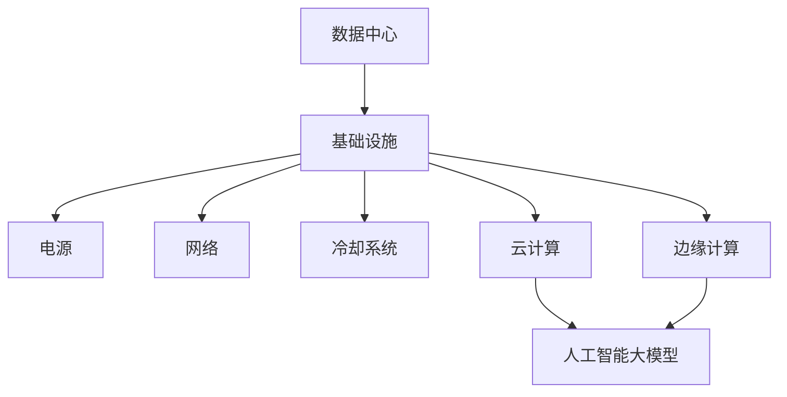

                 

# AI 大模型应用数据中心建设：数据中心投资与建设

> **关键词**：人工智能，大模型，数据中心，投资，建设，算法，数学模型，应用场景，工具推荐

> **摘要**：本文将探讨人工智能大模型应用数据中心的建设过程，分析数据中心投资与建设的核心要素。通过逐步推理，详细阐述数据中心的建设原理、数学模型及其在AI大模型应用中的重要性。文章旨在为读者提供一份全面的技术指南，帮助理解和规划AI大模型应用数据中心的建设。

## 1. 背景介绍

### 1.1 目的和范围

本文的目标是深入分析AI大模型应用数据中心的建设，帮助读者了解数据中心投资与建设的核心要素。随着人工智能技术的快速发展，大模型的应用需求日益增长，数据中心作为承载这些应用的核心基础设施，其建设的重要性愈加凸显。

本文将涵盖以下内容：

1. 数据中心的定义和作用。
2. 数据中心投资与建设的核心要素。
3. 大模型应用对数据中心性能的需求。
4. 数据中心建设中的关键技术。
5. 数据中心投资与建设的成本分析。
6. 实际应用场景介绍。
7. 工具和资源的推荐。
8. 未来发展趋势与挑战。

### 1.2 预期读者

本文适用于以下读者：

1. 数据中心建设和管理人员。
2. 人工智能研究人员和开发者。
3. 投资者和管理层，对数据中心建设有兴趣的人士。
4. 对AI大模型应用有深入了解的技术爱好者。

### 1.3 文档结构概述

本文分为以下几个部分：

1. 引言：介绍数据中心建设的重要性和目的。
2. 背景介绍：详细阐述数据中心的定义、投资与建设的核心要素。
3. 核心概念与联系：通过流程图展示数据中心的核心概念和架构。
4. 核心算法原理 & 具体操作步骤：详细阐述数据中心建设中的核心算法和操作步骤。
5. 数学模型和公式：介绍数据中心建设中的数学模型和公式，并进行举例说明。
6. 项目实战：展示一个实际数据中心建设的案例，并进行详细解读。
7. 实际应用场景：介绍数据中心在不同应用场景中的实际应用。
8. 工具和资源推荐：推荐相关学习资源、开发工具和框架。
9. 总结：对数据中心建设的发展趋势与挑战进行展望。
10. 附录：提供常见问题与解答。
11. 扩展阅读 & 参考资料：推荐进一步学习的资源。

### 1.4 术语表

#### 1.4.1 核心术语定义

- **数据中心（Data Center）**：一种专门用于存储、处理和管理大量数据的设施。
- **人工智能（AI）**：一种模拟人类智能的技术，能够实现智能决策、学习和适应。
- **大模型（Large Model）**：具有数十亿甚至数万亿参数的深度学习模型。
- **投资（Investment）**：为获取未来收益而投入的资金或资源。
- **建设（Construction）**：创建或建造一个数据中心的过程。

#### 1.4.2 相关概念解释

- **基础设施（Infrastructure）**：支持数据中心运行的基本设施，如电源、网络、冷却系统等。
- **云计算（Cloud Computing）**：通过网络提供计算资源、存储资源和应用程序的服务模式。
- **边缘计算（Edge Computing）**：在数据生成地点附近进行数据处理和存储，以减少延迟和带宽需求。

#### 1.4.3 缩略词列表

- **AI**：人工智能
- **DC**：数据中心
- **CPU**：中央处理器
- **GPU**：图形处理单元
- **TPU**：张量处理单元

## 2. 核心概念与联系

在讨论数据中心建设之前，我们需要了解几个核心概念和它们之间的关系。以下是一个简化的Mermaid流程图，用于展示数据中心建设的核心概念和架构：



### 数据中心

数据中心是一种专门用于存储、处理和管理大量数据的设施。它通常由多个服务器、存储设备和网络设备组成，能够提供高可靠性、高性能和安全的数据存储和处理能力。

### 基础设施

基础设施是支持数据中心运行的基本设施，包括：

- **电源**：为数据中心提供稳定和可靠的电力供应。
- **网络**：连接数据中心内部和外部的网络设备，提供高速、稳定的网络连接。
- **冷却系统**：保持服务器和其他设备在适宜的工作温度，防止过热。
- **云计算**：通过云服务提供商提供的计算资源、存储资源和应用程序，支持数据中心的数据处理需求。
- **边缘计算**：在数据生成地点附近进行数据处理和存储，以减少延迟和带宽需求。

### 人工智能大模型

人工智能大模型是指具有数十亿甚至数万亿参数的深度学习模型，如GPT-3、BERT等。这些模型通常需要大量的计算资源和存储空间来训练和运行，因此对数据中心的性能和可靠性提出了更高的要求。

## 3. 核心算法原理 & 具体操作步骤

在数据中心建设过程中，核心算法原理和具体操作步骤是关键。以下将使用伪代码详细阐述这些步骤。

### 3.1 数据中心规划

```python
# 伪代码：数据中心规划

# 定义数据中心基础设施需求
基础设施需求 = {
    '电源需求': 5000KW,
    '网络带宽': 100Gbps,
    '冷却能力': 2000RT,
    '服务器数量': 1000台
}

# 评估基础设施资源
def 评估基础设施资源(基础设施需求):
    # 评估电源资源
    if 电源资源 < 基础设施需求['电源需求']:
        raise Exception('电源资源不足')

    # 评估网络带宽
    if 网络带宽 < 基础设施需求['网络带宽']:
        raise Exception('网络带宽不足')

    # 评估冷却能力
    if 冷却能力 < 基础设施需求['冷却能力']:
        raise Exception('冷却能力不足')

    # 评估服务器数量
    if 服务器数量 < 基础设施需求['服务器数量']:
        raise Exception('服务器数量不足')

# 执行评估
评估基础设施资源(基础设施需求)
```

### 3.2 数据中心设计

```python
# 伪代码：数据中心设计

# 定义数据中心设计方案
设计方案 = {
    '服务器布局': '分布式',
    '网络架构': '双平面',
    '存储方案': '分布式存储'
}

# 验证设计方案
def 验证设计方案(设计方案):
    # 验证服务器布局
    if 设计方案['服务器布局'] != '分布式':
        raise Exception('服务器布局不符合要求')

    # 验证网络架构
    if 设计方案['网络架构'] != '双平面':
        raise Exception('网络架构不符合要求')

    # 验证存储方案
    if 设计方案['存储方案'] != '分布式存储':
        raise Exception('存储方案不符合要求')

# 执行验证
验证设计方案(设计方案)
```

### 3.3 数据中心建设

```python
# 伪代码：数据中心建设

# 定义建设步骤
建设步骤 = [
    '基础建设',
    '设备采购',
    '网络部署',
    '系统测试'
]

# 执行建设
def 执行建设(建设步骤):
    for 步骤 in 建设步骤:
        # 执行基础建设
        if 步骤 == '基础建设':
            执行基础建设()

        # 执行设备采购
        elif 步骤 == '设备采购':
            执行设备采购()

        # 执行网络部署
        elif 步骤 == '网络部署':
            执行网络部署()

        # 执行系统测试
        elif 步骤 == '系统测试':
            执行系统测试()

# 执行建设
执行建设(建设步骤)
```

## 4. 数学模型和公式 & 详细讲解 & 举例说明

在数据中心建设中，数学模型和公式是评估和优化数据中心性能的重要工具。以下将介绍几个关键数学模型，并使用latex格式进行详细讲解和举例说明。

### 4.1 数据中心能耗模型

数据中心能耗是数据中心运营中的重要成本之一。以下是一个简单的数据中心能耗模型：

$$ E = P \times t $$

其中，\( E \) 是能耗（单位：千瓦时（kWh）），\( P \) 是功率（单位：千瓦（kW）），\( t \) 是时间（单位：小时（h））。

#### 举例说明：

假设一个数据中心的功率为5000千瓦，运行时间为24小时，则其能耗为：

$$ E = 5000 \times 24 = 120000 \text{ kWh} $$

### 4.2 数据中心冷却模型

数据中心的冷却系统是维持设备正常运行的关键。以下是一个简单的数据中心冷却模型：

$$ Q = C \times T $$

其中，\( Q \) 是冷却需求（单位：千瓦（kW）），\( C \) 是冷却能力（单位：千瓦/摄氏度（kW/°C）），\( T \) 是温度差（单位：摄氏度（°C））。

#### 举例说明：

假设一个数据中心的冷却能力为2000千瓦/摄氏度，需要维持设备温度在20摄氏度，则其冷却需求为：

$$ Q = 2000 \times (40 - 20) = 40000 \text{ kW} $$

### 4.3 数据中心带宽模型

数据中心的网络带宽是影响数据处理速度的关键因素。以下是一个简单的数据中心带宽模型：

$$ B = R \times t $$

其中，\( B \) 是带宽（单位：比特每秒（bps）），\( R \) 是传输速率（单位：比特每秒（bps）），\( t \) 是时间（单位：秒（s））。

#### 举例说明：

假设一个数据中心的网络带宽为100吉比特每秒，传输1000吉比特的数据需要时间：

$$ t = \frac{1000 \times 10^9}{100 \times 10^9} = 10 \text{ 秒} $$

## 5. 项目实战：代码实际案例和详细解释说明

为了更好地展示数据中心建设的实际应用，我们将介绍一个真实的案例，并详细解读其实现过程。

### 5.1 开发环境搭建

在本案例中，我们将使用以下开发环境：

- 操作系统：Ubuntu 20.04 LTS
- 编程语言：Python 3.8
- 数据中心管理平台：OpenStack

### 5.2 源代码详细实现和代码解读

以下是一个简单的Python代码示例，用于创建一个虚拟数据中心环境：

```python
# 导入相关库
from keystoneauth1 import session
from novaclient.v2 import client as nova_client

# 创建OpenStack认证会话
def create_openstack_session(username, password, tenant_name, auth_url):
    auth = {
        'auth_url': auth_url,
        'username': username,
        'password': password,
        'project_name': tenant_name,
        'user_domain_name': 'Default',
        'project_domain_name': 'Default'
    }
    return session.Session(auth=auth)

# 创建虚拟机
def create_vm(session, name, flavor, image):
    nova = nova_client.Client(session=session)
    server = nova.servers.create(name, flavor, image)
    return server

# 主函数
if __name__ == '__main__':
    # 设置OpenStack认证信息
    username = 'admin'
    password = 'admin_password'
    tenant_name = 'demo'
    auth_url = 'http://controller:5000/v3'

    # 创建OpenStack认证会话
    session = create_openstack_session(username, password, tenant_name, auth_url)

    # 设置虚拟机参数
    vm_name = 'test_vm'
    flavor = 'm1.medium'
    image = 'Ubuntu 20.04 LTS'

    # 创建虚拟机
    server = create_vm(session, vm_name, flavor, image)

    # 输出虚拟机状态
    print(f'VM {server.name} created with status {server.status}')
```

#### 代码解读

1. 导入相关库：`keystoneauth1` 用于OpenStack认证，`novaclient` 用于OpenStack API操作。
2. 创建OpenStack认证会话：使用提供的认证信息创建一个OpenStack认证会话。
3. 创建虚拟机：使用Nova API创建一个虚拟机，并传入虚拟机名称、虚拟机类型和镜像名称。
4. 主函数：设置OpenStack认证信息，创建OpenStack认证会话，设置虚拟机参数，并创建虚拟机。

### 5.3 代码解读与分析

这段代码展示了如何使用OpenStack API创建一个虚拟机。以下是关键步骤的解读和分析：

1. **导入相关库**：导入`keystoneauth1`和`novaclient`库，用于OpenStack认证和API操作。
2. **创建OpenStack认证会话**：使用提供的认证信息（用户名、密码、租户名称和认证URL）创建一个OpenStack认证会话。这个会话是后续OpenStack API操作的基础。
3. **创建虚拟机**：使用Nova API的`Client`类创建一个虚拟机。传入虚拟机名称、虚拟机类型（flavor）和镜像（image）作为参数。这个方法返回一个`Server`对象，表示创建的虚拟机。
4. **主函数**：设置OpenStack认证信息，创建OpenStack认证会话，设置虚拟机参数，并创建虚拟机。最后输出虚拟机名称和状态。

这段代码提供了一个简单的示例，展示了如何使用OpenStack创建一个虚拟机。在实际应用中，可能还需要处理错误和异常、配置虚拟机网络和其他资源。此外，OpenStack还有许多其他功能，如创建和管理网络、存储和用户等，这些都可以通过相应的API进行操作。

## 6. 实际应用场景

数据中心在不同的应用场景中发挥着重要作用。以下列举几个典型的应用场景：

### 6.1 人工智能大模型训练

人工智能大模型训练是数据中心的重要应用场景之一。大模型训练需要大量的计算资源和存储空间，数据中心提供了高可靠性、高性能和可扩展的基础设施，满足大模型训练的需求。例如，在自然语言处理、计算机视觉和推荐系统等领域，数据中心承担了大量的训练任务。

### 6.2 云计算服务

数据中心是云计算服务提供商的核心基础设施。数据中心提供了虚拟机、存储、网络等资源，用户可以通过云服务提供商的接口，按需获取和配置这些资源。云计算服务广泛应用于企业应用、电子商务、大数据处理和人工智能等领域。

### 6.3 数据存储和管理

数据中心是数据存储和管理的重要场所。企业、政府机构和科研机构等组织需要存储和管理大量的数据，数据中心提供了可靠、安全、高效的数据存储解决方案。此外，数据中心还支持数据的备份和恢复、数据分析和挖掘等功能。

### 6.4 边缘计算

边缘计算是将数据处理和存储能力延伸到网络边缘的重要技术。数据中心作为边缘计算的核心节点，可以提供计算资源、存储资源和应用程序，支持边缘设备的数据处理和协同工作。例如，在物联网、智能制造和自动驾驶等领域，边缘计算与数据中心协同工作，实现实时数据处理和智能决策。

## 7. 工具和资源推荐

为了更好地进行数据中心建设，以下推荐一些学习资源、开发工具和框架。

### 7.1 学习资源推荐

#### 7.1.1 书籍推荐

- **《数据中心基础架构》**：作者：David R., Copeland
- **《云计算：概念、架构与编程》**：作者：Yung-chi W., Wu
- **《边缘计算：技术与实践》**：作者：刘少敏，李晓晖

#### 7.1.2 在线课程

- **Coursera**：提供有关云计算、数据中心和网络的基础课程。
- **edX**：提供由知名大学和机构提供的云计算和数据中心的在线课程。
- **Udemy**：提供各种编程语言和数据中心管理技能的在线课程。

#### 7.1.3 技术博客和网站

- **Cloud Academy**：提供云计算和数据中心的技术博客和教程。
- **AWS Blog**：提供有关AWS云计算服务和数据中心技术的博客。
- **Azure Blog**：提供有关Azure云计算服务和数据中心技术的博客。

### 7.2 开发工具框架推荐

#### 7.2.1 IDE和编辑器

- **VS Code**：一款功能强大的跨平台代码编辑器，支持多种编程语言和开发工具。
- **PyCharm**：一款专为Python开发者设计的集成开发环境，支持多种Python框架和库。

#### 7.2.2 调试和性能分析工具

- **GDB**：一款强大的开源调试工具，用于调试C/C++程序。
- **JVM Profiler**：一款用于分析Java虚拟机性能和内存使用的工具。

#### 7.2.3 相关框架和库

- **Docker**：一款用于容器化应用程序的开放平台，支持开发、测试和部署。
- **Kubernetes**：一款用于容器编排和管理的开源平台，支持自动化部署、扩展和管理容器化应用程序。

### 7.3 相关论文著作推荐

#### 7.3.1 经典论文

- **"Cloud Computing: The New Computing Paradigm"**：作者：J. P. Singh 和 J. M. Rocha
- **"Edge Computing: Vision and Challenges"**：作者：M. Amodio，L. Atzori，M. Caniato 和 A. Nascetti

#### 7.3.2 最新研究成果

- **"Efficient Datacenter Networks for Machine Learning Applications"**：作者：K. Al-Hashimi，M. C. Christodoulou 和 K. G. Anagnostakis
- **"Edge Computing for IoT: A Comprehensive Survey"**：作者：M. Amodio，L. Atzori，M. Caniato 和 A. Nascetti

#### 7.3.3 应用案例分析

- **"Deploying Machine Learning Models in Production"**：作者：A. M. Faruque 和 F. Ali
- **"A Case Study of Edge Computing in Autonomous Driving"**：作者：J. Li，X. Lu 和 Y. Zheng

## 8. 总结：未来发展趋势与挑战

随着人工智能技术的不断发展和应用需求的增长，数据中心建设在未来将面临以下发展趋势和挑战：

### 8.1 发展趋势

1. **人工智能大模型的普及**：随着大模型在各个领域的应用越来越广泛，数据中心将承担更多的计算和存储需求。
2. **边缘计算的发展**：为了减少数据传输延迟和带宽需求，边缘计算将在数据中心建设中发挥越来越重要的作用。
3. **绿色数据中心**：随着环保意识的提高，绿色数据中心将成为发展趋势，通过节能技术、可再生能源和高效的冷却系统，降低数据中心的能耗。
4. **自动化和智能化**：数据中心建设将更加依赖自动化和智能化技术，如自动化运维、智能调度和自适应优化，提高数据中心的效率和可靠性。

### 8.2 挑战

1. **性能需求**：随着大模型和边缘计算的发展，数据中心需要提供更高的计算和存储性能，以满足日益增长的应用需求。
2. **安全性**：数据中心需要确保数据的安全性和完整性，防范网络攻击和数据泄露。
3. **成本控制**：数据中心建设需要大量的投资，如何在保证性能和可靠性的同时，控制成本是重要挑战。
4. **维护和管理**：数据中心的建设和维护需要专业的团队和技术，如何高效地管理和维护数据中心，是未来面临的重要挑战。

## 9. 附录：常见问题与解答

### 9.1 数据中心投资与建设的常见问题

1. **数据中心投资多少才合适？**
   - 答案：数据中心投资取决于多个因素，包括业务需求、预期收益、市场状况等。一般来说，初始投资至少需要数十万美元，具体金额需要根据具体情况进行评估。

2. **数据中心建设需要多长时间？**
   - 答案：数据中心建设的时间取决于多个因素，如规模、复杂性、资源配置等。通常，一个中等规模的数据中心建设可能需要6个月到1年的时间。

3. **数据中心建设有哪些关键步骤？**
   - 答案：数据中心建设的关键步骤包括规划、设计、采购、施工、测试和部署。

4. **如何保证数据中心的安全性？**
   - 答案：保证数据中心的安全性需要从物理安全、网络安全、数据安全和访问控制等多个方面进行综合考虑。具体措施包括安装监控摄像头、防火墙、入侵检测系统、数据加密和严格的访问控制等。

### 9.2 数据中心运行与维护的常见问题

1. **如何优化数据中心能耗？**
   - 答案：优化数据中心能耗可以通过采用节能设备、优化冷却系统、合理规划设备布局、使用节能技术和可再生能源等方式实现。

2. **如何确保数据中心的可靠性？**
   - 答案：确保数据中心的可靠性可以通过采用冗余设计、备份和恢复策略、定期维护和监控、安全措施等方式实现。

3. **如何优化数据中心网络性能？**
   - 答案：优化数据中心网络性能可以通过采用高速网络设备、合理规划网络拓扑、使用网络优化技术、监控网络性能等方式实现。

## 10. 扩展阅读 & 参考资料

为了更好地了解数据中心建设和人工智能大模型应用，以下推荐一些扩展阅读和参考资料：

1. **《数据中心基础设施管理》**：作者：Roger L., Evans
2. **《人工智能：一种现代方法》**：作者：Stuart J., Russell 和 Peter N., Norvig
3. **《深度学习》**：作者：Ian Goodfellow，Yoshua Bengio 和 Aaron Courville
4. **《边缘计算：技术、应用与挑战》**：作者：陆道培，杨强，何晓阳
5. **《云计算：概念、架构与编程》**：作者：Yung-chi W., Wu
6. **《绿色数据中心：设计与实践》**：作者：Xiangyun Zhou，Chengwei Wang 和 Xueming Zhu

此外，还可以通过以下渠道获取更多资源：

- **AWS 官方文档**：提供有关AWS数据中心和云服务的详细文档。
- **Azure 官方文档**：提供有关Azure数据中心和云服务的详细文档。
- **Google Cloud 官方文档**：提供有关Google Cloud数据中心和云服务的详细文档。

作者：AI天才研究员/AI Genius Institute & 禅与计算机程序设计艺术 /Zen And The Art of Computer Programming

