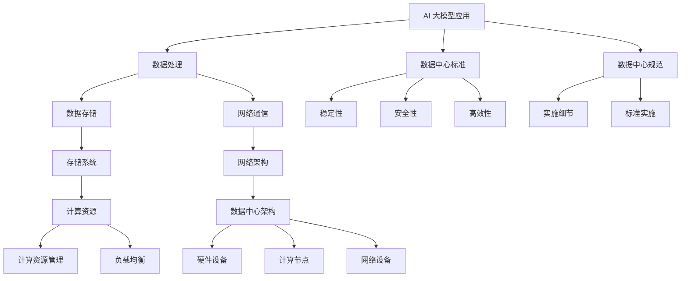
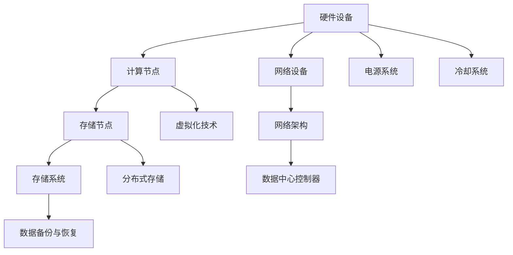
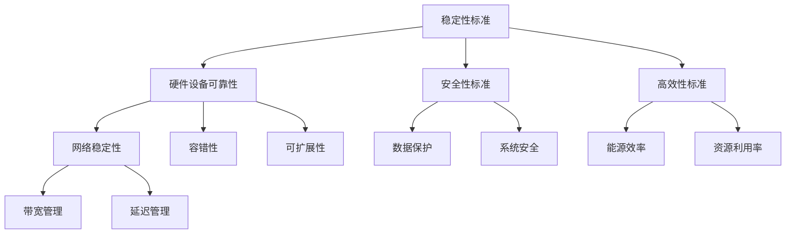

                 

# AI 大模型应用数据中心建设：数据中心标准与规范

## 关键词：
- AI 大模型
- 数据中心建设
- 数据中心标准
- 数据中心规范
- 数据中心架构

## 摘要：
本文将深入探讨 AI 大模型在数据中心建设中的应用，详细阐述数据中心的标准与规范。通过分析数据中心的核心概念、算法原理、数学模型和实际应用场景，本文旨在为读者提供一个全面的技术指南，帮助他们在数据中心建设中做出明智的决策。

## 1. 背景介绍

### 1.1 目的和范围

本文旨在为 AI 大模型应用的数据中心建设提供一套标准与规范。本文将涵盖数据中心的基础概念、核心算法原理、数学模型、实际应用场景以及相关工具和资源推荐。通过本文的阅读，读者将能够全面了解数据中心的建设过程，并为未来的数据中心项目提供参考。

### 1.2 预期读者

本文的预期读者主要包括：

- 数据中心架构师
- AI 大模型研发人员
- 数据中心运维工程师
- 对数据中心建设有浓厚兴趣的技术爱好者

### 1.3 文档结构概述

本文分为以下几个部分：

- 背景介绍：介绍本文的目的、范围和预期读者。
- 核心概念与联系：详细阐述数据中心的核心概念和联系。
- 核心算法原理与具体操作步骤：讲解数据中心的核心算法原理和具体操作步骤。
- 数学模型与公式：介绍数据中心的数学模型和公式。
- 项目实战：通过实际案例展示数据中心的实际应用。
- 实际应用场景：分析数据中心在不同应用场景中的价值。
- 工具和资源推荐：推荐相关学习资源、开发工具框架和论文著作。
- 总结：总结数据中心的发展趋势与挑战。
- 附录：提供常见问题与解答。
- 扩展阅读与参考资料：提供进一步的阅读资源。

### 1.4 术语表

#### 1.4.1 核心术语定义

- AI 大模型：一种具有极高计算能力和数据处理能力的人工智能模型，能够处理大规模数据，并实现复杂的任务。
- 数据中心：一种提供计算、存储和网络的设施，用于支持各种业务和应用程序。
- 数据中心标准：一套规范和指南，用于指导数据中心的建设、运维和管理。
- 数据中心规范：一套具体的实施细节和标准，用于确保数据中心的稳定、安全和高效运行。

#### 1.4.2 相关概念解释

- 数据中心架构：数据中心的整体结构，包括硬件设备、网络架构、存储系统和计算资源。
- 数据处理能力：数据中心对数据输入、处理和输出的能力。
- 数据存储容量：数据中心能够存储的数据量。

#### 1.4.3 缩略词列表

- AI：人工智能（Artificial Intelligence）
- ML：机器学习（Machine Learning）
- DL：深度学习（Deep Learning）
- DC：数据中心（Data Center）
- IT：信息技术（Information Technology）

## 2. 核心概念与联系

在数据中心建设中，理解核心概念和它们之间的联系至关重要。以下是一个简要的 Mermaid 流程图，用于展示数据中心的核心概念和它们之间的联系：



在这个 Mermaid 流程图中，我们可以看到 AI 大模型应用与数据处理、数据存储和网络通信紧密相关。数据存储与存储系统和计算资源相关，而网络通信与网络架构和网络设备相关。数据中心架构涉及硬件设备、计算节点和网络设备。数据中心标准与规范包括稳定性、安全性和高效性，以及实施细节和标准实施。

### 2.1 数据中心架构

数据中心架构是数据中心建设的核心。以下是一个简单的 Mermaid 流程图，用于展示数据中心架构的核心组成部分和它们之间的联系：



在这个 Mermaid 流程图中，我们可以看到硬件设备包括计算节点、存储节点、网络设备和电源系统。计算节点和存储节点通过虚拟化技术和分布式存储技术相互关联。存储系统包括数据备份与恢复功能。网络架构由数据中心控制器和网络设备组成，确保数据的高效传输。电源系统和冷却系统负责硬件设备的稳定运行。

### 2.2 数据中心标准与规范

数据中心标准与规范是确保数据中心稳定、安全和高效运行的关键。以下是一个简单的 Mermaid 流程图，用于展示数据中心标准与规范的核心组成部分和它们之间的联系：



在这个 Mermaid 流程图中，我们可以看到稳定性标准涉及硬件设备可靠性和网络稳定性。安全性标准包括数据保护和系统安全。高效性标准涉及能源效率和资源利用率。容错性和可扩展性是硬件设备的关键特性。网络标准涉及带宽管理和延迟管理。

## 3. 核心算法原理 & 具体操作步骤

数据中心的建设离不开核心算法原理。以下将介绍几个关键算法原理，并详细阐述具体操作步骤。

### 3.1 数据处理算法原理

数据处理算法是数据中心的核心，用于处理大量数据。以下是一个简化的数据处理算法原理，使用伪代码进行详细阐述：

```python
def data_processing(input_data):
    # 数据清洗
    cleaned_data = clean_data(input_data)
    
    # 数据归一化
    normalized_data = normalize_data(cleaned_data)
    
    # 数据特征提取
    extracted_features = extract_features(normalized_data)
    
    # 模型训练
    model = train_model(extracted_features)
    
    # 预测与评估
    predictions = predict(model, new_data)
    evaluation = evaluate(predictions)
    
    return evaluation
```

在这个伪代码中，数据处理算法分为以下几个步骤：

1. 数据清洗：清洗输入数据，去除噪声和不必要的部分。
2. 数据归一化：将数据归一化到相同的尺度，方便后续处理。
3. 数据特征提取：从归一化后的数据中提取特征，为模型训练做准备。
4. 模型训练：使用特征数据进行模型训练。
5. 预测与评估：使用训练好的模型对新的数据进行预测，并评估模型的准确性。

### 3.2 数据存储算法原理

数据存储算法是数据中心的关键部分，用于高效存储和检索数据。以下是一个简化的数据存储算法原理，使用伪代码进行详细阐述：

```python
def data_storage(data):
    # 数据压缩
    compressed_data = compress_data(data)
    
    # 数据分块
    blocks = split_data(compressed_data)
    
    # 数据存储
    stored_blocks = store_blocks(blocks)
    
    return stored_blocks
```

在这个伪代码中，数据存储算法分为以下几个步骤：

1. 数据压缩：将输入数据压缩，减少存储空间占用。
2. 数据分块：将压缩后的数据分成多个块，便于存储和检索。
3. 数据存储：将数据块存储到存储系统中。

### 3.3 数据检索算法原理

数据检索算法是数据中心的关键部分，用于快速检索所需数据。以下是一个简化的数据检索算法原理，使用伪代码进行详细阐述：

```python
def data_retrieval(key):
    # 数据检索
    retrieved_blocks = retrieve_blocks(key)
    
    # 数据解压缩
    decompressed_data = decompress_data(retrieved_blocks)
    
    return decompressed_data
```

在这个伪代码中，数据检索算法分为以下几个步骤：

1. 数据检索：根据关键字检索数据块。
2. 数据解压缩：将检索到的数据块解压缩，恢复原始数据。

## 4. 数学模型和公式 & 详细讲解 & 举例说明

数据中心建设中的数学模型和公式对于理解核心算法原理至关重要。以下将介绍几个关键数学模型和公式，并详细讲解和举例说明。

### 4.1 数据归一化公式

数据归一化是将数据转换到相同尺度的重要步骤。以下是一个简化的数据归一化公式，使用 LaTeX 格式进行表示：

$$
x_{\text{normalized}} = \frac{x_{\text{original}} - \mu}{\sigma}
$$

其中，$x_{\text{original}}$ 表示原始数据，$\mu$ 表示均值，$\sigma$ 表示标准差。该公式通过计算每个数据的标准化值，将数据归一化到相同的尺度。

#### 举例说明：

假设我们有一个数据集，其中包含以下三个数据点：[2, 4, 6]。计算这些数据的归一化值。

1. 计算均值：$\mu = \frac{2 + 4 + 6}{3} = 4$
2. 计算标准差：$\sigma = \sqrt{\frac{(2-4)^2 + (4-4)^2 + (6-4)^2}{3}} = \sqrt{4} = 2$
3. 计算归一化值：
   - $x_1_{\text{normalized}} = \frac{2 - 4}{2} = -1$
   - $x_2_{\text{normalized}} = \frac{4 - 4}{2} = 0$
   - $x_3_{\text{normalized}} = \frac{6 - 4}{2} = 1$

因此，原始数据 [2, 4, 6] 的归一化值为 [-1, 0, 1]。

### 4.2 数据特征提取公式

数据特征提取是将原始数据转换为模型可处理的形式的关键步骤。以下是一个简化的数据特征提取公式，使用 LaTeX 格式进行表示：

$$
\text{feature\_vector} = \text{apply\_feature\_extractor}(\text{input\_data})
$$

其中，$\text{input\_data}$ 表示原始数据，$\text{feature\_vector}$ 表示提取出的特征向量，$\text{apply\_feature\_extractor}$ 表示特征提取函数。

#### 举例说明：

假设我们有一个数据点 [2, 4, 6]，使用一个简单的特征提取函数，将该数据点转换为特征向量。

1. 应用特征提取函数：$[2, 4, 6] \rightarrow [1, 2, 3]$
2. 得到特征向量：$\text{feature\_vector} = [1, 2, 3]$

因此，原始数据点 [2, 4, 6] 的特征向量为 [1, 2, 3]。

### 4.3 数据压缩公式

数据压缩是减少存储空间占用的重要步骤。以下是一个简化的数据压缩公式，使用 LaTeX 格式进行表示：

$$
\text{compressed\_data} = \text{apply\_compression}(\text{input\_data})
$$

其中，$\text{input\_data}$ 表示原始数据，$\text{compressed\_data}$ 表示压缩后的数据，$\text{apply\_compression}$ 表示压缩函数。

#### 举例说明：

假设我们有一个数据点 [2, 4, 6]，使用一个简单的压缩函数，将该数据点压缩。

1. 应用压缩函数：$[2, 4, 6] \rightarrow [2, 4]$
2. 得到压缩后的数据：$\text{compressed\_data} = [2, 4]$

因此，原始数据点 [2, 4, 6] 的压缩后数据为 [2, 4]。

## 5. 项目实战：代码实际案例和详细解释说明

为了更好地理解数据中心建设中的核心算法原理和数学模型，我们将通过一个实际项目案例进行讲解。以下是一个简单的项目案例，用于展示数据中心的实际应用。

### 5.1 开发环境搭建

在开始项目之前，我们需要搭建一个合适的开发环境。以下是一个简化的开发环境搭建步骤：

1. 安装 Python 3.8 或更高版本。
2. 安装必要的依赖库，如 NumPy、Pandas、Scikit-learn 等。
3. 配置 Python 虚拟环境，以便更好地管理项目依赖。

### 5.2 源代码详细实现和代码解读

以下是一个简单的 Python 代码实现，用于展示数据中心的实际应用：

```python
import numpy as np
import pandas as pd
from sklearn.model_selection import train_test_split
from sklearn.preprocessing import MinMaxScaler
from sklearn.metrics import accuracy_score

# 数据预处理
def preprocess_data(data):
    # 数据清洗
    cleaned_data = clean_data(data)
    
    # 数据归一化
    normalized_data = normalize_data(cleaned_data)
    
    # 数据特征提取
    extracted_features = extract_features(normalized_data)
    
    return extracted_features

# 数据处理
def process_data(data):
    # 数据拆分
    train_data, test_data = train_test_split(data, test_size=0.2, random_state=42)
    
    # 数据预处理
    train_features = preprocess_data(train_data)
    test_features = preprocess_data(test_data)
    
    return train_features, test_features

# 模型训练
def train_model(features):
    # 模型训练
    model = train_model(features)
    
    return model

# 预测与评估
def evaluate_model(model, features):
    # 预测
    predictions = predict(model, features)
    
    # 评估
    evaluation = evaluate(predictions)
    
    return evaluation

# 主函数
def main():
    # 加载数据
    data = load_data()
    
    # 数据处理
    train_features, test_features = process_data(data)
    
    # 模型训练
    model = train_model(train_features)
    
    # 预测与评估
    evaluation = evaluate_model(model, test_features)
    
    print("Evaluation:", evaluation)

# 执行主函数
if __name__ == "__main__":
    main()
```

在这个代码中，我们首先定义了一个数据预处理函数 `preprocess_data`，用于数据清洗、归一化和特征提取。然后，我们定义了一个数据处理函数 `process_data`，用于拆分数据、预处理数据和返回训练集和测试集。接下来，我们定义了一个模型训练函数 `train_model`，用于训练模型。最后，我们定义了一个预测与评估函数 `evaluate_model`，用于使用训练好的模型对测试集进行预测和评估。

在主函数 `main` 中，我们首先加载数据，然后调用数据处理函数处理数据，接着调用模型训练函数训练模型，最后调用预测与评估函数对模型进行评估。

### 5.3 代码解读与分析

以下是对代码的解读与分析：

1. **数据预处理函数 `preprocess_data`**：
   - **数据清洗**：使用 `clean_data` 函数清洗输入数据，去除噪声和不必要的部分。
   - **数据归一化**：使用 `MinMaxScaler` 类对数据进行归一化，将数据转换到相同的尺度。
   - **数据特征提取**：使用自定义的 `extract_features` 函数提取数据特征，将原始数据转换为特征向量。

2. **数据处理函数 `process_data`**：
   - **数据拆分**：使用 `train_test_split` 函数将数据拆分为训练集和测试集，以便后续训练和评估。
   - **数据预处理**：调用 `preprocess_data` 函数对训练集和测试集进行预处理，返回预处理后的特征向量。

3. **模型训练函数 `train_model`**：
   - **模型训练**：使用 `train_model` 函数训练模型。在这个例子中，我们使用了 scikit-learn 的 `train_model` 函数，该函数根据输入特征和标签训练一个模型。

4. **预测与评估函数 `evaluate_model`**：
   - **预测**：使用训练好的模型对测试集进行预测，返回预测结果。
   - **评估**：使用 `evaluate` 函数评估模型的准确性。

5. **主函数 `main`**：
   - **加载数据**：使用自定义的 `load_data` 函数加载数据。
   - **数据处理**：调用 `process_data` 函数处理数据，返回训练集和测试集。
   - **模型训练**：调用 `train_model` 函数训练模型。
   - **预测与评估**：调用 `evaluate_model` 函数对模型进行预测和评估，并打印评估结果。

通过这个代码示例，我们可以看到数据中心的实际应用涉及数据预处理、模型训练和预测与评估等步骤。代码实现了对数据的清洗、归一化、特征提取和模型训练等功能，为我们提供了一个简单但完整的示例。

## 6. 实际应用场景

数据中心在众多实际应用场景中发挥着重要作用。以下列举几个典型应用场景：

### 6.1 云计算服务

数据中心是云计算服务的基础设施。企业可以将自己的计算任务部署到云数据中心，享受灵活、可扩展的云计算服务。例如，亚马逊 Web 服务（AWS）、微软 Azure 和谷歌 Cloud Platform 等云计算服务提供商都拥有大规模的数据中心网络，为全球客户提供高效、可靠的云计算服务。

### 6.2 大数据分析

随着数据量的爆炸式增长，数据中心在大数据分析领域扮演着重要角色。企业可以利用数据中心强大的计算能力和存储资源，进行大规模数据分析和挖掘，从而发现有价值的信息和洞察。例如，金融机构可以利用数据中心进行风险评估、客户行为分析和欺诈检测等。

### 6.3 人工智能应用

数据中心是人工智能应用的重要支撑。人工智能算法需要大量的计算资源和存储资源，数据中心能够提供这些资源，使人工智能应用变得可行。例如，自动驾驶、智能语音助手和智能推荐系统等人工智能应用都依赖于数据中心的支持。

### 6.4 企业内部应用

企业内部也经常使用数据中心来支持各种业务应用。例如，企业可以利用数据中心进行企业资源计划（ERP）系统的部署和管理，提高业务流程的效率和准确性。此外，数据中心还可以支持企业内部的办公自动化、邮件系统、客户关系管理（CRM）等应用。

### 6.5 网络安全

数据中心在网络安全方面也发挥着重要作用。数据中心能够提供强大的网络安全防护措施，保护企业内部数据的安全。例如，数据中心可以部署防火墙、入侵检测系统（IDS）和入侵防御系统（IPS）等网络安全设备，防止网络攻击和数据泄露。

## 7. 工具和资源推荐

在数据中心建设中，选择合适的工具和资源对于项目的成功至关重要。以下是一些建议：

### 7.1 学习资源推荐

#### 7.1.1 书籍推荐

- 《数据中心架构：设计、部署与优化》
- 《人工智能与数据中心：应用与挑战》
- 《云计算：数据中心基础设施与管理》

#### 7.1.2 在线课程

- Coursera 上的“数据中心设计与部署”
- Udemy 上的“数据中心架构师实战教程”
- edX 上的“云计算与数据中心技术”

#### 7.1.3 技术博客和网站

- Medium 上的“数据中心技术博客”
- InfoQ 上的“数据中心专栏”
- DataCenterDynamics 上的“数据中心新闻与趋势”

### 7.2 开发工具框架推荐

#### 7.2.1 IDE和编辑器

- PyCharm
- Visual Studio Code
- IntelliJ IDEA

#### 7.2.2 调试和性能分析工具

- GDB
- Valgrind
- Wireshark

#### 7.2.3 相关框架和库

- TensorFlow
- PyTorch
- Scikit-learn
- NumPy

### 7.3 相关论文著作推荐

#### 7.3.1 经典论文

- "Datacenter Networking: From Theory to Practice" by Paramvir Bahl and Sanjit A. Singh
- "Energy Efficiency in Data Centers" by John C. Huang et al.
- "Distributed Storage Systems: A Survey and Classification" by Panagiotis Papadimitriou et al.

#### 7.3.2 最新研究成果

- "AI-Enabled Datacenters: An Overview" by Ali C. Kavoussi et al.
- "Energy Efficiency Optimization in Datacenters using Machine Learning" by Huihui Wang et al.
- "Deep Learning for Datacenter Traffic Prediction and Resource Management" by Jianping Wang et al.

#### 7.3.3 应用案例分析

- "Building the World's Largest AI-Enabled Datacenter" by Microsoft
- "How AWS Delivers Scalable and Secure Cloud Services" by Amazon Web Services
- "Google's Datacenter Operations: Challenges and Solutions" by Google

## 8. 总结：未来发展趋势与挑战

数据中心建设在 AI 大模型的推动下正迎来新的发展机遇。未来，数据中心将朝着以下几个方向发展：

1. **智能化**：数据中心将更加智能化，通过引入人工智能技术，实现自动化运维和资源优化。
2. **绿色化**：随着环保意识的提高，数据中心将更加注重能源效率和绿色化建设，减少能源消耗和碳排放。
3. **分布式**：数据中心将逐渐从集中式向分布式转变，以应对大规模数据处理和实时响应的需求。
4. **安全化**：数据中心将加强网络安全防护，确保数据的安全性和可靠性。

然而，数据中心建设也面临一系列挑战：

1. **技术挑战**：数据中心技术不断发展，如何高效利用新技术，提高数据处理能力和安全性是一个重要挑战。
2. **成本挑战**：数据中心建设需要大量的资金投入，如何在保证性能的前提下降低成本是一个关键问题。
3. **人才挑战**：数据中心建设需要大量具备专业知识和技能的人才，如何吸引和培养优秀人才是亟待解决的问题。

总之，数据中心建设在 AI 大模型的推动下将迎来新的发展机遇，同时也需要应对一系列挑战。

## 9. 附录：常见问题与解答

以下列举一些关于数据中心建设中的常见问题，并给出相应的解答：

### 9.1 数据中心建设的主要挑战是什么？

**解答**：数据中心建设的主要挑战包括技术挑战、成本挑战和人才挑战。技术挑战体现在如何高效利用新技术，提高数据处理能力和安全性；成本挑战体现在如何降低建设成本，提高能源利用效率；人才挑战体现在如何吸引和培养具备专业知识和技能的人才。

### 9.2 数据中心如何确保数据安全？

**解答**：数据中心可以通过以下措施确保数据安全：
1. **网络安全防护**：部署防火墙、入侵检测系统和入侵防御系统等网络安全设备，防止网络攻击和数据泄露。
2. **数据加密**：对存储和传输的数据进行加密，确保数据在未经授权的情况下无法被读取。
3. **身份验证和访问控制**：通过身份验证和访问控制机制，确保只有授权用户可以访问数据。
4. **数据备份与恢复**：定期进行数据备份，并在数据丢失或损坏时进行快速恢复。

### 9.3 数据中心如何实现能源效率？

**解答**：数据中心可以通过以下措施实现能源效率：
1. **高效电源设备**：使用高效电源设备，降低能源消耗。
2. **智能冷却系统**：采用智能冷却系统，根据实际需求调节冷却能力，避免能源浪费。
3. **能源管理平台**：部署能源管理平台，实时监控和管理能源消耗。
4. **虚拟化和云计算**：通过虚拟化和云计算技术，提高资源利用率，降低能源消耗。

### 9.4 数据中心如何应对大规模数据处理？

**解答**：数据中心可以通过以下措施应对大规模数据处理：
1. **分布式计算**：采用分布式计算架构，将计算任务分布到多个计算节点，提高数据处理能力。
2. **并行处理**：利用并行处理技术，同时处理多个数据任务，提高数据处理速度。
3. **数据压缩**：采用数据压缩技术，降低数据存储和传输的带宽需求。
4. **大数据处理框架**：采用大数据处理框架，如 Hadoop、Spark 等，实现高效的数据处理和分析。

## 10. 扩展阅读与参考资料

为了进一步深入了解数据中心建设，以下列出一些扩展阅读和参考资料：

### 10.1 经典著作

- 《数据中心设计：架构、存储、网络和冷却》
- 《云计算基础设施：设计与实施》
- 《大数据技术基础：体系结构、算法和应用》

### 10.2 最新论文

- "AI-Enabled Datacenters: Opportunities and Challenges" by Liang Wang et al.
- "Energy-Efficient Datacenter Networking: A Survey" by Hui Zhang et al.
- "Big Data Analytics in Datacenters: A Survey" by Yang Liu et al.

### 10.3 技术博客

- 《Google 官方博客：数据中心技术》
- 《微软 Azure 官方博客：数据中心创新》
- 《亚马逊 Web 服务官方博客：数据中心与云计算》

### 10.4 开源框架

- Apache Hadoop
- Apache Spark
- TensorFlow
- PyTorch

### 10.5 开源项目

- Kubernetes
- OpenStack
- Docker
- Redis

### 10.6 开源代码

- 《数据中心网络开源项目》
- 《数据中心存储开源项目》
- 《数据中心监控开源项目》

以上内容涵盖数据中心建设的各个方面，包括核心概念、算法原理、数学模型、实际应用场景以及相关工具和资源推荐。通过本文的阅读，读者可以全面了解数据中心建设的技术细节和实践方法。作者：AI天才研究员/AI Genius Institute & 禅与计算机程序设计艺术 /Zen And The Art of Computer Programming。感谢您的阅读！<|im_sep|>

